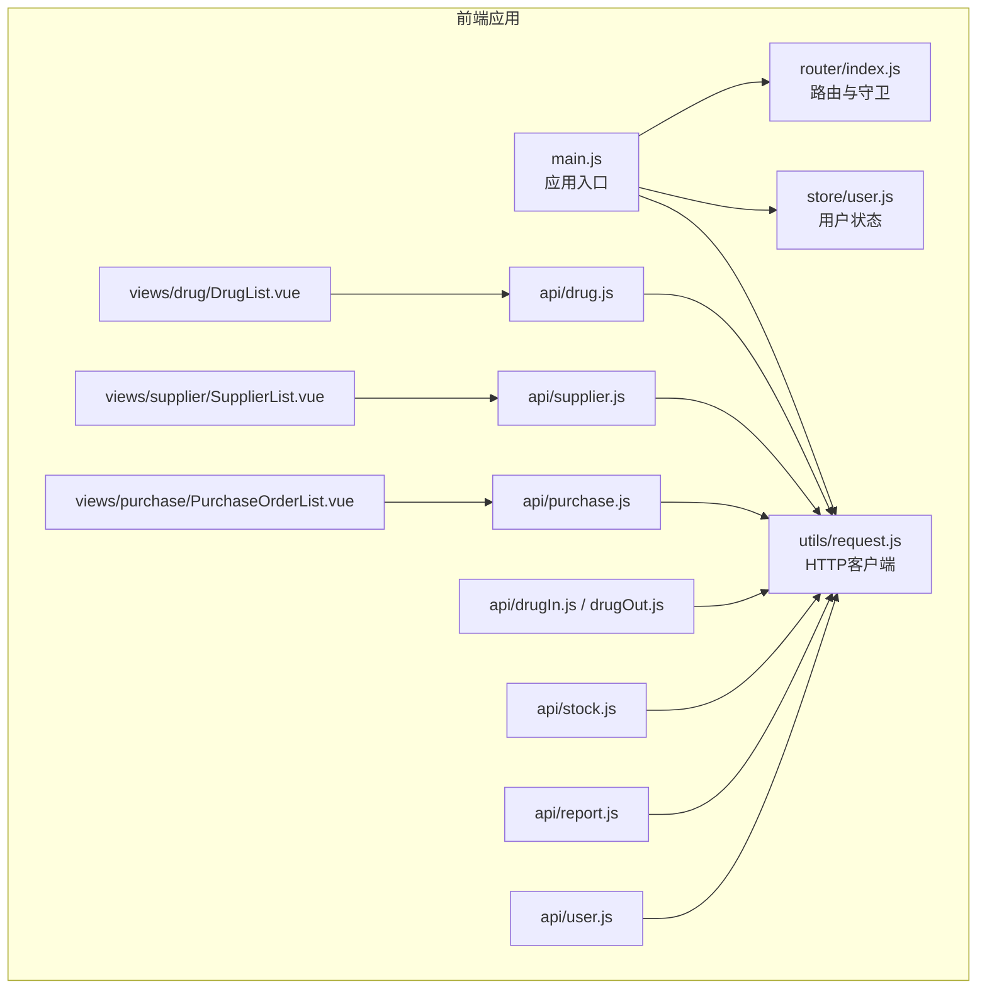
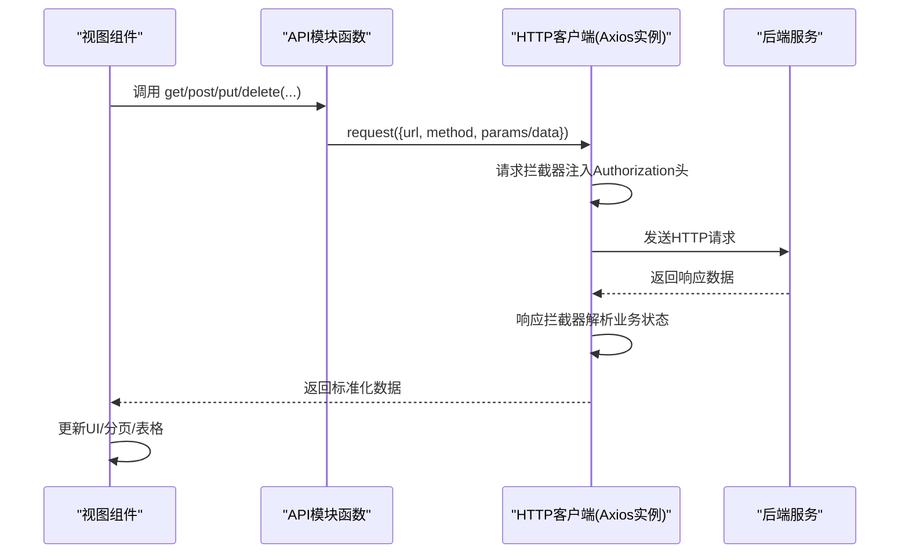
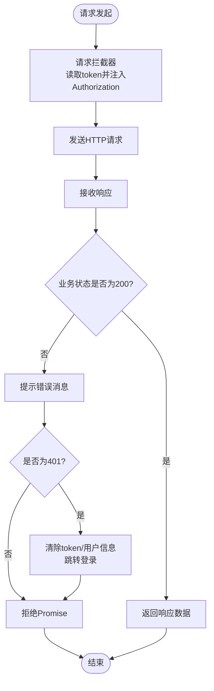
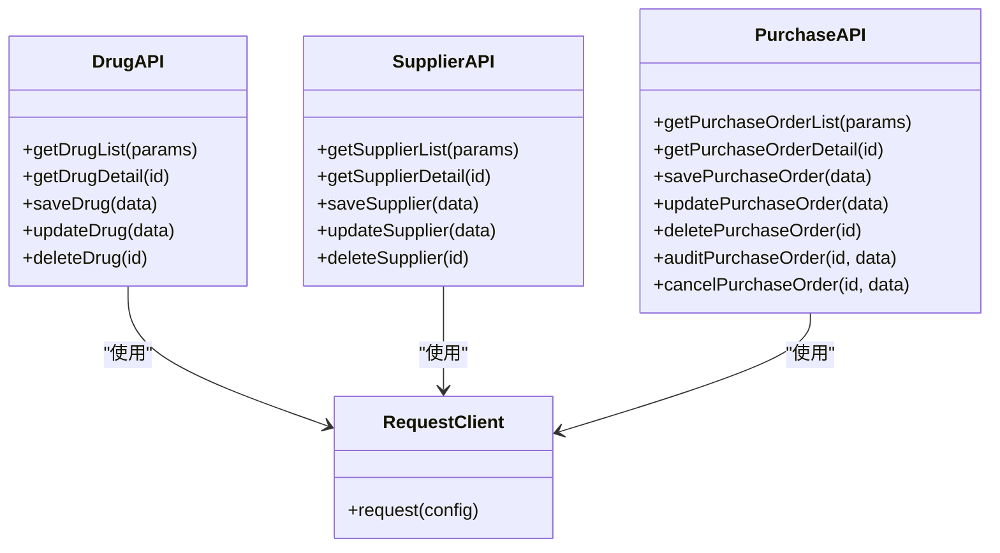
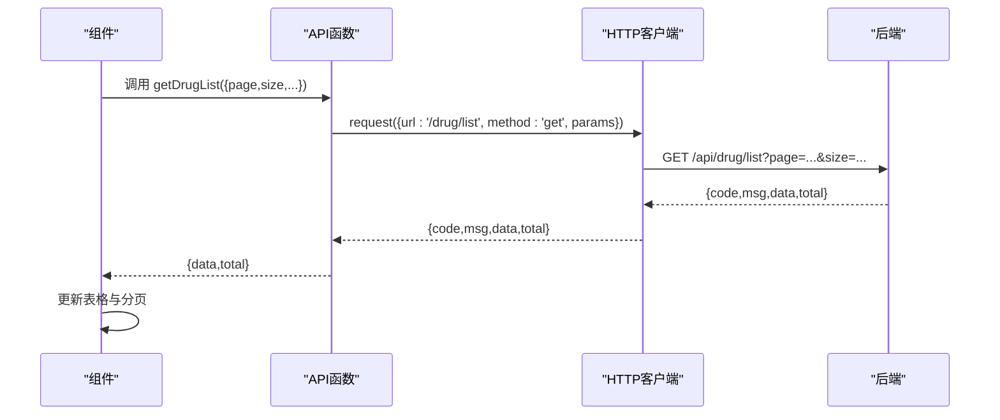
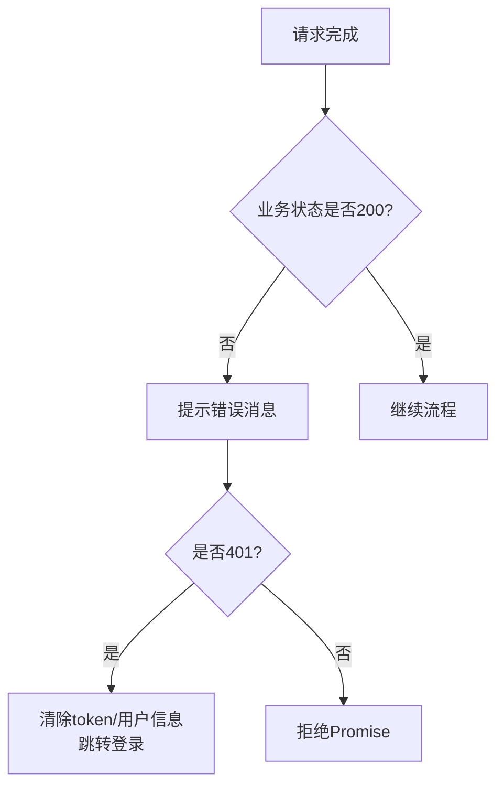
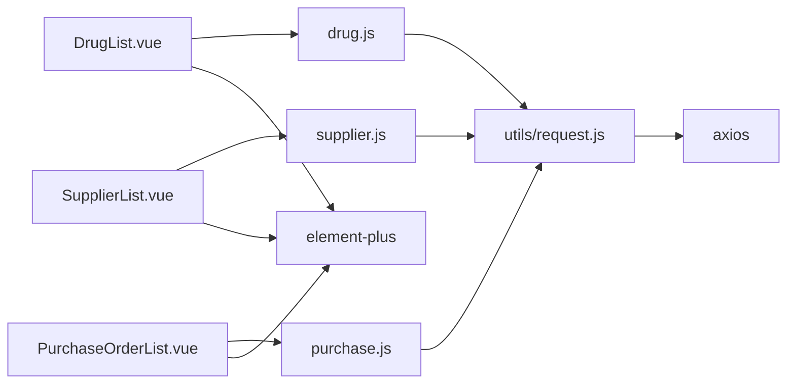

# API接口集成

<cite>
**本文引用的文件**
- [request.js](file://drug-front/src/utils/request.js)
- [drug.js](file://drug-front/src/api/drug.js)
- [supplier.js](file://drug-front/src/api/supplier.js)
- [purchase.js](file://drug-front/src/api/purchase.js)
- [drugIn.js](file://drug-front/src/api/drugIn.js)
- [drugOut.js](file://drug-front/src/api/drugOut.js)
- [stock.js](file://drug-front/src/api/stock.js)
- [report.js](file://drug-front/src/api/report.js)
- [user.js](file://drug-front/src/api/user.js)
- [DrugList.vue](file://drug-front/src/views/drug/DrugList.vue)
- [SupplierList.vue](file://drug-front/src/views/supplier/SupplierList.vue)
- [PurchaseOrderList.vue](file://drug-front/src/views/purchase/PurchaseOrderList.vue)
- [index.js](file://drug-front/src/router/index.js)
- [main.js](file://drug-front/src/main.js)
- [package.json](file://drug-front/package.json)
</cite>

## 目录
1. [简介](#简介)
2. [项目结构](#项目结构)
3. [核心组件](#核心组件)
4. [架构总览](#架构总览)
5. [详细组件分析](#详细组件分析)
6. [依赖关系分析](#依赖关系分析)
7. [性能考虑](#性能考虑)
8. [故障排查指南](#故障排查指南)
9. [结论](#结论)
10. [附录](#附录)

## 简介
本文件面向“API接口集成”的目标，系统性梳理前端与后端交互的设计与实现，重点覆盖以下方面：
- API模块组织：drug.js、supplier.js、purchase.js 等模块的职责划分与调用方式
- HTTP客户端配置：Axios实例创建、请求/响应拦截器、统一鉴权头注入
- API调用模式：GET/POST/PUT/DELETE 的封装、参数传递与响应处理
- 错误处理机制：网络错误、业务错误、异常捕获与路由跳转
- 数据格式处理：请求数据转换、响应数据解析、数据校验
- API集成示例：在具体视图组件中的使用范式
- 接口文档规范、版本管理与缓存策略建议

## 项目结构
前端采用 Vue 3 + Element Plus 架构，API层以功能域模块化组织，HTTP客户端集中配置，路由与全局状态贯穿认证与权限控制。

图表来源
- [main.js:1-26](file://drug-front/src/main.js#L1-L26)
- [index.js:1-115](file://drug-front/src/router/index.js#L1-L115)
- [request.js:1-56](file://drug-front/src/utils/request.js#L1-L56)
- [drug.js:1-45](file://drug-front/src/api/drug.js#L1-L45)
- [supplier.js:1-45](file://drug-front/src/api/supplier.js#L1-L45)
- [purchase.js:1-63](file://drug-front/src/api/purchase.js#L1-L63)
- [drugIn.js:1-36](file://drug-front/src/api/drugIn.js#L1-L36)
- [drugOut.js:1-36](file://drug-front/src/api/drugOut.js#L1-L36)
- [stock.js:1-37](file://drug-front/src/api/stock.js#L1-L37)
- [report.js:1-38](file://drug-front/src/api/report.js#L1-L38)
- [user.js:1-71](file://drug-front/src/api/user.js#L1-L71)
- [DrugList.vue:1-426](file://drug-front/src/views/drug/DrugList.vue#L1-L426)
- [SupplierList.vue:1-302](file://drug-front/src/views/supplier/SupplierList.vue#L1-L302)
- [PurchaseOrderList.vue:1-650](file://drug-front/src/views/purchase/PurchaseOrderList.vue#L1-L650)

章节来源
- [main.js:1-26](file://drug-front/src/main.js#L1-L26)
- [index.js:1-115](file://drug-front/src/router/index.js#L1-L115)

## 核心组件
- HTTP客户端与拦截器
  - Axios实例：基础URL、超时配置
  - 请求拦截器：自动注入 Authorization Bearer Token
  - 响应拦截器：统一业务状态判断、错误提示、401未授权跳转登录
- API模块
  - 按领域拆分：drug、supplier、purchase、drugIn、drugOut、stock、report、user
  - 统一封装：get/post/put/delete，支持params与data传参
- 视图组件
  - 在组件中直接调用API模块函数，完成数据加载、表单提交、分页与搜索
  - 使用Element Plus进行UI反馈与确认对话框

章节来源
- [request.js:1-56](file://drug-front/src/utils/request.js#L1-L56)
- [drug.js:1-45](file://drug-front/src/api/drug.js#L1-L45)
- [supplier.js:1-45](file://drug-front/src/api/supplier.js#L1-L45)
- [purchase.js:1-63](file://drug-front/src/api/purchase.js#L1-L63)
- [drugIn.js:1-36](file://drug-front/src/api/drugIn.js#L1-L36)
- [drugOut.js:1-36](file://drug-front/src/api/drugOut.js#L1-L36)
- [stock.js:1-37](file://drug-front/src/api/stock.js#L1-L37)
- [report.js:1-38](file://drug-front/src/api/report.js#L1-L38)
- [user.js:1-71](file://drug-front/src/api/user.js#L1-L71)

## 架构总览
前后端交互遵循“视图组件 -> API模块 -> HTTP客户端 -> 后端服务”的链路，统一通过Axios实例与拦截器处理认证与错误。

图表来源
- [request.js:12-53](file://drug-front/src/utils/request.js#L12-L53)
- [drug.js:4-44](file://drug-front/src/api/drug.js#L4-L44)
- [purchase.js:4-62](file://drug-front/src/api/purchase.js#L4-L62)
- [DrugList.vue:282-297](file://drug-front/src/views/drug/DrugList.vue#L282-L297)
- [PurchaseOrderList.vue:410-426](file://drug-front/src/views/purchase/PurchaseOrderList.vue#L410-L426)

## 详细组件分析

### HTTP客户端与拦截器（request.js）
- 实例创建
  - 基础URL指向后端接口根路径
  - 超时时间设定为15秒
- 请求拦截器
  - 从本地存储读取token并写入Authorization头
  - 异常时打印错误并拒绝请求
- 响应拦截器
  - 读取后端返回的业务状态字段
  - 非200时弹出错误消息，401时清理本地凭证并跳转登录
  - 正常时透传响应数据供上层使用

图表来源
- [request.js:12-53](file://drug-front/src/utils/request.js#L12-L53)

章节来源
- [request.js:1-56](file://drug-front/src/utils/request.js#L1-L56)

### API模块设计（drug.js、supplier.js、purchase.js 等）
- 设计原则
  - 每个模块聚焦单一实体或业务域
  - 统一封装 CRUD 与特定动作（如采购审核/作废）
  - 参数传递：查询参数使用params；请求体使用data
- 典型方法
  - GET：列表/详情
  - POST：新增
  - PUT：修改
  - DELETE：删除
  - 特殊动作：如采购审核、作废等扩展接口

图表来源
- [drug.js:1-45](file://drug-front/src/api/drug.js#L1-L45)
- [supplier.js:1-45](file://drug-front/src/api/supplier.js#L1-L45)
- [purchase.js:1-63](file://drug-front/src/api/purchase.js#L1-L63)
- [request.js:1-56](file://drug-front/src/utils/request.js#L1-L56)

章节来源
- [drug.js:1-45](file://drug-front/src/api/drug.js#L1-L45)
- [supplier.js:1-45](file://drug-front/src/api/supplier.js#L1-L45)
- [purchase.js:1-63](file://drug-front/src/api/purchase.js#L1-L63)

### API调用模式与参数传递
- GET/POST/PUT/DELETE 封装
  - GET：通过params传入分页与筛选条件
  - POST/PUT：通过data传入请求体
  - DELETE：通过路径参数传入主键
- 参数与响应处理
  - 组件内组装分页与搜索参数，调用API函数
  - API函数内部将参数映射到Axios配置
  - 响应拦截器统一处理业务状态，组件仅处理UI逻辑

图表来源
- [drug.js:4-10](file://drug-front/src/api/drug.js#L4-L10)
- [request.js:28-47](file://drug-front/src/utils/request.js#L28-L47)
- [DrugList.vue:282-297](file://drug-front/src/views/drug/DrugList.vue#L282-L297)

章节来源
- [drug.js:4-44](file://drug-front/src/api/drug.js#L4-L44)
- [DrugList.vue:282-297](file://drug-front/src/views/drug/DrugList.vue#L282-L297)

### 错误处理机制
- 网络错误
  - 响应拦截器捕获异常并提示网络错误
- 业务错误
  - 响应拦截器根据业务状态码提示msg
  - 401未授权：清理本地凭证并跳转登录
- 异常捕获
  - 组件内使用try/catch与ElMessageBox确认对话框处理用户操作
  - 对于可忽略的“取消”操作，避免重复日志输出

图表来源
- [request.js:28-53](file://drug-front/src/utils/request.js#L28-L53)

章节来源
- [request.js:28-53](file://drug-front/src/utils/request.js#L28-L53)
- [DrugList.vue:335-350](file://drug-front/src/views/drug/DrugList.vue#L335-L350)
- [PurchaseOrderList.vue:498-514](file://drug-front/src/views/purchase/PurchaseOrderList.vue#L498-L514)

### 数据格式处理与验证
- 请求数据转换
  - 组件内对表单字段进行输入校验与格式化（如金额保留两位、数量最小值）
  - 计算字段（如小计金额）在组件内计算后随请求体发送
- 响应数据解析
  - 统一从response.data中读取data与total等字段
  - 组件负责渲染与展示
- 数据验证
  - 表单级校验：Element Plus表单规则
  - 业务级校验：组件内对必填项、范围、关联关系进行检查

章节来源
- [DrugList.vue:259-269](file://drug-front/src/views/drug/DrugList.vue#L259-L269)
- [PurchaseOrderList.vue:577-623](file://drug-front/src/views/purchase/PurchaseOrderList.vue#L577-L623)

### API集成示例与使用范式
- 药品管理
  - 列表加载：getDrugList + 分页参数
  - 新增/编辑：saveDrug/updateDrug
  - 删除：deleteDrug + ElMessageBox确认
- 供应商管理
  - 列表加载：getSupplierList
  - 新增/编辑/删除：saveSupplier/updateSupplier/deleteSupplier
- 采购管理
  - 列表加载：getPurchaseOrderList
  - 详情查看：getPurchaseOrderDetail
  - 审核/作废：auditPurchaseOrder/cancelPurchaseOrder
  - 新建：savePurchaseOrder（含明细与金额计算）

章节来源
- [DrugList.vue:211-397](file://drug-front/src/views/drug/DrugList.vue#L211-L397)
- [SupplierList.vue:129-276](file://drug-front/src/views/supplier/SupplierList.vue#L129-L276)
- [PurchaseOrderList.vue:307-638](file://drug-front/src/views/purchase/PurchaseOrderList.vue#L307-L638)

### Mock数据与开发调试
- 开发阶段建议
  - 使用浏览器插件或本地代理模拟后端接口，便于离线调试
  - 在响应拦截器中增加本地开关，快速切换真实/Mock行为
  - 为关键API增加本地缓存，减少重复请求
- 调试技巧
  - 打印请求与响应的关键字段（如URL、params、data、code、msg）
  - 使用浏览器Network面板观察请求头与状态码
  - 在组件中增加加载态与错误态的可视化提示

（本节为通用实践建议，不直接分析具体文件）

## 依赖关系分析
- 模块耦合
  - 视图组件仅依赖API模块，API模块依赖HTTP客户端，降低耦合度
  - 各API模块彼此独立，便于维护与扩展
- 外部依赖
  - Axios用于HTTP通信
  - Element Plus用于UI与消息提示
  - Vue Router与Pinia用于路由与状态管理

图表来源
- [DrugList.vue:211](file://drug-front/src/views/drug/DrugList.vue#L211)
- [SupplierList.vue:129](file://drug-front/src/views/supplier/SupplierList.vue#L129)
- [PurchaseOrderList.vue:307](file://drug-front/src/views/purchase/PurchaseOrderList.vue#L307)
- [drug.js:1](file://drug-front/src/api/drug.js#L1)
- [supplier.js:1](file://drug-front/src/api/supplier.js#L1)
- [purchase.js:1](file://drug-front/src/api/purchase.js#L1)
- [request.js:1](file://drug-front/src/utils/request.js#L1)
- [package.json:13-21](file://drug-front/package.json#L13-L21)

章节来源
- [package.json:13-21](file://drug-front/package.json#L13-L21)

## 性能考虑
- 请求合并与去抖
  - 对高频搜索场景，可在组件内加入防抖逻辑，减少请求次数
- 分页与懒加载
  - 合理设置分页大小，避免一次性加载过多数据
- 缓存策略
  - 对只读列表与静态字典（如供应商、药品）可做内存缓存
  - 对频繁访问的详情接口可做短期缓存
- 图标与资源
  - 使用按需引入减少首屏体积

（本节为通用性能建议，不直接分析具体文件）

## 故障排查指南
- 登录态失效
  - 现象：出现401错误并被重定向至登录页
  - 处理：确认本地token是否存在；检查拦截器是否正确注入头
- 网络异常
  - 现象：提示网络错误
  - 处理：检查基础URL与跨域配置；确认后端服务可用
- 业务错误
  - 现象：提示msg但状态码非200
  - 处理：根据后端返回的msg定位问题；必要时打印完整响应
- 组件无数据
  - 现象：表格为空或total为0
  - 处理：检查分页参数与筛选条件；确认API返回结构一致

章节来源
- [request.js:28-53](file://drug-front/src/utils/request.js#L28-L53)
- [DrugList.vue:282-297](file://drug-front/src/views/drug/DrugList.vue#L282-L297)
- [PurchaseOrderList.vue:410-426](file://drug-front/src/views/purchase/PurchaseOrderList.vue#L410-L426)

## 结论
该API集成方案通过“视图组件 -> API模块 -> HTTP客户端”的清晰分层，实现了统一的认证、错误处理与数据流转。模块化设计使各业务域职责明确，易于扩展与维护。配合合理的缓存与性能优化策略，可进一步提升用户体验与系统稳定性。

## 附录

### 接口文档规范与版本管理
- 规范建议
  - 统一响应结构：{ code, msg, data, total }
  - 统一鉴权：Authorization: Bearer <token>
  - 统一分页：page、size
  - 统一时间格式：ISO字符串
- 版本管理
  - 基础URL加版本前缀：/api/v1
  - 逐步迁移旧接口，保持向后兼容或提供迁移指引

（本节为通用规范建议，不直接分析具体文件）

### 缓存策略
- 内存缓存：对只读列表与静态数据做短期缓存
- 会话缓存：登录后缓存用户信息与权限
- 服务端缓存：合理设置ETag/Last-Modified，减少带宽

（本节为通用策略建议，不直接分析具体文件）