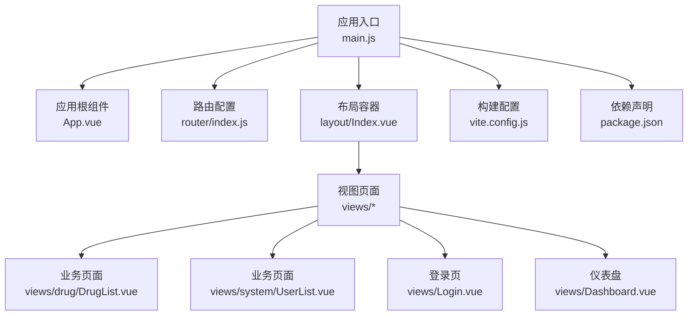
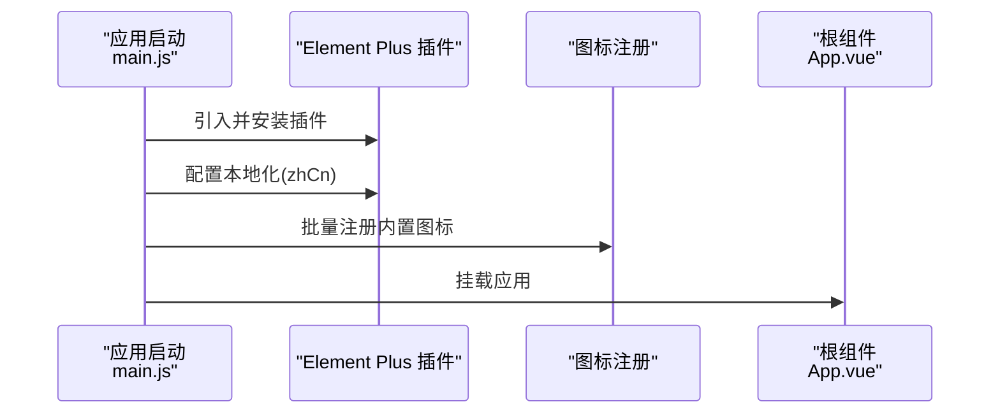
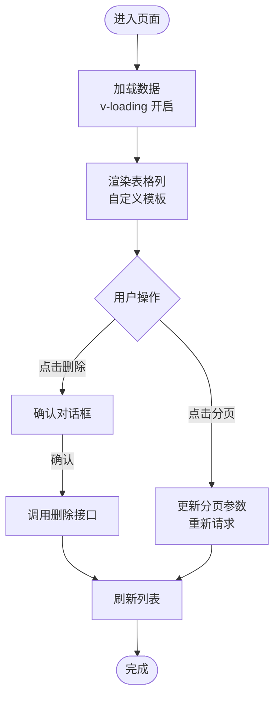
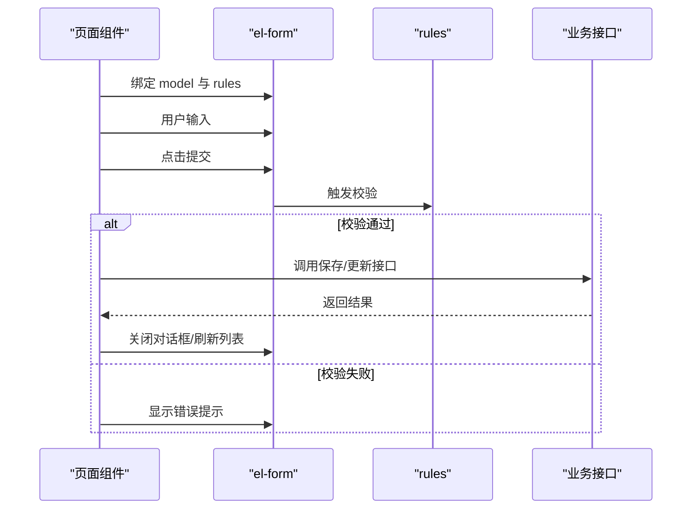
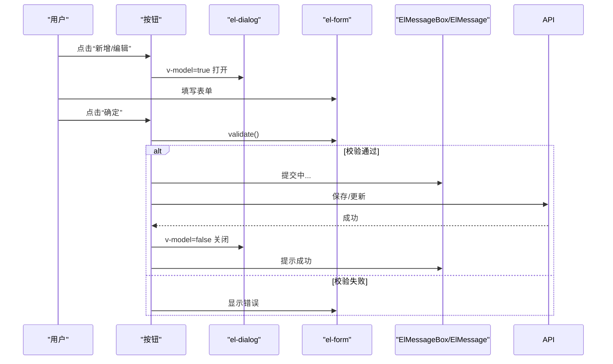
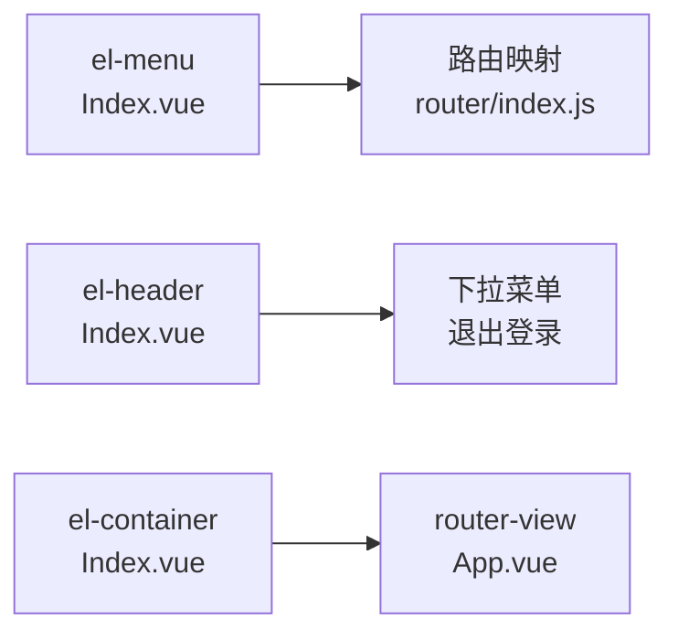
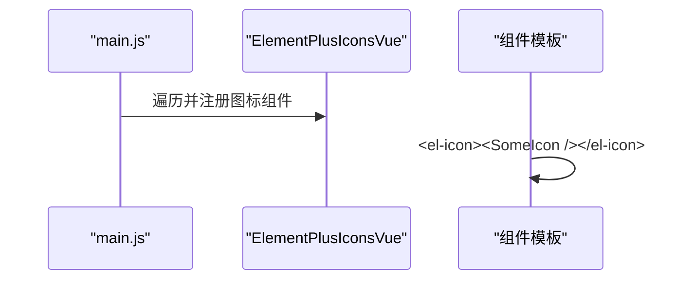
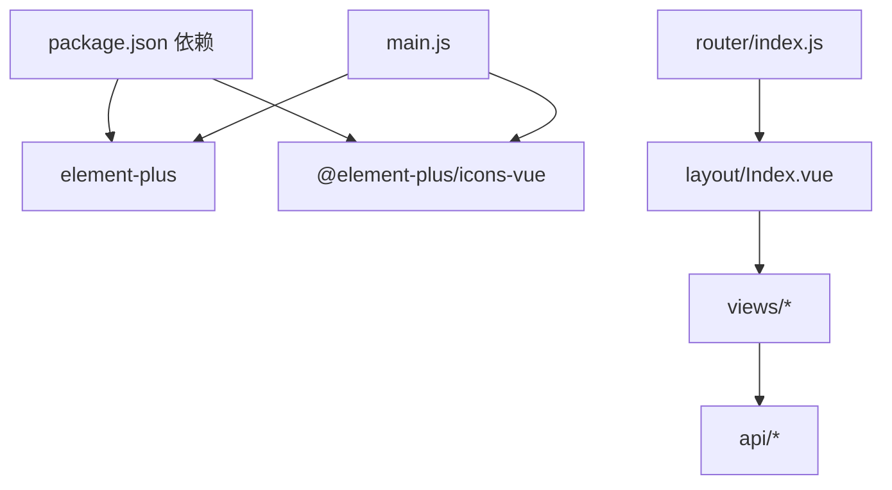

# UI组件(Element Plus)

<cite>
**本文引用的文件**
- [package.json](file://drug-front/package.json)
- [main.js](file://drug-front/src/main.js)
- [App.vue](file://drug-front/src/App.vue)
- [vite.config.js](file://drug-front/vite.config.js)
- [Dashboard.vue](file://drug-front/src/views/Dashboard.vue)
- [DrugList.vue](file://drug-front/src/views/drug/DrugList.vue)
- [UserList.vue](file://drug-front/src/views/system/UserList.vue)
- [Index.vue](file://drug-front/src/layout/Index.vue)
- [Login.vue](file://drug-front/src/views/Login.vue)
- [drug.js](file://drug-front/src/api/drug.js)
- [index.js](file://drug-front/src/router/index.js)
</cite>

## 目录
1. [简介](#简介)
2. [项目结构](#项目结构)
3. [核心组件](#核心组件)
4. [架构总览](#架构总览)
5. [组件详解](#组件详解)
6. [依赖关系分析](#依赖关系分析)
7. [性能与体验](#性能与体验)
8. [故障排查指南](#故障排查指南)
9. [结论](#结论)
10. [附录](#附录)

## 简介
本文件围绕 Element Plus 在药房管理系统前端中的使用与定制展开，系统梳理常用组件（表格、表单、对话框、按钮、输入框、分页、菜单、消息、树等）的使用方式与最佳实践；说明 props 参数、事件处理、插槽使用；给出主题定制（CSS 变量覆盖、暗色模式）、图标系统（内置图标与自定义图标集成）的实现路径；并通过复杂表单、数据表格、弹窗交互等场景展示组合使用方法；同时提供样式覆盖、响应式适配、性能优化、无障碍与浏览器兼容建议。

## 项目结构
前端采用 Vue 3 + Vite + Element Plus 架构，Element Plus 作为主要 UI 组件库，内置图标通过全局注册方式引入，路由采用 Vue Router，状态管理采用 Pinia。

**图表来源**
- [main.js:1-26](file://drug-front/src/main.js#L1-L26)
- [App.vue:1-24](file://drug-front/src/App.vue#L1-L24)
- [index.js:1-115](file://drug-front/src/router/index.js#L1-L115)
- [Index.vue:1-213](file://drug-front/src/layout/Index.vue#L1-L213)
- [DrugList.vue:1-426](file://drug-front/src/views/drug/DrugList.vue#L1-L426)
- [UserList.vue:1-358](file://drug-front/src/views/system/UserList.vue#L1-L358)
- [Login.vue:1-127](file://drug-front/src/views/Login.vue#L1-L127)
- [Dashboard.vue:1-226](file://drug-front/src/views/Dashboard.vue#L1-L226)
- [vite.config.js:1-22](file://drug-front/vite.config.js#L1-L22)
- [package.json:1-29](file://drug-front/package.json#L1-L29)

**章节来源**
- [main.js:1-26](file://drug-front/src/main.js#L1-L26)
- [package.json:1-29](file://drug-front/package.json#L1-L29)
- [vite.config.js:1-22](file://drug-front/vite.config.js#L1-L22)

## 核心组件
- 表格组件：用于展示与操作数据，支持排序、筛选、分页、固定列、自定义列模板等。
- 表单组件：结合校验规则实现搜索、新增/编辑、登录等场景。
- 对话框组件：承载复杂表单与确认交互，支持底部操作区与关闭回调。
- 按钮组件：统一交互入口，支持图标、尺寸、类型、加载态。
- 输入组件：文本、数字、选择器、单选/多选、日期等。
- 分页组件：与表格配合实现大数据集分页浏览。
- 导航组件：侧边菜单、头部导航、下拉菜单。
- 消息组件：消息提示、确认对话框、输入框提示。
- 图标系统：Element Plus 内置图标与自定义图标组件。

**章节来源**
- [DrugList.vue:40-90](file://drug-front/src/views/drug/DrugList.vue#L40-L90)
- [UserList.vue:42-83](file://drug-front/src/views/system/UserList.vue#L42-L83)
- [Index.vue:8-56](file://drug-front/src/layout/Index.vue#L8-L56)
- [Login.vue:5-41](file://drug-front/src/views/Login.vue#L5-L41)

## 架构总览
Element Plus 在应用中的集成方式如下：

**图表来源**
- [main.js:1-26](file://drug-front/src/main.js#L1-L26)

**章节来源**
- [main.js:1-26](file://drug-front/src/main.js#L1-L26)

## 组件详解

### 表格 Table
- 常见用法
  - 数据绑定：通过 v-loading 控制加载态，绑定 :data 属性。
  - 列定义：使用 el-table-column 定义列，支持固定列、宽度、对齐、排序、省略显示等。
  - 自定义模板：通过默认插槽渲染复杂单元格（如价格格式化、状态标签）。
  - 操作列：固定右侧操作列，内含编辑、删除等按钮。
- 事件与交互
  - 分页联动：与 el-pagination 配合，监听 size-change 与 current-change 更新数据。
  - 删除确认：使用 ElMessageBox.confirm 进行二次确认。
- 性能建议
  - 大数据集开启虚拟滚动（如需）。
  - 合理拆分列与懒渲染，避免一次性渲染过多节点。

**图表来源**
- [DrugList.vue:281-307](file://drug-front/src/views/drug/DrugList.vue#L281-L307)
- [UserList.vue:208-224](file://drug-front/src/views/system/UserList.vue#L208-L224)

**章节来源**
- [DrugList.vue:40-90](file://drug-front/src/views/drug/DrugList.vue#L40-L90)
- [UserList.vue:42-83](file://drug-front/src/views/system/UserList.vue#L42-L83)

### 表单 Form
- 常见用法
  - 搜索表单：inline 布局，结合 el-input、el-select、el-button 实现快速查询与重置。
  - 新增/编辑表单：复杂字段（文本、数字、选择、单选、文本域），使用 label-width 统一布局。
  - 表单校验：基于 rules 定义必填、格式、范围等规则，提交时调用 validate。
- 事件与交互
  - 表单 ref：通过 ref 调用 resetFields、validate 等方法。
  - 动态联动：如选择供应商自动填充企业名称。
- 最佳实践
  - 将校验规则集中定义，便于复用与维护。
  - 对于大表单，可拆分为多个子表单或分步提交。

**图表来源**
- [DrugList.vue:100-204](file://drug-front/src/views/drug/DrugList.vue#L100-L204)
- [UserList.vue:92-135](file://drug-front/src/views/system/UserList.vue#L92-L135)

**章节来源**
- [DrugList.vue:100-204](file://drug-front/src/views/drug/DrugList.vue#L100-L204)
- [UserList.vue:92-135](file://drug-front/src/views/system/UserList.vue#L92-L135)

### 对话框 Dialog
- 常见用法
  - v-model 控制显隐，设置标题与宽度，底部插槽放置操作按钮。
  - 关闭回调：在 @close 中重置表单与默认值，避免下次打开残留数据。
- 交互要点
  - 确认/取消：结合 ElMessageBox.confirm 实现危险操作的二次确认。
  - 加载态：提交按钮使用 loading 控制提交期间的交互状态。

**图表来源**
- [DrugList.vue:94-204](file://drug-front/src/views/drug/DrugList.vue#L94-L204)
- [UserList.vue:85-135](file://drug-front/src/views/system/UserList.vue#L85-L135)

**章节来源**
- [DrugList.vue:94-204](file://drug-front/src/views/drug/DrugList.vue#L94-L204)
- [UserList.vue:85-135](file://drug-front/src/views/system/UserList.vue#L85-L135)

### 按钮 Button 与输入 Input
- 按钮
  - 类型：primary、danger、warning 等，配合图标增强语义。
  - 状态：loading 控制提交中状态，size 控制尺寸。
- 输入
  - 文本：el-input 支持 clearable、prefix-icon、show-password。
  - 数字：el-input-number 支持 min、precision、controls-position。
  - 选择：el-select 结合 el-option 实现枚举选择。
  - 单选/多选：el-radio-group、el-checkbox-group。
  - 文本域：el-input.type=textarea。
- 使用建议
  - 对外链或危险操作优先使用带确认的按钮。
  - 输入框配合校验规则，提升可用性与数据质量。

**章节来源**
- [Login.vue:10-41](file://drug-front/src/views/Login.vue#L10-L41)
- [DrugList.vue:107-198](file://drug-front/src/views/drug/DrugList.vue#L107-L198)
- [UserList.vue:98-129](file://drug-front/src/views/system/UserList.vue#L98-L129)

### 分页 Pagination
- 常见用法
  - v-model:current-page 与 v-model:page-size 双向绑定当前页与每页条数。
  - :total 绑定总数，:page-sizes 设置可选条数，layout 自定义布局。
  - 监听 size-change 与 current-change 更新数据。
- 注意事项
  - 重置搜索时应将当前页设为第一页，避免越界。

**章节来源**
- [DrugList.vue:81-90](file://drug-front/src/views/drug/DrugList.vue#L81-L90)
- [UserList.vue:73-83](file://drug-front/src/views/system/UserList.vue#L73-L83)

### 导航与布局
- 侧边菜单
  - el-menu 默认激活项根据路由动态计算，支持图标与路由跳转。
- 头部导航
  - 用户信息与下拉菜单，结合 ElMessageBox 实现退出登录。
- 布局容器
  - el-container、el-header、el-aside、el-main 组合形成基础布局。

**图表来源**
- [Index.vue:8-56](file://drug-front/src/layout/Index.vue#L8-L56)
- [index.js:15-82](file://drug-front/src/router/index.js#L15-L82)

**章节来源**
- [Index.vue:8-56](file://drug-front/src/layout/Index.vue#L8-L56)
- [index.js:15-82](file://drug-front/src/router/index.js#L15-L82)

### 消息与提示
- ElMessage：用于成功/失败/提示类消息。
- ElMessageBox：用于确认对话框与输入提示。
- ElNotification：用于系统级通知（如登录成功）。

**章节来源**
- [DrugList.vue:335-350](file://drug-front/src/views/drug/DrugList.vue#L335-L350)
- [UserList.vue:254-290](file://drug-front/src/views/system/UserList.vue#L254-L290)
- [Login.vue:75-92](file://drug-front/src/views/Login.vue#L75-L92)

### 图标系统
- 内置图标
  - 通过批量注册将 @element-plus/icons-vue 的图标组件注册到全局，可在模板中直接使用。
- 自定义图标
  - 可将 SVG 或第三方图标库的组件注册为全局组件，再在模板中以 <component :is="..."/> 方式使用。

**图表来源**
- [main.js:14-17](file://drug-front/src/main.js#L14-L17)

**章节来源**
- [main.js:14-17](file://drug-front/src/main.js#L14-L17)
- [Dashboard.vue:10-79](file://drug-front/src/views/Dashboard.vue#L10-L79)
- [Index.vue:20-48](file://drug-front/src/layout/Index.vue#L20-L48)

### 复杂表单设计
- 场景示例：药品管理与用户管理页面均采用两列栅格布局，结合多种输入控件与校验规则。
- 设计要点
  - 字段分组：使用 el-card 或容器分块展示，提升可读性。
  - 校验策略：必填、格式、范围三类规则并存，错误聚焦与提示明确。
  - 动态联动：如供应商选择联动企业名称，手机号/邮箱格式校验。

**章节来源**
- [DrugList.vue:107-198](file://drug-front/src/views/drug/DrugList.vue#L107-L198)
- [UserList.vue:98-129](file://drug-front/src/views/system/UserList.vue#L98-L129)

### 数据表格配置
- 表头与列宽：根据字段重要性设定宽度，固定列保证关键操作可见。
- 自定义渲染：价格、状态、操作等列使用插槽自定义展示。
- 交互增强：支持排序、筛选、省略提示、固定列等。

**章节来源**
- [DrugList.vue:48-78](file://drug-front/src/views/drug/DrugList.vue#L48-L78)
- [UserList.vue:50-70](file://drug-front/src/views/system/UserList.vue#L50-L70)

### 弹窗交互设计
- 结构清晰：头部标题、主体表单、底部操作区。
- 行为一致：统一的关闭回调、重置逻辑与加载态控制。
- 安全保障：危险操作使用确认对话框，避免误操作。

**章节来源**
- [DrugList.vue:94-204](file://drug-front/src/views/drug/DrugList.vue#L94-L204)
- [UserList.vue:85-135](file://drug-front/src/views/system/UserList.vue#L85-L135)

## 依赖关系分析
- Element Plus 依赖
  - 通过 main.js 安装插件并设置本地化。
  - 通过全局注册内置图标，减少重复导入。
- 路由与布局
  - 路由配置 children 子路由，Index.vue 作为布局容器承载侧边菜单与主内容区。
- API 与页面
  - 页面通过 api 模块发起请求，实现数据加载与提交。

**图表来源**
- [package.json:13-22](file://drug-front/package.json#L13-L22)
- [main.js:3-6](file://drug-front/src/main.js#L3-L6)
- [index.js:15-82](file://drug-front/src/router/index.js#L15-L82)

**章节来源**
- [package.json:13-22](file://drug-front/package.json#L13-L22)
- [main.js:3-6](file://drug-front/src/main.js#L3-L6)
- [index.js:15-82](file://drug-front/src/router/index.js#L15-L82)

## 性能与体验
- 性能优化
  - 表格：大数据集建议虚拟滚动、懒渲染、分页加载。
  - 表单：避免在输入时频繁触发复杂计算，必要时节流/防抖。
  - 图标：仅注册需要的图标，减少包体积。
- 无障碍访问
  - 为按钮、输入框提供明确的 label 与 aria-label。
  - 确保键盘可访问性（Tab 导航、Enter 提交）。
- 浏览器兼容
  - 基于 Vue 3 生态，现代浏览器可良好运行；IE 不受支持。
  - 如需兼容旧版 IE，需额外 polyfill 与构建配置调整。

[本节为通用指导，无需特定文件引用]

## 故障排查指南
- 表单校验无效
  - 检查 rules 定义与 form-item 的 prop 是否一致。
  - 确认 validate 回调中处理了 valid 参数。
- 对话框关闭后数据残留
  - 在 @close 中调用 resetFields 并重置表单对象。
- 删除操作未确认
  - 确保使用 ElMessageBox.confirm 并处理取消分支。
- 图标不显示
  - 确认已在 main.js 中完成全局图标注册。
- 分页越界
  - 搜索重置时将当前页设为第一页。

**章节来源**
- [DrugList.vue:378-397](file://drug-front/src/views/drug/DrugList.vue#L378-L397)
- [UserList.vue:318-331](file://drug-front/src/views/system/UserList.vue#L318-L331)
- [main.js:14-17](file://drug-front/src/main.js#L14-L17)

## 结论
本项目以 Element Plus 为核心 UI 库，结合 Vue 3 组合式 API 与路由生态，实现了药品、用户、库存等模块的典型 CRUD 场景。通过统一的表单、表格、对话框与导航组件，配合内置图标与本地化配置，形成了清晰、一致且易扩展的前端界面体系。后续可在主题定制、国际化扩展、无障碍完善与性能优化方面持续演进。

## 附录

### 主题定制与暗色模式
- CSS 变量覆盖
  - 可通过覆盖 Element Plus 的 CSS 变量来自定义品牌色、字体、间距等。
  - 建议在全局样式中集中管理变量覆盖，避免散落覆盖。
- 暗色模式
  - Element Plus 提供暗色主题 CSS 文件，可按需引入或切换。
  - 结合系统偏好或用户设置实现明暗主题切换。

[本节为通用指导，无需特定文件引用]

### 响应式适配
- 布局
  - 使用 el-row 与 el-col 的 :span 与 :gutter 实现栅格化布局。
  - 在窄屏设备上适当调整列宽与间距，确保可读性。
- 表单
  - 在移动端可将两列布局改为单列，提升触摸体验。
- 表格
  - 移动端建议使用横向滚动或简化列，避免过度压缩。

**章节来源**
- [Dashboard.vue:6-62](file://drug-front/src/views/Dashboard.vue#L6-L62)
- [DrugList.vue:107-198](file://drug-front/src/views/drug/DrugList.vue#L107-L198)
- [UserList.vue:98-129](file://drug-front/src/views/system/UserList.vue#L98-L129)

### API 与数据流
- 页面通过 api 模块发起请求，实现列表加载、新增/编辑、删除等操作。
- 接口返回的数据结构与页面绑定字段保持一致，便于解耦与维护。

**章节来源**
- [drug.js:1-45](file://drug-front/src/api/drug.js#L1-L45)
- [DrugList.vue:282-297](file://drug-front/src/views/drug/DrugList.vue#L282-L297)
- [UserList.vue:208-224](file://drug-front/src/views/system/UserList.vue#L208-L224)