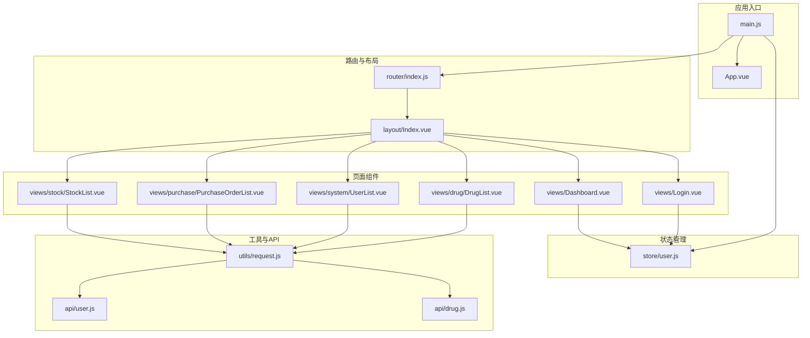
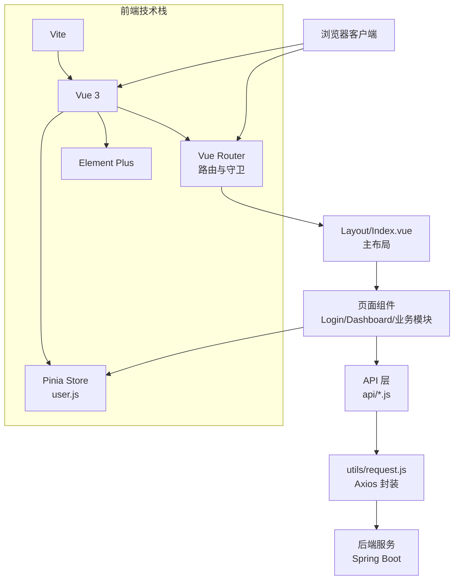
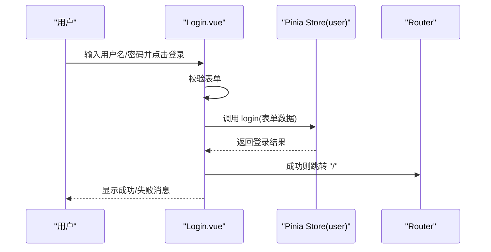
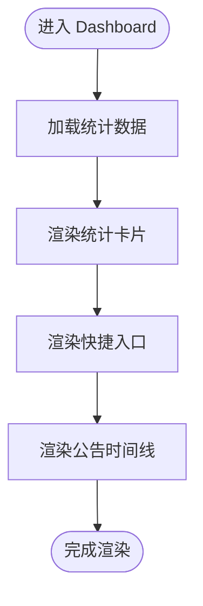
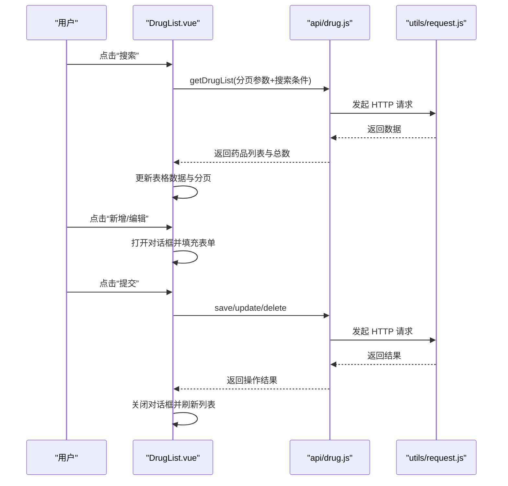
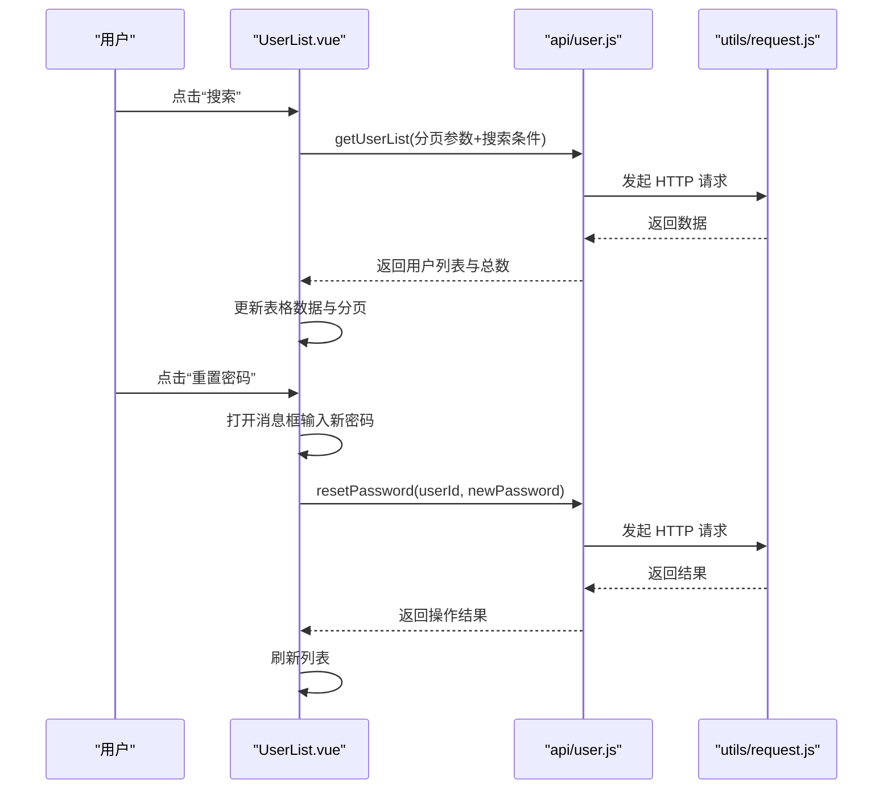
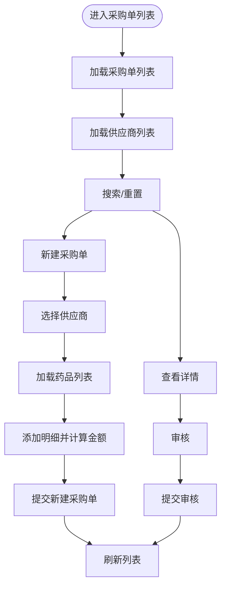
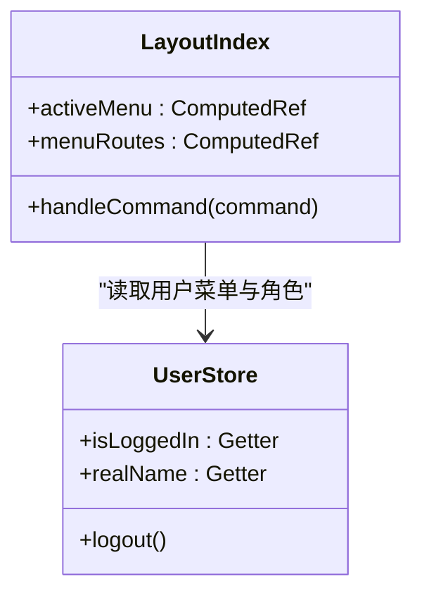
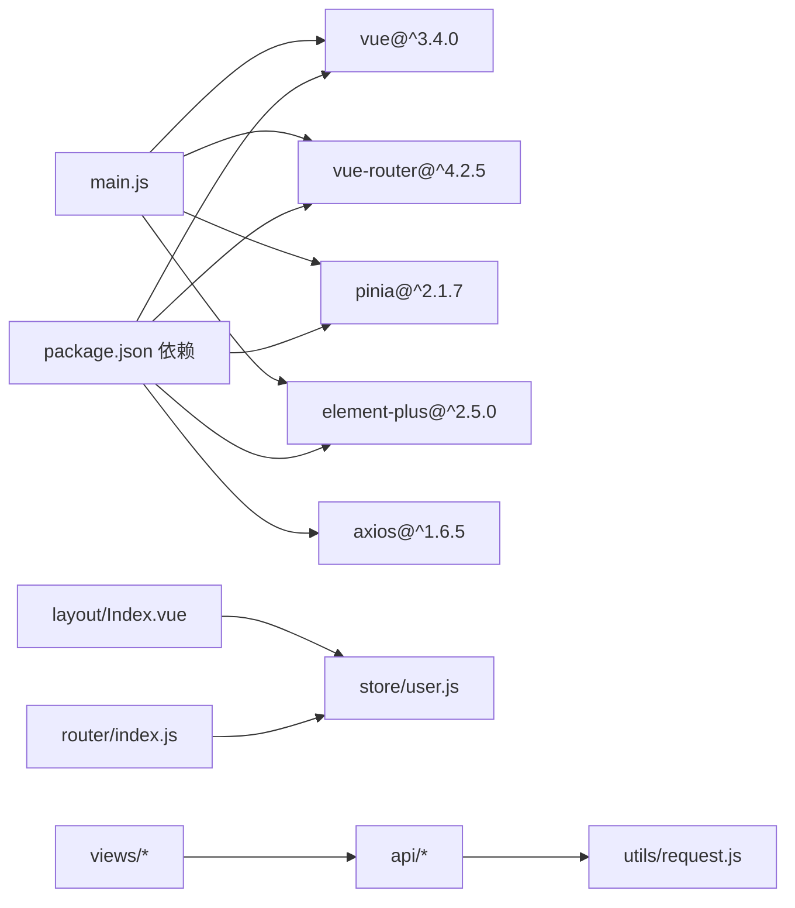

# 前端组件文档

<cite>
**本文档引用的文件**
- [package.json](file://drug-front/package.json)
- [main.js](file://drug-front/src/main.js)
- [App.vue](file://drug-front/src/App.vue)
- [router/index.js](file://drug-front/src/router/index.js)
- [store/user.js](file://drug-front/src/store/user.js)
- [layout/Index.vue](file://drug-front/src/layout/Index.vue)
- [views/Login.vue](file://drug-front/src/views/Login.vue)
- [views/Dashboard.vue](file://drug-front/src/views/Dashboard.vue)
- [utils/request.js](file://drug-front/src/utils/request.js)
- [vite.config.js](file://drug-front/vite.config.js)
- [api/user.js](file://drug-front/src/api/user.js)
- [api/drug.js](file://drug-front/src/api/drug.js)
- [views/drug/DrugList.vue](file://drug-front/src/views/drug/DrugList.vue)
- [views/system/UserList.vue](file://drug-front/src/views/system/UserList.vue)
- [views/purchase/PurchaseOrderList.vue](file://drug-front/src/views/purchase/PurchaseOrderList.vue)
- [views/stock/StockList.vue](file://drug-front/src/views/stock/StockList.vue)
- [README.md](file://drug-front/README.md)
</cite>

## 目录
1. [简介](#简介)
2. [项目结构](#项目结构)
3. [核心组件](#核心组件)
4. [架构总览](#架构总览)
5. [详细组件分析](#详细组件分析)
6. [依赖关系分析](#依赖关系分析)
7. [性能考虑](#性能考虑)
8. [故障排查指南](#故障排查指南)
9. [结论](#结论)
10. [附录](#附录)

## 简介
本项目是一个基于 Vue 3 + Element Plus + Vite 的前端应用，采用单文件组件（SFC）结构，结合 Vue Router 实现页面级路由与嵌套路由，使用 Pinia 进行状态管理，并通过 Axios 封装统一处理 HTTP 请求与响应拦截。系统包含登录认证、仪表板、药品管理、供应商管理、采购管理、库存管理、出入库管理、报表统计以及系统管理（用户与角色）等模块。

## 项目结构
前端项目位于 drug-front 目录，采用按功能分层的组织方式：
- src/api：按业务模块划分的接口封装
- src/layout：布局组件（主布局与侧边菜单）
- src/router：路由配置与守卫
- src/store：Pinia 状态管理（当前为用户状态）
- src/utils：通用工具（HTTP 请求封装）
- src/views：页面组件（按功能模块划分）
- src/main.js：应用入口，注册插件与全局配置
- vite.config.js：构建与开发服务器配置

**图表来源**
- [main.js:1-26](file://drug-front/src/main.js#L1-L26)
- [router/index.js:1-115](file://drug-front/src/router/index.js#L1-L115)
- [layout/Index.vue:1-213](file://drug-front/src/layout/Index.vue#L1-L213)
- [store/user.js:1-68](file://drug-front/src/store/user.js#L1-L68)
- [views/Login.vue:1-127](file://drug-front/src/views/Login.vue#L1-L127)
- [views/Dashboard.vue:1-226](file://drug-front/src/views/Dashboard.vue#L1-L226)
- [views/drug/DrugList.vue:1-426](file://drug-front/src/views/drug/DrugList.vue#L1-L426)
- [views/system/UserList.vue:1-358](file://drug-front/src/views/system/UserList.vue#L1-L358)
- [views/purchase/PurchaseOrderList.vue:1-650](file://drug-front/src/views/purchase/PurchaseOrderList.vue#L1-L650)
- [views/stock/StockList.vue:1-262](file://drug-front/src/views/stock/StockList.vue#L1-L262)
- [utils/request.js:1-56](file://drug-front/src/utils/request.js#L1-L56)
- [api/user.js:1-71](file://drug-front/src/api/user.js#L1-L71)
- [api/drug.js:1-45](file://drug-front/src/api/drug.js#L1-L45)

**章节来源**
- [README.md:94-132](file://drug-front/README.md#L94-L132)
- [package.json:1-29](file://drug-front/package.json#L1-L29)

## 核心组件
- 应用入口与全局配置：在入口文件中创建应用实例，注册 Element Plus、Vue Router、Pinia，并全局注册图标组件，设置语言与主题。
- 路由系统：定义登录页与主布局下的嵌套路由，包含多个业务模块页面；通过路由守卫实现登录状态校验与页面标题设置。
- 状态管理：用户 Store 提供登录状态、用户信息、角色与菜单的持久化存储，支持登录、获取当前用户信息与登出。
- 布局组件：主布局包含侧边菜单、顶部导航与内容区域，菜单项根据用户权限动态生成，支持下拉菜单与退出登录。
- 页面组件：登录页、仪表板、药品管理、用户管理、采购管理、库存管理等，均采用 Element Plus 组件实现表单、表格、对话框与分页。

**章节来源**
- [main.js:1-26](file://drug-front/src/main.js#L1-L26)
- [router/index.js:1-115](file://drug-front/src/router/index.js#L1-L115)
- [store/user.js:1-68](file://drug-front/src/store/user.js#L1-L68)
- [layout/Index.vue:1-213](file://drug-front/src/layout/Index.vue#L1-L213)
- [views/Login.vue:1-127](file://drug-front/src/views/Login.vue#L1-L127)
- [views/Dashboard.vue:1-226](file://drug-front/src/views/Dashboard.vue#L1-L226)

## 架构总览
系统采用前后端分离架构，前端通过 Axios 封装统一处理请求与响应拦截，路由守卫保障登录态，Pinia Store 管理用户状态，Element Plus 提供丰富的 UI 组件。

**图表来源**
- [router/index.js:1-115](file://drug-front/src/router/index.js#L1-L115)
- [layout/Index.vue:1-213](file://drug-front/src/layout/Index.vue#L1-L213)
- [store/user.js:1-68](file://drug-front/src/store/user.js#L1-L68)
- [utils/request.js:1-56](file://drug-front/src/utils/request.js#L1-L56)
- [api/user.js:1-71](file://drug-front/src/api/user.js#L1-L71)
- [api/drug.js:1-45](file://drug-front/src/api/drug.js#L1-L45)

## 详细组件分析

### 登录组件 Login
- 单文件组件结构：模板、脚本（Composition API）、样式三部分。
- 表单验证：基于 Element Plus 表单组件与校验规则，支持用户名与密码必填及最小长度校验。
- 登录流程：调用用户 Store 的登录方法，成功后跳转至首页，失败时提示错误。
- 交互反馈：加载状态、消息提示与错误处理。

**图表来源**
- [views/Login.vue:74-92](file://drug-front/src/views/Login.vue#L74-L92)
- [store/user.js:20-38](file://drug-front/src/store/user.js#L20-L38)
- [router/index.js:92-112](file://drug-front/src/router/index.js#L92-L112)

**章节来源**
- [views/Login.vue:1-127](file://drug-front/src/views/Login.vue#L1-L127)
- [store/user.js:1-68](file://drug-front/src/store/user.js#L1-L68)

### 仪表板组件 Dashboard
- 统计卡片：展示药品总数、库存预警数、待审核采购单、库存总金额等指标。
- 快捷入口：提供常用功能入口，点击跳转对应页面。
- 公告信息：使用时间线组件展示系统公告。

**图表来源**
- [views/Dashboard.vue:106-127](file://drug-front/src/views/Dashboard.vue#L106-L127)

**章节来源**
- [views/Dashboard.vue:1-226](file://drug-front/src/views/Dashboard.vue#L1-L226)

### 药品管理组件 DrugList
- 搜索与筛选：支持按药品名称、编码、类型搜索，重置按钮清空条件。
- 表格展示：展示药品编码、名称、类型、规格、单位、价格、生产企业、批准文号、状态等字段。
- 分页与加载：使用分页组件与加载指示器，支持切换页码与每页条数。
- 对话框表单：新增/编辑药品，包含输入框、选择器、数字输入、单选组等。
- 供应商联动：选择供应商后自动填充生产企业名称。
- 删除确认：使用消息框确认删除操作。

**图表来源**
- [views/drug/DrugList.vue:281-297](file://drug-front/src/views/drug/DrugList.vue#L281-L297)
- [views/drug/DrugList.vue:352-376](file://drug-front/src/views/drug/DrugList.vue#L352-L376)
- [api/drug.js:1-45](file://drug-front/src/api/drug.js#L1-L45)
- [utils/request.js:1-56](file://drug-front/src/utils/request.js#L1-L56)

**章节来源**
- [views/drug/DrugList.vue:1-426](file://drug-front/src/views/drug/DrugList.vue#L1-L426)
- [api/drug.js:1-45](file://drug-front/src/api/drug.js#L1-L45)

### 用户管理组件 UserList
- 角色联动：加载角色列表用于用户角色选择。
- 表单验证：对用户名、真实姓名、密码、手机号、邮箱等字段进行校验。
- 密码重置：通过消息框输入新密码并调用后端接口。
- 删除确认：使用消息框确认删除用户。

**图表来源**
- [views/system/UserList.vue:208-224](file://drug-front/src/views/system/UserList.vue#L208-L224)
- [views/system/UserList.vue:271-290](file://drug-front/src/views/system/UserList.vue#L271-L290)
- [api/user.js:46-70](file://drug-front/src/api/user.js#L46-L70)
- [utils/request.js:1-56](file://drug-front/src/utils/request.js#L1-L56)

**章节来源**
- [views/system/UserList.vue:1-358](file://drug-front/src/views/system/UserList.vue#L1-L358)
- [api/user.js:1-71](file://drug-front/src/api/user.js#L1-L71)

### 采购管理组件 PurchaseOrderList
- 权限控制：根据用户角色判断是否显示“审核”按钮。
- 供应商联动：选择供应商后加载该供应商对应的药品列表。
- 明细计算：根据数量与单价自动计算小计金额，合计金额实时更新。
- 审核流程：弹窗输入审核结果与意见，提交后刷新列表。
- 作废操作：通过消息框确认后调用作废接口。

**图表来源**
- [views/purchase/PurchaseOrderList.vue:410-426](file://drug-front/src/views/purchase/PurchaseOrderList.vue#L410-L426)
- [views/purchase/PurchaseOrderList.vue:516-539](file://drug-front/src/views/purchase/PurchaseOrderList.vue#L516-L539)
- [views/purchase/PurchaseOrderList.vue:576-623](file://drug-front/src/views/purchase/PurchaseOrderList.vue#L576-L623)

**章节来源**
- [views/purchase/PurchaseOrderList.vue:1-650](file://drug-front/src/views/purchase/PurchaseOrderList.vue#L1-L650)

### 库存管理组件 StockList
- 预警筛选：支持仅显示库存低于预警值的药品。
- 盘点功能：支持全仓、仅预警或自定义选择药品进行盘点，创建盘点单。
- 表格高亮：库存低于预警值的行以特殊样式标识。

**章节来源**
- [views/stock/StockList.vue:1-262](file://drug-front/src/views/stock/StockList.vue#L1-L262)

### 主布局组件 Index
- 侧边菜单：根据用户菜单权限动态生成菜单项，支持图标与路由跳转。
- 顶部导航：显示当前用户真实姓名与下拉菜单，提供退出登录与个人信息入口。
- 菜单排序：固定菜单顺序，同时保证用户实际权限内的菜单项按顺序显示。

**图表来源**
- [layout/Index.vue:60-146](file://drug-front/src/layout/Index.vue#L60-L146)
- [store/user.js:12-18](file://drug-front/src/store/user.js#L12-L18)

**章节来源**
- [layout/Index.vue:1-213](file://drug-front/src/layout/Index.vue#L1-L213)
- [store/user.js:1-68](file://drug-front/src/store/user.js#L1-L68)

## 依赖关系分析
- 组件耦合：页面组件通过 API 层与工具层解耦，避免直接依赖后端接口。
- 状态管理：用户状态集中管理，路由守卫与页面组件共享同一 Store 实例。
- 路由守卫：统一处理登录态与页面标题，减少重复逻辑。
- 构建与代理：Vite 提供开发服务器与代理配置，简化跨域与本地联调。

**图表来源**
- [package.json:13-22](file://drug-front/package.json#L13-L22)
- [main.js:1-26](file://drug-front/src/main.js#L1-L26)
- [router/index.js:1-115](file://drug-front/src/router/index.js#L1-L115)
- [store/user.js:1-68](file://drug-front/src/store/user.js#L1-L68)
- [utils/request.js:1-56](file://drug-front/src/utils/request.js#L1-L56)
- [api/user.js:1-71](file://drug-front/src/api/user.js#L1-L71)
- [api/drug.js:1-45](file://drug-front/src/api/drug.js#L1-L45)

**章节来源**
- [package.json:1-29](file://drug-front/package.json#L1-L29)
- [vite.config.js:1-22](file://drug-front/vite.config.js#L1-L22)

## 性能考虑
- 路由懒加载：路由组件采用动态导入，减少首屏加载体积。
- 组件懒加载：可对大型页面组件进一步拆分并按需加载。
- 图标注册：一次性全局注册 Element Plus 图标，避免重复注册。
- 代理与缓存：开发环境通过代理避免跨域，合理利用浏览器缓存。
- 表单与表格：对大量数据的表格使用虚拟滚动与分页，减少 DOM 节点数量。

## 故障排查指南
- 登录失败：检查后端接口连通性与 Token 存储；确认请求拦截器中 Authorization 头是否正确设置。
- 401 未授权：响应拦截器会清除本地 Token 并跳转登录页，检查后端签发 Token 的逻辑。
- 跨域问题：确认 Vite 代理配置与后端 CORS 设置一致。
- 端口冲突：修改 Vite 服务器端口或关闭占用进程。
- 依赖安装失败：清理缓存与 node_modules 后重新安装。

**章节来源**
- [utils/request.js:27-53](file://drug-front/src/utils/request.js#L27-L53)
- [router/index.js:92-112](file://drug-front/src/router/index.js#L92-L112)
- [vite.config.js:12-20](file://drug-front/vite.config.js#L12-L20)

## 结论
本项目采用现代化前端技术栈，结构清晰、职责分明。通过路由守卫、Pinia 状态管理与 Element Plus 组件库，实现了完整的业务页面与良好的用户体验。后续可在权限细化、移动端适配、性能优化等方面持续改进。

## 附录

### 组件开发规范与命名约定
- 组件名：PascalCase（大驼峰），如 Dashboard.vue、DrugList.vue。
- 文件名：PascalCase 或 camelCase，如 drug.js、user.js。
- 变量：camelCase（小驼峰），如 loginForm、tableData。
- 常量：UPPER_SNAKE_CASE，如 MAX_SIZE。

**章节来源**
- [README.md:209-223](file://drug-front/README.md#L209-L223)

### 构建与部署
- 开发：npm run dev，访问 http://localhost:3000。
- 构建：npm run build，产物位于 dist 目录。
- 预览：npm run preview。
- 代理配置：开发环境将 /api 代理至后端服务。

**章节来源**
- [README.md:70-93](file://drug-front/README.md#L70-L93)
- [vite.config.js:12-20](file://drug-front/vite.config.js#L12-L20)