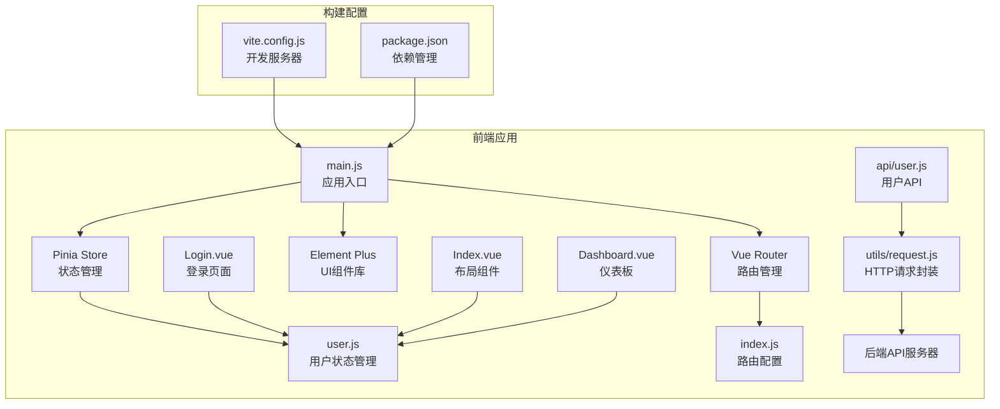
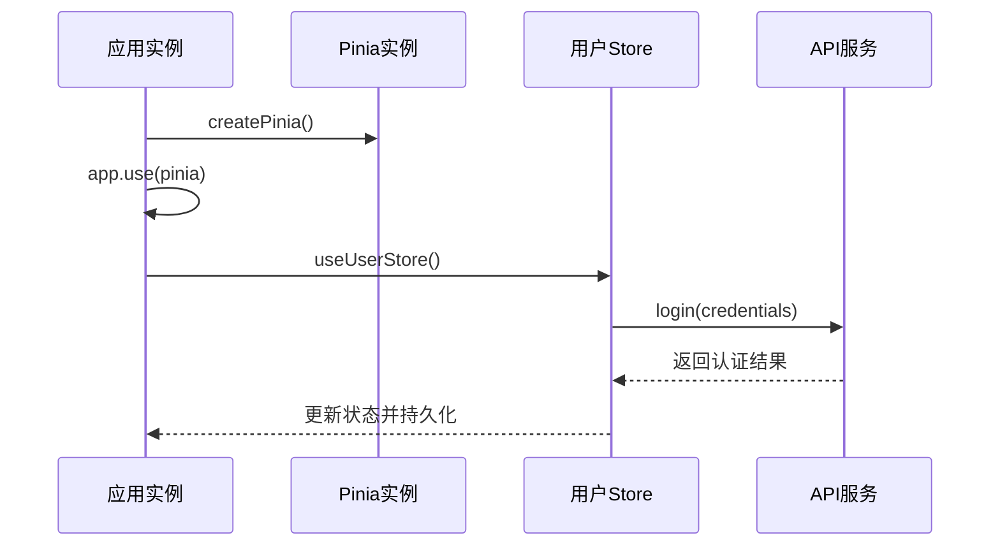
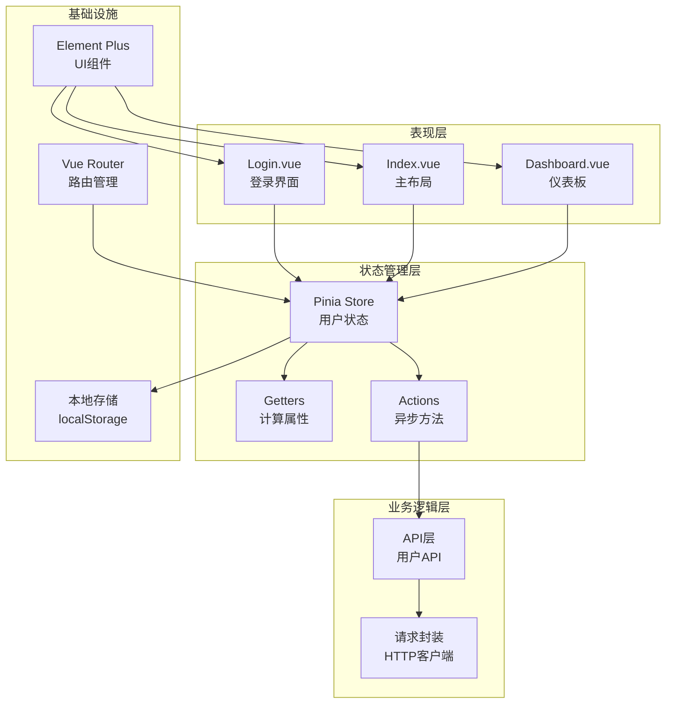
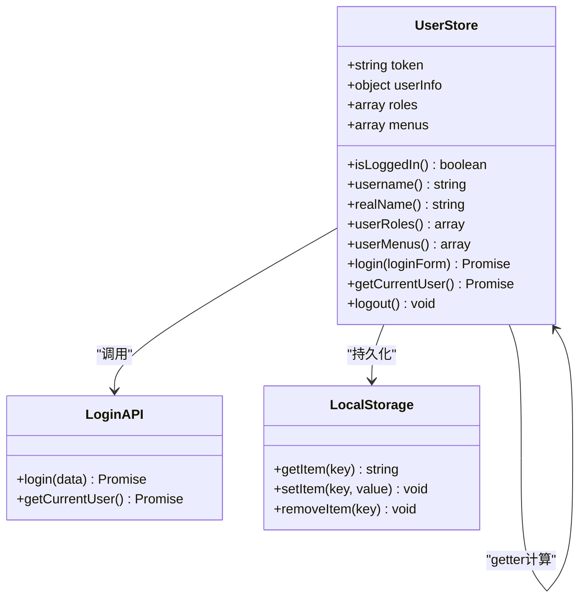
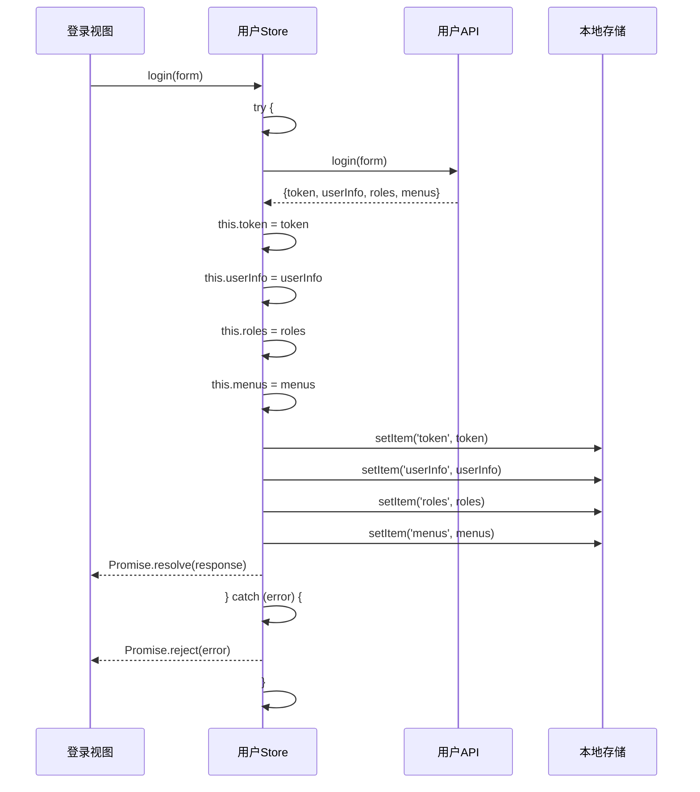
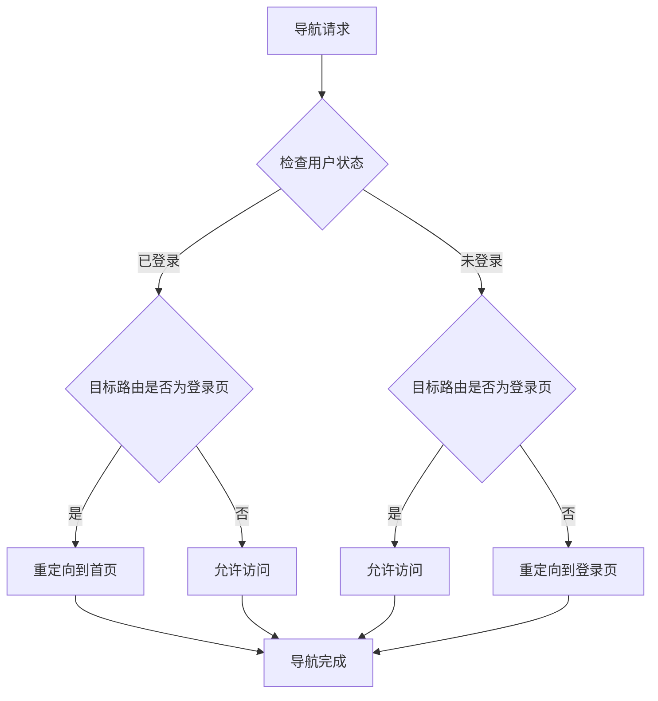
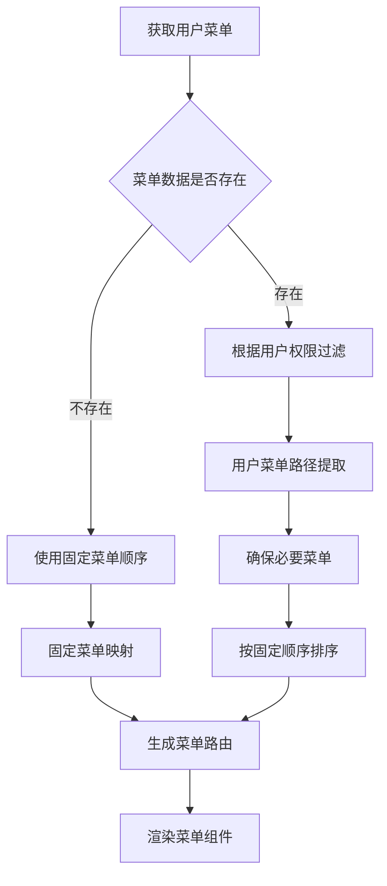
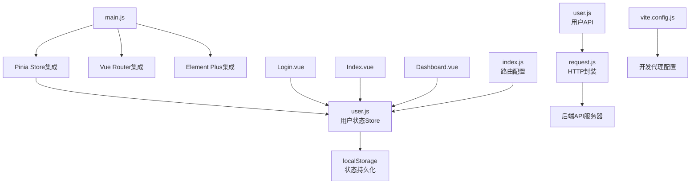

# 状态管理(Pinia)

<cite>
**本文档引用的文件**
- [user.js](file://drug-front/src/store/user.js)
- [main.js](file://drug-front/src/main.js)
- [package.json](file://drug-front/package.json)
- [index.js](file://drug-front/src/router/index.js)
- [user.js](file://drug-front/src/api/user.js)
- [request.js](file://drug-front/src/utils/request.js)
- [Login.vue](file://drug-front/src/views/Login.vue)
- [Index.vue](file://drug-front/src/layout/Index.vue)
- [Dashboard.vue](file://drug-front/src/views/Dashboard.vue)
- [vite.config.js](file://drug-front/vite.config.js)
</cite>

## 目录
1. [简介](#简介)
2. [项目结构](#项目结构)
3. [核心组件](#核心组件)
4. [架构概览](#架构概览)
5. [详细组件分析](#详细组件分析)
6. [依赖关系分析](#依赖关系分析)
7. [性能考虑](#性能考虑)
8. [故障排除指南](#故障排除指南)
9. [结论](#结论)
10. [附录](#附录)

## 简介

本项目采用Vue 3 + Pinia构建的医院药品管理系统，展示了现代前端状态管理的最佳实践。系统通过Pinia实现了集中式状态管理，支持用户认证、权限控制、菜单动态生成等核心功能。本文档将深入解析Pinia状态管理库的使用和实现，包括store设计模式、状态持久化、异步状态处理、模块化组织以及状态共享机制。

## 项目结构

项目采用前后端分离架构，前端使用Vue 3 + Vite + Element Plus技术栈，后端使用Spring Boot。前端状态管理主要集中在`drug-front/src/store`目录中。



**图表来源**
- [main.js:1-26](file://drug-front/src/main.js#L1-L26)
- [user.js:1-68](file://drug-front/src/store/user.js#L1-L68)
- [index.js:1-115](file://drug-front/src/router/index.js#L1-L115)

**章节来源**
- [main.js:1-26](file://drug-front/src/main.js#L1-L26)
- [package.json:1-29](file://drug-front/package.json#L1-L29)
- [vite.config.js:1-22](file://drug-front/vite.config.js#L1-L22)

## 核心组件

### Pinia Store 集成

应用通过`createPinia()`创建全局状态管理实例，并在Vue应用中注册：



**图表来源**
- [main.js:12-19](file://drug-front/src/main.js#L12-L19)
- [user.js:22-38](file://drug-front/src/store/user.js#L22-L38)

### 用户状态管理

用户状态管理是系统的核心，负责处理用户认证、权限和菜单动态生成：

**章节来源**
- [user.js:1-68](file://drug-front/src/store/user.js#L1-L68)

## 架构概览

系统采用分层架构设计，清晰分离了状态管理层、业务逻辑层和表现层：



**图表来源**
- [user.js:4-67](file://drug-front/src/store/user.js#L4-L67)
- [index.js:92-112](file://drug-front/src/router/index.js#L92-L112)

## 详细组件分析

### 用户状态Store分析

#### Store设计模式实现

用户状态Store遵循Pinia的标准设计模式，包含三个核心部分：

**状态定义（State）**：
- `token`: JWT认证令牌
- `userInfo`: 当前用户基本信息
- `roles`: 用户角色列表
- `menus`: 用户可访问的菜单权限

**Getter计算属性**：
- `isLoggedIn`: 基于token判断登录状态
- `username`: 用户名访问器
- `realName`: 真实姓名访问器
- `userRoles`: 角色列表访问器
- `userMenus`: 菜单权限访问器

**Action方法**：
- `login()`: 用户登录认证
- `getCurrentUser()`: 获取当前用户信息
- `logout()`: 用户登出



**图表来源**
- [user.js:4-67](file://drug-front/src/store/user.js#L4-L67)
- [user.js:20-66](file://drug-front/src/store/user.js#L20-L66)

#### 异步状态处理流程

登录流程展示了完整的异步状态处理模式：



**图表来源**
- [Login.vue:75-92](file://drug-front/src/views/Login.vue#L75-L92)
- [user.js:22-38](file://drug-front/src/store/user.js#L22-L38)

**章节来源**
- [user.js:4-67](file://drug-front/src/store/user.js#L4-L67)
- [Login.vue:75-92](file://drug-front/src/views/Login.vue#L75-L92)

### 路由守卫与状态集成

路由系统通过全局前置守卫实现基于状态的权限控制：



**图表来源**
- [index.js:92-112](file://drug-front/src/router/index.js#L92-L112)

**章节来源**
- [index.js:92-112](file://drug-front/src/router/index.js#L92-L112)

### 菜单动态生成机制

系统实现了基于用户权限的动态菜单生成：



**图表来源**
- [Index.vue:89-126](file://drug-front/src/layout/Index.vue#L89-L126)

**章节来源**
- [Index.vue:89-126](file://drug-front/src/layout/Index.vue#L89-L126)

## 依赖关系分析

### 技术栈依赖

项目采用现代化的前端技术栈，各组件间依赖关系清晰：

```mermaid
graph TB
subgraph "核心框架"
A[Vue 3.4.0<br/>响应式框架]
B[Pinia 2.1.7<br/>状态管理]
C[Vue Router 4.2.5<br/>路由管理]
end
subgraph "UI组件库"
D[Element Plus 2.5.0<br/>组件库]
E[@element-plus/icons-vue<br/>图标库]
end
subgraph "HTTP客户端"
F[Axios 1.6.5<br/>HTTP请求]
end
subgraph "构建工具"
G[Vite 5.0.12<br/>开发服务器]
H[Sass 1.70.0<br/>样式预处理器]
end
A --> B
A --> C
A --> D
D --> E
A --> F
F --> G
A --> G
A --> H
```

**图表来源**
- [package.json:13-27](file://drug-front/package.json#L13-L27)

### 组件间依赖关系



**图表来源**
- [main.js:12-19](file://drug-front/src/main.js#L12-L19)
- [user.js:1-2](file://drug-front/src/store/user.js#L1-L2)
- [index.js:1-2](file://drug-front/src/router/index.js#L1-L2)

**章节来源**
- [package.json:13-27](file://drug-front/package.json#L13-L27)
- [main.js:12-19](file://drug-front/src/main.js#L12-L19)

## 性能考虑

### 状态持久化优化

系统实现了高效的本地状态持久化策略：

1. **选择性持久化**：仅持久化必要的用户认证信息
2. **JSON序列化**：复杂对象使用JSON格式存储
3. **批量更新**：状态更新时一次性写入多个localStorage项

### 异步操作优化

1. **请求拦截器**：统一添加认证头信息
2. **响应处理**：自动处理401未授权状态
3. **错误处理**：统一的错误消息显示和处理

### 组件渲染优化

1. **计算属性缓存**：使用getter避免重复计算
2. **条件渲染**：基于用户权限动态渲染菜单
3. **懒加载路由**：按需加载组件减少初始包大小

## 故障排除指南

### 常见问题及解决方案

**登录状态异常**
- 检查localStorage中的token是否正确存储
- 验证后端API响应格式是否符合预期
- 确认请求拦截器是否正确设置认证头

**菜单权限不生效**
- 检查用户角色和菜单权限数据
- 验证菜单路径映射是否正确
- 确认路由守卫逻辑是否正常执行

**状态不同步问题**
- 检查store实例是否正确注入
- 验证组件中是否正确使用了store
- 确认状态更新是否在正确的生命周期中执行

**章节来源**
- [request.js:12-53](file://drug-front/src/utils/request.js#L12-L53)
- [user.js:22-65](file://drug-front/src/store/user.js#L22-L65)

## 结论

本项目展示了Vue 3 + Pinia状态管理的最佳实践，通过合理的架构设计和实现模式，实现了：

1. **清晰的状态管理**：用户状态集中管理，便于维护和扩展
2. **完善的权限控制**：基于角色的菜单动态生成
3. **良好的用户体验**：自动化的登录状态管理和错误处理
4. **可扩展的架构**：模块化的store设计便于功能扩展

虽然当前项目主要实现了用户状态管理，但其架构设计为后续扩展其他业务状态（如应用状态、业务状态）提供了良好的基础。

## 附录

### 最佳实践建议

1. **Store模块化**：将不同业务领域的状态分离到独立的store文件中
2. **状态规范化**：保持状态结构的一致性和可预测性
3. **异步操作封装**：将API调用封装在store的actions中
4. **错误处理**：建立统一的错误处理机制
5. **性能监控**：使用Vue DevTools监控状态变化和组件渲染

### 扩展方向

1. **应用状态管理**：添加全局配置、主题切换等功能状态
2. **业务状态管理**：为药品管理、库存管理等业务领域创建专门的store
3. **状态持久化增强**：实现更复杂的状态持久化策略
4. **状态调试工具**：集成Vue DevTools进行状态调试