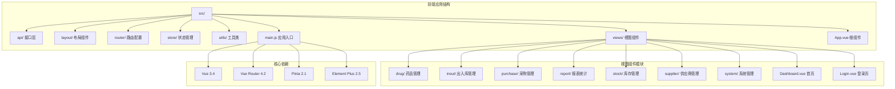
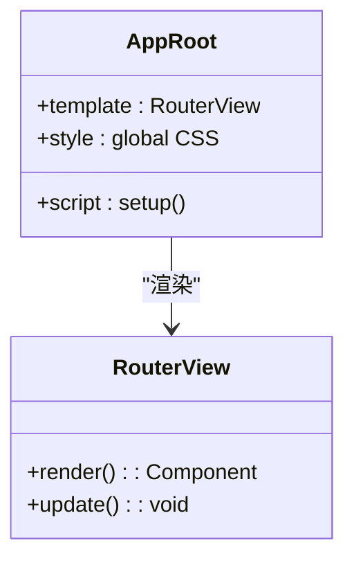
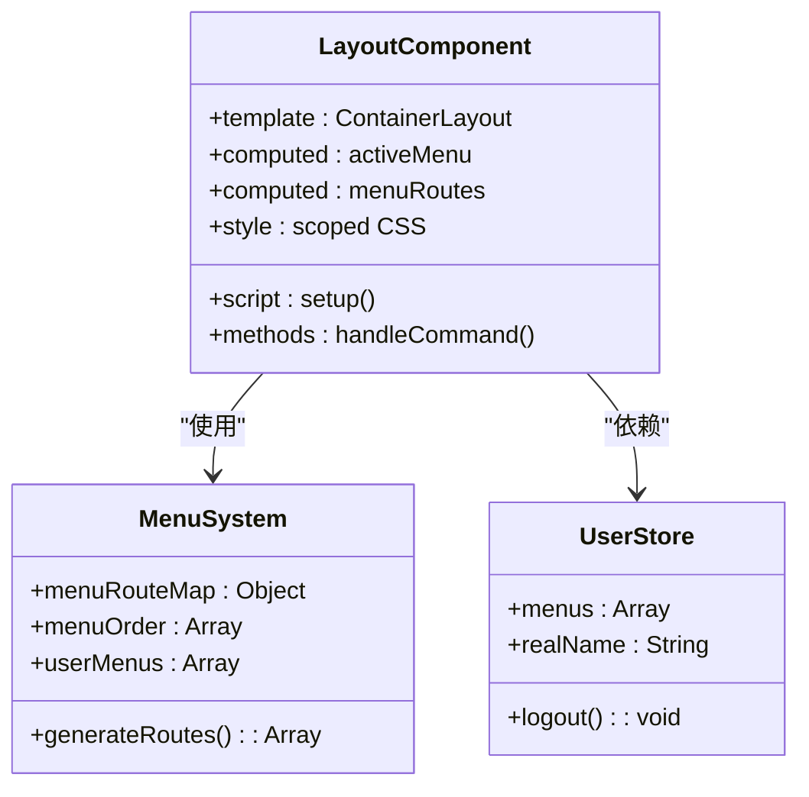
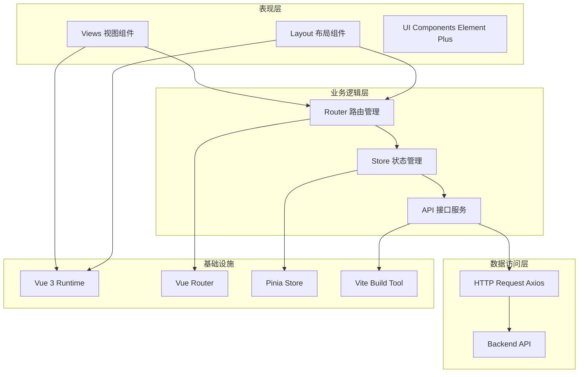
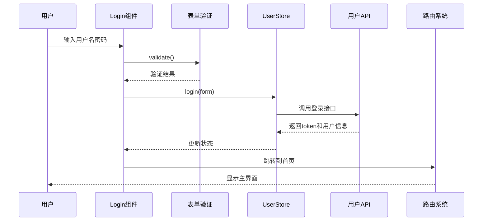
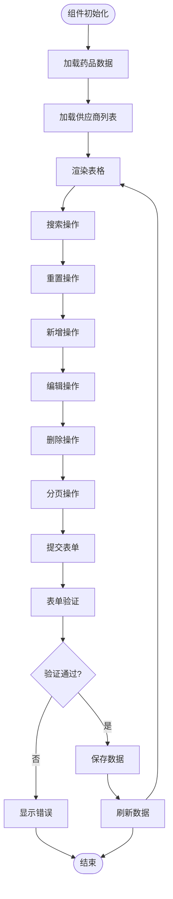
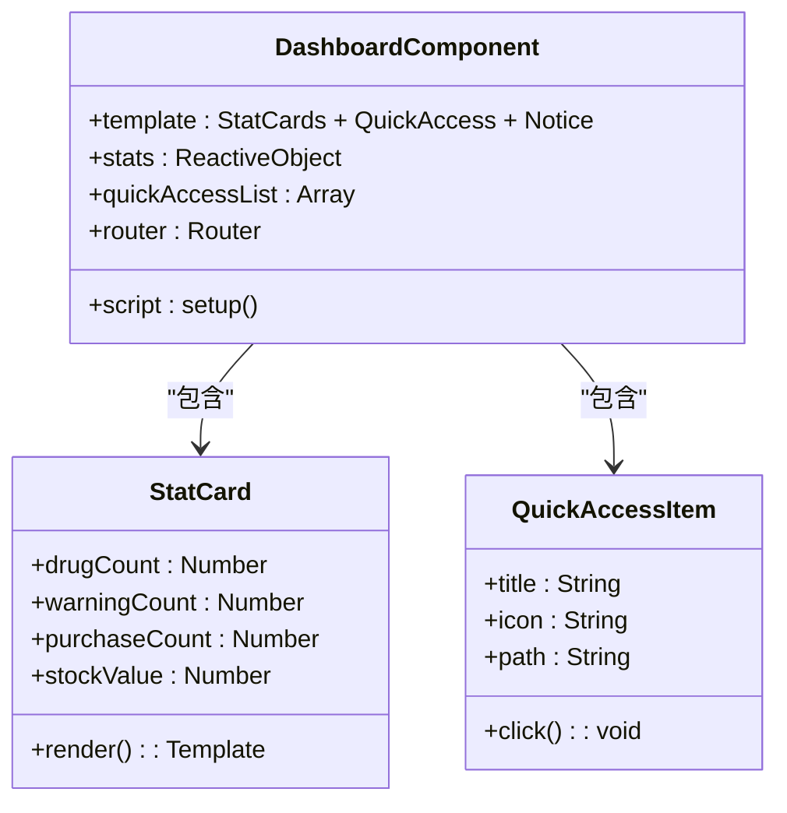
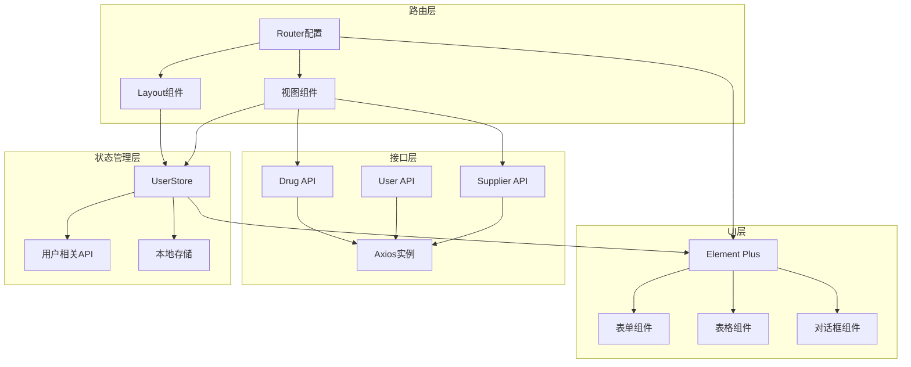
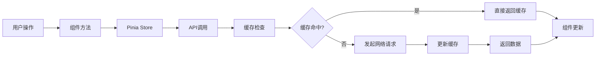

# 组件架构设计

<cite>
**本文档引用的文件**
- [App.vue](file://drug-front/src/App.vue)
- [main.js](file://drug-front/src/main.js)
- [Index.vue](file://drug-front/src/layout/Index.vue)
- [Dashboard.vue](file://drug-front/src/views/Dashboard.vue)
- [Login.vue](file://drug-front/src/views/Login.vue)
- [DrugList.vue](file://drug-front/src/views/drug/DrugList.vue)
- [user.js](file://drug-front/src/store/user.js)
- [index.js](file://drug-front/src/router/index.js)
- [package.json](file://drug-front/package.json)
- [vite.config.js](file://drug-front/vite.config.js)
- [user.js](file://drug-front/src/api/user.js)
- [drug.js](file://drug-front/src/api/drug.js)
- [request.js](file://drug-front/src/utils/request.js)
</cite>

## 目录
1. [简介](#简介)
2. [项目结构](#项目结构)
3. [核心组件](#核心组件)
4. [架构概览](#架构概览)
5. [详细组件分析](#详细组件分析)
6. [依赖关系分析](#依赖关系分析)
7. [性能考虑](#性能考虑)
8. [故障排除指南](#故障排除指南)
9. [结论](#结论)
10. [附录](#附录)

## 简介

本项目是一个基于Vue.js 3.x构建的医院药品管理系统前端应用。该系统采用单文件组件(SFC)设计模式，结合Element Plus UI框架、Pinia状态管理和Vue Router路由系统，实现了完整的药品管理业务流程。

系统主要功能包括药品信息管理、供应商管理、采购管理、库存管理、出入库管理、报表统计和用户权限管理等模块。通过组件化的架构设计，实现了高内聚、低耦合的代码结构，为后续的功能扩展和维护提供了良好的基础。

## 项目结构

项目采用基于功能模块的组织方式，整体结构清晰，便于维护和扩展：

**图表来源**
- [main.js:1-26](file://drug-front/src/main.js#L1-L26)
- [package.json:13-22](file://drug-front/package.json#L13-L22)

**章节来源**
- [main.js:1-26](file://drug-front/src/main.js#L1-L26)
- [package.json:1-29](file://drug-front/package.json#L1-L29)

## 核心组件

### 应用根组件

应用的根组件负责全局样式初始化和路由渲染：

**图表来源**
- [App.vue:1-24](file://drug-front/src/App.vue#L1-L24)

### 布局组件

布局组件是整个系统的骨架，提供统一的导航结构和内容区域：

**图表来源**
- [Index.vue:60-147](file://drug-front/src/layout/Index.vue#L60-L147)
- [user.js:4-68](file://drug-front/src/store/user.js#L4-L68)

**章节来源**
- [Index.vue:1-213](file://drug-front/src/layout/Index.vue#L1-L213)
- [App.vue:1-24](file://drug-front/src/App.vue#L1-L24)

## 架构概览

系统采用分层架构设计，各层职责明确，便于维护和扩展：

**图表来源**
- [main.js:11-25](file://drug-front/src/main.js#L11-L25)
- [index.js:1-115](file://drug-front/src/router/index.js#L1-L115)
- [user.js:1-68](file://drug-front/src/store/user.js#L1-L68)

## 详细组件分析

### 登录组件(Login.vue)

登录组件实现了用户身份认证功能，采用表单验证和异步处理机制：

**图表来源**
- [Login.vue:75-92](file://drug-front/src/views/Login.vue#L75-L92)
- [user.js:20-38](file://drug-front/src/store/user.js#L20-L38)
- [user.js:55-65](file://drug-front/src/store/user.js#L55-L65)

**章节来源**
- [Login.vue:1-127](file://drug-front/src/views/Login.vue#L1-L127)
- [user.js:1-68](file://drug-front/src/store/user.js#L1-L68)

### 药品列表组件(DrugList.vue)

药品列表组件是系统的核心业务组件，实现了完整的CRUD操作：

**图表来源**
- [DrugList.vue:281-414](file://drug-front/src/views/drug/DrugList.vue#L281-L414)
- [drug.js:3-45](file://drug-front/src/api/drug.js#L3-L45)

**章节来源**
- [DrugList.vue:1-426](file://drug-front/src/views/drug/DrugList.vue#L1-L426)
- [drug.js:1-45](file://drug-front/src/api/drug.js#L1-L45)

### 首页仪表板组件(Dashboard.vue)

首页组件提供系统概览和快速入口功能：

**图表来源**
- [Dashboard.vue:106-127](file://drug-front/src/views/Dashboard.vue#L106-L127)
- [Dashboard.vue:113-118](file://drug-front/src/views/Dashboard.vue#L113-L118)

**章节来源**
- [Dashboard.vue:1-226](file://drug-front/src/views/Dashboard.vue#L1-L226)

## 依赖关系分析

### 组件间依赖关系

**图表来源**
- [index.js:1-115](file://drug-front/src/router/index.js#L1-L115)
- [user.js:1-68](file://drug-front/src/store/user.js#L1-L68)
- [request.js:1-56](file://drug-front/src/utils/request.js#L1-L56)

### 外部依赖分析

系统主要依赖以下核心库：

| 依赖包 | 版本 | 用途 |
|--------|------|------|
| vue | ^3.4.0 | 核心框架 |
| vue-router | ^4.2.5 | 路由管理 |
| pinia | ^2.1.7 | 状态管理 |
| element-plus | ^2.5.0 | UI组件库 |
| axios | ^1.6.5 | HTTP客户端 |
| @element-plus/icons-vue | ^2.3.1 | 图标组件 |

**章节来源**
- [package.json:13-27](file://drug-front/package.json#L13-L27)

## 性能考虑

### 组件性能优化策略

1. **懒加载路由**: 使用动态导入实现路由级别的代码分割
2. **虚拟滚动**: 对于大数据量表格可考虑实现虚拟滚动
3. **缓存策略**: 利用Pinia的持久化存储减少重复请求
4. **图片优化**: 对于图标使用SVG格式，避免HTTP请求
5. **CSS作用域**: 使用scoped样式避免全局样式污染

### 数据流优化

## 故障排除指南

### 常见问题及解决方案

#### 登录认证问题
- **症状**: 登录后立即跳转到登录页
- **原因**: Token过期或无效
- **解决**: 检查Token存储和请求头设置

#### 数据加载失败
- **症状**: 页面空白或显示加载错误
- **原因**: API接口异常或网络问题
- **解决**: 检查代理配置和后端服务状态

#### 权限控制问题
- **症状**: 菜单项显示不正确
- **原因**: 用户菜单权限数据异常
- **解决**: 清除本地存储重新登录

**章节来源**
- [request.js:36-44](file://drug-front/src/utils/request.js#L36-L44)
- [index.js:91-112](file://drug-front/src/router/index.js#L91-L112)

## 结论

本项目通过合理的组件架构设计，成功实现了医院药品管理系统的前端功能。采用单文件组件(SFC)模式，结合现代Vue.js生态系统，构建了具有良好可维护性和扩展性的前端应用。

系统的主要优势包括：
- 清晰的组件层次结构
- 完善的状态管理模式
- 灵活的路由配置
- 丰富的UI组件库集成
- 完善的错误处理机制

未来可以进一步优化的方向包括：实现更完善的权限控制、增加单元测试覆盖率、优化移动端适配、引入组件文档生成工具等。

## 附录

### 组件设计最佳实践

#### 命名规范
- 组件文件使用PascalCase命名（如DrugList.vue）
- 组件内部使用驼峰命名法
- 样式类名使用BEM命名规范

#### 代码组织结构
- 每个功能模块独立文件夹
- 组件按功能分类组织
- API接口按业务领域划分

#### 组件封装原则
- 单一职责：每个组件专注于一个功能
- 可复用性：设计通用的组件接口
- 可测试性：组件逻辑清晰，易于单元测试