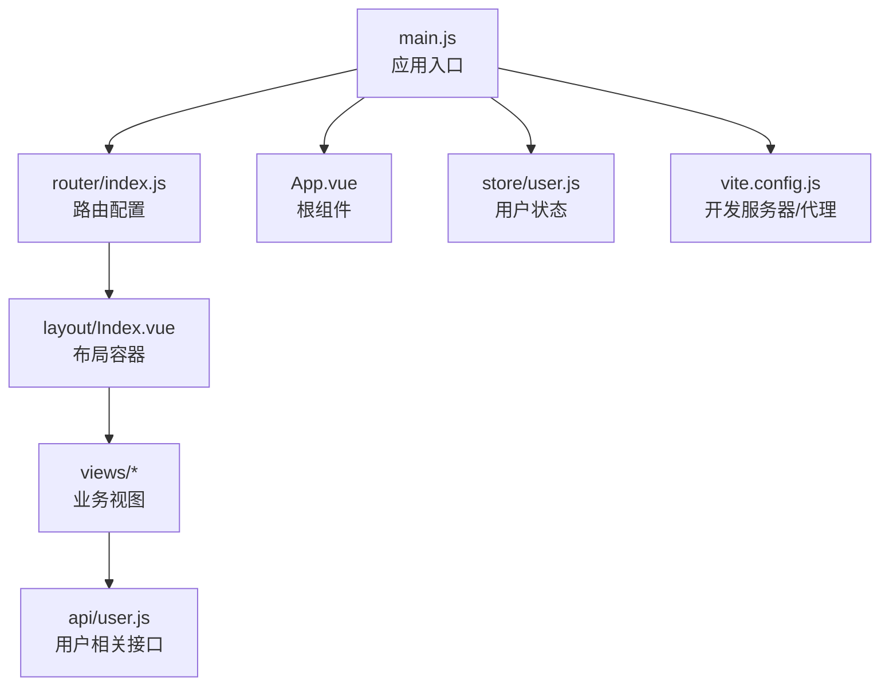
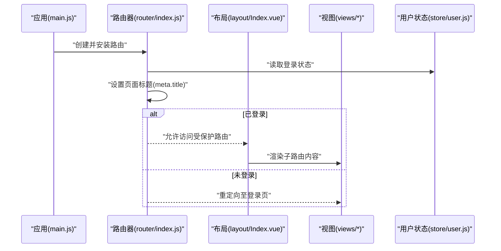
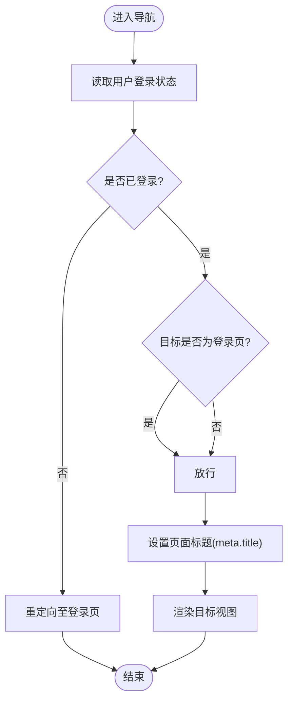
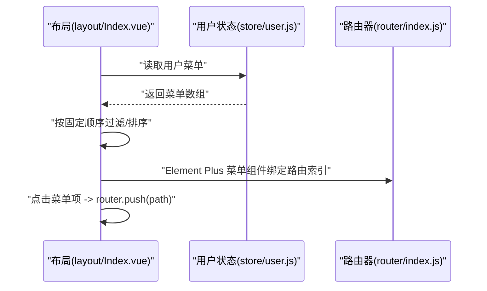
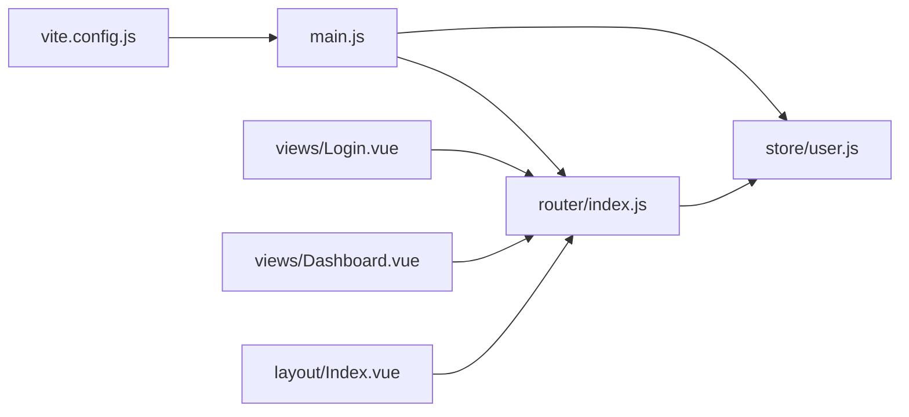

# 路由配置(Vue Router)

<cite>
**本文引用的文件**
- [router/index.js](file://drug-front/src/router/index.js)
- [main.js](file://drug-front/src/main.js)
- [App.vue](file://drug-front/src/App.vue)
- [layout/Index.vue](file://drug-front/src/layout/Index.vue)
- [views/Login.vue](file://drug-front/src/views/Login.vue)
- [views/Dashboard.vue](file://drug-front/src/views/Dashboard.vue)
- [store/user.js](file://drug-front/src/store/user.js)
- [api/user.js](file://drug-front/src/api/user.js)
- [vite.config.js](file://drug-front/vite.config.js)
- [package.json](file://drug-front/package.json)
</cite>

## 目录
1. [简介](#简介)
2. [项目结构](#项目结构)
3. [核心组件](#核心组件)
4. [架构总览](#架构总览)
5. [详细组件分析](#详细组件分析)
6. [依赖关系分析](#依赖关系分析)
7. [性能考虑](#性能考虑)
8. [故障排查指南](#故障排查指南)
9. [结论](#结论)
10. [附录](#附录)

## 简介
本文件围绕前端“药物管理系统”的 Vue Router 配置与使用进行全面说明，涵盖路由定义（路径匹配、组件映射、嵌套路由）、路由守卫（全局守卫、路由独享守卫、组件内守卫）的应用场景与实现方式；同时介绍动态路由（参数路由、查询参数、路由元信息）、路由懒加载（按需加载组件、代码分割、性能优化）、路由导航（编程式导航、声明式导航、路由跳转控制），并提供权限控制、面包屑导航集成、路由调试技巧与常见问题解决方案。

## 项目结构
该前端工程采用典型的 Vue 3 + Vite + Element Plus 架构，路由集中在 router/index.js 中集中配置，通过 Pinia 管理用户状态，布局组件负责菜单与主内容渲染，视图组件承载具体业务页面。

图表来源
- [main.js:1-26](file://drug-front/src/main.js#L1-L26)
- [router/index.js:1-115](file://drug-front/src/router/index.js#L1-L115)
- [layout/Index.vue:1-213](file://drug-front/src/layout/Index.vue#L1-L213)
- [store/user.js:1-68](file://drug-front/src/store/user.js#L1-L68)
- [api/user.js:1-71](file://drug-front/src/api/user.js#L1-L71)
- [vite.config.js:1-22](file://drug-front/vite.config.js#L1-L22)

章节来源
- [main.js:1-26](file://drug-front/src/main.js#L1-L26)
- [router/index.js:1-115](file://drug-front/src/router/index.js#L1-L115)
- [layout/Index.vue:1-213](file://drug-front/src/layout/Index.vue#L1-L213)
- [store/user.js:1-68](file://drug-front/src/store/user.js#L1-L68)
- [api/user.js:1-71](file://drug-front/src/api/user.js#L1-L71)
- [vite.config.js:1-22](file://drug-front/vite.config.js#L1-L22)

## 核心组件
- 路由器实例与全局守卫：在 router/index.js 中创建路由器并设置全局 beforeEach 守卫，实现登录状态判断与页面标题设置。
- 布局与菜单：layout/Index.vue 提供侧边栏菜单、头部信息与主内容区域，支持动态菜单生成与 Element Plus 菜单组件联动。
- 视图组件：views/Login.vue、views/Dashboard.vue 等承载具体业务页面，使用编程式导航完成登录后跳转与快捷入口跳转。
- 用户状态：store/user.js 使用 Pinia 管理 token、用户信息、角色与菜单，为路由守卫与菜单生成提供依据。
- 开发配置：vite.config.js 提供本地开发服务器端口与后端接口代理，便于前后端联调。

章节来源
- [router/index.js:1-115](file://drug-front/src/router/index.js#L1-L115)
- [layout/Index.vue:1-213](file://drug-front/src/layout/Index.vue#L1-L213)
- [views/Login.vue:1-127](file://drug-front/src/views/Login.vue#L1-L127)
- [views/Dashboard.vue:1-226](file://drug-front/src/views/Dashboard.vue#L1-L226)
- [store/user.js:1-68](file://drug-front/src/store/user.js#L1-L68)
- [vite.config.js:1-22](file://drug-front/vite.config.js#L1-L22)

## 架构总览
下图展示从应用启动到路由导航的关键交互流程，包括路由初始化、全局守卫、布局渲染与视图切换。

图表来源
- [main.js:19-20](file://drug-front/src/main.js#L19-L20)
- [router/index.js:91-112](file://drug-front/src/router/index.js#L91-L112)
- [layout/Index.vue:54](file://drug-front/src/layout/Index.vue#L54)
- [store/user.js:12-18](file://drug-front/src/store/user.js#L12-L18)

## 详细组件分析

### 路由定义与嵌套路由
- 根路径与默认重定向：根路径 '/' 重定向到 '/dashboard'，形成默认首页。
- 嵌套路由：根路由下挂载 children 数组，包含多个二级菜单对应的视图组件，实现布局容器内的内容切换。
- 路由懒加载：所有视图组件均通过函数形式导入，实现按需加载与代码分割，降低首屏体积。
- 路由元信息：每个路由记录包含 meta 字段，用于设置页面标题与菜单图标，便于全局守卫与菜单渲染使用。

章节来源
- [router/index.js:4-84](file://drug-front/src/router/index.js#L4-L84)

### 路由守卫
- 全局前置守卫：router.beforeEach 在每次导航前执行，根据用户登录状态决定放行或重定向至登录页；同时设置页面标题。
- 路由独享守卫：当前项目未使用 beforeEnter 独享守卫，可按需在具体路由记录上添加以实现更细粒度的权限控制。
- 组件内守卫：当前项目未使用 beforeRouteLeave/beforeRouteUpdate 等组件内守卫，可在需要时在视图组件中注册以处理离开确认或更新逻辑。

图表来源
- [router/index.js:91-112](file://drug-front/src/router/index.js#L91-L112)
- [store/user.js:12-18](file://drug-front/src/store/user.js#L12-L18)

章节来源
- [router/index.js:91-112](file://drug-front/src/router/index.js#L91-L112)
- [store/user.js:12-18](file://drug-front/src/store/user.js#L12-L18)

### 动态路由与菜单集成
- 动态菜单生成：layout/Index.vue 基于用户菜单权限动态生成侧边栏菜单项，支持固定顺序与兜底策略（如强制包含“采购审核”）。
- 路由元信息驱动：菜单项的标题与图标来源于路由 meta，确保导航与路由一致。
- 编程式导航：菜单点击与快捷入口均使用 router.push 实现跳转。

图表来源
- [layout/Index.vue:88-126](file://drug-front/src/layout/Index.vue#L88-L126)
- [store/user.js:12-18](file://drug-front/src/store/user.js#L12-L18)
- [router/index.js:91-112](file://drug-front/src/router/index.js#L91-L112)

章节来源
- [layout/Index.vue:88-126](file://drug-front/src/layout/Index.vue#L88-L126)
- [store/user.js:12-18](file://drug-front/src/store/user.js#L12-L18)

### 路由懒加载与性能优化
- 懒加载实现：路由中的组件均通过函数导入，配合打包工具进行代码分割，仅在访问对应路由时加载。
- 性能收益：减少首屏 JavaScript 体积，提升初始加载速度与用户体验。
- 与嵌套路由结合：子路由同样采用懒加载，保证布局与子视图的按需加载。

章节来源
- [router/index.js:8, 25, 31, 37, 43, 49, 55, 61, 67, 73, 79:8-81](file://drug-front/src/router/index.js#L8-L81)

### 路由导航
- 编程式导航：在 views/Login.vue 中登录成功后使用 router.push('/') 进入系统主页；在 views/Dashboard.vue 中通过 router.push(item.path) 实现快捷入口跳转。
- 声明式导航：layout/Index.vue 的 Element Plus 菜单组件通过 router 属性与路由索引实现声明式跳转。
- 导航控制：全局守卫统一拦截未登录用户的非登录访问，避免直接通过地址栏进入受保护页面。

章节来源
- [views/Login.vue:83-84](file://drug-front/src/views/Login.vue#L83-L84)
- [views/Dashboard.vue:73](file://drug-front/src/views/Dashboard.vue#L73)
- [layout/Index.vue:13-22](file://drug-front/src/layout/Index.vue#L13-L22)
- [router/index.js:91-112](file://drug-front/src/router/index.js#L91-L112)

### 权限控制实现
- 登录态判定：通过 store/user.js 的 getter 判断 token 是否存在，作为是否已登录的依据。
- 全局拦截：router.beforeEach 对未登录用户访问非登录路由进行拦截并重定向。
- 菜单权限：layout/Index.vue 基于用户菜单动态渲染，确保用户只能看到其权限范围内的菜单项。

章节来源
- [store/user.js:12-18](file://drug-front/src/store/user.js#L12-L18)
- [router/index.js:91-112](file://drug-front/src/router/index.js#L91-L112)
- [layout/Index.vue:88-126](file://drug-front/src/layout/Index.vue#L88-L126)

### 面包屑导航集成
- 路由元信息：各路由记录包含 meta.title，可用于生成面包屑文本。
- 集成建议：在布局组件或专用面包屑组件中，基于当前路由的 matched 数组与 meta.title 渲染层级结构，实现与菜单一致的导航层级。

章节来源
- [router/index.js:19, 25, 31, 37, 43, 49, 55, 61, 67, 73, 79:19-79](file://drug-front/src/router/index.js#L19-L79)

## 依赖关系分析
- 应用入口依赖路由器与状态管理：main.js 同时注册 router 与 pinia，确保全局可用。
- 路由器依赖用户状态：全局守卫读取 store/user.js 的登录状态，影响导航行为。
- 视图组件依赖路由器：登录与快捷入口使用 useRouter 执行导航。
- 开发服务器依赖：vite.config.js 提供代理与端口配置，便于与后端联调。

图表来源
- [main.js:19-20](file://drug-front/src/main.js#L19-L20)
- [router/index.js:91-112](file://drug-front/src/router/index.js#L91-L112)
- [store/user.js:12-18](file://drug-front/src/store/user.js#L12-L18)
- [views/Login.vue:52-53](file://drug-front/src/views/Login.vue#L52-L53)
- [views/Dashboard.vue:108](file://drug-front/src/views/Dashboard.vue#L108)
- [layout/Index.vue:62-68](file://drug-front/src/layout/Index.vue#L62-L68)
- [vite.config.js:12-20](file://drug-front/vite.config.js#L12-L20)

章节来源
- [main.js:19-20](file://drug-front/src/main.js#L19-L20)
- [router/index.js:91-112](file://drug-front/src/router/index.js#L91-L112)
- [store/user.js:12-18](file://drug-front/src/store/user.js#L12-L18)
- [views/Login.vue:52-53](file://drug-front/src/views/Login.vue#L52-L53)
- [views/Dashboard.vue:108](file://drug-front/src/views/Dashboard.vue#L108)
- [layout/Index.vue:62-68](file://drug-front/src/layout/Index.vue#L62-L68)
- [vite.config.js:12-20](file://drug-front/vite.config.js#L12-L20)

## 性能考虑
- 路由懒加载：所有视图组件采用函数导入，配合打包工具进行代码分割，显著降低首屏体积。
- 嵌套路由按需加载：子路由同样懒加载，避免一次性加载全部子页面资源。
- 页面标题缓存：全局守卫仅在必要时更新 document.title，减少不必要的 DOM 操作。
- 菜单渲染优化：layout/Index.vue 对菜单进行固定顺序与兜底处理，避免重复计算与无意义渲染。

章节来源
- [router/index.js:8, 25, 31, 37, 43, 49, 55, 61, 67, 73, 79:8-81](file://drug-front/src/router/index.js#L8-L81)
- [layout/Index.vue:88-126](file://drug-front/src/layout/Index.vue#L88-L126)

## 故障排查指南
- 登录后无法跳转到首页
  - 检查登录成功后的导航逻辑是否正确调用 router.push('/')。
  - 确认全局守卫对已登录用户访问登录页的处理逻辑。
  - 参考：[views/Login.vue:83-84](file://drug-front/src/views/Login.vue#L83-L84)，[router/index.js:98-104](file://drug-front/src/router/index.js#L98-L104)
- 未登录访问受保护路由被重定向
  - 确认 store/user.js 的登录状态 getter 返回值与全局守卫逻辑一致。
  - 参考：[store/user.js:12-18](file://drug-front/src/store/user.js#L12-L18)，[router/index.js:99-111](file://drug-front/src/router/index.js#L99-L111)
- 菜单不显示或顺序异常
  - 检查用户菜单数据结构与 layout/Index.vue 的过滤/排序逻辑。
  - 确保 meta.title 与图标字段与路由一致。
  - 参考：[layout/Index.vue:88-126](file://drug-front/src/layout/Index.vue#L88-L126)，[router/index.js:19, 25, 31, 37, 43, 49, 55, 61, 67, 73, 79:19-79](file://drug-front/src/router/index.js#L19-L79)
- 开发环境接口跨域
  - 检查 vite.config.js 的代理配置是否指向正确的后端地址。
  - 参考：[vite.config.js:14-18](file://drug-front/vite.config.js#L14-L18)
- 页面标题未更新
  - 确认路由 meta.title 是否存在，全局守卫是否正确读取并设置 document.title。
  - 参考：[router/index.js:95-96](file://drug-front/src/router/index.js#L95-L96)

章节来源
- [views/Login.vue:83-84](file://drug-front/src/views/Login.vue#L83-L84)
- [router/index.js:98-111](file://drug-front/src/router/index.js#L98-L111)
- [store/user.js:12-18](file://drug-front/src/store/user.js#L12-L18)
- [layout/Index.vue:88-126](file://drug-front/src/layout/Index.vue#L88-L126)
- [router/index.js:19, 25, 31, 37, 43, 49, 55, 61, 67, 73, 79:19-79](file://drug-front/src/router/index.js#L19-L79)
- [vite.config.js:14-18](file://drug-front/vite.config.js#L14-L18)
- [router/index.js:95-96](file://drug-front/src/router/index.js#L95-L96)

## 结论
本项目基于 Vue Router 4 实现了清晰的路由结构与完善的权限控制机制：通过全局守卫统一拦截、路由懒加载优化性能、动态菜单与路由元信息实现一致的导航体验。后续可在路由独享守卫与组件内守卫层面进一步细化权限与交互控制，并在面包屑导航中复用路由元信息，提升整体用户体验与可维护性。

## 附录
- 依赖版本参考
  - Vue 3、Vue Router 4、Pinia、Element Plus、Axios、Day.js、ECharts
  - 参考：[package.json:13-21](file://drug-front/package.json#L13-L21)

章节来源
- [package.json:13-21](file://drug-front/package.json#L13-L21)