# 仪表板组件

<cite>
**本文档引用的文件**
- [Dashboard.vue](file://drug-front/src/views/Dashboard.vue)
- [index.js](file://drug-front/src/router/index.js)
- [user.js](file://drug-front/src/store/user.js)
- [request.js](file://drug-front/src/utils/request.js)
- [drug.js](file://drug-front/src/api/drug.js)
- [stock.js](file://drug-front/src/api/stock.js)
- [purchase.js](file://drug-front/src/api/purchase.js)
- [user.js](file://drug-front/src/api/user.js)
- [Index.vue](file://drug-front/src/layout/Index.vue)
- [PurchaseAuditList.vue](file://drug-front/src/views/purchase/PurchaseAuditList.vue)
- [DrugList.vue](file://drug-front/src/views/drug/DrugList.vue)
- [DrugInList.vue](file://drug-front/src/views/inout/DrugInList.vue)
- [DrugOutList.vue](file://drug-front/src/views/inout/DrugOutList.vue)
- [package.json](file://drug-front/package.json)
</cite>

## 目录
1. [简介](#简介)
2. [项目结构](#项目结构)
3. [核心组件](#核心组件)
4. [架构概览](#架构概览)
5. [详细组件分析](#详细组件分析)
6. [依赖关系分析](#依赖关系分析)
7. [性能考虑](#性能考虑)
8. [故障排除指南](#故障排除指南)
9. [结论](#结论)
10. [附录](#附录)

## 简介

仪表板组件是医院药品管理系统的核心界面，为用户提供系统的概览和快速访问功能。该组件实现了四大核心功能模块：统计卡片展示、快捷入口导航、公告信息展示以及响应式布局设计。通过集成Element Plus UI框架和Vue 3 Composition API，该组件提供了现代化的用户体验和良好的可维护性。

## 项目结构

仪表板组件位于前端项目的视图层，采用Vue 3的组合式API（Composition API）编写，遵循现代前端开发最佳实践。

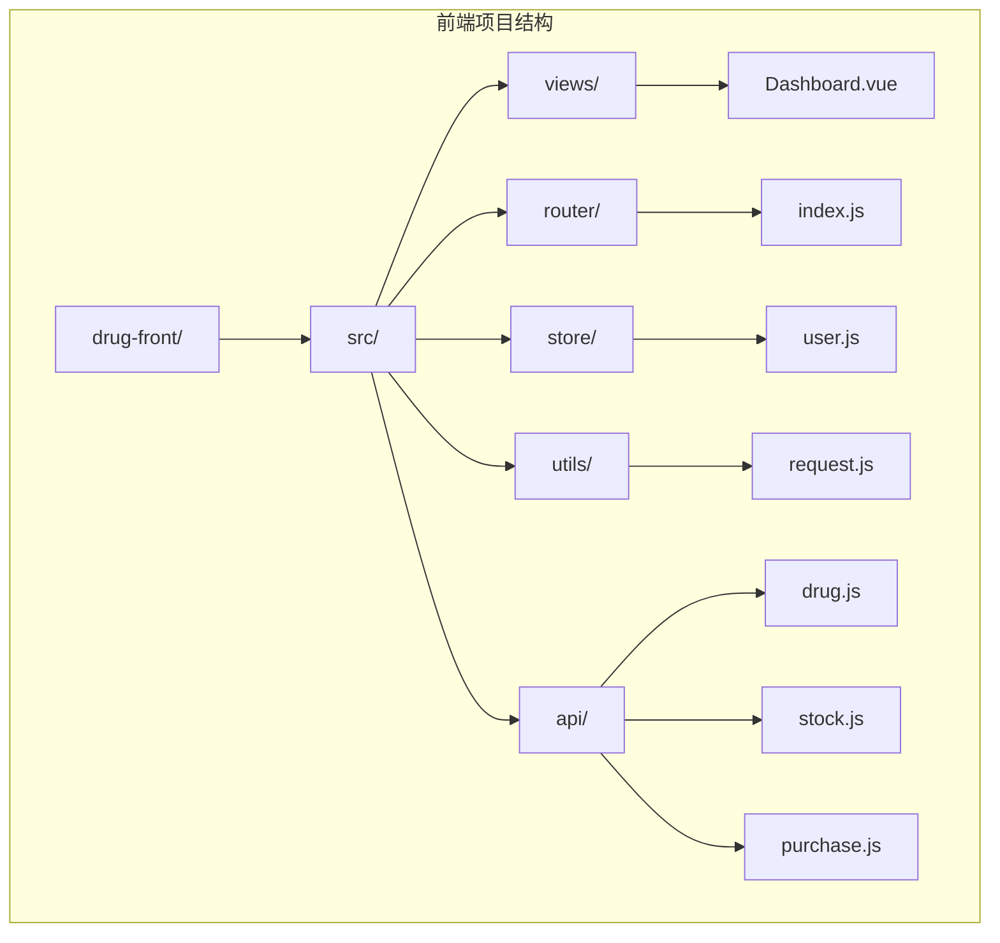

**图表来源**
- [Dashboard.vue:1-226](file://drug-front/src/views/Dashboard.vue#L1-L226)
- [index.js:1-115](file://drug-front/src/router/index.js#L1-L115)

**章节来源**
- [Dashboard.vue:1-226](file://drug-front/src/views/Dashboard.vue#L1-L226)
- [package.json:1-29](file://drug-front/package.json#L1-L29)

## 核心组件

### 组件架构概述

仪表板组件采用模块化设计，包含三个主要功能区域：

1. **统计卡片模块** - 展示关键业务指标
2. **快捷入口模块** - 提供快速导航功能
3. **公告信息模块** - 显示系统通知和公告

### 数据绑定与响应式设计

组件使用Vue 3的响应式系统，通过`ref`和`reactive`实现数据绑定：

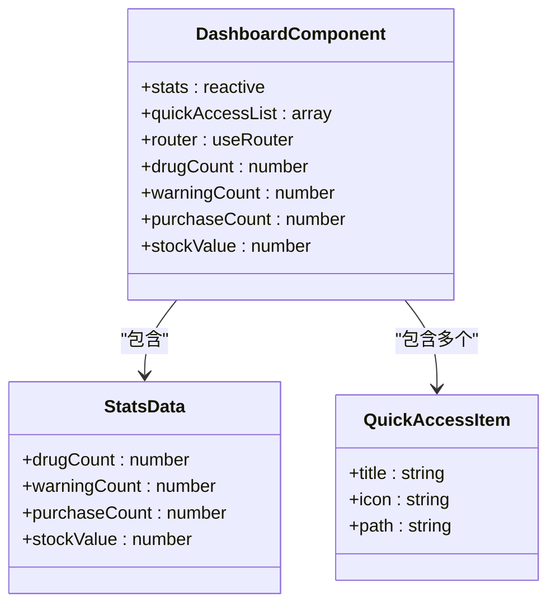

**图表来源**
- [Dashboard.vue:106-127](file://drug-front/src/views/Dashboard.vue#L106-L127)

**章节来源**
- [Dashboard.vue:106-127](file://drug-front/src/views/Dashboard.vue#L106-L127)

## 架构概览

仪表板组件在整个应用架构中的位置和交互关系如下：

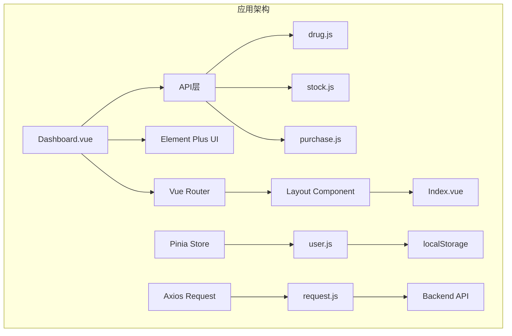

**图表来源**
- [Dashboard.vue:106-127](file://drug-front/src/views/Dashboard.vue#L106-L127)
- [index.js:1-115](file://drug-front/src/router/index.js#L1-L115)
- [request.js:1-56](file://drug-front/src/utils/request.js#L1-L56)

## 详细组件分析

### 统计卡片模块

统计卡片模块是仪表板的核心数据展示区域，包含四个关键指标：

#### 数据结构设计

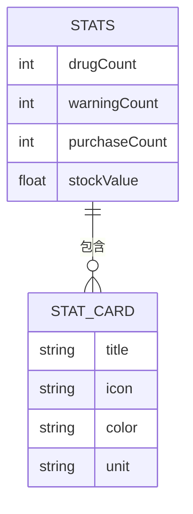

**图表来源**
- [Dashboard.vue:113-118](file://drug-front/src/views/Dashboard.vue#L113-L118)

#### 统计指标计算逻辑

每个统计指标都有其特定的计算方式和数据来源：

| 指标名称 | 计算方式 | 数据来源 | 更新频率 |
|---------|---------|---------|---------|
| 药品总数 | 系统内所有药品数量 | 药品API查询 | 实时更新 |
| 库存预警 | 库存低于安全阈值的药品数量 | 库存预警API | 实时更新 |
| 待审核采购单 | 状态为待审核的采购单数量 | 采购API查询 | 实时更新 |
| 库存总金额 | 所有药品库存价值总和 | 库存API计算 | 实时更新 |

#### 样式定制与响应式设计

统计卡片采用渐变背景色设计，支持响应式布局：

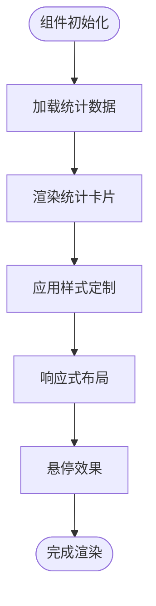

**图表来源**
- [Dashboard.vue:129-225](file://drug-front/src/views/Dashboard.vue#L129-L225)

**章节来源**
- [Dashboard.vue:5-62](file://drug-front/src/views/Dashboard.vue#L5-L62)

### 快捷入口功能

快捷入口模块提供四个主要功能模块的一键访问：

#### 功能模块配置

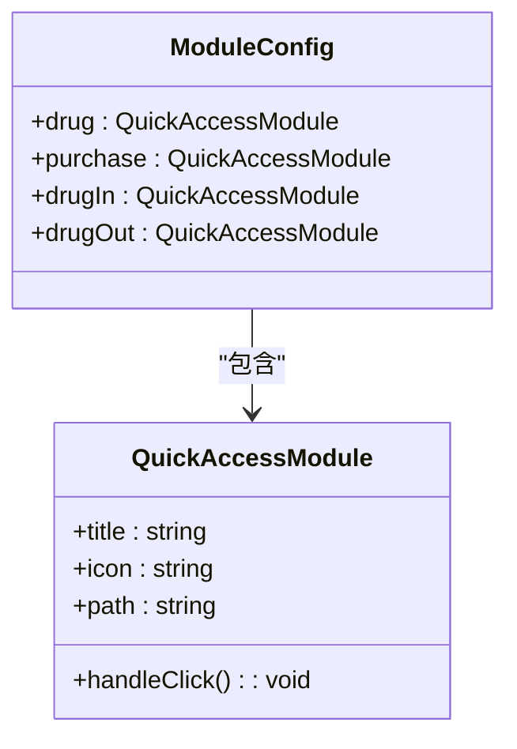

**图表来源**
- [Dashboard.vue:121-126](file://drug-front/src/views/Dashboard.vue#L121-L126)

#### 路由导航机制

快捷入口的点击事件通过Vue Router实现导航：

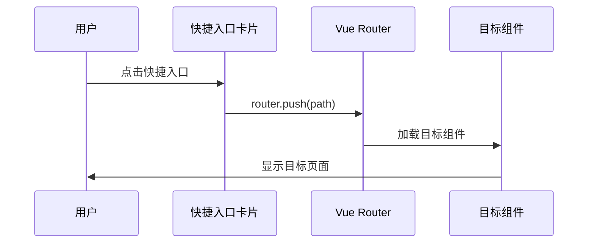

**图表来源**
- [Dashboard.vue:73-76](file://drug-front/src/views/Dashboard.vue#L73-L76)
- [index.js:1-115](file://drug-front/src/router/index.js#L1-L115)

**章节来源**
- [Dashboard.vue:64-79](file://drug-front/src/views/Dashboard.vue#L64-L79)

### 公告信息模块

公告信息模块采用时间线形式展示系统公告：

#### 数据结构设计

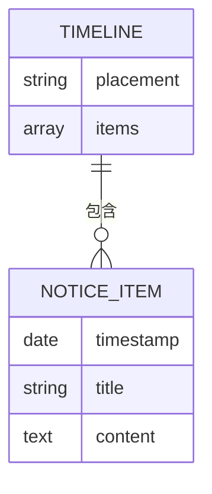

**图表来源**
- [Dashboard.vue:88-101](file://drug-front/src/views/Dashboard.vue#L88-L101)

#### 公告展示逻辑

公告模块目前包含两个预定义的系统通知，实际应用中应该从后端API动态获取公告数据。

**章节来源**
- [Dashboard.vue:81-102](file://drug-front/src/views/Dashboard.vue#L81-L102)

### 组件数据绑定与状态管理

#### 响应式数据流

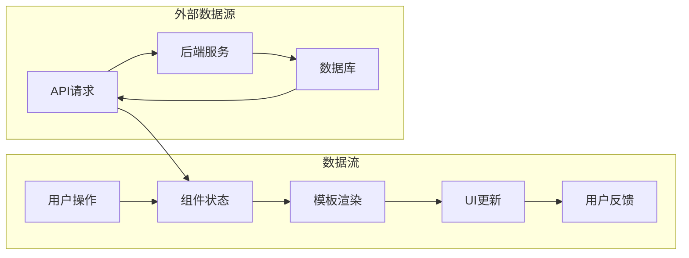

**图表来源**
- [Dashboard.vue:106-127](file://drug-front/src/views/Dashboard.vue#L106-L127)

**章节来源**
- [Dashboard.vue:106-127](file://drug-front/src/views/Dashboard.vue#L106-L127)

## 依赖关系分析

### 外部依赖

仪表板组件依赖以下核心库：

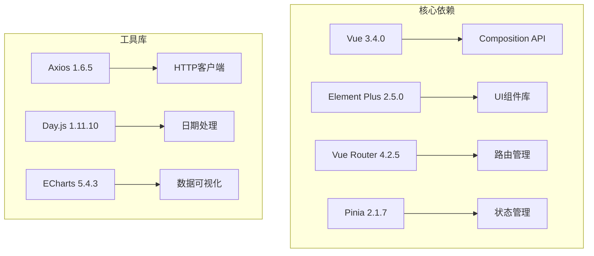

**图表来源**
- [package.json:13-27](file://drug-front/package.json#L13-L27)

### 内部依赖关系

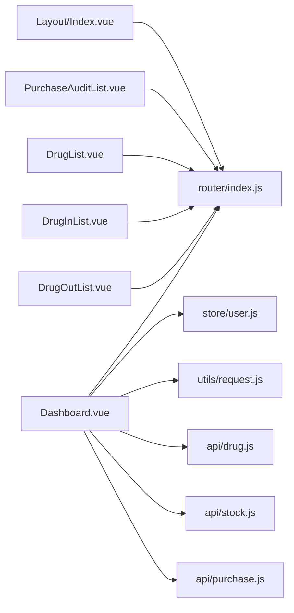

**图表来源**
- [Dashboard.vue:106-127](file://drug-front/src/views/Dashboard.vue#L106-L127)
- [index.js:1-115](file://drug-front/src/router/index.js#L1-L115)

**章节来源**
- [Dashboard.vue:106-127](file://drug-front/src/views/Dashboard.vue#L106-L127)
- [index.js:1-115](file://drug-front/src/router/index.js#L1-L115)

## 性能考虑

### 渲染性能优化

1. **懒加载组件** - 使用动态导入实现组件懒加载
2. **虚拟滚动** - 对于大量数据的表格使用虚拟滚动
3. **防抖处理** - 对频繁触发的操作使用防抖
4. **缓存策略** - 合理使用浏览器缓存和组件缓存

### 网络请求优化

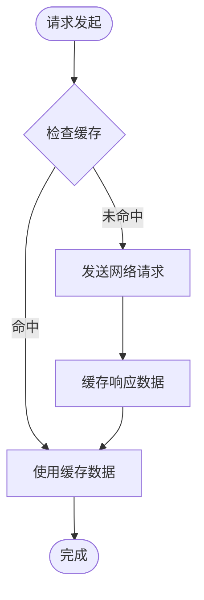

### 内存管理

1. **组件卸载清理** - 在组件卸载时清理定时器和事件监听器
2. **大对象处理** - 避免在组件中存储大型数据结构
3. **循环引用避免** - 注意避免创建循环引用导致内存泄漏

## 故障排除指南

### 常见问题及解决方案

#### API请求失败

**问题症状**：统计数据无法加载，页面显示默认值

**可能原因**：
1. 后端服务不可用
2. 网络连接异常
3. Token过期或无效

**解决步骤**：
1. 检查网络连接状态
2. 验证后端服务运行状态
3. 检查localStorage中的token有效性
4. 重新登录获取新的token

#### 路由导航问题

**问题症状**：点击快捷入口无反应或跳转到错误页面

**可能原因**：
1. 路由配置错误
2. 组件路径不正确
3. 权限不足

**解决步骤**：
1. 检查路由配置中的path和component设置
2. 验证目标组件是否存在
3. 检查用户权限配置

#### 样式显示异常

**问题症状**：统计卡片样式错乱或响应式布局失效

**可能原因**：
1. CSS类名冲突
2. 样式作用域问题
3. 浏览器兼容性问题

**解决步骤**：
1. 检查scoped样式的使用
2. 验证CSS变量的定义
3. 测试不同浏览器的兼容性

**章节来源**
- [request.js:27-53](file://drug-front/src/utils/request.js#L27-L53)
- [user.js:55-66](file://drug-front/src/store/user.js#L55-L66)

## 结论

仪表板组件作为医院药品管理系统的核心界面，成功实现了以下目标：

1. **功能完整性** - 提供了完整的统计展示、快捷导航和公告功能
2. **用户体验** - 采用现代化的设计理念，提供直观易用的界面
3. **技术先进性** - 使用Vue 3最新特性，确保代码的可维护性和可扩展性
4. **性能优化** - 通过合理的架构设计和优化策略，保证了良好的性能表现

该组件为后续的功能扩展奠定了坚实的基础，可以轻松地添加新的统计指标、快捷入口和公告类型。

## 附录

### 开发最佳实践

1. **代码组织** - 保持组件的单一职责原则
2. **错误处理** - 完善的错误边界和用户友好的错误提示
3. **测试覆盖** - 为关键功能编写单元测试和集成测试
4. **文档维护** - 保持代码注释和文档的及时更新

### 扩展建议

1. **实时数据更新** - 集成WebSocket实现实时数据推送
2. **个性化配置** - 允许用户自定义仪表板布局和显示内容
3. **多语言支持** - 添加国际化支持以适应多语言环境
4. **主题定制** - 提供多种主题选项满足不同用户的视觉需求