# 供应商管理页面

<cite>
**本文档引用的文件**
- [SupplierList.vue](file://drug-front/src/views/supplier/SupplierList.vue)
- [supplier.js](file://drug-front/src/api/supplier.js)
- [request.js](file://drug-front/src/utils/request.js)
- [SupplierInfoController.java](file://src/main/java/com/hospital/drugmanagement/controller/SupplierInfoController.java)
- [SupplierInfo.java](file://src/main/java/com/hospital/drugmanagement/entity/SupplierInfo.java)
- [SupplierInfoServiceImpl.java](file://src/main/java/com/hospital/drugmanagement/service/impl/SupplierInfoServiceImpl.java)
- [SupplierInfoMapper.java](file://src/main/java/com/hospital/drugmanagement/mapper/SupplierInfoMapper.java)
- [init.sql](file://src/main/resources/db/init.sql)
- [PurchaseOrder.java](file://src/main/java/com/hospital/drugmanagement/entity/PurchaseOrder.java)
- [PurchaseOrderList.vue](file://drug-front/src/views/purchase/PurchaseOrderList.vue)
- [purchase.js](file://drug-front/src/api/purchase.js)
- [index.js](file://drug-front/src/router/index.js)
</cite>

## 目录
1. [简介](#简介)
2. [项目结构](#项目结构)
3. [核心组件](#核心组件)
4. [架构概览](#架构概览)
5. [详细组件分析](#详细组件分析)
6. [依赖关系分析](#依赖关系分析)
7. [性能考虑](#性能考虑)
8. [故障排除指南](#故障排除指南)
9. [结论](#结论)
10. [附录](#附录)

## 简介

供应商管理页面是医院药品管理系统中的重要功能模块，负责维护和管理供应商信息。该页面实现了完整的供应商信息CRUD操作，包括供应商列表展示、新增编辑、状态管理和删除功能。系统采用前后端分离架构，前端使用Vue.js + Element Plus构建用户界面，后端基于Spring Boot + MyBatis Plus提供RESTful API服务。

## 项目结构

供应商管理页面位于前端项目的视图层，采用模块化组织方式：

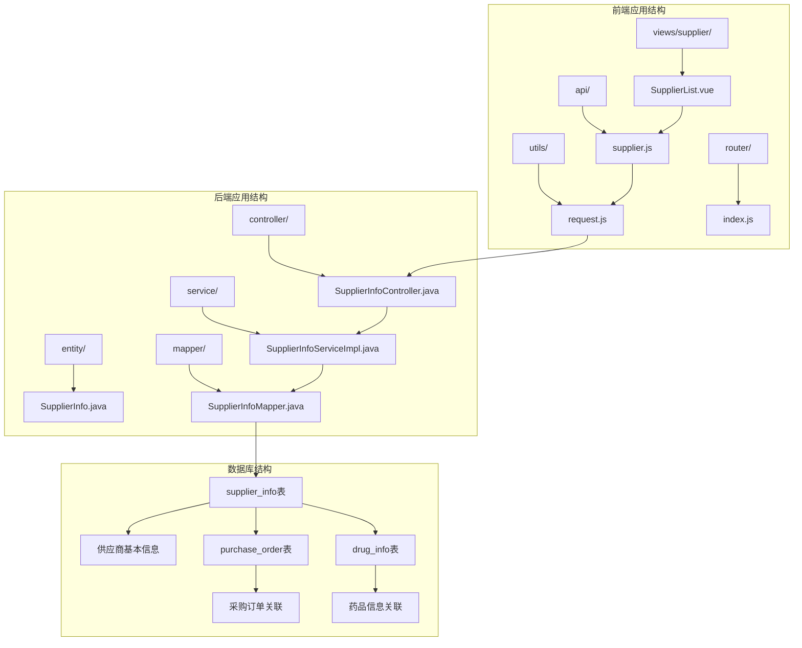

**图表来源**
- [SupplierList.vue:1-302](file://drug-front/src/views/supplier/SupplierList.vue#L1-L302)
- [supplier.js:1-45](file://drug-front/src/api/supplier.js#L1-L45)
- [SupplierInfoController.java:1-176](file://src/main/java/com/hospital/drugmanagement/controller/SupplierInfoController.java#L1-L176)

**章节来源**
- [SupplierList.vue:1-302](file://drug-front/src/views/supplier/SupplierList.vue#L1-L302)
- [index.js:28-33](file://drug-front/src/router/index.js#L28-L33)

## 核心组件

### 供应商信息实体模型

供应商实体类定义了完整的供应商信息结构，包含业务必需的关键字段：

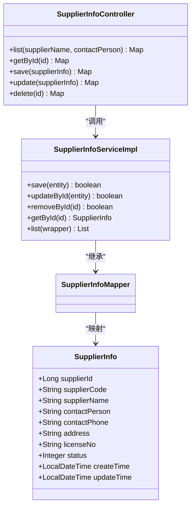

**图表来源**
- [SupplierInfo.java:14-39](file://src/main/java/com/hospital/drugmanagement/entity/SupplierInfo.java#L14-L39)
- [SupplierInfoController.java:15-176](file://src/main/java/com/hospital/drugmanagement/controller/SupplierInfoController.java#L15-L176)
- [SupplierInfoServiceImpl.java:9-11](file://src/main/java/com/hospital/drugmanagement/service/impl/SupplierInfoServiceImpl.java#L9-L11)

### 前端组件架构

前端采用Composition API模式，实现了完整的响应式数据绑定和事件处理机制：

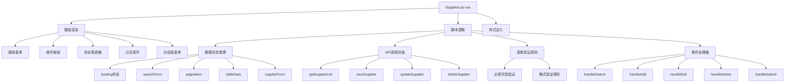

**图表来源**
- [SupplierList.vue:126-291](file://drug-front/src/views/supplier/SupplierList.vue#L126-L291)

**章节来源**
- [SupplierInfo.java:17-32](file://src/main/java/com/hospital/drugmanagement/entity/SupplierInfo.java#L17-L32)
- [SupplierList.vue:131-173](file://drug-front/src/views/supplier/SupplierList.vue#L131-L173)

## 架构概览

### 前后端交互流程

供应商管理页面采用标准的MVC架构模式，实现了清晰的职责分离：

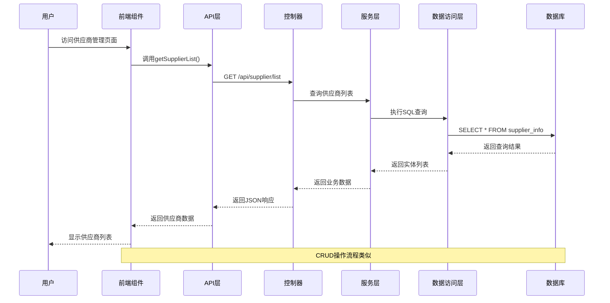

**图表来源**
- [SupplierList.vue:175-191](file://drug-front/src/views/supplier/SupplierList.vue#L175-L191)
- [supplier.js:3-10](file://drug-front/src/api/supplier.js#L3-L10)
- [SupplierInfoController.java:20-48](file://src/main/java/com/hospital/drugmanagement/controller/SupplierInfoController.java#L20-L48)

### 数据流架构

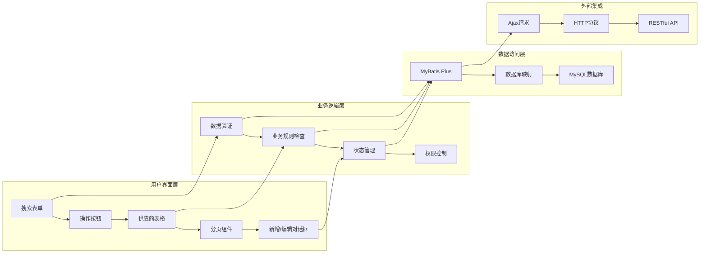

**图表来源**
- [SupplierList.vue:33-72](file://drug-front/src/views/supplier/SupplierList.vue#L33-L72)
- [SupplierInfoController.java:66-159](file://src/main/java/com/hospital/drugmanagement/controller/SupplierInfoController.java#L66-L159)

## 详细组件分析

### 供应商信息表格设计

供应商信息表格采用了响应式布局设计，支持多种数据展示需求：

#### 表格列设计

| 字段名 | 列宽 | 显示名称 | 功能特性 |
|--------|------|----------|----------|
| supplierCode | 120px | 供应商编码 | 固定宽度，便于对齐 |
| supplierName | 250px | 供应商名称 | 支持超长文本显示 |
| contactPerson | 120px | 联系人 | 紧凑布局 |
| contactPhone | 130px | 联系电话 | 数字格式显示 |
| address | 自适应 | 地址 | 超长文本省略显示 |
| licenseNo | 150px | 营业执照号 | 固定宽度 |
| status | 80px | 状态 | 颜色标识状态 |
| 操作 | 200px | 操作 | 固定右侧定位 |

#### 状态标识设计

状态字段采用颜色编码系统：
- **启用状态**：绿色标签显示"启用"
- **禁用状态**：红色标签显示"禁用"

这种设计提供了直观的状态可视化，便于用户快速识别供应商的可用性。

**章节来源**
- [SupplierList.vue:40-52](file://drug-front/src/views/supplier/SupplierList.vue#L40-L52)

### 供应商信息管理功能

#### 新增供应商功能

新增供应商功能提供了完整的表单输入界面：

```mermaid
flowchart TD
A[点击新增按钮] --> B[打开新增对话框]
B --> C[清空表单数据]
C --> D[设置对话框标题为"新增供应商"]
D --> E[用户填写表单字段]
E --> F[点击确定按钮]
F --> G[表单验证]
G --> H{验证通过?}
H --> |是| I[调用saveSupplier API]
H --> |否| J[显示验证错误]
I --> K[显示成功消息]
K --> L[关闭对话框]
L --> M[刷新供应商列表]
J --> N[停留在对话框]
```

**图表来源**
- [SupplierList.vue:206-217](file://drug-front/src/views/supplier/SupplierList.vue#L206-L217)
- [SupplierList.vue:237-261](file://drug-front/src/views/supplier/SupplierList.vue#L237-L261)

#### 编辑供应商功能

编辑功能支持对现有供应商信息的修改：

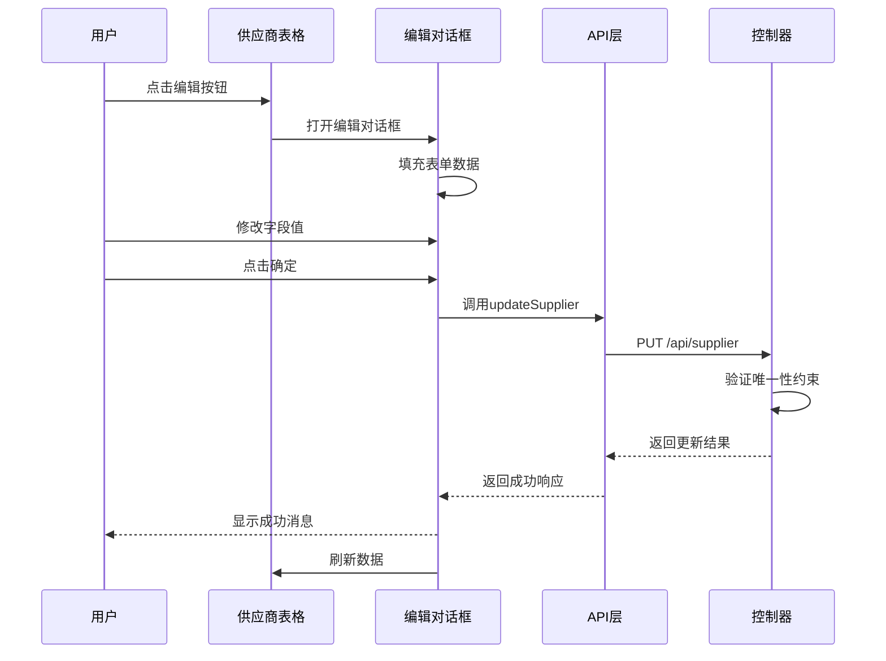

**图表来源**
- [SupplierList.vue:212-217](file://drug-front/src/views/supplier/SupplierList.vue#L212-L217)
- [SupplierList.vue:244-253](file://drug-front/src/views/supplier/SupplierList.vue#L244-L253)

#### 删除操作流程

删除功能实现了安全的级联删除机制：

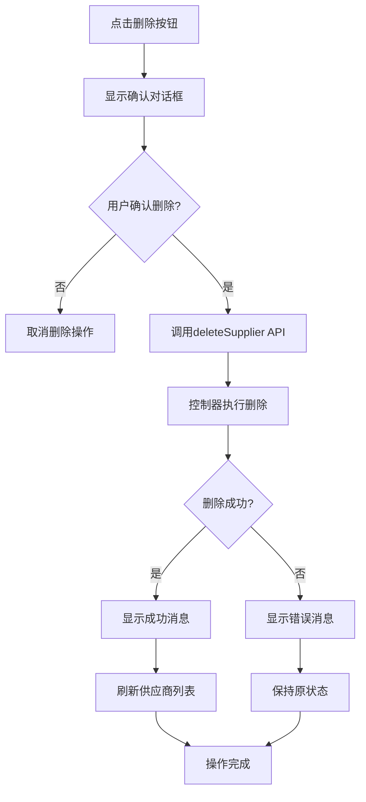

**图表来源**
- [SupplierList.vue:219-235](file://drug-front/src/views/supplier/SupplierList.vue#L219-L235)

**章节来源**
- [SupplierList.vue:206-235](file://drug-front/src/views/supplier/SupplierList.vue#L206-L235)

### 供应商数据CRUD操作

#### 表单验证机制

系统实现了多层次的数据验证机制：

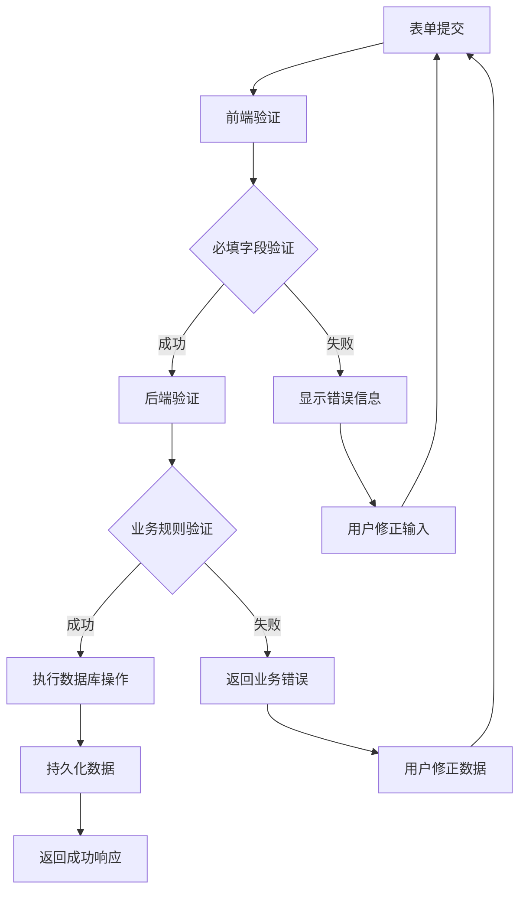

**图表来源**
- [SupplierList.vue:165-173](file://drug-front/src/views/supplier/SupplierList.vue#L165-L173)

#### 数据提交流程

数据提交过程遵循严格的事务处理原则：

| 验证阶段 | 验证内容 | 错误处理 |
|----------|----------|----------|
| 前端验证 | 必填字段检查 | 实时反馈错误 |
| 唯一性检查 | 供应商名称、编码、营业执照号 | 业务规则约束 |
| 数据完整性 | 字段格式验证 | 类型转换异常 |
| 业务一致性 | 状态有效性 | 业务逻辑校验 |

**章节来源**
- [SupplierList.vue:237-261](file://drug-front/src/views/supplier/SupplierList.vue#L237-L261)

### 供应商状态管理

#### 状态切换机制

供应商状态管理实现了灵活的状态控制：

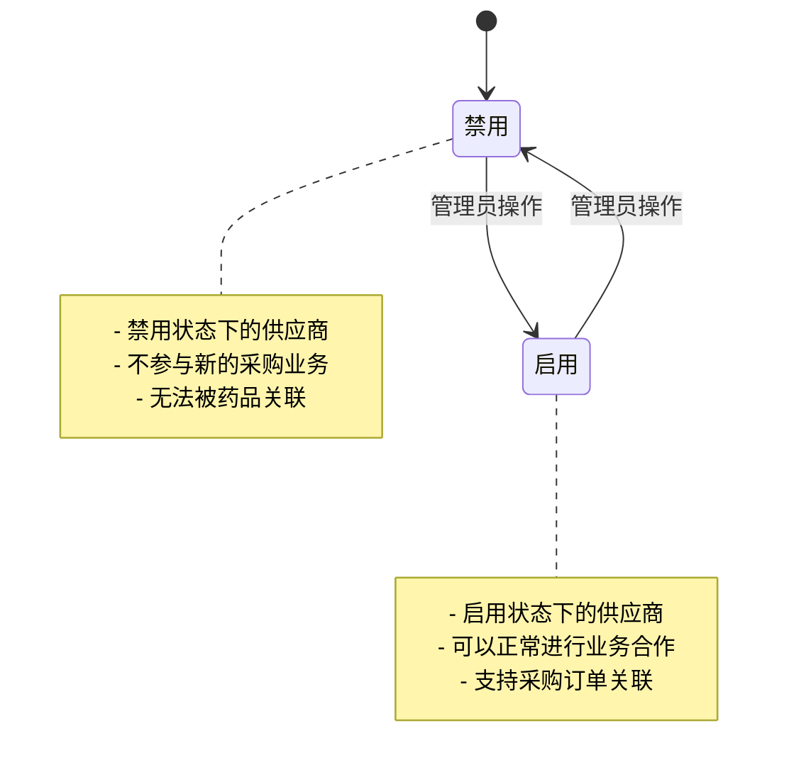

**图表来源**
- [SupplierInfo.java:32](file://src/main/java/com/hospital/drugmanagement/entity/SupplierInfo.java#L32)
- [SupplierList.vue:46-52](file://drug-front/src/views/supplier/SupplierList.vue#L46-L52)

#### 状态影响分析

状态变更对系统其他模块的影响：

| 影响模块 | 状态变更影响 | 处理机制 |
|----------|--------------|----------|
| 采购管理 | 禁用供应商无法创建新订单 | 订单创建时过滤禁用供应商 |
| 药品管理 | 禁用供应商的药品无法采购 | 药品采购时验证供应商状态 |
| 库存管理 | 禁用供应商的货物无法入库 | 入库流程中状态检查 |
| 报表统计 | 禁用供应商数据不再统计 | 报表查询时过滤禁用状态 |

**章节来源**
- [SupplierList.vue:46-52](file://drug-front/src/views/supplier/SupplierList.vue#L46-L52)

### 供应商与药品采购关系

#### 关联数据展示

供应商与药品采购之间存在直接的业务关联关系：

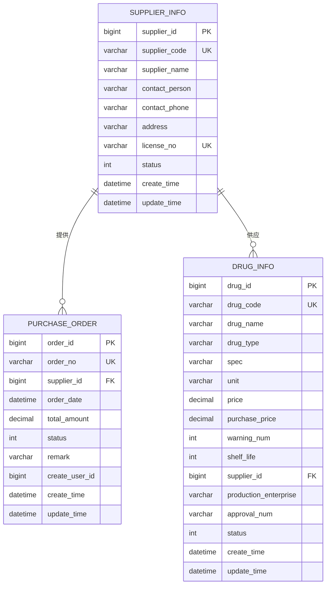

**图表来源**
- [init.sql:82-95](file://src/main/resources/db/init.sql#L82-L95)
- [init.sql:127-141](file://src/main/resources/db/init.sql#L127-L141)
- [init.sql:60-80](file://src/main/resources/db/init.sql#L60-L80)

#### 业务逻辑处理

供应商信息在采购业务中的处理逻辑：

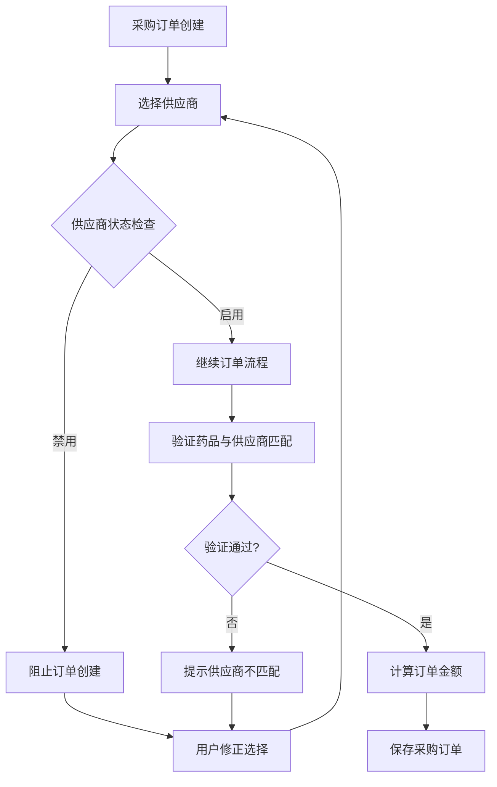

**图表来源**
- [PurchaseOrderList.vue:566-574](file://drug-front/src/views/purchase/PurchaseOrderList.vue#L566-L574)
- [PurchaseOrderList.vue:592-599](file://drug-front/src/views/purchase/PurchaseOrderList.vue#L592-L599)

**章节来源**
- [PurchaseOrderList.vue:566-599](file://drug-front/src/views/purchase/PurchaseOrderList.vue#L566-L599)

## 依赖关系分析

### 前端依赖关系

前端组件之间的依赖关系体现了清晰的模块化设计：

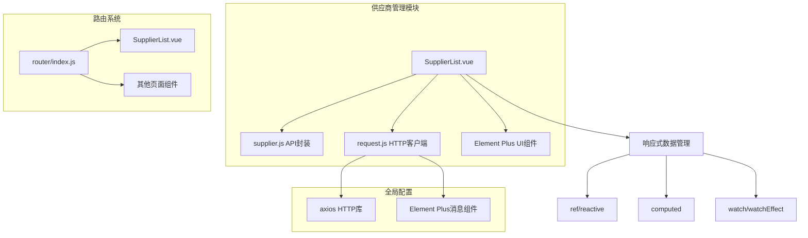

**图表来源**
- [SupplierList.vue:127-129](file://drug-front/src/views/supplier/SupplierList.vue#L127-L129)
- [supplier.js:1](file://drug-front/src/api/supplier.js#L1)
- [request.js:1-56](file://drug-front/src/utils/request.js#L1-L56)

### 后端依赖关系

后端服务层的依赖关系展现了标准的企业级架构：

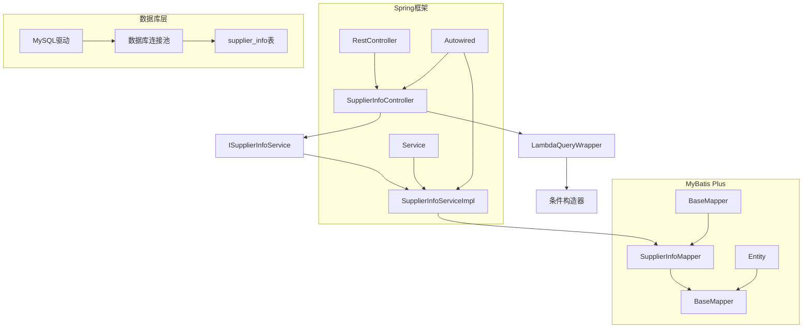

**图表来源**
- [SupplierInfoController.java:17-18](file://src/main/java/com/hospital/drugmanagement/controller/SupplierInfoController.java#L17-L18)
- [SupplierInfoServiceImpl.java:9-11](file://src/main/java/com/hospital/drugmanagement/service/impl/SupplierInfoServiceImpl.java#L9-L11)
- [SupplierInfoMapper.java:1-7](file://src/main/java/com/hospital/drugmanagement/mapper/SupplierInfoMapper.java#L1-L7)

**章节来源**
- [SupplierInfoController.java:17-18](file://src/main/java/com/hospital/drugmanagement/controller/SupplierInfoController.java#L17-L18)
- [SupplierInfoServiceImpl.java:9-11](file://src/main/java/com/hospital/drugmanagement/service/impl/SupplierInfoServiceImpl.java#L9-L11)

## 性能考虑

### 前端性能优化

供应商管理页面在前端层面实现了多项性能优化策略：

#### 数据加载优化
- **分页加载**：默认每页10条记录，支持10/20/50/100条切换
- **懒加载机制**：仅在需要时加载供应商列表数据
- **缓存策略**：合理利用浏览器缓存减少重复请求

#### 渲染性能
- **虚拟滚动**：对于大量数据场景可考虑实现虚拟滚动
- **组件复用**：对话框表单组件复用，避免重复渲染
- **响应式更新**：使用Vue 3的响应式系统优化更新性能

### 后端性能优化

#### 数据库优化
- **索引设计**：供应商表建立了必要的索引提高查询效率
- **查询优化**：使用条件查询包装器实现精确查询
- **连接池配置**：合理的数据库连接池配置

#### 业务逻辑优化
- **批量操作**：支持批量删除等批量操作
- **异步处理**：非阻塞的异步操作处理
- **缓存机制**：可考虑引入Redis缓存常用供应商数据

## 故障排除指南

### 常见问题及解决方案

#### API调用失败

**问题现象**：页面无法加载或显示空白
**可能原因**：
- 后端服务未启动
- 网络连接异常
- CORS跨域问题

**解决步骤**：
1. 检查后端服务日志
2. 验证API端点可用性
3. 检查浏览器开发者工具网络面板

#### 数据验证错误

**问题现象**：表单提交时报错
**可能原因**：
- 供应商名称重复
- 供应商编码重复
- 营业执照号重复

**解决步骤**：
1. 检查唯一性约束
2. 修改重复的字段值
3. 重新提交表单

#### 权限问题

**问题现象**：某些操作按钮不可用
**可能原因**：
- 用户权限不足
- 角色配置错误

**解决步骤**：
1. 检查用户角色权限
2. 验证菜单权限配置
3. 重新登录系统

**章节来源**
- [request.js:27-53](file://drug-front/src/utils/request.js#L27-L53)
- [SupplierInfoController.java:66-159](file://src/main/java/com/hospital/drugmanagement/controller/SupplierInfoController.java#L66-L159)

## 结论

供应商管理页面是一个功能完整、架构清晰的业务模块。通过前后端分离的设计模式，实现了良好的用户体验和系统的可维护性。页面涵盖了供应商管理的所有核心功能，包括数据展示、CRUD操作、状态管理和与其他模块的业务关联。

系统的主要优势包括：
- **完整的功能覆盖**：从基础信息管理到高级业务集成
- **良好的用户体验**：直观的界面设计和流畅的操作体验
- **可靠的系统架构**：清晰的分层设计和完善的错误处理
- **可扩展性强**：模块化设计便于功能扩展和维护

建议后续可以考虑的功能增强：
- 添加供应商导入导出功能
- 实现供应商评分和评价系统
- 增强搜索和筛选功能
- 添加供应商历史记录追踪

## 附录

### 开发示例

#### 供应商管理页面开发要点

1. **组件设计**
   - 使用Composition API实现逻辑复用
   - 合理划分组件职责
   - 实现响应式数据绑定

2. **API集成**
   - 封装统一的API调用方法
   - 实现错误处理和重试机制
   - 支持加载状态显示

3. **表单验证**
   - 实现前后端双重验证
   - 提供友好的错误提示
   - 支持实时验证反馈

4. **状态管理**
   - 使用Vuex或Pinia进行状态管理
   - 实现数据持久化
   - 支持撤销和重做功能

#### 数据验证规则

| 字段 | 验证规则 | 错误提示 |
|------|----------|----------|
| supplierCode | 必填，唯一性检查 | 请输入供应商编码 |
| supplierName | 必填，长度限制 | 请输入供应商名称 |
| contactPerson | 必填 | 请输入联系人 |
| contactPhone | 必填，手机号格式 | 请输入联系电话 |
| address | 必填 | 请输入地址 |
| licenseNo | 必填，唯一性检查 | 请输入营业执照号 |

#### 业务规则实现

1. **唯一性约束**
   - 供应商名称唯一
   - 供应商编码唯一
   - 营业执照号唯一

2. **状态管理**
   - 默认启用状态
   - 禁用状态下不能创建新业务
   - 状态变更需要管理员权限

3. **关联关系**
   - 供应商与采购订单关联
   - 供应商与药品信息关联
   - 删除供应商时处理关联数据