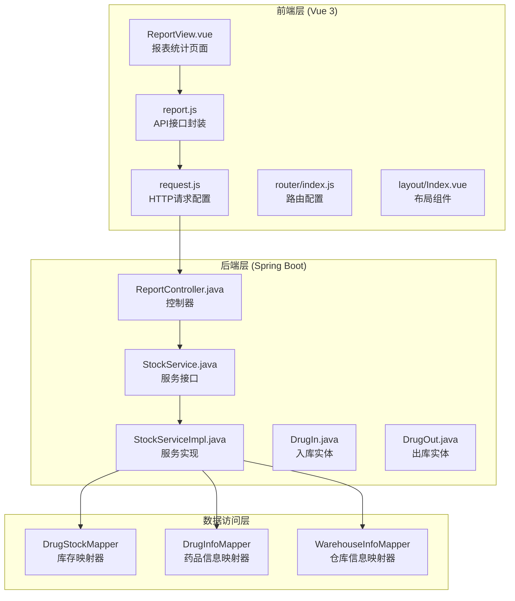
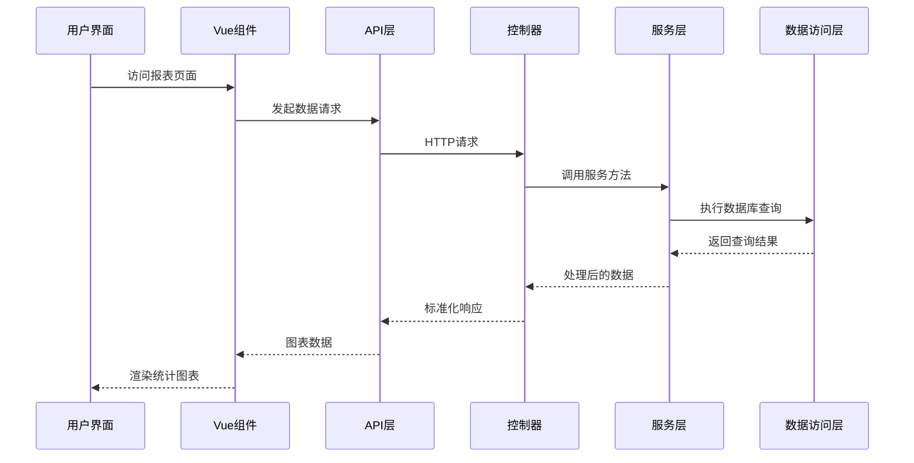
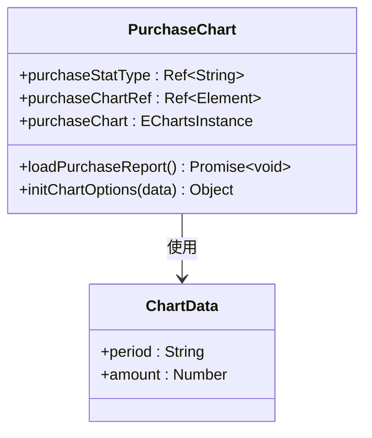
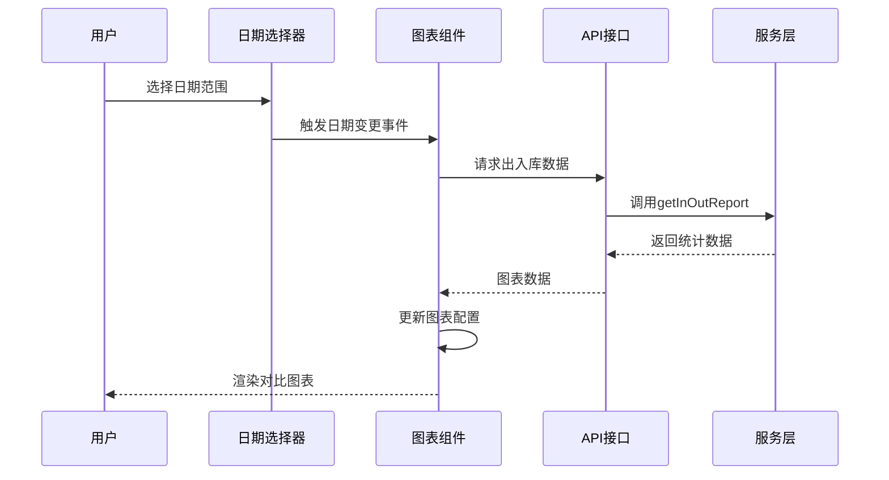
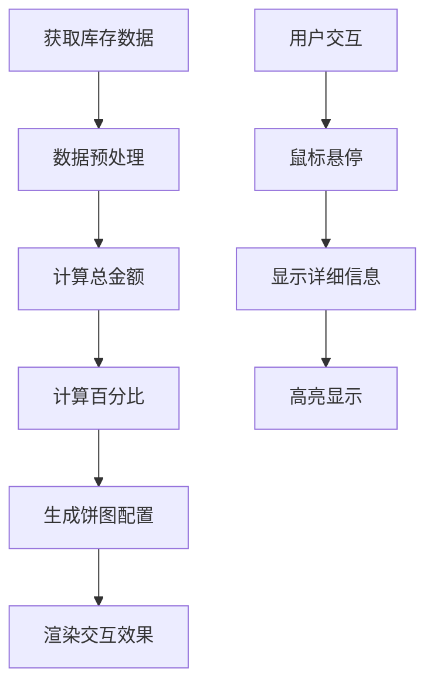
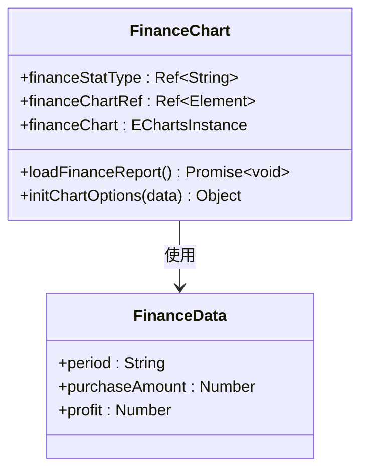
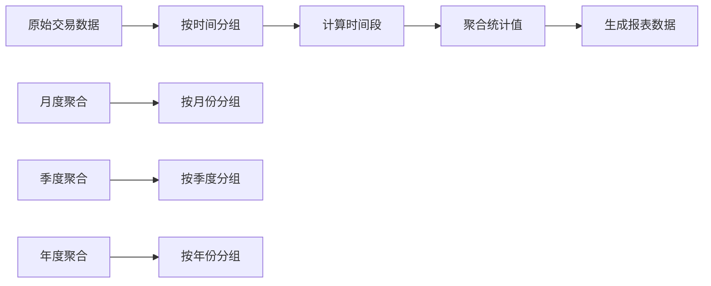
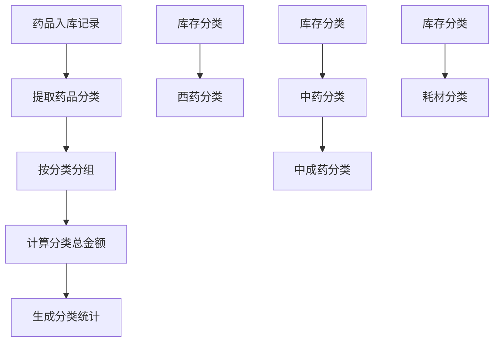
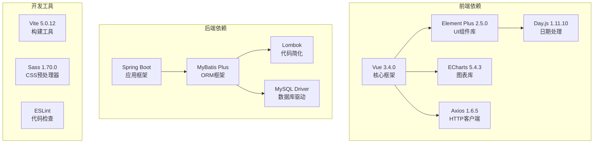

# 报表统计页面

<cite>
**本文档引用的文件**
- [ReportView.vue](file://drug-front/src/views/report/ReportView.vue)
- [report.js](file://drug-front/src/api/report.js)
- [ReportController.java](file://src/main/java/com/hospital/drugmanagement/controller/ReportController.java)
- [StockService.java](file://src/main/java/com/hospital/drugmanagement/service/StockService.java)
- [StockServiceImpl.java](file://src/main/java/com/hospital/drugmanagement/service/impl/StockServiceImpl.java)
- [index.js](file://drug-front/src/router/index.js)
- [request.js](file://drug-front/src/utils/request.js)
- [package.json](file://drug-front/package.json)
- [DrugIn.java](file://src/main/java/com/hospital/drugmanagement/entity/DrugIn.java)
- [DrugOut.java](file://src/main/java/com/hospital/drugmanagement/entity/DrugOut.java)
- [Index.vue](file://drug-front/src/layout/Index.vue)
- [App.vue](file://drug-front/src/App.vue)
</cite>

## 目录
1. [简介](#简介)
2. [项目结构](#项目结构)
3. [核心组件](#核心组件)
4. [架构概览](#架构概览)
5. [详细组件分析](#详细组件分析)
6. [依赖分析](#依赖分析)
7. [性能考虑](#性能考虑)
8. [故障排除指南](#故障排除指南)
9. [结论](#结论)
10. [附录](#附录)

## 简介

报表统计页面是医院药品管理系统中的重要功能模块，负责提供多维度的数据可视化展示。该系统集成了多种统计图表，包括采购统计、出入库统计、库存统计和财务报表，为管理员提供全面的业务洞察。

本系统采用前后端分离架构，前端使用Vue 3 + Element Plus + ECharts技术栈，后端基于Spring Boot + MyBatis Plus构建RESTful API服务。通过专业的图表库实现丰富的数据可视化效果，支持多种统计维度和交互式操作。

## 项目结构

系统采用标准的前后端分离项目结构，主要分为以下层次：

**图表来源**
- [ReportView.vue:1-333](file://drug-front/src/views/report/ReportView.vue#L1-L333)
- [ReportController.java:1-101](file://src/main/java/com/hospital/drugmanagement/controller/ReportController.java#L1-L101)
- [StockServiceImpl.java:1-241](file://src/main/java/com/hospital/drugmanagement/service/impl/StockServiceImpl.java#L1-L241)

**章节来源**
- [ReportView.vue:1-333](file://drug-front/src/views/report/ReportView.vue#L1-L333)
- [index.js:1-115](file://drug-front/src/router/index.js#L1-L115)
- [package.json:1-29](file://drug-front/package.json#L1-L29)

## 核心组件

### 报表统计主组件

ReportView.vue是整个报表统计页面的核心组件，采用Composition API模式实现，集成了四个主要的统计图表区域：

1. **采购统计图表** - 展示不同时间维度的采购金额变化
2. **出入库统计图表** - 显示指定日期范围内的入库和出库金额对比
3. **库存统计图表** - 以饼图形式展示各类药品库存金额分布
4. **财务统计图表** - 展示采购支出与销售毛利的对比分析

每个图表都具备独立的配置选项和交互功能，支持动态数据刷新和响应式布局。

**章节来源**
- [ReportView.vue:64-316](file://drug-front/src/views/report/ReportView.vue#L64-L316)

### API接口层

系统通过统一的API接口层管理所有报表相关的数据请求：

- `getPurchaseReport`: 获取采购统计数据
- `getInOutReport`: 获取出入库统计数据
- `getStockReport`: 获取库存统计数据
- `getFinanceReport`: 获取财务统计数据

每个接口都遵循RESTful设计原则，支持参数化查询和标准化响应格式。

**章节来源**
- [report.js:1-38](file://drug-front/src/api/report.js#L1-L38)

### 后端服务层

后端采用分层架构设计，StockService接口定义了所有报表统计功能的服务契约，StockServiceImpl提供具体的实现逻辑：

- `getPurchaseReport`: 采购统计报表数据计算
- `getInOutReport`: 出入库统计报表数据计算  
- `getStockReport`: 库存统计报表数据计算
- `getFinanceReport`: 财务统计报表数据计算

**章节来源**
- [StockService.java:1-59](file://src/main/java/com/hospital/drugmanagement/service/StockService.java#L1-L59)
- [StockServiceImpl.java:115-239](file://src/main/java/com/hospital/drugmanagement/service/impl/StockServiceImpl.java#L115-L239)

## 架构概览

系统采用经典的三层架构模式，实现了清晰的职责分离和良好的可扩展性：

**图表来源**
- [ReportView.vue:88-300](file://drug-front/src/views/report/ReportView.vue#L88-L300)
- [ReportController.java:21-99](file://src/main/java/com/hospital/drugmanagement/controller/ReportController.java#L21-L99)
- [StockServiceImpl.java:115-239](file://src/main/java/com/hospital/drugmanagement/service/impl/StockServiceImpl.java#L115-L239)

## 详细组件分析

### 采购统计图表组件

采购统计图表采用柱状图展示不同时间维度的采购金额变化，支持月度、季度、年度三种统计周期：

**图表来源**
- [ReportView.vue:69-133](file://drug-front/src/views/report/ReportView.vue#L69-L133)

图表特性：
- **时间维度切换**: 支持月度、季度、年度三种统计周期
- **数据可视化**: 使用蓝色柱状图展示采购金额变化
- **交互功能**: 点击图表项进行高亮显示
- **响应式设计**: 自适应容器尺寸变化

**章节来源**
- [ReportView.vue:88-133](file://drug-front/src/views/report/ReportView.vue#L88-L133)
- [StockServiceImpl.java:115-152](file://src/main/java/com/hospital/drugmanagement/service/impl/StockServiceImpl.java#L115-L152)

### 出入库统计图表组件

出入库统计图表采用折线图展示指定日期范围内的入库和出库金额对比，支持自定义日期范围选择：

**图表来源**
- [ReportView.vue:135-200](file://drug-front/src/views/report/ReportView.vue#L135-L200)

图表特性：
- **日期范围选择**: 支持自定义开始和结束日期
- **双轴对比**: 同时展示入库和出库金额变化
- **平滑曲线**: 使用平滑曲线增强视觉效果
- **面积填充**: 为两条曲线添加透明面积填充

**章节来源**
- [ReportView.vue:135-200](file://drug-front/src/views/report/ReportView.vue#L135-L200)
- [StockServiceImpl.java:154-174](file://src/main/java/com/hospital/drugmanagement/service/impl/StockServiceImpl.java#L154-L174)

### 库存统计图表组件

库存统计图表采用饼图展示各类药品库存金额分布，提供详细的分类统计信息：

**图表来源**
- [ReportView.vue:202-245](file://drug-front/src/views/report/ReportView.vue#L202-L245)

图表特性：
- **分类统计**: 展示西药、中药、中成药、耗材等分类
- **百分比显示**: 自动计算各分类占总库存的比例
- **交互高亮**: 鼠标悬停时突出显示对应分类
- **阴影效果**: 增强视觉层次感

**章节来源**
- [ReportView.vue:202-245](file://drug-front/src/views/report/ReportView.vue#L202-L245)
- [StockServiceImpl.java:176-194](file://src/main/java/com/hospital/drugmanagement/service/impl/StockServiceImpl.java#L176-L194)

### 财务统计图表组件

财务统计图表采用双柱状图展示采购支出与销售毛利的对比分析，支持多种时间维度：

**图表来源**
- [ReportView.vue:247-300](file://drug-front/src/views/report/ReportView.vue#L247-L300)

图表特性：
- **财务指标**: 展示采购支出和销售毛利两个关键指标
- **颜色区分**: 采购支出使用红色，销售毛利使用绿色
- **对比分析**: 直观展示财务健康状况
- **多维度支持**: 支持月度、季度、年度统计

**章节来源**
- [ReportView.vue:247-300](file://drug-front/src/views/report/ReportView.vue#L247-L300)
- [StockServiceImpl.java:196-239](file://src/main/java/com/hospital/drugmanagement/service/impl/StockServiceImpl.java#L196-L239)

### 数据聚合算法

系统实现了多种数据聚合算法来处理复杂的统计计算：

#### 时间维度聚合算法

**图表来源**
- [StockServiceImpl.java:115-152](file://src/main/java/com/hospital/drugmanagement/service/impl/StockServiceImpl.java#L115-L152)
- [StockServiceImpl.java:196-239](file://src/main/java/com/hospital/drugmanagement/service/impl/StockServiceImpl.java#L196-L239)

#### 分类汇总算法

**图表来源**
- [StockServiceImpl.java:176-194](file://src/main/java/com/hospital/drugmanagement/service/impl/StockServiceImpl.java#L176-L194)

#### 数据分组算法

**图表来源**
- [StockServiceImpl.java:154-174](file://src/main/java/com/hospital/drugmanagement/service/impl/StockServiceImpl.java#L154-L174)

## 依赖分析

系统采用模块化的依赖管理策略，确保各组件间的松耦合和高内聚：

**图表来源**
- [package.json:13-28](file://drug-front/package.json#L13-L28)

### 组件耦合度分析

系统在设计上注重降低组件间的耦合度：

- **API层解耦**: 前端通过统一的API接口与后端通信
- **服务层抽象**: 后端通过接口定义服务契约，便于测试和替换
- **数据传输格式**: 统一使用JSON格式进行数据交换
- **错误处理机制**: 标准化的错误响应格式

**章节来源**
- [request.js:1-56](file://drug-front/src/utils/request.js#L1-L56)
- [ReportController.java:10-101](file://src/main/java/com/hospital/drugmanagement/controller/ReportController.java#L10-L101)

## 性能考虑

系统在设计时充分考虑了性能优化和用户体验：

### 图表渲染优化

- **懒加载机制**: 图表组件采用延迟初始化，避免页面加载时的性能开销
- **响应式适配**: 图表自动适应容器尺寸变化，无需手动重绘
- **内存管理**: 合理的图表实例生命周期管理，防止内存泄漏

### 数据处理优化

- **虚拟滚动**: 对于大量数据的列表展示，采用虚拟滚动技术提升性能
- **数据缓存**: 合理的缓存策略减少重复的数据请求
- **批量更新**: 使用批量更新机制优化DOM操作

### 网络请求优化

- **请求合并**: 将多个相关的API请求合并为一次调用
- **超时控制**: 合理的请求超时设置，避免长时间等待
- **错误重试**: 实现智能的错误重试机制

## 故障排除指南

### 常见问题及解决方案

#### 图表不显示问题

**问题描述**: 图表初始化失败或显示空白

**可能原因**:
- DOM元素尚未渲染完成
- 图表容器尺寸为0
- ECharts实例初始化失败

**解决步骤**:
1. 确认DOM元素已经渲染完成
2. 检查图表容器的CSS样式
3. 验证ECharts库的正确引入
4. 查看浏览器控制台的错误信息

#### 数据加载失败

**问题描述**: 报表数据无法正常加载

**可能原因**:
- API接口地址配置错误
- 网络连接异常
- 服务器响应超时
- 权限验证失败

**解决步骤**:
1. 检查API接口的URL配置
2. 验证网络连接状态
3. 查看服务器日志
4. 确认用户权限状态

#### 性能问题

**问题描述**: 页面加载缓慢或图表渲染卡顿

**可能原因**:
- 数据量过大
- 图表配置过于复杂
- 浏览器兼容性问题

**解决步骤**:
1. 优化数据查询条件
2. 简化图表配置
3. 实现数据分页加载
4. 考虑使用Web Workers

**章节来源**
- [ReportView.vue:302-308](file://drug-front/src/views/report/ReportView.vue#L302-L308)
- [request.js:27-53](file://drug-front/src/utils/request.js#L27-L53)

## 结论

报表统计页面作为医院药品管理系统的核心功能模块，成功实现了多维度的数据可视化展示。系统采用现代化的技术栈和架构设计，在保证功能完整性的同时，兼顾了性能优化和用户体验。

通过四个主要的统计图表模块，管理员可以全面掌握药品管理的各项关键指标，包括采购情况、出入库动态、库存分布和财务状况。系统的设计具有良好的扩展性和维护性，为后续的功能扩展奠定了坚实的基础。

未来可以在以下几个方面进一步完善：
- 增加更多类型的统计图表
- 实现报表数据的实时更新
- 提供报表导出功能
- 优化大数据量场景下的性能表现

## 附录

### 开发示例

#### 新增报表类型步骤

1. **前端组件开发**:
   - 在ReportView.vue中添加新的图表区域
   - 实现相应的数据加载函数
   - 配置图表的ECharts选项

2. **API接口扩展**:
   - 在report.js中添加新的API函数
   - 在后端控制器中实现对应的处理方法

3. **服务层实现**:
   - 在StockService接口中添加方法定义
   - 在StockServiceImpl中实现具体的统计逻辑

#### 图表库集成最佳实践

- **选择合适的图表类型**: 根据数据特点选择最适合的图表类型
- **优化图表配置**: 合理设置图表的颜色、字体、间距等样式属性
- **实现交互功能**: 添加必要的交互功能如缩放、筛选、导出等
- **处理边界情况**: 考虑空数据、异常数据等特殊情况的处理

#### 大数据量处理优化

- **数据分页**: 对于大量数据采用分页加载策略
- **虚拟滚动**: 使用虚拟滚动技术提升大数据列表的性能
- **数据缓存**: 合理利用浏览器缓存减少重复请求
- **异步加载**: 采用异步加载机制避免阻塞主线程