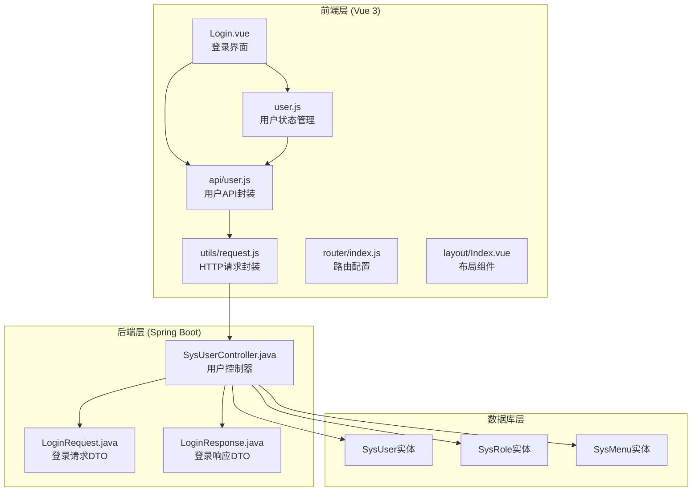
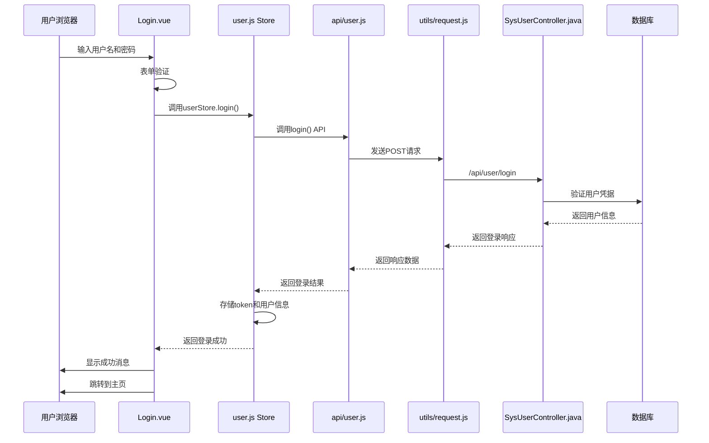
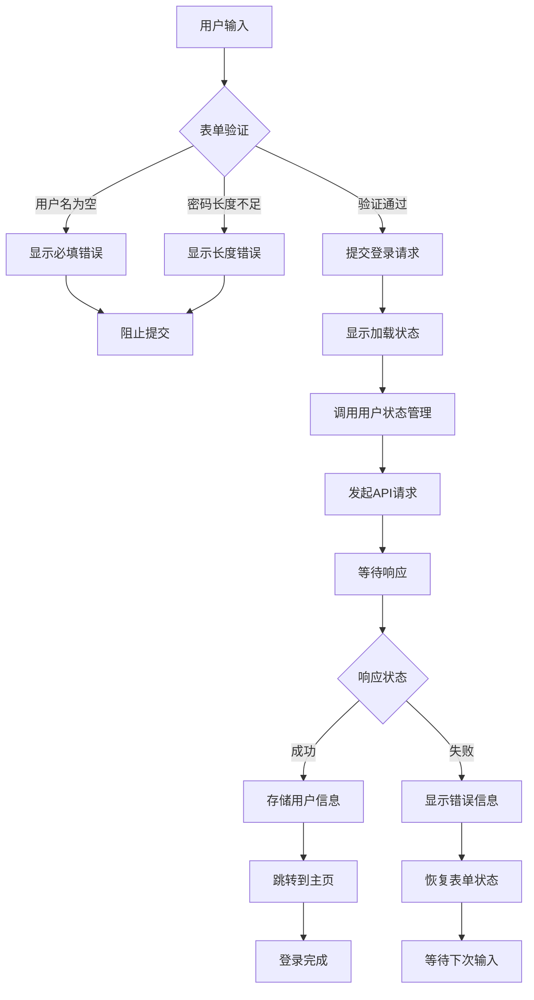
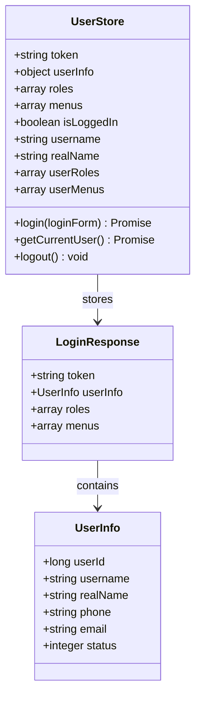
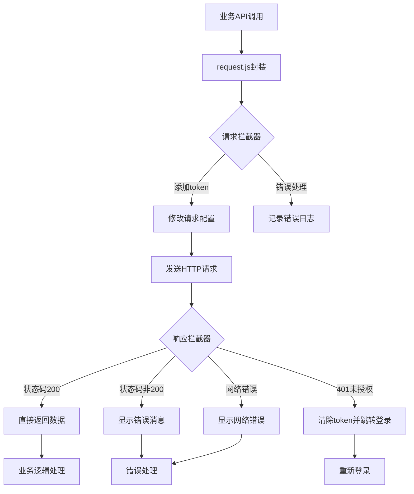
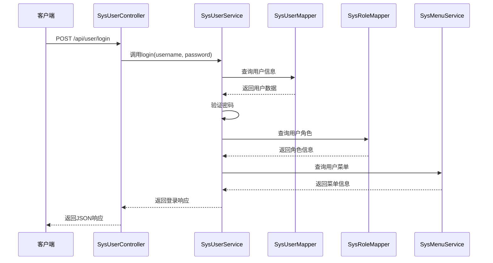
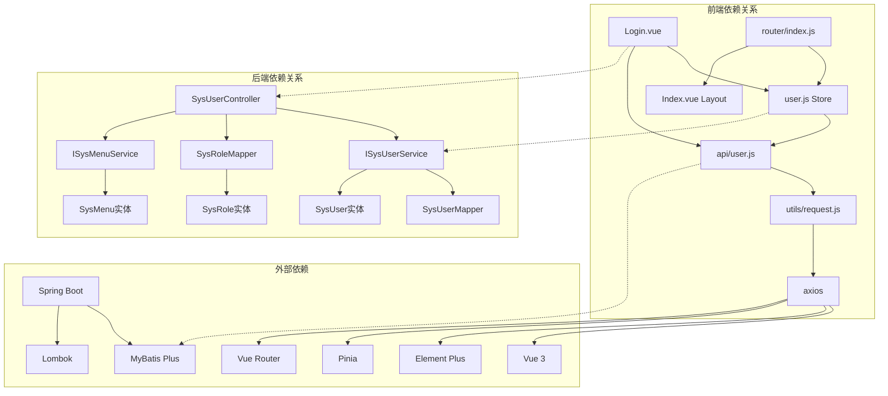

# 登录组件

<cite>
**本文档引用的文件**
- [Login.vue](file://drug-front/src/views/Login.vue)
- [user.js](file://drug-front/src/store/user.js)
- [user.js](file://drug-front/src/api/user.js)
- [request.js](file://drug-front/src/utils/request.js)
- [index.js](file://drug-front/src/router/index.js)
- [Index.vue](file://drug-front/src/layout/Index.vue)
- [App.vue](file://drug-front/src/App.vue)
- [LoginRequest.java](file://src/main/java/com/hospital/drugmanagement/dto/LoginRequest.java)
- [LoginResponse.java](file://src/main/java/com/hospital/drugmanagement/dto/LoginResponse.java)
- [SysUserController.java](file://src/main/java/com/hospital/drugmanagement/controller/SysUserController.java)
- [package.json](file://drug-front/package.json)
</cite>

## 目录
1. [简介](#简介)
2. [项目结构](#项目结构)
3. [核心组件](#核心组件)
4. [架构概览](#架构概览)
5. [详细组件分析](#详细组件分析)
6. [依赖分析](#依赖分析)
7. [性能考虑](#性能考虑)
8. [故障排除指南](#故障排除指南)
9. [结论](#结论)
10. [附录](#附录)

## 简介

本文档详细介绍了药物管理系统中的登录组件实现。该系统采用前后端分离架构，前端使用Vue 3 + Element Plus构建，后端使用Spring Boot提供RESTful API服务。登录组件负责用户身份验证、表单验证、状态管理和会话管理等核心功能。

## 项目结构

该项目采用典型的前后端分离架构，主要分为以下层次：



**图表来源**
- [Login.vue:1-127](file://drug-front/src/views/Login.vue#L1-L127)
- [user.js:1-68](file://drug-front/src/store/user.js#L1-L68)
- [SysUserController.java:1-421](file://src/main/java/com/hospital/drugmanagement/controller/SysUserController.java#L1-L421)

**章节来源**
- [Login.vue:1-127](file://drug-front/src/views/Login.vue#L1-L127)
- [user.js:1-68](file://drug-front/src/store/user.js#L1-L68)
- [SysUserController.java:1-421](file://src/main/java/com/hospital/drugmanagement/controller/SysUserController.java#L1-L421)

## 核心组件

### 登录表单组件

登录组件采用Vue 3 Composition API编写，实现了完整的用户登录功能：

- **表单设计**: 使用Element Plus的表单组件，包含用户名和密码输入框
- **验证机制**: 实现了必填字段检查和密码长度验证
- **交互体验**: 支持Enter键快速登录，加载状态指示
- **样式设计**: 响应式布局，现代化视觉效果

### 用户状态管理

Pinia状态管理提供了完整的用户认证状态管理：

- **状态持久化**: 使用localStorage存储token、用户信息、角色和菜单权限
- **状态计算**: 提供isLoggedIn、username、realName等计算属性
- **动作方法**: 实现login、getCurrentUser、logout等核心操作
- **自动同步**: 与localStorage保持状态同步

### API通信层

封装了统一的HTTP请求处理机制：

- **请求拦截**: 自动添加Authorization头信息
- **响应处理**: 统一处理错误状态码和业务逻辑
- **会话管理**: 处理401未授权状态，自动跳转登录页
- **错误处理**: 提供友好的错误提示和日志记录

**章节来源**
- [Login.vue:46-93](file://drug-front/src/views/Login.vue#L46-L93)
- [user.js:1-68](file://drug-front/src/store/user.js#L1-L68)
- [request.js:1-56](file://drug-front/src/utils/request.js#L1-L56)

## 架构概览

系统采用分层架构设计，确保职责分离和代码可维护性：



**图表来源**
- [Login.vue:74-92](file://drug-front/src/views/Login.vue#L74-L92)
- [user.js:20-38](file://drug-front/src/store/user.js#L20-L38)
- [user.js:55-62](file://drug-front/src/api/user.js#L55-L62)
- [request.js:11-53](file://drug-front/src/utils/request.js#L11-L53)
- [SysUserController.java:43-68](file://src/main/java/com/hospital/drugmanagement/controller/SysUserController.java#L43-L68)

## 详细组件分析

### 登录表单组件分析

#### 表单设计与验证

登录表单采用了Element Plus的表单组件体系，实现了完整的用户输入验证：



**图表来源**
- [Login.vue:64-72](file://drug-front/src/views/Login.vue#L64-L72)
- [Login.vue:75-92](file://drug-front/src/views/Login.vue#L75-L92)

#### 表单验证规则详解

表单验证规则定义在组件中，确保用户输入的有效性：

| 字段 | 验证规则 | 触发时机 | 错误消息 |
|------|----------|----------|----------|
| username | 必填验证 | 失去焦点 | 请输入用户名 |
| password | 必填验证 + 最小长度6位 | 失去焦点 | 请输入密码 |

验证规则使用Element Plus的表单验证机制，支持实时反馈和批量验证。

#### 用户认证流程

登录组件的认证流程包括多个步骤：

1. **表单验证**: 使用Element Plus的表单验证器
2. **状态设置**: 将loading状态设为true
3. **API调用**: 通过userStore调用登录方法
4. **响应处理**: 成功时显示成功消息，失败时记录错误
5. **页面跳转**: 登录成功后跳转到系统主页

**章节来源**
- [Login.vue:57-92](file://drug-front/src/views/Login.vue#L57-L92)

### 用户状态管理分析

#### Pinia Store设计

用户状态管理使用Pinia框架，提供了响应式的状态管理能力：



**图表来源**
- [user.js:4-66](file://drug-front/src/store/user.js#L4-L66)
- [LoginResponse.java:12-64](file://src/main/java/com/hospital/drugmanagement/dto/LoginResponse.java#L12-L64)

#### 状态持久化机制

系统实现了完整的状态持久化机制：

- **localStorage集成**: 自动读取和写入localStorage
- **JSON序列化**: 用户信息和菜单数据进行JSON序列化
- **类型转换**: 确保数据类型的正确转换
- **默认值处理**: 提供合理的默认值避免null问题

#### 认证状态管理

用户状态管理提供了多种认证相关的状态：

- **isLoggedIn**: 基于token的存在判断登录状态
- **username**: 用户名信息
- **realName**: 用户真实姓名
- **userRoles**: 用户角色列表
- **userMenus**: 用户菜单权限

**章节来源**
- [user.js:1-68](file://drug-front/src/store/user.js#L1-L68)

### API通信层分析

#### HTTP请求封装

请求封装模块提供了统一的HTTP通信能力：



**图表来源**
- [request.js:11-53](file://drug-front/src/utils/request.js#L11-L53)

#### 请求拦截器功能

请求拦截器实现了以下功能：

- **Token注入**: 自动从localStorage读取token并添加到Authorization头
- **错误处理**: 捕获请求过程中的异常并记录日志
- **状态检查**: 确保请求配置的完整性

#### 响应拦截器功能

响应拦截器提供了完整的响应处理：

- **状态码验证**: 检查响应状态码是否为200
- **业务错误处理**: 处理业务逻辑错误，显示友好提示
- **认证错误处理**: 处理401未授权错误，自动清理本地状态
- **网络错误处理**: 处理网络连接问题

**章节来源**
- [request.js:1-56](file://drug-front/src/utils/request.js#L1-L56)

### 后端认证服务分析

#### 登录控制器实现

后端登录控制器提供了完整的用户认证服务：



**图表来源**
- [SysUserController.java:43-68](file://src/main/java/com/hospital/drugmanagement/controller/SysUserController.java#L43-L68)

#### 密码加密机制

系统实现了基础的密码加密机制：

- **MD5加密**: 使用MD5算法对密码进行哈希处理
- **盐值处理**: 在密码基础上添加固定盐值"drug_management_salt"
- **字符编码**: 使用UTF-8编码确保跨平台兼容性

#### 权限管理集成

登录服务集成了完整的权限管理体系：

- **角色查询**: 根据用户ID查询对应的角色信息
- **菜单权限**: 获取用户可用的菜单权限列表
- **权限继承**: 支持角色到菜单的权限继承关系

**章节来源**
- [SysUserController.java:43-147](file://src/main/java/com/hospital/drugmanagement/controller/SysUserController.java#L43-L147)

## 依赖分析

系统各组件之间的依赖关系清晰明确：



**图表来源**
- [Login.vue:47-50](file://drug-front/src/views/Login.vue#L47-L50)
- [user.js:1-2](file://drug-front/src/store/user.js#L1-L2)
- [SysUserController.java:31-38](file://src/main/java/com/hospital/drugmanagement/controller/SysUserController.java#L31-L38)

**章节来源**
- [package.json:13-21](file://drug-front/package.json#L13-L21)
- [SysUserController.java:1-421](file://src/main/java/com/hospital/drugmanagement/controller/SysUserController.java#L1-L421)

## 性能考虑

### 前端性能优化

1. **组件懒加载**: 路由组件采用动态导入，减少初始包大小
2. **状态缓存**: 使用localStorage缓存用户状态，避免重复请求
3. **请求复用**: 统一的请求封装减少重复代码
4. **渲染优化**: 使用Composition API提高组件性能

### 后端性能优化

1. **数据库查询优化**: 使用MyBatis Plus的条件构造器
2. **权限缓存**: 用户权限信息在内存中缓存
3. **连接池配置**: 合理配置数据库连接池参数
4. **异常处理**: 统一的异常处理减少系统开销

## 故障排除指南

### 常见问题及解决方案

#### 登录失败问题

**问题现象**: 用户输入正确的凭据但仍无法登录

**可能原因**:
1. 后端密码加密算法不匹配
2. 数据库中用户密码未正确加密
3. Token生成或验证逻辑错误

**解决步骤**:
1. 检查后端密码加密逻辑
2. 验证数据库中用户密码格式
3. 查看后端日志中的错误信息

#### 页面跳转问题

**问题现象**: 登录成功后无法跳转到预期页面

**可能原因**:
1. 路由守卫逻辑错误
2. 用户状态未正确更新
3. localStorage存储异常

**解决步骤**:
1. 检查路由守卫配置
2. 验证用户状态管理逻辑
3. 清除localStorage并重新登录

#### 权限访问问题

**问题现象**: 登录后无法访问某些功能模块

**可能原因**:
1. 用户角色信息缺失
2. 菜单权限配置错误
3. 前端权限检查逻辑问题

**解决步骤**:
1. 检查用户角色分配
2. 验证菜单权限配置
3. 查看前端权限检查逻辑

**章节来源**
- [request.js:36-44](file://drug-front/src/utils/request.js#L36-L44)
- [index.js:98-112](file://drug-front/src/router/index.js#L98-L112)

## 结论

该登录组件实现了完整的用户认证功能，具有以下特点：

1. **安全性**: 实现了基本的密码加密和会话管理
2. **用户体验**: 提供了友好的表单验证和错误提示
3. **可维护性**: 采用模块化的架构设计，职责分离清晰
4. **扩展性**: 支持权限管理和菜单控制

建议后续改进方向：
- 实现更安全的密码加密算法（如bcrypt）
- 添加防暴力破解机制
- 增强错误处理和日志记录
- 实现多因素认证支持

## 附录

### 开发环境配置

#### 前端依赖安装

```bash
npm install
```

#### 后端依赖配置

项目使用Maven管理依赖，主要技术栈包括：
- Spring Boot 2.x
- MyBatis Plus
- Lombok
- Element Plus

### API接口规范

#### 登录接口

- **URL**: `/api/user/login`
- **方法**: POST
- **请求体**: `{username: string, password: string}`
- **响应体**: `{code: number, msg: string, data: LoginResponse}`

#### 获取当前用户

- **URL**: `/api/user/current`
- **方法**: GET
- **请求头**: `Authorization: Bearer {token}`
- **响应体**: `{code: number, msg: string, data: CurrentUserResponse}`

### 安全最佳实践

1. **密码安全**: 使用更强的加密算法和随机盐值
2. **会话安全**: 实现token过期机制和刷新策略
3. **输入验证**: 增强客户端和服务器端的输入验证
4. **错误处理**: 避免泄露敏感的错误信息
5. **权限控制**: 实现细粒度的权限控制机制