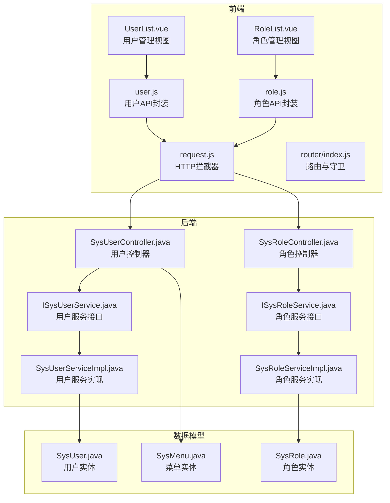
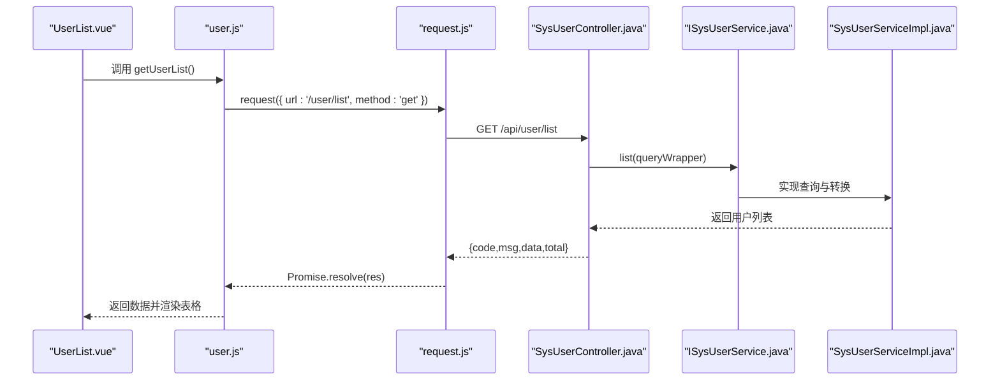
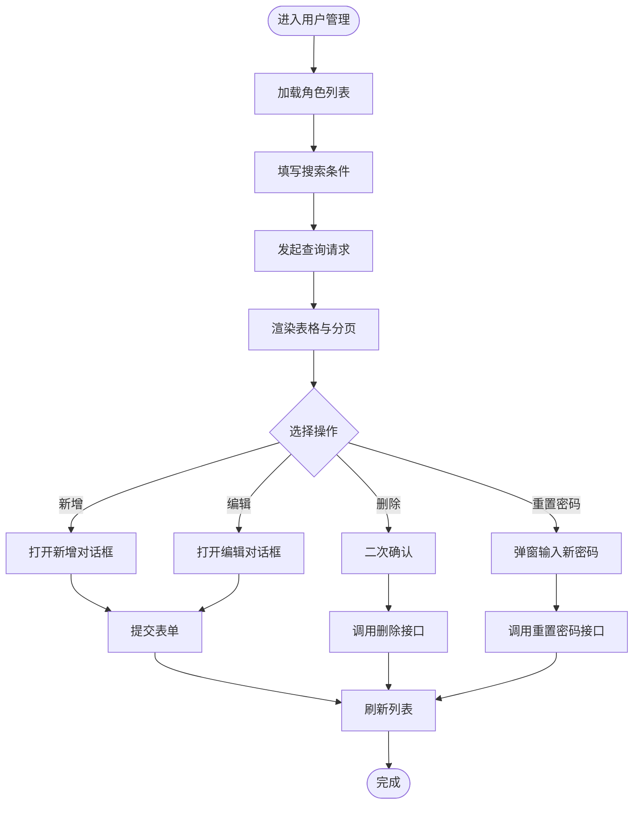
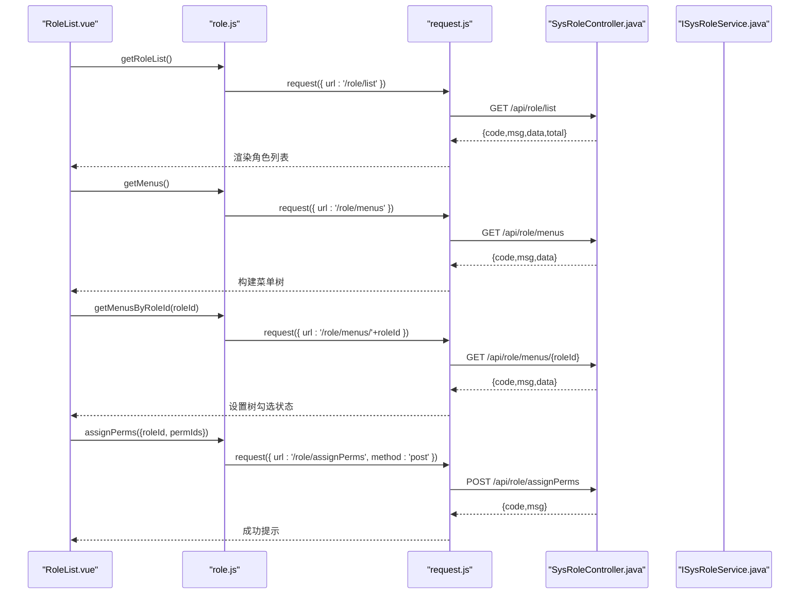
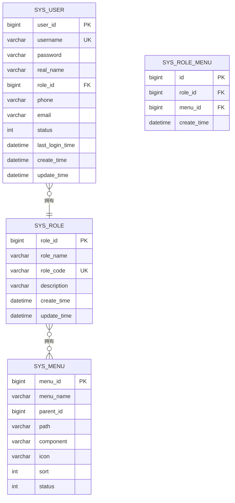
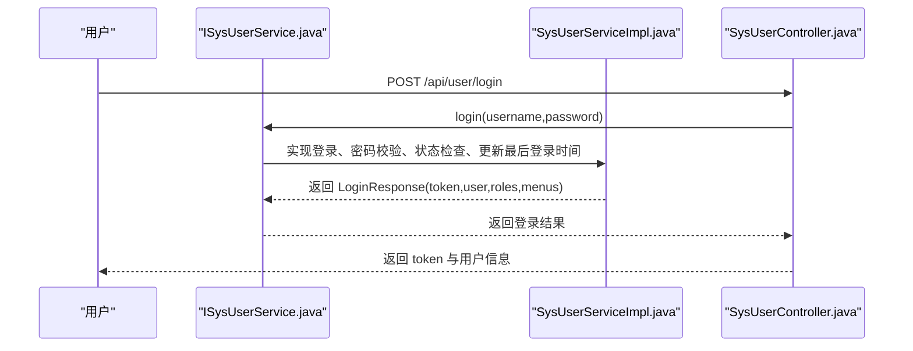
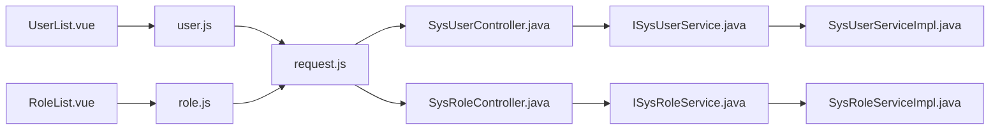

# 系统管理页面

<cite>
**本文引用的文件**
- [UserList.vue](file://drug-front/src/views/system/UserList.vue)
- [RoleList.vue](file://drug-front/src/views/system/RoleList.vue)
- [user.js](file://drug-front/src/api/user.js)
- [role.js](file://drug-front/src/api/role.js)
- [request.js](file://drug-front/src/utils/request.js)
- [SysUserController.java](file://src/main/java/com/hospital/drugmanagement/controller/SysUserController.java)
- [SysRoleController.java](file://src/main/java/com/hospital/drugmanagement/controller/SysRoleController.java)
- [SysUser.java](file://src/main/java/com/hospital/drugmanagement/entity/SysUser.java)
- [SysRole.java](file://src/main/java/com/hospital/drugmanagement/entity/SysRole.java)
- [SysMenu.java](file://src/main/java/com/hospital/drugmanagement/entity/SysMenu.java)
- [ISysUserService.java](file://src/main/java/com/hospital/drugmanagement/service/ISysUserService.java)
- [ISysRoleService.java](file://src/main/java/com/hospital/drugmanagement/service/ISysRoleService.java)
- [SysUserServiceImpl.java](file://src/main/java/com/hospital/drugmanagement/service/impl/SysUserServiceImpl.java)
- [SysRoleServiceImpl.java](file://src/main/java/com/hospital/drugmanagement/service/impl/SysRoleServiceImpl.java)
- [init.sql](file://src/main/resources/db/init.sql)
- [index.js](file://drug-front/src/router/index.js)
</cite>

## 目录
1. [简介](#简介)
2. [项目结构](#项目结构)
3. [核心组件](#核心组件)
4. [架构总览](#架构总览)
5. [详细组件分析](#详细组件分析)
6. [依赖分析](#依赖分析)
7. [性能考虑](#性能考虑)
8. [故障排查指南](#故障排查指南)
9. [结论](#结论)
10. [附录](#附录)

## 简介
本文件面向系统管理页面，围绕 UserList.vue 与 RoleList.vue 两个核心组件，系统性阐述用户管理与角色管理的完整实现，包括：
- 用户管理：用户列表展示、用户信息编辑、角色分配、状态管理、密码重置
- 角色管理：角色列表展示、权限分配、角色权限设置
- 用户与角色关联：多对多关系处理、权限继承、动态权限控制
- 系统用户 CRUD 与批量操作：表单设计、权限验证、批量操作
- 权限控制机制：基于角色的访问控制、菜单权限、按钮权限
- 开发示例、权限设计与安全管理最佳实践

## 项目结构
前端采用 Vue 3 + Element Plus + Axios 的组合；后端采用 Spring Boot + MyBatis-Plus；数据库初始化脚本包含用户、角色、菜单及角色-菜单关联表。

**图表来源**
- [UserList.vue:1-358](file://drug-front/src/views/system/UserList.vue#L1-L358)
- [RoleList.vue:1-385](file://drug-front/src/views/system/RoleList.vue#L1-L385)
- [user.js:1-71](file://drug-front/src/api/user.js#L1-L71)
- [role.js:1-70](file://drug-front/src/api/role.js#L1-L70)
- [request.js:1-56](file://drug-front/src/utils/request.js#L1-L56)
- [SysUserController.java:1-421](file://src/main/java/com/hospital/drugmanagement/controller/SysUserController.java#L1-L421)
- [SysRoleController.java:1-274](file://src/main/java/com/hospital/drugmanagement/controller/SysRoleController.java#L1-L274)
- [ISysUserService.java:1-26](file://src/main/java/com/hospital/drugmanagement/service/ISysUserService.java#L1-L26)
- [ISysRoleService.java:1-11](file://src/main/java/com/hospital/drugmanagement/service/ISysRoleService.java#L1-L11)
- [SysUserServiceImpl.java:1-127](file://src/main/java/com/hospital/drugmanagement/service/impl/SysUserServiceImpl.java#L1-L127)
- [SysRoleServiceImpl.java:1-15](file://src/main/java/com/hospital/drugmanagement/service/impl/SysRoleServiceImpl.java#L1-L15)
- [SysUser.java:1-130](file://src/main/java/com/hospital/drugmanagement/entity/SysUser.java#L1-L130)
- [SysRole.java:1-80](file://src/main/java/com/hospital/drugmanagement/entity/SysRole.java#L1-L80)
- [SysMenu.java:1-95](file://src/main/java/com/hospital/drugmanagement/entity/SysMenu.java#L1-L95)

**章节来源**
- [UserList.vue:1-358](file://drug-front/src/views/system/UserList.vue#L1-L358)
- [RoleList.vue:1-385](file://drug-front/src/views/system/RoleList.vue#L1-L385)
- [user.js:1-71](file://drug-front/src/api/user.js#L1-L71)
- [role.js:1-70](file://drug-front/src/api/role.js#L1-L70)
- [request.js:1-56](file://drug-front/src/utils/request.js#L1-L56)
- [SysUserController.java:1-421](file://src/main/java/com/hospital/drugmanagement/controller/SysUserController.java#L1-L421)
- [SysRoleController.java:1-274](file://src/main/java/com/hospital/drugmanagement/controller/SysRoleController.java#L1-L274)
- [init.sql:1-312](file://src/main/resources/db/init.sql#L1-L312)
- [index.js:1-115](file://drug-front/src/router/index.js#L1-L115)

## 核心组件
- UserList.vue：负责用户列表查询、搜索、分页、新增/编辑对话框、删除确认、密码重置、状态显示等。
- RoleList.vue：负责角色列表查询、搜索、分页、新增/编辑对话框、权限分配树形选择、角色菜单权限设置等。

关键特性：
- 表单验证与错误提示
- 对话框驱动的 CRUD 流程
- Element Plus 组件化 UI
- 前后端 API 交互封装

**章节来源**
- [UserList.vue:139-347](file://drug-front/src/views/system/UserList.vue#L139-L347)
- [RoleList.vue:121-374](file://drug-front/src/views/system/RoleList.vue#L121-L374)

## 架构总览
前后端分离架构，前端通过 Axios 发起请求，统一经 HTTP 拦截器注入 Authorization 头；后端以 RESTful 控制器暴露接口，服务层进行业务处理与数据转换。

**图表来源**
- [user.js:3-10](file://drug-front/src/api/user.js#L3-L10)
- [request.js:11-53](file://drug-front/src/utils/request.js#L11-L53)
- [SysUserController.java:152-224](file://src/main/java/com/hospital/drugmanagement/controller/SysUserController.java#L152-L224)
- [ISysUserService.java:1-26](file://src/main/java/com/hospital/drugmanagement/service/ISysUserService.java#L1-L26)
- [SysUserServiceImpl.java:28-127](file://src/main/java/com/hospital/drugmanagement/service/impl/SysUserServiceImpl.java#L28-L127)

## 详细组件分析

### 用户管理组件：UserList.vue
- 搜索与筛选：支持按用户名、真实姓名、角色筛选，重置按钮清空条件并重新查询
- 列表展示：用户名、真实姓名、角色、手机号、邮箱、状态、最后登录时间、操作列
- 分页：支持页大小切换与页码变更
- 对话框表单：新增/编辑用户，包含用户名、真实姓名、密码（新增必填）、角色、手机号、邮箱、状态
- 功能流程：
  - 新增：提交表单，调用保存接口
  - 编辑：复制行数据到表单，提交更新接口
  - 删除：二次确认后调用删除接口
  - 重置密码：弹窗输入新密码，调用重置接口
  - 角色下拉：首次进入页面加载角色列表

**图表来源**
- [UserList.vue:171-347](file://drug-front/src/views/system/UserList.vue#L171-L347)

**章节来源**
- [UserList.vue:1-358](file://drug-front/src/views/system/UserList.vue#L1-L358)
- [user.js:3-53](file://drug-front/src/api/user.js#L3-L53)
- [SysUserController.java:152-419](file://src/main/java/com/hospital/drugmanagement/controller/SysUserController.java#L152-L419)

### 角色管理组件：RoleList.vue
- 搜索与筛选：按角色名称筛选
- 列表展示：角色名称、角色编码、描述、创建时间、操作列
- 权限分配：打开权限分配对话框，使用树形控件展示菜单，支持勾选并提交分配
- 菜单树构建：将扁平菜单数据转换为树形结构，确保“采购管理审核”菜单存在
- 功能流程：
  - 新增/编辑：提交角色表单
  - 删除：二次确认后调用删除接口
  - 权限分配：加载角色已有菜单权限，勾选后提交分配

**图表来源**
- [RoleList.vue:160-374](file://drug-front/src/views/system/RoleList.vue#L160-L374)
- [role.js:46-69](file://drug-front/src/api/role.js#L46-L69)
- [SysRoleController.java:37-272](file://src/main/java/com/hospital/drugmanagement/controller/SysRoleController.java#L37-L272)

**章节来源**
- [RoleList.vue:1-385](file://drug-front/src/views/system/RoleList.vue#L1-L385)
- [role.js:1-70](file://drug-front/src/api/role.js#L1-L70)
- [SysRoleController.java:1-274](file://src/main/java/com/hospital/drugmanagement/controller/SysRoleController.java#L1-L274)

### 数据模型与关系
- 用户实体：包含用户基本信息、角色关联、状态、时间戳等
- 角色实体：角色名称、角色编码、描述、时间戳等
- 菜单实体：菜单名称、路径、组件、父子关系、排序、状态等
- 角色-菜单关联：多对多关系，通过中间表维护

**图表来源**
- [SysUser.java:1-130](file://src/main/java/com/hospital/drugmanagement/entity/SysUser.java#L1-L130)
- [SysRole.java:1-80](file://src/main/java/com/hospital/drugmanagement/entity/SysRole.java#L1-L80)
- [SysMenu.java:1-95](file://src/main/java/com/hospital/drugmanagement/entity/SysMenu.java#L1-L95)
- [init.sql:50-58](file://src/main/resources/db/init.sql#L50-L58)

**章节来源**
- [SysUser.java:1-130](file://src/main/java/com/hospital/drugmanagement/entity/SysUser.java#L1-L130)
- [SysRole.java:1-80](file://src/main/java/com/hospital/drugmanagement/entity/SysRole.java#L1-L80)
- [SysMenu.java:1-95](file://src/main/java/com/hospital/drugmanagement/entity/SysMenu.java#L1-L95)
- [init.sql:240-286](file://src/main/resources/db/init.sql#L240-L286)

### 权限控制机制
- 基于角色的访问控制（RBAC）：用户登录后根据角色获取菜单列表，前端据此渲染导航与按钮权限
- 菜单权限：后端根据角色 ID 查询菜单集合返回给前端
- 按钮权限：可结合菜单标识在前端进行按钮级权限控制（建议在路由元信息中扩展权限标识）

**图表来源**
- [SysUserController.java:43-147](file://src/main/java/com/hospital/drugmanagement/controller/SysUserController.java#L43-L147)
- [SysUserServiceImpl.java:42-102](file://src/main/java/com/hospital/drugmanagement/service/impl/SysUserServiceImpl.java#L42-L102)

**章节来源**
- [SysUserController.java:43-147](file://src/main/java/com/hospital/drugmanagement/controller/SysUserController.java#L43-L147)
- [SysUserServiceImpl.java:42-102](file://src/main/java/com/hospital/drugmanagement/service/impl/SysUserServiceImpl.java#L42-L102)

## 依赖分析
- 前端依赖
  - Element Plus：提供表格、分页、对话框、表单、消息提示等组件
  - Axios：统一请求封装与拦截器，自动注入 Authorization 头
  - Vue Router：路由定义与守卫，控制页面访问
- 后端依赖
  - Spring Boot + MyBatis-Plus：提供通用 CRUD 与查询包装
  - 控制器层：暴露 RESTful 接口
  - 服务层：封装业务逻辑与数据转换
  - 实体与 Mapper：对应数据库表结构

**图表来源**
- [UserList.vue:139-143](file://drug-front/src/views/system/UserList.vue#L139-L143)
- [RoleList.vue:122-124](file://drug-front/src/views/system/RoleList.vue#L122-L124)
- [user.js:1-71](file://drug-front/src/api/user.js#L1-L71)
- [role.js:1-70](file://drug-front/src/api/role.js#L1-L70)
- [request.js:1-56](file://drug-front/src/utils/request.js#L1-L56)
- [SysUserController.java:1-421](file://src/main/java/com/hospital/drugmanagement/controller/SysUserController.java#L1-L421)
- [SysRoleController.java:1-274](file://src/main/java/com/hospital/drugmanagement/controller/SysRoleController.java#L1-L274)
- [ISysUserService.java:1-26](file://src/main/java/com/hospital/drugmanagement/service/ISysUserService.java#L1-L26)
- [ISysRoleService.java:1-11](file://src/main/java/com/hospital/drugmanagement/service/ISysRoleService.java#L1-L11)
- [SysUserServiceImpl.java:1-127](file://src/main/java/com/hospital/drugmanagement/service/impl/SysUserServiceImpl.java#L1-L127)
- [SysRoleServiceImpl.java:1-15](file://src/main/java/com/hospital/drugmanagement/service/impl/SysRoleServiceImpl.java#L1-L15)

**章节来源**
- [index.js:1-115](file://drug-front/src/router/index.js#L1-L115)
- [request.js:1-56](file://drug-front/src/utils/request.js#L1-L56)

## 性能考虑
- 前端
  - 使用 v-loading 在请求期间显示加载状态，提升用户体验
  - 表单校验在提交前执行，减少无效请求
  - 分页查询避免一次性加载大量数据
- 后端
  - 查询时使用条件构造器进行精确过滤，避免全表扫描
  - 返回数据时进行必要的字段裁剪与格式化，减少传输体积

[本节为通用指导，无需特定文件引用]

## 故障排查指南
- 登录失败或未授权
  - 检查请求头 Authorization 是否正确注入
  - 检查后端登录接口返回的错误码与消息
- 请求失败或网络错误
  - 查看响应拦截器中的错误提示与路由跳转逻辑
- 删除失败
  - 确认删除接口返回状态码与消息
- 权限分配失败
  - 检查角色 ID 与菜单 ID 的传递与类型转换

**章节来源**
- [request.js:27-53](file://drug-front/src/utils/request.js#L27-L53)
- [SysUserController.java:374-389](file://src/main/java/com/hospital/drugmanagement/controller/SysUserController.java#L374-L389)
- [SysRoleController.java:230-272](file://src/main/java/com/hospital/drugmanagement/controller/SysRoleController.java#L230-L272)

## 结论
UserList.vue 与 RoleList.vue 构成了系统管理页面的核心，配合后端 RBAC 体系与菜单权限控制，实现了完善的用户与角色管理能力。通过统一的 API 封装与拦截器机制，前端能够稳定地进行数据交互与权限控制。建议在后续迭代中进一步完善按钮级权限控制与审计日志功能，持续提升系统的安全性与可维护性。

[本节为总结性内容，无需特定文件引用]

## 附录

### 开发示例与最佳实践
- 表单设计
  - 使用 Element Plus 表单组件与校验规则，确保输入合法性
  - 对敏感字段（如密码）在新增场景下必填，并在提交时进行加密处理
- 权限验证
  - 登录成功后，后端返回菜单列表，前端据此渲染界面与按钮
  - 可在路由元信息中扩展权限标识，实现按钮级权限控制
- 批量操作
  - 前端可扩展勾选多行进行批量删除或状态变更，后端需提供相应的批量接口
- 安全管理
  - 密码采用加盐哈希存储，避免明文或弱加密
  - Token 管理与过期策略需在生产环境中替换为标准 JWT 方案

**章节来源**
- [SysUserServiceImpl.java:36-102](file://src/main/java/com/hospital/drugmanagement/service/impl/SysUserServiceImpl.java#L36-L102)
- [SysUserController.java:292-419](file://src/main/java/com/hospital/drugmanagement/controller/SysUserController.java#L292-L419)
- [init.sql:240-286](file://src/main/resources/db/init.sql#L240-L286)