# 药品管理页面

<cite>
**本文档引用的文件**
- [DrugList.vue](file://drug-front/src/views/drug/DrugList.vue)
- [drug.js](file://drug-front/src/api/drug.js)
- [DrugInfoController.java](file://src/main/java/com/hospital/drugmanagement/controller/DrugInfoController.java)
- [DrugInfo.java](file://src/main/java/com/hospital/drugmanagement/entity/DrugInfo.java)
- [request.js](file://drug-front/src/utils/request.js)
- [supplier.js](file://drug-front/src/api/supplier.js)
- [DrugInfoServiceImpl.java](file://src/main/java/com/hospital/drugmanagement/service/impl/DrugInfoServiceImpl.java)
- [hospital_drug.sql](file://hospital_drug.sql)
- [package.json](file://drug-front/package.json)
</cite>

## 目录
1. [简介](#简介)
2. [项目结构](#项目结构)
3. [核心组件](#核心组件)
4. [架构概览](#架构概览)
5. [详细组件分析](#详细组件分析)
6. [依赖分析](#依赖分析)
7. [性能考虑](#性能考虑)
8. [故障排除指南](#故障排除指南)
9. [结论](#结论)

## 简介

药品管理页面是医院药品管理系统的核心功能模块，基于Vue 3 + Element Plus技术栈构建。该页面实现了完整的药品信息管理功能，包括药品列表展示、搜索过滤、新增编辑、删除操作以及分页加载等核心功能。系统采用前后端分离架构，前端使用Vue 3 Composition API进行组件开发，后端基于Spring Boot + MyBatis-Plus提供RESTful API服务。

## 项目结构

该项目采用前后端分离的Maven多模块结构，主要包含以下关键目录：

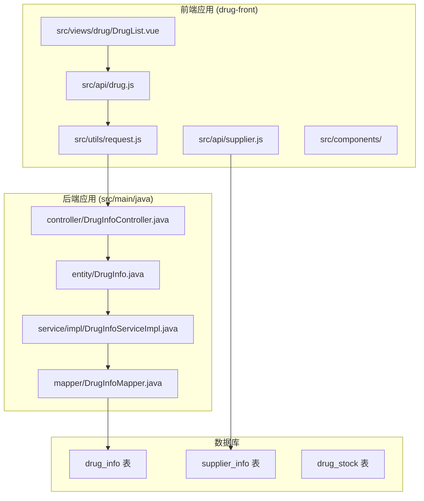

**图表来源**
- [DrugList.vue:1-426](file://drug-front/src/views/drug/DrugList.vue#L1-L426)
- [drug.js:1-45](file://drug-front/src/api/drug.js#L1-L45)
- [DrugInfoController.java:1-169](file://src/main/java/com/hospital/drugmanagement/controller/DrugInfoController.java#L1-L169)

**章节来源**
- [package.json:1-29](file://drug-front/package.json#L1-L29)
- [hospital_drug.sql:62-85](file://hospital_drug.sql#L62-L85)

## 核心组件

### 药品管理组件架构

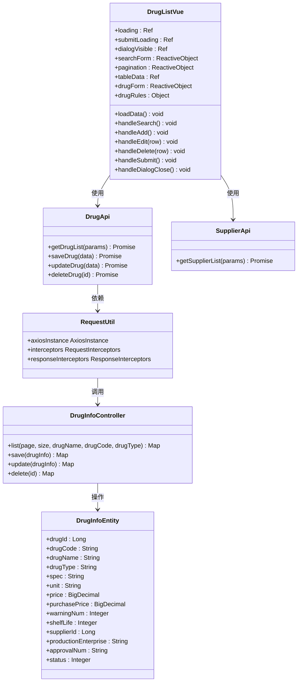

**图表来源**
- [DrugList.vue:208-415](file://drug-front/src/views/drug/DrugList.vue#L208-L415)
- [drug.js:1-45](file://drug-front/src/api/drug.js#L1-L45)
- [DrugInfoController.java:14-169](file://src/main/java/com/hospital/drugmanagement/controller/DrugInfoController.java#L14-L169)
- [DrugInfo.java:9-167](file://src/main/java/com/hospital/drugmanagement/entity/DrugInfo.java#L9-L167)

### 数据流处理

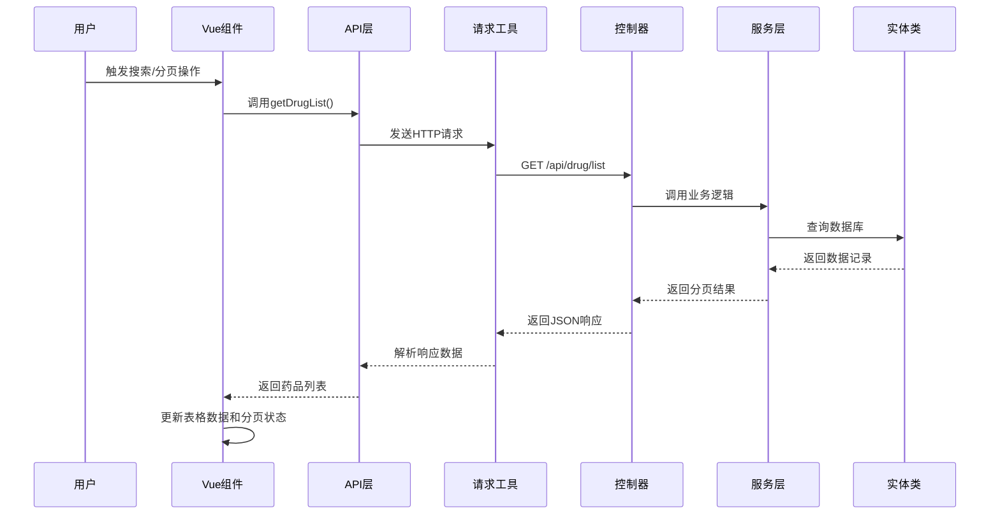

**图表来源**
- [DrugList.vue:281-297](file://drug-front/src/views/drug/DrugList.vue#L281-L297)
- [drug.js:3-10](file://drug-front/src/api/drug.js#L3-L10)
- [request.js:5-56](file://drug-front/src/utils/request.js#L5-L56)
- [DrugInfoController.java:22-58](file://src/main/java/com/hospital/drugmanagement/controller/DrugInfoController.java#L22-L58)

**章节来源**
- [DrugList.vue:208-415](file://drug-front/src/views/drug/DrugList.vue#L208-L415)
- [drug.js:1-45](file://drug-front/src/api/drug.js#L1-L45)

## 架构概览

### 技术栈架构

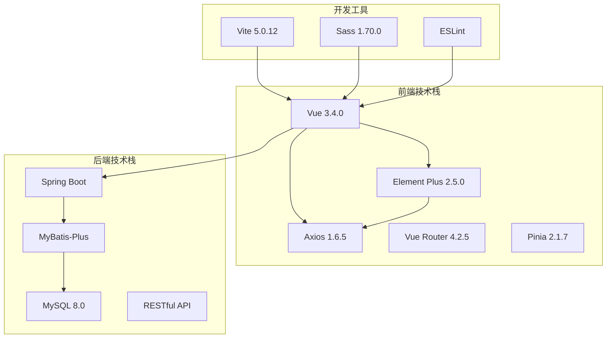

**图表来源**
- [package.json:13-27](file://drug-front/package.json#L13-L27)

### 数据模型关系

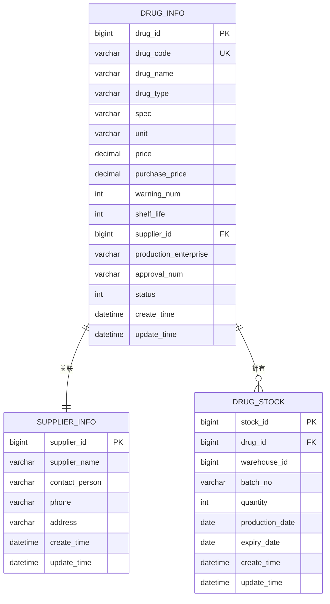

**图表来源**
- [hospital_drug.sql:62-85](file://hospital_drug.sql#L62-L85)
- [hospital_drug.sql:111-127](file://hospital_drug.sql#L111-L127)

**章节来源**
- [hospital_drug.sql:62-127](file://hospital_drug.sql#L62-L127)

## 详细组件分析

### 药品列表组件实现

#### 模板结构分析

DrugList.vue组件采用了清晰的三层结构设计：

1. **搜索区域**：包含药品名称、编码、类型的输入框和搜索/重置按钮
2. **操作区域**：提供新增药品的主按钮
3. **数据展示区域**：使用Element Plus的表格组件展示药品信息

#### 数据表格设计

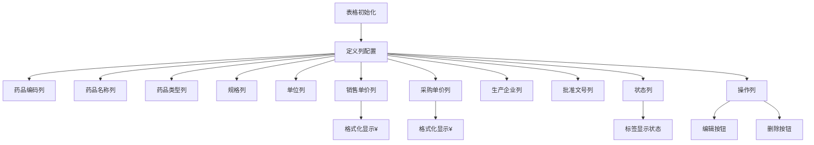

**图表来源**
- [DrugList.vue:41-78](file://drug-front/src/views/drug/DrugList.vue#L41-L78)

#### 列定义详解

| 列名 | 字段 | 类型 | 配置说明 |
|------|------|------|----------|
| 药品编码 | drugCode | 文本 | 固定宽度120px |
| 药品名称 | drugName | 文本 | 固定宽度200px |
| 药品类型 | drugType | 文本 | 固定宽度100px |
| 规格 | spec | 文本 | 固定宽度150px |
| 单位 | unit | 文本 | 固定宽度80px |
| 销售单价 | price | 数字 | 自定义模板显示¥符号 |
| 采购单价 | purchasePrice | 数字 | 自定义模板显示¥符号 |
| 生产企业 | productionEnterprise | 文本 | 支持溢出提示 |
| 批准文号 | approvalNum | 文本 | 固定宽度150px |
| 状态 | status | 标签 | 成功/危险样式区分上下架 |

**章节来源**
- [DrugList.vue:48-71](file://drug-front/src/views/drug/DrugList.vue#L48-L71)

### 搜索和过滤功能

#### 搜索表单设计

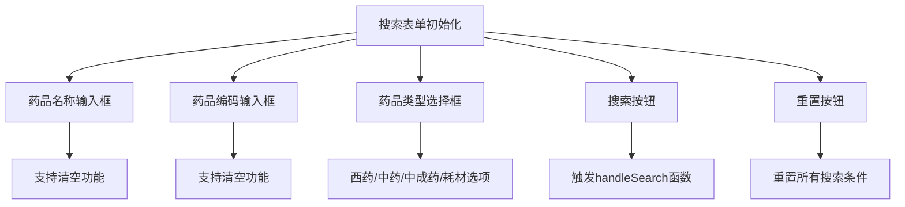

**图表来源**
- [DrugList.vue:5-30](file://drug-front/src/views/drug/DrugList.vue#L5-L30)

#### 过滤逻辑实现

后端控制器实现了灵活的条件查询机制：

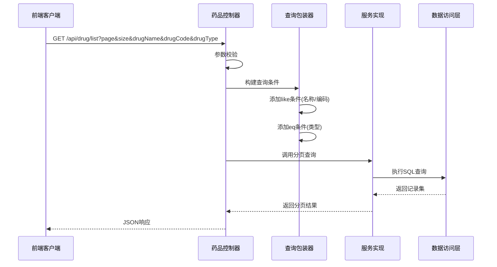

**图表来源**
- [DrugInfoController.java:22-58](file://src/main/java/com/hospital/drugmanagement/controller/DrugInfoController.java#L22-L58)

**章节来源**
- [DrugList.vue:299-311](file://drug-front/src/views/drug/DrugList.vue#L299-L311)
- [DrugInfoController.java:22-58](file://src/main/java/com/hospital/drugmanagement/controller/DrugInfoController.java#L22-L58)

### 药品信息管理

#### 新增和编辑功能

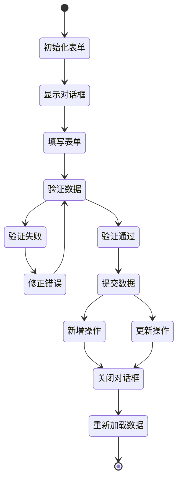

**图表来源**
- [DrugList.vue:313-376](file://drug-front/src/views/drug/DrugList.vue#L313-L376)

#### 弹窗表单设计

表单包含了完整的药品信息字段：

| 字段组 | 字段 | 类型 | 验证规则 |
|--------|------|------|----------|
| 基本信息 | 药品编码 | 输入框 | 必填 |
| 基本信息 | 药品名称 | 输入框 | 必填 |
| 基本信息 | 药品类型 | 选择框 | 必填 |
| 基本信息 | 规格 | 输入框 | 必填 |
| 基本信息 | 单位 | 选择框 | 必填 |
| 价格信息 | 销售单价 | 数字输入 | 必填 |
| 价格信息 | 采购单价 | 数字输入 | 必填 |
| 库存信息 | 库存预警值 | 数字输入 | 必填 |
| 有效期信息 | 保质期 | 数字输入 | 必填 |
| 状态信息 | 状态 | 单选按钮 | 必填 |
| 供应商信息 | 生产企业 | 下拉选择 | 必填 |
| 批准文号 | 批准文号 | 输入框 | 必填 |

**章节来源**
- [DrugList.vue:100-204](file://drug-front/src/views/drug/DrugList.vue#L100-L204)
- [DrugList.vue:259-269](file://drug-front/src/views/drug/DrugList.vue#L259-L269)

### 删除操作实现

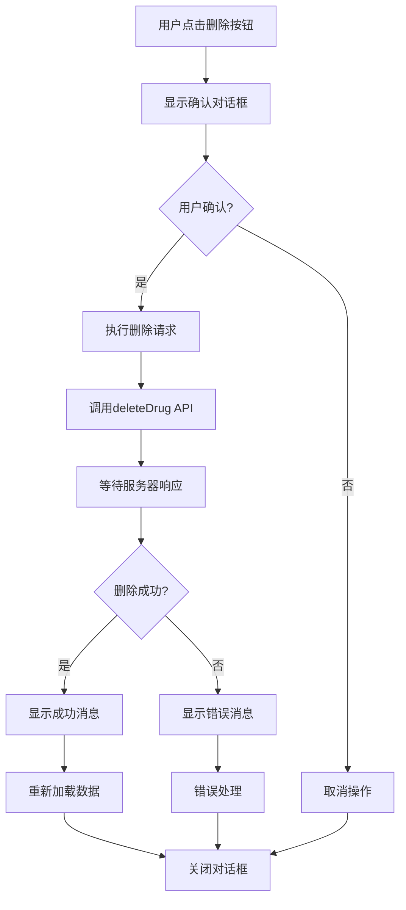

**图表来源**
- [DrugList.vue:334-350](file://drug-front/src/views/drug/DrugList.vue#L334-L350)

**章节来源**
- [DrugList.vue:334-350](file://drug-front/src/views/drug/DrugList.vue#L334-L350)

### 分页加载机制

#### 分页参数配置

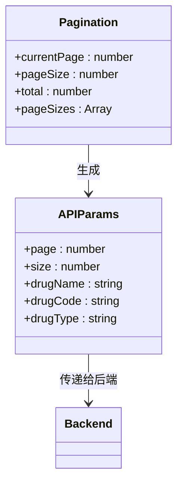

**图表来源**
- [DrugList.vue:227-232](file://drug-front/src/views/drug/DrugList.vue#L227-L232)
- [DrugList.vue:285-289](file://drug-front/src/views/drug/DrugList.vue#L285-L289)

**章节来源**
- [DrugList.vue:80-90](file://drug-front/src/views/drug/DrugList.vue#L80-L90)
- [DrugList.vue:399-407](file://drug-front/src/views/drug/DrugList.vue#L399-L407)

## 依赖分析

### 前端依赖关系

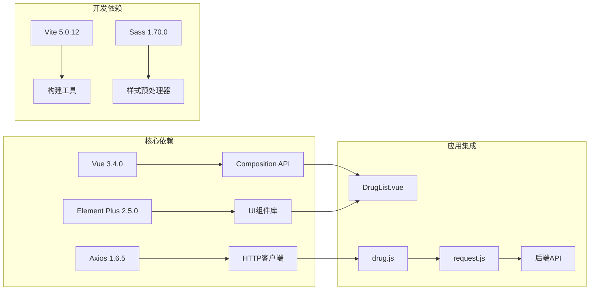

**图表来源**
- [package.json:13-27](file://drug-front/package.json#L13-L27)

### 后端依赖关系

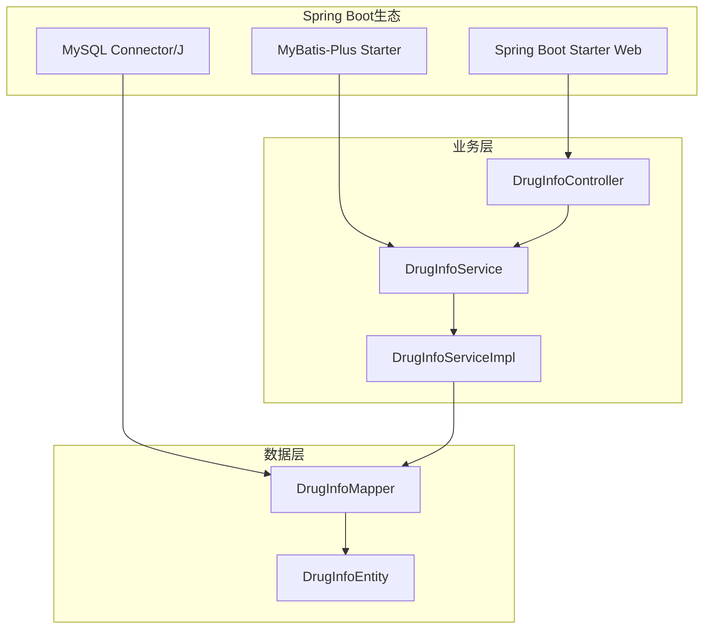

**图表来源**
- [DrugInfoController.java:14-21](file://src/main/java/com/hospital/drugmanagement/controller/DrugInfoController.java#L14-L21)
- [DrugInfoServiceImpl.java:9-18](file://src/main/java/com/hospital/drugmanagement/service/impl/DrugInfoServiceImpl.java#L9-L18)

**章节来源**
- [package.json:13-27](file://drug-front/package.json#L13-L27)
- [DrugInfoController.java:14-21](file://src/main/java/com/hospital/drugmanagement/controller/DrugInfoController.java#L14-L21)

## 性能考虑

### 前端性能优化

1. **懒加载策略**：组件在挂载时才加载数据，避免不必要的初始化开销
2. **防抖处理**：搜索功能支持防抖，减少频繁的API调用
3. **虚拟滚动**：对于大量数据场景，可考虑引入虚拟滚动组件
4. **缓存机制**：合理利用浏览器缓存和组件缓存

### 后端性能优化

1. **索引优化**：数据库表已建立合适的索引，特别是药品编码和供应商ID字段
2. **分页查询**：使用MyBatis-Plus的分页插件，避免全表扫描
3. **查询优化**：动态构建查询条件，只包含必要的过滤条件

### 数据库性能

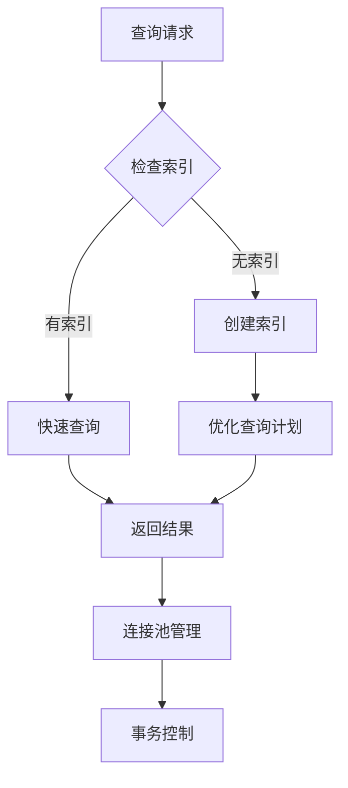

**图表来源**
- [hospital_drug.sql:82-84](file://hospital_drug.sql#L82-L84)

**章节来源**
- [hospital_drug.sql:62-85](file://hospital_drug.sql#L62-L85)

## 故障排除指南

### 常见问题及解决方案

#### API调用失败

**问题描述**：前端无法连接到后端API服务

**可能原因**：
1. 后端服务未启动或端口冲突
2. CORS跨域配置问题
3. 请求URL配置错误

**解决方案**：
1. 检查后端服务日志
2. 验证CORS配置
3. 确认API基础URL配置

#### 数据加载异常

**问题描述**：药品列表无法正常显示

**可能原因**：
1. 数据库连接失败
2. SQL查询语法错误
3. 数据类型不匹配

**解决方案**：
1. 检查数据库连接配置
2. 验证实体类映射关系
3. 查看MyBatis日志输出

#### 表单验证错误

**问题描述**：新增或编辑药品时表单验证失败

**可能原因**：
1. 必填字段为空
2. 数据格式不符合要求
3. 业务规则冲突

**解决方案**：
1. 检查字段验证规则
2. 验证数据格式
3. 处理业务逻辑冲突

**章节来源**
- [request.js:27-53](file://drug-front/src/utils/request.js#L27-L53)
- [DrugInfoController.java:51-56](file://src/main/java/com/hospital/drugmanagement/controller/DrugInfoController.java#L51-L56)

### 开发调试技巧

1. **浏览器开发者工具**：监控网络请求和响应
2. **Vue DevTools**：检查组件状态和props传递
3. **后端日志**：查看SQL执行计划和错误信息
4. **数据库监控**：分析查询性能和连接数

## 结论

药品管理页面是一个功能完整、架构清晰的医疗信息系统模块。通过Vue 3 + Element Plus的技术组合，实现了良好的用户体验和开发效率。系统具备以下优势：

1. **完整的CRUD功能**：支持药品信息的增删改查操作
2. **灵活的搜索过滤**：多条件组合查询，提升数据检索效率
3. **友好的用户界面**：基于Element Plus的现代化UI设计
4. **可靠的后端支撑**：Spring Boot + MyBatis-Plus提供稳定的服务层
5. **完善的错误处理**：前后端协同的异常处理机制

该系统为医院药品管理提供了坚实的技术基础，可根据实际需求进一步扩展功能，如批量操作、导出报表、权限控制等高级特性。