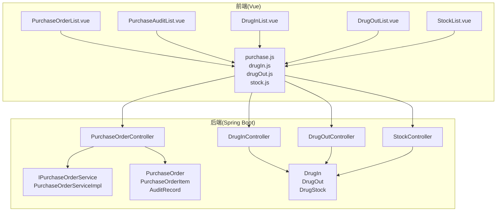
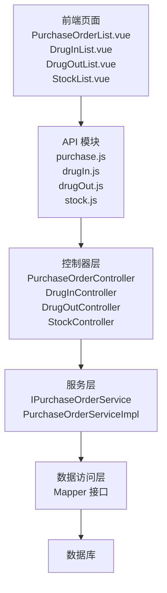
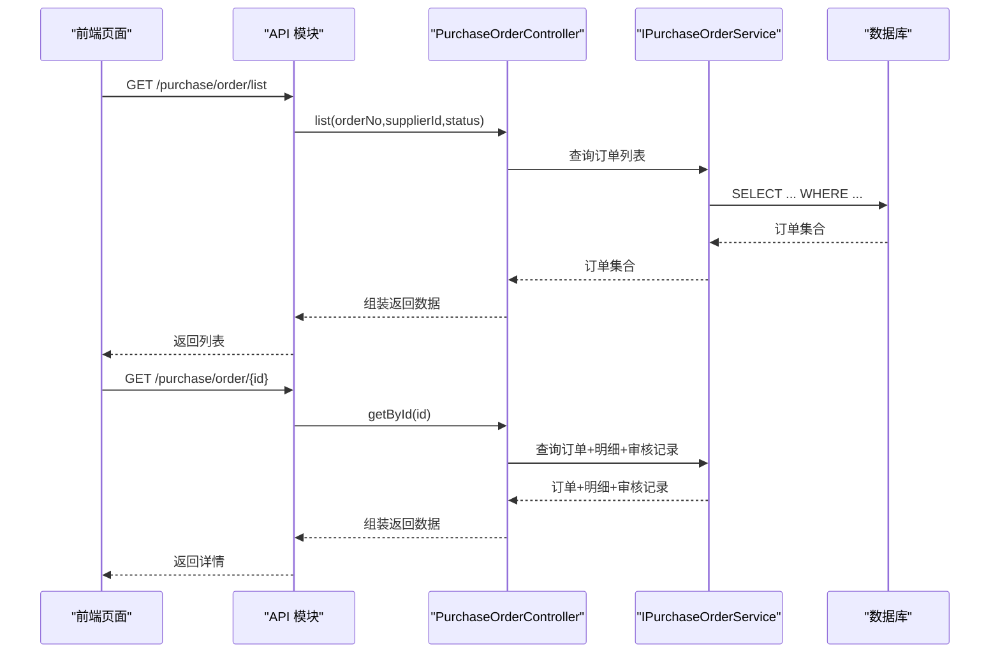
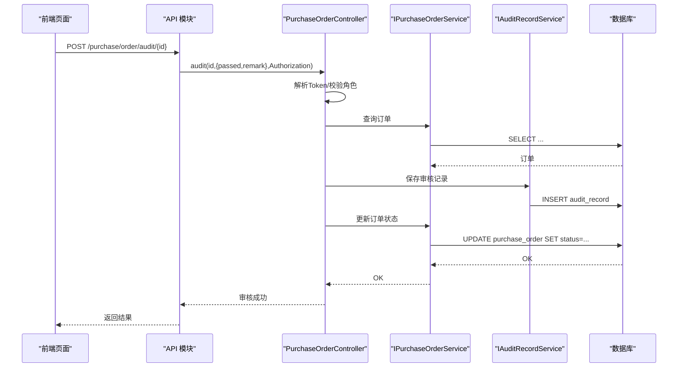
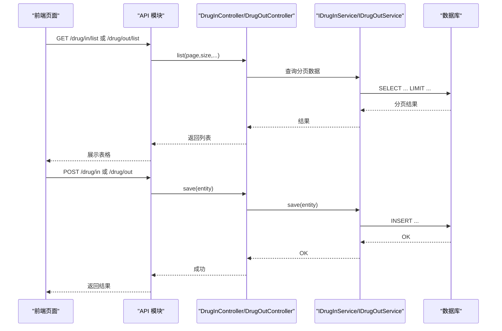
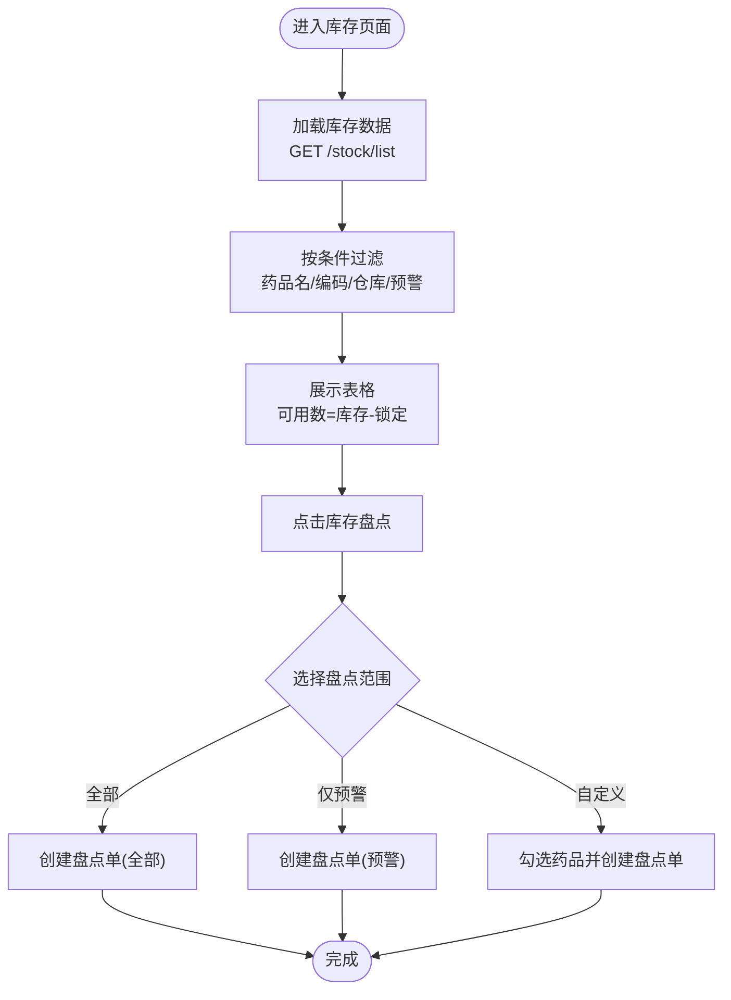
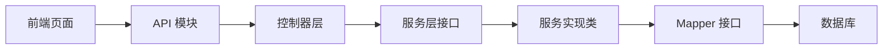

# 采购与库存页面

<cite>
**本文档引用的文件**
- [PurchaseOrder.java](file://src/main/java/com/hospital/drugmanagement/entity/PurchaseOrder.java)
- [PurchaseOrderItem.java](file://src/main/java/com/hospital/drugmanagement/entity/PurchaseOrderItem.java)
- [AuditRecord.java](file://src/main/java/com/hospital/drugmanagement/entity/AuditRecord.java)
- [DrugIn.java](file://src/main/java/com/hospital/drugmanagement/entity/DrugIn.java)
- [DrugOut.java](file://src/main/java/com/hospital/drugmanagement/entity/DrugOut.java)
- [DrugStock.java](file://src/main/java/com/hospital/drugmanagement/entity/DrugStock.java)
- [PurchaseOrderController.java](file://src/main/java/com/hospital/drugmanagement/controller/PurchaseOrderController.java)
- [DrugInController.java](file://src/main/java/com/hospital/drugmanagement/controller/DrugInController.java)
- [DrugOutController.java](file://src/main/java/com/hospital/drugmanagement/controller/DrugOutController.java)
- [StockController.java](file://src/main/java/com/hospital/drugmanagement/controller/StockController.java)
- [IPurchaseOrderService.java](file://src/main/java/com/hospital/drugmanagement/service/IPurchaseOrderService.java)
- [PurchaseOrderServiceImpl.java](file://src/main/java/com/hospital/drugmanagement/service/impl/PurchaseOrderServiceImpl.java)
- [PurchaseOrderList.vue](file://drug-front/src/views/purchase/PurchaseOrderList.vue)
- [PurchaseAuditList.vue](file://drug-front/src/views/purchase/PurchaseAuditList.vue)
- [DrugInList.vue](file://drug-front/src/views/inout/DrugInList.vue)
- [DrugOutList.vue](file://drug-front/src/views/inout/DrugOutList.vue)
- [StockList.vue](file://drug-front/src/views/stock/StockList.vue)
- [purchase.js](file://drug-front/src/api/purchase.js)
</cite>

## 目录
1. [简介](#简介)
2. [项目结构](#项目结构)
3. [核心组件](#核心组件)
4. [架构概览](#架构概览)
5. [详细组件分析](#详细组件分析)
6. [依赖分析](#依赖分析)
7. [性能考虑](#性能考虑)
8. [故障排查指南](#故障排查指南)
9. [结论](#结论)
10. [附录](#附录)

## 简介
本文件面向药品管理系统的“采购与库存”模块，系统性梳理前端页面与后端接口的实现，覆盖以下主题：
- 采购订单管理：订单列表展示、订单状态跟踪、订单详情查看、状态流转
- 采购审核流程：审核列表、审核操作、审批意见、状态更新
- 出入库管理：入库操作、出库操作、库存调整、批次管理
- 库存管理功能：实时库存查询、库存预警、库存盘点、库存统计
- 业务流程控制：状态机设计、流程验证、异常处理
- 开发示例、业务逻辑实现、数据一致性保证

## 项目结构
系统采用前后端分离架构：
- 前端基于 Vue 3 + Element Plus，页面位于 drug-front/src/views 下
- 后端基于 Spring Boot + MyBatis-Plus，控制器位于 src/main/java/com/hospital/drugmanagement/controller 下
- 数据模型位于 src/main/java/com/hospital/drugmanagement/entity 下
- 页面通过 drug-front/src/api/* 发起 HTTP 请求与后端交互

**图表来源**
- [PurchaseOrderList.vue](file://drug-front/src/views/purchase/PurchaseOrderList.vue)
- [PurchaseAuditList.vue](file://drug-front/src/views/purchase/PurchaseAuditList.vue)
- [DrugInList.vue](file://drug-front/src/views/inout/DrugInList.vue)
- [DrugOutList.vue](file://drug-front/src/views/inout/DrugOutList.vue)
- [StockList.vue](file://drug-front/src/views/stock/StockList.vue)
- [purchase.js](file://drug-front/src/api/purchase.js)
- [PurchaseOrderController.java](file://src/main/java/com/hospital/drugmanagement/controller/PurchaseOrderController.java)
- [DrugInController.java](file://src/main/java/com/hospital/drugmanagement/controller/DrugInController.java)
- [DrugOutController.java](file://src/main/java/com/hospital/drugmanagement/controller/DrugOutController.java)
- [StockController.java](file://src/main/java/com/hospital/drugmanagement/controller/StockController.java)
- [IPurchaseOrderService.java](file://src/main/java/com/hospital/drugmanagement/service/IPurchaseOrderService.java)
- [PurchaseOrderServiceImpl.java](file://src/main/java/com/hospital/drugmanagement/service/impl/PurchaseOrderServiceImpl.java)
- [PurchaseOrder.java](file://src/main/java/com/hospital/drugmanagement/entity/PurchaseOrder.java)
- [PurchaseOrderItem.java](file://src/main/java/com/hospital/drugmanagement/entity/PurchaseOrderItem.java)
- [AuditRecord.java](file://src/main/java/com/hospital/drugmanagement/entity/AuditRecord.java)
- [DrugIn.java](file://src/main/java/com/hospital/drugmanagement/entity/DrugIn.java)
- [DrugOut.java](file://src/main/java/com/hospital/drugmanagement/entity/DrugOut.java)
- [DrugStock.java](file://src/main/java/com/hospital/drugmanagement/entity/DrugStock.java)

**章节来源**
- [PurchaseOrderList.vue](file://drug-front/src/views/purchase/PurchaseOrderList.vue)
- [PurchaseAuditList.vue](file://drug-front/src/views/purchase/PurchaseAuditList.vue)
- [DrugInList.vue](file://drug-front/src/views/inout/DrugInList.vue)
- [DrugOutList.vue](file://drug-front/src/views/inout/DrugOutList.vue)
- [StockList.vue](file://drug-front/src/views/stock/StockList.vue)
- [PurchaseOrderController.java](file://src/main/java/com/hospital/drugmanagement/controller/PurchaseOrderController.java)
- [DrugInController.java](file://src/main/java/com/hospital/drugmanagement/controller/DrugInController.java)
- [DrugOutController.java](file://src/main/java/com/hospital/drugmanagement/controller/DrugOutController.java)
- [StockController.java](file://src/main/java/com/hospital/drugmanagement/controller/StockController.java)

## 核心组件
- 采购订单实体与明细：PurchaseOrder、PurchaseOrderItem
- 审核记录：AuditRecord
- 入库单：DrugIn（含批次、有效期、单价、关联采购单）
- 出库单：DrugOut（含出库类型、关联单号）
- 实时库存：DrugStock（含批次、有效期、可用数计算）

这些实体支撑了采购、出入库、库存管理的完整业务闭环。

**章节来源**
- [PurchaseOrder.java](file://src/main/java/com/hospital/drugmanagement/entity/PurchaseOrder.java)
- [PurchaseOrderItem.java](file://src/main/java/com/hospital/drugmanagement/entity/PurchaseOrderItem.java)
- [AuditRecord.java](file://src/main/java/com/hospital/drugmanagement/entity/AuditRecord.java)
- [DrugIn.java](file://src/main/java/com/hospital/drugmanagement/entity/DrugIn.java)
- [DrugOut.java](file://src/main/java/com/hospital/drugmanagement/entity/DrugOut.java)
- [DrugStock.java](file://src/main/java/com/hospital/drugmanagement/entity/DrugStock.java)

## 架构概览
后端采用分层架构：
- 控制器层：接收前端请求，组装参数，调用服务层
- 服务层：封装业务逻辑，协调多个 Mapper/Entity
- 数据访问层：MyBatis-Plus Mapper 操作数据库
- 前端通过统一 API 模块调用后端接口

**图表来源**
- [PurchaseOrderList.vue](file://drug-front/src/views/purchase/PurchaseOrderList.vue)
- [DrugInList.vue](file://drug-front/src/views/inout/DrugInList.vue)
- [DrugOutList.vue](file://drug-front/src/views/inout/DrugOutList.vue)
- [StockList.vue](file://drug-front/src/views/stock/StockList.vue)
- [purchase.js](file://drug-front/src/api/purchase.js)
- [PurchaseOrderController.java](file://src/main/java/com/hospital/drugmanagement/controller/PurchaseOrderController.java)
- [DrugInController.java](file://src/main/java/com/hospital/drugmanagement/controller/DrugInController.java)
- [DrugOutController.java](file://src/main/java/com/hospital/drugmanagement/controller/DrugOutController.java)
- [StockController.java](file://src/main/java/com/hospital/drugmanagement/controller/StockController.java)
- [IPurchaseOrderService.java](file://src/main/java/com/hospital/drugmanagement/service/IPurchaseOrderService.java)
- [PurchaseOrderServiceImpl.java](file://src/main/java/com/hospital/drugmanagement/service/impl/PurchaseOrderServiceImpl.java)

## 详细组件分析

### 采购订单管理
- 列表展示：支持按单号、供应商、状态筛选；分页加载
- 状态跟踪：状态枚举映射（待审核、已审核、已入库、已取消、审核不通过）
- 详情查看：包含订单主表、明细、审核记录
- 状态流转：新建 → 待审核；审核通过 → 已审核；作废仅允许在特定状态

**图表来源**
- [PurchaseOrderController.java](file://src/main/java/com/hospital/drugmanagement/controller/PurchaseOrderController.java)
- [IPurchaseOrderService.java](file://src/main/java/com/hospital/drugmanagement/service/IPurchaseOrderService.java)
- [PurchaseOrderServiceImpl.java](file://src/main/java/com/hospital/drugmanagement/service/impl/PurchaseOrderServiceImpl.java)
- [PurchaseOrderList.vue](file://drug-front/src/views/purchase/PurchaseOrderList.vue)
- [purchase.js](file://drug-front/src/api/purchase.js)

**章节来源**
- [PurchaseOrderController.java](file://src/main/java/com/hospital/drugmanagement/controller/PurchaseOrderController.java)
- [PurchaseOrderList.vue](file://drug-front/src/views/purchase/PurchaseOrderList.vue)
- [PurchaseAuditList.vue](file://drug-front/src/views/purchase/PurchaseAuditList.vue)
- [purchase.js](file://drug-front/src/api/purchase.js)

### 采购审核流程
- 审核列表：仅展示“待审核”状态的订单
- 审核操作：前端提交审核结果与意见，后端校验用户权限与订单状态
- 审批意见：持久化到 AuditRecord
- 状态更新：通过/驳回分别更新订单状态

**图表来源**
- [PurchaseOrderController.java](file://src/main/java/com/hospital/drugmanagement/controller/PurchaseOrderController.java)
- [PurchaseAuditList.vue](file://drug-front/src/views/purchase/PurchaseAuditList.vue)
- [purchase.js](file://drug-front/src/api/purchase.js)

**章节来源**
- [PurchaseOrderController.java](file://src/main/java/com/hospital/drugmanagement/controller/PurchaseOrderController.java)
- [PurchaseAuditList.vue](file://drug-front/src/views/purchase/PurchaseAuditList.vue)

### 出入库管理
- 入库管理：
  - 列表：按入库单号、药品名称、仓库筛选；展示批次、单价、有效期
  - 新增：填写药品、仓库、数量、批次、单价、生产/过期日期，可选关联采购单
  - 删除：支持删除入库单
- 出库管理：
  - 列表：按出库单号、药品名称、出库类型筛选
  - 新增：填写药品、仓库、数量、出库类型、关联单号（可选）
  - 删除：支持删除出库单

**图表来源**
- [DrugInController.java](file://src/main/java/com/hospital/drugmanagement/controller/DrugInController.java)
- [DrugOutController.java](file://src/main/java/com/hospital/drugmanagement/controller/DrugOutController.java)
- [DrugInList.vue](file://drug-front/src/views/inout/DrugInList.vue)
- [DrugOutList.vue](file://drug-front/src/views/inout/DrugOutList.vue)

**章节来源**
- [DrugInController.java](file://src/main/java/com/hospital/drugmanagement/controller/DrugInController.java)
- [DrugOutController.java](file://src/main/java/com/hospital/drugmanagement/controller/DrugOutController.java)
- [DrugInList.vue](file://drug-front/src/views/inout/DrugInList.vue)
- [DrugOutList.vue](file://drug-front/src/views/inout/DrugOutList.vue)

### 库存管理功能
- 实时库存查询：支持按药品名称/编码、仓库、是否预警筛选
- 库存预警：高亮显示低于预警值的药品
- 库存盘点：创建盘点单，支持全仓、仅预警或自定义选择
- 库存统计：可用数 = 当前库存 - 锁定数量

**图表来源**
- [StockController.java](file://src/main/java/com/hospital/drugmanagement/controller/StockController.java)
- [StockList.vue](file://drug-front/src/views/stock/StockList.vue)

**章节来源**
- [StockController.java](file://src/main/java/com/hospital/drugmanagement/controller/StockController.java)
- [StockList.vue](file://drug-front/src/views/stock/StockList.vue)

## 依赖分析
- 前端页面依赖统一 API 模块，避免重复封装
- 控制器依赖服务层接口，便于替换实现与单元测试
- 实体之间通过外键关联（如 PurchaseOrderItem.orderId → PurchaseOrder.orderId），确保数据一致性

**图表来源**
- [PurchaseOrderList.vue](file://drug-front/src/views/purchase/PurchaseOrderList.vue)
- [purchase.js](file://drug-front/src/api/purchase.js)
- [PurchaseOrderController.java](file://src/main/java/com/hospital/drugmanagement/controller/PurchaseOrderController.java)
- [IPurchaseOrderService.java](file://src/main/java/com/hospital/drugmanagement/service/IPurchaseOrderService.java)
- [PurchaseOrderServiceImpl.java](file://src/main/java/com/hospital/drugmanagement/service/impl/PurchaseOrderServiceImpl.java)

**章节来源**
- [PurchaseOrderController.java](file://src/main/java/com/hospital/drugmanagement/controller/PurchaseOrderController.java)
- [IPurchaseOrderService.java](file://src/main/java/com/hospital/drugmanagement/service/IPurchaseOrderService.java)
- [PurchaseOrderServiceImpl.java](file://src/main/java/com/hospital/drugmanagement/service/impl/PurchaseOrderServiceImpl.java)

## 性能考虑
- 列表查询建议：
  - 使用分页参数（page、size）避免一次性加载过多数据
  - 对高频查询字段建立索引（如订单号、药品名、仓库ID）
- 前端优化：
  - 表格加载使用 v-loading，减少白屏
  - 表单项校验在提交前进行，降低无效请求
- 后端优化：
  - 控制器中尽量减少 N+1 查询（当前已对供应商、药品名称做一次性查询）
  - 审核流程中对用户角色与权限进行快速判定

[本节为通用指导，无需具体文件来源]

## 故障排查指南
- 审核失败：
  - 检查 Authorization 头是否正确传递
  - 确认用户角色包含“系统管理员”或“采购审核员”
  - 核对订单状态是否允许审核
- 作废失败：
  - 仅“待审核/已审核”状态可作废
- 入库/出库失败：
  - 校验必填项（药品、仓库、数量、类型等）
  - 检查网络请求与后端日志
- 库存查询异常：
  - 确认仓库参数是否正确
  - 检查预警开关与筛选条件

**章节来源**
- [PurchaseOrderController.java](file://src/main/java/com/hospital/drugmanagement/controller/PurchaseOrderController.java)
- [DrugInController.java](file://src/main/java/com/hospital/drugmanagement/controller/DrugInController.java)
- [DrugOutController.java](file://src/main/java/com/hospital/drugmanagement/controller/DrugOutController.java)
- [StockController.java](file://src/main/java/com/hospital/drugmanagement/controller/StockController.java)

## 结论
本模块以清晰的前后端职责划分与标准的分层架构实现了完整的采购与库存管理能力。通过状态机与权限控制保障业务流程合规，通过实体关联与分页查询提升数据一致性与性能。建议后续在库存盘点、批次管理、多级审核等方面进一步完善。

[本节为总结，无需具体文件来源]

## 附录
- 开发示例要点
  - 采购订单：前端表单收集数据，后端校验唯一性与状态，保存主从表
  - 审核流程：前端传入审核结果与意见，后端写入审核记录并更新状态
  - 出入库：前端校验必填项，后端持久化并联动库存
  - 库存：前端展示可用数与预警，后端提供分页与筛选
- 数据一致性保证
  - 使用事务（在服务层或数据库层面）保证主从表原子性
  - 审核与作废均需前置状态检查
  - 入库/出库应校验可用库存与批次有效期

[本节为补充说明，无需具体文件来源]