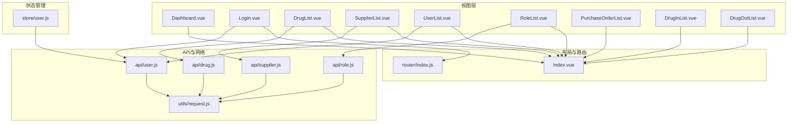
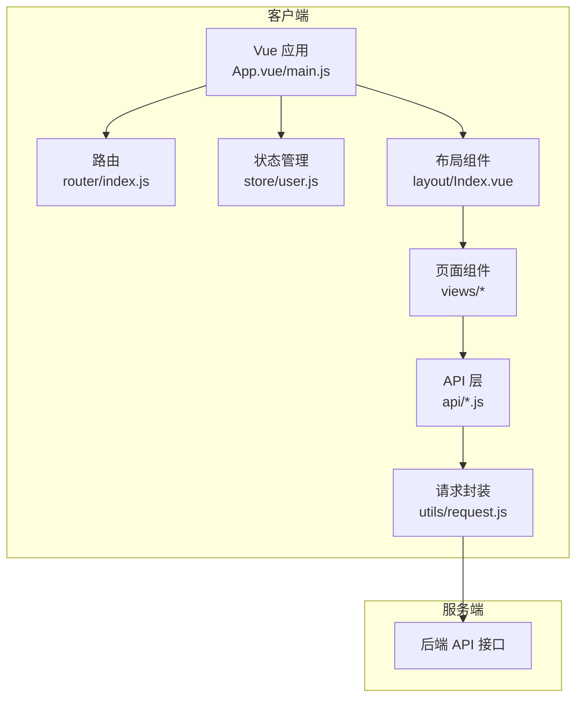
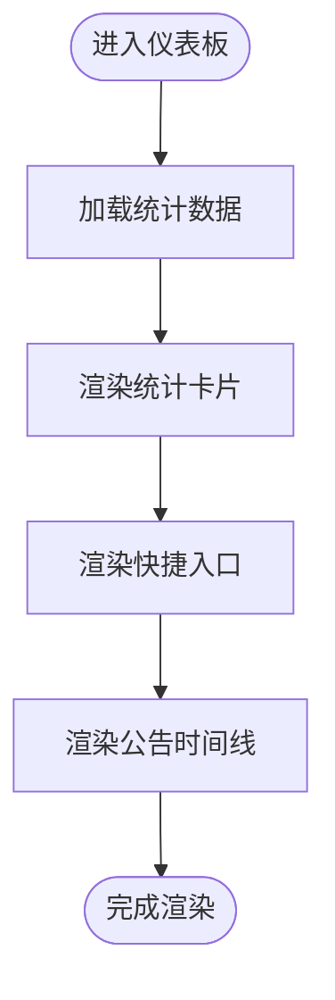
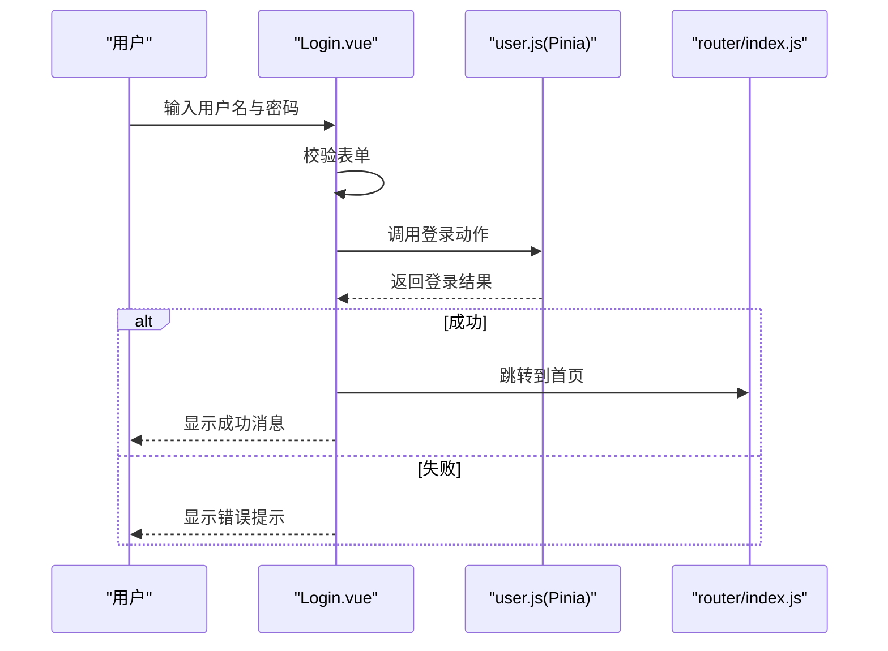
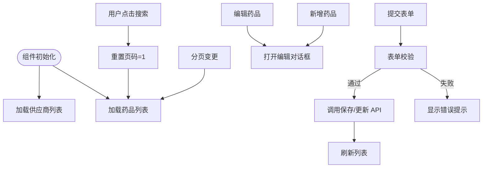
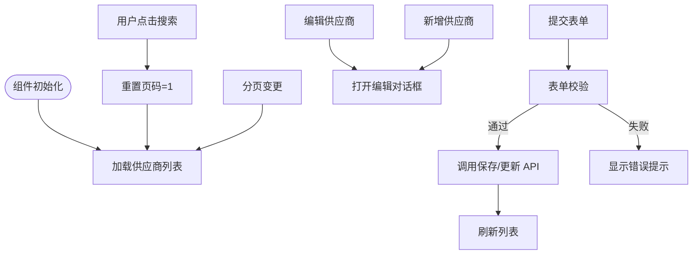
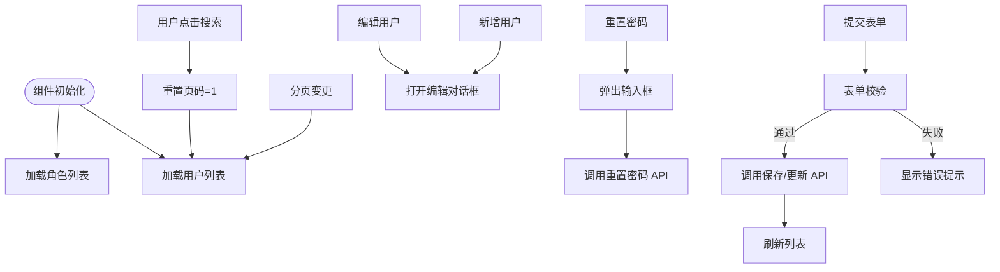
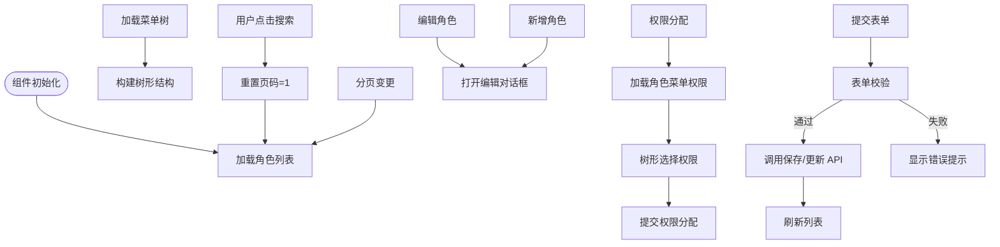
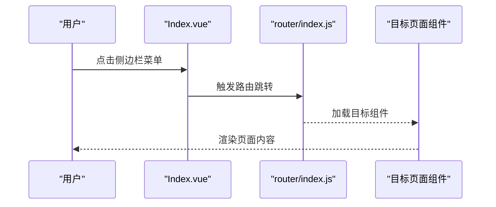
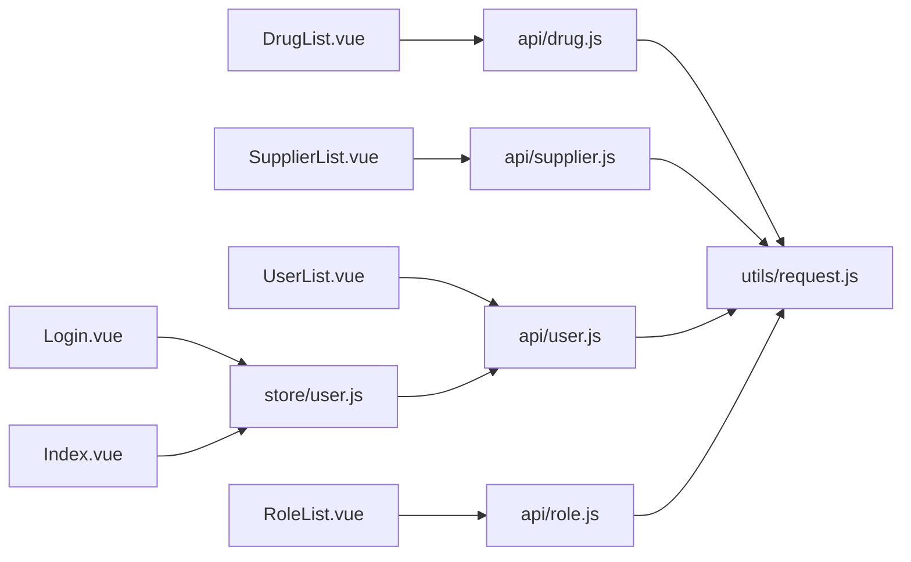

# 页面组件实现

<cite>
**本文档引用的文件**
- [Dashboard.vue](file://drug-front/src/views/Dashboard.vue)
- [Login.vue](file://drug-front/src/views/Login.vue)
- [DrugList.vue](file://drug-front/src/views/drug/DrugList.vue)
- [SupplierList.vue](file://drug-front/src/views/supplier/SupplierList.vue)
- [UserList.vue](file://drug-front/src/views/system/UserList.vue)
- [RoleList.vue](file://drug-front/src/views/system/RoleList.vue)
- [Index.vue](file://drug-front/src/layout/Index.vue)
- [index.js](file://drug-front/src/router/index.js)
- [user.js](file://drug-front/src/store/user.js)
- [request.js](file://drug-front/src/utils/request.js)
- [drug.js](file://drug-front/src/api/drug.js)
- [supplier.js](file://drug-front/src/api/supplier.js)
- [user.js](file://drug-front/src/api/user.js)
- [role.js](file://drug-front/src/api/role.js)
- [PurchaseOrderList.vue](file://drug-front/src/views/purchase/PurchaseOrderList.vue)
- [DrugInList.vue](file://drug-front/src/views/inout/DrugInList.vue)
- [DrugOutList.vue](file://drug-front/src/views/inout/DrugOutList.vue)
</cite>

## 目录
1. [简介](#简介)
2. [项目结构](#项目结构)
3. [核心组件](#核心组件)
4. [架构概览](#架构概览)
5. [详细组件分析](#详细组件分析)
6. [依赖关系分析](#依赖关系分析)
7. [性能考虑](#性能考虑)
8. [故障排除指南](#故障排除指南)
9. [结论](#结论)
10. [附录](#附录)

## 简介
本文件面向药品管理系统前端页面组件实现，系统采用 Vue 3 + Element Plus + Pinia + Vue Router 技术栈，提供完整的页面组件实现文档。重点覆盖以下方面：
- 仪表板组件的数据展示、图表集成与布局设计
- 登录组件的表单验证、用户认证与状态管理
- 功能模块页面（药品管理、供应商管理、用户管理、角色管理）的实现细节
- 组件间页面跳转、参数传递与数据绑定
- 页面组件的业务逻辑处理、API 调用与错误处理
- 页面组件开发示例、样式定制与响应式设计实现

## 项目结构
前端项目采用基于功能域的组织方式，页面组件位于 `src/views` 下，按模块划分：
- 仪表板与登录：`Dashboard.vue`、`Login.vue`
- 药品管理：`drug/DrugList.vue`
- 供应商管理：`supplier/SupplierList.vue`
- 系统管理：`system/UserList.vue`、`system/RoleList.vue`
- 业务流程：`purchase/PurchaseOrderList.vue`、`inout/DrugInList.vue`、`inout/DrugOutList.vue`
- 布局与路由：`layout/Index.vue`、`router/index.js`
- 状态管理：`store/user.js`
- API 封装：`api/*.js`
- 网络请求封装：`utils/request.js`

**图表来源**
- [Dashboard.vue:1-226](file://drug-front/src/views/Dashboard.vue#L1-L226)
- [Login.vue:1-127](file://drug-front/src/views/Login.vue#L1-L127)
- [DrugList.vue:1-426](file://drug-front/src/views/drug/DrugList.vue#L1-L426)
- [SupplierList.vue:1-302](file://drug-front/src/views/supplier/SupplierList.vue#L1-L302)
- [UserList.vue:1-358](file://drug-front/src/views/system/UserList.vue#L1-L358)
- [RoleList.vue:1-385](file://drug-front/src/views/system/RoleList.vue#L1-L385)
- [Index.vue:1-213](file://drug-front/src/layout/Index.vue#L1-L213)
- [index.js:1-115](file://drug-front/src/router/index.js#L1-L115)
- [user.js:1-68](file://drug-front/src/store/user.js#L1-L68)
- [drug.js:1-45](file://drug-front/src/api/drug.js#L1-L45)
- [supplier.js:1-45](file://drug-front/src/api/supplier.js#L1-L45)
- [user.js:1-71](file://drug-front/src/api/user.js#L1-L71)
- [role.js:1-70](file://drug-front/src/api/role.js#L1-L70)
- [request.js:1-56](file://drug-front/src/utils/request.js#L1-L56)

**章节来源**
- [Dashboard.vue:1-226](file://drug-front/src/views/Dashboard.vue#L1-L226)
- [Login.vue:1-127](file://drug-front/src/views/Login.vue#L1-L127)
- [DrugList.vue:1-426](file://drug-front/src/views/drug/DrugList.vue#L1-L426)
- [SupplierList.vue:1-302](file://drug-front/src/views/supplier/SupplierList.vue#L1-L302)
- [UserList.vue:1-358](file://drug-front/src/views/system/UserList.vue#L1-L358)
- [RoleList.vue:1-385](file://drug-front/src/views/system/RoleList.vue#L1-L385)
- [Index.vue:1-213](file://drug-front/src/layout/Index.vue#L1-L213)
- [index.js:1-115](file://drug-front/src/router/index.js#L1-L115)
- [user.js:1-68](file://drug-front/src/store/user.js#L1-L68)
- [drug.js:1-45](file://drug-front/src/api/drug.js#L1-L45)
- [supplier.js:1-45](file://drug-front/src/api/supplier.js#L1-L45)
- [user.js:1-71](file://drug-front/src/api/user.js#L1-L71)
- [role.js:1-70](file://drug-front/src/api/role.js#L1-L70)
- [request.js:1-56](file://drug-front/src/utils/request.js#L1-L56)

## 核心组件
本节概述关键页面组件的功能职责与实现要点。

- 仪表板组件（Dashboard）
  - 数据展示：统计卡片（药品总数、库存预警、待审核采购单、库存总金额）
  - 快捷入口：导航至药品管理、采购管理、入库管理、出库管理
  - 公告信息：时间线展示系统公告
  - 布局设计：Element Plus 布局容器、卡片、栅格系统与图标组合

- 登录组件（Login）
  - 表单验证：用户名必填、密码必填且长度不少于 6 位
  - 用户认证：调用用户状态存储执行登录，成功后跳转首页
  - 状态管理：Pinia Store 管理 token、用户信息、角色与菜单

- 药品管理组件（DrugList）
  - 搜索与筛选：按名称、编码、类型搜索；分页控制
  - CRUD 操作：新增、编辑、删除；对话框表单校验
  - 供应商联动：根据供应商自动填充生产企业
  - 数据绑定：Element Plus 表格、分页、对话框与表单双向绑定

- 供应商管理组件（SupplierList）
  - 搜索与筛选：按名称、联系人搜索；分页控制
  - CRUD 操作：新增、编辑、删除；对话框表单校验
  - 数据绑定：表格、分页、对话框与表单双向绑定

- 用户管理组件（UserList）
  - 搜索与筛选：按用户名、真实姓名、角色搜索；分页控制
  - CRUD 操作：新增、编辑、删除；密码重置
  - 角色联动：加载角色列表用于分配
  - 数据绑定：表格、分页、对话框与表单双向绑定

- 角色管理组件（RoleList）
  - 搜索与筛选：按角色名称搜索；分页控制
  - CRUD 操作：新增、编辑、删除
  - 权限分配：树形菜单选择并提交权限
  - 数据绑定：表格、分页、对话框与树形控件

**章节来源**
- [Dashboard.vue:1-226](file://drug-front/src/views/Dashboard.vue#L1-L226)
- [Login.vue:1-127](file://drug-front/src/views/Login.vue#L1-L127)
- [DrugList.vue:1-426](file://drug-front/src/views/drug/DrugList.vue#L1-L426)
- [SupplierList.vue:1-302](file://drug-front/src/views/supplier/SupplierList.vue#L1-L302)
- [UserList.vue:1-358](file://drug-front/src/views/system/UserList.vue#L1-L358)
- [RoleList.vue:1-385](file://drug-front/src/views/system/RoleList.vue#L1-L385)

## 架构概览
系统采用前后端分离架构，前端通过 Axios 封装统一请求，路由守卫控制访问权限，Pinia 管理全局状态，Element Plus 提供 UI 组件与交互。

**图表来源**
- [index.js:1-115](file://drug-front/src/router/index.js#L1-L115)
- [user.js:1-68](file://drug-front/src/store/user.js#L1-L68)
- [Index.vue:1-213](file://drug-front/src/layout/Index.vue#L1-L213)
- [request.js:1-56](file://drug-front/src/utils/request.js#L1-L56)
- [drug.js:1-45](file://drug-front/src/api/drug.js#L1-L45)
- [supplier.js:1-45](file://drug-front/src/api/supplier.js#L1-L45)
- [user.js:1-71](file://drug-front/src/api/user.js#L1-L71)
- [role.js:1-70](file://drug-front/src/api/role.js#L1-L70)

## 详细组件分析

### 仪表板组件（Dashboard）
- 数据展示
  - 使用响应式对象维护统计数据（药品总数、库存预警、待审核采购单、库存总金额）
  - 统计卡片采用 Element Plus 卡片与栅格布局，支持悬停效果与渐变背景
- 快捷入口
  - 遍历快捷入口列表，点击触发路由跳转
- 公告信息
  - 时间线组件展示系统公告
- 样式与布局
  - 使用 scoped 样式隔离组件样式，确保卡片、图标与文本的视觉一致性

**图表来源**
- [Dashboard.vue:106-127](file://drug-front/src/views/Dashboard.vue#L106-L127)

**章节来源**
- [Dashboard.vue:1-226](file://drug-front/src/views/Dashboard.vue#L1-L226)

### 登录组件（Login）
- 表单验证
  - 使用 Element Plus 表单验证规则，用户名与密码必填
  - 密码最小长度限制为 6 位
- 用户认证
  - 调用用户状态存储执行登录，成功后显示成功消息并跳转首页
- 状态管理
  - 登录成功后将 token、用户信息、角色与菜单写入本地存储
- 错误处理
  - 异常捕获与日志输出，避免阻塞流程

**图表来源**
- [Login.vue:74-92](file://drug-front/src/views/Login.vue#L74-L92)
- [user.js:20-38](file://drug-front/src/store/user.js#L20-L38)
- [index.js:91-112](file://drug-front/src/router/index.js#L91-L112)

**章节来源**
- [Login.vue:1-127](file://drug-front/src/views/Login.vue#L1-L127)
- [user.js:1-68](file://drug-front/src/store/user.js#L1-L68)
- [index.js:1-115](file://drug-front/src/router/index.js#L1-L115)

### 药品管理组件（DrugList）
- 搜索与筛选
  - 支持按药品名称、编码、类型搜索；重置按钮清空条件并重新查询
- 分页与加载
  - 基于 Element Plus 分页组件，支持页码与每页条数变更
- CRUD 操作
  - 新增/编辑：对话框表单，包含药品类型、规格、单位、价格、供应商、批准文号等字段
  - 删除：二次确认对话框，调用删除 API 后刷新列表
- 供应商联动
  - 选择供应商时自动填充生产企业字段
- 数据绑定与校验
  - 表单字段双向绑定，提交前进行必填与格式校验

**图表来源**
- [DrugList.vue:271-414](file://drug-front/src/views/drug/DrugList.vue#L271-L414)

**章节来源**
- [DrugList.vue:1-426](file://drug-front/src/views/drug/DrugList.vue#L1-L426)
- [drug.js:1-45](file://drug-front/src/api/drug.js#L1-L45)
- [supplier.js:1-45](file://drug-front/src/api/supplier.js#L1-L45)

### 供应商管理组件（SupplierList）
- 搜索与筛选
  - 支持按供应商名称、联系人搜索；重置按钮清空条件并重新查询
- 分页与加载
  - 基于 Element Plus 分页组件，支持页码与每页条数变更
- CRUD 操作
  - 新增/编辑：对话框表单，包含供应商编码、名称、联系人、电话、地址、执照号、状态等字段
  - 删除：二次确认对话框，调用删除 API 后刷新列表
- 数据绑定与校验
  - 表单字段双向绑定，提交前进行必填与格式校验

**图表来源**
- [SupplierList.vue:175-290](file://drug-front/src/views/supplier/SupplierList.vue#L175-L290)

**章节来源**
- [SupplierList.vue:1-302](file://drug-front/src/views/supplier/SupplierList.vue#L1-L302)
- [supplier.js:1-45](file://drug-front/src/api/supplier.js#L1-L45)

### 用户管理组件（UserList）
- 搜索与筛选
  - 支持按用户名、真实姓名、角色搜索；重置按钮清空条件并重新查询
- 分页与加载
  - 基于 Element Plus 分页组件，支持页码与每页条数变更
- CRUD 操作
  - 新增/编辑：对话框表单，包含用户名、真实姓名、密码、角色、手机、邮箱、状态等字段
  - 删除：二次确认对话框，调用删除 API 后刷新列表
  - 重置密码：弹出输入框，校验长度后调用重置密码 API
- 角色联动
  - 初始化时加载角色列表用于分配
- 数据绑定与校验
  - 表单字段双向绑定，提交前进行必填与格式校验（手机号、邮箱）

**图表来源**
- [UserList.vue:171-346](file://drug-front/src/views/system/UserList.vue#L171-L346)

**章节来源**
- [UserList.vue:1-358](file://drug-front/src/views/system/UserList.vue#L1-L358)
- [user.js:1-71](file://drug-front/src/api/user.js#L1-L71)
- [role.js:1-70](file://drug-front/src/api/role.js#L1-L70)

### 角色管理组件（RoleList）
- 搜索与筛选
  - 支持按角色名称搜索；重置按钮清空条件并重新查询
- 分页与加载
  - 基于 Element Plus 分页组件，支持页码与每页条数变更
- CRUD 操作
  - 新增/编辑：对话框表单，包含角色名称、角色编码、描述
  - 删除：二次确认对话框，调用删除 API 后刷新列表
- 权限分配
  - 打开权限分配对话框，加载菜单树并支持多选；提交后调用权限分配 API
- 菜单树构建
  - 将扁平菜单转换为树形结构，确保“采购管理审核”菜单存在
- 数据绑定与校验
  - 表单字段双向绑定，提交前进行必填校验

**图表来源**
- [RoleList.vue:160-373](file://drug-front/src/views/system/RoleList.vue#L160-L373)

**章节来源**
- [RoleList.vue:1-385](file://drug-front/src/views/system/RoleList.vue#L1-L385)
- [role.js:1-70](file://drug-front/src/api/role.js#L1-L70)

### 页面跳转、参数传递与数据绑定
- 路由配置
  - 登录页与主框架路由分离，子路由包含仪表板、药品管理、供应商管理、采购管理、库存管理、入库管理、出库管理、报表统计、用户管理、角色管理
  - 路由守卫根据登录状态控制访问，设置页面标题
- 布局组件
  - 侧边栏菜单动态生成，依据用户菜单权限过滤并保持固定顺序
  - 顶部导航显示当前用户信息，支持退出登录
- 参数传递
  - 组件内部通过响应式数据与 Element Plus 组件属性进行参数传递
  - 对话框与详情弹窗通过本地状态控制显示隐藏

**图表来源**
- [Index.vue:88-126](file://drug-front/src/layout/Index.vue#L88-L126)
- [index.js:91-112](file://drug-front/src/router/index.js#L91-L112)

**章节来源**
- [index.js:1-115](file://drug-front/src/router/index.js#L1-L115)
- [Index.vue:1-213](file://drug-front/src/layout/Index.vue#L1-L213)

## 依赖关系分析
- 组件与 API 的依赖
  - 页面组件通过 API 层发起请求，API 层基于请求封装统一处理
- 状态管理依赖
  - 登录组件与布局组件依赖用户状态存储，用于读取 token、用户信息与菜单
- 路由与布局依赖
  - 页面组件通过布局组件嵌套，路由守卫控制访问权限

**图表来源**
- [DrugList.vue:211-212](file://drug-front/src/views/drug/DrugList.vue#L211-L212)
- [SupplierList.vue:129-129](file://drug-front/src/views/supplier/SupplierList.vue#L129-L129)
- [UserList.vue:142-143](file://drug-front/src/views/system/UserList.vue#L142-L143)
- [RoleList.vue:124-124](file://drug-front/src/views/system/RoleList.vue#L124-L124)
- [drug.js:1-45](file://drug-front/src/api/drug.js#L1-L45)
- [supplier.js:1-45](file://drug-front/src/api/supplier.js#L1-L45)
- [user.js:1-71](file://drug-front/src/api/user.js#L1-L71)
- [role.js:1-70](file://drug-front/src/api/role.js#L1-L70)
- [request.js:1-56](file://drug-front/src/utils/request.js#L1-L56)
- [Login.vue:50-50](file://drug-front/src/views/Login.vue#L50-L50)
- [Index.vue:64-64](file://drug-front/src/layout/Index.vue#L64-L64)
- [user.js:1-68](file://drug-front/src/store/user.js#L1-L68)

**章节来源**
- [DrugList.vue:1-426](file://drug-front/src/views/drug/DrugList.vue#L1-L426)
- [SupplierList.vue:1-302](file://drug-front/src/views/supplier/SupplierList.vue#L1-L302)
- [UserList.vue:1-358](file://drug-front/src/views/system/UserList.vue#L1-L358)
- [RoleList.vue:1-385](file://drug-front/src/views/system/RoleList.vue#L1-L385)
- [drug.js:1-45](file://drug-front/src/api/drug.js#L1-L45)
- [supplier.js:1-45](file://drug-front/src/api/supplier.js#L1-L45)
- [user.js:1-71](file://drug-front/src/api/user.js#L1-L71)
- [role.js:1-70](file://drug-front/src/api/role.js#L1-L70)
- [request.js:1-56](file://drug-front/src/utils/request.js#L1-L56)
- [Login.vue:1-127](file://drug-front/src/views/Login.vue#L1-L127)
- [Index.vue:1-213](file://drug-front/src/layout/Index.vue#L1-L213)
- [user.js:1-68](file://drug-front/src/store/user.js#L1-L68)

## 性能考虑
- 请求拦截与缓存
  - 在请求拦截器中注入 Authorization 头，减少重复鉴权逻辑
  - 响应拦截器统一处理错误码与 401 未授权跳转
- 组件渲染优化
  - 使用 v-loading 控制表格加载状态，避免全屏遮罩影响用户体验
  - 分页组件按需加载，减少一次性渲染大量数据
- 状态持久化
  - 用户登录信息与菜单持久化到本地存储，降低重复请求成本

**章节来源**
- [request.js:11-53](file://drug-front/src/utils/request.js#L11-L53)
- [DrugList.vue:41-47](file://drug-front/src/views/drug/DrugList.vue#L41-L47)
- [SupplierList.vue:33-39](file://drug-front/src/views/supplier/SupplierList.vue#L33-L39)
- [user.js:5-10](file://drug-front/src/store/user.js#L5-L10)

## 故障排除指南
- 登录失败
  - 检查用户名与密码是否符合验证规则
  - 查看控制台错误日志，确认网络请求与响应状态
- 数据加载异常
  - 确认后端接口可用性与跨域配置
  - 检查请求拦截器中的 token 注入是否正确
- 权限问题
  - 确认用户菜单权限是否正确下发
  - 检查路由守卫逻辑与页面标题设置

**章节来源**
- [Login.vue:74-92](file://drug-front/src/views/Login.vue#L74-L92)
- [request.js:27-53](file://drug-front/src/utils/request.js#L27-L53)
- [index.js:91-112](file://drug-front/src/router/index.js#L91-L112)

## 结论
本文档系统梳理了药品管理系统前端页面组件的实现，涵盖仪表板、登录、药品管理、供应商管理、用户管理、角色管理等核心页面。通过统一的 API 封装与状态管理，结合路由守卫与布局组件，实现了清晰的页面跳转、参数传递与数据绑定机制。建议在后续开发中持续优化请求拦截与错误处理策略，提升系统的稳定性与用户体验。

## 附录
- 开发示例
  - 新增页面：参考现有组件的搜索、分页、对话框与表单校验模式
  - 样式定制：使用 scoped 样式隔离组件样式，遵循 Element Plus 设计规范
  - 响应式设计：利用栅格系统与卡片布局适配不同屏幕尺寸
- API 调用最佳实践
  - 统一使用 API 层封装请求方法，便于集中处理错误与拦截器
  - 对外暴露简洁的函数接口，内部统一处理参数与响应格式