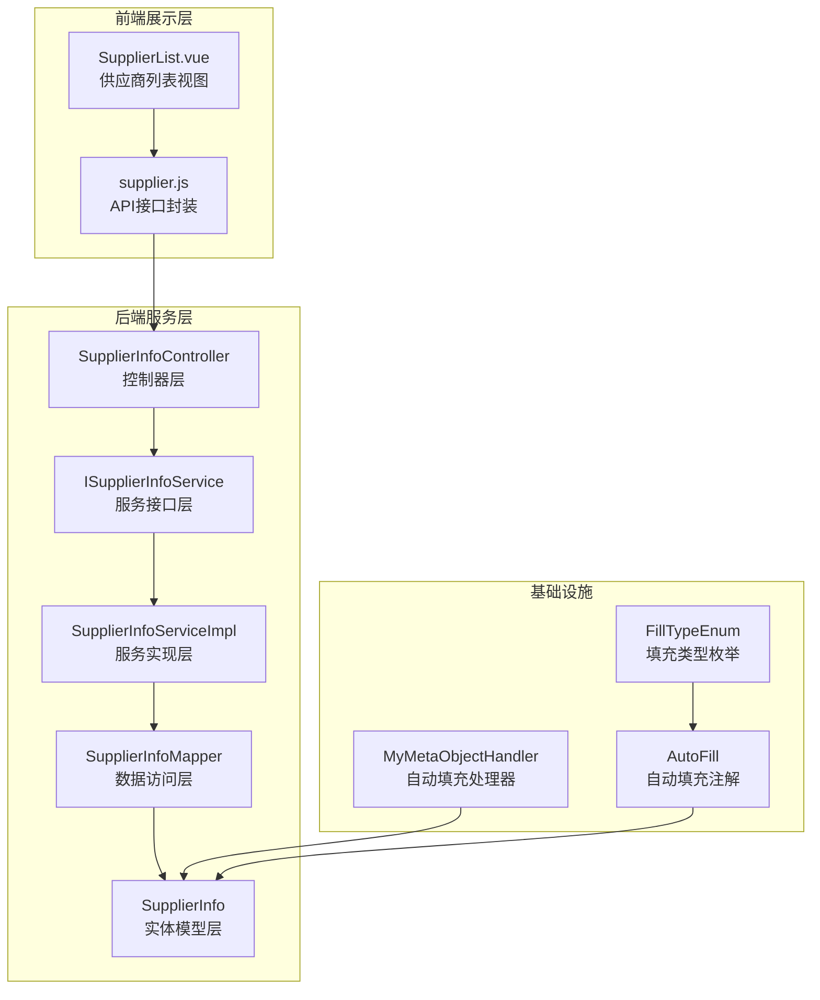
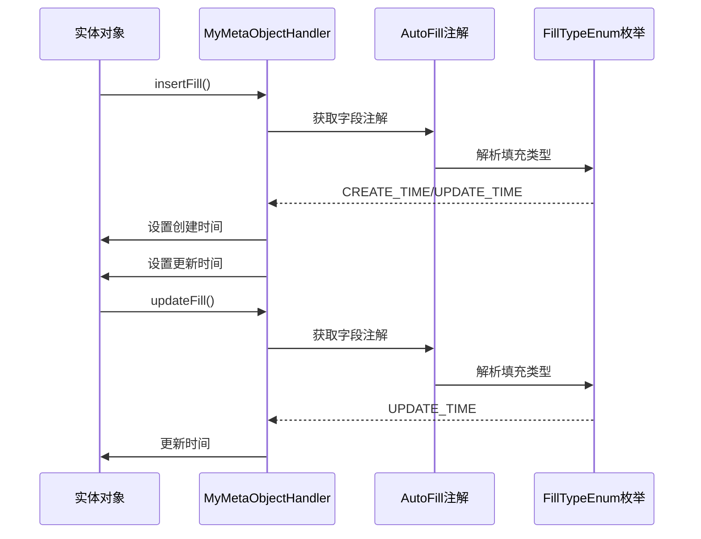
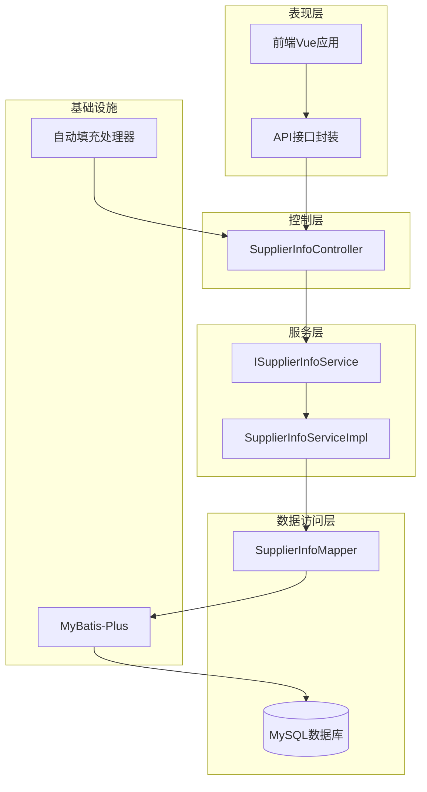
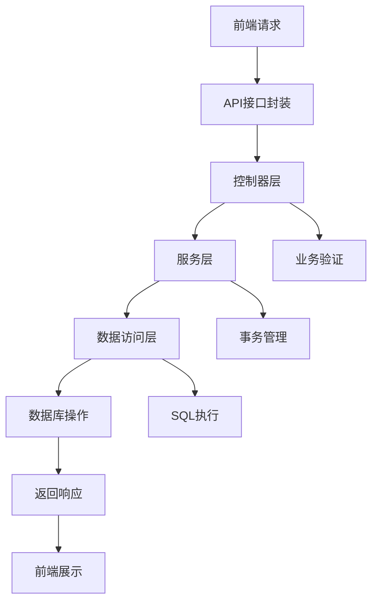
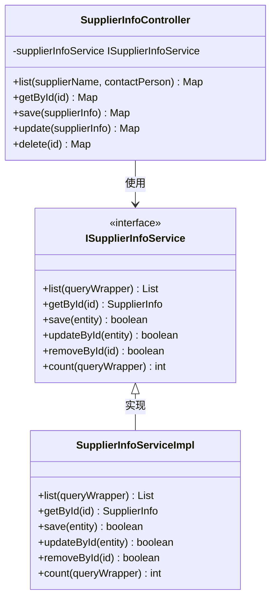
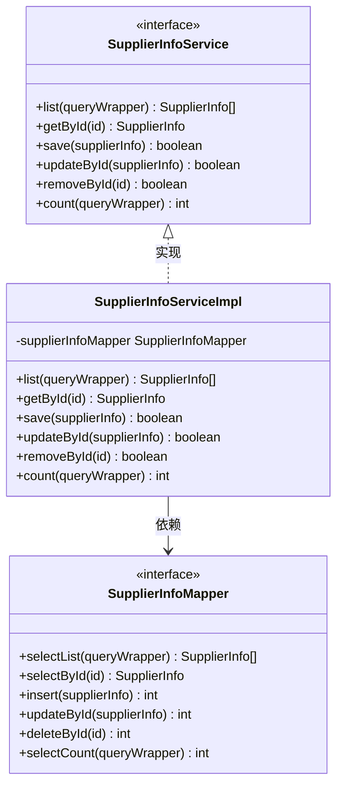
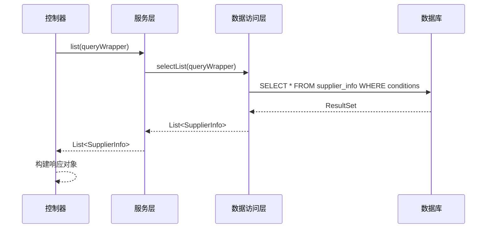
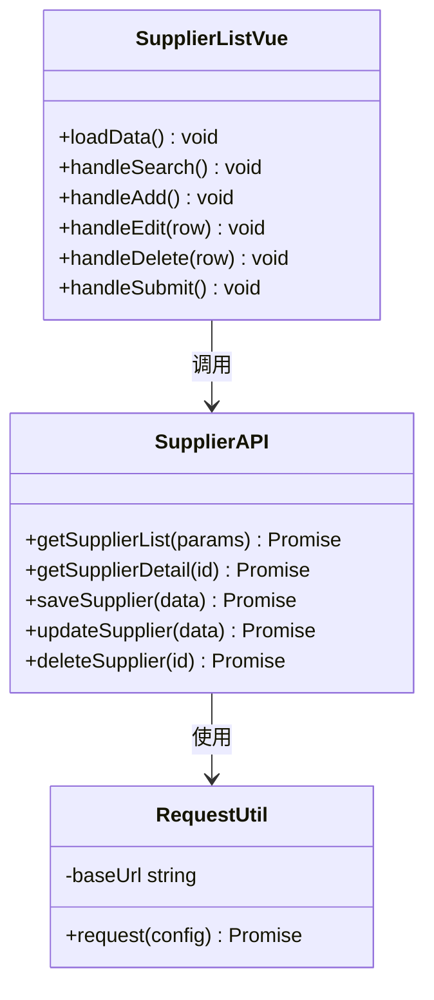
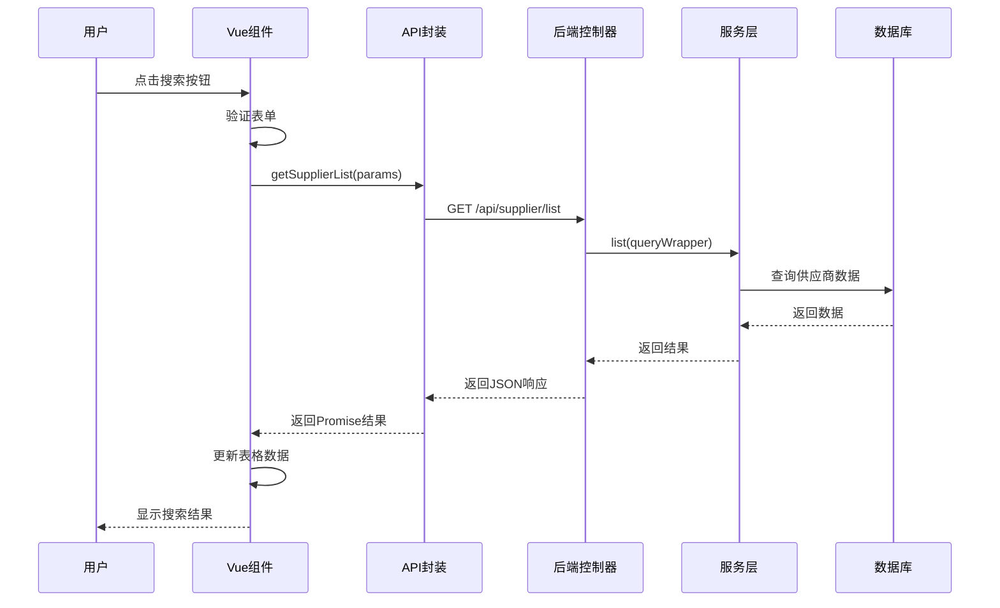
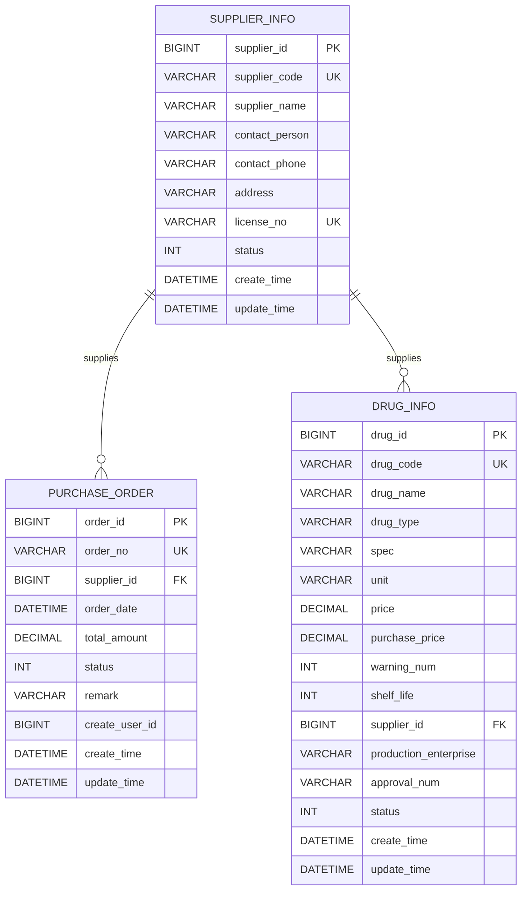

# 供应商管理API

<cite>
**本文档引用的文件**
- [SupplierInfoController.java](file://src/main/java/com/hospital/drugmanagement/controller/SupplierInfoController.java)
- [SupplierInfo.java](file://src/main/java/com/hospital/drugmanagement/entity/SupplierInfo.java)
- [ISupplierInfoService.java](file://src/main/java/com/hospital/drugmanagement/service/ISupplierInfoService.java)
- [SupplierInfoServiceImpl.java](file://src/main/java/com/hospital/drugmanagement/service/impl/SupplierInfoServiceImpl.java)
- [SupplierInfoMapper.java](file://src/main/java/com/hospital/drugmanagement/mapper/SupplierInfoMapper.java)
- [supplier.js](file://drug-front/src/api/supplier.js)
- [SupplierList.vue](file://drug-front/src/views/supplier/SupplierList.vue)
- [PurchaseOrder.java](file://src/main/java/com/hospital/drugmanagement/entity/PurchaseOrder.java)
- [PurchaseOrderController.java](file://src/main/java/com/hospital/drugmanagement/controller/PurchaseOrderController.java)
- [init.sql](file://src/main/resources/db/init.sql)
- [hospital_drug.sql](file://hospital_drug.sql)
- [MyMetaObjectHandler.java](file://src/main/java/com/hospital/drugmanagement/common/handler/MyMetaObjectHandler.java)
- [AutoFill.java](file://src/main/java/com/hospital/drugmanagement/common/anno/AutoFill.java)
- [FillTypeEnum.java](file://src/main/java/com/hospital/drugmanagement/common/constant/FillTypeEnum.java)
</cite>

## 目录
1. [简介](#简介)
2. [项目结构](#项目结构)
3. [核心组件](#核心组件)
4. [架构概览](#架构概览)
5. [详细组件分析](#详细组件分析)
6. [依赖关系分析](#依赖关系分析)
7. [性能考虑](#性能考虑)
8. [故障排除指南](#故障排除指南)
9. [结论](#结论)

## 简介

供应商管理API是药品管理系统中的核心模块，负责管理医疗机构与供应商之间的业务关系。该系统提供了完整的供应商生命周期管理功能，包括供应商信息的增删改查、状态管理、联系人维护等基础功能，以及与药品采购系统的深度集成。

系统采用前后端分离架构，后端基于Spring Boot框架，使用MyBatis-Plus进行数据持久化，前端采用Vue.js技术栈。供应商管理模块实现了RESTful API设计原则，提供了标准化的HTTP接口供前端调用。

## 项目结构

供应商管理模块在项目中的组织结构如下：



**图表来源**
- [SupplierInfoController.java:1-176](file://src/main/java/com/hospital/drugmanagement/controller/SupplierInfoController.java#L1-L176)
- [SupplierInfo.java:1-39](file://src/main/java/com/hospital/drugmanagement/entity/SupplierInfo.java#L1-L39)
- [supplier.js:1-45](file://drug-front/src/api/supplier.js#L1-L45)

**章节来源**
- [SupplierInfoController.java:1-176](file://src/main/java/com/hospital/drugmanagement/controller/SupplierInfoController.java#L1-L176)
- [SupplierInfo.java:1-39](file://src/main/java/com/hospital/drugmanagement/entity/SupplierInfo.java#L1-L39)
- [supplier.js:1-45](file://drug-front/src/api/supplier.js#L1-L45)

## 核心组件

### 数据模型设计

供应商实体模型采用标准的ORM映射设计，支持完整的业务需求：

| 字段名 | 类型 | 描述 | 约束 |
|--------|------|------|------|
| supplierId | Long | 供应商ID | 主键自增 |
| supplierCode | String | 供应商编码 | 唯一约束 |
| supplierName | String | 供应商名称 | 必填 |
| contactPerson | String | 联系人 | 可选 |
| contactPhone | String | 联系电话 | 可选 |
| address | String | 地址 | 可选 |
| licenseNo | String | 营业执照号 | 唯一约束 |
| status | Integer | 状态（0禁用/1启用） | 默认1 |
| createTime | LocalDateTime | 创建时间 | 自动填充 |
| updateTime | LocalDateTime | 更新时间 | 自动填充 |

### 自动填充机制

系统实现了统一的字段自动填充机制，确保数据的一致性和完整性：



**图表来源**
- [MyMetaObjectHandler.java:21-32](file://src/main/java/com/hospital/drugmanagement/common/handler/MyMetaObjectHandler.java#L21-L32)
- [AutoFill.java:12-15](file://src/main/java/com/hospital/drugmanagement/common/anno/AutoFill.java#L12-L15)
- [FillTypeEnum.java:6-9](file://src/main/java/com/hospital/drugmanagement/common/constant/FillTypeEnum.java#L6-L9)

**章节来源**
- [SupplierInfo.java:17-39](file://src/main/java/com/hospital/drugmanagement/entity/SupplierInfo.java#L17-L39)
- [MyMetaObjectHandler.java:21-60](file://src/main/java/com/hospital/drugmanagement/common/handler/MyMetaObjectHandler.java#L21-L60)
- [AutoFill.java:6-15](file://src/main/java/com/hospital/drugmanagement/common/anno/AutoFill.java#L6-L15)
- [FillTypeEnum.java:1-9](file://src/main/java/com/hospital/drugmanagement/common/constant/FillTypeEnum.java#L1-L9)

## 架构概览

供应商管理系统的整体架构采用分层设计模式，确保了良好的可维护性和扩展性：



**图表来源**
- [SupplierInfoController.java:12-18](file://src/main/java/com/hospital/drugmanagement/controller/SupplierInfoController.java#L12-L18)
- [ISupplierInfoService.java:1-7](file://src/main/java/com/hospital/drugmanagement/service/ISupplierInfoService.java#L1-L7)
- [SupplierInfoServiceImpl.java:9-11](file://src/main/java/com/hospital/drugmanagement/service/impl/SupplierInfoServiceImpl.java#L9-L11)

### 数据流分析

系统的核心数据流遵循标准的MVC模式：



**图表来源**
- [supplier.js:3-45](file://drug-front/src/api/supplier.js#L3-L45)
- [SupplierInfoController.java:20-176](file://src/main/java/com/hospital/drugmanagement/controller/SupplierInfoController.java#L20-L176)

**章节来源**
- [SupplierInfoController.java:12-176](file://src/main/java/com/hospital/drugmanagement/controller/SupplierInfoController.java#L12-L176)
- [supplier.js:1-45](file://drug-front/src/api/supplier.js#L1-L45)

## 详细组件分析

### 控制器层分析

#### 供应商信息控制器

供应商信息控制器实现了完整的CRUD操作，提供了RESTful风格的API接口：



**图表来源**
- [SupplierInfoController.java:15-176](file://src/main/java/com/hospital/drugmanagement/controller/SupplierInfoController.java#L15-L176)
- [ISupplierInfoService.java:1-7](file://src/main/java/com/hospital/drugmanagement/service/ISupplierInfoService.java#L1-L7)
- [SupplierInfoServiceImpl.java:9-11](file://src/main/java/com/hospital/drugmanagement/service/impl/SupplierInfoServiceImpl.java#L9-L11)

#### 接口规范

系统提供以下核心API接口：

##### 1. 供应商列表查询

**请求方法**: GET  
**请求路径**: `/api/supplier/list`  
**请求参数**:

| 参数名 | 类型 | 必填 | 描述 | 示例 |
|--------|------|------|------|------|
| supplierName | String | 否 | 供应商名称 | 华北制药 |
| contactPerson | String | 否 | 联系人姓名 | 李经理 |

**响应格式**:
```json
{
  "code": 200,
  "msg": "success",
  "data": [
    {
      "supplierId": 1,
      "supplierCode": "GY001",
      "supplierName": "华北制药股份有限公司",
      "contactPerson": "李经理",
      "contactPhone": "0311-88888888",
      "address": "河北省石家庄市",
      "licenseNo": "91130000123456789X",
      "status": 1,
      "createTime": "2026-01-01T00:00:00",
      "updateTime": "2026-01-01T00:00:00"
    }
  ],
  "total": 1
}
```

##### 2. 供应商详情获取

**请求方法**: GET  
**请求路径**: `/api/supplier/{id}`  
**路径参数**:

| 参数名 | 类型 | 必填 | 描述 |
|--------|------|------|------|
| id | Long | 是 | 供应商ID |

**响应格式**:
```json
{
  "code": 200,
  "msg": "success",
  "data": {
    "supplierId": 1,
    "supplierCode": "GY001",
    "supplierName": "华北制药股份有限公司",
    "contactPerson": "李经理",
    "contactPhone": "0311-88888888",
    "address": "河北省石家庄市",
    "licenseNo": "91130000123456789X",
    "status": 1,
    "createTime": "2026-01-01T00:00:00",
    "updateTime": "2026-01-01T00:00:00"
  }
}
```

##### 3. 供应商新增

**请求方法**: POST  
**请求路径**: `/api/supplier`  
**请求体参数**:

| 参数名 | 类型 | 必填 | 描述 |
|--------|------|------|------|
| supplierCode | String | 是 | 供应商编码 |
| supplierName | String | 是 | 供应商名称 |
| contactPerson | String | 是 | 联系人 |
| contactPhone | String | 是 | 联系电话 |
| address | String | 是 | 地址 |
| licenseNo | String | 是 | 营业执照号 |
| status | Integer | 否 | 状态，默认1 |

**响应格式**:
```json
{
  "code": 200,
  "msg": "保存成功",
  "data": null
}
```

##### 4. 供应商编辑

**请求方法**: PUT  
**请求路径**: `/api/supplier`  
**请求体参数**: 同新增接口，需包含supplierId

**响应格式**:
```json
{
  "code": 200,
  "msg": "更新成功",
  "data": null
}
```

##### 5. 供应商删除

**请求方法**: DELETE  
**请求路径**: `/api/supplier/{id}`  
**路径参数**: 同详情接口

**响应格式**:
```json
{
  "code": 200,
  "msg": "删除成功",
  "data": null
}
```

**章节来源**
- [SupplierInfoController.java:20-176](file://src/main/java/com/hospital/drugmanagement/controller/SupplierInfoController.java#L20-L176)

### 服务层分析

#### 服务接口设计

服务层采用接口抽象设计，提供了清晰的业务逻辑边界：



**图表来源**
- [ISupplierInfoService.java:1-7](file://src/main/java/com/hospital/drugmanagement/service/ISupplierInfoService.java#L1-L7)
- [SupplierInfoServiceImpl.java:9-11](file://src/main/java/com/hospital/drugmanagement/service/impl/SupplierInfoServiceImpl.java#L9-L11)
- [SupplierInfoMapper.java:1-7](file://src/main/java/com/hospital/drugmanagement/mapper/SupplierInfoMapper.java#L1-L7)

**章节来源**
- [ISupplierInfoService.java:1-7](file://src/main/java/com/hospital/drugmanagement/service/ISupplierInfoService.java#L1-L7)
- [SupplierInfoServiceImpl.java:1-11](file://src/main/java/com/hospital/drugmanagement/service/impl/SupplierInfoServiceImpl.java#L1-L11)
- [SupplierInfoMapper.java:1-7](file://src/main/java/com/hospital/drugmanagement/mapper/SupplierInfoMapper.java#L1-L7)

### 数据访问层分析

#### 数据访问模式

数据访问层采用MyBatis-Plus的通用Mapper模式，简化了数据库操作：



**图表来源**
- [SupplierInfoController.java:36](file://src/main/java/com/hospital/drugmanagement/controller/SupplierInfoController.java#L36)
- [SupplierInfoServiceImpl.java:10](file://src/main/java/com/hospital/drugmanagement/service/impl/SupplierInfoServiceImpl.java#L10)

**章节来源**
- [SupplierInfoMapper.java:1-7](file://src/main/java/com/hospital/drugmanagement/mapper/SupplierInfoMapper.java#L1-L7)

### 前端集成分析

#### API封装设计

前端通过专门的API模块封装了所有供应商相关的HTTP请求：



**图表来源**
- [supplier.js:3-45](file://drug-front/src/api/supplier.js#L3-L45)
- [SupplierList.vue:126-291](file://drug-front/src/views/supplier/SupplierList.vue#L126-L291)

#### 前端交互流程



**图表来源**
- [SupplierList.vue:176-191](file://drug-front/src/views/supplier/SupplierList.vue#L176-L191)
- [supplier.js:4-10](file://drug-front/src/api/supplier.js#L4-L10)

**章节来源**
- [supplier.js:1-45](file://drug-front/src/api/supplier.js#L1-L45)
- [SupplierList.vue:126-291](file://drug-front/src/views/supplier/SupplierList.vue#L126-L291)

## 依赖关系分析

### 数据库设计

供应商管理模块的数据库设计遵循规范化原则，确保了数据的一致性和完整性：



**图表来源**
- [init.sql:82-95](file://src/main/resources/db/init.sql#L82-L95)
- [init.sql:127-141](file://src/main/resources/db/init.sql#L127-L141)
- [init.sql:60-80](file://src/main/resources/db/init.sql#L60-L80)

### 外部依赖关系

系统的主要外部依赖包括：

| 依赖组件 | 版本 | 用途 | 重要性 |
|----------|------|------|--------|
| Spring Boot | 2.x | Web框架 | 核心 |
| MyBatis-Plus | 3.x | ORM框架 | 核心 |
| MySQL Connector | 8.x | 数据库驱动 | 核心 |
| Element Plus | 2.x | UI组件库 | 前端 |
| Axios | 1.x | HTTP客户端 | 前端 |

**章节来源**
- [init.sql:82-95](file://src/main/resources/db/init.sql#L82-L95)
- [hospital_drug.sql:136-147](file://hospital_drug.sql#L136-L147)

## 性能考虑

### 查询优化策略

1. **索引设计**: 供应商表的关键字段（supplier_code、license_no）建立了唯一索引，确保查询性能
2. **分页查询**: 列表查询支持分页参数，避免大数据量时的性能问题
3. **条件查询**: 支持按供应商名称和联系人的模糊查询，但建议配合分页使用

### 缓存策略

系统目前未实现专门的缓存机制，建议在以下场景考虑缓存：
- 供应商基础数据（相对静态）
- 常用查询结果
- 配置信息

### 并发控制

1. **唯一性约束**: 数据库层面保证供应商编码和营业执照号的唯一性
2. **乐观锁**: 可考虑在更新操作中加入版本号控制
3. **事务管理**: 所有数据库操作都在事务中执行，确保数据一致性

## 故障排除指南

### 常见错误类型

#### 1. 业务验证错误

**错误类型**: 400 Bad Request  
**触发场景**: 供应商名称、编码或营业执照号重复  
**解决方案**: 
- 检查输入数据的唯一性
- 联系系统管理员确认数据状态

#### 2. 数据库连接错误

**错误类型**: 500 Internal Server Error  
**触发场景**: 数据库连接失败或查询异常  
**解决方案**:
- 检查数据库连接配置
- 验证数据库服务状态
- 查看服务器日志获取详细错误信息

#### 3. 参数验证错误

**错误类型**: 400 Bad Request  
**触发场景**: 请求参数缺失或格式不正确  
**解决方案**:
- 检查前端表单验证
- 确认API请求格式
- 验证必填字段完整性

### 调试建议

1. **前端调试**: 使用浏览器开发者工具查看网络请求和响应
2. **后端日志**: 检查应用服务器日志获取详细错误堆栈
3. **数据库查询**: 直接查询数据库验证数据状态
4. **API测试**: 使用Postman等工具单独测试API接口

**章节来源**
- [SupplierInfoController.java:41-46](file://src/main/java/com/hospital/drugmanagement/controller/SupplierInfoController.java#L41-L46)
- [SupplierInfoController.java:104-108](file://src/main/java/com/hospital/drugmanagement/controller/SupplierInfoController.java#L104-L108)

## 结论

供应商管理API模块设计合理，实现了完整的供应商生命周期管理功能。系统采用现代化的技术栈，具有良好的可维护性和扩展性。

### 主要优势

1. **完整的功能覆盖**: 涵盖了供应商管理的所有核心业务需求
2. **标准化的API设计**: 遵循RESTful原则，易于集成和使用
3. **完善的错误处理**: 提供了清晰的错误信息和响应格式
4. **良好的数据一致性**: 通过数据库约束和业务逻辑确保数据完整性

### 改进建议

1. **增加分页参数**: 在列表查询中增加page和size参数支持
2. **完善权限控制**: 添加基于角色的访问控制机制
3. **增强审计功能**: 记录供应商变更的历史操作
4. **添加数据校验**: 在服务层增加更严格的数据验证逻辑

该模块为整个药品管理系统的供应商管理提供了坚实的基础，能够满足医疗机构对供应商管理的各种需求。