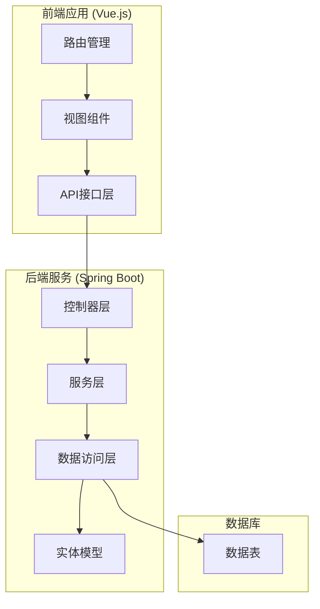
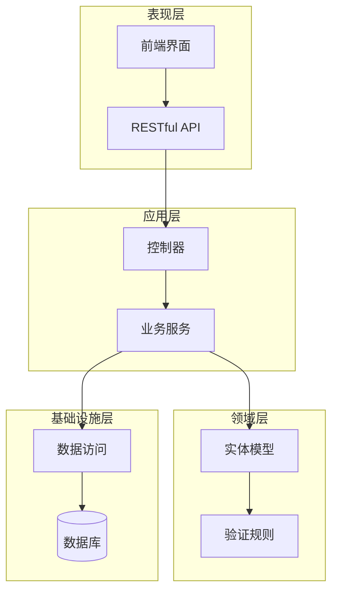
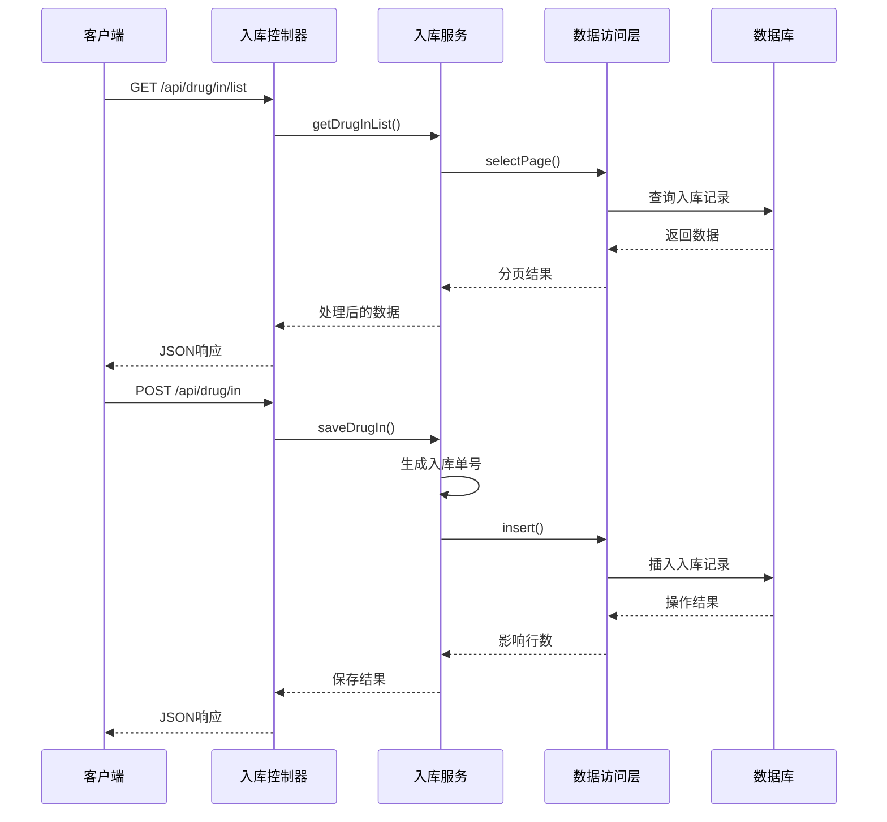
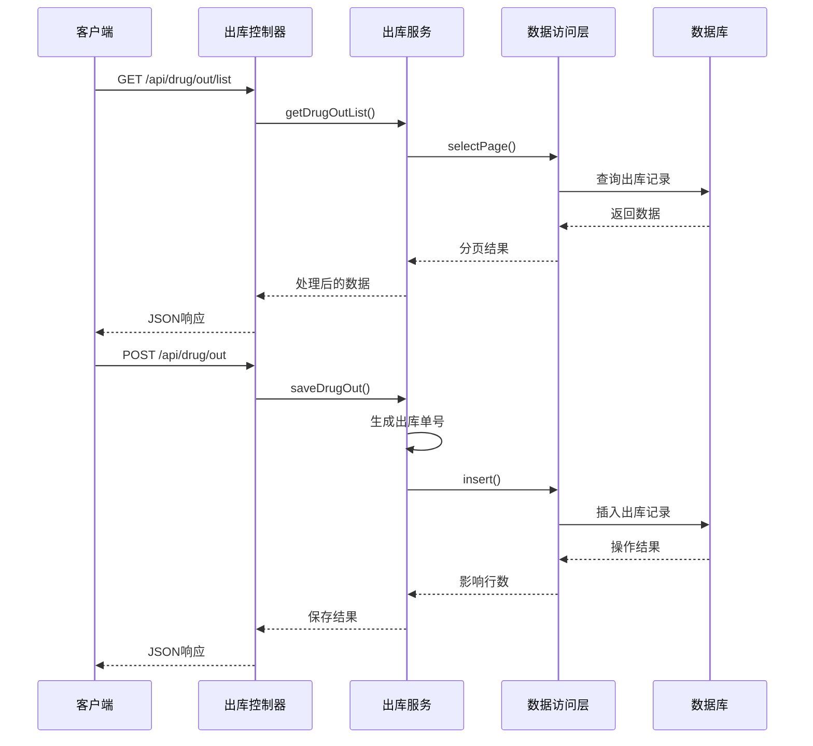
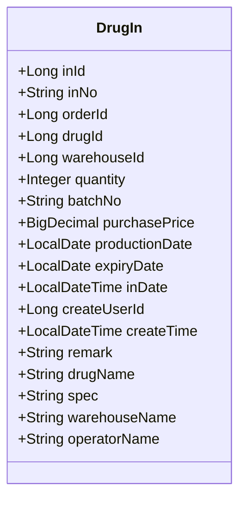
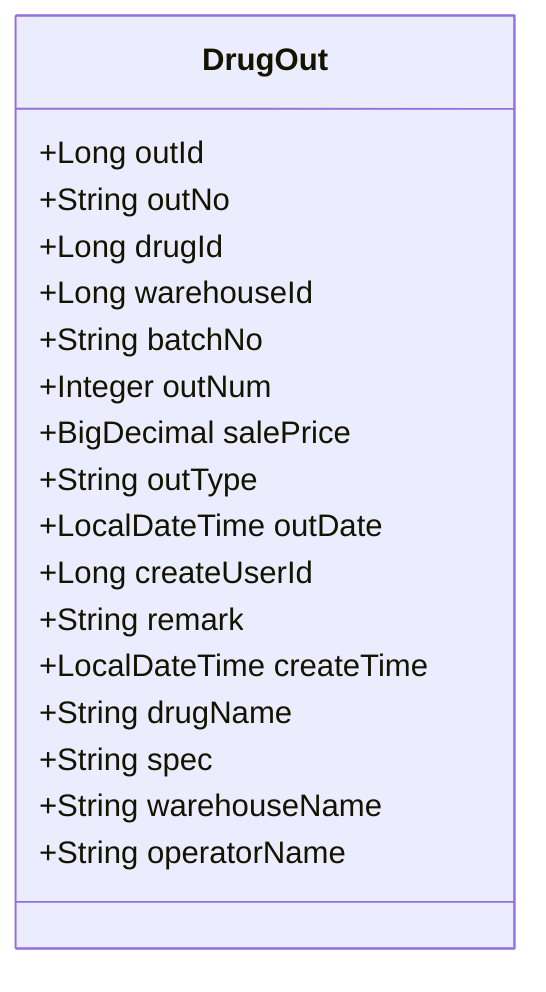
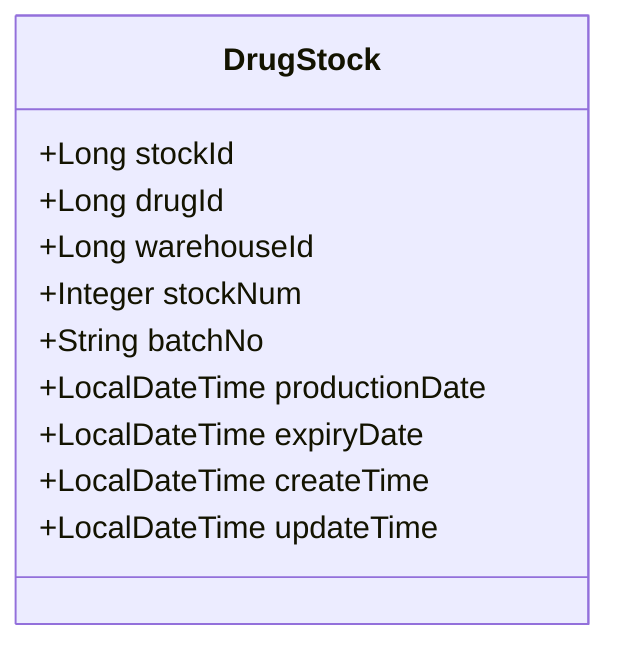
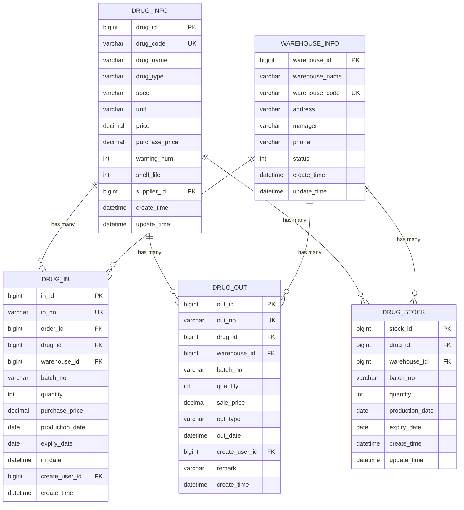
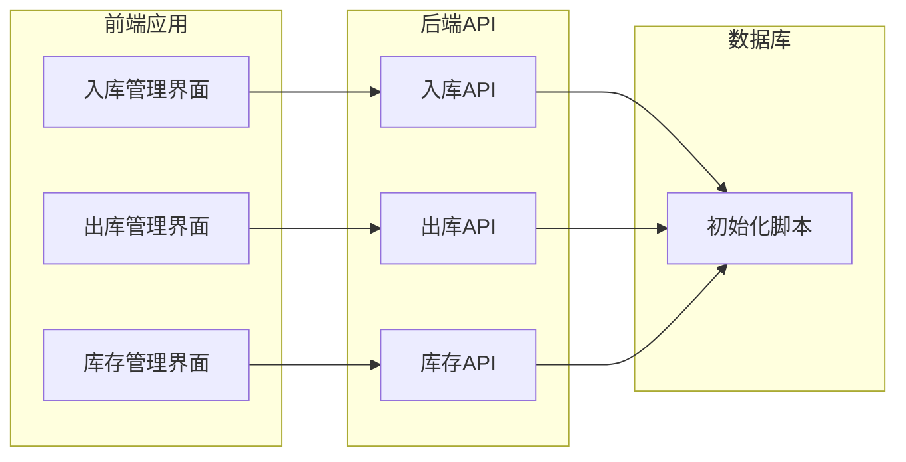
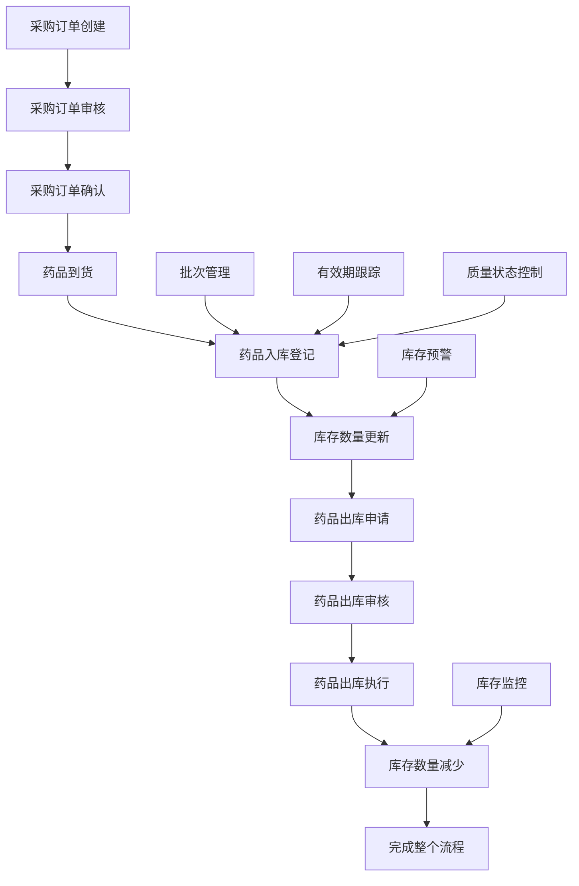

# 出入库管理API

<cite>
**本文档引用的文件**
- [DrugInController.java](file://src/main/java/com/hospital/drugmanagement/controller/DrugInController.java)
- [DrugOutController.java](file://src/main/java/com/hospital/drugmanagement/controller/DrugOutController.java)
- [DrugInServiceImpl.java](file://src/main/java/com/hospital/drugmanagement/service/impl/DrugInServiceImpl.java)
- [DrugOutServiceImpl.java](file://src/main/java/com/hospital/drugmanagement/service/impl/DrugOutServiceImpl.java)
- [IDrugInService.java](file://src/main/java/com/hospital/drugmanagement/service/IDrugInService.java)
- [IDrugOutService.java](file://src/main/java/com/hospital/drugmanagement/service/IDrugOutService.java)
- [DrugIn.java](file://src/main/java/com/hospital/drugmanagement/entity/DrugIn.java)
- [DrugOut.java](file://src/main/java/com/hospital/drugmanagement/entity/DrugOut.java)
- [DrugStock.java](file://src/main/java/com/hospital/drugmanagement/entity/DrugStock.java)
- [DrugInMapper.java](file://src/main/java/com/hospital/drugmanagement/mapper/DrugInMapper.java)
- [DrugOutMapper.java](file://src/main/java/com/hospital/drugmanagement/mapper/DrugOutMapper.java)
- [DrugStockMapper.java](file://src/main/java/com/hospital/drugmanagement/mapper/DrugStockMapper.java)
- [init.sql](file://src/main/resources/db/init.sql)
- [drugIn.js](file://drug-front/src/api/drugIn.js)
- [drugOut.js](file://drug-front/src/api/drugOut.js)
- [index.js](file://drug-front/src/router/index.js)
</cite>

## 目录
1. [简介](#简介)
2. [项目结构](#项目结构)
3. [核心组件](#核心组件)
4. [架构概览](#架构概览)
5. [详细组件分析](#详细组件分析)
6. [依赖关系分析](#依赖关系分析)
7. [性能考虑](#性能考虑)
8. [故障排除指南](#故障排除指南)
9. [结论](#结论)
10. [附录](#附录)

## 简介
本项目是一个基于Spring Boot的医院药品管理系统，专注于药品的出入库管理。系统提供了完整的药品入库和出库操作接口，支持多种入库来源（采购入库、退货入库、盘盈入库等）和出库去向（科室领用、患者发放、退货出库等）。系统实现了批次管理、有效期跟踪、质量状态控制等专业功能，并提供库存实时更新和库存预警触发机制。

## 项目结构
系统采用典型的三层架构设计，包含前端Vue.js应用和后端Spring Boot服务：

**图表来源**
- [DrugInController.java:12-14](file://src/main/java/com/hospital/drugmanagement/controller/DrugInController.java#L12-L14)
- [DrugOutController.java:11-13](file://src/main/java/com/hospital/drugmanagement/controller/DrugOutController.java#L11-L13)

**章节来源**
- [DrugInController.java:1-104](file://src/main/java/com/hospital/drugmanagement/controller/DrugInController.java#L1-L104)
- [DrugOutController.java:1-103](file://src/main/java/com/hospital/drugmanagement/controller/DrugOutController.java#L1-L103)

## 核心组件
系统的核心组件包括控制器、服务层、数据访问层和实体模型，形成了完整的MVC架构模式。

### 控制器层
- **DrugInController**: 负责药品入库相关的HTTP请求处理
- **DrugOutController**: 负责药品出库相关的HTTP请求处理

### 服务层
- **IDrugInService/DrugInServiceImpl**: 入库业务逻辑处理
- **IDrugOutService/DrugOutServiceImpl**: 出库业务逻辑处理

### 数据访问层
- **DrugInMapper**: 入库数据访问接口
- **DrugOutMapper**: 出库数据访问接口
- **DrugStockMapper**: 库存数据访问接口

### 实体模型
- **DrugIn**: 入库记录实体
- **DrugOut**: 出库记录实体
- **DrugStock**: 库存实体

**章节来源**
- [IDrugInService.java:1-11](file://src/main/java/com/hospital/drugmanagement/service/IDrugInService.java#L1-L11)
- [IDrugOutService.java:1-11](file://src/main/java/com/hospital/drugmanagement/service/IDrugOutService.java#L1-L11)
- [DrugInServiceImpl.java:27-27](file://src/main/java/com/hospital/drugmanagement/service/impl/DrugInServiceImpl.java#L27-L27)
- [DrugOutServiceImpl.java:27-27](file://src/main/java/com/hospital/drugmanagement/service/impl/DrugOutServiceImpl.java#L27-L27)

## 架构概览
系统采用分层架构设计，确保了关注点分离和代码的可维护性：

**图表来源**
- [DrugInController.java:12-18](file://src/main/java/com/hospital/drugmanagement/controller/DrugInController.java#L12-L18)
- [DrugOutController.java:14-17](file://src/main/java/com/hospital/drugmanagement/controller/DrugOutController.java#L14-L17)

系统架构特点：
- **分层清晰**: 表现层、应用层、领域层、基础设施层职责明确
- **依赖倒置**: 上层依赖于抽象而非具体实现
- **事务管理**: 使用Spring声明式事务管理
- **异常处理**: 统一的异常处理机制

## 详细组件分析

### 入库管理模块

#### 入库控制器 (DrugInController)
负责处理所有与药品入库相关的HTTP请求：

**图表来源**
- [DrugInController.java:23-45](file://src/main/java/com/hospital/drugmanagement/controller/DrugInController.java#L23-L45)
- [DrugInServiceImpl.java:41-90](file://src/main/java/com/hospital/drugmanagement/service/impl/DrugInServiceImpl.java#L41-L90)

#### 入库服务实现 (DrugInServiceImpl)
实现具体的入库业务逻辑：

**章节来源**
- [DrugInController.java:1-104](file://src/main/java/com/hospital/drugmanagement/controller/DrugInController.java#L1-L104)
- [DrugInServiceImpl.java:1-116](file://src/main/java/com/hospital/drugmanagement/service/impl/DrugInServiceImpl.java#L1-L116)

### 出库管理模块

#### 出库控制器 (DrugOutController)
负责处理所有与药品出库相关的HTTP请求：

**图表来源**
- [DrugOutController.java:22-44](file://src/main/java/com/hospital/drugmanagement/controller/DrugOutController.java#L22-L44)
- [DrugOutServiceImpl.java:41-90](file://src/main/java/com/hospital/drugmanagement/service/impl/DrugOutServiceImpl.java#L41-L90)

#### 出库服务实现 (DrugOutServiceImpl)
实现具体的出库业务逻辑：

**章节来源**
- [DrugOutController.java:1-103](file://src/main/java/com/hospital/drugmanagement/controller/DrugOutController.java#L1-L103)
- [DrugOutServiceImpl.java:1-116](file://src/main/java/com/hospital/drugmanagement/service/impl/DrugOutServiceImpl.java#L1-L116)

### 数据模型设计

#### 入库实体 (DrugIn)

**图表来源**
- [DrugIn.java:15-62](file://src/main/java/com/hospital/drugmanagement/entity/DrugIn.java#L15-L62)

#### 出库实体 (DrugOut)

**图表来源**
- [DrugOut.java:14-58](file://src/main/java/com/hospital/drugmanagement/entity/DrugOut.java#L14-L58)

#### 库存实体 (DrugStock)

**图表来源**
- [DrugStock.java:14-39](file://src/main/java/com/hospital/drugmanagement/entity/DrugStock.java#L14-L39)

**章节来源**
- [DrugIn.java:1-62](file://src/main/java/com/hospital/drugmanagement/entity/DrugIn.java#L1-L62)
- [DrugOut.java:1-58](file://src/main/java/com/hospital/drugmanagement/entity/DrugOut.java#L1-L58)
- [DrugStock.java:1-39](file://src/main/java/com/hospital/drugmanagement/entity/DrugStock.java#L1-L39)

## 依赖关系分析

### 数据库表结构关系
系统采用关系型数据库设计，各表之间存在明确的外键约束关系：

**图表来源**
- [init.sql:60-194](file://src/main/resources/db/init.sql#L60-L194)

### 前后端交互关系

**图表来源**
- [drugIn.js:1-36](file://drug-front/src/api/drugIn.js#L1-L36)
- [drugOut.js:1-36](file://drug-front/src/api/drugOut.js#L1-L36)
- [index.js:52-62](file://drug-front/src/router/index.js#L52-L62)

**章节来源**
- [init.sql:1-312](file://src/main/resources/db/init.sql#L1-L312)
- [drugIn.js:1-36](file://drug-front/src/api/drugIn.js#L1-L36)
- [drugOut.js:1-36](file://drug-front/src/api/drugOut.js#L1-L36)

## 性能考虑
系统在设计时充分考虑了性能优化和扩展性：

### 数据库性能优化
- **索引设计**: 在关键查询字段上建立索引，如drug_id、warehouse_id等
- **分页查询**: 支持大数据量的分页查询，避免全表扫描
- **批量操作**: 提供批量插入和更新操作支持

### 缓存策略
- **查询缓存**: 对常用的查询结果进行缓存
- **会话管理**: 使用Spring Session管理用户会话状态

### 并发控制
- **事务管理**: 使用Spring声明式事务确保数据一致性
- **乐观锁**: 在需要的地方使用版本号控制并发更新

## 故障排除指南

### 常见问题及解决方案

#### API调用失败
**问题症状**: HTTP 500错误或响应超时
**可能原因**:
- 数据库连接异常
- 参数验证失败
- 业务逻辑异常

**解决步骤**:
1. 检查数据库连接配置
2. 验证请求参数格式
3. 查看服务器日志获取详细错误信息

#### 数据不一致
**问题症状**: 入库数量与库存数量不符
**可能原因**:
- 事务未正确提交
- 并发更新冲突
- 业务逻辑错误

**解决步骤**:
1. 检查事务边界设置
2. 实施适当的锁机制
3. 验证业务逻辑完整性

#### 性能问题
**问题症状**: 查询响应缓慢
**可能原因**:
- 缺少必要的数据库索引
- 查询语句效率低下
- 数据量过大

**解决步骤**:
1. 分析SQL执行计划
2. 添加适当的索引
3. 优化查询逻辑

**章节来源**
- [DrugInController.java:38-43](file://src/main/java/com/hospital/drugmanagement/controller/DrugInController.java#L38-L43)
- [DrugOutController.java:37-42](file://src/main/java/com/hospital/drugmanagement/controller/DrugOutController.java#L37-L42)

## 结论
本药品出入库管理系统提供了完整的药品生命周期管理功能，包括：

### 核心优势
- **完整的业务覆盖**: 涵盖从采购到入库再到出库的全流程
- **专业的功能特性**: 支持批次管理、有效期跟踪、质量状态控制
- **良好的扩展性**: 清晰的架构设计便于功能扩展和维护
- **完善的异常处理**: 统一的异常处理机制确保系统稳定性

### 技术亮点
- **分层架构**: 清晰的职责分离和依赖管理
- **数据一致性**: 基于事务的业务逻辑保证
- **性能优化**: 合理的数据库设计和查询优化
- **前后端分离**: 现代化的开发模式提升开发效率

该系统为医院药品管理提供了可靠的技术支撑，能够满足医疗机构对药品管理的严格要求。

## 附录

### API接口规范

#### 入库管理接口
| 接口 | 方法 | 路径 | 功能描述 |
|------|------|------|----------|
| 入库列表 | GET | /api/drug/in/list | 获取入库单列表 |
| 入库详情 | GET | /api/drug/in/{id} | 获取入库单详情 |
| 新增入库 | POST | /api/drug/in | 新增入库单 |
| 删除入库 | DELETE | /api/drug/in/{id} | 删除入库单 |

#### 出库管理接口
| 接口 | 方法 | 路径 | 功能描述 |
|------|------|------|----------|
| 出库列表 | GET | /api/drug/out/list | 获取出库单列表 |
| 出库详情 | GET | /api/drug/out/{id} | 获取出库单详情 |
| 新增出库 | POST | /api/drug/out | 新增出库单 |
| 删除出库 | DELETE | /api/drug/out/{id} | 删除出库单 |

### 数据模型字段说明

#### 入库记录字段
- **inNo**: 入库单号，自动生成
- **orderId**: 关联采购单ID
- **drugId**: 药品ID
- **warehouseId**: 仓库ID
- **batchNo**: 批次号
- **quantity**: 入库数量
- **purchasePrice**: 入库单价
- **productionDate**: 生产日期
- **expiryDate**: 有效期
- **inDate**: 入库时间

#### 出库记录字段
- **outNo**: 出库单号，自动生成
- **drugId**: 药品ID
- **warehouseId**: 仓库ID
- **batchNo**: 批号
- **outNum**: 出库数量
- **salePrice**: 出库单价
- **outType**: 出库类型（领用/销售/报损）
- **outDate**: 出库时间

### 业务流程示例

#### 采购到入库到出库完整流程

**图表来源**
- [init.sql:127-194](file://src/main/resources/db/init.sql#L127-L194)