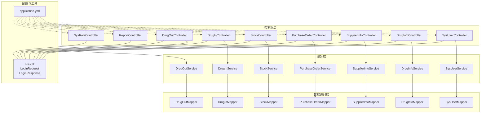
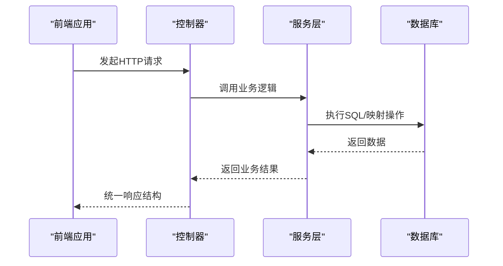
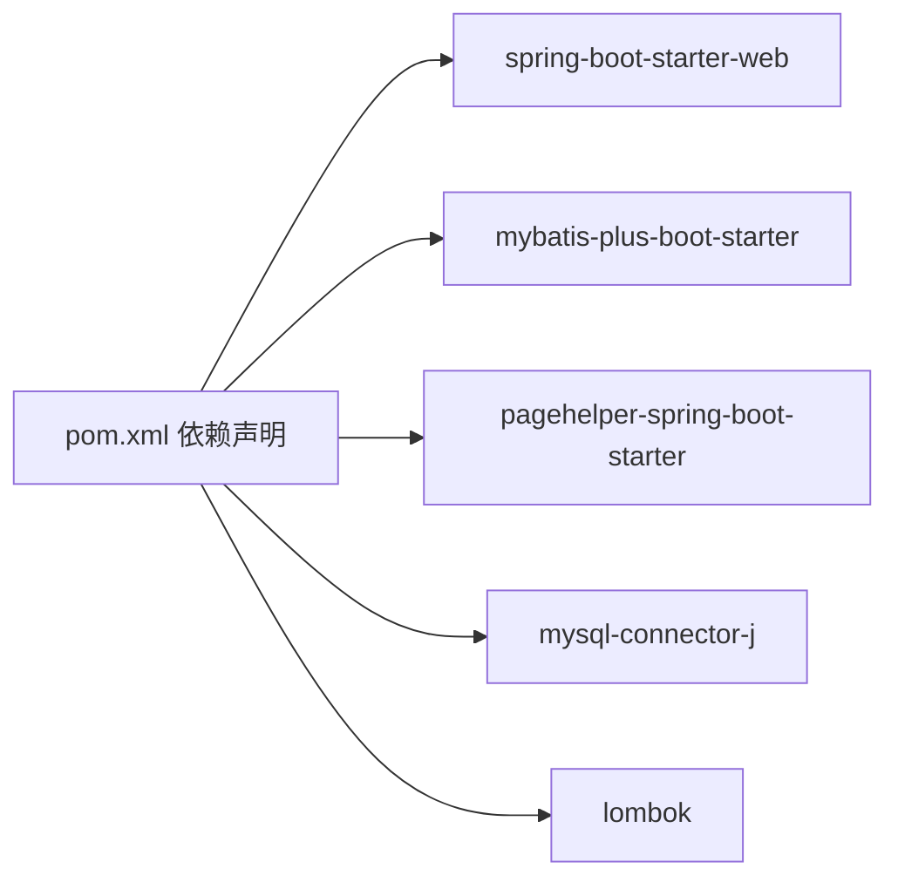

# 后端API文档

<cite>
**本文引用的文件**
- [Result.java](file://src/main/java/com/hospital/drugmanagement/dto/Result.java)
- [LoginRequest.java](file://src/main/java/com/hospital/drugmanagement/dto/LoginRequest.java)
- [LoginResponse.java](file://src/main/java/com/hospital/drugmanagement/dto/LoginResponse.java)
- [SysUserController.java](file://src/main/java/com/hospital/drugmanagement/controller/SysUserController.java)
- [DrugInfoController.java](file://src/main/java/com/hospital/drugmanagement/controller/DrugInfoController.java)
- [SupplierInfoController.java](file://src/main/java/com/hospital/drugmanagement/controller/SupplierInfoController.java)
- [PurchaseOrderController.java](file://src/main/java/com/hospital/drugmanagement/controller/PurchaseOrderController.java)
- [StockController.java](file://src/main/java/com/hospital/drugmanagement/controller/StockController.java)
- [DrugInController.java](file://src/main/java/com/hospital/drugmanagement/controller/DrugInController.java)
- [DrugOutController.java](file://src/main/java/com/hospital/drugmanagement/controller/DrugOutController.java)
- [ReportController.java](file://src/main/java/com/hospital/drugmanagement/controller/ReportController.java)
- [SysRoleController.java](file://src/main/java/com/hospital/drugmanagement/controller/SysRoleController.java)
- [application.yml](file://src/main/resources/application.yml)
- [pom.xml](file://pom.xml)
- [request.js](file://drug-front/src/utils/request.js)
- [user.js](file://drug-front/src/api/user.js)
- [drug.js](file://drug-front/src/api/drug.js)
</cite>

## 目录
1. [简介](#简介)
2. [项目结构](#项目结构)
3. [核心组件](#核心组件)
4. [架构总览](#架构总览)
5. [详细组件分析](#详细组件分析)
6. [依赖分析](#依赖分析)
7. [性能考虑](#性能考虑)
8. [故障排查指南](#故障排查指南)
9. [结论](#结论)
10. [附录](#附录)

## 简介
本项目为一个基于Spring Boot与MyBatis-Plus的药品管理系统后端，提供统一的RESTful API接口，覆盖用户管理、药品管理、供应商管理、采购管理、库存管理、出入库管理、报表统计与系统管理等模块。接口采用统一响应结构，支持基础认证与简单权限校验，前端通过Axios封装进行调用。

## 项目结构
后端采用标准的分层架构：
- 控制器层（Controller）：暴露REST API
- 服务层（Service）：业务逻辑编排
- 数据访问层（Mapper/Repository）：持久化操作
- 实体与DTO：数据传输对象与领域模型
- 配置：数据库连接、MyBatis-Plus、跨域等

图表来源
- [SysUserController.java:26-421](file://src/main/java/com/hospital/drugmanagement/controller/SysUserController.java#L26-L421)
- [DrugInfoController.java:14-169](file://src/main/java/com/hospital/drugmanagement/controller/DrugInfoController.java#L14-L169)
- [SupplierInfoController.java:12-176](file://src/main/java/com/hospital/drugmanagement/controller/SupplierInfoController.java#L12-L176)
- [PurchaseOrderController.java:26-396](file://src/main/java/com/hospital/drugmanagement/controller/PurchaseOrderController.java#L26-L396)
- [StockController.java:10-114](file://src/main/java/com/hospital/drugmanagement/controller/StockController.java#L10-L114)
- [DrugInController.java:12-104](file://src/main/java/com/hospital/drugmanagement/controller/DrugInController.java#L12-L104)
- [DrugOutController.java:11-103](file://src/main/java/com/hospital/drugmanagement/controller/DrugOutController.java#L11-L103)
- [ReportController.java:10-101](file://src/main/java/com/hospital/drugmanagement/controller/ReportController.java#L10-L101)
- [SysRoleController.java:20-274](file://src/main/java/com/hospital/drugmanagement/controller/SysRoleController.java#L20-L274)
- [application.yml:1-24](file://src/main/resources/application.yml#L1-L24)

章节来源
- [application.yml:1-24](file://src/main/resources/application.yml#L1-L24)
- [pom.xml:32-84](file://pom.xml#L32-L84)

## 核心组件
- 统一响应结构：Result<T> 提供成功与失败两类响应模板，便于前后端约定一致的数据格式。
- 登录与鉴权：LoginRequest/LoginResponse 定义登录请求与响应；控制器中通过Authorization头携带令牌进行简单鉴权。
- 基础认证：前端通过请求拦截器自动附加Authorization头，后端解析并校验。

章节来源
- [Result.java:9-98](file://src/main/java/com/hospital/drugmanagement/dto/Result.java#L9-L98)
- [LoginRequest.java:9-36](file://src/main/java/com/hospital/drugmanagement/dto/LoginRequest.java#L9-L36)
- [LoginResponse.java:12-64](file://src/main/java/com/hospital/drugmanagement/dto/LoginResponse.java#L12-L64)
- [request.js:6-19](file://drug-front/src/utils/request.js#L6-L19)

## 架构总览
后端以Spring MVC控制器为核心，接收HTTP请求，调用服务层完成业务处理，再通过统一响应结构返回结果。MyBatis-Plus负责数据库交互，application.yml提供数据源与端口配置。

图表来源
- [SysUserController.java:43-68](file://src/main/java/com/hospital/drugmanagement/controller/SysUserController.java#L43-L68)
- [application.yml:14-16](file://src/main/resources/application.yml#L14-L16)

## 详细组件分析

### 用户管理API
- 基础路径：/api/user
- 功能：登录、获取当前用户信息、用户列表查询、用户详情、新增、修改、删除、重置密码

接口定义
- POST /api/user/login
  - 请求体：LoginRequest
  - 响应：Map<String,Object>（非Result<T>，但结构与统一响应一致）
  - 成功：code=200，msg="登录成功"，data=LoginResponse
  - 失败：根据异常类型返回400/401/500
- GET /api/user/current
  - 请求头：Authorization: Bearer <token>
  - 响应：Map<String,Object>，包含userInfo、roles、menus
  - 未授权：code=401
- GET /api/user/list
  - 查询参数：pageNum、pageSize、username、realName、roleId
  - 响应：Map<String,Object>，data为用户列表，total为总数
- GET /api/user/{id}
  - 响应：Map<String,Object>，data为SysUser
- POST /api/user
  - 请求体：SysUser
  - 校验：用户名、手机号、邮箱唯一性；密码MD5加盐存储
  - 响应：Map<String,Object>
- PUT /api/user
  - 请求体：SysUser（更新）
  - 校验：排除当前用户后的唯一性；密码MD5加盐存储
  - 响应：Map<String,Object>
- DELETE /api/user/{id}
  - 响应：Map<String,Object>
- PUT /api/user/resetPassword
  - 请求体：{userId, password}
  - 响应：Map<String,Object>

章节来源
- [SysUserController.java:43-421](file://src/main/java/com/hospital/drugmanagement/controller/SysUserController.java#L43-L421)
- [LoginRequest.java:9-36](file://src/main/java/com/hospital/drugmanagement/dto/LoginRequest.java#L9-L36)
- [LoginResponse.java:12-64](file://src/main/java/com/hospital/drugmanagement/dto/LoginResponse.java#L12-L64)

### 药品管理API
- 基础路径：/api/drug
- 功能：药品列表查询、详情、新增、修改、删除

接口定义
- GET /api/drug/list
  - 查询参数：page、size、drugName、drugCode、drugType
  - 响应：Map<String,Object>，data为分页记录，total为总数
- GET /api/drug/{id}
  - 响应：Map<String,Object>
- POST /api/drug
  - 请求体：DrugInfo
  - 校验：drugCode、drugName唯一性
  - 响应：Map<String,Object>
- PUT /api/drug
  - 请求体：DrugInfo（更新）
  - 校验：排除当前记录后的唯一性
  - 响应：Map<String,Object>
- DELETE /api/drug/{id}
  - 响应：Map<String,Object>

章节来源
- [DrugInfoController.java:22-169](file://src/main/java/com/hospital/drugmanagement/controller/DrugInfoController.java#L22-L169)

### 供应商管理API
- 基础路径：/api/supplier
- 功能：供应商列表查询、详情、新增、修改、删除

接口定义
- GET /api/supplier/list
  - 查询参数：supplierName、contactPerson
  - 响应：Map<String,Object>，data为列表，total为总数
- GET /api/supplier/{id}
  - 响应：Map<String,Object>
- POST /api/supplier
  - 请求体：SupplierInfo
  - 校验：供应商名称、编码、营业执照号唯一性
  - 响应：Map<String,Object>
- PUT /api/supplier
  - 请求体：SupplierInfo（更新）
  - 校验：排除当前记录后的唯一性
  - 响应：Map<String,Object>
- DELETE /api/supplier/{id}
  - 响应：Map<String,Object>

章节来源
- [SupplierInfoController.java:20-176](file://src/main/java/com/hospital/drugmanagement/controller/SupplierInfoController.java#L20-L176)

### 采购管理API
- 基础路径：/api/purchase/order
- 功能：采购单列表、详情、新增、修改、删除、审核、作废

接口定义
- GET /api/purchase/order/list
  - 查询参数：orderNo、supplierId、status
  - 响应：Map<String,Object>，data为包含供应商名称的订单列表
- GET /api/purchase/order/{id}
  - 响应：Map<String,Object>，data包含订单、明细、审核记录
- POST /api/purchase/order
  - 请求体：Map<String,Object>，包含orderNo、supplierId、orderDate、status、remark、totalAmount、items
  - 校验：orderNo唯一性；保存主单与明细
  - 响应：Map<String,Object>
- PUT /api/purchase/order
  - 请求体：PurchaseOrder（更新）
  - 校验：排除当前订单后的唯一性
  - 响应：Map<String,Object>
- DELETE /api/purchase/order/{id}
  - 响应：Map<String,Object>
- POST /api/purchase/order/audit/{id}
  - 请求体：{passed, remark}
  - 请求头：Authorization: Bearer <token>
  - 权限：ADMIN或AUDITOR角色
  - 响应：Map<String,Object>
- POST /api/purchase/order/cancel/{id}
  - 请求体：{remark}
  - 校验：仅允许初始或已审核状态作废
  - 响应：Map<String,Object>

章节来源
- [PurchaseOrderController.java:52-396](file://src/main/java/com/hospital/drugmanagement/controller/PurchaseOrderController.java#L52-L396)

### 库存管理API
- 基础路径：/api/stock
- 功能：库存列表、库存详情、库存预警列表、库存盘点

接口定义
- GET /api/stock/list
  - 查询参数：page、size、drugName、drugCode、warehouseId、warning=false
  - 响应：Map<String,Object>，data为分页记录，total为总数
- GET /api/stock/{id}
  - 响应：Map<String,Object>
- GET /api/stock/warning/list
  - 查询参数：page、size、drugName、drugCode、warehouseId
  - 响应：Map<String,Object>
- POST /api/stock/check
  - 请求体：{warehouseId, range}
  - 响应：Map<String,Object>

章节来源
- [StockController.java:18-114](file://src/main/java/com/hospital/drugmanagement/controller/StockController.java#L18-L114)

### 出入库管理API
- 入库单
  - 基础路径：/api/drug/in
  - GET /list：查询入库单列表（分页）
  - GET /{id}：查询入库单详情
  - POST：新增入库单
  - DELETE /{id}：删除入库单
- 出库单
  - 基础路径：/api/drug/out
  - GET /list：查询出库单列表（分页）
  - GET /{id}：查询出库单详情
  - POST：新增出库单
  - DELETE /{id}：删除出库单

章节来源
- [DrugInController.java:20-104](file://src/main/java/com/hospital/drugmanagement/controller/DrugInController.java#L20-L104)
- [DrugOutController.java:19-103](file://src/main/java/com/hospital/drugmanagement/controller/DrugOutController.java#L19-L103)

### 报表统计API
- 基础路径：/api/report
- GET /report/purchase?type=month：采购统计
- GET /report/inout?startDate=&endDate=：出入库统计
- GET /report/stock：库存统计
- GET /report/finance?type=month：财务统计

章节来源
- [ReportController.java:18-101](file://src/main/java/com/hospital/drugmanagement/controller/ReportController.java#L18-L101)

### 系统管理API
- 角色管理
  - 基础路径：/api/role
  - GET /list：角色列表
  - GET /{id}：角色详情
  - POST：新增角色（校验角色名与编码唯一性）
  - PUT：修改角色
  - DELETE /{id}：删除角色
  - GET /menus：获取所有菜单
  - GET /menus/{roleId}：按角色获取菜单ID列表
  - POST /assignPerms：分配权限（roleId, permIds）
- 用户管理（同上）

章节来源
- [SysRoleController.java:34-274](file://src/main/java/com/hospital/drugmanagement/controller/SysRoleController.java#L34-L274)

## 依赖分析
- Spring Boot Web：提供Web容器与MVC能力
- MyBatis-Plus：简化数据库操作
- PageHelper：分页支持
- Lombok：减少样板代码
- MySQL Connector：数据库驱动

图表来源
- [pom.xml:32-84](file://pom.xml#L32-L84)

章节来源
- [pom.xml:32-84](file://pom.xml#L32-L84)

## 性能考虑
- 分页查询：各列表接口均支持分页参数，建议在大数据量场景下合理设置page与size。
- 缓存与日志：MyBatis-Plus配置开启下划线转驼峰命名，便于字段映射；生产环境可结合Redis做热点数据缓存。
- 数据库连接：确保连接池参数与并发负载匹配，避免慢查询影响整体性能。

## 故障排查指南
- 统一响应结构
  - 成功：code=200，msg="success"，data为具体数据
  - 失败：根据异常类型返回400/401/403/404/500
- 常见问题
  - 未授权：检查Authorization头是否正确传递
  - 参数校验失败：检查必填字段与唯一性约束
  - 数据库异常：查看MyBatis日志与数据库连接配置

章节来源
- [Result.java:50-98](file://src/main/java/com/hospital/drugmanagement/dto/Result.java#L50-L98)
- [application.yml:19-24](file://src/main/resources/application.yml#L19-L24)

## 结论
本项目提供了完整的药品管理系统后端API，采用统一响应结构与基础认证机制，覆盖业务核心流程。建议后续引入JWT、细粒度权限控制、接口版本化与文档生成工具，以提升安全性与可维护性。

## 附录

### 统一响应格式说明
- 成功响应：code=200，msg="success"，data为业务数据
- 错误响应：code为错误码（如400/401/403/404/500），msg为错误描述，data=null

章节来源
- [Result.java:50-98](file://src/main/java/com/hospital/drugmanagement/dto/Result.java#L50-L98)

### 认证与权限
- 认证方式：Authorization头携带令牌（Bearer <token>）
- 权限控制：采购审核接口要求ADMIN或AUDITOR角色
- 前端集成：Axios拦截器自动附加Authorization头，响应拦截器处理401跳转登录

章节来源
- [SysUserController.java:73-147](file://src/main/java/com/hospital/drugmanagement/controller/SysUserController.java#L73-L147)
- [PurchaseOrderController.java:278-364](file://src/main/java/com/hospital/drugmanagement/controller/PurchaseOrderController.java#L278-L364)
- [request.js:12-25](file://drug-front/src/utils/request.js#L12-L25)

### API调用示例（概念性说明）
- curl示例（登录）
  - curl -X POST http://localhost:8081/api/user/login -H "Content-Type: application/json" -d '{"username":"admin","password":"123456"}'
- Postman配置
  - Method: POST
  - URL: http://localhost:8081/api/user/login
  - Body: raw JSON
- JavaScript（基于前端封装）
  - 参考 [user.js:55-62](file://drug-front/src/api/user.js#L55-L62)，通过封装函数发起请求

章节来源
- [user.js:55-62](file://drug-front/src/api/user.js#L55-L62)
- [request.js:6-19](file://drug-front/src/utils/request.js#L6-L19)

### 接口版本管理与兼容性
- 版本策略：当前未显式启用版本前缀；建议在URL增加/v1、/v2等版本段落
- 向后兼容：新增字段采用可选策略，避免破坏既有客户端
- 废弃策略：对不再维护的接口提供迁移指引与过渡期提示

[本节为通用实践建议，无需特定文件引用]