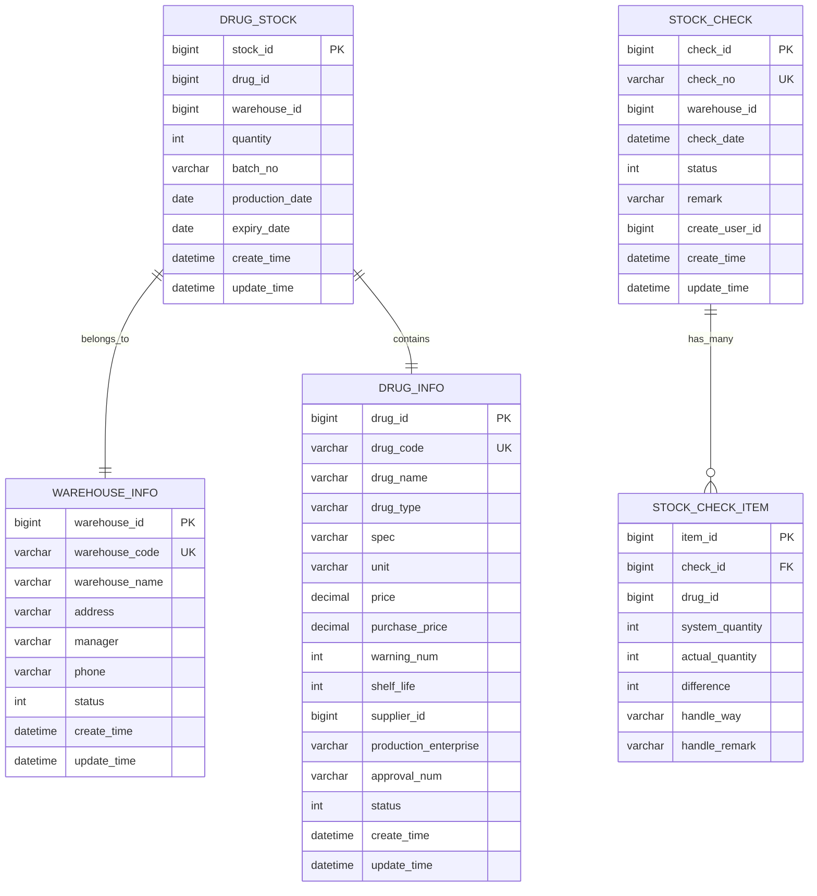
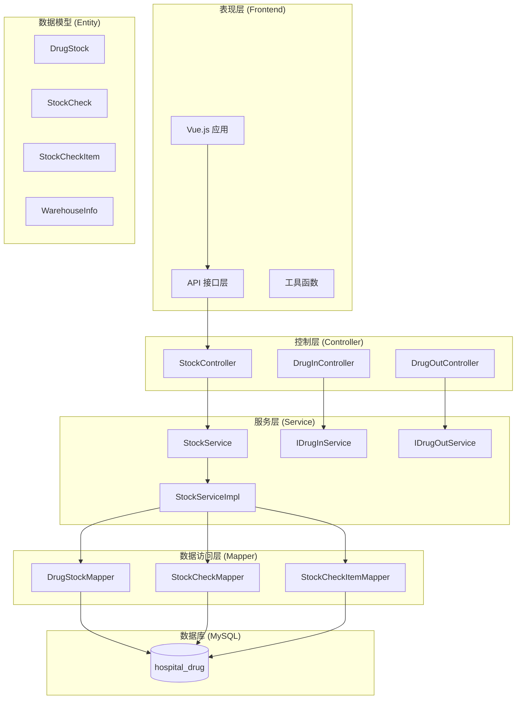
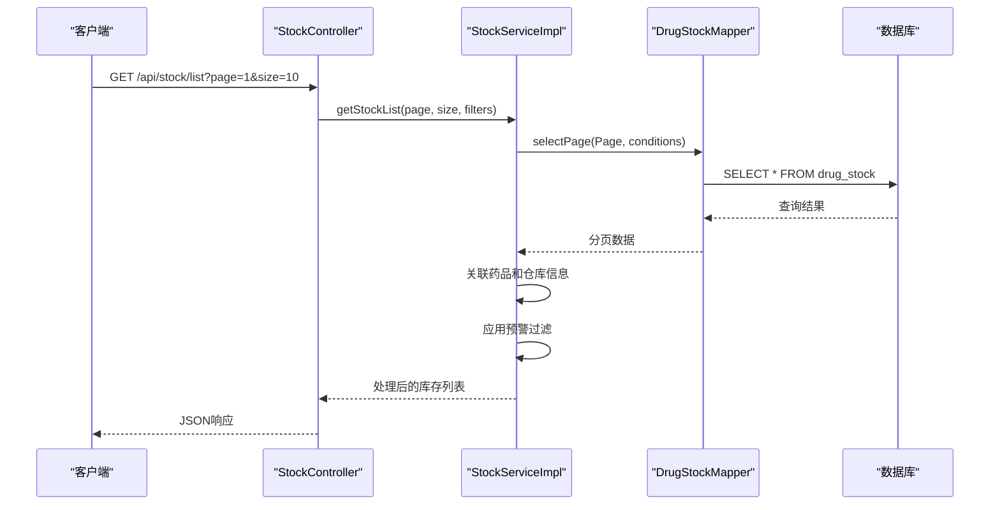
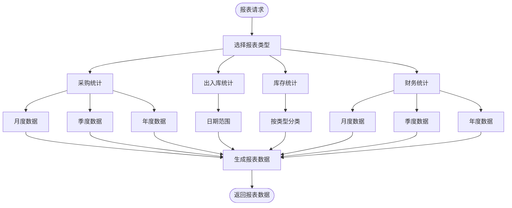
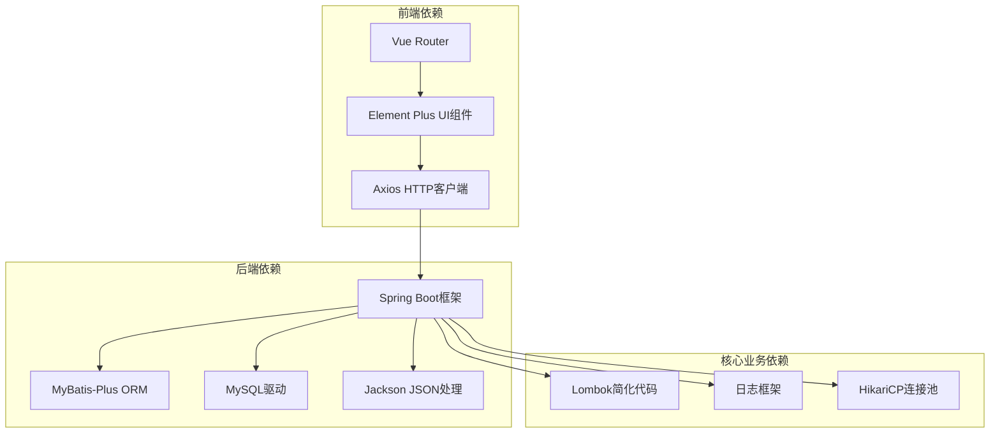
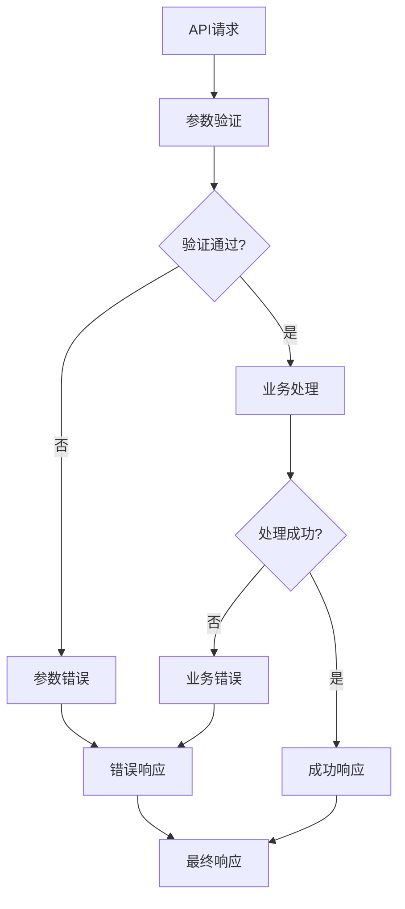

# 库存管理API

<cite>
**本文档引用的文件**
- [StockController.java](file://src/main/java/com/hospital/drugmanagement/controller/StockController.java)
- [StockService.java](file://src/main/java/com/hospital/drugmanagement/service/StockService.java)
- [StockServiceImpl.java](file://src/main/java/com/hospital/drugmanagement/service/impl/StockServiceImpl.java)
- [DrugStock.java](file://src/main/java/com/hospital/drugmanagement/entity/DrugStock.java)
- [StockCheck.java](file://src/main/java/com/hospital/drugmanagement/entity/StockCheck.java)
- [StockCheckItem.java](file://src/main/java/com/hospital/drugmanagement/entity/StockCheckItem.java)
- [DrugStockMapper.java](file://src/main/java/com/hospital/drugmanagement/mapper/DrugStockMapper.java)
- [StockCheckMapper.java](file://src/main/java/com/hospital/drugmanagement/mapper/StockCheckMapper.java)
- [StockCheckItemMapper.java](file://src/main/java/com/hospital/drugmanagement/mapper/StockCheckItemMapper.java)
- [Result.java](file://src/main/java/com/hospital/drugmanagement/dto/Result.java)
- [stock.js](file://drug-front/src/api/stock.js)
- [request.js](file://drug-front/src/utils/request.js)
- [application.yml](file://src/main/resources/application.yml)
- [hospital_drug.sql](file://hospital_drug.sql)
- [DrugInController.java](file://src/main/java/com/hospital/drugmanagement/controller/DrugInController.java)
- [DrugOutController.java](file://src/main/java/com/hospital/drugmanagement/controller/DrugOutController.java)
- [WarehouseInfo.java](file://src/main/java/com/hospital/drugmanagement/entity/WarehouseInfo.java)
</cite>

## 目录
1. [简介](#简介)
2. [项目结构](#项目结构)
3. [核心组件](#核心组件)
4. [架构概览](#架构概览)
5. [详细组件分析](#详细组件分析)
6. [依赖关系分析](#依赖关系分析)
7. [性能考虑](#性能考虑)
8. [故障排除指南](#故障排除指南)
9. [结论](#结论)
10. [附录](#附录)

## 简介

本项目是一个基于Spring Boot的药品库存管理系统，专注于提供完整的库存管理API接口。系统实现了药品库存监控、库存预警、库存调整、库存盘点、批次管理、保质期跟踪等核心功能。

该系统采用前后端分离架构，后端使用Spring Boot + MyBatis-Plus框架，前端使用Vue.js + Element Plus技术栈。数据库采用MySQL，支持完整的药品库存生命周期管理。

## 项目结构

项目采用标准的Maven多模块结构，主要包含以下核心目录：

```mermaid
graph TB
subgraph "后端服务 (src/main/java)"
A[controller/] 控制器层
B[service/] 业务服务层
C[mapper/] 数据访问层
D[entity/] 实体模型层
E[dto/] 数据传输对象
F[config/] 配置类
end
subgraph "前端应用 (drug-front)"
G[src/api/] API接口定义
H[src/views/] 页面视图
I[src/utils/] 工具函数
J[src/router/] 路由配置
end
subgraph "资源文件"
K[src/main/resources/] 配置文件
L[hospital_drug.sql] 数据库脚本
end
A --> B
B --> C
C --> D
G --> A
I --> G
```

**图表来源**
- [StockController.java:1-114](file://src/main/java/com/hospital/drugmanagement/controller/StockController.java#L1-L114)
- [StockServiceImpl.java:1-241](file://src/main/java/com/hospital/drugmanagement/service/impl/StockServiceImpl.java#L1-L241)
- [stock.js:1-37](file://drug-front/src/api/stock.js#L1-L37)

**章节来源**
- [application.yml:1-24](file://src/main/resources/application.yml#L1-L24)
- [hospital_drug.sql:1-307](file://hospital_drug.sql#L1-L307)

## 核心组件

### 库存管理核心接口

系统提供了完整的库存管理API接口，主要包括：

1. **库存查询接口** - 支持分页查询、条件筛选、预警查询
2. **库存预警接口** - 实时监控库存状态，触发预警机制
3. **库存盘点接口** - 支持全仓盘点和指定范围盘点
4. **报表统计接口** - 提供采购、出入库、库存、财务统计报表

### 数据模型设计

系统采用标准化的数据模型设计，确保数据完整性和一致性：



**图表来源**
- [DrugStock.java:1-39](file://src/main/java/com/hospital/drugmanagement/entity/DrugStock.java#L1-L39)
- [StockCheck.java:1-40](file://src/main/java/com/hospital/drugmanagement/entity/StockCheck.java#L1-L40)
- [StockCheckItem.java:1-31](file://src/main/java/com/hospital/drugmanagement/entity/StockCheckItem.java#L1-L31)
- [WarehouseInfo.java:1-37](file://src/main/java/com/hospital/drugmanagement/entity/WarehouseInfo.java#L1-L37)

**章节来源**
- [DrugStock.java:1-39](file://src/main/java/com/hospital/drugmanagement/entity/DrugStock.java#L1-L39)
- [StockCheck.java:1-40](file://src/main/java/com/hospital/drugmanagement/entity/StockCheck.java#L1-L40)
- [StockCheckItem.java:1-31](file://src/main/java/com/hospital/drugmanagement/entity/StockCheckItem.java#L1-L31)

## 架构概览

系统采用经典的三层架构模式，结合RESTful API设计原则：



**图表来源**
- [StockController.java:1-114](file://src/main/java/com/hospital/drugmanagement/controller/StockController.java#L1-L114)
- [StockServiceImpl.java:1-241](file://src/main/java/com/hospital/drugmanagement/service/impl/StockServiceImpl.java#L1-L241)
- [DrugStockMapper.java:1-8](file://src/main/java/com/hospital/drugmanagement/mapper/DrugStockMapper.java#L1-L8)

## 详细组件分析

### 库存控制器 (StockController)

库存控制器负责处理所有与库存相关的HTTP请求，提供统一的API接口：

#### 核心接口定义

| 接口 | 方法 | 路径 | 功能描述 |
|------|------|------|----------|
| 获取库存列表 | GET | `/api/stock/list` | 分页查询库存信息，支持多条件筛选 |
| 获取库存详情 | GET | `/api/stock/{id}` | 查询指定库存详情 |
| 库存预警列表 | GET | `/api/stock/warning/list` | 查询库存预警信息 |
| 库存盘点 | POST | `/api/stock/check` | 创建库存盘点单 |

#### 接口参数说明

**库存列表查询参数**：
- `page`: 页码，默认1
- `size`: 每页条数，默认10
- `drugName`: 药品名称
- `drugCode`: 药品编码
- `warehouseId`: 仓库ID
- `warning`: 是否只显示预警

**库存盘点请求参数**：
- `warehouseId`: 仓库ID
- `range`: 盘点范围，默认"all"

**章节来源**
- [StockController.java:18-112](file://src/main/java/com/hospital/drugmanagement/controller/StockController.java#L18-L112)

### 库存服务实现 (StockServiceImpl)

库存服务实现类提供了完整的库存管理业务逻辑：

#### 核心业务方法

**库存列表查询**：
- 支持分页查询和多条件筛选
- 自动关联药品信息和仓库信息
- 实现库存预警过滤逻辑

**库存盘点处理**：
- 创建盘点单据
- 生成唯一的盘点单号
- 支持不同盘点范围

**报表统计功能**：
- 采购统计报表
- 出入库统计报表  
- 库存统计报表
- 财务统计报表



**图表来源**
- [StockController.java:21-44](file://src/main/java/com/hospital/drugmanagement/controller/StockController.java#L21-L44)
- [StockServiceImpl.java:40-87](file://src/main/java/com/hospital/drugmanagement/service/impl/StockServiceImpl.java#L40-L87)

**章节来源**
- [StockServiceImpl.java:40-113](file://src/main/java/com/hospital/drugmanagement/service/impl/StockServiceImpl.java#L40-L113)

### 数据模型详解

#### 药品库存模型 (DrugStock)

药品库存模型是库存管理的核心数据结构：

**字段说明**：
- `stockId`: 库存记录ID（主键）
- `drugId`: 关联药品ID
- `warehouseId`: 关联仓库ID
- `stockNum`: 当前库存数量
- `batchNo`: 批号（支持批次管理）
- `productionDate`: 生产日期
- `expiryDate`: 有效期（保质期跟踪）
- `createTime`: 创建时间
- `updateTime`: 更新时间

#### 库存盘点模型 (StockCheck)

库存盘点模型用于管理盘点业务流程：

**字段说明**：
- `checkId`: 盘点单ID
- `checkNo`: 盘点单号（唯一标识）
- `warehouseId`: 盘点仓库ID
- `checkTime`: 盘点时间
- `status`: 盘点状态（0:盘点中/1:已完成/2:已取消）
- `remark`: 备注信息
- `checkUserId`: 创建人ID

#### 盘点明细模型 (StockCheckItem)

盘点明细模型记录每个药品的盘点结果：

**字段说明**：
- `itemId`: 明细ID
- `checkId`: 关联盘点单ID
- `drugId`: 关联药品ID
- `systemNum`: 系统库存数量
- `actualNum`: 实际盘点数量
- `diffNum`: 盈亏数量
- `handleWay`: 处理方式
- `handleRemark`: 处理备注

**章节来源**
- [DrugStock.java:18-39](file://src/main/java/com/hospital/drugmanagement/entity/DrugStock.java#L18-L39)
- [StockCheck.java:18-40](file://src/main/java/com/hospital/drugmanagement/entity/StockCheck.java#L18-L40)
- [StockCheckItem.java:14-31](file://src/main/java/com/hospital/drugmanagement/entity/StockCheckItem.java#L14-L31)

### 报表统计功能

系统提供了多种统计报表接口，支持不同维度的数据分析：

#### 采购统计报表
支持按月、季度、年三种周期的采购金额统计

#### 出入库统计报表  
支持指定日期范围的出入库金额统计

#### 库存统计报表
按药品类型分类的库存金额统计

#### 财务统计报表
综合采购金额和利润的财务分析报表



**图表来源**
- [StockServiceImpl.java:115-239](file://src/main/java/com/hospital/drugmanagement/service/impl/StockServiceImpl.java#L115-L239)

**章节来源**
- [StockServiceImpl.java:115-239](file://src/main/java/com/hospital/drugmanagement/service/impl/StockServiceImpl.java#L115-L239)

## 依赖关系分析

系统采用清晰的分层架构，各层之间职责明确，依赖关系合理：



**图表来源**
- [application.yml:1-24](file://src/main/resources/application.yml#L1-L24)

### 外部依赖说明

**数据库连接配置**：
- 数据库URL: jdbc:mysql://localhost:3306/hospital_drug
- 用户名: root
- 密码: 123456
- 驱动类: com.mysql.cj.jdbc.Driver

**MyBatis-Plus配置**：
- Mapper文件位置: classpath:mapper/*.xml
- 实体类包名: com.hospital.drugmanagement.entity
- 开启下划线转驼峰命名

**章节来源**
- [application.yml:3-24](file://src/main/resources/application.yml#L3-L24)

## 性能考虑

### 数据库优化策略

1. **索引优化**：在常用查询字段上建立适当索引
   - `drug_stock`: drug_id, warehouse_id 索引
   - `stock_check`: check_no, warehouse_id 索引
   - `stock_check_item`: check_id, drug_id 索引

2. **查询优化**：使用分页查询避免大数据量查询
3. **连接池配置**：使用HikariCP提高数据库连接效率

### 缓存策略

建议在高并发场景下引入Redis缓存：
- 缓存热点数据如药品信息
- 缓存库存汇总数据
- 缓存报表统计结果

### API性能优化

1. **批量操作**：支持批量库存调整和盘点
2. **异步处理**：报表生成采用异步方式
3. **数据压缩**：大查询结果支持分页和数据压缩

## 故障排除指南

### 常见问题及解决方案

**数据库连接失败**：
- 检查数据库服务是否启动
- 验证连接URL、用户名、密码配置
- 确认MySQL驱动版本兼容性

**API接口调用失败**：
- 检查后端服务端口8081是否正常
- 验证CORS跨域配置
- 确认Token认证是否正确

**库存数据不一致**：
- 检查出入库业务是否正确更新库存
- 验证盘点流程的准确性
- 确认批次管理和保质期跟踪

### 错误处理机制

系统采用统一的错误处理机制：



**图表来源**
- [Result.java:50-97](file://src/main/java/com/hospital/drugmanagement/dto/Result.java#L50-L97)

**章节来源**
- [Result.java:1-99](file://src/main/java/com/hospital/drugmanagement/dto/Result.java#L1-L99)

## 结论

本库存管理系统提供了完整的药品库存管理解决方案，具有以下特点：

1. **功能完整**：覆盖了药品库存管理的所有核心功能
2. **架构清晰**：采用标准的分层架构，职责明确
3. **扩展性强**：模块化设计便于功能扩展
4. **性能良好**：合理的数据库设计和查询优化
5. **易于维护**：统一的代码规范和错误处理机制

系统支持实时库存监控、智能预警、精确盘点、全面统计等功能，能够满足医院药品库存管理的实际需求。

## 附录

### API接口完整列表

| 接口名称 | 请求方法 | 请求路径 | 请求参数 | 返回数据 | 描述 |
|---------|---------|---------|---------|---------|------|
| 获取库存列表 | GET | /api/stock/list | page, size, drugName, drugCode, warehouseId, warning | 分页库存数据 | 分页查询库存信息 |
| 获取库存详情 | GET | /api/stock/{id} | id | 库存详情 | 查询指定库存详情 |
| 库存预警列表 | GET | /api/stock/warning/list | page, size, drugName, drugCode, warehouseId | 预警库存数据 | 查询库存预警信息 |
| 库存盘点 | POST | /api/stock/check | warehouseId, range | 操作结果 | 创建库存盘点单 |

### 数据库表结构

系统包含以下核心数据表：
- `drug_stock`: 药品库存表
- `stock_check`: 库存盘点表  
- `stock_check_item`: 库存盘点明细表
- `drug_info`: 药品信息表
- `warehouse_info`: 仓库信息表

**章节来源**
- [hospital_drug.sql:110-201](file://hospital_drug.sql#L110-L201)