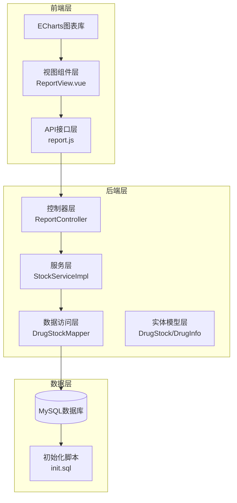
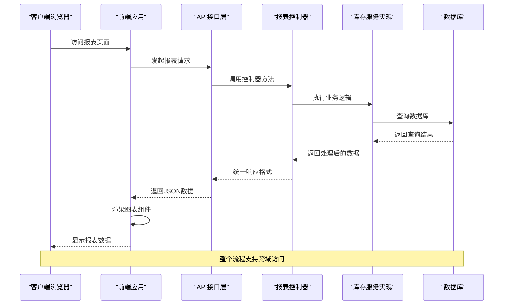
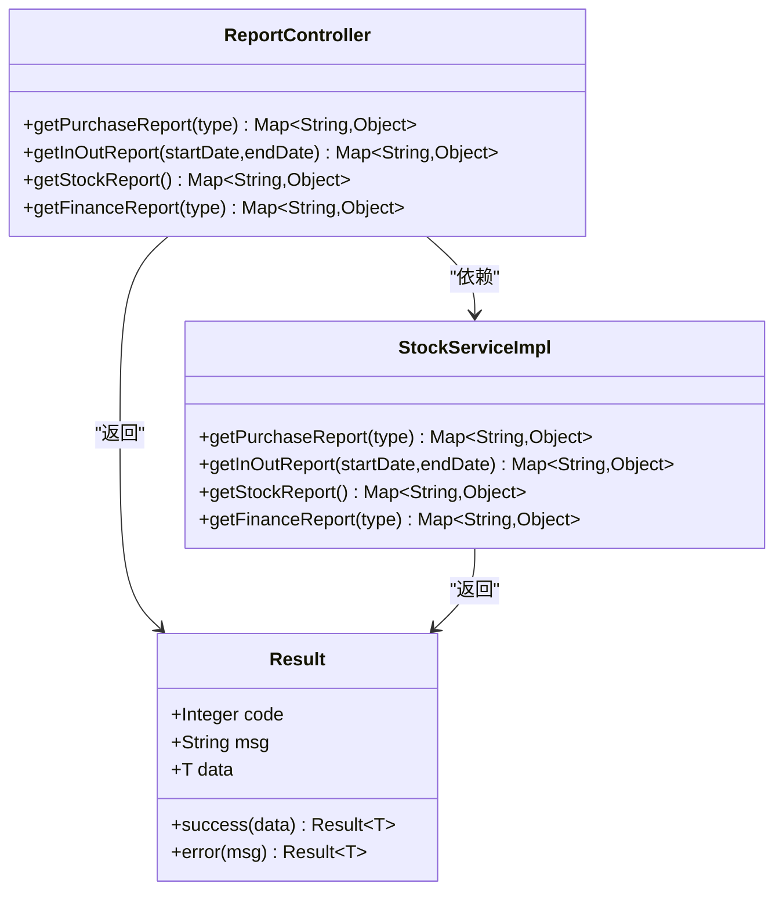
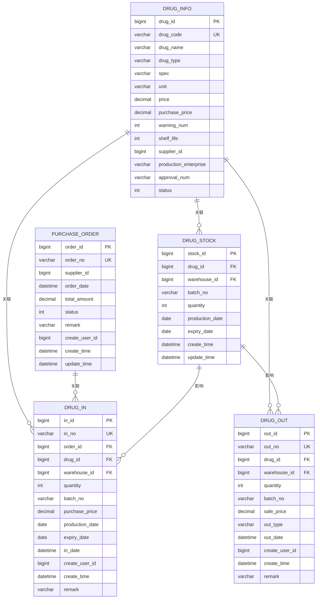
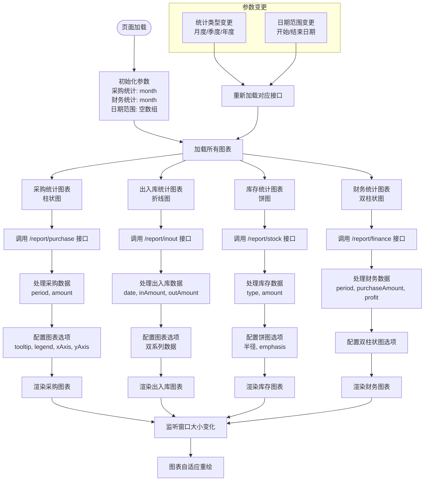
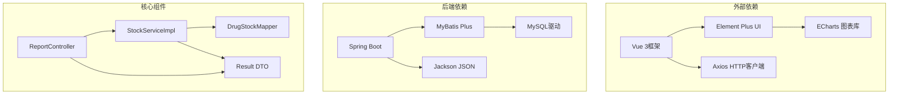

# 报表统计API

<cite>
**本文档引用的文件**
- [ReportController.java](file://src/main/java/com/hospital/drugmanagement/controller/ReportController.java)
- [StockServiceImpl.java](file://src/main/java/com/hospital/drugmanagement/service/impl/StockServiceImpl.java)
- [report.js](file://drug-front/src/api/report.js)
- [ReportView.vue](file://drug-front/src/views/report/ReportView.vue)
- [Result.java](file://src/main/java/com/hospital/drugmanagement/dto/Result.java)
- [init.sql](file://src/main/resources/db/init.sql)
- [DrugStock.java](file://src/main/java/com/hospital/drugmanagement/entity/DrugStock.java)
- [DrugInfo.java](file://src/main/java/com/hospital/drugmanagement/entity/DrugInfo.java)
- [DrugIn.java](file://src/main/java/com/hospital/drugmanagement/entity/DrugIn.java)
- [DrugOut.java](file://src/main/java/com/hospital/drugmanagement/entity/DrugOut.java)
- [PurchaseOrder.java](file://src/main/java/com/hospital/drugmanagement/entity/PurchaseOrder.java)
</cite>

## 目录
1. [简介](#简介)
2. [项目结构](#项目结构)
3. [核心组件](#核心组件)
4. [架构概览](#架构概览)
5. [详细组件分析](#详细组件分析)
6. [依赖分析](#依赖分析)
7. [性能考虑](#性能考虑)
8. [故障排除指南](#故障排除指南)
9. [结论](#结论)
10. [附录](#附录)

## 简介
本项目提供完整的药品管理系统报表统计API，涵盖销售统计、库存统计、采购统计、财务统计等核心报表功能。系统采用前后端分离架构，后端基于Spring Boot + MyBatis Plus，前端使用Vue 3 + Element Plus + ECharts，支持时间范围筛选、统计维度设置、数据汇总算法等查询参数，以及图表数据格式、多维度分析等高级功能。

## 项目结构
系统采用标准的MVC架构模式，主要分为以下层次：

**图表来源**
- [ReportController.java:1-101](file://src/main/java/com/hospital/drugmanagement/controller/ReportController.java#L1-L101)
- [StockServiceImpl.java:1-241](file://src/main/java/com/hospital/drugmanagement/service/impl/StockServiceImpl.java#L1-L241)
- [report.js:1-38](file://drug-front/src/api/report.js#L1-L38)
- [ReportView.vue:1-333](file://drug-front/src/views/report/ReportView.vue#L1-L333)

**章节来源**
- [ReportController.java:1-101](file://src/main/java/com/hospital/drugmanagement/controller/ReportController.java#L1-L101)
- [StockServiceImpl.java:1-241](file://src/main/java/com/hospital/drugmanagement/service/impl/StockServiceImpl.java#L1-L241)
- [report.js:1-38](file://drug-front/src/api/report.js#L1-L38)
- [ReportView.vue:1-333](file://drug-front/src/views/report/ReportView.vue#L1-L333)

## 核心组件
系统的核心组件包括报表控制器、库存服务实现、前端API接口和视图组件，共同构成完整的报表统计体系。

### 报表控制器
ReportController提供四个主要的报表接口，每个接口都遵循统一的响应格式，支持异常处理和错误状态码返回。

### 库存服务实现
StockServiceImpl包含所有报表统计的核心算法，包括采购统计、出入库统计、库存统计和财务统计四种报表类型，每种报表都有不同的统计维度和数据聚合方式。

### 前端集成
前端通过独立的API模块和视图组件实现报表数据的获取、展示和交互，支持多种图表类型和动态参数传递。

**章节来源**
- [ReportController.java:18-100](file://src/main/java/com/hospital/drugmanagement/controller/ReportController.java#L18-L100)
- [StockServiceImpl.java:115-239](file://src/main/java/com/hospital/drugmanagement/service/impl/StockServiceImpl.java#L115-L239)
- [report.js:1-38](file://drug-front/src/api/report.js#L1-L38)
- [ReportView.vue:64-316](file://drug-front/src/views/report/ReportView.vue#L64-L316)

## 架构概览
系统采用RESTful API设计原则，前后端通过HTTP协议进行通信，数据传输采用JSON格式。

**图表来源**
- [ReportController.java:21-99](file://src/main/java/com/hospital/drugmanagement/controller/ReportController.java#L21-L99)
- [StockServiceImpl.java:115-239](file://src/main/java/com/hospital/drugmanagement/service/impl/StockServiceImpl.java#L115-L239)
- [report.js:4-37](file://drug-front/src/api/report.js#L4-L37)

## 详细组件分析

### 报表接口定义
系统提供四个核心报表接口，每个接口都有明确的功能定位和参数规范。

#### 采购统计报表
- **接口路径**: `/api/report/purchase`
- **请求方法**: GET
- **参数说明**:
  - `type`: 统计类型，支持 `month`(月度)、`quarter`(季度)、`year`(年度)
- **响应数据**: 采购金额按时间段分组的统计数据

#### 出入库统计报表
- **接口路径**: `/api/report/inout`
- **请求方法**: GET
- **参数说明**:
  - `startDate`: 开始日期，格式 `YYYY-MM-DD`
  - `endDate`: 结束日期，格式 `YYYY-MM-DD`
- **响应数据**: 指定日期范围内的入库金额和出库金额对比数据

#### 库存统计报表
- **接口路径**: `/api/report/stock`
- **请求方法**: GET
- **参数说明**: 无特殊参数
- **响应数据**: 按药品类型分类的库存金额分布数据

#### 财务统计报表
- **接口路径**: `/api/report/finance`
- **请求方法**: GET
- **参数说明**:
  - `type`: 统计类型，支持 `month`(月度)、`quarter`(季度)、`year`(年度)
- **响应数据**: 采购支出和销售毛利的对比数据

**图表来源**
- [ReportController.java:10-100](file://src/main/java/com/hospital/drugmanagement/controller/ReportController.java#L10-L100)
- [StockServiceImpl.java:24-240](file://src/main/java/com/hospital/drugmanagement/service/impl/StockServiceImpl.java#L24-L240)
- [Result.java:8-98](file://src/main/java/com/hospital/drugmanagement/dto/Result.java#L8-L98)

**章节来源**
- [ReportController.java:18-99](file://src/main/java/com/hospital/drugmanagement/controller/ReportController.java#L18-L99)
- [StockServiceImpl.java:115-239](file://src/main/java/com/hospital/drugmanagement/service/impl/StockServiceImpl.java#L115-L239)

### 数据模型设计
系统采用标准化的数据模型设计，确保报表数据的准确性和一致性。

**图表来源**
- [init.sql:60-194](file://src/main/resources/db/init.sql#L60-L194)
- [DrugStock.java:14-39](file://src/main/java/com/hospital/drugmanagement/entity/DrugStock.java#L14-L39)
- [DrugInfo.java:9-167](file://src/main/java/com/hospital/drugmanagement/entity/DrugInfo.java#L9-L167)
- [DrugIn.java:15-62](file://src/main/java/com/hospital/drugmanagement/entity/DrugIn.java#L15-L62)
- [DrugOut.java:14-58](file://src/main/java/com/hospital/drugmanagement/entity/DrugOut.java#L14-L58)
- [PurchaseOrder.java:13-40](file://src/main/java/com/hospital/drugmanagement/entity/PurchaseOrder.java#L13-L40)

**章节来源**
- [init.sql:60-194](file://src/main/resources/db/init.sql#L60-L194)
- [DrugStock.java:14-39](file://src/main/java/com/hospital/drugmanagement/entity/DrugStock.java#L14-L39)
- [DrugInfo.java:9-167](file://src/main/java/com/hospital/drugmanagement/entity/DrugInfo.java#L9-L167)

### 前端集成实现
前端通过独立的API模块和视图组件实现报表功能，支持多种图表类型和交互操作。

**图表来源**
- [ReportView.vue:64-316](file://drug-front/src/views/report/ReportView.vue#L64-L316)
- [report.js:4-37](file://drug-front/src/api/report.js#L4-L37)

**章节来源**
- [ReportView.vue:64-316](file://drug-front/src/views/report/ReportView.vue#L64-L316)
- [report.js:1-38](file://drug-front/src/api/report.js#L1-L38)

## 依赖分析
系统各组件之间的依赖关系清晰明确，遵循单一职责原则和依赖倒置原则。

**图表来源**
- [ReportController.java:1-13](file://src/main/java/com/hospital/drugmanagement/controller/ReportController.java#L1-L13)
- [StockServiceImpl.java:1-25](file://src/main/java/com/hospital/drugmanagement/service/impl/StockServiceImpl.java#L1-L25)
- [Result.java:1-99](file://src/main/java/com/hospital/drugmanagement/dto/Result.java#L1-L99)

**章节来源**
- [ReportController.java:1-13](file://src/main/java/com/hospital/drugmanagement/controller/ReportController.java#L1-L13)
- [StockServiceImpl.java:1-25](file://src/main/java/com/hospital/drugmanagement/service/impl/StockServiceImpl.java#L1-L25)
- [Result.java:1-99](file://src/main/java/com/hospital/drugmanagement/dto/Result.java#L1-L99)

## 性能考虑
系统在设计时充分考虑了性能优化和可扩展性要求。

### 数据库优化策略
- **索引设计**: 关键查询字段建立适当索引，如 `drug_id`、`warehouse_id`、`supplier_id` 等
- **查询优化**: 使用分页查询避免大数据集全量查询
- **连接优化**: 合理使用JOIN操作减少查询次数

### 缓存策略
- **内存缓存**: 对热点报表数据进行短期缓存
- **CDN加速**: 图表资源静态化部署
- **数据库连接池**: 优化数据库连接复用

### 前端性能优化
- **懒加载**: 图表组件按需加载
- **虚拟滚动**: 大数据集列表虚拟化
- **防抖节流**: 输入参数变更的防抖处理

## 故障排除指南
系统提供了完善的错误处理机制和调试工具。

### 常见问题及解决方案
- **接口调用失败**: 检查网络连接和CORS配置
- **数据为空**: 验证查询参数和数据库连接
- **图表渲染异常**: 确认数据格式和ECharts版本兼容性

### 错误响应格式
系统统一使用Result DTO封装响应数据，包含状态码、消息和数据内容。

**章节来源**
- [Result.java:50-97](file://src/main/java/com/hospital/drugmanagement/dto/Result.java#L50-L97)
- [ReportController.java:26-36](file://src/main/java/com/hospital/drugmanagement/controller/ReportController.java#L26-L36)

## 结论
本报表统计API系统设计合理，功能完整，具有良好的扩展性和维护性。通过标准化的数据模型、清晰的接口定义和完善的前端集成，为药品管理提供了全面的统计分析能力。系统支持多种统计维度和图表展示，能够满足不同场景下的报表需求。

## 附录

### API接口规范
所有接口均遵循RESTful设计原则，使用统一的响应格式。

### 数据安全
- **权限控制**: 基于角色的访问控制机制
- **数据脱敏**: 敏感信息的适当处理
- **审计日志**: 操作记录的完整追踪

### 扩展建议
- **报表导出**: 添加Excel、PDF格式导出功能
- **定时任务**: 自动化报表生成和推送
- **多租户支持**: 不同医疗机构的隔离机制