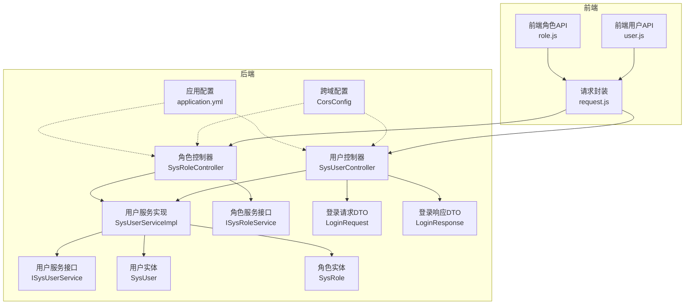
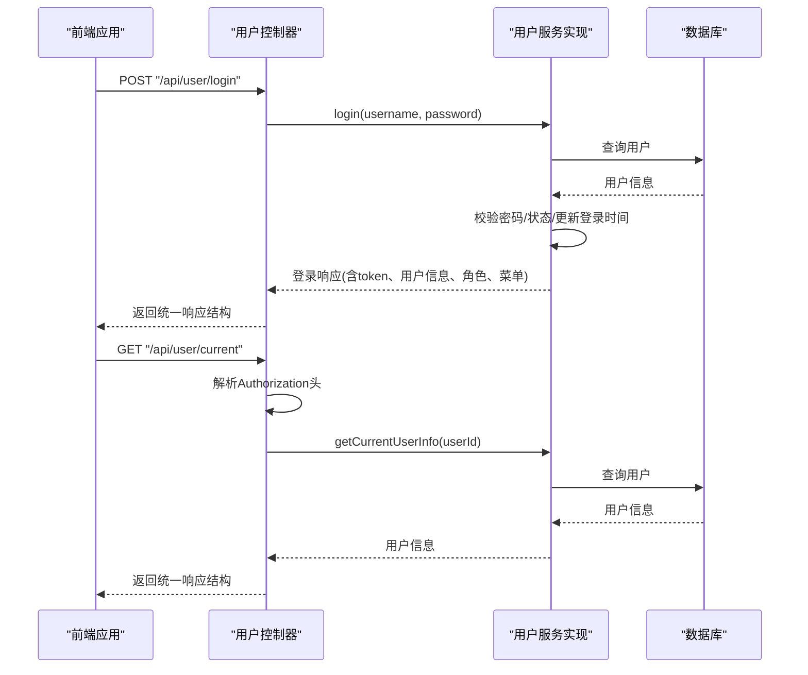
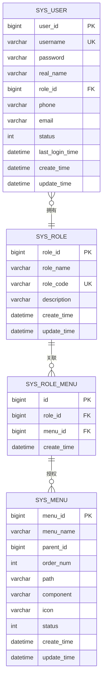
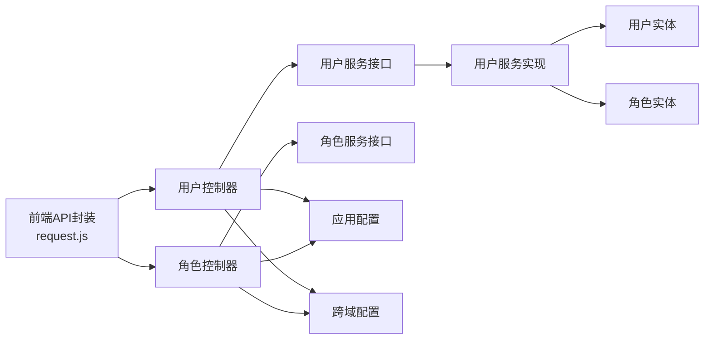

# 用户管理API

<cite>
**本文档引用的文件**
- [SysUserController.java](file://src/main/java/com/hospital/drugmanagement/controller/SysUserController.java)
- [SysRoleController.java](file://src/main/java/com/hospital/drugmanagement/controller/SysRoleController.java)
- [SysUserServiceImpl.java](file://src/main/java/com/hospital/drugmanagement/service/impl/SysUserServiceImpl.java)
- [LoginRequest.java](file://src/main/java/com/hospital/drugmanagement/dto/LoginRequest.java)
- [LoginResponse.java](file://src/main/java/com/hospital/drugmanagement/dto/LoginResponse.java)
- [Result.java](file://src/main/java/com/hospital/drugmanagement/dto/Result.java)
- [SysUser.java](file://src/main/java/com/hospital/drugmanagement/entity/SysUser.java)
- [SysRole.java](file://src/main/java/com/hospital/drugmanagement/entity/SysRole.java)
- [ISysUserService.java](file://src/main/java/com/hospital/drugmanagement/service/ISysUserService.java)
- [ISysRoleService.java](file://src/main/java/com/hospital/drugmanagement/service/ISysRoleService.java)
- [application.yml](file://src/main/resources/application.yml)
- [CorsConfig.java](file://src/main/java/com/hospital/drugmanagement/config/CorsConfig.java)
- [user.js](file://drug-front/src/api/user.js)
- [role.js](file://drug-front/src/api/role.js)
- [request.js](file://drug-front/src/utils/request.js)
- [hospital_drug.sql](file://hospital_drug.sql)
- [DrugManagementApplication.java](file://src/main/java/com/hospital/drugmanagement/DrugManagementApplication.java)
</cite>

## 目录
1. [简介](#简介)
2. [项目结构](#项目结构)
3. [核心组件](#核心组件)
4. [架构概览](#架构概览)
5. [详细组件分析](#详细组件分析)
6. [依赖分析](#依赖分析)
7. [性能考虑](#性能考虑)
8. [故障排查指南](#故障排查指南)
9. [结论](#结论)
10. [附录](#附录)

## 简介
本文件为药品管理系统中的用户管理API详细文档，涵盖用户管理、角色管理与权限控制相关接口。内容包括：
- 用户登录认证接口
- 用户信息CRUD操作
- 角色与权限管理接口
- 用户状态管理
- 认证流程、JWT令牌处理与权限验证机制
- 接口请求参数、响应格式与错误码定义
- 安全性考虑、输入验证规则与异常处理机制
- 实际API调用示例（登录、获取用户信息、角色分配等）

## 项目结构
后端采用Spring Boot + MyBatis-Plus架构，控制器位于controller包，业务逻辑在service包，实体类位于entity包，DTO位于dto包，数据库配置位于resources目录。

**图表来源**
- [SysUserController.java:26-28](file://src/main/java/com/hospital/drugmanagement/controller/SysUserController.java#L26-L28)
- [SysRoleController.java:20-23](file://src/main/java/com/hospital/drugmanagement/controller/SysRoleController.java#L20-L23)
- [SysUserServiceImpl.java:27-35](file://src/main/java/com/hospital/drugmanagement/service/impl/SysUserServiceImpl.java#L27-L35)
- [LoginRequest.java:8-18](file://src/main/java/com/hospital/drugmanagement/dto/LoginRequest.java#L8-L18)
- [LoginResponse.java:12-31](file://src/main/java/com/hospital/drugmanagement/dto/LoginResponse.java#L12-L31)
- [CorsConfig.java:8-18](file://src/main/java/com/hospital/drugmanagement/config/CorsConfig.java#L8-L18)
- [application.yml:1-24](file://src/main/resources/application.yml#L1-L24)
- [user.js:1-71](file://drug-front/src/api/user.js#L1-L71)
- [role.js:1-70](file://drug-front/src/api/role.js#L1-L70)
- [request.js:1-56](file://drug-front/src/utils/request.js#L1-L56)

**章节来源**
- [SysUserController.java:26-28](file://src/main/java/com/hospital/drugmanagement/controller/SysUserController.java#L26-L28)
- [SysRoleController.java:20-23](file://src/main/java/com/hospital/drugmanagement/controller/SysRoleController.java#L20-L23)
- [application.yml:1-24](file://src/main/resources/application.yml#L1-L24)

## 核心组件
- 用户控制器：提供登录、当前用户信息获取、用户列表查询、用户CRUD、重置密码等接口。
- 角色控制器：提供角色列表查询、角色CRUD、菜单查询、角色权限分配等接口。
- 用户服务实现：负责登录认证、当前用户信息获取、Token生成（演示用）、密码加密等。
- DTO与实体：LoginRequest/LoginResponse用于登录交互；SysUser/SysRole为数据库映射实体。
- 前端API封装：统一请求入口，自动注入Authorization头，处理401跳转登录。

**章节来源**
- [SysUserController.java:43-68](file://src/main/java/com/hospital/drugmanagement/controller/SysUserController.java#L43-L68)
- [SysRoleController.java:37-64](file://src/main/java/com/hospital/drugmanagement/controller/SysRoleController.java#L37-L64)
- [SysUserServiceImpl.java:41-102](file://src/main/java/com/hospital/drugmanagement/service/impl/SysUserServiceImpl.java#L41-L102)
- [LoginRequest.java:8-18](file://src/main/java/com/hospital/drugmanagement/dto/LoginRequest.java#L8-L18)
- [LoginResponse.java:12-31](file://src/main/java/com/hospital/drugmanagement/dto/LoginResponse.java#L12-L31)
- [SysUser.java:12-41](file://src/main/java/com/hospital/drugmanagement/entity/SysUser.java#L12-L41)
- [SysRole.java:12-31](file://src/main/java/com/hospital/drugmanagement/entity/SysRole.java#L12-L31)
- [user.js:1-71](file://drug-front/src/api/user.js#L1-L71)
- [role.js:1-70](file://drug-front/src/api/role.js#L1-L70)
- [request.js:11-25](file://drug-front/src/utils/request.js#L11-L25)

## 架构概览
用户管理API遵循REST风格，前后端通过HTTP通信，前端通过Axios封装统一请求，后端通过Spring MVC接收请求，调用Service层进行业务处理，最终访问数据库。

**图表来源**
- [SysUserController.java:43-147](file://src/main/java/com/hospital/drugmanagement/controller/SysUserController.java#L43-L147)
- [SysUserServiceImpl.java:41-102](file://src/main/java/com/hospital/drugmanagement/service/impl/SysUserServiceImpl.java#L41-L102)

**章节来源**
- [SysUserController.java:43-147](file://src/main/java/com/hospital/drugmanagement/controller/SysUserController.java#L43-L147)
- [SysUserServiceImpl.java:41-102](file://src/main/java/com/hospital/drugmanagement/service/impl/SysUserServiceImpl.java#L41-L102)

## 详细组件分析

### 用户管理接口
- 接口前缀：/api/user
- 主要功能：登录、获取当前用户信息、用户列表查询、用户详情、新增/修改/删除、重置密码

#### 登录接口
- 方法与路径：POST /api/user/login
- 请求体：LoginRequest
  - 字段：username（字符串，必填），password（字符串，必填）
- 响应体：统一响应结构
  - code：200表示成功，400/401/500表示不同错误
  - msg：提示信息
  - data：LoginResponse
    - token：字符串（演示用简单token）
    - userInfo：包含用户基本信息
    - roles：角色名称列表
    - menus：菜单列表
- 错误码：
  - 400：用户名或密码为空
  - 401：用户不存在、密码错误、账号被禁用
  - 500：服务器内部错误
- 安全性：
  - 密码使用MD5加盐存储与验证（盐值固定，演示用途）
  - Token为简单拼接字符串，非JWT，生产需替换为JWT
- 输入验证：
  - 必填字段校验
  - 用户状态检查（启用/禁用）
- 异常处理：
  - 参数非法抛出IllegalArgumentException
  - 认证失败抛出RuntimeException
  - 其他异常捕获并返回500

**章节来源**
- [SysUserController.java:43-68](file://src/main/java/com/hospital/drugmanagement/controller/SysUserController.java#L43-L68)
- [SysUserServiceImpl.java:41-102](file://src/main/java/com/hospital/drugmanagement/service/impl/SysUserServiceImpl.java#L41-L102)
- [LoginRequest.java:8-18](file://src/main/java/com/hospital/drugmanagement/dto/LoginRequest.java#L8-L18)
- [LoginResponse.java:12-31](file://src/main/java/com/hospital/drugmanagement/dto/LoginResponse.java#L12-L31)

#### 获取当前用户信息接口
- 方法与路径：GET /api/user/current
- 请求头：Authorization（Bearer token）
- 响应体：统一响应结构
  - data.userInfo：用户信息
  - data.roles：角色名称数组
  - data.menus：菜单列表
- 错误码：
  - 401：未授权或token无效
  - 404：用户不存在
  - 500：服务器内部错误
- 权限验证：
  - 从token中解析用户ID，校验有效性
  - 读取用户角色与菜单，返回给前端

**章节来源**
- [SysUserController.java:73-147](file://src/main/java/com/hospital/drugmanagement/controller/SysUserController.java#L73-L147)

#### 用户列表查询接口
- 方法与路径：GET /api/user/list
- 查询参数：
  - pageNum（默认1）、pageSize（默认10）
  - username（可选）、realName（可选）、roleId（可选）
- 响应体：统一响应结构
  - data：用户列表（包含角色名称、最后登录时间等）
  - total：总数
- 错误码：500（服务器内部错误）

**章节来源**
- [SysUserController.java:152-224](file://src/main/java/com/hospital/drugmanagement/controller/SysUserController.java#L152-L224)

#### 用户详情接口
- 方法与路径：GET /api/user/{id}
- 路径参数：id（用户ID）
- 响应体：统一响应结构
  - data：SysUser对象
- 错误码：
  - 404：用户不存在
  - 500：服务器内部错误

**章节来源**
- [SysUserController.java:229-249](file://src/main/java/com/hospital/drugmanagement/controller/SysUserController.java#L229-L249)

#### 新增用户接口
- 方法与路径：POST /api/user
- 请求体：SysUser
  - 注意：password会进行MD5加盐处理后再保存
- 响应体：统一响应结构
- 重复性校验：
  - 用户名、手机号、邮箱唯一性检查
- 错误码：
  - 400：用户名/手机号/邮箱已存在
  - 500：保存失败

**章节来源**
- [SysUserController.java:254-308](file://src/main/java/com/hospital/drugmanagement/controller/SysUserController.java#L254-L308)

#### 修改用户接口
- 方法与路径：PUT /api/user
- 请求体：SysUser
  - 注意：password会进行MD5加盐处理后再保存
- 重复性校验：
  - 排除当前用户后的用户名、手机号、邮箱唯一性检查
- 错误码：
  - 400：用户名/手机号/邮箱已存在
  - 500：更新失败

**章节来源**
- [SysUserController.java:313-370](file://src/main/java/com/hospital/drugmanagement/controller/SysUserController.java#L313-L370)

#### 删除用户接口
- 方法与路径：DELETE /api/user/{id}
- 路径参数：id（用户ID）
- 响应体：统一响应结构
- 错误码：500（删除失败）

**章节来源**
- [SysUserController.java:375-389](file://src/main/java/com/hospital/drugmanagement/controller/SysUserController.java#L375-L389)

#### 重置密码接口
- 方法与路径：PUT /api/user/resetPassword
- 请求体：JSON对象
  - userId：目标用户ID
  - password：新密码
- 响应体：统一响应结构
- 错误码：500（重置失败）

**章节来源**
- [SysUserController.java:394-419](file://src/main/java/com/hospital/drugmanagement/controller/SysUserController.java#L394-L419)

### 角色管理与权限控制接口
- 接口前缀：/api/role
- 主要功能：角色列表查询、角色详情、新增/修改/删除、菜单查询、角色权限分配

#### 角色列表查询接口
- 方法与路径：GET /api/role/list
- 查询参数：
  - pageNum（默认1）、pageSize（默认10）、roleName（可选）
- 响应体：统一响应结构
  - data：SysRole列表
  - total：总数

**章节来源**
- [SysRoleController.java:37-64](file://src/main/java/com/hospital/drugmanagement/controller/SysRoleController.java#L37-L64)

#### 角色详情接口
- 方法与路径：GET /api/role/{id}
- 路径参数：id（角色ID）
- 响应体：统一响应结构
- 错误码：
  - 404：角色不存在
  - 500：查询失败

**章节来源**
- [SysRoleController.java:69-89](file://src/main/java/com/hospital/drugmanagement/controller/SysRoleController.java#L69-L89)

#### 新增角色接口
- 方法与路径：POST /api/role
- 请求体：SysRole
- 重复性校验：
  - 角色名称、角色编码唯一性检查
- 错误码：
  - 400：角色名称/编码已存在
  - 500：保存失败

**章节来源**
- [SysRoleController.java:94-128](file://src/main/java/com/hospital/drugmanagement/controller/SysRoleController.java#L94-L128)

#### 修改角色接口
- 方法与路径：PUT /api/role
- 请求体：SysRole
- 重复性校验：
  - 排除当前角色后的角色名称、角色编码唯一性检查
- 错误码：
  - 400：角色名称/编码已存在
  - 500：更新失败

**章节来源**
- [SysRoleController.java:133-169](file://src/main/java/com/hospital/drugmanagement/controller/SysRoleController.java#L133-L169)

#### 删除角色接口
- 方法与路径：DELETE /api/role/{id}
- 路径参数：id（角色ID）
- 响应体：统一响应结构
- 错误码：500（删除失败）

**章节来源**
- [SysRoleController.java:174-188](file://src/main/java/com/hospital/drugmanagement/controller/SysRoleController.java#L174-L188)

#### 获取所有菜单接口
- 方法与路径：GET /api/role/menus
- 响应体：统一响应结构
  - data：菜单列表

**章节来源**
- [SysRoleController.java:193-207](file://src/main/java/com/hospital/drugmanagement/controller/SysRoleController.java#L193-L207)

#### 根据角色ID获取菜单接口
- 方法与路径：GET /api/role/menus/{roleId}
- 路径参数：roleId（角色ID）
- 响应体：统一响应结构
  - data：菜单ID列表

**章节来源**
- [SysRoleController.java:212-226](file://src/main/java/com/hospital/drugmanagement/controller/SysRoleController.java#L212-L226)

#### 分配权限接口
- 方法与路径：POST /api/role/assignPerms
- 请求体：JSON对象
  - roleId：角色ID
  - permIds：菜单ID列表
- 响应体：统一响应结构
- 错误码：
  - 400：角色ID为空
  - 500：权限分配失败

**章节来源**
- [SysRoleController.java:231-272](file://src/main/java/com/hospital/drugmanagement/controller/SysRoleController.java#L231-L272)

### 统一响应结构
- 结构：code（状态码）、msg（消息）、data（数据）
- 成功：code=200
- 失败：code≠200（如400、401、500）
- 工具方法：Result.success()/error()

**章节来源**
- [Result.java:8-49](file://src/main/java/com/hospital/drugmanagement/dto/Result.java#L8-L49)
- [Result.java:50-98](file://src/main/java/com/hospital/drugmanagement/dto/Result.java#L50-L98)

### 数据模型

**图表来源**
- [hospital_drug.sql:269-286](file://hospital_drug.sql#L269-L286)
- [hospital_drug.sql:241-253](file://hospital_drug.sql#L241-L253)
- [hospital_drug.sql:223-238](file://hospital_drug.sql#L223-L238)
- [hospital_drug.sql:256-266](file://hospital_drug.sql#L256-L266)

## 依赖分析
- 控制器依赖服务接口与实体类
- 服务实现依赖Mapper与菜单服务
- 前端通过Axios统一请求，自动注入Authorization头
- 应用配置提供数据库连接与MyBatis-Plus设置
- CORS配置允许跨域访问

**图表来源**
- [request.js:1-56](file://drug-front/src/utils/request.js#L1-L56)
- [SysUserController.java:31-38](file://src/main/java/com/hospital/drugmanagement/controller/SysUserController.java#L31-L38)
- [SysRoleController.java:25-32](file://src/main/java/com/hospital/drugmanagement/controller/SysRoleController.java#L25-L32)
- [SysUserServiceImpl.java:27-35](file://src/main/java/com/hospital/drugmanagement/service/impl/SysUserServiceImpl.java#L27-L35)
- [application.yml:1-24](file://src/main/resources/application.yml#L1-L24)
- [CorsConfig.java:8-18](file://src/main/java/com/hospital/drugmanagement/config/CorsConfig.java#L8-L18)

**章节来源**
- [request.js:1-56](file://drug-front/src/utils/request.js#L1-L56)
- [SysUserController.java:31-38](file://src/main/java/com/hospital/drugmanagement/controller/SysUserController.java#L31-L38)
- [SysRoleController.java:25-32](file://src/main/java/com/hospital/drugmanagement/controller/SysRoleController.java#L25-L32)
- [application.yml:1-24](file://src/main/resources/application.yml#L1-L24)
- [CorsConfig.java:8-18](file://src/main/java/com/hospital/drugmanagement/config/CorsConfig.java#L8-L18)

## 性能考虑
- 分页查询：用户列表接口支持pageNum与pageSize，默认10条，建议前端合理设置分页大小
- 数据转换：用户列表返回时附加角色名称与最后登录时间，注意数据库查询与内存处理开销
- 密码处理：MD5加盐存储，建议升级为更安全的哈希算法（如bcrypt）
- Token处理：当前为简单字符串，建议替换为JWT以提升安全性与可扩展性
- 数据库索引：用户名唯一索引、角色编码唯一索引已建立，确保查询与写入性能

[本节为通用性能建议，无需特定文件来源]

## 故障排查指南
- 登录失败
  - 检查用户名/密码是否为空
  - 确认用户是否存在且状态为启用
  - 核对密码是否正确（MD5加盐）
- 未授权/401
  - 确认Authorization头格式为Bearer token
  - 检查token是否有效（当前为简单字符串）
- 重复字段冲突
  - 用户名/手机号/邮箱唯一性冲突
  - 角色名称/编码唯一性冲突
- 数据库连接问题
  - 检查application.yml中的数据库URL、用户名、密码
- 跨域问题
  - CORS已配置，确认请求域名与方法匹配

**章节来源**
- [SysUserController.java:43-68](file://src/main/java/com/hospital/drugmanagement/controller/SysUserController.java#L43-L68)
- [SysUserController.java:73-147](file://src/main/java/com/hospital/drugmanagement/controller/SysUserController.java#L73-L147)
- [SysRoleController.java:94-128](file://src/main/java/com/hospital/drugmanagement/controller/SysRoleController.java#L94-L128)
- [application.yml:1-24](file://src/main/resources/application.yml#L1-L24)
- [CorsConfig.java:8-18](file://src/main/java/com/hospital/drugmanagement/config/CorsConfig.java#L8-L18)

## 结论
本用户管理API提供了完整的用户生命周期管理与角色权限体系，具备清晰的接口规范与统一响应结构。建议在生产环境中替换为JWT认证、更强的密码哈希算法与完善的权限校验机制，并结合前端路由守卫实现更严格的访问控制。

[本节为总结性内容，无需特定文件来源]

## 附录

### API调用示例

- 登录请求
  - 方法：POST
  - 地址：/api/user/login
  - 请求体：{
    "username": "admin",
    "password": "123456"
  }
  - 响应：{
    "code": 200,
    "msg": "登录成功",
    "data": {
      "token": "token_1_1710000000000",
      "userInfo": { "userId": 1, "username": "admin", ... },
      "roles": ["管理员"],
      "menus": []
    }
  }

- 获取当前用户信息
  - 方法：GET
  - 地址：/api/user/current
  - 请求头：Authorization: Bearer token
  - 响应：{
    "code": 200,
    "msg": "success",
    "data": {
      "userInfo": { "userId": 1, "username": "admin", ... },
      "roles": ["管理员"],
      "menus": []
    }
  }

- 新增用户
  - 方法：POST
  - 地址：/api/user
  - 请求体：{
    "username": "testuser",
    "password": "password123",
    "realName": "测试用户",
    "phone": "13800001111",
    "email": "test@example.com",
    "roleId": 1,
    "status": 1
  }
  - 响应：{
    "code": 200,
    "msg": "保存成功",
    "data": null
  }

- 角色分配权限
  - 方法：POST
  - 地址：/api/role/assignPerms
  - 请求体：{
    "roleId": 1,
    "permIds": [1, 2, 3]
  }
  - 响应：{
    "code": 200,
    "msg": "权限分配成功",
    "data": null
  }

**章节来源**
- [user.js:55-70](file://drug-front/src/api/user.js#L55-L70)
- [role.js:46-53](file://drug-front/src/api/role.js#L46-L53)
- [request.js:11-25](file://drug-front/src/utils/request.js#L11-L25)

### 错误码定义
- 200：成功
- 400：参数错误/业务校验失败（如重复字段、参数为空）
- 401：未授权/认证失败（如token无效、用户不存在、密码错误、账号禁用）
- 404：资源不存在
- 500：服务器内部错误

**章节来源**
- [SysUserController.java:43-68](file://src/main/java/com/hospital/drugmanagement/controller/SysUserController.java#L43-L68)
- [SysUserController.java:73-147](file://src/main/java/com/hospital/drugmanagement/controller/SysUserController.java#L73-L147)
- [SysRoleController.java:37-64](file://src/main/java/com/hospital/drugmanagement/controller/SysRoleController.java#L37-L64)

### 安全性考虑
- 密码存储：当前使用MD5加盐，建议升级为bcrypt等更强算法
- Token：当前为简单字符串，建议使用JWT并设置过期时间与签名
- 输入验证：对必填字段与业务约束进行严格校验
- CORS：已配置允许跨域，生产环境建议限制具体域名
- 异常处理：区分业务异常与系统异常，避免泄露敏感信息

**章节来源**
- [SysUserServiceImpl.java:36-40](file://src/main/java/com/hospital/drugmanagement/service/impl/SysUserServiceImpl.java#L36-L40)
- [SysUserServiceImpl.java:120-127](file://src/main/java/com/hospital/drugmanagement/service/impl/SysUserServiceImpl.java#L120-L127)
- [CorsConfig.java:8-18](file://src/main/java/com/hospital/drugmanagement/config/CorsConfig.java#L8-L18)