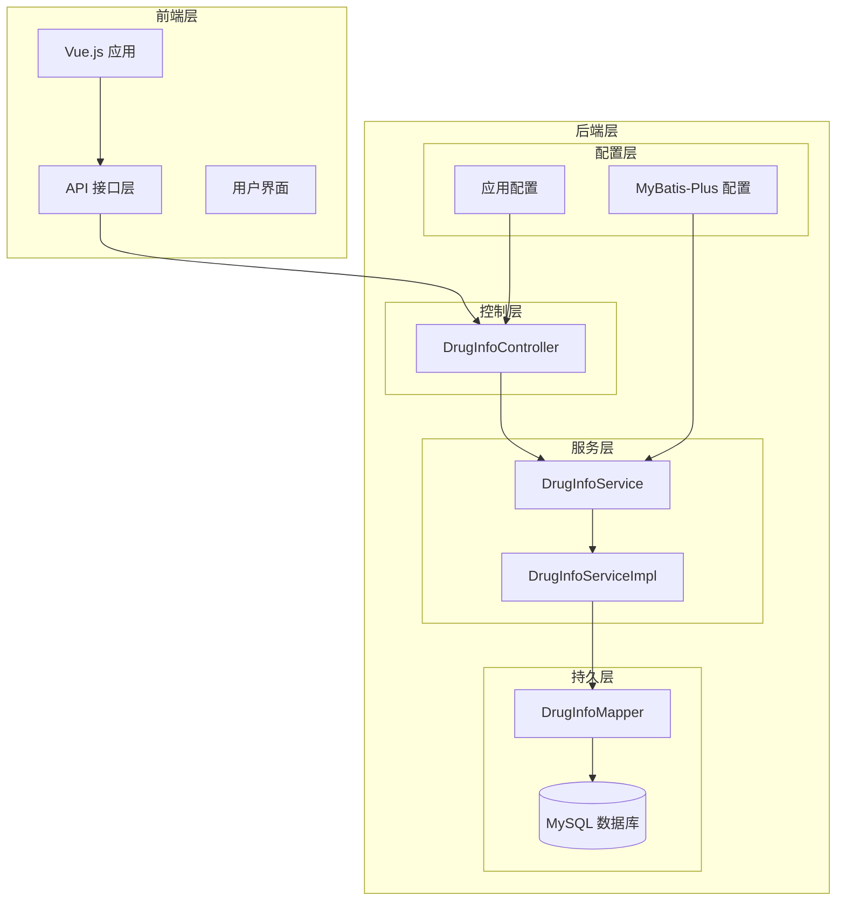
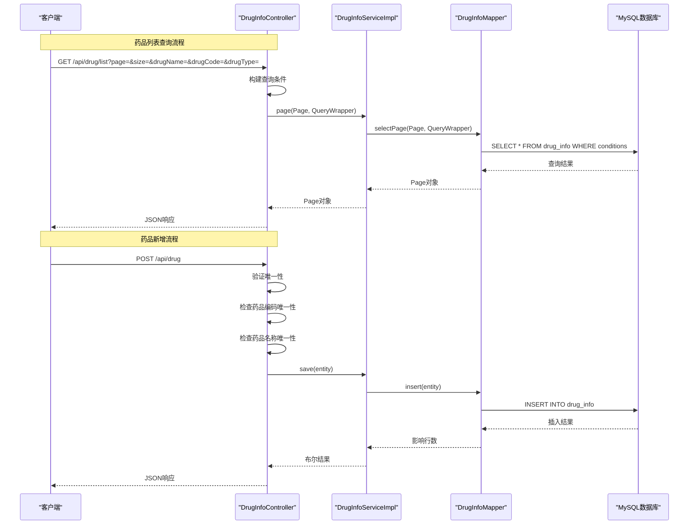
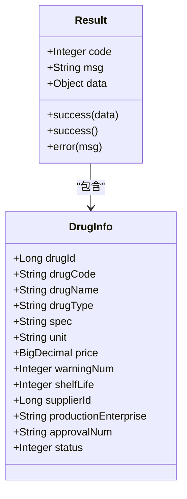
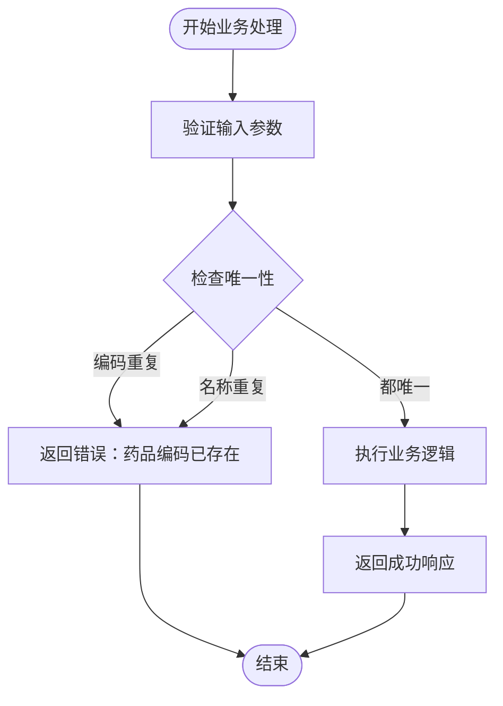
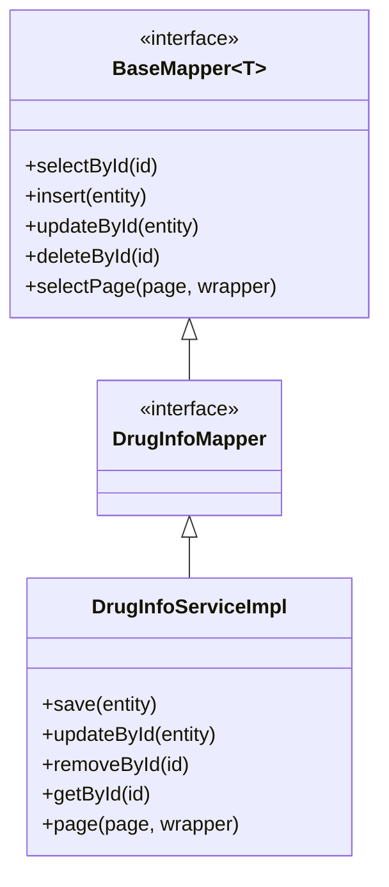
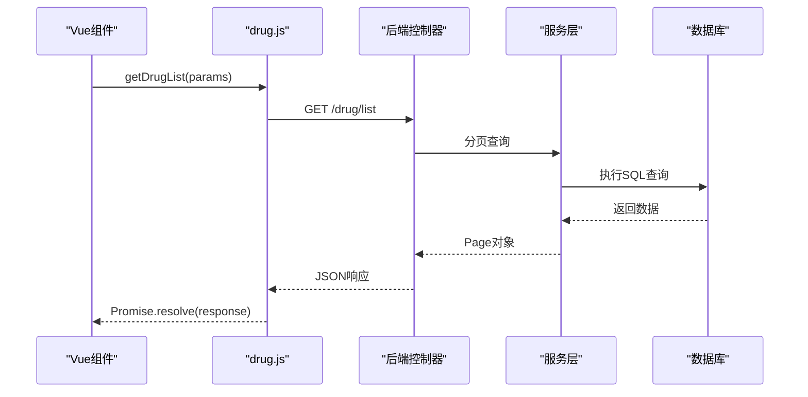
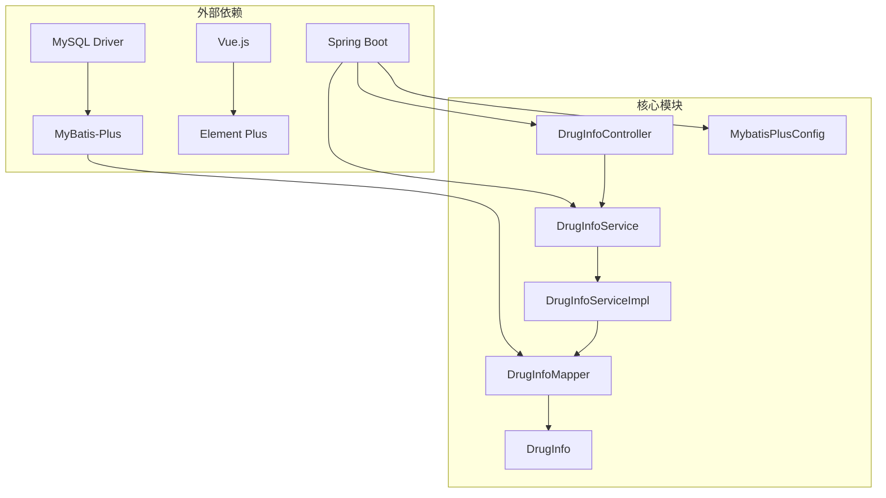
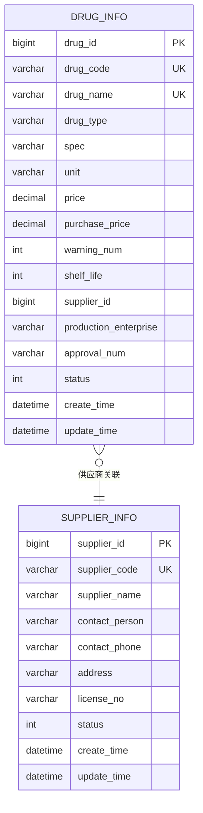

# 药品管理API

<cite>
**本文档引用的文件**
- [DrugInfoController.java](file://src/main/java/com/hospital/drugmanagement/controller/DrugInfoController.java)
- [DrugInfoService.java](file://src/main/java/com/hospital/drugmanagement/service/DrugInfoService.java)
- [DrugInfoServiceImpl.java](file://src/main/java/com/hospital/drugmanagement/service/impl/DrugInfoServiceImpl.java)
- [DrugInfoMapper.java](file://src/main/java/com/hospital/drugmanagement/mapper/DrugInfoMapper.java)
- [DrugInfo.java](file://src/main/java/com/hospital/drugmanagement/entity/DrugInfo.java)
- [application.yml](file://src/main/resources/application.yml)
- [MybatisPlusConfig.java](file://src/main/java/com/hospital/drugmanagement/config/MybatisPlusConfig.java)
- [Result.java](file://src/main/java/com/hospital/drugmanagement/dto/Result.java)
- [drug.js](file://drug-front/src/api/drug.js)
- [DrugList.vue](file://drug-front/src/views/drug/DrugList.vue)
- [hospital_drug.sql](file://hospital_drug.sql)
</cite>

## 目录
1. [简介](#简介)
2. [项目结构](#项目结构)
3. [核心组件](#核心组件)
4. [架构概览](#架构概览)
5. [详细组件分析](#详细组件分析)
6. [依赖关系分析](#依赖关系分析)
7. [性能考虑](#性能考虑)
8. [故障排除指南](#故障排除指南)
9. [结论](#结论)
10. [附录](#附录)

## 简介
本项目是一个基于Spring Boot和Vue.js开发的医院药品管理系统，提供了完整的药品信息管理API。系统采用前后端分离架构，后端使用Spring Boot + MyBatis-Plus提供RESTful API，前端使用Vue.js + Element Plus构建用户界面。

该系统实现了药品信息的完整CRUD操作，包括：
- 药品列表查询（支持分页、模糊搜索、条件过滤）
- 药品详情获取
- 药品新增、修改、删除
- 药品编码唯一性验证
- 药品名称重复检查
- 药品分类管理
- 价格设置和规格信息管理

## 项目结构
系统采用经典的MVC分层架构，主要分为以下层次：



**图表来源**
- [DrugInfoController.java:14-169](file://src/main/java/com/hospital/drugmanagement/controller/DrugInfoController.java#L14-L169)
- [DrugInfoServiceImpl.java:13-18](file://src/main/java/com/hospital/drugmanagement/service/impl/DrugInfoServiceImpl.java#L13-L18)
- [DrugInfoMapper.java:7-9](file://src/main/java/com/hospital/drugmanagement/mapper/DrugInfoMapper.java#L7-L9)

**章节来源**
- [application.yml:1-24](file://src/main/resources/application.yml#L1-L24)
- [MybatisPlusConfig.java:8-16](file://src/main/java/com/hospital/drugmanagement/config/MybatisPlusConfig.java#L8-L16)

## 核心组件
系统的核心组件围绕药品信息管理展开，主要包括：

### 数据模型设计
药品信息实体包含以下关键字段：
- 药品标识：drug_id（主键，自增）
- 药品编码：drug_code（唯一约束）
- 药品名称：drug_name（唯一约束）
- 药品类型：drug_type（西药/中药/中成药/耗材）
- 规格信息：spec
- 单位：unit
- 销售价格：price
- 采购价格：purchase_price
- 库存预警：warning_num
- 保质期：shelf_life（月）
- 供应商：supplier_id
- 生产企业：production_enterprise
- 批准文号：approval_num
- 状态：status（0/1）

### 业务规则
系统实现了严格的业务规则验证：
- 药品编码唯一性验证
- 药品名称唯一性验证
- 供应商关联完整性
- 价格字段的数值验证
- 状态字段的有效性

**章节来源**
- [DrugInfo.java:9-167](file://src/main/java/com/hospital/drugmanagement/entity/DrugInfo.java#L9-L167)
- [hospital_drug.sql:65-85](file://hospital_drug.sql#L65-L85)

## 架构概览
系统采用分层架构设计，确保关注点分离和代码可维护性：



**图表来源**
- [DrugInfoController.java:22-58](file://src/main/java/com/hospital/drugmanagement/controller/DrugInfoController.java#L22-L58)
- [DrugInfoController.java:76-113](file://src/main/java/com/hospital/drugmanagement/controller/DrugInfoController.java#L76-L113)

**章节来源**
- [DrugInfoController.java:14-169](file://src/main/java/com/hospital/drugmanagement/controller/DrugInfoController.java#L14-L169)

## 详细组件分析

### 控制器层分析
DrugInfoController是系统的核心入口，负责处理HTTP请求和响应格式化。

#### 主要接口设计
控制器提供了RESTful风格的API接口：

| 接口 | 方法 | 路径 | 功能描述 |
|------|------|------|----------|
| 列表查询 | GET | /api/drug/list | 获取药品列表，支持分页和条件查询 |
| 详情获取 | GET | /api/drug/{id} | 获取指定ID的药品详情 |
| 新增药品 | POST | /api/drug | 创建新的药品记录 |
| 更新药品 | PUT | /api/drug | 更新现有药品信息 |
| 删除药品 | DELETE | /api/drug/{id} | 删除指定ID的药品 |

#### 查询参数详解
列表查询接口支持以下参数：

| 参数名 | 类型 | 必填 | 默认值 | 描述 |
|--------|------|------|--------|------|
| page | int | 否 | 1 | 当前页码 |
| size | int | 否 | 10 | 每页记录数 |
| drugName | string | 否 | 无 | 药品名称（模糊匹配） |
| drugCode | string | 否 | 无 | 药品编码（模糊匹配） |
| drugType | string | 否 | 无 | 药品类型（精确匹配） |

#### 响应格式标准化
系统采用统一的响应格式，包含以下字段：



**图表来源**
- [Result.java:9-99](file://src/main/java/com/hospital/drugmanagement/dto/Result.java#L9-L99)
- [DrugInfo.java:10-167](file://src/main/java/com/hospital/drugmanagement/entity/DrugInfo.java#L10-L167)

**章节来源**
- [DrugInfoController.java:22-58](file://src/main/java/com/hospital/drugmanagement/controller/DrugInfoController.java#L22-L58)
- [Result.java:50-97](file://src/main/java/com/hospital/drugmanagement/dto/Result.java#L50-L97)

### 服务层分析
服务层实现了业务逻辑处理和数据验证。

#### 业务规则实现
服务层重点实现了以下业务规则：

1. **唯一性验证**：在新增和更新时检查药品编码和名称的唯一性
2. **数据完整性**：确保必填字段的完整性和有效性
3. **关联关系**：验证供应商ID的有效性

#### 自定义查询方法
虽然当前版本使用MyBatis-Plus的默认实现，但服务层预留了扩展空间：



**图表来源**
- [DrugInfoController.java:83-101](file://src/main/java/com/hospital/drugmanagement/controller/DrugInfoController.java#L83-L101)
- [DrugInfoController.java:119-139](file://src/main/java/com/hospital/drugmanagement/controller/DrugInfoController.java#L119-L139)

**章节来源**
- [DrugInfoService.java:6-13](file://src/main/java/com/hospital/drugmanagement/service/DrugInfoService.java#L6-L13)
- [DrugInfoServiceImpl.java:9-18](file://src/main/java/com/hospital/drugmanagement/service/impl/DrugInfoServiceImpl.java#L9-L18)

### 数据访问层分析
数据访问层基于MyBatis-Plus框架，提供了强大的ORM功能。

#### 映射器接口设计
DrugInfoMapper继承自BaseMapper，自动获得了所有基础CRUD操作：



**图表来源**
- [DrugInfoMapper.java:7-9](file://src/main/java/com/hospital/drugmanagement/mapper/DrugInfoMapper.java#L7-L9)
- [DrugInfoServiceImpl.java:14-18](file://src/main/java/com/hospital/drugmanagement/service/impl/DrugInfoServiceImpl.java#L14-L18)

**章节来源**
- [DrugInfoMapper.java:1-9](file://src/main/java/com/hospital/drugmanagement/mapper/DrugInfoMapper.java#L1-L9)

### 前端集成分析
前端Vue.js应用通过API接口与后端进行交互。

#### API接口封装
前端使用axios封装了所有药品管理API：



**图表来源**
- [drug.js:4-10](file://drug-front/src/api/drug.js#L4-L10)
- [DrugList.vue:285-297](file://drug-front/src/views/drug/DrugList.vue#L285-L297)

**章节来源**
- [drug.js:1-45](file://drug-front/src/api/drug.js#L1-L45)
- [DrugList.vue:208-415](file://drug-front/src/views/drug/DrugList.vue#L208-L415)

## 依赖关系分析



**图表来源**
- [application.yml:1-24](file://src/main/resources/application.yml#L1-L24)
- [MybatisPlusConfig.java:8-16](file://src/main/java/com/hospital/drugmanagement/config/MybatisPlusConfig.java#L8-L16)

### 核心依赖关系
系统的关键依赖关系包括：

1. **Spring Boot**：提供Web容器和依赖注入
2. **MyBatis-Plus**：提供ORM映射和分页功能
3. **MySQL**：提供数据存储
4. **Vue.js**：提供前端用户界面
5. **Element Plus**：提供UI组件库

**章节来源**
- [application.yml:3-7](file://src/main/resources/application.yml#L3-L7)
- [MybatisPlusConfig.java:10-15](file://src/main/java/com/hospital/drugmanagement/config/MybatisPlusConfig.java#L10-L15)

## 性能考虑
系统在设计时充分考虑了性能优化：

### 分页查询优化
- 使用MyBatis-Plus内置的分页插件
- 数据库层面实现LIMIT和OFFSET
- 避免一次性加载大量数据

### 查询优化策略
- 为常用查询字段建立索引
- 使用条件查询减少全表扫描
- 合理使用LIKE查询（模糊匹配）

### 缓存策略
- 前端使用Element Plus的表格加载状态
- 后端未实现额外缓存层
- 建议对高频查询结果考虑Redis缓存

## 故障排除指南

### 常见错误及解决方案

#### 数据库连接问题
**症状**：启动时报数据库连接失败
**原因**：数据库配置错误或网络问题
**解决方案**：
1. 检查application.yml中的数据库连接配置
2. 确认MySQL服务正在运行
3. 验证用户名和密码正确性

#### 唯一性约束冲突
**症状**：新增或更新药品时报唯一性约束错误
**原因**：药品编码或名称重复
**解决方案**：
1. 检查数据库中是否存在相同的编码或名称
2. 修改为唯一的编码或名称
3. 使用系统提供的唯一性验证功能

#### 分页查询异常
**症状**：分页查询返回空数据或异常
**原因**：查询条件过于严格或数据不存在
**解决方案**：
1. 检查查询参数的有效性
2. 尝试放宽查询条件
3. 验证数据库中是否存在相关数据

**章节来源**
- [DrugInfoController.java:51-56](file://src/main/java/com/hospital/drugmanagement/controller/DrugInfoController.java#L51-L56)
- [DrugInfoController.java:107-111](file://src/main/java/com/hospital/drugmanagement/controller/DrugInfoController.java#L107-L111)

## 结论
本药品管理系统实现了完整的药品信息管理功能，具有以下特点：

### 技术优势
- **架构清晰**：采用标准的MVC分层架构
- **代码规范**：遵循Spring Boot最佳实践
- **扩展性强**：预留了充足的扩展空间
- **用户体验**：前端界面友好，操作便捷

### 功能完整性
- 实现了标准的CRUD操作
- 提供了完善的查询功能
- 实现了严格的业务规则验证
- 支持分页和条件查询

### 改进建议
1. 添加更详细的日志记录
2. 实现更完善的异常处理机制
3. 考虑添加数据导入导出功能
4. 增强前端表单验证
5. 添加审计日志功能

## 附录

### API接口详细说明

#### 药品列表查询
**请求方式**：GET
**请求URL**：/api/drug/list
**请求参数**：
- page: 当前页码，默认1
- size: 每页条数，默认10
- drugName: 药品名称（模糊匹配）
- drugCode: 药品编码（模糊匹配）
- drugType: 药品类型（精确匹配）

**响应示例**：
```json
{
  "code": 200,
  "msg": "success",
  "data": [
    {
      "drugId": 1,
      "drugCode": "D001",
      "drugName": "阿莫西林胶囊",
      "drugType": "西药",
      "spec": "0.25g*24粒/盒",
      "unit": "盒",
      "price": 25.50,
      "purchasePrice": 20.00,
      "warningNum": 10,
      "shelfLife": 24,
      "supplierId": 1,
      "productionEnterprise": "某制药厂",
      "approvalNum": "国药准字Z12345678",
      "status": 1
    }
  ],
  "total": 1
}
```

#### 药品详情获取
**请求方式**：GET
**请求URL**：/api/drug/{id}
**路径参数**：
- id: 药品ID（必需）

**响应示例**：
```json
{
  "code": 200,
  "msg": "success",
  "data": {
    "drugId": 1,
    "drugCode": "D001",
    "drugName": "阿莫西林胶囊",
    "drugType": "西药",
    "spec": "0.25g*24粒/盒",
    "unit": "盒",
    "price": 25.50,
    "purchasePrice": 20.00,
    "warningNum": 10,
    "shelfLife": 24,
    "supplierId": 1,
    "productionEnterprise": "某制药厂",
    "approvalNum": "国药准字Z12345678",
    "status": 1
  }
}
```

#### 药品新增
**请求方式**：POST
**请求URL**：/api/drug
**请求头**：Content-Type: application/json
**请求体**：DrugInfo对象

**响应示例**：
```json
{
  "code": 200,
  "msg": "保存成功",
  "data": null
}
```

#### 药品更新
**请求方式**：PUT
**请求URL**：/api/drug
**请求头**：Content-Type: application/json
**请求体**：DrugInfo对象（包含drugId）

**响应示例**：
```json
{
  "code": 200,
  "msg": "更新成功",
  "data": null
}
```

#### 药品删除
**请求方式**：DELETE
**请求URL**：/api/drug/{id}
**路径参数**：
- id: 药品ID（必需）

**响应示例**：
```json
{
  "code": 200,
  "msg": "删除成功",
  "data": null
}
```

### 数据库表结构
系统使用MySQL数据库存储药品相关信息，核心表结构如下：



**图表来源**
- [hospital_drug.sql:65-85](file://hospital_drug.sql#L65-L85)
- [hospital_drug.sql:207-220](file://hospital_drug.sql#L207-L220)

**章节来源**
- [hospital_drug.sql:65-85](file://hospital_drug.sql#L65-L85)