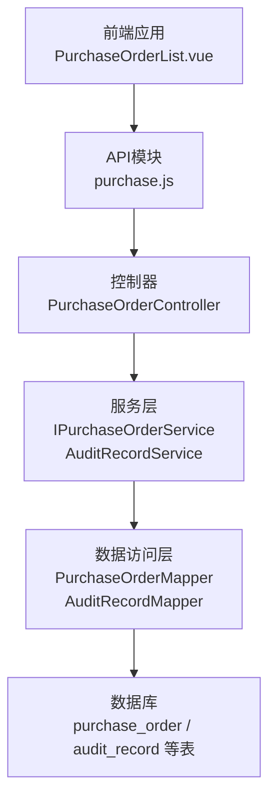
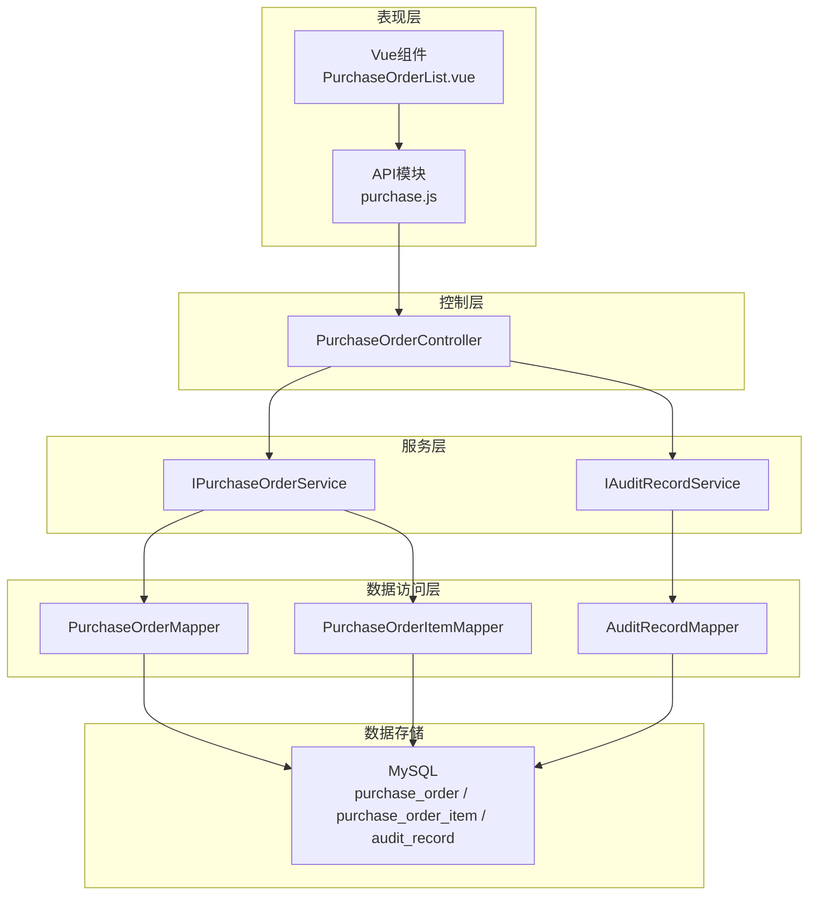
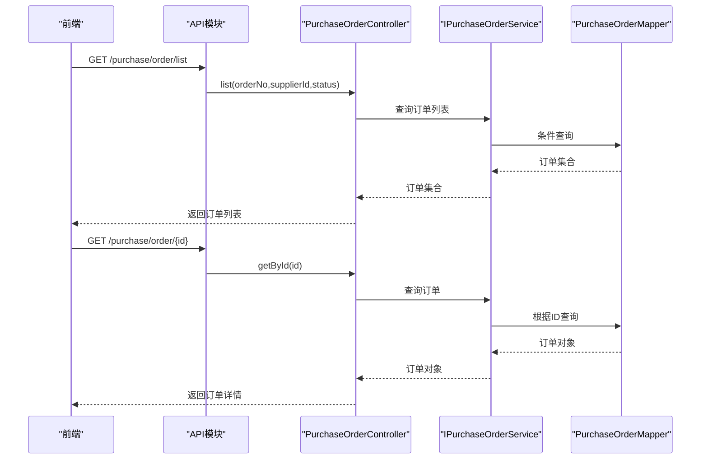
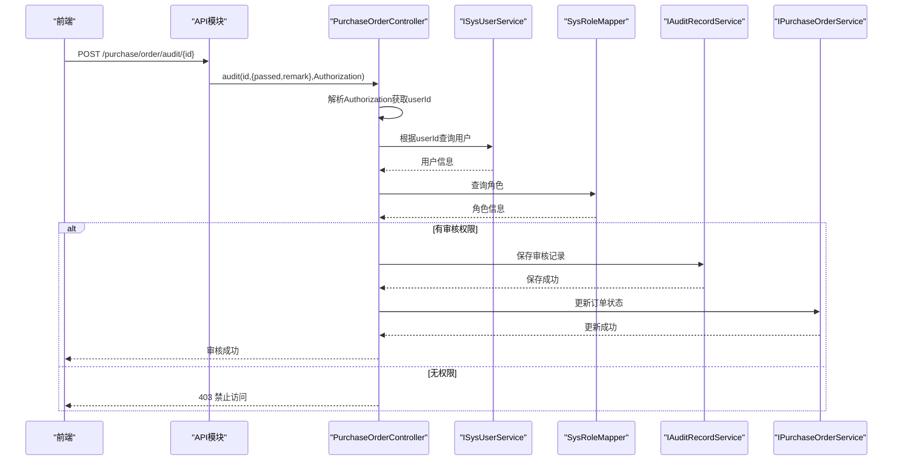
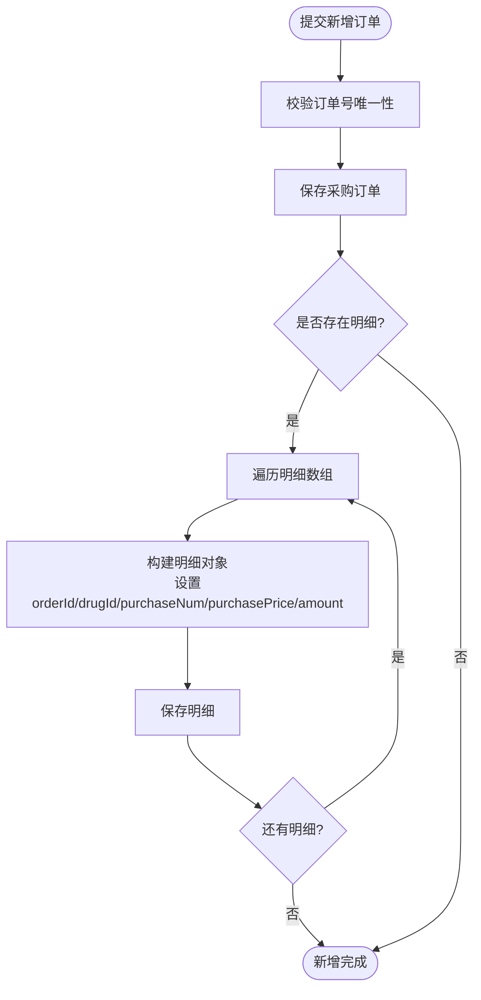
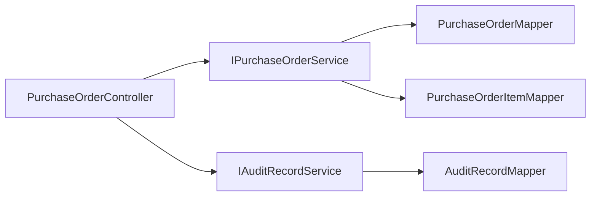
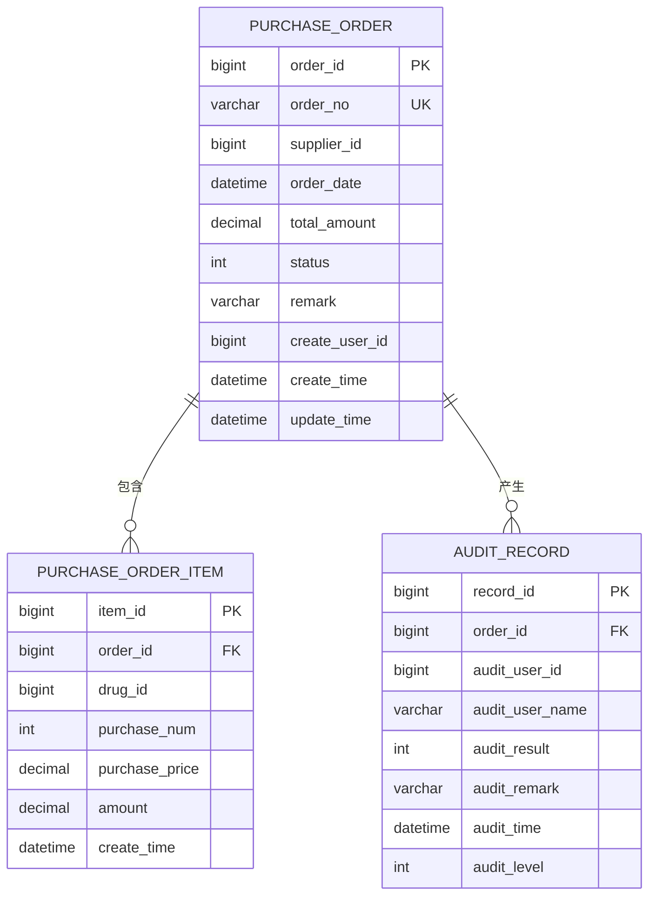
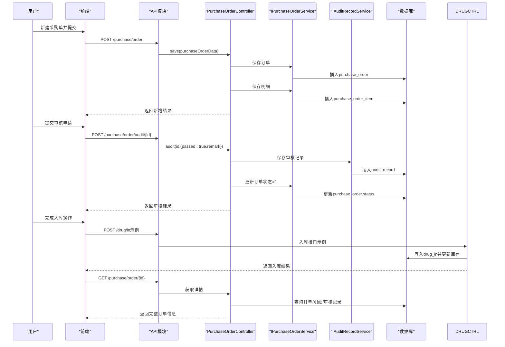

# 采购管理API

<cite>
**本文引用的文件**
- [PurchaseOrderController.java](file://src/main/java/com/hospital/drugmanagement/controller/PurchaseOrderController.java)
- [PurchaseOrder.java](file://src/main/java/com/hospital/drugmanagement/entity/PurchaseOrder.java)
- [PurchaseOrderItem.java](file://src/main/java/com/hospital/drugmanagement/entity/PurchaseOrderItem.java)
- [IPurchaseOrderService.java](file://src/main/java/com/hospital/drugmanagement/service/IPurchaseOrderService.java)
- [PurchaseOrderServiceImpl.java](file://src/main/java/com/hospital/drugmanagement/service/impl/PurchaseOrderServiceImpl.java)
- [PurchaseOrderMapper.java](file://src/main/java/com/hospital/drugmanagement/mapper/PurchaseOrderMapper.java)
- [PurchaseOrderItemMapper.java](file://src/main/java/com/hospital/drugmanagement/mapper/PurchaseOrderItemMapper.java)
- [AuditRecord.java](file://src/main/java/com/hospital/drugmanagement/entity/AuditRecord.java)
- [IAuditRecordService.java](file://src/main/java/com/hospital/drugmanagement/service/IAuditRecordService.java)
- [AuditRecordServiceImpl.java](file://src/main/java/com/hospital/drugmanagement/service/impl/AuditRecordServiceImpl.java)
- [purchase.js](file://drug-front/src/api/purchase.js)
- [PurchaseOrderList.vue](file://drug-front/src/views/purchase/PurchaseOrderList.vue)
- [init.sql](file://src/main/resources/db/init.sql)
- [hospital_drug.sql](file://hospital_drug.sql)
- [Result.java](file://src/main/java/com/hospital/drugmanagement/dto/Result.java)
</cite>

## 目录
1. [简介](#简介)
2. [项目结构](#项目结构)
3. [核心组件](#核心组件)
4. [架构总览](#架构总览)
5. [详细组件分析](#详细组件分析)
6. [依赖分析](#依赖分析)
7. [性能考虑](#性能考虑)
8. [故障排查指南](#故障排查指南)
9. [结论](#结论)
10. [附录](#附录)

## 简介
本文件为药品管理系统中的“采购管理API”综合文档，覆盖采购订单的全生命周期接口，包括创建、查询、编辑、删除、审核、作废等基础能力；阐述采购订单状态流转与审核流程；说明权限控制机制；介绍采购订单明细管理、批量操作、导入导出等扩展能力；并给出与库存入库、财务结算的关联处理建议及端到端业务流程示例。

## 项目结构
后端采用Spring Boot + MyBatis-Plus架构，按领域分层组织：
- 控制器层：提供REST接口
- 服务层：封装业务逻辑
- 数据访问层：基于MyBatis-Plus Mapper
- 实体层：对应数据库表结构
- DTO层：统一响应封装

前端采用Vue 3 + Element Plus，通过API模块调用后端接口。

图表来源
- [PurchaseOrderController.java:1-396](file://src/main/java/com/hospital/drugmanagement/controller/PurchaseOrderController.java#L1-L396)
- [purchase.js:1-63](file://drug-front/src/api/purchase.js#L1-L63)
- [PurchaseOrderList.vue:1-650](file://drug-front/src/views/purchase/PurchaseOrderList.vue#L1-L650)

章节来源
- [PurchaseOrderController.java:1-396](file://src/main/java/com/hospital/drugmanagement/controller/PurchaseOrderController.java#L1-L396)
- [purchase.js:1-63](file://drug-front/src/api/purchase.js#L1-L63)
- [PurchaseOrderList.vue:1-650](file://drug-front/src/views/purchase/PurchaseOrderList.vue#L1-L650)

## 核心组件
- 采购订单实体：包含订单号、供应商、订单日期、总金额、状态、备注、创建人等字段
- 采购订单明细实体：包含药品、采购数量、单价、小计金额
- 审核记录实体：记录审核人、审核结果、审核意见、审核时间、审核级别
- 控制器：提供列表查询、详情查询、新增、修改、删除、审核、作废等接口
- 服务层：封装订单与明细的持久化、审核记录维护
- 前端页面：提供采购单列表、详情、新建、审核、作废等交互

章节来源
- [PurchaseOrder.java:1-40](file://src/main/java/com/hospital/drugmanagement/entity/PurchaseOrder.java#L1-L40)
- [PurchaseOrderItem.java:1-35](file://src/main/java/com/hospital/drugmanagement/entity/PurchaseOrderItem.java#L1-L35)
- [AuditRecord.java:1-35](file://src/main/java/com/hospital/drugmanagement/entity/AuditRecord.java#L1-L35)
- [PurchaseOrderController.java:52-396](file://src/main/java/com/hospital/drugmanagement/controller/PurchaseOrderController.java#L52-L396)

## 架构总览
后端采用分层架构，控制器负责HTTP请求映射与参数校验，服务层封装业务规则，数据访问层通过MyBatis-Plus简化SQL编写。前端通过API模块调用后端REST接口，实现采购订单的增删改查与审核流程。

图表来源
- [PurchaseOrderController.java:1-396](file://src/main/java/com/hospital/drugmanagement/controller/PurchaseOrderController.java#L1-L396)
- [IPurchaseOrderService.java:1-7](file://src/main/java/com/hospital/drugmanagement/service/IPurchaseOrderService.java#L1-L7)
- [IAuditRecordService.java:1-24](file://src/main/java/com/hospital/drugmanagement/service/IAuditRecordService.java#L1-L24)
- [PurchaseOrderMapper.java:1-7](file://src/main/java/com/hospital/drugmanagement/mapper/PurchaseOrderMapper.java#L1-L7)
- [PurchaseOrderItemMapper.java:1-7](file://src/main/java/com/hospital/drugmanagement/mapper/PurchaseOrderItemMapper.java#L1-L7)
- [AuditRecord.java:1-35](file://src/main/java/com/hospital/drugmanagement/entity/AuditRecord.java#L1-L35)

## 详细组件分析

### 1. 采购订单基础接口
- 列表查询：支持按订单号、供应商、状态过滤
- 详情查询：返回订单基本信息、明细、审核记录
- 新增：校验订单号唯一性，保存订单与明细
- 修改：校验订单号唯一性（排除自身）
- 删除：按ID删除

图表来源
- [PurchaseOrderController.java:52-179](file://src/main/java/com/hospital/drugmanagement/controller/PurchaseOrderController.java#L52-L179)
- [PurchaseOrderMapper.java:1-7](file://src/main/java/com/hospital/drugmanagement/mapper/PurchaseOrderMapper.java#L1-L7)

章节来源
- [PurchaseOrderController.java:52-179](file://src/main/java/com/hospital/drugmanagement/controller/PurchaseOrderController.java#L52-L179)

### 2. 采购订单状态流转与审核流程
- 状态定义：0待审核、1已审核、2已入库、3已取消、4审核不通过
- 审核接口：携带passed与remark，校验用户权限（ADMIN或AUDITOR），写入审核记录并更新订单状态
- 作废接口：仅允许在0或1状态下作废

图表来源
- [PurchaseOrderController.java:278-364](file://src/main/java/com/hospital/drugmanagement/controller/PurchaseOrderController.java#L278-L364)
- [IAuditRecordService.java:10-22](file://src/main/java/com/hospital/drugmanagement/service/IAuditRecordService.java#L10-L22)

章节来源
- [PurchaseOrderController.java:278-364](file://src/main/java/com/hospital/drugmanagement/controller/PurchaseOrderController.java#L278-L364)
- [AuditRecordServiceImpl.java:19-31](file://src/main/java/com/hospital/drugmanagement/service/impl/AuditRecordServiceImpl.java#L19-L31)

### 3. 采购订单明细管理
- 新增订单时，同时保存明细项（drugId、purchaseNum、purchasePrice、amount）
- 详情接口返回明细列表，包含药品名称、规格、单位等信息

图表来源
- [PurchaseOrderController.java:181-233](file://src/main/java/com/hospital/drugmanagement/controller/PurchaseOrderController.java#L181-L233)
- [PurchaseOrderItem.java:14-35](file://src/main/java/com/hospital/drugmanagement/entity/PurchaseOrderItem.java#L14-L35)

章节来源
- [PurchaseOrderController.java:181-233](file://src/main/java/com/hospital/drugmanagement/controller/PurchaseOrderController.java#L181-L233)
- [PurchaseOrderItem.java:14-35](file://src/main/java/com/hospital/drugmanagement/entity/PurchaseOrderItem.java#L14-L35)

### 4. 权限控制与安全
- 审核接口通过Authorization头解析用户ID
- 校验用户角色，仅ADMIN与AUDITOR可执行审核
- 作废接口限制状态范围

章节来源
- [PurchaseOrderController.java:278-364](file://src/main/java/com/hospital/drugmanagement/controller/PurchaseOrderController.java#L278-L364)

### 5. 前端集成与交互
- 前端通过API模块调用后端接口
- 列表页支持搜索、分页、状态展示、操作按钮（详情、审核、作废）
- 新建页支持供应商筛选、药品联动、金额计算、表单校验

章节来源
- [purchase.js:1-63](file://drug-front/src/api/purchase.js#L1-L63)
- [PurchaseOrderList.vue:1-650](file://drug-front/src/views/purchase/PurchaseOrderList.vue#L1-L650)

## 依赖分析
- 控制器依赖服务层接口，服务层依赖Mapper接口
- 审核流程依赖用户与角色信息进行权限判断
- 数据一致性通过事务保证（由MyBatis-Plus默认行为保障）

图表来源
- [PurchaseOrderController.java:31-50](file://src/main/java/com/hospital/drugmanagement/controller/PurchaseOrderController.java#L31-L50)
- [IPurchaseOrderService.java:1-7](file://src/main/java/com/hospital/drugmanagement/service/IPurchaseOrderService.java#L1-L7)
- [IAuditRecordService.java:1-24](file://src/main/java/com/hospital/drugmanagement/service/IAuditRecordService.java#L1-L24)

章节来源
- [PurchaseOrderController.java:31-50](file://src/main/java/com/hospital/drugmanagement/controller/PurchaseOrderController.java#L31-L50)
- [IPurchaseOrderService.java:1-7](file://src/main/java/com/hospital/drugmanagement/service/IPurchaseOrderService.java#L1-L7)
- [IAuditRecordService.java:1-24](file://src/main/java/com/hospital/drugmanagement/service/IAuditRecordService.java#L1-L24)

## 性能考虑
- 列表查询建议在数据库层面建立索引（如供应商ID、订单号、状态等）
- 大数据量分页查询需结合分页参数与排序字段优化
- 审核记录查询按审核级别与时间排序，建议在审核记录表建立复合索引
- 前端分页与搜索参数应合理设置，避免一次性加载过多数据

## 故障排查指南
- 接口返回错误码与消息：统一通过Result封装，便于前端识别
- 常见问题
  - 审核失败：检查Authorization头格式与用户角色
  - 订单号重复：新增/修改时校验唯一性
  - 作废失败：确认订单状态是否允许作废
- 建议开启日志与异常捕获，定位具体异常原因

章节来源
- [Result.java:1-99](file://src/main/java/com/hospital/drugmanagement/dto/Result.java#L1-L99)
- [PurchaseOrderController.java:102-107](file://src/main/java/com/hospital/drugmanagement/controller/PurchaseOrderController.java#L102-L107)
- [PurchaseOrderController.java:227-231](file://src/main/java/com/hospital/drugmanagement/controller/PurchaseOrderController.java#L227-L231)
- [PurchaseOrderController.java:358-362](file://src/main/java/com/hospital/drugmanagement/controller/PurchaseOrderController.java#L358-L362)

## 结论
本采购管理API提供了完整的采购订单生命周期管理能力，涵盖基础CRUD、状态流转、审核流程与权限控制。通过清晰的前后端分离设计与统一响应封装，能够满足医院药品采购场景下的核心需求。后续可在预算控制、供应商选择、价格比较、批量操作、导入导出等方面进一步扩展。

## 附录

### A. 数据模型图

图表来源
- [init.sql:127-155](file://src/main/resources/db/init.sql#L127-L155)
- [init.sql:226-238](file://src/main/resources/db/init.sql#L226-L238)

### B. API接口清单
- GET /api/purchase/order/list：查询采购订单列表（支持订单号、供应商、状态过滤）
- GET /api/purchase/order/{id}：获取采购订单详情（含明细与审核记录）
- POST /api/purchase/order：新增采购订单（含明细）
- PUT /api/purchase/order：修改采购订单
- DELETE /api/purchase/order/{id}：删除采购订单
- POST /api/purchase/order/audit/{id}：审核采购订单（传入passed与remark）
- POST /api/purchase/order/cancel/{id}：作废采购订单

章节来源
- [PurchaseOrderController.java:52-396](file://src/main/java/com/hospital/drugmanagement/controller/PurchaseOrderController.java#L52-L396)

### C. 业务流程示例：从下单到入库

图表来源
- [PurchaseOrderController.java:181-396](file://src/main/java/com/hospital/drugmanagement/controller/PurchaseOrderController.java#L181-L396)
- [purchase.js:1-63](file://drug-front/src/api/purchase.js#L1-L63)
- [PurchaseOrderList.vue:410-638](file://drug-front/src/views/purchase/PurchaseOrderList.vue#L410-L638)

### D. 数据库初始化与角色权限
- 初始化脚本包含采购订单、明细、审核记录等核心表结构
- 默认角色：ADMIN（系统管理员）、AUDITOR（采购审核员）、USER（普通用户）
- 前端页面根据用户角色动态显示审核按钮

章节来源
- [init.sql:127-155](file://src/main/resources/db/init.sql#L127-L155)
- [init.sql:226-238](file://src/main/resources/db/init.sql#L226-L238)
- [init.sql:242-285](file://src/main/resources/db/init.sql#L242-L285)
- [PurchaseOrderList.vue:320-324](file://drug-front/src/views/purchase/PurchaseOrderList.vue#L320-L324)