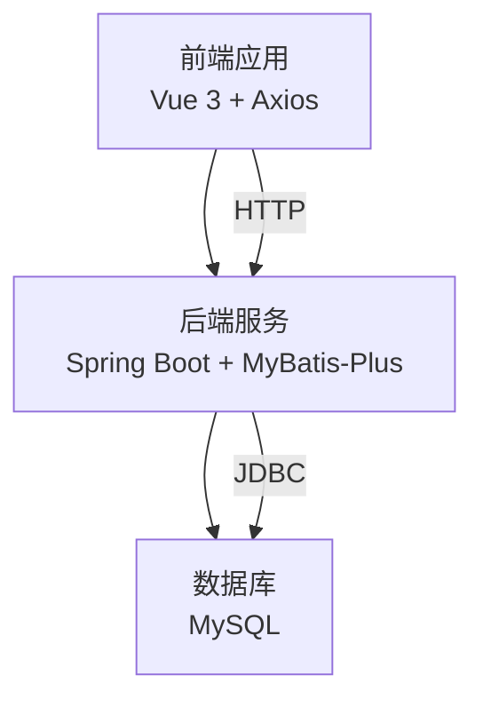
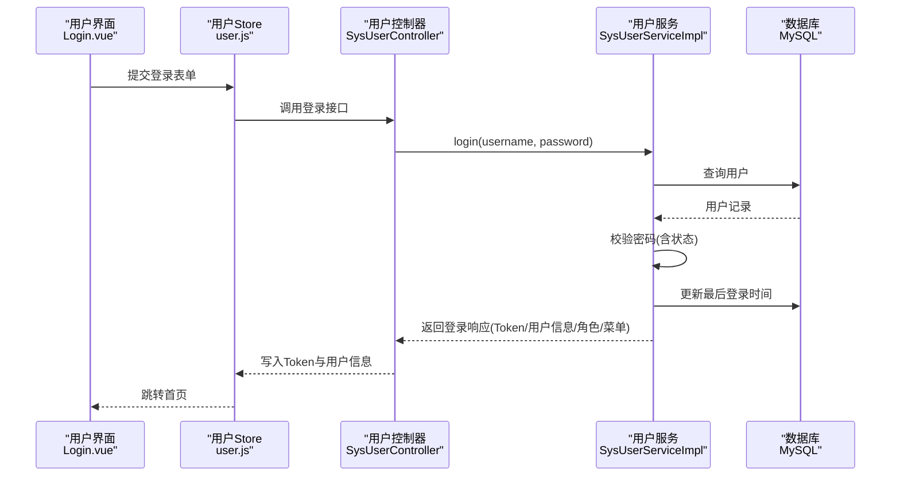
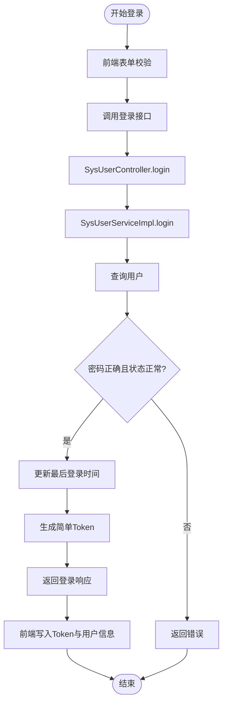
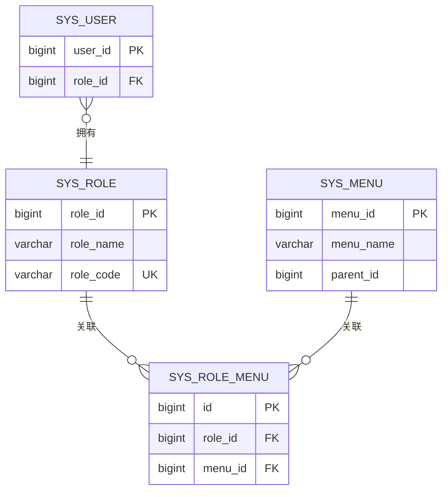
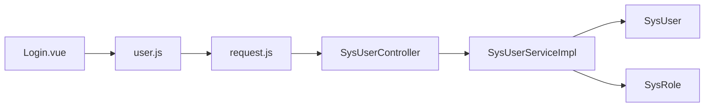

# 安全设计

<cite>
**本文引用的文件**
- [CorsConfig.java](file://src/main/java/com/hospital/drugmanagement/config/CorsConfig.java)
- [application.yml](file://src/main/resources/application.yml)
- [SysUserController.java](file://src/main/java/com/hospital/drugmanagement/controller/SysUserController.java)
- [SysUserServiceImpl.java](file://src/main/java/com/hospital/drugmanagement/service/impl/SysUserServiceImpl.java)
- [LoginRequest.java](file://src/main/java/com/hospital/drugmanagement/dto/LoginRequest.java)
- [LoginResponse.java](file://src/main/java/com/hospital/drugmanagement/dto/LoginResponse.java)
- [SysUser.java](file://src/main/java/com/hospital/drugmanagement/entity/SysUser.java)
- [SysRole.java](file://src/main/java/com/hospital/drugmanagement/entity/SysRole.java)
- [request.js](file://drug-front/src/utils/request.js)
- [user.js](file://drug-front/src/store/user.js)
- [Login.vue](file://drug-front/src/views/Login.vue)
- [index.js](file://drug-front/src/router/index.js)
- [init.sql](file://src/main/resources/db/init.sql)
- [hospital_drug.sql](file://hospital_drug.sql)
- [LOGIN_SETUP_README.md](file://LOGIN_SETUP_README.md)
</cite>

## 目录
1. [简介](#简介)
2. [项目结构](#项目结构)
3. [核心组件](#核心组件)
4. [架构总览](#架构总览)
5. [详细组件分析](#详细组件分析)
6. [依赖分析](#依赖分析)
7. [性能考虑](#性能考虑)
8. [故障排查指南](#故障排查指南)
9. [结论](#结论)
10. [附录](#附录)

## 简介
本文件面向医院药品管理系统，系统性梳理其安全设计现状与改进方向，覆盖认证与会话、权限控制、输入验证与过滤、数据安全、业务安全控制、安全配置与运维建议等维度。当前系统在认证与权限模型上具备基础能力，但在生产级安全（如JWT、密码加密、CORS、CSRF、审计与日志脱敏等方面）仍需补齐。

## 项目结构
系统采用前后端分离架构：
- 后端：Spring Boot + MyBatis-Plus，提供REST API与基础RBAC模型
- 前端：Vue 3 + Element Plus，通过Axios统一请求拦截与路由守卫实现登录态管理
- 数据库：MySQL，包含系统用户、角色、菜单及业务表

**图表来源**
- [application.yml:14-24](file://src/main/resources/application.yml#L14-L24)
- [CorsConfig.java:8-18](file://src/main/java/com/hospital/drugmanagement/config/CorsConfig.java#L8-L18)

**章节来源**
- [application.yml:1-24](file://src/main/resources/application.yml#L1-L24)
- [CorsConfig.java:1-19](file://src/main/java/com/hospital/drugmanagement/config/CorsConfig.java#L1-L19)

## 核心组件
- 认证与会话
  - 登录请求DTO与响应DTO定义了Token、用户信息、角色与菜单结构
  - 控制器负责接收登录请求、调用服务层进行校验与Token生成，并返回响应
  - 服务层执行参数校验、用户查询、密码验证、状态检查、最后登录时间更新与Token构建
  - 前端通过Axios拦截器自动附加Authorization头，Pinia Store持久化Token与用户信息
- 权限控制
  - 基于角色的菜单权限：角色与菜单通过sys_role_menu关联，登录时按角色加载菜单
  - 当前未实现细粒度的操作权限与数据权限控制
- 输入验证与过滤
  - 前端对用户名、密码进行基础必填与长度校验
  - 后端对用户名、密码非空校验；密码采用MD5+固定盐值存储
- 数据安全
  - 传输：未启用TLS；数据库连接未强制SSL
  - 存储：密码采用MD5+固定盐值，安全性不足
  - 日志与审计：未见专门的日志脱敏与审计追踪实现
- 业务安全
  - 未见CSRF防护、重复提交防护、频率限制与异常行为检测

**章节来源**
- [LoginRequest.java:1-37](file://src/main/java/com/hospital/drugmanagement/dto/LoginRequest.java#L1-L37)
- [LoginResponse.java:1-128](file://src/main/java/com/hospital/drugmanagement/dto/LoginResponse.java#L1-L128)
- [SysUserController.java:43-68](file://src/main/java/com/hospital/drugmanagement/controller/SysUserController.java#L43-L68)
- [SysUserServiceImpl.java:42-102](file://src/main/java/com/hospital/drugmanagement/service/impl/SysUserServiceImpl.java#L42-L102)
- [request.js:12-25](file://drug-front/src/utils/request.js#L12-L25)
- [user.js:20-38](file://drug-front/src/store/user.js#L20-L38)
- [Login.vue:64-72](file://drug-front/src/views/Login.vue#L64-L72)

## 架构总览
下图展示登录与会话流转的关键交互：

**图表来源**
- [SysUserController.java:43-68](file://src/main/java/com/hospital/drugmanagement/controller/SysUserController.java#L43-L68)
- [SysUserServiceImpl.java:42-102](file://src/main/java/com/hospital/drugmanagement/service/impl/SysUserServiceImpl.java#L42-L102)
- [Login.vue:75-92](file://drug-front/src/views/Login.vue#L75-L92)
- [user.js:22-34](file://drug-front/src/store/user.js#L22-L34)

## 详细组件分析

### 认证与会话组件
- 登录流程
  - 前端：表单校验后调用用户Store发起登录请求，Axios自动附加Authorization头
  - 后端：控制器接收请求，服务层执行参数校验、用户查询、密码验证、状态检查、更新最后登录时间，并生成简单Token
  - 响应：返回Token、用户信息、角色与菜单
- Token与会话
  - 当前实现为“token_{userId}_{timestamp}”，非JWT，安全性较低
  - 前端将Token写入localStorage并在后续请求中携带
- 单点登录（SSO）
  - 未实现；当前Token为简单字符串，无法跨域或跨应用共享

**图表来源**
- [SysUserController.java:43-68](file://src/main/java/com/hospital/drugmanagement/controller/SysUserController.java#L43-L68)
- [SysUserServiceImpl.java:42-102](file://src/main/java/com/hospital/drugmanagement/service/impl/SysUserServiceImpl.java#L42-L102)
- [request.js:12-25](file://drug-front/src/utils/request.js#L12-L25)
- [user.js:22-34](file://drug-front/src/store/user.js#L22-L34)

**章节来源**
- [SysUserController.java:43-68](file://src/main/java/com/hospital/drugmanagement/controller/SysUserController.java#L43-L68)
- [SysUserServiceImpl.java:42-102](file://src/main/java/com/hospital/drugmanagement/service/impl/SysUserServiceImpl.java#L42-L102)
- [request.js:12-25](file://drug-front/src/utils/request.js#L12-L25)
- [user.js:22-34](file://drug-front/src/store/user.js#L22-L34)
- [Login.vue:64-72](file://drug-front/src/views/Login.vue#L64-L72)

### 权限控制策略
- 角色与菜单
  - sys_role与sys_menu通过sys_role_menu关联，登录时按角色加载菜单
  - 登录响应包含roles与menus字段，前端据此渲染菜单
- 操作权限与数据权限
  - 未实现；当前仅基于角色的菜单可见性控制
- RBAC模型现状
  - 角色与菜单关联完整，但未见基于资源的操作权限矩阵与数据范围控制

**图表来源**
- [init.sql:24-58](file://src/main/resources/db/init.sql#L24-L58)
- [hospital_drug.sql:241-267](file://hospital_drug.sql#L241-L267)

**章节来源**
- [init.sql:24-58](file://src/main/resources/db/init.sql#L24-L58)
- [hospital_drug.sql:241-267](file://hospital_drug.sql#L241-L267)
- [SysUserServiceImpl.java:84-99](file://src/main/java/com/hospital/drugmanagement/service/impl/SysUserServiceImpl.java#L84-L99)

### 输入验证与过滤
- 前端
  - 登录表单对用户名必填、密码必填与最小长度进行校验
- 后端
  - 对用户名、密码进行非空校验
  - 密码采用MD5+固定盐值存储，存在安全风险
- 缺失项
  - SQL注入：未见参数化查询外的动态拼接；建议统一使用MyBatis-Plus或JPA
  - XSS：未见HTML转义或内容安全策略（CSP）
  - CSRF：未见CSRF Token或同源策略约束
  - 参数校验：可引入Bean Validation与全局异常处理

**章节来源**
- [Login.vue:64-72](file://drug-front/src/views/Login.vue#L64-L72)
- [SysUserController.java:258-296](file://src/main/java/com/hospital/drugmanagement/controller/SysUserController.java#L258-L296)
- [SysUserServiceImpl.java:44-46](file://src/main/java/com/hospital/drugmanagement/service/impl/SysUserServiceImpl.java#L44-L46)

### 数据安全保护
- 敏感数据加密
  - 密码采用MD5+固定盐值，不满足生产要求；建议迁移到BCrypt或Argon2
- 传输安全（TLS）
  - application.yml中数据库URL未启用SSL；建议开启SSL与证书校验
- 日志脱敏与审计追踪
  - 未见专门的日志脱敏策略与审计表/埋点实现
- 建议
  - 引入Spring Security + JWT，启用HTTPS/TLS
  - 对日志中的敏感字段（如密码、手机号、邮箱）进行脱敏输出

**章节来源**
- [SysUserServiceImpl.java:39-39](file://src/main/java/com/hospital/drugmanagement/service/impl/SysUserServiceImpl.java#L39-L39)
- [application.yml:4-7](file://src/main/resources/application.yml#L4-L7)
- [LOGIN_SETUP_README.md:129-141](file://LOGIN_SETUP_README.md#L129-L141)

### 业务安全控制
- 重复提交防护
  - 未实现；可在后端引入Redis + Token机制或幂等Key
- 频率限制
  - 未实现；建议基于IP或用户维度做速率限制
- 异常行为检测
  - 未实现；建议结合登录失败次数、异常IP、异常时间段建立风控

**章节来源**
- [SysUserController.java:43-68](file://src/main/java/com/hospital/drugmanagement/controller/SysUserController.java#L43-L68)

## 依赖分析
- 组件耦合
  - 控制器依赖服务层与Mapper；服务层依赖实体与菜单服务
  - 前端通过Axios与后端交互，依赖Pinia Store与路由守卫
- 外部依赖
  - Spring MVC、MyBatis-Plus、MySQL驱动
  - 前端Axios、Element Plus、Vue Router、Pinia

**图表来源**
- [Login.vue:50-51](file://drug-front/src/views/Login.vue#L50-L51)
- [user.js:2](file://drug-front/src/store/user.js#L2)
- [request.js:1-9](file://drug-front/src/utils/request.js#L1-L9)
- [SysUserController.java:13-38](file://src/main/java/com/hospital/drugmanagement/controller/SysUserController.java#L13-L38)
- [SysUserServiceImpl.java:9-28](file://src/main/java/com/hospital/drugmanagement/service/impl/SysUserServiceImpl.java#L9-L28)

**章节来源**
- [SysUserController.java:13-38](file://src/main/java/com/hospital/drugmanagement/controller/SysUserController.java#L13-L38)
- [SysUserServiceImpl.java:9-28](file://src/main/java/com/hospital/drugmanagement/service/impl/SysUserServiceImpl.java#L9-L28)
- [request.js:1-9](file://drug-front/src/utils/request.js#L1-L9)
- [user.js:1-10](file://drug-front/src/store/user.js#L1-L10)
- [Login.vue:50-51](file://drug-front/src/views/Login.vue#L50-L51)

## 性能考虑
- Token解析为字符串分割，复杂度低但安全性不足；建议迁移到JWT以减少解析成本与提升安全性
- 登录成功后一次性返回菜单列表，前端一次性渲染；建议按需懒加载或分页
- 数据库连接未启用SSL，可能影响部分云厂商合规要求

## 故障排查指南
- 登录失败
  - 检查数据库中sys_user的password是否为加密值；若为明文需更新为加密值或调整服务层逻辑
  - 确认application.yml中的数据库连接配置正确
- 前端请求失败
  - 检查CORS配置是否允许前端域名；当前允许通配符来源
  - 确认Axios baseURL与后端端口一致
- 401未授权
  - 检查localStorage中的token是否存在且格式正确（Bearer前缀）
  - 检查路由守卫是否正确拦截未登录用户

**章节来源**
- [LOGIN_SETUP_README.md:183-191](file://LOGIN_SETUP_README.md#L183-L191)
- [CorsConfig.java:10-17](file://src/main/java/com/hospital/drugmanagement/config/CorsConfig.java#L10-L17)
- [request.js:36-42](file://drug-front/src/utils/request.js#L36-L42)
- [index.js:98-112](file://drug-front/src/router/index.js#L98-L112)

## 结论
当前系统在认证与权限方面具备基础RBAC能力，但生产级安全仍存在明显短板：Token非JWT、密码加密强度不足、未启用TLS、缺少CSRF防护与审计追踪。建议优先完成JWT集成、密码加密升级、TLS启用与CSRF防护，再逐步完善操作权限、数据权限、重复提交与频率限制等高级安全能力。

## 附录

### 安全配置建议清单
- 认证与会话
  - 引入JWT工具类与拦截器，替换简单Token
  - 启用HTTPS与TLS，强制数据库连接SSL
- 权限控制
  - 基于注解的RBAC扩展，细化到资源与操作
  - 引入数据权限（如按机构/仓库维度）
- 输入与输出
  - 前端：XSS防护（富文本场景需白名单）
  - 后端：参数校验、SQL注入防护（MyBatis-Plus默认参数化）
  - CSRF：同源策略 + Token校验
- 数据安全
  - 密码迁移至BCrypt；日志脱敏与敏感字段掩码
  - 审计追踪：统一记录登录、操作、异常事件
- 业务安全
  - 重复提交：Redis + Token
  - 频率限制：基于IP/用户维度
  - 异常行为：风控规则引擎

### 漏洞扫描与渗透测试建议
- 工具
  - 后端：OWASP ZAP、SonarQube静态扫描
  - 前端：ESLint + SAST、CSP检查
  - API：Postman/Ngrok + Burp Suite
- 范围
  - 认证绕过、越权访问、SQL注入、XSS、CSRF、敏感信息泄露
- 频次
  - 开发阶段：每日CI集成扫描
  - 发布前：端到端渗透测试

### 安全事件响应流程
- 事件分类与分级
  - 低危：弱密码、弱会话、日志未脱敏
  - 中危：越权读取、CSRF、XSS
  - 高危：凭证泄露、RCE、DDoS
- 响应步骤
  - 快速隔离、证据保全、影响评估、修复与验证、复盘与加固
- 备份与恢复
  - 数据库定期全备+增量备份，异地容灾
  - 灾难恢复演练（RTO/RPO目标）