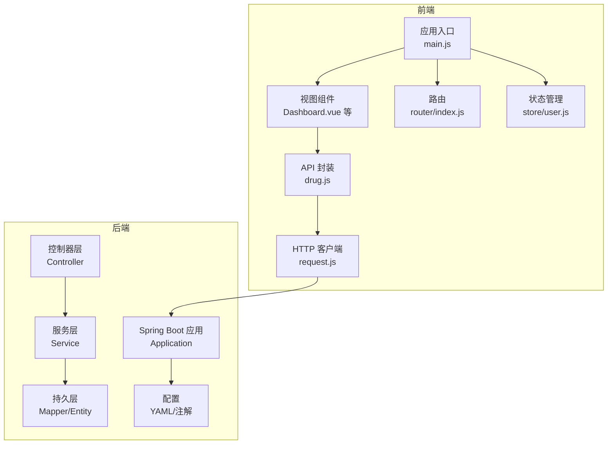
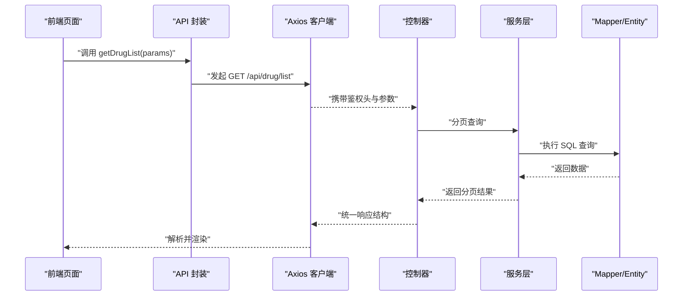
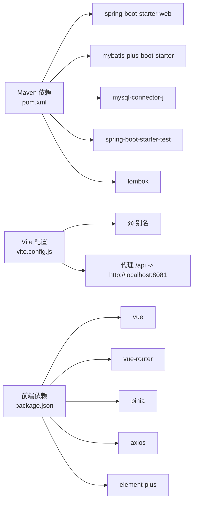

# 代码规范

<cite>
**本文引用的文件**
- [DrugManagementApplication.java](file://src/main/java/com/hospital/drugmanagement/DrugManagementApplication.java)
- [pom.xml](file://pom.xml)
- [application.yml](file://src/main/resources/application.yml)
- [vite.config.js](file://drug-front/vite.config.js)
- [package.json](file://drug-front/package.json)
- [LoginRequest.java](file://src/main/java/com/hospital/drugmanagement/dto/LoginRequest.java)
- [DrugInfoController.java](file://src/main/java/com/hospital/drugmanagement/controller/DrugInfoController.java)
- [DrugInfoServiceImpl.java](file://src/main/java/com/hospital/drugmanagement/service/impl/DrugInfoServiceImpl.java)
- [MyMetaObjectHandler.java](file://src/main/java/com/hospital/drugmanagement/common/handler/MyMetaObjectHandler.java)
- [AutoFill.java](file://src/main/java/com/hospital/drugmanagement/common/anno/AutoFill.java)
- [drug.js](file://drug-front/src/api/drug.js)
- [request.js](file://drug-front/src/utils/request.js)
- [Dashboard.vue](file://drug-front/src/views/Dashboard.vue)
- [App.vue](file://drug-front/src/App.vue)
- [main.js](file://drug-front/src/main.js)
</cite>

## 目录
1. [引言](#引言)
2. [项目结构](#项目结构)
3. [核心组件](#核心组件)
4. [架构总览](#架构总览)
5. [详细组件分析](#详细组件分析)
6. [依赖分析](#依赖分析)
7. [性能考虑](#性能考虑)
8. [故障排查指南](#故障排查指南)
9. [结论](#结论)
10. [附录](#附录)

## 引言
本文件旨在为“药物管理系统”提供统一的代码规范与最佳实践，覆盖 Java 后端与 Vue.js 前端两部分。内容包括命名规范、注释规范、异常与日志处理、代码格式化、文件组织与导入顺序、API 调用规范、状态管理与样式组织等，并结合现有代码库中的实现给出正反示例与改进建议。

## 项目结构
项目采用前后端分离架构：
- 后端基于 Spring Boot 3 + MyBatis-Plus，使用 Maven 管理依赖与构建。
- 前端基于 Vue 3 + Vite + Element Plus + Pinia，通过 Axios 发起 API 请求，路由由 Vue Router 管理。

图表来源
- [DrugManagementApplication.java:14-33](file://src/main/java/com/hospital/drugmanagement/DrugManagementApplication.java#L14-L33)
- [application.yml:14-24](file://src/main/resources/application.yml#L14-L24)
- [main.js:1-26](file://drug-front/src/main.js#L1-L26)
- [Dashboard.vue:1-226](file://drug-front/src/views/Dashboard.vue#L1-L226)
- [drug.js:1-45](file://drug-front/src/api/drug.js#L1-L45)
- [request.js:1-56](file://drug-front/src/utils/request.js#L1-L56)

章节来源
- [pom.xml:1-119](file://pom.xml#L1-L119)
- [application.yml:1-24](file://src/main/resources/application.yml#L1-L24)
- [vite.config.js:1-22](file://drug-front/vite.config.js#L1-L22)
- [package.json:1-29](file://drug-front/package.json#L1-L29)

## 核心组件
- 后端应用入口负责组件扫描与导入增强，确保控制器被纳入 Spring 容器。
- 控制器层统一返回结果结构，包含状态码、消息与数据；异常统一捕获并转换为统一响应。
- 服务层基于 MyBatis-Plus 的 ServiceImpl 复用基础 CRUD，必要时扩展自定义业务逻辑。
- 通用自动填充处理器通过注解驱动字段填充，配合日志输出便于调试与审计。
- 前端通过 Axios 封装统一请求客户端，集中处理鉴权头、错误提示与路由跳转。

章节来源
- [DrugManagementApplication.java:14-33](file://src/main/java/com/hospital/drugmanagement/DrugManagementApplication.java#L14-L33)
- [DrugInfoController.java:14-169](file://src/main/java/com/hospital/drugmanagement/controller/DrugInfoController.java#L14-L169)
- [DrugInfoServiceImpl.java:1-18](file://src/main/java/com/hospital/drugmanagement/service/impl/DrugInfoServiceImpl.java#L1-L18)
- [MyMetaObjectHandler.java:13-60](file://src/main/java/com/hospital/drugmanagement/common/handler/MyMetaObjectHandler.java#L13-L60)

## 架构总览
后端采用分层架构，前端采用组件化架构，前后端通过 REST 接口通信。统一的响应结构与拦截器机制保证了交互一致性与可观测性。

图表来源
- [drug.js:1-45](file://drug-front/src/api/drug.js#L1-L45)
- [request.js:1-56](file://drug-front/src/utils/request.js#L1-L56)
- [DrugInfoController.java:22-58](file://src/main/java/com/hospital/drugmanagement/controller/DrugInfoController.java#L22-L58)
- [DrugInfoServiceImpl.java:14-18](file://src/main/java/com/hospital/drugmanagement/service/impl/DrugInfoServiceImpl.java#L14-L18)

## 详细组件分析

### Java 后端编码规范

- 类命名
  - 使用帕斯卡命名法，领域类以名词短语表达，如控制器、服务、映射器、DTO、实体等。
  - 示例参考：[DrugInfoController.java:14](file://src/main/java/com/hospital/drugmanagement/controller/DrugInfoController.java#L14)，[DrugInfoServiceImpl.java:14](file://src/main/java/com/hospital/drugmanagement/service/impl/DrugInfoServiceImpl.java#L14)。

- 方法命名
  - 动词+名词结构，清晰表达意图；REST 控制器方法使用语义化动词（如 list、save、update、delete）。
  - 示例参考：[DrugInfoController.java:22-167](file://src/main/java/com/hospital/drugmanagement/controller/DrugInfoController.java#L22-L167)。

- 变量命名
  - 私有成员使用驼峰命名；常量使用全大写下划线或枚举；局部变量简洁明确。
  - 示例参考：[LoginRequest.java:10-18](file://src/main/java/com/hospital/drugmanagement/dto/LoginRequest.java#L10-L18)。

- 注释规范
  - 类与公共方法使用 JavaDoc 注释，简述职责、参数与返回值；内部注释说明关键逻辑。
  - 示例参考：[LoginRequest.java:5-7](file://src/main/java/com/hospital/drugmanagement/dto/LoginRequest.java#L5-L7)，[MyMetaObjectHandler.java:13-16](file://src/main/java/com/hospital/drugmanagement/common/handler/MyMetaObjectHandler.java#L13-L16)。

- 异常处理
  - 控制器层统一 try-catch 包裹，构造统一响应结构；服务层异常向上抛出或转换为业务可读错误。
  - 示例参考：[DrugInfoController.java:31-57](file://src/main/java/com/hospital/drugmanagement/controller/DrugInfoController.java#L31-L57)。

- 日志记录
  - 使用 SLF4J 记录关键流程与错误；避免直接打印堆栈，优先记录上下文信息。
  - 示例参考：[MyMetaObjectHandler.java:18-59](file://src/main/java/com/hospital/drugmanagement/common/handler/MyMetaObjectHandler.java#L18-L59)。

- 代码格式化
  - 使用 Maven 编译插件指定源/目标版本与注解处理器路径，确保 Lombok 等注解正确生效。
  - 示例参考：[pom.xml:91-102](file://pom.xml#L91-L102)。

- 文件组织与导入顺序
  - 包结构清晰分层：controller、service、mapper、entity、dto、common、config；导入顺序遵循标准 Java 规范。
  - 示例参考：[DrugManagementApplication.java:18-24](file://src/main/java/com/hospital/drugmanagement/DrugManagementApplication.java#L18-L24)。

- 统一响应结构
  - 控制器返回包含 code、msg、data、total 的结构，便于前端统一处理。
  - 示例参考：[DrugInfoController.java:30-57](file://src/main/java/com/hospital/drugmanagement/controller/DrugInfoController.java#L30-L57)。

- 自动填充注解与日志
  - 通过自定义注解与处理器实现字段自动填充，并记录日志便于追踪。
  - 示例参考：[AutoFill.java:6-15](file://src/main/java/com/hospital/drugmanagement/common/anno/AutoFill.java#L6-L15)，[MyMetaObjectHandler.java:21-59](file://src/main/java/com/hospital/drugmanagement/common/handler/MyMetaObjectHandler.java#L21-L59)。

章节来源
- [LoginRequest.java:1-37](file://src/main/java/com/hospital/drugmanagement/dto/LoginRequest.java#L1-L37)
- [DrugInfoController.java:14-169](file://src/main/java/com/hospital/drugmanagement/controller/DrugInfoController.java#L14-L169)
- [DrugInfoServiceImpl.java:1-18](file://src/main/java/com/hospital/drugmanagement/service/impl/DrugInfoServiceImpl.java#L1-L18)
- [MyMetaObjectHandler.java:1-60](file://src/main/java/com/hospital/drugmanagement/common/handler/MyMetaObjectHandler.java#L1-L60)
- [AutoFill.java:1-15](file://src/main/java/com/hospital/drugmanagement/common/anno/AutoFill.java#L1-L15)
- [pom.xml:91-102](file://pom.xml#L91-L102)

### Vue.js 前端编码规范

- 组件命名
  - 组件文件与导出名称采用帕斯卡命名；页面组件位于 views 下，功能模块拆分为独立文件。
  - 示例参考：[Dashboard.vue:1-226](file://drug-front/src/views/Dashboard.vue#L1-L226)。

- 模板语法
  - 使用 Composition API 与 script setup；合理使用 v-if/v-for、事件绑定与插槽；保持模板简洁。
  - 示例参考：[Dashboard.vue:106-127](file://drug-front/src/views/Dashboard.vue#L106-L127)。

- 样式组织
  - 组件内样式使用 scoped；全局样式集中在根组件或主题样式中；避免重复定义。
  - 示例参考：[Dashboard.vue:129-225](file://drug-front/src/views/Dashboard.vue#L129-L225)，[App.vue:8-23](file://drug-front/src/App.vue#L8-L23)。

- 状态管理
  - 使用 Pinia 进行轻量状态管理；仅存放跨页面共享状态；避免在组件内直接修改全局状态。
  - 示例参考：[main.js:19-23](file://drug-front/src/main.js#L19-L23)。

- API 调用规范
  - API 函数集中于 api 目录，统一返回 Promise；请求客户端集中处理 baseURL、超时与拦截器。
  - 示例参考：[drug.js:1-45](file://drug-front/src/api/drug.js#L1-L45)，[request.js:5-56](file://drug-front/src/utils/request.js#L5-L56)。

- 路由与导航
  - 路由按功能模块划分；导航守卫与权限控制在路由层或拦截器中处理；避免硬编码路径。
  - 示例参考：[main.js:8-25](file://drug-front/src/main.js#L8-L25)。

章节来源
- [Dashboard.vue:1-226](file://drug-front/src/views/Dashboard.vue#L1-L226)
- [App.vue:1-24](file://drug-front/src/App.vue#L1-L24)
- [main.js:1-26](file://drug-front/src/main.js#L1-L26)
- [drug.js:1-45](file://drug-front/src/api/drug.js#L1-L45)
- [request.js:1-56](file://drug-front/src/utils/request.js#L1-L56)

### 注释规范与多语言支持

- JavaDoc 注释
  - 类、接口、方法、字段均应提供 JavaDoc；描述用途、参数、返回值与异常场景。
  - 示例参考：[LoginRequest.java:5-7](file://src/main/java/com/hospital/drugmanagement/dto/LoginRequest.java#L5-L7)，[MyMetaObjectHandler.java:13-16](file://src/main/java/com/hospital/drugmanagement/common/handler/MyMetaObjectHandler.java#L13-L16)。

- JavaScript 注释
  - 函数与复杂逻辑添加注释；对外暴露的 API 函数需说明入参与返回值。
  - 示例参考：[drug.js:3-10](file://drug-front/src/api/drug.js#L3-L10)，[request.js:11-25](file://drug-front/src/utils/request.js#L11-L25)。

- 多语言注释支持
  - 建议在国际化资源中维护文案，前端组件中使用占位符；后端响应消息可结合国际化策略。
  - 本仓库未见国际化实现，建议后续引入。

章节来源
- [LoginRequest.java:5-7](file://src/main/java/com/hospital/drugmanagement/dto/LoginRequest.java#L5-L7)
- [MyMetaObjectHandler.java:13-16](file://src/main/java/com/hospital/drugmanagement/common/handler/MyMetaObjectHandler.java#L13-L16)
- [drug.js:3-10](file://drug-front/src/api/drug.js#L3-L10)
- [request.js:11-25](file://drug-front/src/utils/request.js#L11-L25)

### 文件组织规范与导入顺序

- 包结构与目录结构
  - 后端：controller → service → impl → mapper → entity → dto → common → config；前端：api、layout、router、store、utils、views。
  - 示例参考：[DrugManagementApplication.java:18-24](file://src/main/java/com/hospital/drugmanagement/DrugManagementApplication.java#L18-L24)，[main.js:1-26](file://drug-front/src/main.js#L1-L26)。

- 导入顺序
  - 标准 Java 导入顺序：第三方库 → JDK 内置 → 项目内包；避免循环依赖。
  - 示例参考：[DrugInfoController.java:1-17](file://src/main/java/com/hospital/drugmanagement/controller/DrugInfoController.java#L1-L17)。

章节来源
- [DrugManagementApplication.java:18-24](file://src/main/java/com/hospital/drugmanagement/DrugManagementApplication.java#L18-L24)
- [DrugInfoController.java:1-17](file://src/main/java/com/hospital/drugmanagement/controller/DrugInfoController.java#L1-L17)
- [main.js:1-26](file://drug-front/src/main.js#L1-L26)

### 代码示例：正确与常见反例

- 正确示例
  - 统一响应结构：控制器返回包含 code、msg、data、total 的 Map。
    - 参考：[DrugInfoController.java:30-57](file://src/main/java/com/hospital/drugmanagement/controller/DrugInfoController.java#L30-L57)
  - 自动填充注解与日志：通过注解标记字段，处理器自动填充并记录日志。
    - 参考：[AutoFill.java:6-15](file://src/main/java/com/hospital/drugmanagement/common/anno/AutoFill.java#L6-L15)，[MyMetaObjectHandler.java:21-59](file://src/main/java/com/hospital/drugmanagement/common/handler/MyMetaObjectHandler.java#L21-L59)
  - Axios 统一拦截器：集中处理鉴权头与错误提示。
    - 参考：[request.js:11-53](file://drug-front/src/utils/request.js#L11-L53)

- 常见反例与改进建议
  - 手动 getter/setter 与 Lombok 冲突：LoginRequest 中手动添加 getter/setter 可能导致 Lombok 注解未生效，建议移除冗余代码。
    - 参考：[LoginRequest.java:20-36](file://src/main/java/com/hospital/drugmanagement/dto/LoginRequest.java#L20-L36)
  - 控制器内硬编码 SQL 条件：应使用条件构造器或分页插件，避免字符串拼接。
    - 参考：[DrugInfoController.java:33-42](file://src/main/java/com/hospital/drugmanagement/controller/DrugInfoController.java#L33-L42)
  - 前端样式未使用 scoped：可能导致样式污染，建议为组件样式添加 scoped。
    - 参考：[Dashboard.vue:129-225](file://drug-front/src/views/Dashboard.vue#L129-L225)

章节来源
- [LoginRequest.java:20-36](file://src/main/java/com/hospital/drugmanagement/dto/LoginRequest.java#L20-L36)
- [DrugInfoController.java:33-42](file://src/main/java/com/hospital/drugmanagement/controller/DrugInfoController.java#L33-L42)
- [Dashboard.vue:129-225](file://drug-front/src/views/Dashboard.vue#L129-L225)
- [request.js:11-53](file://drug-front/src/utils/request.js#L11-L53)

## 依赖分析

图表来源
- [pom.xml:32-84](file://pom.xml#L32-L84)
- [vite.config.js:5-21](file://drug-front/vite.config.js#L5-L21)
- [package.json:13-28](file://drug-front/package.json#L13-L28)

章节来源
- [pom.xml:32-84](file://pom.xml#L32-L84)
- [vite.config.js:5-21](file://drug-front/vite.config.js#L5-L21)
- [package.json:13-28](file://drug-front/package.json#L13-L28)

## 性能考虑
- 后端
  - 使用 MyBatis-Plus 分页插件与条件构造器，避免一次性加载大量数据。
  - 合理使用缓存与索引，减少数据库压力。
  - 控制日志级别，避免在高频路径中输出过多日志。
- 前端
  - 组件懒加载与路由按需加载；避免不必要的重渲染，使用 computed 与 shallowRef。
  - 合理设置请求超时与重试策略，提升用户体验。

## 故障排查指南
- 后端
  - SQL 打印与下划线转驼峰：确认配置项启用 SQL 输出与命名转换。
    - 参考：[application.yml:22-24](file://src/main/resources/application.yml#L22-L24)
  - 自动填充失败：检查注解是否正确标注字段，处理器是否被 Spring 扫描。
    - 参考：[AutoFill.java:6-15](file://src/main/java/com/hospital/drugmanagement/common/anno/AutoFill.java#L6-L15)，[MyMetaObjectHandler.java:16-32](file://src/main/java/com/hospital/drugmanagement/common/handler/MyMetaObjectHandler.java#L16-L32)
- 前端
  - 接口 401：拦截器会清除本地 token 并跳转登录页，检查后端鉴权与前端存储。
    - 参考：[request.js:36-41](file://drug-front/src/utils/request.js#L36-L41)
  - 代理无效：确认 Vite 代理配置与后端端口一致。
    - 参考：[vite.config.js:14-19](file://drug-front/vite.config.js#L14-L19)

章节来源
- [application.yml:22-24](file://src/main/resources/application.yml#L22-L24)
- [AutoFill.java:6-15](file://src/main/java/com/hospital/drugmanagement/common/anno/AutoFill.java#L6-L15)
- [MyMetaObjectHandler.java:16-32](file://src/main/java/com/hospital/drugmanagement/common/handler/MyMetaObjectHandler.java#L16-L32)
- [request.js:36-41](file://drug-front/src/utils/request.js#L36-L41)
- [vite.config.js:14-19](file://drug-front/vite.config.js#L14-L19)

## 结论
本规范总结了项目在命名、注释、异常与日志、统一响应、自动填充、API 调用与状态管理等方面的最佳实践。建议在团队开发中严格执行，并结合 IDE 插件与格式化工具统一风格，持续优化性能与可维护性。

## 附录

### IDE 配置与代码格式化建议
- Java
  - 使用 Maven 编译插件统一源/目标版本与注解处理器。
    - 参考：[pom.xml:91-102](file://pom.xml#L91-L102)
  - 配置 Lombok 注解处理器，避免 getter/setter 冗余。
    - 参考：[pom.xml:92-98](file://pom.xml#L92-L98)
- Vue.js
  - Vite 别名与代理配置，确保开发环境前后端联调顺畅。
    - 参考：[vite.config.js:7-20](file://drug-front/vite.config.js#L7-L20)
  - 前端依赖版本与脚本命令统一管理。
    - 参考：[package.json:8-12](file://drug-front/package.json#L8-L12)，[package.json:13-28](file://drug-front/package.json#L13-L28)

章节来源
- [pom.xml:91-102](file://pom.xml#L91-L102)
- [vite.config.js:7-20](file://drug-front/vite.config.js#L7-L20)
- [package.json:8-12](file://drug-front/package.json#L8-L12)
- [package.json:13-28](file://drug-front/package.json#L13-L28)