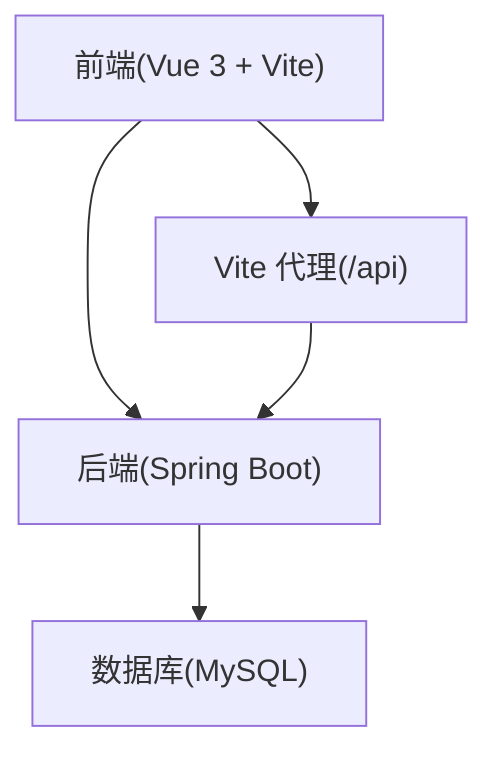
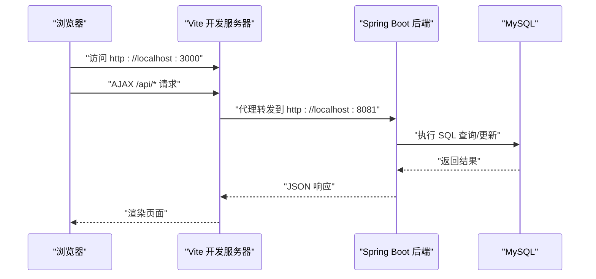
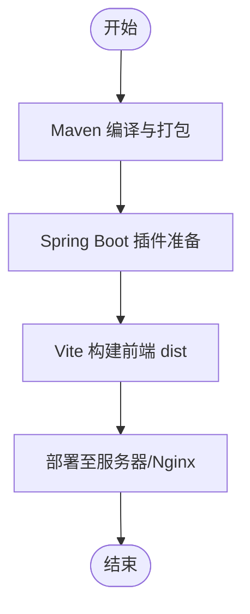
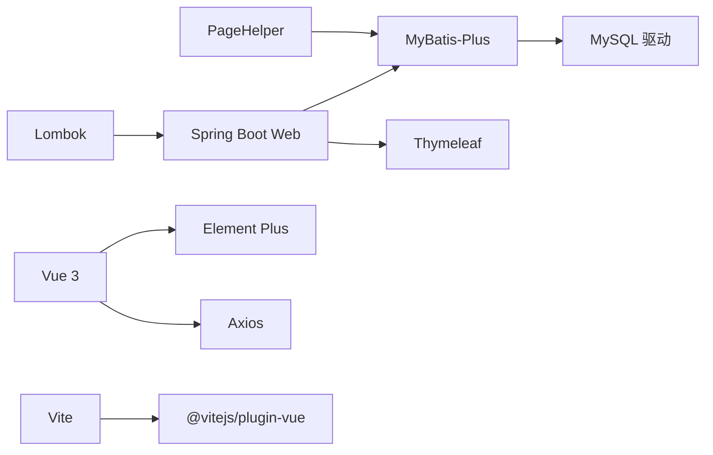

# 开发工具

<cite>
**本文引用的文件**
- [pom.xml](file://pom.xml)
- [.mvn\wrapper\maven-wrapper.properties](file://.mvn/wrapper/maven-wrapper.properties)
- [mvnw.cmd](file://mvnw.cmd)
- [vite.config.js](file://drug-front/vite.config.js)
- [package.json](file://drug-front/package.json)
- [application.yml](file://src/main/resources/application.yml)
- [init_and_start.bat](file://init_and_start.bat)
- [init.sql](file://src/main/resources/db/init.sql)
- [LOGIN_SETUP_README.md](file://LOGIN_SETUP_README.md)
- [.gitignore](file://.gitignore)
- [CorsConfig.java](file://src/main/java/com/hospital/drugmanagement/config/CorsConfig.java)
- [PurchaseOrderController.java](file://src/main/java/com/hospital/drugmanagement/controller/PurchaseOrderController.java)
- [README.md（前端）](file://drug-front/README.md)
- [main.js（前端入口）](file://drug-front/src/main.js)
- [drug.js（前端API）](file://drug-front/src/api/drug.js)
- [report.js（前端API）](file://drug-front/src/api/report.js)
- [hospital_drug.sql](file://hospital_drug.sql)
</cite>

## 目录
1. [简介](#简介)
2. [项目结构](#项目结构)
3. [核心组件](#核心组件)
4. [架构总览](#架构总览)
5. [详细组件分析](#详细组件分析)
6. [依赖分析](#依赖分析)
7. [性能考虑](#性能考虑)
8. [故障排查指南](#故障排查指南)
9. [结论](#结论)
10. [附录](#附录)

## 简介
本文件面向开发团队，系统性梳理本项目的开发工具链与使用方法，覆盖以下方面：
- IDE 配置：IntelliJ IDEA、VS Code 推荐设置、插件与快捷键
- 构建工具：Maven、Vite 配置与打包发布流程
- 调试工具：断点调试、日志分析、性能分析、内存监控
- 数据库工具：Navicat、DBeaver、SQL 开发环境
- 版本控制工具：Git GUI、命令行、图形化工具
- API 测试工具：Postman、Swagger、curl
- 代码质量工具：SonarQube、Checkmarx、静态分析
- 部署工具：Docker、Nginx、监控

## 项目结构
项目采用前后端分离架构：
- 后端：Spring Boot + MyBatis-Plus，使用 Maven 管理依赖与构建
- 前端：Vue 3 + Vite，Element Plus + Pinia，通过代理访问后端 API
- 数据库：MySQL，提供初始化脚本与样例数据
- 配置：后端 application.yml；前端 vite.config.js；Maven wrapper

图表来源
- [vite.config.js:12-20](file://drug-front/vite.config.js#L12-L20)
- [application.yml:14-16](file://src/main/resources/application.yml#L14-L16)

章节来源
- [pom.xml:1-119](file://pom.xml#L1-L119)
- [vite.config.js:1-22](file://drug-front/vite.config.js#L1-L22)
- [application.yml:1-24](file://src/main/resources/application.yml#L1-L24)

## 核心组件
- 后端依赖与构建
  - Spring Boot Web、Thymeleaf、MyBatis-Plus、PageHelper、MySQL 驱动、Lombok
  - Maven 编译插件与 Spring Boot 插件配置
- 前端依赖与构建
  - Vue 3、Vue Router、Pinia、Element Plus、Axios、Vite 插件
  - 开发脚本与构建脚本
- 数据库初始化
  - init.sql 提供完整表结构与默认数据
- 跨域与代理
  - 后端 CorsConfig；前端 Vite 代理至后端端口

章节来源
- [pom.xml:32-84](file://pom.xml#L32-L84)
- [pom.xml:86-116](file://pom.xml#L86-L116)
- [package.json:8-27](file://drug-front/package.json#L8-L27)
- [init.sql:1-312](file://src/main/resources/db/init.sql#L1-L312)
- [CorsConfig.java:7-17](file://src/main/java/com/hospital/drugmanagement/config/CorsConfig.java#L7-L17)
- [vite.config.js:12-20](file://drug-front/vite.config.js#L12-L20)

## 架构总览
前后端交互通过 Vite 代理转发 /api 请求至后端服务，后端通过 MyBatis-Plus 访问 MySQL。

图表来源
- [vite.config.js:14-18](file://drug-front/vite.config.js#L14-L18)
- [application.yml:14-16](file://src/main/resources/application.yml#L14-L16)

## 详细组件分析

### IDE 配置与推荐设置
- IntelliJ IDEA
  - 语言级别：Java 17
  - Maven：使用 Maven Wrapper（.mvn/wrapper），自动下载与缓存
  - Lombok：启用注解处理器
  - Git：使用 .gitignore 中的忽略规则
- VS Code
  - 前端项目目录：drug-front
  - 忽略规则：.vscode/ 目录由 .gitignore 控制
  - 插件建议：Vue Language Features、ESLint、Prettier、REST Client
  - 快捷键建议：Ctrl+Shift+P 打开命令面板；Ctrl+Shift+K 删除行；Ctrl+Shift+上下移动行
- 通用建议
  - 后端统一使用 Lombok 注解减少样板代码
  - 前端使用 Composition API 与 TypeScript（如需）

章节来源
- [pom.xml:29](file://pom.xml#L29)
- [pom.xml:92-101](file://pom.xml#L92-L101)
- [.mvn\wrapper\maven-wrapper.properties:1-4](file://.mvn/wrapper/maven-wrapper.properties#L1-L4)
- [.gitignore:32](file://.gitignore#L32)

### 构建工具：Maven 与 Vite
- Maven
  - Java 版本：17
  - 插件：maven-compiler-plugin（注解处理器）、spring-boot-maven-plugin
  - 依赖：Web、Thymeleaf、MyBatis-Plus、PageHelper、MySQL 驱动、Lombok
- Vite
  - 开发端口：3000
  - 代理：/api -> http://localhost:8081
  - 别名：'@' 指向 src
  - 脚本：dev、build、preview
- 打包与发布
  - 后端：spring-boot:run 或打包为可执行 JAR
  - 前端：npm run build 生成 dist，部署至 Nginx 或静态服务器

图表来源
- [pom.xml:86-116](file://pom.xml#L86-L116)
- [package.json:8-12](file://drug-front/package.json#L8-L12)
- [vite.config.js:12-20](file://drug-front/vite.config.js#L12-L20)

章节来源
- [pom.xml:29](file://pom.xml#L29)
- [pom.xml:86-116](file://pom.xml#L86-L116)
- [package.json:8-27](file://drug-front/package.json#L8-L27)
- [vite.config.js:1-22](file://drug-front/vite.config.js#L1-L22)

### 调试工具：断点调试、日志分析、性能分析、内存监控
- 断点调试
  - 后端：IDE 设置断点于 Controller、Service、Mapper 层，启动 Debug 模式
  - 前端：浏览器 DevTools 设置断点，或在 VS Code 中使用 Debugger for Chrome
- 日志分析
  - application.yml 启用 SQL 输出与下划线转驼峰，便于定位问题
- 性能分析与内存监控
  - 后端：使用 JVM 参数与 VisualVM/JProfiler/Arthas
  - 前端：Chrome Performance 面板分析渲染与网络请求

章节来源
- [application.yml:19-24](file://src/main/resources/application.yml#L19-L24)
- [CorsConfig.java:7-17](file://src/main/java/com/hospital/drugmanagement/config/CorsConfig.java#L7-L17)

### 数据库工具：Navicat、DBeaver、SQL 开发环境
- Navicat/DBeaver
  - 连接参数：主机 localhost，端口 3306，数据库 hospital_drug，用户名 root，密码按需配置
  - 初始化：执行 init.sql 或 hospital_drug.sql
- SQL 开发
  - 使用 DBeaver 的 ER 图查看表关系
  - 在 Navicat 中执行查询与导出数据

章节来源
- [application.yml:3-7](file://src/main/resources/application.yml#L3-L7)
- [init.sql:1-312](file://src/main/resources/db/init.sql#L1-L312)
- [hospital_drug.sql:55-75](file://hospital_drug.sql#L55-L75)

### 版本控制工具：Git GUI、命令行、图形化工具
- 命令行
  - 常用命令：git add、commit、push、pull、branch、checkout、log、diff
- 图形化工具
  - SourceTree、GitHub Desktop、VS Code 内置 Git
- 忽略规则
  - .gitignore 已配置 target、IDE 目录、.vscode 等

章节来源
- [.gitignore:1-33](file://.gitignore#L1-L33)

### API 测试工具：Postman、Swagger、curl
- Postman
  - 导入接口集合，设置 Base URL 为 http://localhost:8081
  - 测试登录、药品、报表等接口
- Swagger
  - 后端已配置跨域，可在浏览器访问 Swagger UI（若集成）
- curl
  - 示例：curl -X GET http://localhost:8081/api/user/login

章节来源
- [LOGIN_SETUP_README.md:30-72](file://LOGIN_SETUP_README.md#L30-L72)
- [CorsConfig.java:7-17](file://src/main/java/com/hospital/drugmanagement/config/CorsConfig.java#L7-L17)

### 代码质量工具：SonarQube、Checkmarx、静态分析
- SonarQube
  - 集成 Maven 插件，执行 sonar:sonar 分析
- Checkmarx
  - 扫描后端 Java 代码与前端 JS/Vue 文件
- 静态分析
  - SpotBugs/PMD/Spotless（Java）；ESLint/Prettier（JS/TS/Vue）

章节来源
- [pom.xml:86-116](file://pom.xml#L86-L116)

### 部署工具：Docker、Nginx、监控
- Docker
  - 后端：打包为 JAR，使用 Spring Boot Docker 镜像或自定义镜像
  - 前端：Nginx 镜像部署 dist 目录
- Nginx
  - 反向代理：将 /api 转发至后端服务
  - 静态资源：指向前端 dist 目录
- 监控
  - 后端：Micrometer + Prometheus + Grafana
  - 前端：浏览器 Performance/Network 面板

章节来源
- [package.json:8-12](file://drug-front/package.json#L8-L12)
- [vite.config.js:12-20](file://drug-front/vite.config.js#L12-L20)

## 依赖分析
- 后端依赖关系
  - Web -> MyBatis-Plus -> MySQL 驱动
  - PageHelper 用于分页
  - Lombok 减少样板代码
- 前端依赖关系
  - Vue 生态 -> Element Plus -> Axios
  - Vite 插件支持热更新与代理

图表来源
- [pom.xml:32-84](file://pom.xml#L32-L84)
- [package.json:13-27](file://drug-front/package.json#L13-L27)

章节来源
- [pom.xml:32-84](file://pom.xml#L32-L84)
- [package.json:13-27](file://drug-front/package.json#L13-L27)

## 性能考虑
- 后端
  - 启用 SQL 日志与下划线转驼峰，便于诊断慢查询
  - 使用 PageHelper 进行分页，避免全表扫描
  - 合理索引：init.sql 中已为常用字段建立索引
- 前端
  - 使用 Vite 的按需加载与 Tree Shaking
  - 将静态资源交由 Nginx 缓存

章节来源
- [application.yml:19-24](file://src/main/resources/application.yml#L19-L24)
- [init.sql:79,118,140,173,192,208:79-79](file://src/main/resources/db/init.sql#L79-L79)
- [README.md（前端）:224-234](file://drug-front/README.md#L224-L234)

## 故障排查指南
- 启动顺序
  - 先启动 MySQL，再执行 init.sql 初始化数据库
  - 启动后端：mvn spring-boot:run 或运行主类
  - 启动前端：cd drug-front && npm install && npm run dev
- 代理与跨域
  - Vite 代理目标端口需与后端一致（默认 8081）
  - 后端 CorsConfig 已允许跨域，确保未被覆盖
- 数据库连接
  - application.yml 中的 URL、用户名、密码需与本地一致
- 常见问题
  - 登录失败：确认密码加密策略与数据库中密码一致
  - 前端无法访问后端：检查代理配置与浏览器控制台 CORS 错误
  - 数据库连接失败：确认 MySQL 服务、数据库存在与凭据正确

章节来源
- [init_and_start.bat:1-11](file://init_and_start.bat#L1-L11)
- [LOGIN_SETUP_README.md:74-128](file://LOGIN_SETUP_README.md#L74-L128)
- [vite.config.js:12-20](file://drug-front/vite.config.js#L12-L20)
- [application.yml:3-7](file://src/main/resources/application.yml#L3-L7)
- [CorsConfig.java:7-17](file://src/main/java/com/hospital/drugmanagement/config/CorsConfig.java#L7-L17)

## 结论
本项目提供了完整的前后端开发工具链：后端基于 Spring Boot + MyBatis-Plus，前端基于 Vue 3 + Vite，配合数据库初始化脚本与跨域配置，能够快速搭建与调试。建议在团队内统一 IDE 插件、代码风格与构建流程，并结合 SonarQube、Docker 与 Nginx 实现持续交付与稳定运维。

## 附录
- 快速启动
  - 初始化数据库：执行 init.sql
  - 启动后端：mvn spring-boot:run
  - 启动前端：cd drug-front && npm install && npm run dev
- 关键配置参考
  - 后端端口与数据源：application.yml
  - 前端代理与别名：vite.config.js
  - Maven 依赖与插件：pom.xml
  - 前端依赖与脚本：package.json

章节来源
- [init_and_start.bat:1-11](file://init_and_start.bat#L1-L11)
- [application.yml:14-16](file://src/main/resources/application.yml#L14-L16)
- [vite.config.js:12-20](file://drug-front/vite.config.js#L12-L20)
- [pom.xml:32-84](file://pom.xml#L32-L84)
- [package.json:8-27](file://drug-front/package.json#L8-L27)