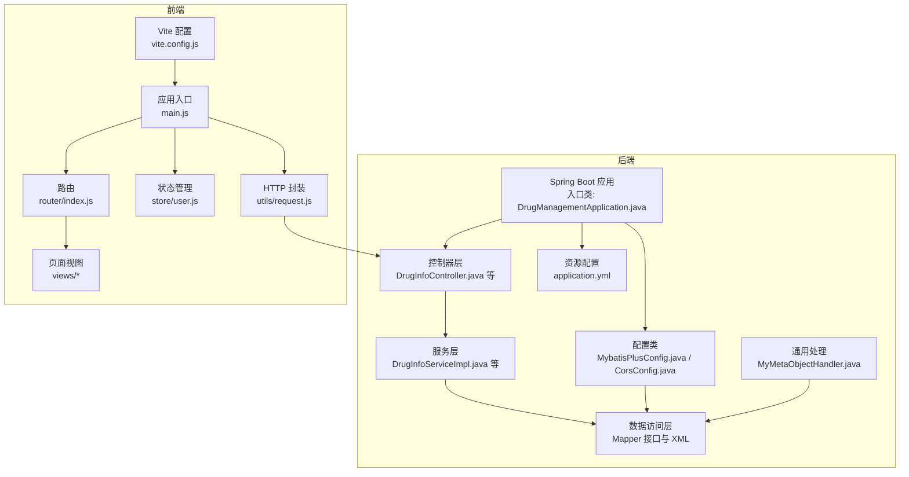
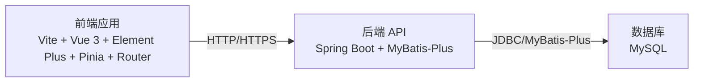
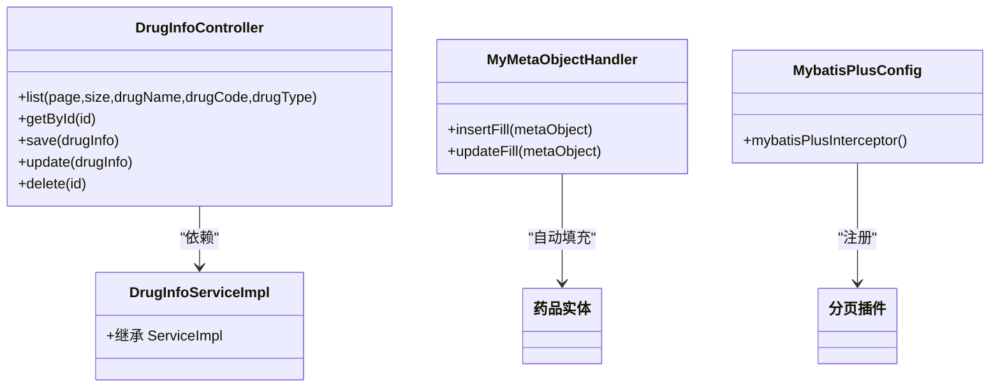
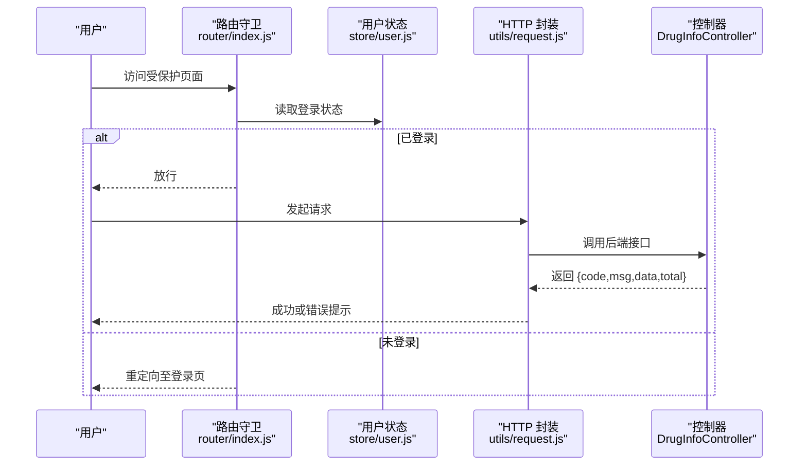
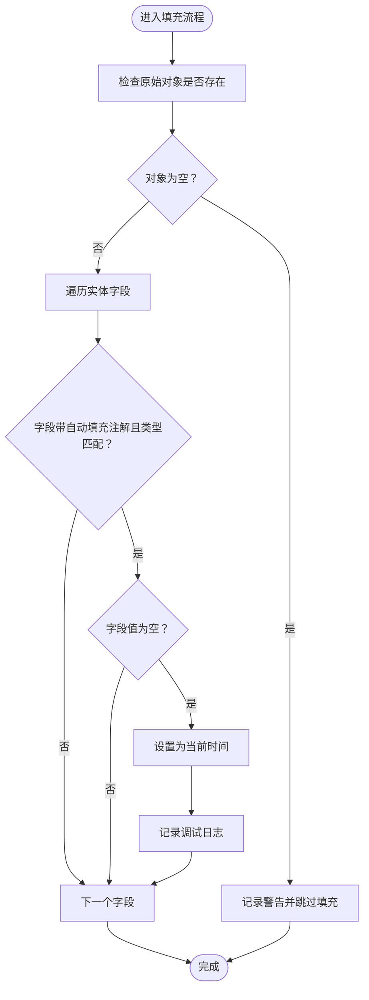
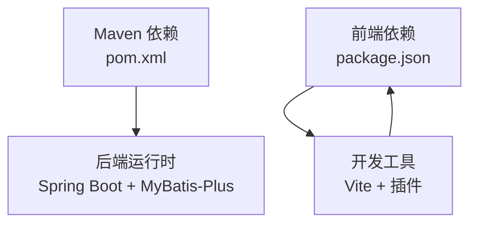

# 开发指南

<cite>
**本文引用的文件**
- [pom.xml](file://pom.xml)
- [application.yml](file://src/main/resources/application.yml)
- [DrugManagementApplication.java](file://src/main/java/com/hospital/drugmanagement/DrugManagementApplication.java)
- [MybatisPlusConfig.java](file://src/main/java/com/hospital/drugmanagement/config/MybatisPlusConfig.java)
- [CorsConfig.java](file://src/main/java/com/hospital/drugmanagement/config/CorsConfig.java)
- [MyMetaObjectHandler.java](file://src/main/java/com/hospital/drugmanagement/common/handler/MyMetaObjectHandler.java)
- [DrugInfoController.java](file://src/main/java/com/hospital/drugmanagement/controller/DrugInfoController.java)
- [DrugInfoServiceImpl.java](file://src/main/java/com/hospital/drugmanagement/service/impl/DrugInfoServiceImpl.java)
- [package.json](file://drug-front/package.json)
- [vite.config.js](file://drug-front/vite.config.js)
- [main.js](file://drug-front/src/main.js)
- [router/index.js](file://drug-front/src/router/index.js)
- [store/user.js](file://drug-front/src/store/user.js)
- [utils/request.js](file://drug-front/src/utils/request.js)
- [init_and_start.bat](file://init_and_start.bat)
</cite>

## 目录
1. [简介](#简介)
2. [项目结构](#项目结构)
3. [核心组件](#核心组件)
4. [架构总览](#架构总览)
5. [详细组件分析](#详细组件分析)
6. [依赖分析](#依赖分析)
7. [性能考虑](#性能考虑)
8. [故障排查指南](#故障排查指南)
9. [结论](#结论)
10. [附录](#附录)

## 简介
本开发指南面向参与“医院药品管理系统”的前后端开发者，提供统一的开发规范与最佳实践，涵盖代码规范、开发流程、项目结构、开发工具、扩展机制、常见开发场景处理方案、环境搭建与构建部署流程，以及团队协作与沟通机制建议。目标是提升开发效率、保证代码质量与可维护性。

## 项目结构
项目采用前后端分离架构：
- 后端：基于 Spring Boot 3 + MyBatis-Plus 的 Java 应用，位于 src/main/java 与 src/main/resources 下，使用 Maven 管理依赖与构建。
- 前端：基于 Vue 3 + Element Plus + Pinia + Vue Router 的单页应用，位于 drug-front 目录，使用 Vite 作为构建工具与开发服务器。

图表来源
- [DrugManagementApplication.java:1-33](file://src/main/java/com/hospital/drugmanagement/DrugManagementApplication.java#L1-L33)
- [MybatisPlusConfig.java:1-16](file://src/main/java/com/hospital/drugmanagement/config/MybatisPlusConfig.java#L1-L16)
- [CorsConfig.java:1-19](file://src/main/java/com/hospital/drugmanagement/config/CorsConfig.java#L1-L19)
- [MyMetaObjectHandler.java:1-60](file://src/main/java/com/hospital/drugmanagement/common/handler/MyMetaObjectHandler.java#L1-L60)
- [DrugInfoController.java:1-169](file://src/main/java/com/hospital/drugmanagement/controller/DrugInfoController.java#L1-L169)
- [DrugInfoServiceImpl.java:1-18](file://src/main/java/com/hospital/drugmanagement/service/impl/DrugInfoServiceImpl.java#L1-L18)
- [application.yml:1-24](file://src/main/resources/application.yml#L1-L24)
- [vite.config.js:1-22](file://drug-front/vite.config.js#L1-L22)
- [main.js:1-26](file://drug-front/src/main.js#L1-L26)
- [router/index.js:1-115](file://drug-front/src/router/index.js#L1-L115)
- [store/user.js:1-68](file://drug-front/src/store/user.js#L1-L68)
- [utils/request.js:1-56](file://drug-front/src/utils/request.js#L1-L56)

章节来源
- [pom.xml:1-119](file://pom.xml#L1-L119)
- [application.yml:1-24](file://src/main/resources/application.yml#L1-L24)
- [DrugManagementApplication.java:1-33](file://src/main/java/com/hospital/drugmanagement/DrugManagementApplication.java#L1-L33)
- [vite.config.js:1-22](file://drug-front/vite.config.js#L1-L22)

## 核心组件
- 后端启动与扫描
  - 入口类通过组件扫描与 @Import 强制注册控制器，确保 REST 接口可用。
  - MyBatis-Plus 配置启用分页插件；全局自动填充处理器负责创建/更新时间字段。
  - CORS 配置允许跨域访问，便于前端联调。
- 前端应用与路由
  - 使用 Vite + Vue 3 + Element Plus + Pinia + Vue Router。
  - 路由守卫控制登录态与页面标题；全局 Axios 实例封装请求/响应拦截器。
- 数据与配置
  - application.yml 提供数据源、模板引擎与 MyBatis-Plus 基础配置，开启下划线转驼峰映射。

章节来源
- [DrugManagementApplication.java:14-25](file://src/main/java/com/hospital/drugmanagement/DrugManagementApplication.java#L14-L25)
- [MybatisPlusConfig.java:8-16](file://src/main/java/com/hospital/drugmanagement/config/MybatisPlusConfig.java#L8-L16)
- [MyMetaObjectHandler.java:13-60](file://src/main/java/com/hospital/drugmanagement/common/handler/MyMetaObjectHandler.java#L13-L60)
- [CorsConfig.java:7-18](file://src/main/java/com/hospital/drugmanagement/config/CorsConfig.java#L7-L18)
- [application.yml:1-24](file://src/main/resources/application.yml#L1-L24)
- [main.js:1-26](file://drug-front/src/main.js#L1-L26)
- [router/index.js:91-112](file://drug-front/src/router/index.js#L91-L112)
- [utils/request.js:5-56](file://drug-front/src/utils/request.js#L5-L56)

## 架构总览
系统采用典型的三层架构与前后端分离模式：
- 前端负责界面与交互，通过 Axios 访问后端 REST 接口。
- 后端提供 REST API，使用 MyBatis-Plus 进行数据持久化，配合自动填充与分页插件。
- 数据库连接与 MyBatis-Plus 配置集中于 application.yml 与配置类中。

图表来源
- [main.js:1-26](file://drug-front/src/main.js#L1-L26)
- [router/index.js:1-115](file://drug-front/src/router/index.js#L1-L115)
- [utils/request.js:1-56](file://drug-front/src/utils/request.js#L1-L56)
- [DrugManagementApplication.java:1-33](file://src/main/java/com/hospital/drugmanagement/DrugManagementApplication.java#L1-L33)
- [MybatisPlusConfig.java:1-16](file://src/main/java/com/hospital/drugmanagement/config/MybatisPlusConfig.java#L1-L16)
- [application.yml:1-24](file://src/main/resources/application.yml#L1-L24)

## 详细组件分析

### 后端：控制器与服务
- 控制器职责
  - 提供 REST 接口，统一返回结构包含 code、msg、data、total 等字段。
  - 支持分页查询、条件过滤、保存/更新前的唯一性校验、删除等。
- 服务实现
  - 基于 MyBatis-Plus 的 ServiceImpl，复用基础 CRUD 方法，减少样板代码。
- 自动填充与分页
  - 自动填充处理器按注解类型填充创建/更新时间。
  - MyBatis-Plus 分页插件在配置类中启用，控制器直接使用 Page 对象进行分页。

图表来源
- [DrugInfoController.java:1-169](file://src/main/java/com/hospital/drugmanagement/controller/DrugInfoController.java#L1-L169)
- [DrugInfoServiceImpl.java:1-18](file://src/main/java/com/hospital/drugmanagement/service/impl/DrugInfoServiceImpl.java#L1-L18)
- [MyMetaObjectHandler.java:1-60](file://src/main/java/com/hospital/drugmanagement/common/handler/MyMetaObjectHandler.java#L1-L60)
- [MybatisPlusConfig.java:1-16](file://src/main/java/com/hospital/drugmanagement/config/MybatisPlusConfig.java#L1-L16)

章节来源
- [DrugInfoController.java:22-167](file://src/main/java/com/hospital/drugmanagement/controller/DrugInfoController.java#L22-L167)
- [DrugInfoServiceImpl.java:9-18](file://src/main/java/com/hospital/drugmanagement/service/impl/DrugInfoServiceImpl.java#L9-L18)
- [MyMetaObjectHandler.java:21-59](file://src/main/java/com/hospital/drugmanagement/common/handler/MyMetaObjectHandler.java#L21-L59)
- [MybatisPlusConfig.java:10-15](file://src/main/java/com/hospital/drugmanagement/config/MybatisPlusConfig.java#L10-L15)

### 前端：路由、状态与请求
- 路由与守卫
  - 定义登录页与主框架子路由，设置页面标题；根据登录状态重定向。
- 状态管理
  - 使用 Pinia 管理 token、用户信息、角色与菜单权限，持久化到 localStorage。
- 请求封装
  - Axios 实例统一设置 baseURL 与超时；请求头携带 Authorization；响应拦截器统一处理错误码与 401 未授权跳转。

图表来源
- [router/index.js:91-112](file://drug-front/src/router/index.js#L91-L112)
- [store/user.js:1-68](file://drug-front/src/store/user.js#L1-L68)
- [utils/request.js:11-53](file://drug-front/src/utils/request.js#L11-L53)
- [DrugInfoController.java:22-58](file://src/main/java/com/hospital/drugmanagement/controller/DrugInfoController.java#L22-L58)

章节来源
- [router/index.js:4-84](file://drug-front/src/router/index.js#L4-L84)
- [store/user.js:4-68](file://drug-front/src/store/user.js#L4-L68)
- [utils/request.js:5-56](file://drug-front/src/utils/request.js#L5-L56)

### 数据模型与自动填充流程
- 字段自动填充
  - 通过注解标记创建/更新时间字段，处理器遍历实体字段并按需填充。
  - 若字段值为空则写入当前时间，否则跳过。

图表来源
- [MyMetaObjectHandler.java:34-59](file://src/main/java/com/hospital/drugmanagement/common/handler/MyMetaObjectHandler.java#L34-L59)

章节来源
- [MyMetaObjectHandler.java:13-60](file://src/main/java/com/hospital/drugmanagement/common/handler/MyMetaObjectHandler.java#L13-L60)

## 依赖分析
- 后端依赖
  - Spring Boot Web、Thymeleaf、MySQL 驱动、MyBatis-Plus、分页插件、测试与 Lombok。
  - 编译器插件配置启用 Lombok 注解处理。
- 前端依赖
  - Vue 3、Vue Router、Pinia、Element Plus、Axios、图标与日期/图表库。
  - Vite 作为构建与开发服务器，配置代理指向后端 8081 端口。

图表来源
- [pom.xml:32-84](file://pom.xml#L32-L84)
- [package.json:13-27](file://drug-front/package.json#L13-L27)
- [vite.config.js:1-22](file://drug-front/vite.config.js#L1-L22)

章节来源
- [pom.xml:29-84](file://pom.xml#L29-L84)
- [package.json:1-29](file://drug-front/package.json#L1-L29)
- [vite.config.js:1-22](file://drug-front/vite.config.js#L1-L22)

## 性能考虑
- 后端
  - 使用 MyBatis-Plus 分页插件避免一次性加载大量数据。
  - 在 application.yml 中开启下划线转驼峰映射，减少手动转换开销。
  - 控制器层尽量使用条件查询与分页参数，避免全表扫描。
- 前端
  - 使用路由懒加载与组件动态导入，降低首屏体积。
  - Axios 统一超时与错误处理，避免阻塞 UI。
  - Pinia 状态粒度合理拆分，避免不必要的响应式更新。

## 故障排查指南
- 启动与连接
  - 后端启动日志输出接口地址，确认端口占用与数据库连接串正确。
  - application.yml 中数据库用户名/密码与时区配置需与本地环境一致。
- 跨域问题
  - CORS 配置允许来源与方法，若仍异常检查浏览器开发者工具 Network 选项卡。
- 前端联调
  - Vite 代理将 /api 请求转发至后端 8081 端口，确保后端已启动。
  - Axios baseURL 与后端接口路径保持一致。
- 自动填充与分页
  - 若自动填充未生效，检查实体字段是否标注注解且类型匹配。
  - 分页不生效检查控制器是否传入 Page 参数并正确返回。

章节来源
- [DrugManagementApplication.java:26-32](file://src/main/java/com/hospital/drugmanagement/DrugManagementApplication.java#L26-L32)
- [application.yml:3-24](file://src/main/resources/application.yml#L3-L24)
- [CorsConfig.java:10-16](file://src/main/java/com/hospital/drugmanagement/config/CorsConfig.java#L10-L16)
- [vite.config.js:14-19](file://drug-front/vite.config.js#L14-L19)
- [utils/request.js:7-9](file://drug-front/src/utils/request.js#L7-L9)
- [MyMetaObjectHandler.java:44-52](file://src/main/java/com/hospital/drugmanagement/common/handler/MyMetaObjectHandler.java#L44-L52)

## 结论
本指南提供了从项目结构、核心组件、开发流程到工具链与故障排查的完整参考。建议团队在日常开发中严格遵循本文规范，以保障一致性与可维护性。

## 附录

### 代码规范与命名约定
- Java 编码规范
  - 类名使用帕斯卡命名法；方法/变量使用驼峰命名法；常量全大写并以下划线分隔。
  - 控制器类名以 Controller 结尾；服务接口以 I 开头；实现类以 Impl 结尾；Mapper 接口以 Mapper 结尾。
  - 包名全部小写，层级清晰，按领域划分（controller、service、mapper、entity、dto、config、common）。
  - 注释遵循 JavaDoc 规范，类与公共方法需提供简要说明。
- Vue.js 组件开发规范
  - 组件文件名使用帕斯卡命名法；页面组件放置于 views 下，通用组件放置于 components 下。
  - 组件导出默认配置对象，避免在模板中直接使用外部作用域变量。
  - 路由文件集中管理，使用动态导入与 meta 标签维护页面标题与图标。
- 命名约定
  - 变量与方法：语义明确、避免缩写；布尔变量以 is/has/bel 等前缀。
  - 文件与目录：使用中线线连接或下划线分隔，保持一致性。
- 注释规范
  - 类与方法需提供简要说明；复杂逻辑需补充行内注释；对外接口需说明参数与返回值含义。

### 开发流程与版本管理
- Git 工作流
  - 主分支仅合并稳定版本；功能开发在 feature/* 分支；修复在 hotfix/* 分支；发布在 release/* 分支。
- 分支管理策略
  - develop -> feature/xxx -> pull request -> review -> merge -> develop -> release/X.Y.Z -> tag -> master
- 代码审查流程
  - 提交 PR 前先本地自测；PR 描述包含变更内容、影响范围与测试结果；至少一名 reviewer 通过。
- 版本发布流程
  - 更新版本号与变更日志；打标签并推送；CI/CD 自动构建与部署（如启用）。

### 项目结构与模块划分
- 后端模块划分
  - controller：REST 控制器，负责请求处理与响应格式化。
  - service：业务逻辑层，提供领域服务；实现类继承 MyBatis-Plus ServiceImpl。
  - mapper：数据访问层，对应数据库表；XML 文件位于 resources/mapper。
  - entity/dto：实体与传输对象；dto 用于接口参数与返回值封装。
  - config：Spring 配置类（CORS、MyBatis-Plus、Jackson 等）。
  - common：通用工具与自动填充处理器。
- 前端模块划分
  - src/api：接口封装，按业务模块划分（drug.js、purchase.js 等）。
  - src/views：页面视图组件，按功能模块组织。
  - src/router：路由定义与守卫。
  - src/store：状态管理（Pinia）。
  - src/utils：通用工具函数与 HTTP 封装。
  - public：静态资源与入口 HTML。

### 开发工具与 IDE 配置
- 后端
  - JDK 17；Spring Boot 3；MyBatis-Plus；Lombok；Maven Wrapper。
  - 推荐插件：Lombok、MyBatis Log、Database Tools。
- 前端
  - Node.js 18+；Vite；ESLint/Prettier；Vue Devtools；Element Plus 图标。
- 调试与性能分析
  - 后端：使用 IDE 断点调试；开启 SQL 日志（application.yml 中 StdOutImpl）。
  - 前端：使用浏览器开发者工具 Network/Performance 面板；Vue Devtools 检查组件状态。

### 扩展机制
- 插件开发
  - 后端：通过 Spring @Component/@Service/@Configuration 扩展；MyBatis-Plus 通过拦截器扩展（如分页）。
  - 前端：通过插件注册（Element Plus）、路由扩展与状态模块扩展。
- 中间件配置
  - CORS、拦截器、统一异常处理（可结合 Spring MVC 或 WebFlux）。
- 事件驱动架构
  - 使用 Spring 事件或消息队列（如 RabbitMQ/Kafka）实现异步解耦（按需引入）。

### 常见开发场景解决方案
- 新功能开发
  - 后端：新建 entity/dto/mapper/service/controller；在 application.yml 或配置类中完善依赖。
  - 前端：新建 views 与 api；在 router 中注册路由；在 store 中扩展状态。
- Bug 修复
  - 明确问题定位（日志、断点、接口测试）；编写最小化回归用例；提交修复与测试。
- 性能优化
  - 后端：索引优化、SQL 复杂度分析、分页与缓存；禁用不必要的日志级别。
  - 前端：懒加载、图片与资源压缩、减少重渲染。
- 重构策略
  - 保持接口不变；逐步替换实现；充分单元测试与集成测试覆盖。

### 开发环境搭建与构建部署
- 环境准备
  - 安装 JDK 17、Node.js 18+、MySQL、IDE（IntelliJ IDEA / VS Code）。
- 依赖安装
  - 后端：执行 Maven Wrapper（Windows 使用 mvnw.cmd）。
  - 前端：执行 npm install（或 pnpm/yarn）。
- 启动方式
  - 后端：IDE 直接运行入口类或使用 mvn spring-boot:run。
  - 前端：npm run dev；访问 http://localhost:3000。
  - 初始化数据库：执行 init_and_start.bat（需本地 MySQL 存在）。
- 构建与部署
  - 后端：mvn clean package 生成可执行 jar；Docker 镜像（可选）。
  - 前端：npm run build 输出 dist；Nginx 部署静态资源。

章节来源
- [init_and_start.bat:1-11](file://init_and_start.bat#L1-L11)
- [pom.xml:86-116](file://pom.xml#L86-L116)
- [package.json:8-12](file://drug-front/package.json#L8-L12)
- [vite.config.js:12-20](file://drug-front/vite.config.js#L12-L20)

### 团队协作规范与沟通机制
- 规范
  - 统一代码风格与提交信息格式；每日站会同步进度；每周回顾与知识分享。
- 沟通
  - 使用即时通讯工具与项目管理工具（如 Jira/Tapd）；PR 与 Issue 模板标准化。
- 文档
  - 变更及时更新 README 与开发指南；接口文档与数据库设计文档同步维护。