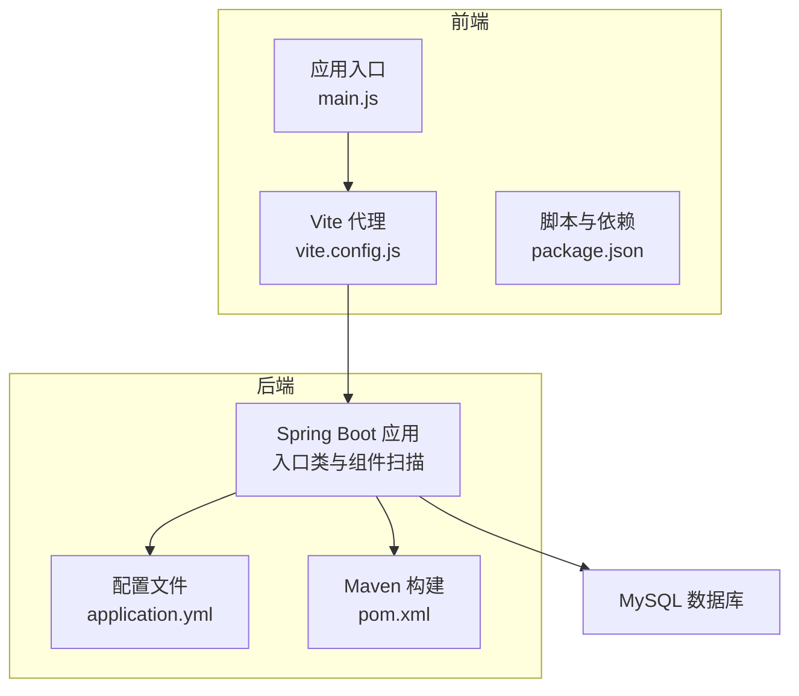
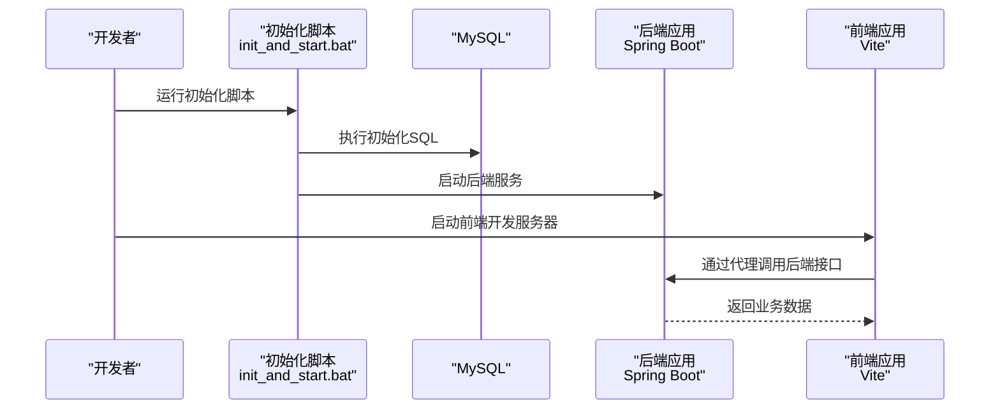
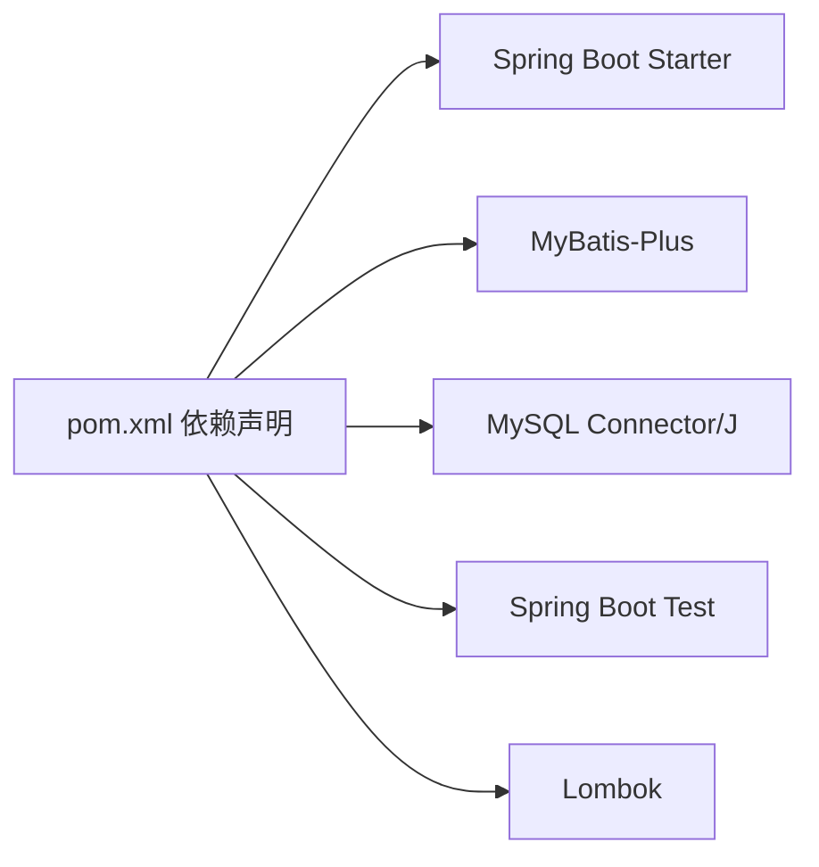

# 开发流程

<cite>
**本文引用的文件**
- [pom.xml](file://pom.xml)
- [application.yml](file://src/main/resources/application.yml)
- [init_and_start.bat](file://init_and_start.bat)
- [DrugManagementApplication.java](file://src/main/java/com/hospital/drugmanagement/DrugManagementApplication.java)
- [DrugManagementApplicationTests.java](file://src/test/java/com/hospital/drugmanagement/DrugManagementApplicationTests.java)
- [package.json](file://drug-front/package.json)
- [vite.config.js](file://drug-front/vite.config.js)
- [main.js](file://drug-front/src/main.js)
</cite>

## 目录
1. [简介](#简介)
2. [项目结构](#项目结构)
3. [核心组件](#核心组件)
4. [架构总览](#架构总览)
5. [详细组件分析](#详细组件分析)
6. [依赖分析](#依赖分析)
7. [性能考虑](#性能考虑)
8. [故障排查指南](#故障排查指南)
9. [结论](#结论)
10. [附录](#附录)

## 简介
本开发流程文档面向药品管理系统项目的开发与协作，覆盖从本地开发到测试与生产的全流程规范。内容包括：Git 工作流（分支策略、提交规范、合并流程、冲突解决）、代码审查流程（PR 规范、审查标准、反馈处理）、版本管理（版本号规则、发布流程、回滚策略）、持续集成（自动化测试、构建流程、部署流程）、开发环境管理（本地/测试/生产配置）、开发任务管理（需求评审、任务分解、进度跟踪）以及团队协作规范（沟通机制、文档要求、知识分享）。为确保可操作性，本文结合仓库中现有的 Maven、Spring Boot、Vite/Vue 前端与数据库配置进行落地说明。

## 项目结构
项目采用前后端分离架构：
- 后端：基于 Spring Boot 的 Java 应用，使用 MyBatis-Plus 作为 ORM 框架，Maven 管理依赖与构建。
- 前端：基于 Vue 3 + Vite 的单页应用，通过代理访问后端接口。
- 数据库：默认使用本地 MySQL，配置文件中定义了连接参数与 MyBatis-Plus 的映射路径。

图表来源
- [DrugManagementApplication.java:14-33](file://src/main/java/com/hospital/drugmanagement/DrugManagementApplication.java#L14-L33)
- [application.yml:1-24](file://src/main/resources/application.yml#L1-L24)
- [pom.xml:1-119](file://pom.xml#L1-L119)
- [vite.config.js:1-22](file://drug-front/vite.config.js#L1-L22)
- [main.js:1-26](file://drug-front/src/main.js#L1-L26)
- [package.json:1-29](file://drug-front/package.json#L1-L29)

章节来源
- [pom.xml:1-119](file://pom.xml#L1-L119)
- [application.yml:1-24](file://src/main/resources/application.yml#L1-L24)
- [vite.config.js:1-22](file://drug-front/vite.config.js#L1-L22)
- [main.js:1-26](file://drug-front/src/main.js#L1-L26)
- [package.json:1-29](file://drug-front/package.json#L1-L29)

## 核心组件
- 后端应用入口与组件扫描：应用入口类负责启动 Spring Boot 并显式导入部分控制器以纳入容器，同时配置 Mapper 接口扫描与包扫描范围。
- 配置中心：application.yml 提供数据源、模板引擎、服务端口与 MyBatis-Plus 的基础配置，便于本地开发调试。
- 构建与打包：Maven 插件配置编译器版本与 Lombok 注解处理器，Spring Boot 插件用于打包运行。
- 前端入口与路由：main.js 初始化 Pinia、路由与 Element Plus；vite.config.js 提供开发服务器与后端代理；package.json 定义脚本与依赖。

章节来源
- [DrugManagementApplication.java:14-33](file://src/main/java/com/hospital/drugmanagement/DrugManagementApplication.java#L14-L33)
- [application.yml:1-24](file://src/main/resources/application.yml#L1-L24)
- [pom.xml:86-116](file://pom.xml#L86-L116)
- [vite.config.js:1-22](file://drug-front/vite.config.js#L1-L22)
- [main.js:1-26](file://drug-front/src/main.js#L1-L26)
- [package.json:8-12](file://drug-front/package.json#L8-L12)

## 架构总览
系统采用前后端分离模式，前端通过 Vite 代理访问后端服务，后端提供 REST 接口并通过 MyBatis-Plus 访问数据库。开发时可通过批处理脚本一键初始化数据库并启动后端服务。

图表来源
- [init_and_start.bat:1-11](file://init_and_start.bat#L1-L11)
- [application.yml:14-24](file://src/main/resources/application.yml#L14-L24)
- [vite.config.js:12-20](file://drug-front/vite.config.js#L12-L20)

章节来源
- [init_and_start.bat:1-11](file://init_and_start.bat#L1-L11)
- [application.yml:14-24](file://src/main/resources/application.yml#L14-L24)
- [vite.config.js:12-20](file://drug-front/vite.config.js#L12-L20)

## 详细组件分析

### Git 工作流
- 分支策略
  - 主分支：仅允许通过 Pull Request 合并，保持稳定。
  - 功能分支：按功能或需求创建，命名建议采用 feature/xxx 或 task/xxx。
  - 修复分支：hotfix/xxx 用于紧急修复。
  - 发布分支：release/X.Y.Z 用于预发布与回归测试。
- 提交规范
  - 类型限定：feat、fix、docs、style、refactor、test、chore、perf、ci、build。
  - 标题格式：类型(作用域): 概述；正文说明动机与影响；引用 Issue 编号。
  - 示例：feat(controller): 新增药品入库接口；fix(entity): 修正字段映射问题。
- 合并流程
  - PR 必须关联需求/任务；至少一名审查者批准；通过 CI 检查；squash 合并或保持原子提交。
- 冲突解决
  - 频繁同步主分支；小步提交；优先 rebase 解决冲突；冲突解决后自测并更新 PR。

### 代码审查流程
- PR 规范
  - 标题清晰、描述完整、包含变更摘要、影响范围与测试要点。
  - 关联需求/任务与相关 Issue。
  - 附带单元测试或集成测试用例。
- 审查标准
  - 正确性：逻辑正确、边界条件处理、异常路径覆盖。
  - 可维护性：命名规范、模块职责单一、注释清晰。
  - 性能与安全：避免 N+1 查询、SQL 注入风险、敏感信息泄露。
  - 兼容性：接口兼容、数据库迁移脚本完备。
- 反馈处理
  - 对每条评论逐条回复；修改后重新请求审查；避免一次性批量修改导致审查疲劳。

### 版本管理
- 版本号规则
  - 使用语义化版本：主版本.次版本.修订号(-预发布标签)。
  - 预发布：alpha、beta、rc；正式发布去除预发布标签。
- 发布流程
  - 在 release 分支完成最终测试；打标签并推送；生成发布说明。
  - 后端：Maven 打包产物上传制品库；前端：构建产物发布至 CDN/静态托管。
- 回滚策略
  - 回滚到上一稳定标签；数据库变更需配套回滚脚本；灰度回滚优先。

### 持续集成
- 自动化测试
  - 单元测试：Spring Boot Test 与 JUnit；覆盖率目标 80%+。
  - 集成测试：接口测试与数据库一致性检查。
- 构建流程
  - Maven 清理、编译、测试、打包；设置 JDK 17 与 Lombok 处理器。
- 部署流程
  - 后端：Docker 镜像构建与部署；配置文件外置；健康检查。
  - 前端：静态资源部署至 Nginx 或对象存储；CDN 加速。

### 开发环境管理
- 本地开发
  - 后端：application.yml 中配置本地数据库连接、关闭模板缓存、开启 SQL 日志。
  - 前端：Vite 本地端口 3000，代理到后端 8081；安装依赖后运行 dev 脚本。
  - 初始化：执行批处理脚本初始化数据库并启动后端。
- 测试环境
  - 独立数据库实例；与本地配置隔离；统一环境变量管理。
- 生产环境
  - 使用只读账号；连接池与慢查询日志；监控与告警；蓝绿/滚动发布。

章节来源
- [application.yml:1-24](file://src/main/resources/application.yml#L1-L24)
- [vite.config.js:12-20](file://drug-front/vite.config.js#L12-L20)
- [init_and_start.bat:1-11](file://init_and_start.bat#L1-L11)
- [package.json:8-12](file://drug-front/package.json#L8-L12)

### 开发任务管理
- 需求评审
  - 明确验收标准、技术方案、风险评估与排期。
- 任务分解
  - 将需求拆分为可独立交付的功能点；分配给具体开发者；设定里程碑。
- 进度跟踪
  - 使用看板工具可视化任务状态；每日站会同步阻塞项；定期回顾迭代成果。

### 团队协作规范
- 沟通机制
  - 日常：即时通讯群组；周会：回顾与计划；跨团队：邮件抄送。
- 文档要求
  - 设计文档、API 文档、部署手册、故障预案；随代码同步更新。
- 知识分享
  - 技术分享会、代码走读、新人培训；建立内部 Wiki。

## 依赖分析
后端依赖关系围绕 Spring Boot、MyBatis-Plus、MySQL 驱动与测试框架展开；前端依赖 Vue 3、路由、状态管理与 UI 组件库，通过 Vite 构建与代理。

图表来源
- [pom.xml:32-84](file://pom.xml#L32-L84)

章节来源
- [pom.xml:32-84](file://pom.xml#L32-L84)

## 性能考虑
- 数据访问层
  - 启用分页插件与合理分页大小；避免 N+1 查询；使用缓存与索引优化热点查询。
- 接口设计
  - 控制返回字段数量；批量接口限制并发与单次处理量；超时与重试策略。
- 前端性能
  - 组件懒加载、路由按需加载；静态资源压缩与缓存；CDN 加速。
- 监控与诊断
  - 开启 SQL 日志定位慢查询；压测与 APM 监控；容量规划。

## 故障排查指南
- 启动失败
  - 检查数据库连接参数与端口占用；确认 JDK 版本与 Maven 编译配置。
- 接口异常
  - 查看后端控制台日志与 SQL 输出；核对请求参数与权限校验。
- 前端无法访问后端
  - 确认 Vite 代理配置与后端端口；检查 CORS 配置。
- 数据库初始化
  - 使用批处理脚本重新执行初始化 SQL；确认数据库存在且用户权限正确。

章节来源
- [application.yml:3-7](file://src/main/resources/application.yml#L3-L7)
- [vite.config.js:14-19](file://drug-front/vite.config.js#L14-L19)
- [init_and_start.bat:4-5](file://init_and_start.bat#L4-L5)

## 结论
本流程文档基于现有仓库配置，给出了可操作的开发与协作规范。建议在实际落地中补充 CI/CD 流水线、自动化测试用例与监控告警体系，持续优化开发效率与系统稳定性。

## 附录
- 快速启动
  - 执行初始化脚本完成数据库初始化并启动后端服务。
  - 前端安装依赖后运行开发脚本，访问本地前端页面。
- 关键配置参考
  - 后端端口与数据源配置位于配置文件。
  - 前端代理指向后端服务端口。

章节来源
- [init_and_start.bat:1-11](file://init_and_start.bat#L1-L11)
- [application.yml:14-24](file://src/main/resources/application.yml#L14-L24)
- [vite.config.js:12-20](file://drug-front/vite.config.js#L12-L20)
- [package.json:8-12](file://drug-front/package.json#L8-L12)