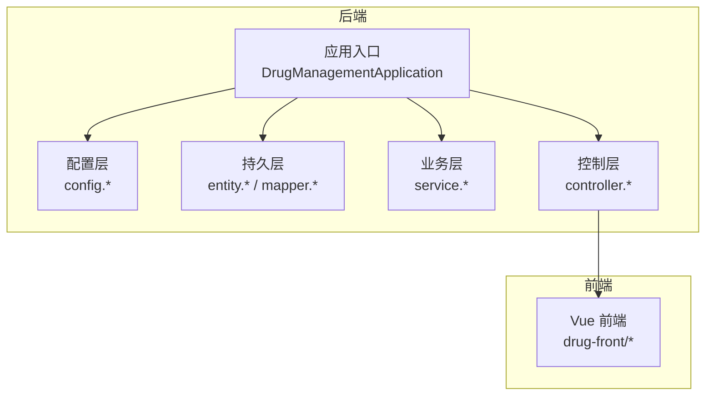
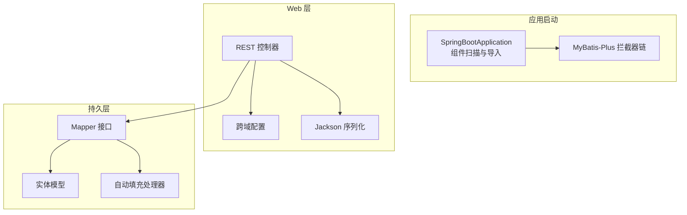
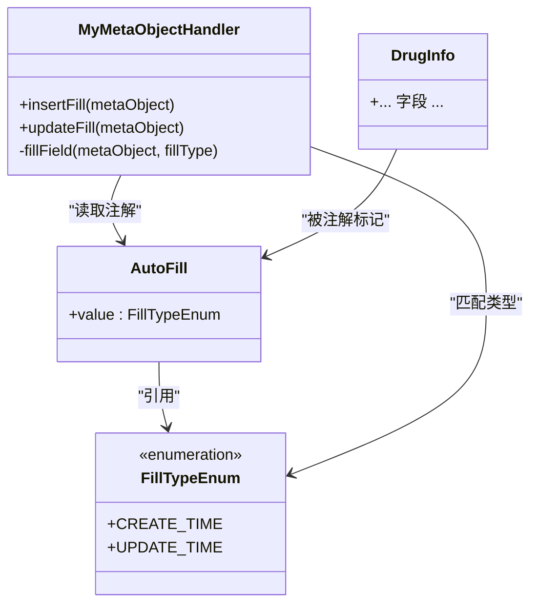
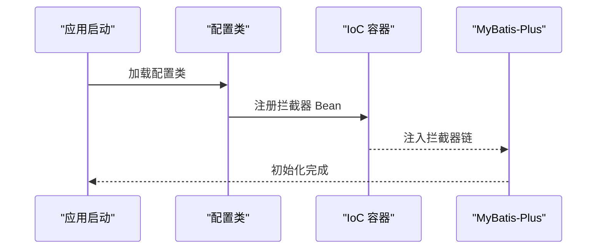
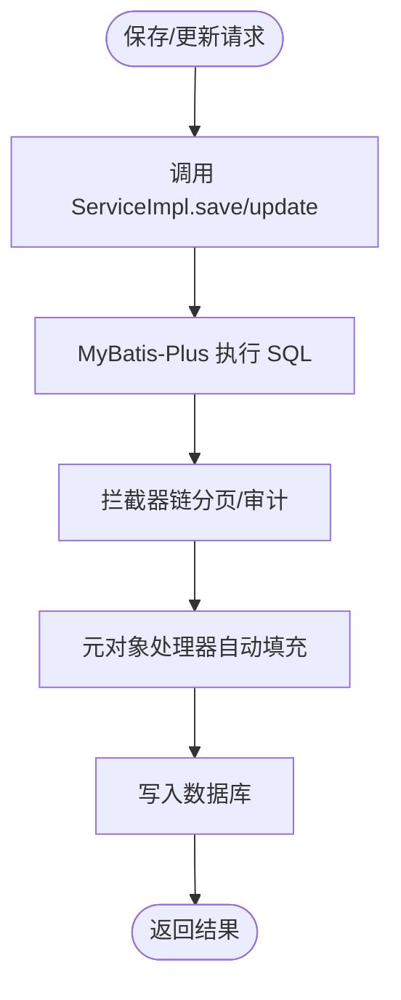
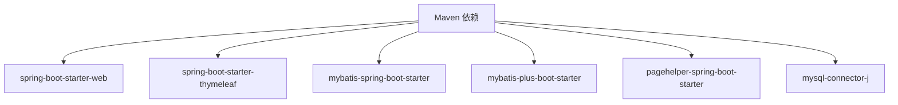

# 扩展机制

<cite>
**本文引用的文件**
- [AutoFill.java](file://src/main/java/com/hospital/drugmanagement/common/anno/AutoFill.java)
- [FillTypeEnum.java](file://src/main/java/com/hospital/drugmanagement/common/constant/FillTypeEnum.java)
- [MyMetaObjectHandler.java](file://src/main/java/com/hospital/drugmanagement/common/handler/MyMetaObjectHandler.java)
- [MybatisPlusConfig.java](file://src/main/java/com/hospital/drugmanagement/config/MybatisPlusConfig.java)
- [CorsConfig.java](file://src/main/java/com/hospital/drugmanagement/config/CorsConfig.java)
- [JacksonConfig.java](file://src/main/java/com/hospital/drugmanagement/config/JacksonConfig.java)
- [DrugInfo.java](file://src/main/java/com/hospital/drugmanagement/entity/DrugInfo.java)
- [DrugInfoMapper.java](file://src/main/java/com/hospital/drugmanagement/mapper/DrugInfoMapper.java)
- [DrugInfoServiceImpl.java](file://src/main/java/com/hospital/drugmanagement/service/impl/DrugInfoServiceImpl.java)
- [DrugInfoController.java](file://src/main/java/com/hospital/drugmanagement/controller/DrugInfoController.java)
- [application.yml](file://src/main/resources/application.yml)
- [pom.xml](file://pom.xml)
- [DrugManagementApplication.java](file://src/main/java/com/hospital/drugmanagement/DrugManagementApplication.java)
</cite>

## 目录
1. [引言](#引言)
2. [项目结构](#项目结构)
3. [核心组件](#核心组件)
4. [架构总览](#架构总览)
5. [详细组件分析](#详细组件分析)
6. [依赖分析](#依赖分析)
7. [性能考虑](#性能考虑)
8. [故障排查指南](#故障排查指南)
9. [结论](#结论)
10. [附录](#附录)

## 引言
本文件系统性梳理药品管理系统的扩展机制与扩展点，覆盖以下方面：
- 自定义注解扩展：AutoFill 注解的使用与扩展方法、FillTypeEnum 枚举扩展
- Spring Boot 扩展：配置类扩展、Bean 注册、条件注解使用
- MyBatis-Plus 扩展：自定义 Mapper、插件开发、拦截器配置
- 中间件扩展：拦截器、过滤器、监听器的实现
- 事件驱动扩展：Spring 事件发布订阅、自定义事件处理器
- 插件系统：可插拔组件、模块化设计、依赖注入
- 扩展开发示例：新增功能模块、自定义业务逻辑、第三方集成
- 扩展点设计原则与最佳实践

## 项目结构
项目采用标准 Spring Boot 层次化组织方式，主要模块如下：
- common：通用注解、常量、元对象处理器
- config：Spring MVC、MyBatis-Plus、跨域、Jackson 等配置
- entity：数据模型
- mapper：MyBatis-Plus Mapper 接口
- service：业务服务接口与实现
- controller：REST 控制器
- resources：配置文件、SQL 初始化脚本
- frontend：Vue 前端工程（与后端扩展机制互补）

图表来源
- [DrugManagementApplication.java:14-33](file://src/main/java/com/hospital/drugmanagement/DrugManagementApplication.java#L14-L33)
- [MybatisPlusConfig.java:1-16](file://src/main/java/com/hospital/drugmanagement/config/MybatisPlusConfig.java#L1-L16)
- [CorsConfig.java:1-19](file://src/main/java/com/hospital/drugmanagement/config/CorsConfig.java#L1-L19)
- [JacksonConfig.java:1-34](file://src/main/java/com/hospital/drugmanagement/config/JacksonConfig.java#L1-L34)
- [DrugInfo.java:1-167](file://src/main/java/com/hospital/drugmanagement/entity/DrugInfo.java#L1-L167)
- [DrugInfoMapper.java:1-9](file://src/main/java/com/hospital/drugmanagement/mapper/DrugInfoMapper.java#L1-L9)
- [DrugInfoServiceImpl.java:1-18](file://src/main/java/com/hospital/drugmanagement/service/impl/DrugInfoServiceImpl.java#L1-L18)
- [DrugInfoController.java:1-169](file://src/main/java/com/hospital/drugmanagement/controller/DrugInfoController.java#L1-L169)

章节来源
- [DrugManagementApplication.java:14-33](file://src/main/java/com/hospital/drugmanagement/DrugManagementApplication.java#L14-L33)
- [application.yml:1-24](file://src/main/resources/application.yml#L1-L24)

## 核心组件
- 自定义注解与枚举：通过 AutoFill 注解与 FillTypeEnum 枚举，实现基于注解的字段自动填充策略
- 元对象处理器：MyMetaObjectHandler 实现 MyBatis-Plus MetaObjectHandler，按注解类型在插入/更新时自动填充时间字段
- 配置扩展：MybatisPlusConfig、CorsConfig、JacksonConfig 提供分页、跨域、序列化等扩展点
- 数据访问层：基于 MyBatis-Plus 的 BaseMapper 与 ServiceImpl，支持快速 CRUD 与扩展
- 控制器层：REST 控制器统一返回结构，便于接入前端与扩展新接口

章节来源
- [AutoFill.java:1-15](file://src/main/java/com/hospital/drugmanagement/common/anno/AutoFill.java#L1-L15)
- [FillTypeEnum.java:1-9](file://src/main/java/com/hospital/drugmanagement/common/constant/FillTypeEnum.java#L1-L9)
- [MyMetaObjectHandler.java:1-60](file://src/main/java/com/hospital/drugmanagement/common/handler/MyMetaObjectHandler.java#L1-L60)
- [MybatisPlusConfig.java:1-16](file://src/main/java/com/hospital/drugmanagement/config/MybatisPlusConfig.java#L1-L16)
- [CorsConfig.java:1-19](file://src/main/java/com/hospital/drugmanagement/config/CorsConfig.java#L1-L19)
- [JacksonConfig.java:1-34](file://src/main/java/com/hospital/drugmanagement/config/JacksonConfig.java#L1-L34)
- [DrugInfoMapper.java:1-9](file://src/main/java/com/hospital/drugmanagement/mapper/DrugInfoMapper.java#L1-L9)
- [DrugInfoServiceImpl.java:1-18](file://src/main/java/com/hospital/drugmanagement/service/impl/DrugInfoServiceImpl.java#L1-L18)
- [DrugInfoController.java:1-169](file://src/main/java/com/hospital/drugmanagement/controller/DrugInfoController.java#L1-L169)

## 架构总览
系统采用“配置即扩展”的设计思路，通过 Spring Boot Starter 与 MyBatis-Plus 插件机制，实现可插拔的功能模块。

图表来源
- [DrugManagementApplication.java:14-33](file://src/main/java/com/hospital/drugmanagement/DrugManagementApplication.java#L14-L33)
- [MybatisPlusConfig.java:1-16](file://src/main/java/com/hospital/drugmanagement/config/MybatisPlusConfig.java#L1-L16)
- [CorsConfig.java:1-19](file://src/main/java/com/hospital/drugmanagement/config/CorsConfig.java#L1-L19)
- [JacksonConfig.java:1-34](file://src/main/java/com/hospital/drugmanagement/config/JacksonConfig.java#L1-L34)
- [DrugInfoMapper.java:1-9](file://src/main/java/com/hospital/drugmanagement/mapper/DrugInfoMapper.java#L1-L9)
- [MyMetaObjectHandler.java:1-60](file://src/main/java/com/hospital/drugmanagement/common/handler/MyMetaObjectHandler.java#L1-L60)

## 详细组件分析

### 自定义注解与枚举扩展（AutoFill 与 FillTypeEnum）
- 设计目标：以声明式注解的方式，将“何时填充”和“填充什么”解耦，降低重复代码与出错概率
- 使用方式：在实体字段上标注 AutoFill，并指定 FillTypeEnum 值；处理器在插入/更新时根据注解类型自动填充
- 扩展方法：
  - 新增枚举值：在 FillTypeEnum 中添加新的类型（如 CREATOR、MODIFIER 等）
  - 新增注解属性：在 AutoFill 中增加策略参数（如是否允许覆盖、默认值等）
  - 新增处理器分支：在 MyMetaObjectHandler 中针对新类型执行不同填充逻辑

图表来源
- [AutoFill.java:1-15](file://src/main/java/com/hospital/drugmanagement/common/anno/AutoFill.java#L1-L15)
- [FillTypeEnum.java:1-9](file://src/main/java/com/hospital/drugmanagement/common/constant/FillTypeEnum.java#L1-L9)
- [MyMetaObjectHandler.java:1-60](file://src/main/java/com/hospital/drugmanagement/common/handler/MyMetaObjectHandler.java#L1-L60)
- [DrugInfo.java:1-167](file://src/main/java/com/hospital/drugmanagement/entity/DrugInfo.java#L1-L167)

章节来源
- [AutoFill.java:6-15](file://src/main/java/com/hospital/drugmanagement/common/anno/AutoFill.java#L6-L15)
- [FillTypeEnum.java:3-9](file://src/main/java/com/hospital/drugmanagement/common/constant/FillTypeEnum.java#L3-L9)
- [MyMetaObjectHandler.java:21-60](file://src/main/java/com/hospital/drugmanagement/common/handler/MyMetaObjectHandler.java#L21-L60)

### Spring Boot 配置扩展（配置类、Bean 注册、条件注解）
- 配置类扩展：
  - MybatisPlusConfig：注册 MyBatis-Plus 拦截器（如分页），可在此扩展审计、租户隔离等插件
  - CorsConfig：全局跨域配置，支持按路径细化规则
  - JacksonConfig：自定义序列化器，解决 Long 精度问题，可扩展为全局 JSON 规则
- Bean 注册：通过 @Configuration + @Bean 在容器中注册扩展组件
- 条件注解：可结合 @ConditionalOnProperty、@Profile 等实现环境化开关

图表来源
- [MybatisPlusConfig.java:1-16](file://src/main/java/com/hospital/drugmanagement/config/MybatisPlusConfig.java#L1-L16)
- [CorsConfig.java:1-19](file://src/main/java/com/hospital/drugmanagement/config/CorsConfig.java#L1-L19)
- [JacksonConfig.java:1-34](file://src/main/java/com/hospital/drugmanagement/config/JacksonConfig.java#L1-L34)

章节来源
- [MybatisPlusConfig.java:8-16](file://src/main/java/com/hospital/drugmanagement/config/MybatisPlusConfig.java#L8-L16)
- [CorsConfig.java:7-19](file://src/main/java/com/hospital/drugmanagement/config/CorsConfig.java#L7-L19)
- [JacksonConfig.java:14-34](file://src/main/java/com/hospital/drugmanagement/config/JacksonConfig.java#L14-L34)

### MyBatis-Plus 扩展（自定义 Mapper、插件开发、拦截器配置）
- 自定义 Mapper：继承 BaseMapper，即可获得通用 CRUD 能力；可在接口中定义命名空间或注解查询
- 插件开发：通过 MyBatis-PlusInterceptor 注册 InnerInterceptor，实现分页、审计、多租户等功能
- 拦截器配置：在 MybatisPlusConfig 中集中管理，便于扩展与替换

图表来源
- [DrugInfoServiceImpl.java:1-18](file://src/main/java/com/hospital/drugmanagement/service/impl/DrugInfoServiceImpl.java#L1-L18)
- [MybatisPlusConfig.java:9-16](file://src/main/java/com/hospital/drugmanagement/config/MybatisPlusConfig.java#L9-L16)
- [MyMetaObjectHandler.java:21-32](file://src/main/java/com/hospital/drugmanagement/common/handler/MyMetaObjectHandler.java#L21-L32)

章节来源
- [DrugInfoMapper.java:1-9](file://src/main/java/com/hospital/drugmanagement/mapper/DrugInfoMapper.java#L1-L9)
- [MybatisPlusConfig.java:9-16](file://src/main/java/com/hospital/drugmanagement/config/MybatisPlusConfig.java#L9-L16)
- [MyMetaObjectHandler.java:16-60](file://src/main/java/com/hospital/drugmanagement/common/handler/MyMetaObjectHandler.java#L16-L60)

### 中间件扩展（拦截器、过滤器、监听器）
- 拦截器：WebMvcConfigurer 提供 addInterceptors 扩展点，可注册自定义拦截器
- 过滤器：Servlet Filter 可在请求进入 Spring 前进行预处理（如鉴权、限流）
- 监听器：ServletContextListener、HttpSessionListener 等可用于应用生命周期事件

章节来源
- [CorsConfig.java:7-19](file://src/main/java/com/hospital/drugmanagement/config/CorsConfig.java#L7-L19)

### 事件驱动扩展（Spring 事件发布订阅、自定义事件处理器）
- 发布事件：通过 ApplicationEventPublisher 发布领域事件（如库存变更、订单状态变更）
- 订阅事件：通过 @EventListener 或实现 ApplicationListener 接口处理事件
- 自定义事件处理器：可按模块拆分事件处理逻辑，实现松耦合

章节来源
- [DrugInfoServiceImpl.java:13-18](file://src/main/java/com/hospital/drugmanagement/service/impl/DrugInfoServiceImpl.java#L13-L18)

### 插件系统（可插拔组件、模块化设计、依赖注入）
- 可插拔组件：通过 @Import、@ComponentScan、@Enable* 注解实现模块级装配
- 模块化设计：将配置、Mapper、Service、Controller 按功能域划分，便于独立扩展
- 依赖注入：利用 Spring 容器管理 Bean 生命周期与依赖关系

章节来源
- [DrugManagementApplication.java:14-33](file://src/main/java/com/hospital/drugmanagement/DrugManagementApplication.java#L14-L33)

## 依赖分析
- Spring Boot Starter：web、thymeleaf、mybatis-spring-boot-starter、mybatis-plus-boot-starter
- MySQL 驱动：连接数据库
- PageHelper：分页增强（与 MyBatis-Plus 分页可并存或择一）
- Lombok：简化实体与配置类代码

图表来源
- [pom.xml:32-84](file://pom.xml#L32-L84)

章节来源
- [pom.xml:32-84](file://pom.xml#L32-L84)

## 性能考虑
- 自动填充性能：反射扫描字段在大批量写入时可能带来开销，建议仅在必要字段使用注解，或在高频场景禁用反射填充
- 分页性能：合理设置分页大小与排序字段，避免全表扫描
- 序列化性能：Long 转字符串序列化可避免前端精度问题，但会增大响应体积，需权衡
- 日志性能：生产环境建议降低自动填充日志级别，避免频繁 I/O

## 故障排查指南
- 自动填充未生效
  - 检查实体字段是否标注 AutoFill 且类型匹配
  - 确认 MyMetaObjectHandler 已被 Spring 容器管理
  - 查看日志输出定位异常
- 分页不生效
  - 确认 MybatisPlusInterceptor 已注册
  - 检查 Page 参数传递与查询构造
- 跨域问题
  - 校验 CORS 配置路径与方法白名单
  - 注意 allowCredentials 与 allowedOriginPatterns 的组合
- JSON 精度问题
  - 确认 JacksonConfig 是否生效
  - 检查序列化器注册顺序

章节来源
- [MyMetaObjectHandler.java:34-60](file://src/main/java/com/hospital/drugmanagement/common/handler/MyMetaObjectHandler.java#L34-L60)
- [MybatisPlusConfig.java:9-16](file://src/main/java/com/hospital/drugmanagement/config/MybatisPlusConfig.java#L9-L16)
- [CorsConfig.java:10-17](file://src/main/java/com/hospital/drugmanagement/config/CorsConfig.java#L10-L17)
- [JacksonConfig.java:17-32](file://src/main/java/com/hospital/drugmanagement/config/JacksonConfig.java#L17-L32)

## 结论
本项目通过“注解 + 处理器 + 配置 + 插件”的组合，构建了清晰的扩展体系。开发者可在不破坏现有架构的前提下，快速扩展新功能、接入第三方能力，并保持良好的可维护性与可测试性。

## 附录

### 扩展开发示例

- 新增功能模块
  - 定义实体与 Mapper 接口，继承 BaseMapper
  - 编写 Service 接口与实现，必要时扩展自定义方法
  - 新建 Controller 并注册路由，统一返回结构
  - 在配置类中注册必要的拦截器或序列化器

- 自定义业务逻辑
  - 在 Service 层封装复杂查询与事务
  - 使用 @EventListener 订阅领域事件，异步处理副作用
  - 通过 @ConditionalOnProperty 控制模块开关

- 第三方集成
  - 在配置类中注册第三方客户端 Bean
  - 通过 @Import 将外部模块纳入 Spring 容器
  - 利用拦截器或过滤器对接认证、限流等横切需求

### 扩展点设计原则与最佳实践
- 单一职责：每个扩展点聚焦一个关注面（如填充、分页、跨域）
- 最小暴露：尽量通过接口或抽象类对外暴露，隐藏实现细节
- 可配置：优先使用配置而非硬编码，支持环境差异化
- 可测试：为扩展点提供可替换的实现，便于单元测试
- 可观察：在关键路径输出日志或指标，便于排障与监控
- 向后兼容：新增枚举与注解属性时，确保默认行为不破坏既有逻辑