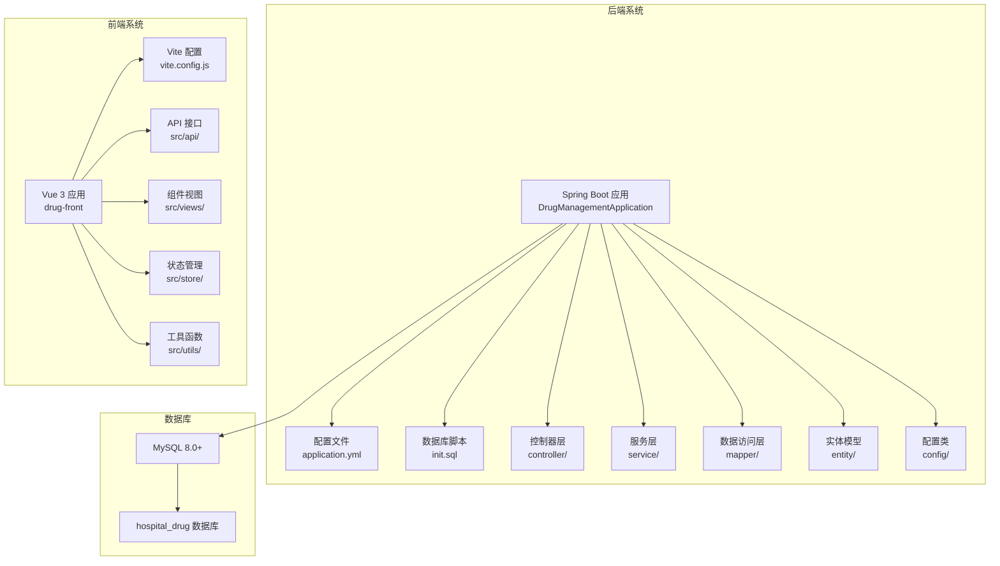
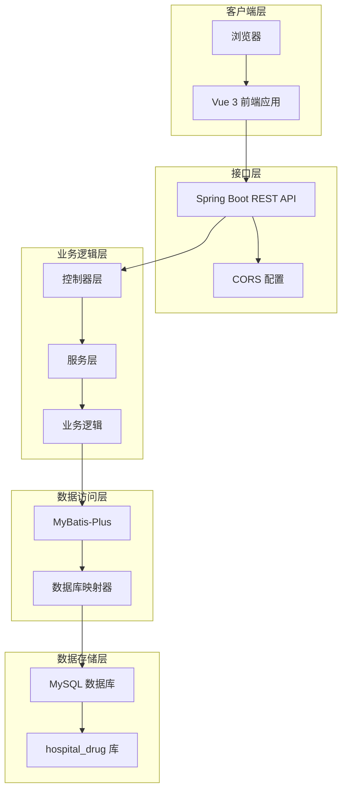
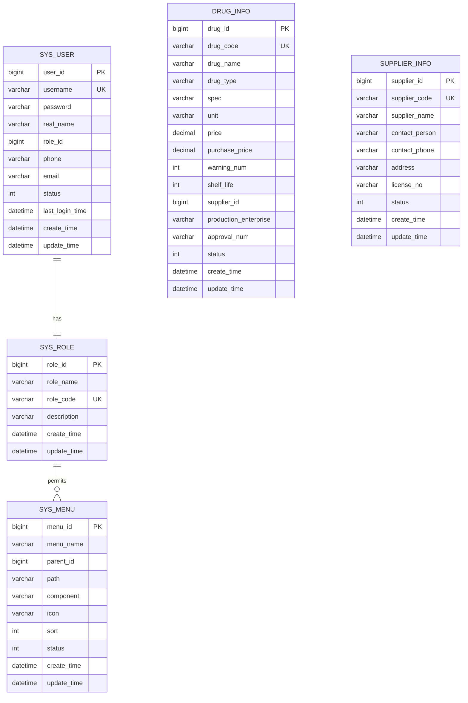
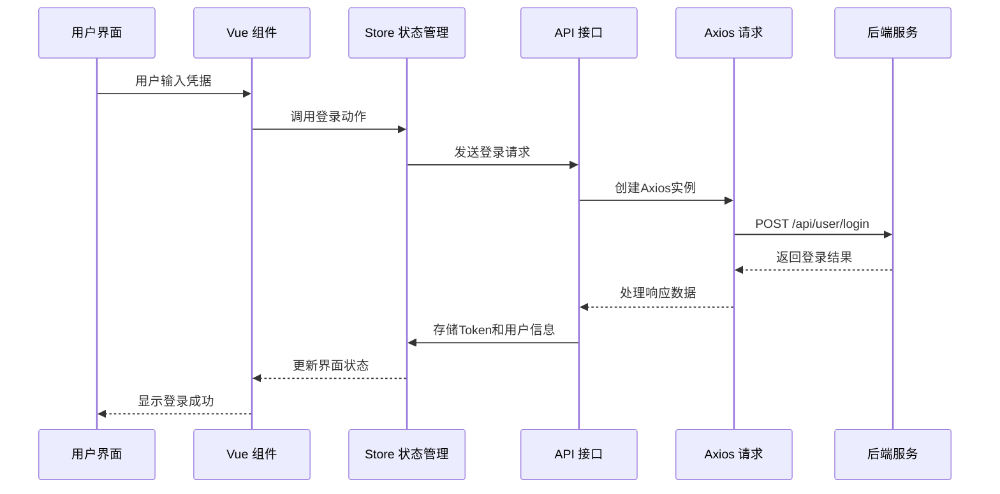
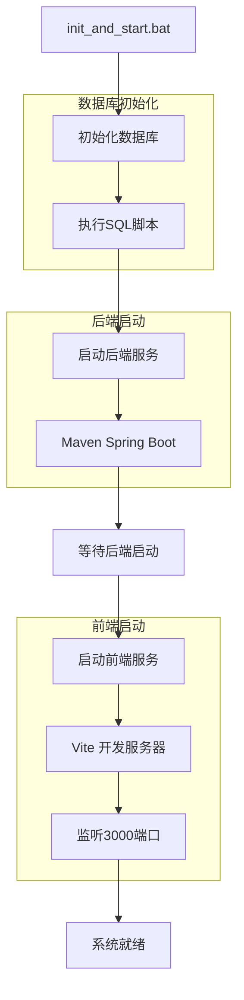
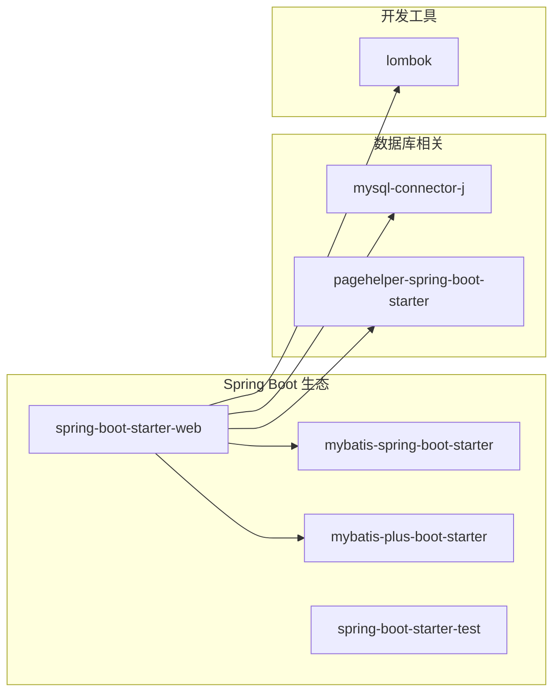
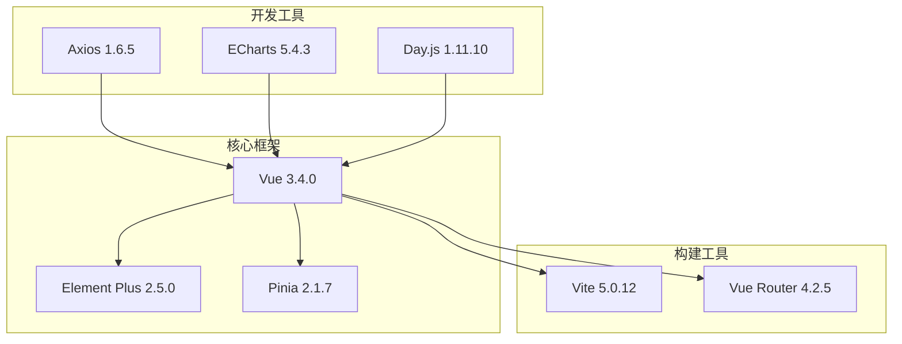
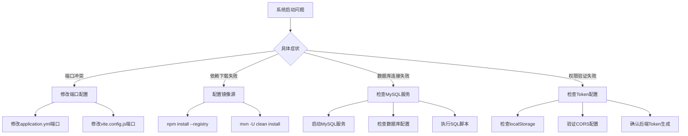

# 快速开始

<cite>
**本文引用的文件**
- [LOGIN_SETUP_README.md](file://LOGIN_SETUP_README.md)
- [init_and_start.bat](file://init_and_start.bat)
- [hospital_drug.sql](file://hospital_drug.sql)
- [application.yml](file://src/main/resources/application.yml)
- [pom.xml](file://pom.xml)
- [CorsConfig.java](file://src/main/java/com/hospital/drugmanagement/config/CorsConfig.java)
- [DrugManagementApplication.java](file://src/main/java/com/hospital/drugmanagement/DrugManagementApplication.java)
- [init.sql](file://src/main/resources/db/init.sql)
- [package.json](file://drug-front/package.json)
- [vite.config.js](file://drug-front/vite.config.js)
- [README.md](file://drug-front/README.md)
- [request.js](file://drug-front/src/utils/request.js)
- [user.js](file://drug-front/src/store/user.js)
- [Login.vue](file://drug-front/src/views/Login.vue)
</cite>

## 目录
1. [简介](#简介)
2. [项目结构](#项目结构)
3. [核心组件](#核心组件)
4. [架构概览](#架构概览)
5. [详细组件分析](#详细组件分析)
6. [依赖关系分析](#依赖关系分析)
7. [性能考虑](#性能考虑)
8. [故障排除指南](#故障排除指南)
9. [结论](#结论)
10. [附录](#附录)

## 简介
本指南旨在帮助开发者和用户在30分钟内快速部署和运行医院药品管理系统。该系统采用前后端分离架构，后端基于Spring Boot + MyBatis-Plus，前端基于Vue 3 + Element Plus + Vite，提供完整的药品、供应商、采购、库存、出入库和报表管理功能。

## 项目结构
系统采用标准的Maven多模块结构，包含后端Java工程和前端Vue工程：



**图表来源**
- [DrugManagementApplication.java:1-33](file://src/main/java/com/hospital/drugmanagement/DrugManagementApplication.java#L1-L33)
- [application.yml:1-24](file://src/main/resources/application.yml#L1-L24)
- [init.sql:1-312](file://src/main/resources/db/init.sql#L1-L312)

**章节来源**
- [pom.xml:1-119](file://pom.xml#L1-L119)
- [package.json:1-29](file://drug-front/package.json#L1-L29)

## 核心组件
系统包含以下核心组件：

### 后端核心组件
- **Spring Boot 应用入口**：负责应用启动和组件扫描
- **数据库配置**：MySQL连接池配置和MyBatis-Plus设置
- **跨域配置**：CORS策略配置
- **业务控制器**：药品、供应商、采购、库存等业务接口

### 前端核心组件
- **Vue 3 应用**：现代化的前端框架
- **Element Plus**：企业级UI组件库
- **Vite 构建工具**：快速的开发服务器和构建工具
- **Pinia 状态管理**：Vue官方推荐的状态管理库

**章节来源**
- [CorsConfig.java:1-19](file://src/main/java/com/hospital/drugmanagement/config/CorsConfig.java#L1-L19)
- [package.json:13-22](file://drug-front/package.json#L13-L22)

## 架构概览
系统采用经典的三层架构模式，前后端分离设计：



**图表来源**
- [vite.config.js:12-21](file://drug-front/vite.config.js#L12-L21)
- [application.yml:14-16](file://src/main/resources/application.yml#L14-L16)

## 详细组件分析

### 数据库初始化组件
系统提供了完整的数据库初始化方案，包含12个核心业务表和初始数据：



**图表来源**
- [init.sql:8-286](file://src/main/resources/db/init.sql#L8-L286)

**章节来源**
- [hospital_drug.sql:20-307](file://hospital_drug.sql#L20-L307)
- [init.sql:240-312](file://src/main/resources/db/init.sql#L240-L312)

### 前端请求组件
前端采用Axios封装统一的HTTP请求处理：



**图表来源**
- [request.js:5-56](file://drug-front/src/utils/request.js#L5-L56)
- [user.js:20-38](file://drug-front/src/store/user.js#L20-L38)

**章节来源**
- [request.js:11-53](file://drug-front/src/utils/request.js#L11-L53)
- [Login.vue:74-92](file://drug-front/src/views/Login.vue#L74-L92)

### 批处理启动组件
系统提供一键启动批处理文件，简化部署流程：



**图表来源**
- [init_and_start.bat:1-11](file://init_and_start.bat#L1-L11)

**章节来源**
- [init_and_start.bat:3-9](file://init_and_start.bat#L3-L9)

## 依赖关系分析

### 后端技术栈依赖
系统采用现代化的Java技术栈，各组件间依赖关系清晰：



**图表来源**
- [pom.xml:32-84](file://pom.xml#L32-L84)

### 前端技术栈依赖
前端采用现代化的Vue 3生态，组件化开发：



**图表来源**
- [package.json:13-27](file://drug-front/package.json#L13-L27)

**章节来源**
- [package.json:8-28](file://drug-front/package.json#L8-L28)

## 性能考虑
系统在设计时充分考虑了性能和可扩展性：

### 数据库性能优化
- **索引设计**：为常用查询字段建立索引，如drug_id、warehouse_id、supplier_id等
- **连接池配置**：合理配置MySQL连接池参数
- **查询优化**：使用MyBatis-Plus的分页插件和条件构造器

### 前端性能优化
- **组件懒加载**：按需加载大型组件
- **路由懒加载**：Vue Router的动态导入
- **资源压缩**：Vite构建时自动压缩静态资源
- **缓存策略**：localStorage缓存用户信息和Token

### 后端性能优化
- **异步处理**：使用CompletableFuture处理耗时操作
- **连接池复用**：数据库连接池的高效复用
- **日志优化**：SQL日志仅在开发环境启用

## 故障排除指南

### 环境准备问题
**问题1：JDK版本不兼容**
- **症状**：编译失败，提示Java版本错误
- **解决方案**：确保安装JDK 17或更高版本
- **验证命令**：`java -version`

**问题2：MySQL服务未启动**
- **症状**：数据库连接失败，显示连接超时
- **解决方案**：
  1. 启动MySQL服务：`net start mysql`
  2. 验证端口：`telnet localhost 3306`
  3. 检查防火墙设置

**问题3：Node.js版本问题**
- **症状**：npm安装失败或构建报错
- **解决方案**：安装Node.js 18+版本
- **验证命令**：`node -v`

### 数据库配置问题
**问题4：数据库连接失败**
- **症状**：后端启动时报数据库连接异常
- **排查步骤**：
  1. 检查application.yml中的数据库配置
  2. 验证MySQL服务状态
  3. 确认数据库存在且可访问
  4. 检查用户名和密码

**问题5：SQL脚本执行失败**
- **症状**：初始化数据库时报语法错误
- **解决方案**：
  1. 确保MySQL版本≥8.0
  2. 检查SQL语句的兼容性
  3. 手动执行SQL脚本进行调试

### 端口冲突问题
**问题6：端口被占用**
- **症状**：启动失败，提示端口已被占用
- **解决方案**：
  1. **后端端口冲突**：修改application.yml中的server.port
  2. **前端端口冲突**：修改vite.config.js中的server.port
  3. **查看占用进程**：`netstat -ano | findstr :端口号`

**问题7：代理配置错误**
- **症状**：前端无法访问后端API
- **排查步骤**：
  1. 检查vite.config.js中的代理配置
  2. 确认后端服务端口一致
  3. 验证CORS配置

### 依赖下载问题
**问题8：npm依赖安装超时**
- **症状**：npm install长时间无响应
- **解决方案**：
  1. 使用国内镜像源：`npm install --registry=https://registry.npmmirror.com`
  2. 清理缓存：`npm cache clean --force`
  3. 删除node_modules重新安装

**问题9：Maven依赖下载失败**
- **症状**：mvn compile报依赖下载错误
- **解决方案**：
  1. 配置Maven镜像源
  2. 清理本地仓库缓存
  3. 检查网络代理设置

### 权限和认证问题
**问题10：登录失败**
- **症状**：使用默认账号无法登录
- **排查步骤**：
  1. 检查数据库中sys_user表的密码字段
  2. 确认密码是否为MD5加密格式
  3. 验证盐值配置

**问题11：Token验证失败**
- **症状**：登录成功但页面跳转异常
- **解决方案**：
  1. 检查localStorage中的token存储
  2. 验证后端的Token生成逻辑
  3. 确认CORS配置允许携带凭证

### 常见解决方案汇总


**图表来源**
- [application.yml:14-16](file://src/main/resources/application.yml#L14-L16)
- [vite.config.js:12-21](file://drug-front/vite.config.js#L12-L21)

**章节来源**
- [LOGIN_SETUP_README.md:181-197](file://LOGIN_SETUP_README.md#L181-L197)

## 结论
本快速开始指南提供了完整的医院药品管理系统部署和运行方案。通过遵循本文档的步骤，开发者可以在30分钟内完成系统的完整部署，包括环境准备、数据库初始化、前后端启动等关键环节。系统采用现代化的技术栈，具有良好的可维护性和扩展性，适合在实际医疗环境中部署使用。

## 附录

### 环境准备清单
- **JDK 17+**：用于Spring Boot后端开发
- **Node.js 18+**：用于Vue 3前端开发
- **MySQL 8.0+**：用于数据存储
- **Git**：用于代码版本管理

### 默认配置信息
- **后端端口**：8081
- **前端端口**：3000
- **数据库**：hospital_drug
- **默认管理员**：admin/123456

### 快速启动命令
```bash
# 方式1：使用批处理文件（推荐）
init_and_start.bat

# 方式2：手动启动
# 启动后端
mvn spring-boot:run

# 启动前端
cd drug-front
npm install
npm run dev
```

### 常用管理命令
- **数据库备份**：`mysqldump -u root -p hospital_drug > backup.sql`
- **数据库恢复**：`mysql -u root -p hospital_drug < backup.sql`
- **前端构建**：`npm run build`
- **后端打包**：`mvn clean package`