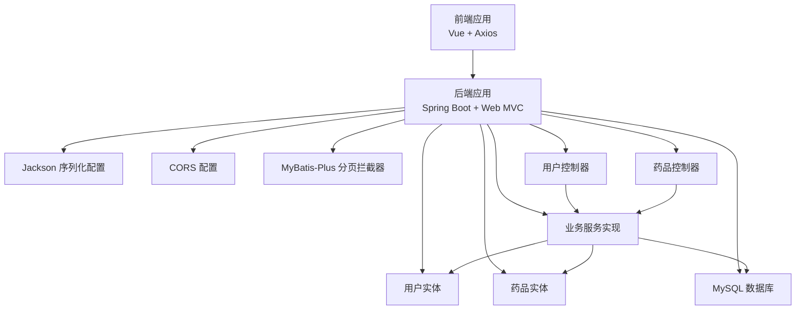
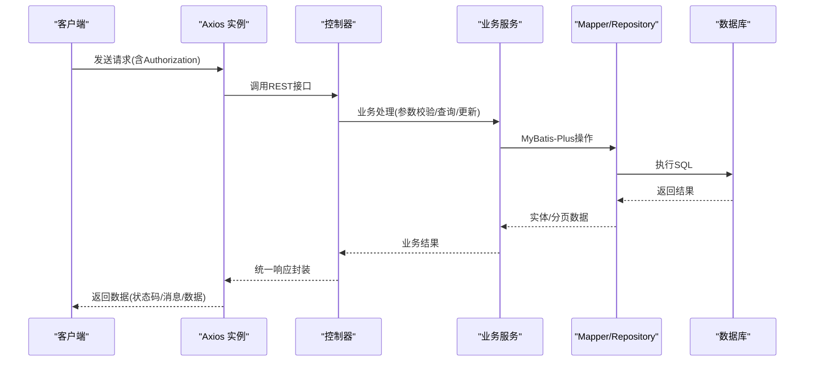
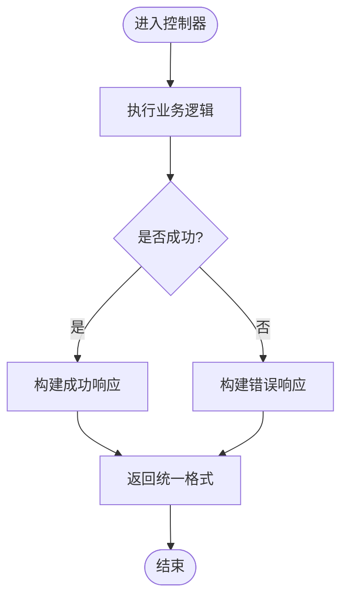
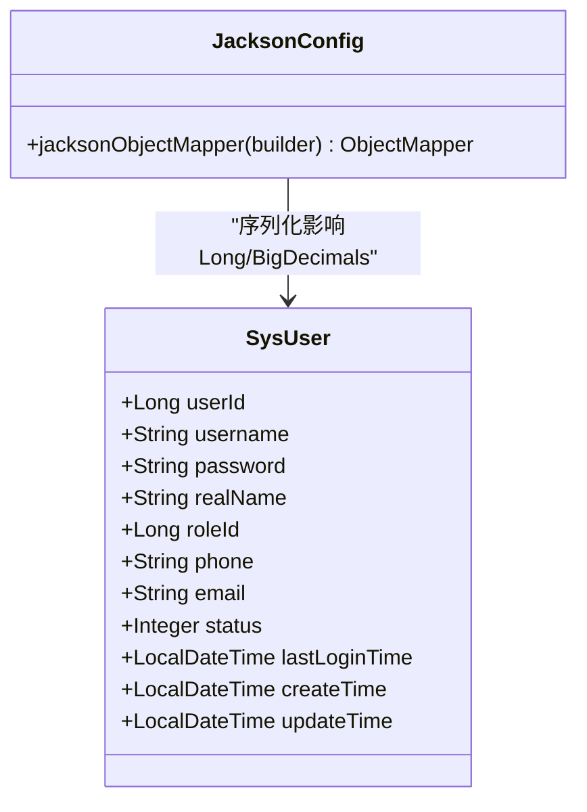
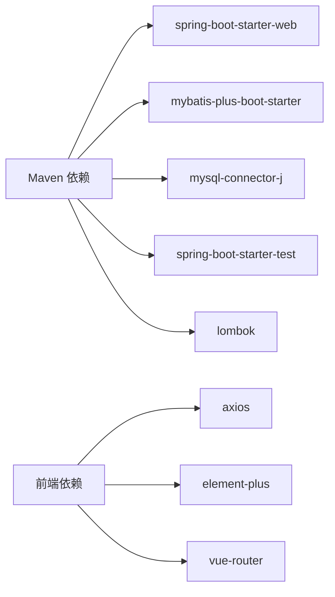

# API响应优化

<cite>
**本文引用的文件**
- [application.yml](file://src/main/resources/application.yml)
- [pom.xml](file://pom.xml)
- [Result.java](file://src/main/java/com/hospital/drugmanagement/dto/Result.java)
- [LoginRequest.java](file://src/main/java/com/hospital/drugmanagement/dto/LoginRequest.java)
- [LoginResponse.java](file://src/main/java/com/hospital/drugmanagement/dto/LoginResponse.java)
- [JacksonConfig.java](file://src/main/java/com/hospital/drugmanagement/config/JacksonConfig.java)
- [CorsConfig.java](file://src/main/java/com/hospital/drugmanagement/config/CorsConfig.java)
- [MybatisPlusConfig.java](file://src/main/java/com/hospital/drugmanagement/config/MybatisPlusConfig.java)
- [SysUserController.java](file://src/main/java/com/hospital/drugmanagement/controller/SysUserController.java)
- [DrugInfoController.java](file://src/main/java/com/hospital/drugmanagement/controller/DrugInfoController.java)
- [SysUserServiceImpl.java](file://src/main/java/com/hospital/drugmanagement/service/impl/SysUserServiceImpl.java)
- [SysUser.java](file://src/main/java/com/hospital/drugmanagement/entity/SysUser.java)
- [DrugInfo.java](file://src/main/java/com/hospital/drugmanagement/entity/DrugInfo.java)
- [request.js](file://drug-front/src/utils/request.js)
- [user.js](file://drug-front/src/api/user.js)
- [drug.js](file://drug-front/src/api/drug.js)
</cite>

## 目录
1. [引言](#引言)
2. [项目结构](#项目结构)
3. [核心组件](#核心组件)
4. [架构总览](#架构总览)
5. [详细组件分析](#详细组件分析)
6. [依赖分析](#依赖分析)
7. [性能考虑](#性能考虑)
8. [故障排查指南](#故障排查指南)
9. [结论](#结论)
10. [附录](#附录)

## 引言
本技术文档聚焦于RESTful API的响应优化与整体性能提升，结合当前仓库中的Spring Boot后端与Vue前端实现，系统性地梳理统一响应格式、数据序列化、HTTP缓存、异步与并发、批量API、限流与负载均衡、超时与错误处理、监控与分析、以及网络传输优化等主题。文档以“可落地”为目标，既提供架构层面的建议，也给出与现有代码映射的具体优化点。

## 项目结构
后端采用Spring Boot + MyBatis-Plus，前端使用Vue + Element Plus + Axios。后端通过控制器暴露REST接口，统一响应格式由工具类封装；前端通过Axios实例进行请求/响应拦截，集中处理错误与鉴权头。

图示来源
- [SysUserController.java:1-421](file://src/main/java/com/hospital/drugmanagement/controller/SysUserController.java#L1-421)
- [DrugInfoController.java:1-169](file://src/main/java/com/hospital/drugmanagement/controller/DrugInfoController.java#L1-169)
- [SysUserServiceImpl.java:1-127](file://src/main/java/com/hospital/drugmanagement/service/impl/SysUserServiceImpl.java#L1-127)
- [JacksonConfig.java:1-34](file://src/main/java/com/hospital/drugmanagement/config/JacksonConfig.java#L1-34)
- [CorsConfig.java:1-19](file://src/main/java/com/hospital/drugmanagement/config/CorsConfig.java#L1-19)
- [MybatisPlusConfig.java:1-16](file://src/main/java/com/hospital/drugmanagement/config/MybatisPlusConfig.java#L1-16)
- [SysUser.java:1-130](file://src/main/java/com/hospital/drugmanagement/entity/SysUser.java#L1-130)
- [DrugInfo.java:1-167](file://src/main/java/com/hospital/drugmanagement/entity/DrugInfo.java#L1-167)
- [application.yml:1-24](file://src/main/resources/application.yml#L1-24)

章节来源
- [application.yml:1-24](file://src/main/resources/application.yml#L1-L24)
- [pom.xml:1-119](file://pom.xml#L1-L119)

## 核心组件
- 统一响应格式：后端提供通用封装类，前端通过Axios拦截器统一处理状态码与错误提示。
- 数据序列化：Jackson配置对Long类型序列化为字符串，避免前端精度问题。
- CORS：全局跨域配置，允许所有来源与方法。
- 分页与查询：MyBatis-Plus分页插件，控制器侧支持多条件查询。
- 安全与鉴权：前端在请求头携带Authorization，后端解析并校验。

章节来源
- [Result.java:1-99](file://src/main/java/com/hospital/drugmanagement/dto/Result.java#L1-L99)
- [request.js:1-56](file://drug-front/src/utils/request.js#L1-L56)
- [JacksonConfig.java:1-34](file://src/main/java/com/hospital/drugmanagement/config/JacksonConfig.java#L1-L34)
- [CorsConfig.java:1-19](file://src/main/java/com/hospital/drugmanagement/config/CorsConfig.java#L1-L19)
- [MybatisPlusConfig.java:1-16](file://src/main/java/com/hospital/drugmanagement/config/MybatisPlusConfig.java#L1-L16)
- [SysUserController.java:1-421](file://src/main/java/com/hospital/drugmanagement/controller/SysUserController.java#L1-L421)
- [DrugInfoController.java:1-169](file://src/main/java/com/hospital/drugmanagement/controller/DrugInfoController.java#L1-L169)

## 架构总览
后端控制器接收HTTP请求，调用业务服务执行领域逻辑，服务层访问Mapper/Repository并与数据库交互。响应通过统一格式封装后返回。前端通过Axios实例发送请求，自动注入鉴权头并统一处理非200状态。

图示来源
- [SysUserController.java:43-67](file://src/main/java/com/hospital/drugmanagement/controller/SysUserController.java#L43-L67)
- [SysUserServiceImpl.java:42-102](file://src/main/java/com/hospital/drugmanagement/service/impl/SysUserServiceImpl.java#L42-L102)
- [MybatisPlusConfig.java:10-15](file://src/main/java/com/hospital/drugmanagement/config/MybatisPlusConfig.java#L10-L15)
- [request.js:12-53](file://drug-front/src/utils/request.js#L12-L53)

## 详细组件分析

### 统一响应格式与异常处理
- 后端统一响应封装类提供成功/失败多种静态构造方法，便于控制器直接返回一致结构。
- 控制器部分仍使用Map手动组装响应，建议逐步迁移到统一封装类，减少重复代码与格式差异。
- 前端Axios响应拦截器根据code判断错误并统一提示，401时清理本地token并跳转登录。

图示来源
- [Result.java:50-97](file://src/main/java/com/hospital/drugmanagement/dto/Result.java#L50-L97)
- [SysUserController.java:43-67](file://src/main/java/com/hospital/drugmanagement/controller/SysUserController.java#L43-L67)
- [request.js:28-53](file://drug-front/src/utils/request.js#L28-L53)

章节来源
- [Result.java:1-99](file://src/main/java/com/hospital/drugmanagement/dto/Result.java#L1-L99)
- [SysUserController.java:1-421](file://src/main/java/com/hospital/drugmanagement/controller/SysUserController.java#L1-L421)
- [request.js:1-56](file://drug-front/src/utils/request.js#L1-L56)

### 数据序列化优化（Long精度与JSON输出）
- Jackson配置将Long类型序列化为字符串，避免前端大整数精度丢失。
- 可进一步评估BigDecimal序列化策略，确保价格/金额类字段在前后端保持一致精度。

图示来源
- [JacksonConfig.java:17-32](file://src/main/java/com/hospital/drugmanagement/config/JacksonConfig.java#L17-L32)
- [SysUser.java:14-41](file://src/main/java/com/hospital/drugmanagement/entity/SysUser.java#L14-L41)

章节来源
- [JacksonConfig.java:1-34](file://src/main/java/com/hospital/drugmanagement/config/JacksonConfig.java#L1-L34)
- [SysUser.java:1-130](file://src/main/java/com/hospital/drugmanagement/entity/SysUser.java#L1-L130)

### HTTP缓存策略
- 当前未见明确的缓存控制头设置（如Cache-Control/ETag/Last-Modified）。
- 建议对只读列表/详情接口启用缓存，结合Etag或Last-Modified实现条件请求，降低带宽与CPU消耗。

章节来源
- [CorsConfig.java:10-17](file://src/main/java/com/hospital/drugmanagement/config/CorsConfig.java#L10-L17)

### 异步处理与并发优化
- 控制器与服务层均为同步阻塞实现，适合中小规模并发。
- 对耗时操作（如批量导入、报表导出）建议引入异步任务队列（如消息中间件），返回任务ID，前端轮询或WebSocket推送结果。

章节来源
- [SysUserController.java:1-421](file://src/main/java/com/hospital/drugmanagement/controller/SysUserController.java#L1-L421)
- [SysUserServiceImpl.java:1-127](file://src/main/java/com/hospital/drugmanagement/service/impl/SysUserServiceImpl.java#L1-L127)

### 批量API设计
- 现有控制器以单条CRUD为主，未见批量接口。
- 建议新增批量新增/更新/删除接口，合并多次请求为一次往返，减少网络开销与事务提交次数。

章节来源
- [SysUserController.java:254-308](file://src/main/java/com/hospital/drugmanagement/controller/SysUserController.java#L254-L308)
- [DrugInfoController.java:76-113](file://src/main/java/com/hospital/drugmanagement/controller/DrugInfoController.java#L76-L113)

### API限流与负载均衡
- 未见显式的限流与熔断配置。
- 建议在网关或应用层引入限流（令牌桶/滑动窗口），结合Redis实现分布式限流；对热点接口设置更严格阈值；配合Nginx/云负载均衡做流量分发与健康检查。

章节来源
- [application.yml:14-16](file://src/main/resources/application.yml#L14-L16)

### 请求超时与连接池
- 前端Axios默认超时15秒，可根据接口特性调整。
- 后端Tomcat默认连接池参数未显式配置，建议在配置文件中设置合适的最大连接数、空闲超时、请求超时等参数，避免高并发下的连接争用。

章节来源
- [request.js:6-9](file://drug-front/src/utils/request.js#L6-L9)
- [application.yml:14-16](file://src/main/resources/application.yml#L14-L16)

### 错误处理与异常响应
- 控制器内try/catch分散处理异常，建议统一异常处理器（@ControllerAdvice）集中处理业务异常与运行时异常，返回统一格式。
- 前端对401进行强制登出，建议同时记录日志与埋点，便于定位问题。

章节来源
- [SysUserController.java:43-67](file://src/main/java/com/hospital/drugmanagement/controller/SysUserController.java#L43-L67)
- [request.js:36-44](file://drug-front/src/utils/request.js#L36-L44)

### 性能监控与响应时间分析
- 建议接入APM（如SkyWalking/OpenTelemetry）或Spring Boot Actuator + Micrometer，采集接口耗时、吞吐量、错误率、线程池状态等指标。
- 结合日志链路追踪（TraceId），定位慢请求根因。

章节来源
- [pom.xml:32-84](file://pom.xml#L32-L84)

### 网络传输优化与压缩
- 建议启用Gzip/Brotli压缩，减少JSON体积；对静态资源使用CDN。
- 前端按需加载与懒加载，后端分页与字段裁剪，避免一次性返回过多数据。

章节来源
- [CorsConfig.java:10-17](file://src/main/java/com/hospital/drugmanagement/config/CorsConfig.java#L10-L17)
- [application.yml:1-24](file://src/main/resources/application.yml#L1-L24)

## 依赖分析
后端依赖Spring Web、MyBatis-Plus、MySQL驱动与测试框架；前端使用Axios进行HTTP通信。

图示来源
- [pom.xml:32-84](file://pom.xml#L32-L84)
- [request.js](file://drug-front/src/utils/request.js#L1)

章节来源
- [pom.xml:1-119](file://pom.xml#L1-L119)
- [request.js:1-56](file://drug-front/src/utils/request.js#L1-L56)

## 性能考虑
- 序列化：保持Long/BigDecimal序列化一致性，避免前后端类型不匹配导致的解析成本。
- 缓存：对高频只读接口启用缓存与条件请求，显著降低数据库压力。
- 并发：对长耗时接口异步化，利用队列与事件通知替代同步等待。
- 批量：合并多次请求为一次批量操作，减少RTT与事务开销。
- 限流与熔断：防止突发流量击穿系统，保障稳定性。
- 监控：建立完善的指标体系与告警，持续优化瓶颈环节。

## 故障排查指南
- 登录失败/未授权：检查前端Authorization头是否正确传递，后端token解析逻辑与用户状态。
- 数据精度异常：确认Jackson对Long/BigDecimal的序列化策略。
- 跨域问题：核对CORS配置的允许来源、方法与头部。
- 超时错误：调整前端Axios超时与后端服务器超时参数。
- 401跳转频繁：检查token有效期与刷新策略，避免频繁重新登录。

章节来源
- [SysUserController.java:73-147](file://src/main/java/com/hospital/drugmanagement/controller/SysUserController.java#L73-L147)
- [SysUserServiceImpl.java:42-102](file://src/main/java/com/hospital/drugmanagement/service/impl/SysUserServiceImpl.java#L42-L102)
- [request.js:12-53](file://drug-front/src/utils/request.js#L12-L53)
- [CorsConfig.java:10-17](file://src/main/java/com/hospital/drugmanagement/config/CorsConfig.java#L10-L17)

## 结论
通过统一响应格式、序列化优化、缓存与条件请求、异步与批量处理、限流与监控等手段，可在不改变业务逻辑的前提下显著提升API的稳定性与性能。建议优先落地：统一异常处理、启用缓存、异步化长耗时任务、完善监控与告警。

## 附录
- 前端API调用示例：用户管理与药品管理的增删改查均通过Axios封装的请求函数发起，遵循统一的响应格式与错误处理流程。

章节来源
- [user.js:1-71](file://drug-front/src/api/user.js#L1-L71)
- [drug.js:1-45](file://drug-front/src/api/drug.js#L1-L45)