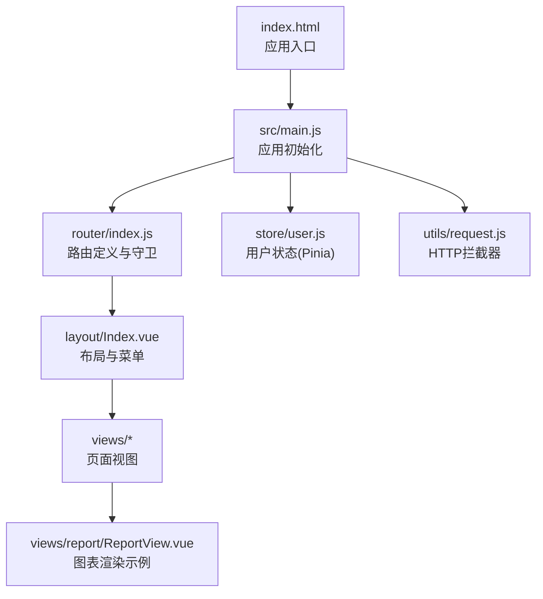
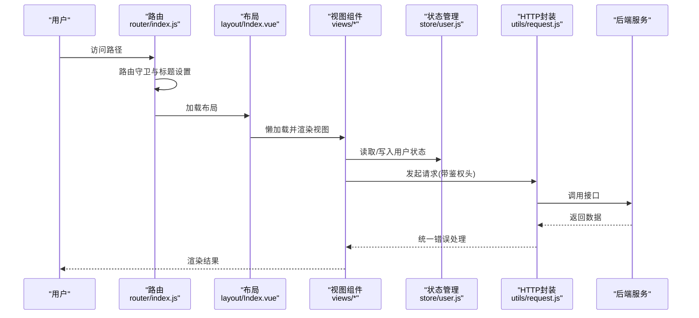
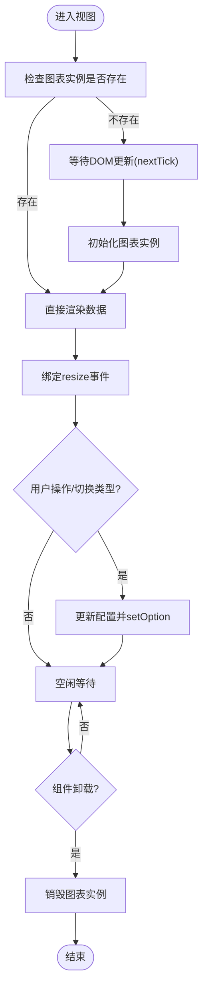
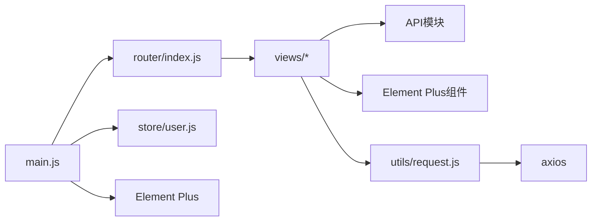

# 前端性能优化

<cite>
**本文引用的文件**
- [package.json](file://drug-front/package.json)
- [vite.config.js](file://drug-front/vite.config.js)
- [index.html](file://drug-front/index.html)
- [main.js](file://drug-front/src/main.js)
- [router/index.js](file://drug-front/src/router/index.js)
- [store/user.js](file://drug-front/src/store/user.js)
- [utils/request.js](file://drug-front/src/utils/request.js)
- [App.vue](file://drug-front/src/App.vue)
- [layout/Index.vue](file://drug-front/src/layout/Index.vue)
- [views/Login.vue](file://drug-front/src/views/Login.vue)
- [views/Dashboard.vue](file://drug-front/src/views/Dashboard.vue)
- [views/drug/DrugList.vue](file://drug-front/src/views/drug/DrugList.vue)
- [views/report/ReportView.vue](file://drug-front/src/views/report/ReportView.vue)
</cite>

## 目录
1. [引言](#引言)
2. [项目结构](#项目结构)
3. [核心组件](#核心组件)
4. [架构总览](#架构总览)
5. [详细组件分析](#详细组件分析)
6. [依赖分析](#依赖分析)
7. [性能考量](#性能考量)
8. [故障排查指南](#故障排查指南)
9. [结论](#结论)
10. [附录](#附录)

## 引言
本文件面向Vue.js前端应用的性能优化，结合仓库现有代码，系统梳理Vite构建优化、代码分割与懒加载、组件与状态管理性能、资源与CDN优化、监控与分析工具、以及首屏与用户体验优化策略。目标是帮助开发者在不牺牲可维护性的前提下，显著提升应用的启动速度、交互流畅度与资源占用。

## 项目结构
该前端工程采用Vue 3 + Vite + Pinia + Vue Router + Element Plus的组合，目录组织清晰，遵循“按功能模块”划分的典型结构。关键入口为index.html与main.js，路由集中在router/index.js，状态管理位于store/user.js，HTTP请求通过utils/request.js统一封装。

**图表来源**
- [index.html:1-14](file://drug-front/index.html#L1-L14)
- [main.js:1-26](file://drug-front/src/main.js#L1-L26)
- [router/index.js:1-115](file://drug-front/src/router/index.js#L1-L115)
- [store/user.js:1-68](file://drug-front/src/store/user.js#L1-L68)
- [utils/request.js:1-56](file://drug-front/src/utils/request.js#L1-L56)
- [layout/Index.vue:1-213](file://drug-front/src/layout/Index.vue#L1-L213)
- [views/report/ReportView.vue:1-333](file://drug-front/src/views/report/ReportView.vue#L1-L333)

**章节来源**
- [index.html:1-14](file://drug-front/index.html#L1-L14)
- [main.js:1-26](file://drug-front/src/main.js#L1-L26)
- [router/index.js:1-115](file://drug-front/src/router/index.js#L1-L115)
- [store/user.js:1-68](file://drug-front/src/store/user.js#L1-L68)
- [utils/request.js:1-56](file://drug-front/src/utils/request.js#L1-L56)
- [layout/Index.vue:1-213](file://drug-front/src/layout/Index.vue#L1-L213)
- [views/report/ReportView.vue:1-333](file://drug-front/src/views/report/ReportView.vue#L1-L333)

## 核心组件
- 应用入口与插件注册：在main.js中完成Pinia、Router、Element Plus的安装与全局图标注册，确保运行时一次性注入，避免重复注册带来的开销。
- 路由与懒加载：router/index.js中对登录页与各业务视图均采用动态导入，形成天然的代码分割，配合Vite默认行为实现按需加载。
- 状态管理：store/user.js使用Pinia持久化localStorage，减少重复请求与重复渲染；getter用于派生状态，避免在模板中重复计算。
- HTTP拦截：utils/request.js统一处理鉴权头、错误提示与401跳转，降低页面逻辑复杂度，提升一致性与可维护性。
- 视图组件：views/report/ReportView.vue展示图表渲染场景，涉及图表实例生命周期与窗口resize事件处理，是性能优化的关键点之一。

**章节来源**
- [main.js:1-26](file://drug-front/src/main.js#L1-L26)
- [router/index.js:1-115](file://drug-front/src/router/index.js#L1-L115)
- [store/user.js:1-68](file://drug-front/src/store/user.js#L1-L68)
- [utils/request.js:1-56](file://drug-front/src/utils/request.js#L1-L56)
- [views/report/ReportView.vue:1-333](file://drug-front/src/views/report/ReportView.vue#L1-L333)

## 架构总览
下图展示了从浏览器到后端服务的请求链路，以及应用内部的模块关系。重点在于：路由懒加载、状态持久化、HTTP拦截与图表渲染的性能控制。

**图表来源**
- [router/index.js:91-112](file://drug-front/src/router/index.js#L91-L112)
- [layout/Index.vue:60-146](file://drug-front/src/layout/Index.vue#L60-L146)
- [views/report/ReportView.vue:64-315](file://drug-front/src/views/report/ReportView.vue#L64-L315)
- [store/user.js:20-65](file://drug-front/src/store/user.js#L20-L65)
- [utils/request.js:11-53](file://drug-front/src/utils/request.js#L11-L53)

## 详细组件分析

### Vite构建与开发服务器
- 插件与别名：启用@vitejs/plugin-vue，配置路径别名@指向src，便于模块导入与IDE跳转。
- 开发服务器：本地端口3000，代理/api到后端服务，便于前后端联调。
- 构建脚本：package.json中的build脚本使用vite build，默认开启代码分割与产物优化。

建议增强项（基于现有配置）：
- 生产环境可启用rollup插件以进一步压缩与Tree-Shaking（当前仓库未显式配置，但Vite默认已优化）。
- 对于大体量图表库(echarts)，可在生产环境考虑CDN引入以减小包体。

**章节来源**
- [vite.config.js:1-22](file://drug-front/vite.config.js#L1-L22)
- [package.json:8-12](file://drug-front/package.json#L8-L12)

### 路由懒加载与守卫
- 懒加载：登录页与所有子路由均使用动态导入，形成独立chunk，首屏仅加载必要模块。
- 路由守卫：beforeEach中根据用户登录状态决定放行或重定向；同时设置页面标题，改善SEO与可访问性。
- 历史模式：使用createWebHistory，利于SEO与分享。

优化要点：
- 避免在路由守卫中执行重型同步任务，保持其轻量。
- 可将部分非关键路由的懒加载改为更细粒度拆分，进一步缩短首屏加载时间。

**章节来源**
- [router/index.js:1-115](file://drug-front/src/router/index.js#L1-L115)

### 状态管理与持久化
- 持久化：token、userInfo、roles、menus从localStorage读取与写入，减少重复登录与菜单请求。
- Getter：提供isLoggedIn、realName等派生状态，避免模板中重复计算。
- Actions：集中处理登录、获取当前用户、登出，统一错误处理与本地存储清理。

优化要点：
- 对频繁变更的字段可考虑分块持久化，避免localStorage过大影响I/O。
- 在多标签页场景下，监听storage事件以同步其他标签页的状态变化。

**章节来源**
- [store/user.js:1-68](file://drug-front/src/store/user.js#L1-L68)

### HTTP拦截与错误处理
- 请求拦截：自动附加Authorization头，减少重复代码。
- 响应拦截：统一校验code，非200提示错误；401时清理本地存储并跳转登录，保证会话一致性。
- 超时与基础地址：统一超时与baseURL，便于后续迁移与测试。

优化要点：
- 可增加重试机制与降级策略，针对弱网环境提升稳定性。
- 错误上报：在拦截器中集成错误上报，便于定位问题。

**章节来源**
- [utils/request.js:1-56](file://drug-front/src/utils/request.js#L1-L56)

### 图表渲染与内存管理
- 图表初始化：首次渲染时通过nextTick初始化echarts实例，避免DOM尚未就绪导致的异常。
- 实例复用：通过局部变量复用图表实例，减少重复初始化成本。
- 窗口自适应：监听resize事件，逐个图表调用resize，避免布局抖动。
- 生命周期：在组件卸载时销毁图表实例，防止内存泄漏。

**图表来源**
- [views/report/ReportView.vue:88-308](file://drug-front/src/views/report/ReportView.vue#L88-L308)

**章节来源**
- [views/report/ReportView.vue:1-333](file://drug-front/src/views/report/ReportView.vue#L1-L333)

### 首屏与交互体验
- 首屏：index.html仅挂载#app，其余逻辑由Vue按需加载，有利于缩短TTFB与FCP。
- 登录页：views/Login.vue提供简洁表单与加载态，减少首屏阻塞。
- 仪表盘：views/Dashboard.vue使用Element Plus卡片与图标，布局清晰，适合首屏展示关键指标。
- 列表页：views/drug/DrugList.vue支持分页与搜索，避免一次性加载大量数据。

优化建议：
- 首屏关键资源：将首屏必需的CSS内联，减少额外请求。
- 骨架屏：在异步数据加载时显示骨架屏，改善感知性能。
- 预连接：对API域名配置preconnect，缩短DNS与TLS握手时间。

**章节来源**
- [index.html:1-14](file://drug-front/index.html#L1-L14)
- [views/Login.vue:1-127](file://drug-front/src/views/Login.vue#L1-L127)
- [views/Dashboard.vue:1-226](file://drug-front/src/views/Dashboard.vue#L1-L226)
- [views/drug/DrugList.vue:1-426](file://drug-front/src/views/drug/DrugList.vue#L1-L426)

## 依赖分析
- 运行时依赖：vue、vue-router、pinia、element-plus、axios、@element-plus/icons-vue、dayjs、echarts。
- 开发依赖：@vitejs/plugin-vue、vite、sass。
- 依赖关系：main.js依赖router、store、Element Plus；router依赖store；views依赖API与UI组件；utils依赖axios。

**图表来源**
- [main.js:1-26](file://drug-front/src/main.js#L1-L26)
- [router/index.js:1-115](file://drug-front/src/router/index.js#L1-L115)
- [store/user.js:1-68](file://drug-front/src/store/user.js#L1-L68)
- [utils/request.js:1-56](file://drug-front/src/utils/request.js#L1-L56)

**章节来源**
- [package.json:13-27](file://drug-front/package.json#L13-L27)
- [main.js:1-26](file://drug-front/src/main.js#L1-L26)
- [router/index.js:1-115](file://drug-front/src/router/index.js#L1-L115)
- [store/user.js:1-68](file://drug-front/src/store/user.js#L1-L68)
- [utils/request.js:1-56](file://drug-front/src/utils/request.js#L1-L56)

## 性能考量
- Vite构建优化
  - 默认启用Rollup打包，具备Tree-Shaking与代码分割能力；可通过rollupOptions进一步裁剪产物。
  - 使用@vitejs/plugin-vue可利用编译时优化，减少运行时开销。
- 代码分割与懒加载
  - 路由层懒加载已实现；建议对大型视图或第三方库进行更细粒度拆分。
  - 对于echarts等大库，可考虑CDN引入并在构建时排除，以减小bundle体积。
- 组件与虚拟DOM
  - 合理使用computed与getter，避免在模板中进行复杂计算。
  - 对长列表使用虚拟滚动或分页，减少一次性渲染节点数量。
- 响应式与状态管理
  - 将大对象拆分为多个store模块，避免单一store过大导致的全量响应式追踪。
  - 使用storeToRefs减少解构带来的响应式丢失风险。
- 资源与CDN
  - 对element-plus、echarts、axios等稳定库考虑CDN，结合Vite的external配置。
  - 图片资源建议使用现代格式(WebP/AVIF)与懒加载，配合占位符优化。
- 监控与分析
  - 集成Web Vitals或自定义指标采集，关注CLS、LCP、FID、INP等。
  - 使用Performance API记录关键渲染路径与长任务。
- 用户体验
  - 骨架屏、占位图、骨架屏与过渡动画提升感知性能。
  - 首屏关键路径最小化，避免阻塞渲染的脚本与样式。

[本节为通用性能指导，无需特定文件引用]

## 故障排查指南
- 登录无响应
  - 检查路由守卫逻辑与用户store状态；确认localStorage中token与userInfo是否正确写入。
  - 查看utils/request.js中请求拦截器是否正确附加Authorization头。
- 图表不显示或空白
  - 确认DOM已就绪后再初始化图表；检查resize事件绑定与组件卸载时的销毁逻辑。
  - 核对数据结构与setOption参数，避免类型不匹配。
- 首屏白屏或加载慢
  - 检查路由懒加载是否生效；确认index.html中入口脚本路径正确。
  - 对大组件进行拆分或延迟加载，减少首屏JS体积。
- 401频繁跳转
  - 检查后端返回code与拦截器逻辑；确认localStorage清理时机与路由跳转逻辑。

**章节来源**
- [router/index.js:91-112](file://drug-front/src/router/index.js#L91-L112)
- [store/user.js:20-65](file://drug-front/src/store/user.js#L20-L65)
- [utils/request.js:11-53](file://drug-front/src/utils/request.js#L11-L53)
- [views/report/ReportView.vue:302-308](file://drug-front/src/views/report/ReportView.vue#L302-L308)

## 结论
本项目已具备良好的性能基础：路由懒加载、状态持久化、HTTP拦截与布局清晰。建议在现有基础上进一步完善Vite构建配置、细化代码分割、引入CDN与资源优化、强化监控与分析体系，并持续优化组件渲染与状态更新策略，以获得更优的首屏与交互体验。

[本节为总结性内容，无需特定文件引用]

## 附录
- 关键实现位置参考
  - 应用入口与插件注册：[main.js:1-26](file://drug-front/src/main.js#L1-L26)
  - 路由与懒加载：[router/index.js:1-115](file://drug-front/src/router/index.js#L1-L115)
  - 状态持久化：[store/user.js:1-68](file://drug-front/src/store/user.js#L1-L68)
  - HTTP拦截：[utils/request.js:1-56](file://drug-front/src/utils/request.js#L1-L56)
  - 首屏入口：[index.html:1-14](file://drug-front/index.html#L1-L14)
  - 图表渲染示例：[views/report/ReportView.vue:1-333](file://drug-front/src/views/report/ReportView.vue#L1-L333)

[本节为补充说明，无需特定文件引用]