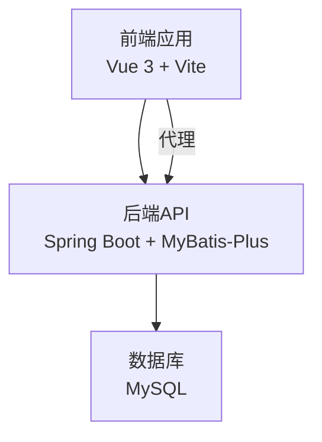
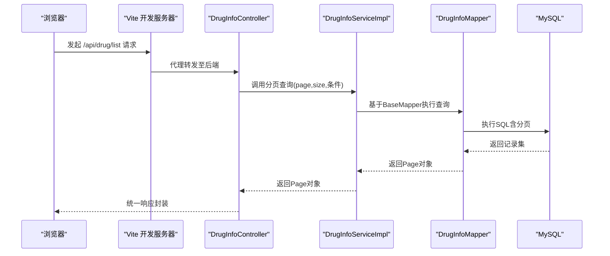
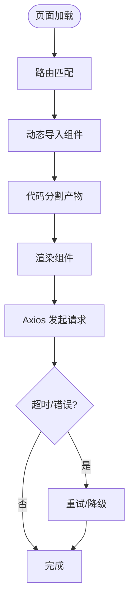
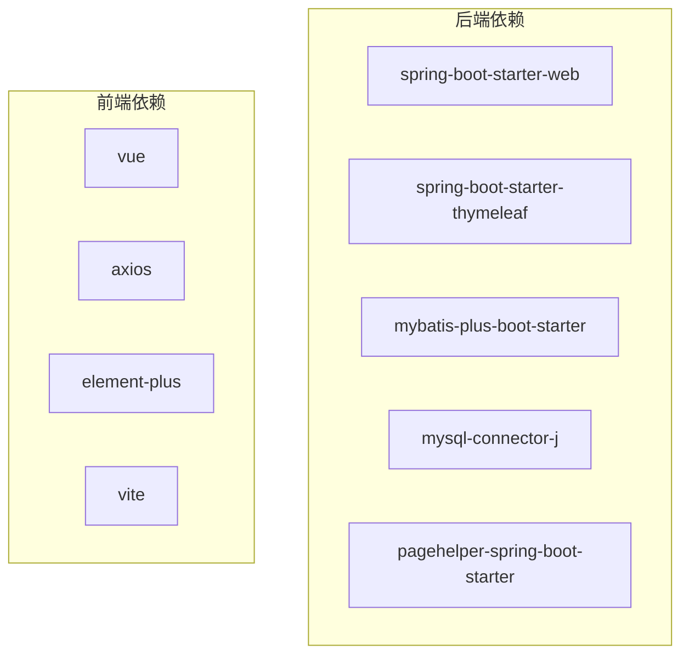
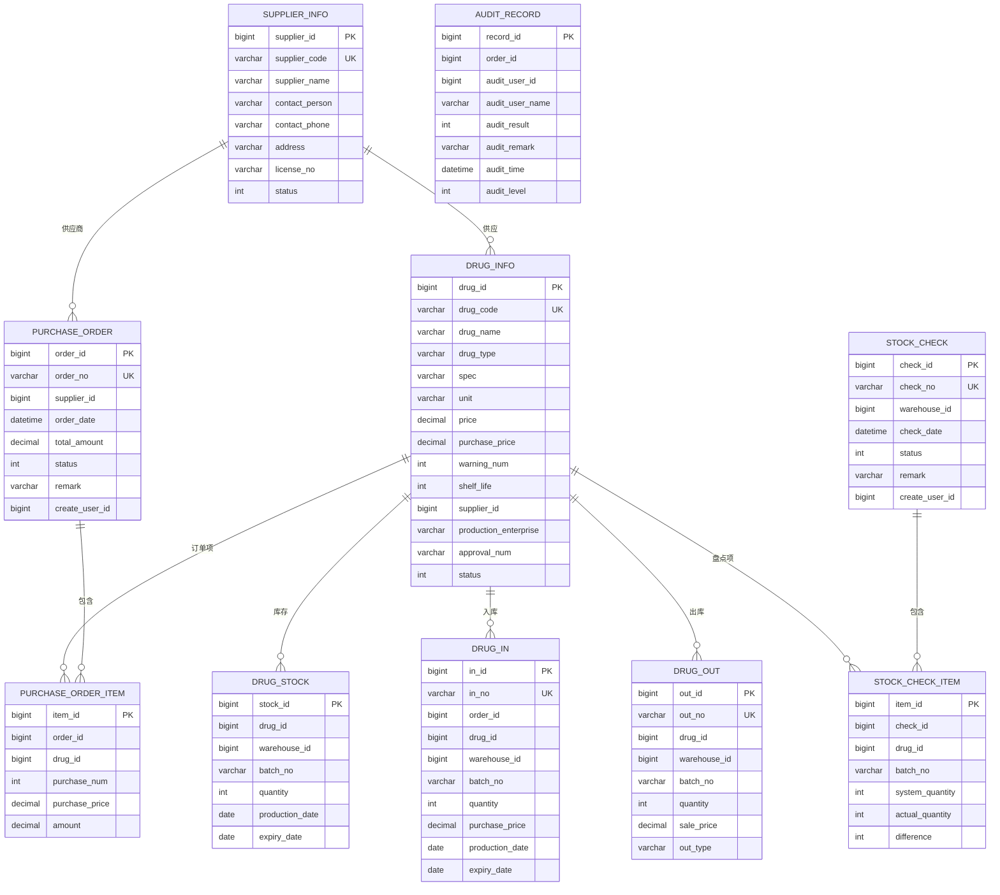

# 性能优化

<cite>
**本文引用的文件**
- [application.yml](file://src/main/resources/application.yml)
- [MybatisPlusConfig.java](file://src/main/java/com/hospital/drugmanagement/config/MybatisPlusConfig.java)
- [CorsConfig.java](file://src/main/java/com/hospital/drugmanagement/config/CorsConfig.java)
- [JacksonConfig.java](file://src/main/java/com/hospital/drugmanagement/config/JacksonConfig.java)
- [pom.xml](file://pom.xml)
- [DrugInfoController.java](file://src/main/java/com/hospital/drugmanagement/controller/DrugInfoController.java)
- [DrugInfoServiceImpl.java](file://src/main/java/com/hospital/drugmanagement/service/impl/DrugInfoServiceImpl.java)
- [DrugInfoMapper.java](file://src/main/java/com/hospital/drugmanagement/mapper/DrugInfoMapper.java)
- [DrugInfo.java](file://src/main/java/com/hospital/drugmanagement/entity/DrugInfo.java)
- [Result.java](file://src/main/java/com/hospital/drugmanagement/dto/Result.java)
- [request.js](file://drug-front/src/utils/request.js)
- [drug.js](file://drug-front/src/api/drug.js)
- [vite.config.js](file://drug-front/vite.config.js)
- [package.json](file://drug-front/package.json)
- [init.sql](file://src/main/resources/db/init.sql)
</cite>

## 目录
1. [简介](#简介)
2. [项目结构](#项目结构)
3. [核心组件](#核心组件)
4. [架构总览](#架构总览)
5. [详细组件分析](#详细组件分析)
6. [依赖分析](#依赖分析)
7. [性能考虑](#性能考虑)
8. [故障排查指南](#故障排查指南)
9. [结论](#结论)
10. [附录](#附录)

## 简介
本文件面向医院药品管理系统，聚焦后端数据库与MyBatis-Plus、前端Vue生态以及整体API响应的性能优化策略与落地实践。内容涵盖：
- 数据库查询优化：分页查询、批量操作建议、索引优化、查询缓存思路
- 缓存策略：Redis缓存配置建议、本地缓存、查询结果缓存、会话缓存
- 前端性能优化：组件懒加载、代码分割、资源压缩、CDN加速
- API响应优化：异步处理、并发控制、负载均衡、限流策略
- 系统监控：性能指标采集、慢查询分析、内存使用监控、并发性能测试
- 性能测试方法：基准测试、压力测试指南
- 瓶颈识别、优化效果评估与持续改进策略

## 项目结构
系统采用前后端分离架构：
- 后端：Spring Boot + MyBatis-Plus，提供REST API
- 前端：Vue 3 + Vite，Axios发起HTTP请求，Element Plus提供UI组件
- 数据库：MySQL，初始化脚本包含多张业务表及常用索引

**图表来源**
- [vite.config.js:12-20](file://drug-front/vite.config.js#L12-L20)
- [application.yml:1-24](file://src/main/resources/application.yml#L1-L24)

**章节来源**
- [pom.xml:32-83](file://pom.xml#L32-L83)
- [application.yml:1-24](file://src/main/resources/application.yml#L1-L24)
- [vite.config.js:1-22](file://drug-front/vite.config.js#L1-L22)

## 核心组件
- 配置层：MyBatis-Plus分页插件、CORS跨域、Jackson序列化
- 控制器层：统一响应包装、分页查询入口
- 服务层：基于MyBatis-Plus的通用Service实现
- 数据访问层：Mapper接口继承BaseMapper
- 实体层：实体类映射数据库表字段
- 前端：Axios实例封装、路由代理、API模块化

**章节来源**
- [MybatisPlusConfig.java:1-16](file://src/main/java/com/hospital/drugmanagement/config/MybatisPlusConfig.java#L1-L16)
- [CorsConfig.java:1-19](file://src/main/java/com/hospital/drugmanagement/config/CorsConfig.java#L1-L19)
- [JacksonConfig.java:1-34](file://src/main/java/com/hospital/drugmanagement/config/JacksonConfig.java#L1-L34)
- [DrugInfoController.java:1-169](file://src/main/java/com/hospital/drugmanagement/controller/DrugInfoController.java#L1-L169)
- [DrugInfoServiceImpl.java:1-18](file://src/main/java/com/hospital/drugmanagement/service/impl/DrugInfoServiceImpl.java#L1-L18)
- [DrugInfoMapper.java:1-9](file://src/main/java/com/hospital/drugmanagement/mapper/DrugInfoMapper.java#L1-L9)
- [DrugInfo.java:1-167](file://src/main/java/com/hospital/drugmanagement/entity/DrugInfo.java#L1-L167)
- [Result.java:1-99](file://src/main/java/com/hospital/drugmanagement/dto/Result.java#L1-L99)

## 架构总览
后端通过MyBatis-Plus拦截器启用分页；控制器接收请求参数并调用服务层；服务层复用通用CRUD能力；前端通过Axios与后端交互，Vite开发服务器进行代理。

**图表来源**
- [DrugInfoController.java:22-58](file://src/main/java/com/hospital/drugmanagement/controller/DrugInfoController.java#L22-L58)
- [DrugInfoServiceImpl.java:14-18](file://src/main/java/com/hospital/drugmanagement/service/impl/DrugInfoServiceImpl.java#L14-L18)
- [DrugInfoMapper.java:7-9](file://src/main/java/com/hospital/drugmanagement/mapper/DrugInfoMapper.java#L7-L9)
- [application.yml:18-24](file://src/main/resources/application.yml#L18-L24)

## 详细组件分析

### 数据库查询优化
- 分页查询
  - 后端已启用MyBatis-Plus分页插件，控制器通过Page对象传参，避免全表扫描。
  - 建议：前端传入合理size，避免超大分页；对高频查询建立合适索引。
- 批量操作
  - 当前服务层使用通用CRUD；如需批量插入/更新，可扩展Mapper或使用批量工具提升吞吐。
- 索引优化
  - 初始化脚本已为多表关键字段建立索引（如drug_info、drug_stock、purchase_order等）。
  - 建议：结合慢查询日志与执行计划，针对性补充复合索引与覆盖索引。
- 查询缓存
  - 可引入Redis作为热点数据缓存；对只读列表、字典类数据设置TTL，降低数据库压力。

**章节来源**
- [MybatisPlusConfig.java:10-15](file://src/main/java/com/hospital/drugmanagement/config/MybatisPlusConfig.java#L10-L15)
- [DrugInfoController.java:22-58](file://src/main/java/com/hospital/drugmanagement/controller/DrugInfoController.java#L22-L58)
- [init.sql:60-125](file://src/main/resources/db/init.sql#L60-L125)

### 缓存策略
- Redis缓存配置
  - 建议新增spring.redis配置与缓存抽象层；对高频查询结果设置短TTL，配合LRU淘汰。
- 本地缓存
  - 对轻量、低频变更的数据可在JVM内维护短期缓存，减少重复计算。
- 查询结果缓存
  - 列表查询结果可按查询参数组合Key化缓存；更新时失效相关Key。
- 会话缓存
  - 登录态与权限信息可缓存，结合令牌过期策略与刷新机制。

[本节为策略性建议，不直接分析具体文件]

### 前端性能优化
- 组件懒加载与代码分割
  - 使用动态import实现路由级代码分割，减少首屏体积。
- 资源压缩与CDN
  - 生产构建启用压缩与Tree-shaking；静态资源可接入CDN加速。
- Axios配置
  - 已设置超时与拦截器，建议增加重试与错误降级策略。

**图表来源**
- [vite.config.js:1-22](file://drug-front/vite.config.js#L1-L22)
- [request.js:6-9](file://drug-front/src/utils/request.js#L6-L9)

**章节来源**
- [vite.config.js:1-22](file://drug-front/vite.config.js#L1-L22)
- [request.js:1-56](file://drug-front/src/utils/request.js#L1-L56)
- [package.json:1-29](file://drug-front/package.json#L1-L29)

### API响应优化
- 异步处理
  - 对耗时任务（如报表导出）采用异步队列，返回任务ID，轮询获取结果。
- 并发控制
  - 使用信号量或线程池限制同时处理请求数，避免瞬时洪峰压垮服务。
- 负载均衡
  - 多实例部署，结合Nginx或云负载均衡分发流量。
- 限流策略
  - 基于令牌桶/滑动窗口实现接口级限流，保护下游系统。

[本节为通用优化建议，不直接分析具体文件]

### 系统监控
- 性能指标采集
  - 引入Micrometer与Prometheus，采集QPS、延迟、错误率、线程数、堆内存等。
- 慢查询分析
  - 开启慢查询日志，结合索引与执行计划定位问题SQL。
- 内存使用监控
  - 关注GC频率与停顿时间，排查内存泄漏与对象逃逸。
- 并发性能测试
  - 使用JMeter或Gatling进行并发场景压测，观察P95/P99延迟与错误率。

[本节为通用监控建议，不直接分析具体文件]

## 依赖分析
后端依赖Spring Web、Thymeleaf、MyBatis-Plus、MySQL驱动；前端依赖Vue 3、Axios、Element Plus、Vite。

**图表来源**
- [pom.xml:32-83](file://pom.xml#L32-L83)
- [package.json:13-27](file://drug-front/package.json#L13-L27)

**章节来源**
- [pom.xml:32-83](file://pom.xml#L32-L83)
- [package.json:1-29](file://drug-front/package.json#L1-L29)

## 性能考虑
- 数据库层面
  - 合理分页与索引：优先使用覆盖索引与复合索引，避免SELECT *。
  - 连接池与事务：设置合适的连接数与超时，短事务降低锁竞争。
- 应用层面
  - 序列化优化：Long转String避免精度丢失，减少JSON体积。
  - 统一异常与响应：快速失败与明确错误码，降低客户端重试成本。
- 前端层面
  - 资源压缩与缓存：开启Gzip/Brotli，利用浏览器缓存与CDN。
  - 渲染优化：虚拟滚动、图片懒加载、骨架屏。

**章节来源**
- [application.yml:1-24](file://src/main/resources/application.yml#L1-L24)
- [JacksonConfig.java:17-32](file://src/main/java/com/hospital/drugmanagement/config/JacksonConfig.java#L17-L32)
- [CorsConfig.java:8-18](file://src/main/java/com/hospital/drugmanagement/config/CorsConfig.java#L8-L18)

## 故障排查指南
- SQL打印与日志
  - application.yml已开启SQL输出，便于定位慢查询与参数绑定问题。
- 统一响应与错误码
  - 控制器返回统一Result结构，前端拦截器根据code处理错误与跳转。
- CORS与跨域
  - CORS配置允许任意来源与方法，注意生产环境收紧策略。
- 前端超时与重试
  - Axios设置超时，建议增加自动重试与错误提示。

**章节来源**
- [application.yml:22-24](file://src/main/resources/application.yml#L22-L24)
- [DrugInfoController.java:44-58](file://src/main/java/com/hospital/drugmanagement/controller/DrugInfoController.java#L44-L58)
- [Result.java:53-97](file://src/main/java/com/hospital/drugmanagement/dto/Result.java#L53-L97)
- [CorsConfig.java:10-16](file://src/main/java/com/hospital/drugmanagement/config/CorsConfig.java#L10-L16)
- [request.js:12-53](file://drug-front/src/utils/request.js#L12-L53)

## 结论
本系统在后端已具备分页查询与统一响应的基础能力，前端具备代理与Axios封装。建议在现有基础上：
- 补充Redis缓存与本地缓存策略
- 针对高频查询完善索引与慢查询治理
- 前端实施代码分割与CDN加速
- 引入限流与负载均衡，完善监控体系
- 建立性能测试流程与持续改进机制

[本节为总结性内容，不直接分析具体文件]

## 附录

### 数据模型概览

**图表来源**
- [init.sql:60-238](file://src/main/resources/db/init.sql#L60-L238)

### 性能测试方法与指南
- 基准测试
  - 使用JMH对关键方法进行微基准测试，评估序列化、分页查询等热点路径。
- 压力测试
  - 使用JMeter/Gatling构造并发场景，逐步提升并发度，观察延迟与错误率拐点。
- 指标采集
  - 采集CPU、内存、GC、网络I/O、数据库连接数、慢查询条数等。
- 回归验证
  - 每次优化后进行回归测试，确保功能正确与性能稳定。

[本节为通用测试建议，不直接分析具体文件]