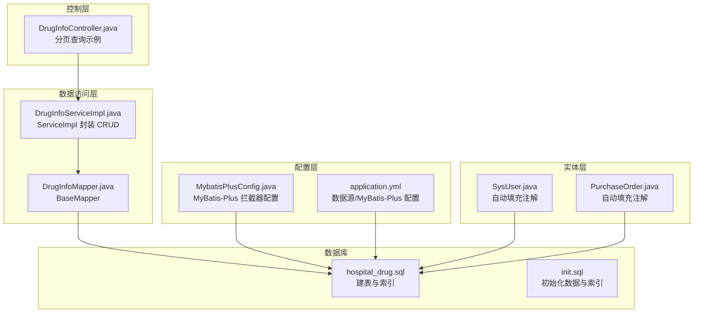
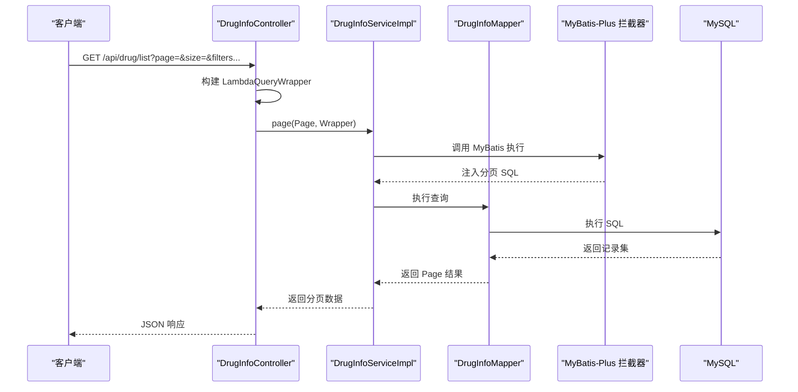
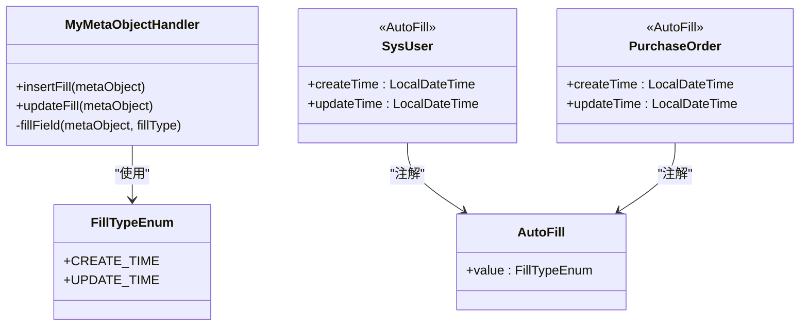
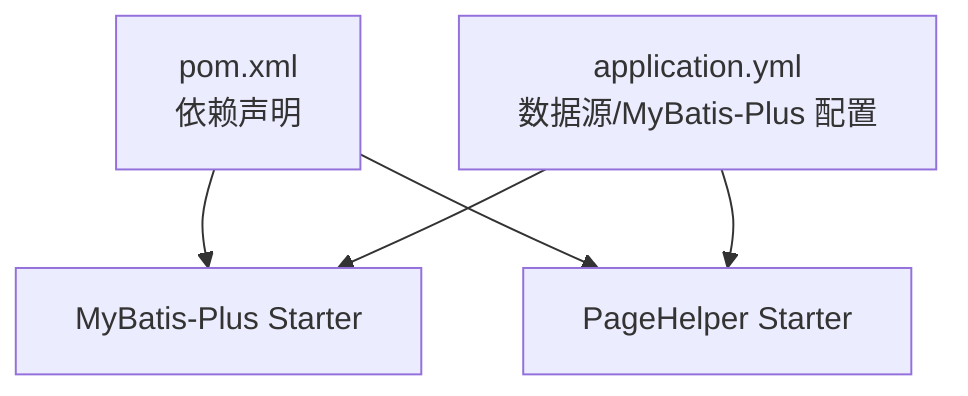

# 数据库性能优化

<cite>
**本文引用的文件**
- [application.yml](file://src/main/resources/application.yml)
- [MybatisPlusConfig.java](file://src/main/java/com/hospital/drugmanagement/config/MybatisPlusConfig.java)
- [MyMetaObjectHandler.java](file://src/main/java/com/hospital/drugmanagement/common/handler/MyMetaObjectHandler.java)
- [AutoFill.java](file://src/main/java/com/hospital/drugmanagement/common/anno/AutoFill.java)
- [FillTypeEnum.java](file://src/main/java/com/hospital/drugmanagement/common/constant/FillTypeEnum.java)
- [SysUser.java](file://src/main/java/com/hospital/drugmanagement/entity/SysUser.java)
- [PurchaseOrder.java](file://src/main/java/com/hospital/drugmanagement/entity/PurchaseOrder.java)
- [DrugInfoController.java](file://src/main/java/com/hospital/drugmanagement/controller/DrugInfoController.java)
- [DrugInfoServiceImpl.java](file://src/main/java/com/hospital/drugmanagement/service/impl/DrugInfoServiceImpl.java)
- [DrugInfoMapper.java](file://src/main/java/com/hospital/drugmanagement/mapper/DrugInfoMapper.java)
- [hospital_drug.sql](file://hospital_drug.sql)
- [init.sql](file://src/main/resources/db/init.sql)
- [pom.xml](file://pom.xml)
</cite>

## 目录
1. [简介](#简介)
2. [项目结构](#项目结构)
3. [核心组件](#核心组件)
4. [架构总览](#架构总览)
5. [详细组件分析](#详细组件分析)
6. [依赖分析](#依赖分析)
7. [性能考量](#性能考量)
8. [故障排查指南](#故障排查指南)
9. [结论](#结论)
10. [附录](#附录)

## 简介
本文件聚焦于数据库性能优化主题，结合当前代码库中的配置与实现，系统阐述以下内容：
- MyBatis-Plus 分页查询优化与拦截器配置
- 批量操作优化思路与落地建议
- 索引设计策略与查询计划分析
- SQL 执行优化与慢查询识别
- 数据库连接池与事务管理优化
- 查询缓存策略与实体自动填充机制
- 实体类自动填充、字段更新优化与批量插入/更新
- 数据库监控指标、性能基准测试与容量规划建议

## 项目结构
项目采用 Spring Boot + MyBatis-Plus 的典型分层结构，数据库相关的关键位置如下：
- 配置层：MyBatis-Plus 拦截器与 SQL 日志配置位于 application.yml 与 MybatisPlusConfig.java
- 数据访问层：Mapper 接口继承 MyBatis-Plus 的 BaseMapper，Service 层继承 ServiceImpl 复用基础 CRUD
- 实体层：通过注解标注表名、主键与自动填充字段
- 控制器层：以分页查询为例展示分页参数与查询包装器的使用

图表来源
- [application.yml:1-24](file://src/main/resources/application.yml#L1-L24)
- [MybatisPlusConfig.java:1-16](file://src/main/java/com/hospital/drugmanagement/config/MybatisPlusConfig.java#L1-L16)
- [DrugInfoMapper.java:1-9](file://src/main/java/com/hospital/drugmanagement/mapper/DrugInfoMapper.java#L1-L9)
- [DrugInfoServiceImpl.java:1-18](file://src/main/java/com/hospital/drugmanagement/service/impl/DrugInfoServiceImpl.java#L1-L18)
- [SysUser.java:1-130](file://src/main/java/com/hospital/drugmanagement/entity/SysUser.java#L1-L130)
- [PurchaseOrder.java:1-40](file://src/main/java/com/hospital/drugmanagement/entity/PurchaseOrder.java#L1-L40)
- [DrugInfoController.java:1-169](file://src/main/java/com/hospital/drugmanagement/controller/DrugInfoController.java#L1-L169)
- [hospital_drug.sql:1-307](file://hospital_drug.sql#L1-L307)
- [init.sql:1-312](file://src/main/resources/db/init.sql#L1-L312)

章节来源
- [application.yml:1-24](file://src/main/resources/application.yml#L1-L24)
- [MybatisPlusConfig.java:1-16](file://src/main/java/com/hospital/drugmanagement/config/MybatisPlusConfig.java#L1-L16)
- [DrugInfoController.java:22-58](file://src/main/java/com/hospital/drugmanagement/controller/DrugInfoController.java#L22-L58)
- [hospital_drug.sql:62-85](file://hospital_drug.sql#L62-L85)
- [init.sql:60-80](file://src/main/resources/db/init.sql#L60-L80)

## 核心组件
- MyBatis-Plus 拦截器与分页插件
  - 在配置类中注册 MyBatis-Plus 拦截器，并添加分页内核拦截器，用于在 SQL 执行前改写为分页查询
  - 参考：[MybatisPlusConfig.java:10-15](file://src/main/java/com/hospital/drugmanagement/config/MybatisPlusConfig.java#L10-L15)
- SQL 日志与驼峰映射
  - application.yml 中开启 SQL 输出与下划线到驼峰的自动映射，便于调试与性能分析
  - 参考：[application.yml:18-24](file://src/main/resources/application.yml#L18-L24)
- 实体自动填充
  - 通过自定义注解与元对象处理器，在插入/更新时自动填充时间字段，减少重复代码与潜在错误
  - 参考：[MyMetaObjectHandler.java:21-32](file://src/main/java/com/hospital/drugmanagement/common/handler/MyMetaObjectHandler.java#L21-L32)，[AutoFill.java:12-15](file://src/main/java/com/hospital/drugmanagement/common/anno/AutoFill.java#L12-L15)，[FillTypeEnum.java:6-9](file://src/main/java/com/hospital/drugmanagement/common/constant/FillTypeEnum.java#L6-L9)，[SysUser.java:36-40](file://src/main/java/com/hospital/drugmanagement/entity/SysUser.java#L36-L40)，[PurchaseOrder.java:35-39](file://src/main/java/com/hospital/drugmanagement/entity/PurchaseOrder.java#L35-L39)
- 分页查询示例
  - 控制器中使用 LambdaQueryWrapper 构建查询条件，并通过 Service.page(Page, Wrapper) 实现分页
  - 参考：[DrugInfoController.java:33-45](file://src/main/java/com/hospital/drugmanagement/controller/DrugInfoController.java#L33-L45)

章节来源
- [MybatisPlusConfig.java:10-15](file://src/main/java/com/hospital/drugmanagement/config/MybatisPlusConfig.java#L10-L15)
- [application.yml:18-24](file://src/main/resources/application.yml#L18-L24)
- [MyMetaObjectHandler.java:21-32](file://src/main/java/com/hospital/drugmanagement/common/handler/MyMetaObjectHandler.java#L21-L32)
- [AutoFill.java:12-15](file://src/main/java/com/hospital/drugmanagement/common/anno/AutoFill.java#L12-L15)
- [FillTypeEnum.java:6-9](file://src/main/java/com/hospital/drugmanagement/common/constant/FillTypeEnum.java#L6-L9)
- [SysUser.java:36-40](file://src/main/java/com/hospital/drugmanagement/entity/SysUser.java#L36-L40)
- [PurchaseOrder.java:35-39](file://src/main/java/com/hospital/drugmanagement/entity/PurchaseOrder.java#L35-L39)
- [DrugInfoController.java:33-45](file://src/main/java/com/hospital/drugmanagement/controller/DrugInfoController.java#L33-L45)

## 架构总览
下图展示了从控制器到数据访问层再到数据库的整体调用链路，以及分页拦截器与自动填充处理器在其中的作用。

图表来源
- [DrugInfoController.java:22-58](file://src/main/java/com/hospital/drugmanagement/controller/DrugInfoController.java#L22-L58)
- [DrugInfoServiceImpl.java:14-18](file://src/main/java/com/hospital/drugmanagement/service/impl/DrugInfoServiceImpl.java#L14-L18)
- [DrugInfoMapper.java:7-9](file://src/main/java/com/hospital/drugmanagement/mapper/DrugInfoMapper.java#L7-L9)
- [MybatisPlusConfig.java:10-15](file://src/main/java/com/hospital/drugmanagement/config/MybatisPlusConfig.java#L10-L15)

## 详细组件分析

### MyBatis-Plus 分页插件与拦截器
- 配置要点
  - 在配置类中注册 MyBatis-Plus 拦截器，并添加分页内核拦截器，确保分页 SQL 被正确改写
  - 参考：[MybatisPlusConfig.java:10-15](file://src/main/java/com/hospital/drugmanagement/config/MybatisPlusConfig.java#L10-L15)
- 使用方式
  - 控制器接收页码与大小参数，构造 Page 对象与查询条件，调用 Service.page 即可实现分页
  - 参考：[DrugInfoController.java:22-58](file://src/main/java/com/hospital/drugmanagement/controller/DrugInfoController.java#L22-L58)
- 性能建议
  - 避免大页码与超大每页条数；对高频查询建立合适索引以降低排序成本
  - 结合数据库慢查询日志与执行计划分析定位瓶颈

章节来源
- [MybatisPlusConfig.java:10-15](file://src/main/java/com/hospital/drugmanagement/config/MybatisPlusConfig.java#L10-L15)
- [DrugInfoController.java:22-58](file://src/main/java/com/hospital/drugmanagement/controller/DrugInfoController.java#L22-L58)

### 实体自动填充机制
- 设计思路
  - 通过自定义注解标记需要自动填充的字段，利用 MetaObjectHandler 在插入/更新时自动设置时间字段
  - 参考：[AutoFill.java:12-15](file://src/main/java/com/hospital/drugmanagement/common/anno/AutoFill.java#L12-L15)，[MyMetaObjectHandler.java:21-32](file://src/main/java/com/hospital/drugmanagement/common/handler/MyMetaObjectHandler.java#L21-L32)
- 实体应用
  - SysUser、PurchaseOrder 等实体通过注解声明创建/更新时间字段，简化业务代码
  - 参考：[SysUser.java:36-40](file://src/main/java/com/hospital/drugmanagement/entity/SysUser.java#L36-L40)，[PurchaseOrder.java:35-39](file://src/main/java/com/hospital/drugmanagement/entity/PurchaseOrder.java#L35-L39)
- 错误处理
  - 处理反射访问异常与空对象情况，保证自动填充流程稳定
  - 参考：[MyMetaObjectHandler.java:36-38](file://src/main/java/com/hospital/drugmanagement/common/handler/MyMetaObjectHandler.java#L36-L38)，[MyMetaObjectHandler.java:55-58](file://src/main/java/com/hospital/drugmanagement/common/handler/MyMetaObjectHandler.java#L55-L58)

图表来源
- [AutoFill.java:12-15](file://src/main/java/com/hospital/drugmanagement/common/anno/AutoFill.java#L12-L15)
- [FillTypeEnum.java:6-9](file://src/main/java/com/hospital/drugmanagement/common/constant/FillTypeEnum.java#L6-L9)
- [MyMetaObjectHandler.java:21-32](file://src/main/java/com/hospital/drugmanagement/common/handler/MyMetaObjectHandler.java#L21-L32)
- [SysUser.java:36-40](file://src/main/java/com/hospital/drugmanagement/entity/SysUser.java#L36-L40)
- [PurchaseOrder.java:35-39](file://src/main/java/com/hospital/drugmanagement/entity/PurchaseOrder.java#L35-L39)

章节来源
- [AutoFill.java:12-15](file://src/main/java/com/hospital/drugmanagement/common/anno/AutoFill.java#L12-L15)
- [FillTypeEnum.java:6-9](file://src/main/java/com/hospital/drugmanagement/common/constant/FillTypeEnum.java#L6-L9)
- [MyMetaObjectHandler.java:21-32](file://src/main/java/com/hospital/drugmanagement/common/handler/MyMetaObjectHandler.java#L21-L32)
- [SysUser.java:36-40](file://src/main/java/com/hospital/drugmanagement/entity/SysUser.java#L36-L40)
- [PurchaseOrder.java:35-39](file://src/main/java/com/hospital/drugmanagement/entity/PurchaseOrder.java#L35-L39)

### 索引设计策略与查询计划分析
- 现状分析
  - 建表脚本中已为常用关联字段与唯一键建立索引，如 drug_info 的 drug_code、idx_supplier_id，purchase_order 的 order_no、idx_supplier_id 等
  - 参考：[hospital_drug.sql:64-84](file://hospital_drug.sql#L64-L84)，[hospital_drug.sql:132-146](file://hospital_drug.sql#L132-L146)
- 查询计划与慢查询识别
  - 开启 SQL 日志输出，结合 EXPLAIN 分析执行计划，优先检查是否存在全表扫描、回表次数过多等问题
  - 参考：[application.yml:22-24](file://src/main/resources/application.yml#L22-L24)
- 索引优化建议
  - 为高频过滤与排序字段建立复合索引，避免选择性低的前导列
  - 对 UPDATE/DELETE 常见条件建立覆盖索引，减少回表
  - 定期评估索引使用率，清理冗余索引

章节来源
- [hospital_drug.sql:64-84](file://hospital_drug.sql#L64-L84)
- [hospital_drug.sql:132-146](file://hospital_drug.sql#L132-L146)
- [application.yml:22-24](file://src/main/resources/application.yml#L22-L24)

### SQL 执行优化与批量操作
- SQL 执行优化
  - 使用 LambdaQueryWrapper 构建条件，避免手写 SQL 导致的拼接错误与注入风险
  - 参考：[DrugInfoController.java:33-42](file://src/main/java/com/hospital/drugmanagement/controller/DrugInfoController.java#L33-L42)
- 批量操作建议
  - MyBatis-Plus 提供批量插入/更新接口，建议在批量场景下合并事务，减少往返开销
  - 本项目未直接展示批量实现，可在 Service 层扩展或引入批量工具类进行优化
- 字段更新优化
  - 利用自动填充处理器统一维护创建/更新时间，避免业务层遗漏导致的数据不一致

章节来源
- [DrugInfoController.java:33-42](file://src/main/java/com/hospital/drugmanagement/controller/DrugInfoController.java#L33-L42)
- [MyMetaObjectHandler.java:21-32](file://src/main/java/com/hospital/drugmanagement/common/handler/MyMetaObjectHandler.java#L21-L32)

### 数据库连接池与事务管理
- 连接池配置
  - 当前未显式配置连接池参数，建议在 application.yml 中增加连接池参数（如最大连接数、空闲连接、超时等）以提升并发能力
  - 参考：[application.yml:3-7](file://src/main/resources/application.yml#L3-L7)
- 事务管理
  - 使用 Spring 声明式事务，确保批量操作与一致性需求得到满足
  - 建议对长事务进行拆分，避免长时间锁表影响吞吐

章节来源
- [application.yml:3-7](file://src/main/resources/application.yml#L3-L7)

### 查询缓存策略
- 本项目未启用 MyBatis 缓存或 Redis 缓存，建议针对只读高频查询引入二级缓存或应用层缓存，注意缓存失效策略与一致性问题

## 依赖分析
- MyBatis-Plus 与分页插件
  - pom.xml 中引入了 MyBatis-Plus 与 PageHelper 分页插件，需注意两者在分页上的兼容性与优先级
  - 参考：[pom.xml:59-71](file://pom.xml#L59-L71)
- 数据源与驱动
  - application.yml 中配置了 MySQL 驱动与连接参数，确保字符集与时区设置正确
  - 参考：[application.yml:4-7](file://src/main/resources/application.yml#L4-L7)

图表来源
- [pom.xml:59-71](file://pom.xml#L59-L71)
- [application.yml:18-24](file://src/main/resources/application.yml#L18-L24)

章节来源
- [pom.xml:59-71](file://pom.xml#L59-L71)
- [application.yml:18-24](file://src/main/resources/application.yml#L18-L24)

## 性能考量
- 分页查询
  - 控制页码与每页大小，避免深分页；对排序字段建立索引
  - 参考：[DrugInfoController.java:24-25](file://src/main/java/com/hospital/drugmanagement/controller/DrugInfoController.java#L24-L25)
- SQL 日志与调试
  - 开启 SQL 输出有助于定位慢查询，但生产环境建议降低日志级别
  - 参考：[application.yml:22-24](file://src/main/resources/application.yml#L22-L24)
- 自动填充与一致性
  - 通过自动填充统一时间字段，减少业务层重复逻辑，提高一致性
  - 参考：[MyMetaObjectHandler.java:21-32](file://src/main/java/com/hospital/drugmanagement/common/handler/MyMetaObjectHandler.java#L21-L32)

## 故障排查指南
- 分页无效或 SQL 异常
  - 检查拦截器是否正确注册，确认 Page 对象与 Wrapper 参数传递
  - 参考：[MybatisPlusConfig.java:10-15](file://src/main/java/com/hospital/drugmanagement/config/MybatisPlusConfig.java#L10-L15)，[DrugInfoController.java:44-45](file://src/main/java/com/hospital/drugmanagement/controller/DrugInfoController.java#L44-L45)
- 自动填充失败
  - 检查注解是否正确标注、字段类型是否匹配、反射访问是否被允许
  - 参考：[MyMetaObjectHandler.java:36-38](file://src/main/java/com/hospital/drugmanagement/common/handler/MyMetaObjectHandler.java#L36-L38)，[MyMetaObjectHandler.java:55-58](file://src/main/java/com/hospital/drugmanagement/common/handler/MyMetaObjectHandler.java#L55-L58)
- 索引未命中
  - 使用 EXPLAIN 分析执行计划，检查 WHERE、JOIN、ORDER BY 是否使用了有效索引
  - 参考：[hospital_drug.sql:64-84](file://hospital_drug.sql#L64-L84)

章节来源
- [MybatisPlusConfig.java:10-15](file://src/main/java/com/hospital/drugmanagement/config/MybatisPlusConfig.java#L10-L15)
- [DrugInfoController.java:44-45](file://src/main/java/com/hospital/drugmanagement/controller/DrugInfoController.java#L44-L45)
- [MyMetaObjectHandler.java:36-38](file://src/main/java/com/hospital/drugmanagement/common/handler/MyMetaObjectHandler.java#L36-L38)
- [MyMetaObjectHandler.java:55-58](file://src/main/java/com/hospital/drugmanagement/common/handler/MyMetaObjectHandler.java#L55-L58)
- [hospital_drug.sql:64-84](file://hospital_drug.sql#L64-L84)

## 结论
- 本项目已具备良好的分页与自动填充基础，建议在生产环境中完善连接池与事务配置、引入查询缓存与索引优化策略
- 通过 EXPLAIN 与慢查询日志持续监控 SQL 表现，结合批量操作与覆盖索引进一步提升吞吐与稳定性

## 附录
- 数据库初始化与索引参考
  - [init.sql:60-80](file://src/main/resources/db/init.sql#L60-L80)
  - [hospital_drug.sql:64-84](file://hospital_drug.sql#L64-L84)
- 依赖版本参考
  - [pom.xml:59-71](file://pom.xml#L59-L71)