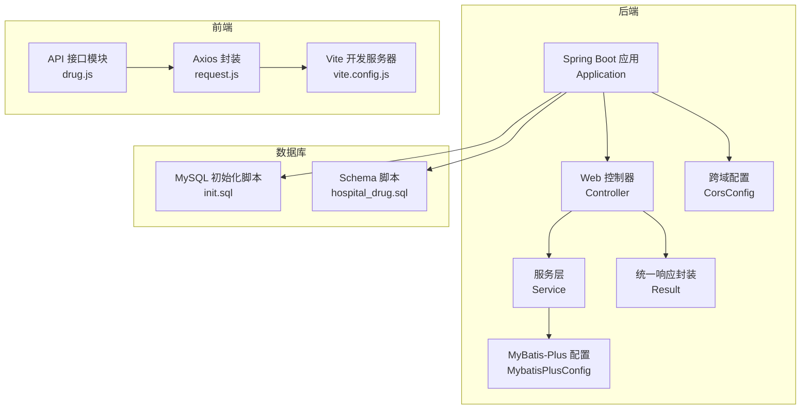
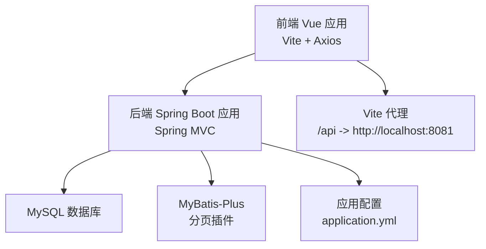
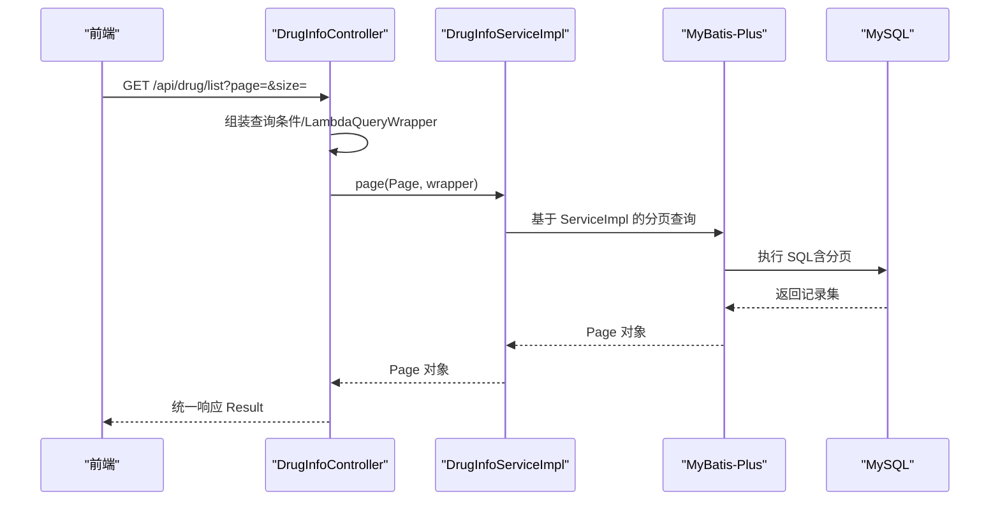
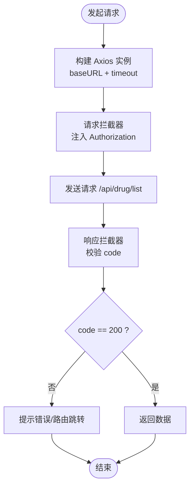
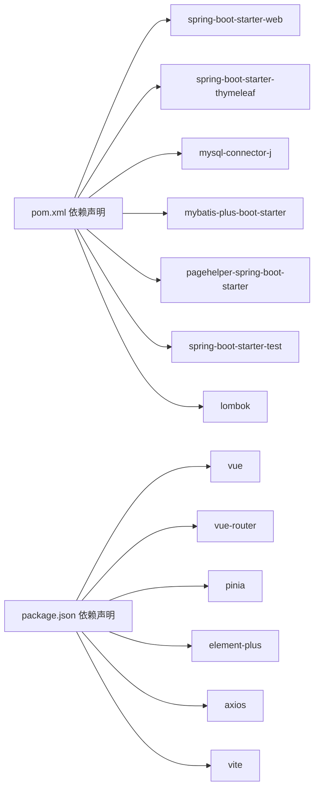

# 系统监控与性能测试

<cite>
**本文引用的文件**
- [pom.xml](file://pom.xml)
- [application.yml](file://src/main/resources/application.yml)
- [DrugManagementApplication.java](file://src/main/java/com/hospital/drugmanagement/DrugManagementApplication.java)
- [CorsConfig.java](file://src/main/java/com/hospital/drugmanagement/config/CorsConfig.java)
- [MybatisPlusConfig.java](file://src/main/java/com/hospital/drugmanagement/config/MybatisPlusConfig.java)
- [Result.java](file://src/main/java/com/hospital/drugmanagement/dto/Result.java)
- [DrugInfoController.java](file://src/main/java/com/hospital/drugmanagement/controller/DrugInfoController.java)
- [DrugInfoServiceImpl.java](file://src/main/java/com/hospital/drugmanagement/service/impl/DrugInfoServiceImpl.java)
- [package.json](file://drug-front/package.json)
- [vite.config.js](file://drug-front/vite.config.js)
- [request.js](file://drug-front/src/utils/request.js)
- [drug.js](file://drug-front/src/api/drug.js)
- [init.sql](file://src/main/resources/db/init.sql)
- [hospital_drug.sql](file://hospital_drug.sql)
- [init_and_start.bat](file://init_and_start.bat)
</cite>

## 目录
1. [简介](#简介)
2. [项目结构](#项目结构)
3. [核心组件](#核心组件)
4. [架构总览](#架构总览)
5. [详细组件分析](#详细组件分析)
6. [依赖关系分析](#依赖关系分析)
7. [性能考虑](#性能考虑)
8. [故障排查指南](#故障排查指南)
9. [结论](#结论)
10. [附录](#附录)

## 简介
本文件面向“系统监控与性能测试”的目标，结合当前代码库现状，给出可落地的监控与性能测试实践建议。当前后端基于 Spring Boot 3.2.5 + MyBatis-Plus，前端基于 Vue 3 + Vite，数据库为 MySQL 8。项目尚未集成 Spring Boot Actuator、JVM 监控、数据库连接池监控、前端性能监控与 APM 工具，亦未包含性能测试流程与告警机制。因此，本文以“现有能力为基础，补齐缺失环节”为原则，提供一套可扩展的监控与性能测试方案。

## 项目结构
后端采用标准 Spring Boot 结构，包含配置、控制器、服务层、Mapper 与实体；前端采用 Vue 3 + Vite，通过代理访问后端接口；数据库初始化脚本与一键启动脚本位于资源目录。

**图表来源**
- [DrugManagementApplication.java:14-32](file://src/main/java/com/hospital/drugmanagement/DrugManagementApplication.java#L14-L32)
- [MybatisPlusConfig.java:8-16](file://src/main/java/com/hospital/drugmanagement/config/MybatisPlusConfig.java#L8-L16)
- [CorsConfig.java:7-18](file://src/main/java/com/hospital/drugmanagement/config/CorsConfig.java#L7-L18)
- [Result.java:8-98](file://src/main/java/com/hospital/drugmanagement/dto/Result.java#L8-L98)
- [vite.config.js:5-21](file://drug-front/vite.config.js#L5-L21)
- [request.js:5-55](file://drug-front/src/utils/request.js#L5-L55)
- [drug.js:3-44](file://drug-front/src/api/drug.js#L3-L44)
- [init.sql:1-312](file://src/main/resources/db/init.sql#L1-L312)
- [hospital_drug.sql:1-200](file://hospital_drug.sql#L1-L200)

**章节来源**
- [DrugManagementApplication.java:14-32](file://src/main/java/com/hospital/drugmanagement/DrugManagementApplication.java#L14-L32)
- [application.yml:1-24](file://src/main/resources/application.yml#L1-L24)
- [pom.xml:32-84](file://pom.xml#L32-L84)
- [vite.config.js:5-21](file://drug-front/vite.config.js#L5-L21)
- [request.js:5-55](file://drug-front/src/utils/request.js#L5-L55)
- [drug.js:3-44](file://drug-front/src/api/drug.js#L3-L44)
- [init.sql:1-312](file://src/main/resources/db/init.sql#L1-L312)
- [hospital_drug.sql:1-200](file://hospital_drug.sql#L1-L200)

## 核心组件
- 应用入口与组件扫描：应用类负责启动与组件扫描，确保控制器、服务、配置被正确加载。
- 控制器层：提供 REST 接口，处理分页、条件查询、增删改查等。
- 服务层：基于 MyBatis-Plus 的 ServiceImpl，复用通用 CRUD 能力。
- 配置层：MyBatis-Plus 分页插件与 CORS 配置。
- 前端：Vite 代理后端、Axios 统一封装、API 模块化调用。
- 数据库：初始化脚本与 Schema 定义，包含多张业务表及索引。

**章节来源**
- [DrugManagementApplication.java:14-32](file://src/main/java/com/hospital/drugmanagement/DrugManagementApplication.java#L14-L32)
- [DrugInfoController.java:14-169](file://src/main/java/com/hospital/drugmanagement/controller/DrugInfoController.java#L14-L169)
- [DrugInfoServiceImpl.java:9-18](file://src/main/java/com/hospital/drugmanagement/service/impl/DrugInfoServiceImpl.java#L9-L18)
- [MybatisPlusConfig.java:8-16](file://src/main/java/com/hospital/drugmanagement/config/MybatisPlusConfig.java#L8-L16)
- [CorsConfig.java:7-18](file://src/main/java/com/hospital/drugmanagement/config/CorsConfig.java#L7-L18)
- [Result.java:8-98](file://src/main/java/com/hospital/drugmanagement/dto/Result.java#L8-L98)
- [vite.config.js:5-21](file://drug-front/vite.config.js#L5-L21)
- [request.js:5-55](file://drug-front/src/utils/request.js#L5-L55)
- [drug.js:3-44](file://drug-front/src/api/drug.js#L3-L44)
- [init.sql:1-312](file://src/main/resources/db/init.sql#L1-L312)

## 架构总览
后端通过 Spring MVC 提供 REST 接口，前端通过 Vite 本地开发服务器与 Axios 访问后端 API，数据库由 MySQL 承载。当前未启用 Actuator、JVM 监控、数据库连接池监控与前端 APM。

**图表来源**
- [DrugInfoController.java:14-169](file://src/main/java/com/hospital/drugmanagement/controller/DrugInfoController.java#L14-L169)
- [application.yml:1-24](file://src/main/resources/application.yml#L1-L24)
- [MybatisPlusConfig.java:8-16](file://src/main/java/com/hospital/drugmanagement/config/MybatisPlusConfig.java#L8-L16)
- [vite.config.js:12-21](file://drug-front/vite.config.js#L12-L21)
- [request.js:6-9](file://drug-front/src/utils/request.js#L6-L9)

## 详细组件分析

### 后端监控与性能测试配置建议
以下为基于现有工程的增强建议，帮助逐步建立监控与性能测试体系。由于当前代码库未集成 Actuator、JVM 监控、数据库连接池监控与前端 APM，以下内容为“如何接入”的指导性方案。

- Spring Boot Actuator 监控配置
  - 引入依赖：在构建文件中引入 Spring Boot Actuator 依赖。
  - 配置端点：启用健康检查、指标暴露、HTTP tracing 等端点。
  - 安全与暴露：限制敏感端点访问，仅在受控环境开放。
  - 参考路径：[pom.xml:32-84](file://pom.xml#L32-L84)

- JVM 性能监控与 GC 优化
  - 监控项：堆内存、非堆内存、GC 次数与耗时、线程数、类加载数。
  - 工具：JConsole、VisualVM、JFR、Micrometer + Prometheus/Grafana。
  - 优化策略：合理设置堆大小、选择合适 GC 算法、避免对象逃逸、减少 Full GC。
  - 参考路径：[application.yml:1-24](file://src/main/resources/application.yml#L1-L24)

- 数据库性能监控与慢查询分析
  - 连接池监控：HikariCP/MariaDB Connector/J 指标采集。
  - 慢查询：开启慢查询日志、分析执行计划、索引优化。
  - 参考路径：[application.yml:3-7](file://src/main/resources/application.yml#L3-L7)

- 前端性能监控与用户体验指标
  - 指标：首屏时间、交互延迟、页面可用性、错误率。
  - 工具：浏览器开发者工具、Lighthouse、Sentry、埋点 SDK。
  - 参考路径：[vite.config.js:12-21](file://drug-front/vite.config.js#L12-L21)，[request.js:5-55](file://drug-front/src/utils/request.js#L5-L55)

- APM 工具集成（建议）
  - 后端：Micrometer + Prometheus + Grafana，或 SkyWalking/OpenTelemetry。
  - 前端：Sentry、Google Analytics 或自研埋点。
  - 参考路径：[pom.xml:32-84](file://pom.xml#L32-L84)

- 性能测试方法论（建议）
  - 基准测试：固定场景下的吞吐与延迟基线。
  - 压力测试：逐步提升并发，观察系统极限与退化点。
  - 负载测试：稳定负载下的稳定性与资源占用。
  - 参考路径：[DrugInfoController.java:22-58](file://src/main/java/com/hospital/drugmanagement/controller/DrugInfoController.java#L22-L58)

- 监控告警与持续改进（建议）
  - 告警：CPU、内存、连接池、慢查询、错误率阈值。
  - 流程：问题定位 → 根因分析 → 修复验证 → 回归测试 → 归档总结。
  - 参考路径：[Result.java:53-97](file://src/main/java/com/hospital/drugmanagement/dto/Result.java#L53-L97)

### 关键流程图与时序图

#### 控制器到服务层调用序列

**图表来源**
- [DrugInfoController.java:22-58](file://src/main/java/com/hospital/drugmanagement/controller/DrugInfoController.java#L22-L58)
- [DrugInfoServiceImpl.java:9-18](file://src/main/java/com/hospital/drugmanagement/service/impl/DrugInfoServiceImpl.java#L9-L18)
- [application.yml:19-24](file://src/main/resources/application.yml#L19-L24)

#### 前端请求流程

**图表来源**
- [request.js:5-55](file://drug-front/src/utils/request.js#L5-L55)
- [drug.js:3-44](file://drug-front/src/api/drug.js#L3-L44)
- [vite.config.js:14-19](file://drug-front/vite.config.js#L14-L19)

## 依赖关系分析
- 后端依赖：Spring Web、Thymeleaf、MySQL 驱动、MyBatis-Plus、分页插件、测试与 Lombok。
- 前端依赖：Vue 3、Vue Router、Pinia、Element Plus、Axios、Vite。
- 数据库：初始化脚本创建多张业务表，包含索引与约束。

**图表来源**
- [pom.xml:32-84](file://pom.xml#L32-L84)
- [package.json:13-28](file://drug-front/package.json#L13-L28)

**章节来源**
- [pom.xml:32-84](file://pom.xml#L32-L84)
- [package.json:13-28](file://drug-front/package.json#L13-L28)

## 性能考虑
- 后端
  - 分页与查询：使用 MyBatis-Plus 分页插件，避免一次性加载大结果集；合理使用条件查询与索引。
  - 统一响应：通过 Result 统一返回结构，便于前端与监控侧解析。
  - 配置：Thymeleaf 关闭缓存便于调试；MyBatis 打印 SQL 有助于定位慢查询。
- 前端
  - 代理与跨域：Vite 代理将 /api 请求转发至后端，避免跨域问题。
  - 请求封装：Axios 统一设置超时与拦截器，提升错误处理一致性。
- 数据库
  - 初始化脚本包含多表与索引，建议结合 EXPLAIN 分析慢查询，补充缺失索引。

**章节来源**
- [MybatisPlusConfig.java:8-16](file://src/main/java/com/hospital/drugmanagement/config/MybatisPlusConfig.java#L8-L16)
- [Result.java:53-97](file://src/main/java/com/hospital/drugmanagement/dto/Result.java#L53-L97)
- [application.yml:8-24](file://src/main/resources/application.yml#L8-L24)
- [vite.config.js:12-21](file://drug-front/vite.config.js#L12-L21)
- [request.js:5-55](file://drug-front/src/utils/request.js#L5-L55)
- [init.sql:60-85](file://src/main/resources/db/init.sql#L60-L85)

## 故障排查指南
- 启动与端口
  - 后端端口：application.yml 中 server.port 默认 8081；若冲突需调整。
  - 前端端口：vite.config.js 中 server.port 默认 3000；代理指向后端 8081。
- 数据库连接
  - application.yml 中 datasource.url、username、password 需与本地 MySQL 一致。
  - 使用 init_and_start.bat 一键初始化数据库并启动后端。
- 接口访问
  - 前端通过 /api 前缀访问后端接口，确认代理配置与后端控制器映射。
- 统一响应
  - 若后端返回 code 非 200，前端会弹窗提示并按业务处理（如 401 登录页跳转）。

**章节来源**
- [application.yml:14-16](file://src/main/resources/application.yml#L14-L16)
- [vite.config.js:12-21](file://drug-front/vite.config.js#L12-L21)
- [init_and_start.bat:1-11](file://init_and_start.bat#L1-L11)
- [request.js:32-47](file://drug-front/src/utils/request.js#L32-L47)

## 结论
当前工程具备基础的后端与前端框架，但尚未形成完整的监控与性能测试闭环。建议按以下优先级推进：
- 第一阶段：引入 Actuator、Micrometer、JVM 监控与数据库连接池监控。
- 第二阶段：集成前端性能监控与 APM，完善告警与可视化看板。
- 第三阶段：建立性能测试流程（基准/压力/负载）、瓶颈识别与持续改进机制。

## 附录
- 数据库初始化与一键启动
  - 使用 init_and_start.bat 自动执行初始化脚本并启动后端服务。
  - 参考路径：[init_and_start.bat:1-11](file://init_and_start.bat#L1-L11)，[init.sql:1-312](file://src/main/resources/db/init.sql#L1-L312)，[hospital_drug.sql:1-200](file://hospital_drug.sql#L1-L200)