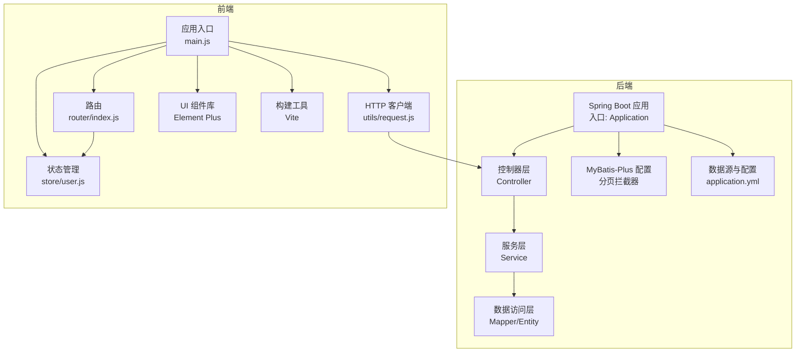
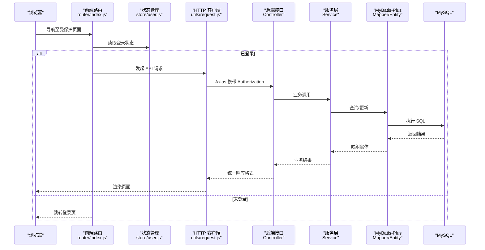
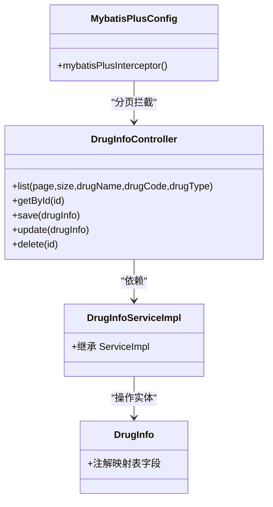
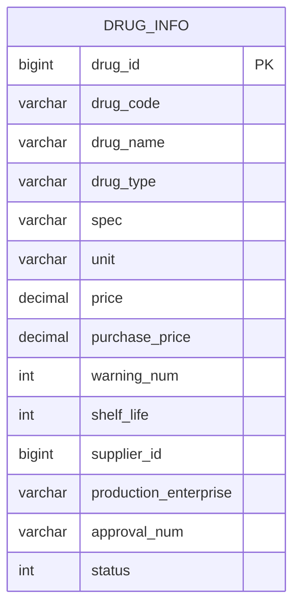
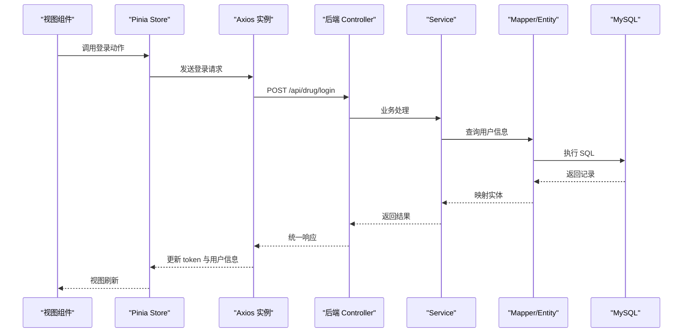
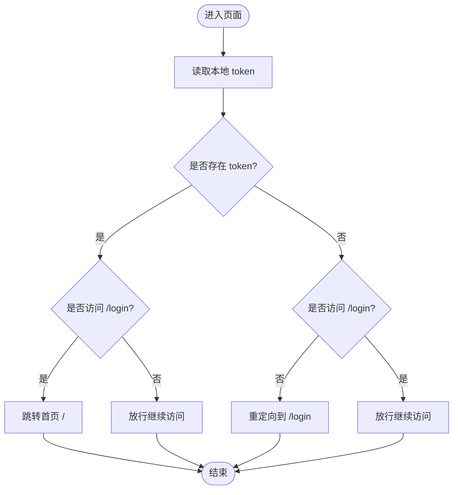
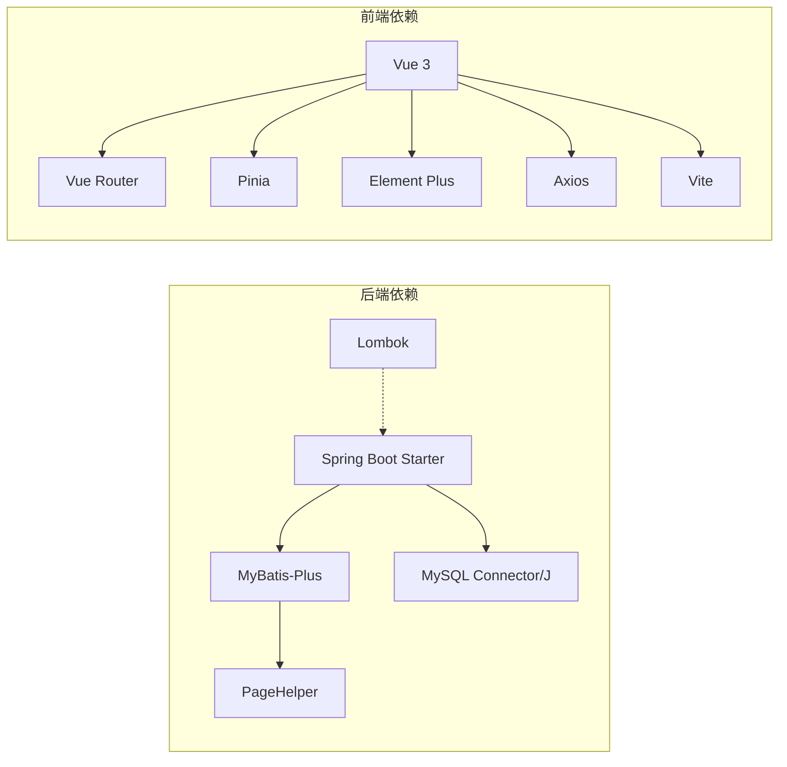

# 技术栈详解

<cite>
**本文引用的文件**
- [pom.xml](file://pom.xml)
- [application.yml](file://src/main/resources/application.yml)
- [DrugManagementApplication.java](file://src/main/java/com/hospital/drugmanagement/DrugManagementApplication.java)
- [MybatisPlusConfig.java](file://src/main/java/com/hospital/drugmanagement/config/MybatisPlusConfig.java)
- [DrugInfoController.java](file://src/main/java/com/hospital/drugmanagement/controller/DrugInfoController.java)
- [DrugInfoServiceImpl.java](file://src/main/java/com/hospital/drugmanagement/service/impl/DrugInfoServiceImpl.java)
- [DrugInfo.java](file://src/main/java/com/hospital/drugmanagement/entity/DrugInfo.java)
- [package.json](file://drug-front/package.json)
- [vite.config.js](file://drug-front/vite.config.js)
- [main.js](file://drug-front/src/main.js)
- [index.js](file://drug-front/src/router/index.js)
- [user.js](file://drug-front/src/store/user.js)
- [request.js](file://drug-front/src/utils/request.js)
</cite>

## 目录
1. [引言](#引言)
2. [项目结构](#项目结构)
3. [核心组件](#核心组件)
4. [架构总览](#架构总览)
5. [详细组件分析](#详细组件分析)
6. [依赖关系分析](#依赖关系分析)
7. [性能考量](#性能考量)
8. [故障排查指南](#故障排查指南)
9. [结论](#结论)
10. [附录](#附录)

## 引言
本文件系统性解析“医院药品管理系统”的完整技术栈，覆盖后端与前端的关键技术选型、版本兼容性、性能特点与最佳实践，并提供替代方案对比与学习资源建议，帮助开发者深入理解架构决策。

## 项目结构
该项目采用前后端分离架构：
- 后端基于 Spring Boot 3.2.5，使用 MyBatis-Plus 3.5.7 作为 ORM，MySQL 作为持久化存储，Lombok 简化实体与配置。
- 前端基于 Vue 3 + Composition API，使用 Element Plus、Vue Router 4、Axios、Pinia，Vite 提供快速开发与构建体验。

图表来源
- [DrugManagementApplication.java:14-33](file://src/main/java/com/hospital/drugmanagement/DrugManagementApplication.java#L14-L33)
- [MybatisPlusConfig.java:8-16](file://src/main/java/com/hospital/drugmanagement/config/MybatisPlusConfig.java#L8-L16)
- [application.yml:1-24](file://src/main/resources/application.yml#L1-L24)
- [main.js:1-26](file://drug-front/src/main.js#L1-L26)
- [index.js:1-115](file://drug-front/src/router/index.js#L1-L115)
- [user.js:1-68](file://drug-front/src/store/user.js#L1-L68)
- [request.js:1-56](file://drug-front/src/utils/request.js#L1-L56)

章节来源
- [pom.xml:29-84](file://pom.xml#L29-L84)
- [application.yml:1-24](file://src/main/resources/application.yml#L1-L24)
- [DrugManagementApplication.java:14-33](file://src/main/java/com/hospital/drugmanagement/DrugManagementApplication.java#L14-L33)
- [package.json:1-29](file://drug-front/package.json#L1-L29)
- [vite.config.js:1-22](file://drug-front/vite.config.js#L1-L22)
- [main.js:1-26](file://drug-front/src/main.js#L1-L26)

## 核心组件
- 后端框架与依赖
  - Spring Boot 3.2.5：提供自动配置、Starter 依赖与内嵌服务器，简化开发与部署。
  - MyBatis-Plus 3.5.7：在 MyBatis 基础上增强 CRUD、分页、条件构造器等能力，显著提升开发效率。
  - MySQL Connector/J 8.x：驱动连接 MySQL 8+，配合 application.yml 中的连接参数使用。
  - Lombok 1.18.34：通过注解减少样板代码，提升可读性与维护性。
- 前端框架与依赖
  - Vue 3.4 + Composition API：现代化组合式 API，提供更好的逻辑复用与类型推断。
  - Element Plus 2.5：完善的中后台 UI 组件库，内置国际化与图标体系。
  - Vue Router 4.2.5：支持历史模式与路由守卫，满足权限控制与页面标题设置。
  - Axios 1.6.5：统一请求与响应拦截，集中处理鉴权与错误提示。
  - Pinia 2.1.7：轻量级状态管理，API 清晰，支持 TypeScript。
  - Vite 5：快速冷启动与热更新，优化开发体验与构建速度。
- 构建工具
  - Maven：依赖管理与打包，结合 Spring Boot Maven 插件进行构建与运行。
  - Vite：开发服务器与生产构建，支持代理跨域与路径别名。

章节来源
- [pom.xml:32-84](file://pom.xml#L32-L84)
- [application.yml:1-24](file://src/main/resources/application.yml#L1-L24)
- [package.json:8-28](file://drug-front/package.json#L8-L28)
- [vite.config.js:5-21](file://drug-front/vite.config.js#L5-L21)
- [main.js:1-26](file://drug-front/src/main.js#L1-L26)

## 架构总览
系统采用前后端分离，后端提供 REST 接口，前端通过 Axios 访问后端 API；路由守卫负责登录态校验与页面标题设置；状态管理集中维护用户信息与菜单权限；后端通过 MyBatis-Plus 实现数据访问与分页。

图表来源
- [index.js:91-112](file://drug-front/src/router/index.js#L91-L112)
- [user.js:20-66](file://drug-front/src/store/user.js#L20-L66)
- [request.js:5-53](file://drug-front/src/utils/request.js#L5-L53)
- [DrugInfoController.java:14-169](file://src/main/java/com/hospital/drugmanagement/controller/DrugInfoController.java#L14-L169)
- [DrugInfoServiceImpl.java:13-18](file://src/main/java/com/hospital/drugmanagement/service/impl/DrugInfoServiceImpl.java#L13-L18)
- [DrugInfo.java:9-51](file://src/main/java/com/hospital/drugmanagement/entity/DrugInfo.java#L9-L51)

## 详细组件分析

### 后端技术栈

#### Spring Boot 应用入口与组件扫描
- 入口类启用 Spring Boot 自动装配，扫描控制器、服务与配置包，并通过 Import 注解显式注册部分控制器，确保被 Spring 容器管理。
- 启动日志输出接口示例，便于快速验证服务可用性。

章节来源
- [DrugManagementApplication.java:14-33](file://src/main/java/com/hospital/drugmanagement/DrugManagementApplication.java#L14-L33)

#### MyBatis-Plus 配置与分页
- 在配置类中注册 MyBatis-Plus 拦截器，注入分页插件，实现全局分页能力。
- 结合 application.yml 的 MyBatis-Plus 配置（XML 映射路径、类型别名包、驼峰映射与 SQL 日志）。

章节来源
- [MybatisPlusConfig.java:8-16](file://src/main/java/com/hospital/drugmanagement/config/MybatisPlusConfig.java#L8-L16)
- [application.yml:18-24](file://src/main/resources/application.yml#L18-L24)

#### 控制器层：RESTful 接口设计
- 控制器统一前缀为 /api/drug，提供列表查询、详情、新增、修改、删除等标准 CRUD 接口。
- 使用 LambdaQueryWrapper 构造动态查询条件，结合分页 Page 对象返回数据与总数。
- 统一返回结构包含 code、msg、data、total 字段，便于前端处理。

章节来源
- [DrugInfoController.java:14-169](file://src/main/java/com/hospital/drugmanagement/controller/DrugInfoController.java#L14-L169)

#### 服务层与数据访问层
- 服务实现类继承 MyBatis-Plus 的 ServiceImpl，直接复用基础 CRUD 方法，减少重复代码。
- Mapper 与 Entity 通过注解映射表结构，支持主键策略、字段映射与类型转换。

章节来源
- [DrugInfoServiceImpl.java:13-18](file://src/main/java/com/hospital/drugmanagement/service/impl/DrugInfoServiceImpl.java#L13-L18)
- [DrugInfo.java:9-51](file://src/main/java/com/hospital/drugmanagement/entity/DrugInfo.java#L9-L51)

#### 数据源与配置
- application.yml 配置数据源驱动、URL、用户名、密码与时区；关闭 Thymeleaf 缓存以利调试；设置 MyBatis-Plus 的 XML 位置、类型别名包与驼峰映射；开启 SQL 输出便于开发阶段定位问题。

章节来源
- [application.yml:1-24](file://src/main/resources/application.yml#L1-L24)

#### Lombok 使用
- 在 pom.xml 中引入 Lombok 并配置注解处理器，结合 Maven 插件排除打包，避免运行时依赖。
- 实体类通过注解减少 getter/setter 与构造函数等样板代码，提升可读性。

章节来源
- [pom.xml:73-84](file://pom.xml#L73-L84)
- [DrugInfo.java:1-167](file://src/main/java/com/hospital/drugmanagement/entity/DrugInfo.java#L1-L167)

### 前端技术栈

#### 应用入口与全局配置
- main.js 初始化应用，注册 Element Plus 国际化与图标，挂载 Pinia 与路由，随后渲染根组件。
- 通过 Vite 别名 @ 指向 src，简化模块导入路径。

章节来源
- [main.js:1-26](file://drug-front/src/main.js#L1-L26)
- [vite.config.js:7-11](file://drug-front/vite.config.js#L7-L11)

#### 路由与导航守卫
- 路由采用 history 模式，定义多级菜单路由与懒加载视图组件。
- beforeEach 守卫根据登录状态重定向，设置页面标题，保证受保护页面的访问控制。

章节来源
- [index.js:1-115](file://drug-front/src/router/index.js#L1-L115)

#### 状态管理（Pinia）
- 用户状态包括 token、用户信息、角色与菜单，均持久化到 localStorage。
- 提供登录、获取当前用户、登出等动作，统一处理错误与本地存储。

章节来源
- [user.js:1-68](file://drug-front/src/store/user.js#L1-L68)

#### HTTP 客户端（Axios）
- 创建 Axios 实例，设置基础 URL 与超时时间。
- 请求拦截器自动附加 Authorization 头；响应拦截器统一处理非 200 状态与 401 未授权跳转。

章节来源
- [request.js:5-53](file://drug-front/src/utils/request.js#L5-L53)

#### 构建工具（Vite）
- 开发服务器默认端口 3000，配置 /api 代理到后端 8081 端口，解决跨域问题。
- dev/build/preview 脚本与插件生态完善，适配 Vue 3 与现代前端工作流。

章节来源
- [vite.config.js:5-21](file://drug-front/vite.config.js#L5-L21)
- [package.json:8-12](file://drug-front/package.json#L8-L12)

### 类关系与数据模型

#### 后端类关系图

图表来源
- [DrugInfoController.java:14-169](file://src/main/java/com/hospital/drugmanagement/controller/DrugInfoController.java#L14-L169)
- [DrugInfoServiceImpl.java:13-18](file://src/main/java/com/hospital/drugmanagement/service/impl/DrugInfoServiceImpl.java#L13-L18)
- [DrugInfo.java:9-51](file://src/main/java/com/hospital/drugmanagement/entity/DrugInfo.java#L9-L51)
- [MybatisPlusConfig.java:8-16](file://src/main/java/com/hospital/drugmanagement/config/MybatisPlusConfig.java#L8-L16)

#### 数据模型（ER）

图表来源
- [DrugInfo.java:9-51](file://src/main/java/com/hospital/drugmanagement/entity/DrugInfo.java#L9-L51)

### API 请求流程（序列图）

图表来源
- [user.js:20-38](file://drug-front/src/store/user.js#L20-L38)
- [request.js:5-53](file://drug-front/src/utils/request.js#L5-L53)
- [DrugInfoController.java:22-58](file://src/main/java/com/hospital/drugmanagement/controller/DrugInfoController.java#L22-L58)

### 路由与权限控制（流程图）

图表来源
- [index.js:91-112](file://drug-front/src/router/index.js#L91-L112)

## 依赖关系分析
- 后端依赖
  - Spring Boot Web 与 Thymeleaf：提供 Web 层与模板引擎能力。
  - MyBatis-Spring-Boot-Starter 3.x 与 MyBatis-Plus 3.5.7：ORM 与增强功能。
  - PageHelper 分页：补充分页能力。
  - MySQL Connector/J：数据库驱动。
  - Lombok：代码简化。
- 前端依赖
  - Vue 3、Vue Router、Pinia、Element Plus、Axios、图标库与可视化库。
  - Vite 及其 Vue 插件：构建与开发体验。

图表来源
- [pom.xml:32-84](file://pom.xml#L32-L84)
- [package.json:13-27](file://drug-front/package.json#L13-L27)

章节来源
- [pom.xml:32-84](file://pom.xml#L32-L84)
- [package.json:13-27](file://drug-front/package.json#L13-L27)

## 性能考量
- 后端
  - MyBatis-Plus 分页拦截器减少手动分页代码，提升查询性能与一致性。
  - application.yml 开启下划线转驼峰映射，避免字段映射错误导致的额外处理开销。
  - SQL 日志在开发环境开启，便于定位慢查询与异常。
- 前端
  - Vite 的快速冷启动与按需加载组件，降低首屏加载时间。
  - Axios 统一拦截器减少重复逻辑，提高请求稳定性。
  - Pinia 状态持久化于 localStorage，避免频繁请求用户信息。

章节来源
- [MybatisPlusConfig.java:8-16](file://src/main/java/com/hospital/drugmanagement/config/MybatisPlusConfig.java#L8-L16)
- [application.yml:18-24](file://src/main/resources/application.yml#L18-L24)
- [vite.config.js:5-21](file://drug-front/vite.config.js#L5-L21)
- [request.js:5-53](file://drug-front/src/utils/request.js#L5-L53)
- [user.js:5-10](file://drug-front/src/store/user.js#L5-L10)

## 故障排查指南
- 后端
  - 数据库连接失败：检查 application.yml 中的 driver、url、username、password 是否正确。
  - SQL 映射异常：确认实体注解与表字段一致，或调整驼峰映射配置。
  - 分页不生效：确认分页拦截器已注册且 Controller 使用 Page 参数。
- 前端
  - 登录后无法访问受保护页面：检查路由守卫逻辑与 token 存储。
  - 接口 401：确认 Axios 请求头携带 Authorization，后端是否正确解析。
  - 跨域问题：确认 Vite 代理配置指向后端端口，或后端开启 CORS。

章节来源
- [application.yml:3-7](file://src/main/resources/application.yml#L3-L7)
- [MybatisPlusConfig.java:8-16](file://src/main/java/com/hospital/drugmanagement/config/MybatisPlusConfig.java#L8-L16)
- [index.js:91-112](file://drug-front/src/router/index.js#L91-L112)
- [request.js:12-44](file://drug-front/src/utils/request.js#L12-L44)
- [vite.config.js:12-20](file://drug-front/vite.config.js#L12-L20)

## 结论
该系统在后端采用 Spring Boot + MyBatis-Plus + MySQL + Lombok 的成熟组合，具备良好的开发效率与扩展性；前端采用 Vue 3 + Element Plus + Pinia + Axios + Vite 的现代化技术栈，兼顾易用性与性能。整体架构清晰、职责分明，适合中大型企业级应用的快速迭代与维护。

## 附录

### 版本兼容性与学习资源
- Spring Boot 3.2.5
  - 兼容 Java 17+，推荐使用 LTS 版本。
  - 学习资源：[Spring 官方文档](https://spring.io/projects/spring-boot)
- MyBatis-Plus 3.5.7
  - 与 Spring Boot 3.x 兼容良好，提供增强 CRUD 与分页。
  - 学习资源：[MyBatis-Plus 官方文档](https://baomidou.com/)
- MySQL Connector/J 8.x
  - 驱动与 MySQL 8+ 兼容，注意时区与 SSL 配置。
  - 学习资源：[MySQL Connector/J 文档](https://dev.mysql.com/doc/connector-j/8.0/en/)
- Lombok 1.18.34
  - 减少样板代码，需在 IDE 中安装对应插件。
  - 学习资源：[Lombok 官方文档](https://projectlombok.org/)
- Vue 3.4 + Composition API
  - 现代化组合式 API，推荐配合 TypeScript 使用。
  - 学习资源：[Vue 3 官方文档](https://v3.vuejs.org/)
- Element Plus 2.5
  - 中后台常用 UI 组件库，支持国际化与图标。
  - 学习资源：[Element Plus 官方文档](https://element-plus.org/)
- Vue Router 4.2.5
  - 支持历史模式与路由守卫，适合权限控制场景。
  - 学习资源：[Vue Router 官方文档](https://router.vuejs.org/)
- Axios 1.6.5
  - 强大的 HTTP 客户端，支持拦截器与并发。
  - 学习资源：[Axios 官方文档](https://axios-http.com/)
- Pinia 2.1.7
  - 轻量级状态管理，API 简洁，易于测试。
  - 学习资源：[Pinia 官方文档](https://pinia.vuejs.org/)
- Vite 5
  - 快速构建工具，支持热更新与按需编译。
  - 学习资源：[Vite 官方文档](https://vitejs.dev/)

### 技术选型决策依据与替代方案
- 后端
  - Spring Boot：生态完善、自动配置、易于集成与部署。
  - 替代：Quarkus（更小内存占用）、Micronaut（更快启动）。
  - MyBatis-Plus：在 MyBatis 基础上增强 CRUD 与分页，减少样板代码。
  - 替代：JPA/Hibernate（对象关系映射更彻底但学习曲线较高）。
  - MySQL：稳定可靠、社区活跃、成本低。
  - 替代：PostgreSQL（更复杂的查询与扩展能力）、Oracle（企业级特性丰富但许可成本高）。
  - Lombok：显著减少样板代码，提升开发效率。
  - 替代：Kotlin（原生简洁语法，但团队学习成本更高）。
- 前端
  - Vue 3 + Element Plus：生态成熟、组件完善、开发效率高。
  - 替代：React + Ant Design（更灵活但学习成本更高）。
  - Vue Router：路由管理成熟，守卫机制完善。
  - 替代：Nuxt.js（服务端渲染与静态生成场景）。
  - Axios：功能完备、拦截器强大。
  - 替代：Fetch（原生但需自行封装拦截与错误处理）。
  - Pinia：轻量、易用、与 Vue DevTools 集成好。
  - 替代：Vuex（功能更全但体积较大）。
  - Vite：构建速度快、生态完善。
  - 替代：Webpack（更成熟但配置复杂）。