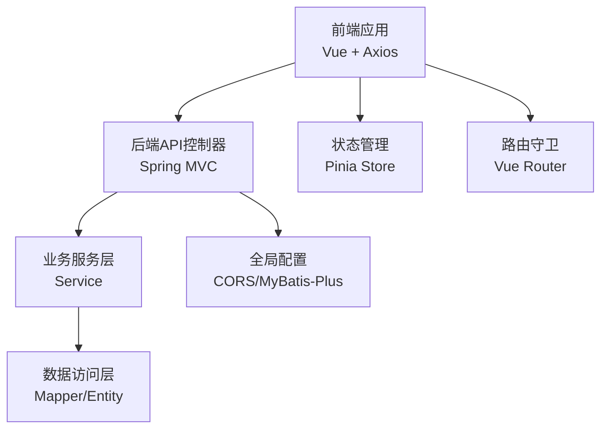
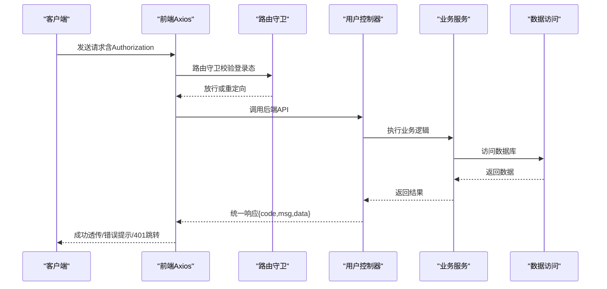
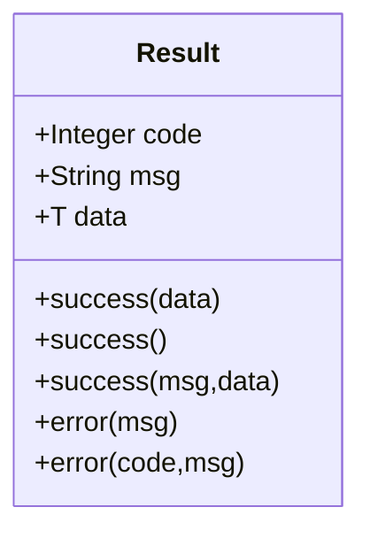
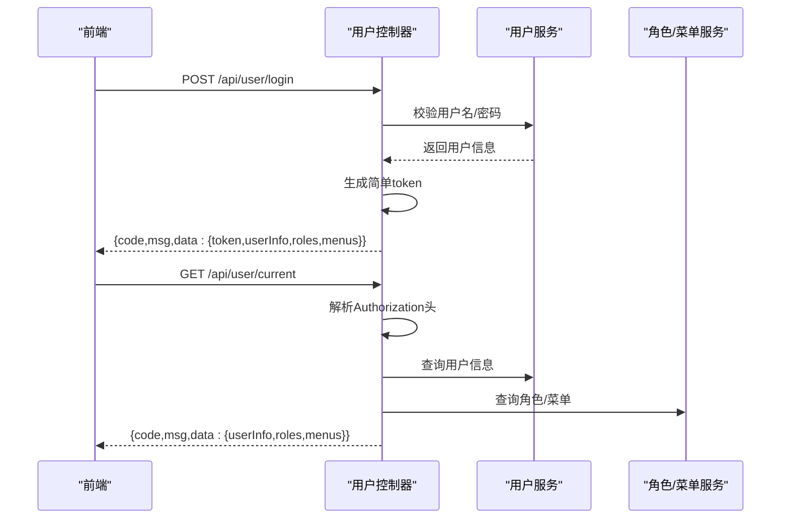
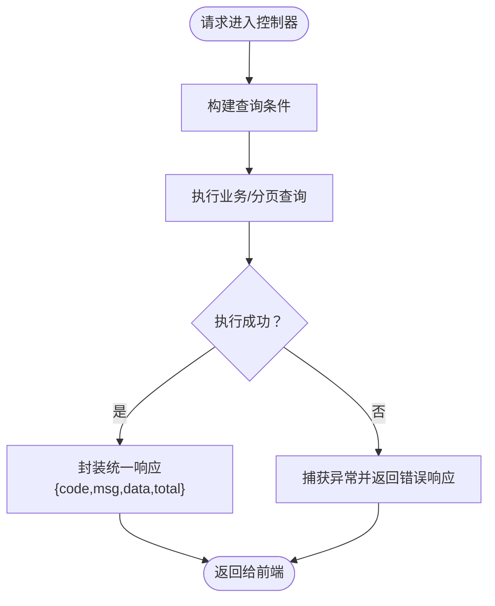
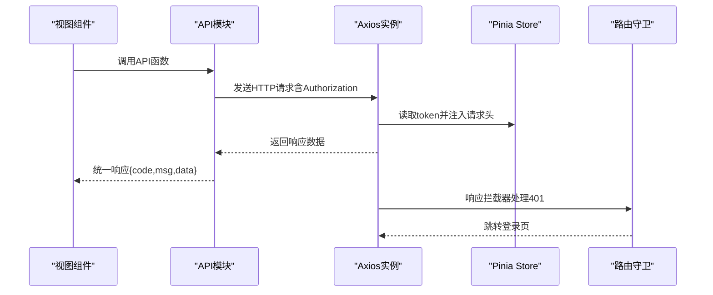
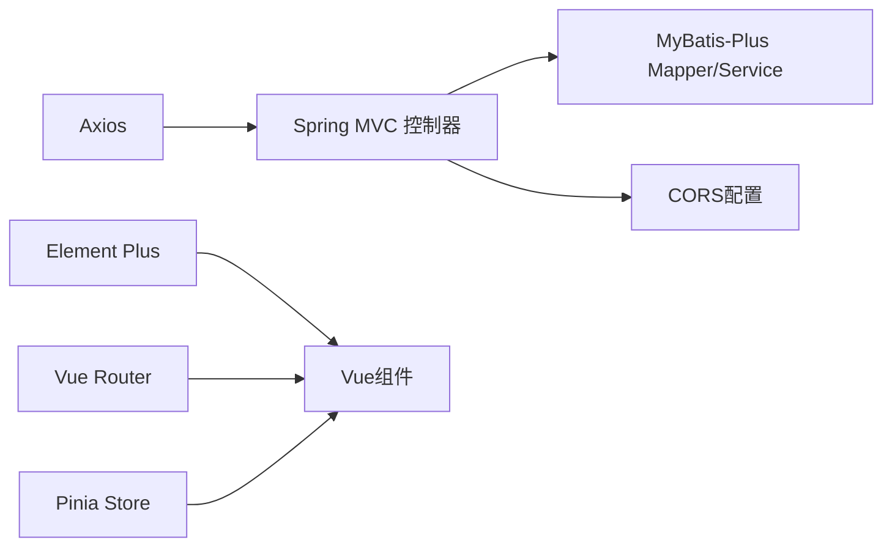
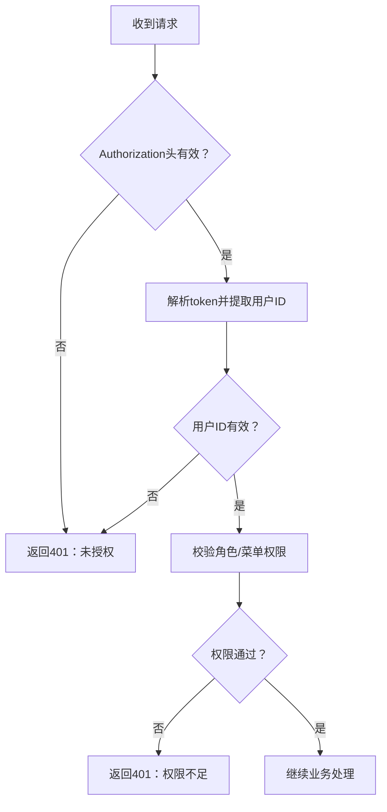

# API问题

<cite>
**本文引用的文件**
- [application.yml](file://src/main/resources/application.yml)
- [CorsConfig.java](file://src/main/java/com/hospital/drugmanagement/config/CorsConfig.java)
- [Result.java](file://src/main/java/com/hospital/drugmanagement/dto/Result.java)
- [LoginRequest.java](file://src/main/java/com/hospital/drugmanagement/dto/LoginRequest.java)
- [LoginResponse.java](file://src/main/java/com/hospital/drugmanagement/dto/LoginResponse.java)
- [SysUserController.java](file://src/main/java/com/hospital/drugmanagement/controller/SysUserController.java)
- [PurchaseOrderController.java](file://src/main/java/com/hospital/drugmanagement/controller/PurchaseOrderController.java)
- [DrugInfoController.java](file://src/main/java/com/hospital/drugmanagement/controller/DrugInfoController.java)
- [StockController.java](file://src/main/java/com/hospital/drugmanagement/controller/StockController.java)
- [request.js](file://drug-front/src/utils/request.js)
- [user.js](file://drug-front/src/api/user.js)
- [user.js（store）](file://drug-front/src/store/user.js)
- [index.js（router）](file://drug-front/src/router/index.js)
- [LOGIN_SETUP_README.md](file://LOGIN_SETUP_README.md)
</cite>

## 目录
1. [简介](#简介)
2. [项目结构](#项目结构)
3. [核心组件](#核心组件)
4. [架构总览](#架构总览)
5. [详细组件分析](#详细组件分析)
6. [依赖分析](#依赖分析)
7. [性能考虑](#性能考虑)
8. [故障排除指南](#故障排除指南)
9. [结论](#结论)
10. [附录](#附录)

## 简介
本指南聚焦于RESTful API接口在开发与运维过程中的常见问题与排障方法，覆盖以下主题：
- HTTP状态码与统一响应格式解读
- 异常堆栈与错误定位
- 权限拒绝排查（认证失败、角色权限不足、令牌问题）
- 参数验证失败处理（格式、类型、必填）
- 跨域问题诊断与CORS配置
- API调试与Postman测试实践（请求头、认证、响应解析）

目标是帮助开发者快速定位并解决问题，提升接口稳定性与可维护性。

## 项目结构
后端采用Spring Boot + MyBatis-Plus，前端基于Vue 3 + Element Plus + Axios。API统一通过控制器暴露，响应采用统一包装对象；前端通过Axios封装的请求模块统一发送请求，并在拦截器中处理错误与鉴权。

图表来源
- [application.yml:1-24](file://src/main/resources/application.yml#L1-L24)
- [CorsConfig.java:1-19](file://src/main/java/com/hospital/drugmanagement/config/CorsConfig.java#L1-L19)
- [request.js:1-56](file://drug-front/src/utils/request.js#L1-L56)
- [index.js（router）:1-115](file://drug-front/src/router/index.js#L1-L115)

章节来源
- [application.yml:1-24](file://src/main/resources/application.yml#L1-L24)
- [CorsConfig.java:1-19](file://src/main/java/com/hospital/drugmanagement/config/CorsConfig.java#L1-L19)
- [request.js:1-56](file://drug-front/src/utils/request.js#L1-L56)
- [index.js（router）:1-115](file://drug-front/src/router/index.js#L1-L115)

## 核心组件
- 统一响应模型：后端所有控制器返回统一结构，便于前端一致化处理与错误识别。
- 前端请求封装：Axios实例集中配置基础URL、超时、请求/响应拦截器，自动注入Authorization头并处理401跳转。
- 控制器层：各功能模块控制器（用户、药品、采购、库存等）均遵循统一响应规范。
- CORS配置：全局开放跨域，便于前后端联调。

章节来源
- [Result.java:1-98](file://src/main/java/com/hospital/drugmanagement/dto/Result.java#L1-L98)
- [SysUserController.java:1-421](file://src/main/java/com/hospital/drugmanagement/controller/SysUserController.java#L1-L421)
- [DrugInfoController.java:1-169](file://src/main/java/com/hospital/drugmanagement/controller/DrugInfoController.java#L1-L169)
- [PurchaseOrderController.java:1-396](file://src/main/java/com/hospital/drugmanagement/controller/PurchaseOrderController.java#L1-L396)
- [StockController.java:1-114](file://src/main/java/com/hospital/drugmanagement/controller/StockController.java#L1-L114)
- [CorsConfig.java:1-19](file://src/main/java/com/hospital/drugmanagement/config/CorsConfig.java#L1-L19)
- [request.js:1-56](file://drug-front/src/utils/request.js#L1-L56)

## 架构总览
后端控制器接收请求，执行业务逻辑，返回统一响应；前端通过Axios统一发送请求，自动携带令牌并在错误时提示或跳转登录。

图表来源
- [request.js:1-56](file://drug-front/src/utils/request.js#L1-L56)
- [index.js（router）:91-112](file://drug-front/src/router/index.js#L91-L112)
- [SysUserController.java:43-68](file://src/main/java/com/hospital/drugmanagement/controller/SysUserController.java#L43-L68)

章节来源
- [request.js:1-56](file://drug-front/src/utils/request.js#L1-L56)
- [index.js（router）:91-112](file://drug-front/src/router/index.js#L91-L112)
- [SysUserController.java:43-68](file://src/main/java/com/hospital/drugmanagement/controller/SysUserController.java#L43-L68)

## 详细组件分析

### 统一响应模型（Result）
- 结构：包含状态码、消息、数据三部分，便于前端统一处理。
- 成功/失败构造：提供多种静态工厂方法，确保响应格式一致。
- 典型用途：控制器层直接返回该对象，前端拦截器据此判断是否继续处理或抛错。

图表来源
- [Result.java:1-98](file://src/main/java/com/hospital/drugmanagement/dto/Result.java#L1-L98)

章节来源
- [Result.java:1-98](file://src/main/java/com/hospital/drugmanagement/dto/Result.java#L1-L98)

### 用户认证与权限流程（登录、当前用户、权限校验）
- 登录接口：接收用户名/密码，返回token、用户信息、角色与菜单。
- 当前用户接口：从Authorization头解析token，提取用户ID，查询用户信息、角色与菜单。
- 审核接口：示例展示如何从token解析用户ID并进行权限校验（如角色/菜单）。

图表来源
- [SysUserController.java:43-68](file://src/main/java/com/hospital/drugmanagement/controller/SysUserController.java#L43-L68)
- [SysUserController.java:73-147](file://src/main/java/com/hospital/drugmanagement/controller/SysUserController.java#L73-L147)
- [PurchaseOrderController.java:278-308](file://src/main/java/com/hospital/drugmanagement/controller/PurchaseOrderController.java#L278-L308)
- [LoginRequest.java:1-37](file://src/main/java/com/hospital/drugmanagement/dto/LoginRequest.java#L1-L37)
- [LoginResponse.java:1-128](file://src/main/java/com/hospital/drugmanagement/dto/LoginResponse.java#L1-L128)

章节来源
- [SysUserController.java:43-68](file://src/main/java/com/hospital/drugmanagement/controller/SysUserController.java#L43-L68)
- [SysUserController.java:73-147](file://src/main/java/com/hospital/drugmanagement/controller/SysUserController.java#L73-L147)
- [PurchaseOrderController.java:278-308](file://src/main/java/com/hospital/drugmanagement/controller/PurchaseOrderController.java#L278-L308)
- [LoginRequest.java:1-37](file://src/main/java/com/hospital/drugmanagement/dto/LoginRequest.java#L1-L37)
- [LoginResponse.java:1-128](file://src/main/java/com/hospital/drugmanagement/dto/LoginResponse.java#L1-L128)

### 药品管理与库存接口
- 药品列表/详情/新增/修改/删除：统一返回统一响应，包含分页与总数。
- 库存查询/预警/盘点：支持分页、筛选与预警模式。

图表来源
- [DrugInfoController.java:22-58](file://src/main/java/com/hospital/drugmanagement/controller/DrugInfoController.java#L22-L58)
- [StockController.java:21-44](file://src/main/java/com/hospital/drugmanagement/controller/StockController.java#L21-L44)

章节来源
- [DrugInfoController.java:22-58](file://src/main/java/com/hospital/drugmanagement/controller/DrugInfoController.java#L22-L58)
- [StockController.java:21-44](file://src/main/java/com/hospital/drugmanagement/controller/StockController.java#L21-L44)

### 前端请求与状态管理
- Axios实例：baseURL指向后端API，自动注入Authorization头。
- 响应拦截器：非200统一提示错误；401移除本地token并跳转登录。
- Pinia Store：持久化token、用户信息、角色与菜单；提供登录/登出/获取当前用户动作。
- 路由守卫：根据登录态放行或重定向至登录页。

图表来源
- [request.js:1-56](file://drug-front/src/utils/request.js#L1-L56)
- [user.js（store）:1-68](file://drug-front/src/store/user.js#L1-L68)
- [index.js（router）:91-112](file://drug-front/src/router/index.js#L91-L112)

章节来源
- [request.js:1-56](file://drug-front/src/utils/request.js#L1-L56)
- [user.js（store）:1-68](file://drug-front/src/store/user.js#L1-L68)
- [index.js（router）:91-112](file://drug-front/src/router/index.js#L91-L112)

## 依赖分析
- 后端依赖
  - Spring MVC：控制器与请求映射
  - MyBatis-Plus：数据访问与分页
  - CORS配置：全局跨域支持
- 前端依赖
  - Axios：HTTP客户端
  - Element Plus：UI组件
  - Vue Router / Pinia：路由与状态管理

图表来源
- [application.yml:1-24](file://src/main/resources/application.yml#L1-L24)
- [CorsConfig.java:1-19](file://src/main/java/com/hospital/drugmanagement/config/CorsConfig.java#L1-L19)
- [request.js:1-56](file://drug-front/src/utils/request.js#L1-L56)

章节来源
- [application.yml:1-24](file://src/main/resources/application.yml#L1-L24)
- [CorsConfig.java:1-19](file://src/main/java/com/hospital/drugmanagement/config/CorsConfig.java#L1-L19)
- [request.js:1-56](file://drug-front/src/utils/request.js#L1-L56)

## 性能考虑
- SQL日志：开发阶段开启SQL输出，便于定位慢查询与重复查询。
- 分页查询：对列表接口使用分页，避免一次性加载大量数据。
- 缓存策略：对只读数据（如字典、菜单）可引入Redis缓存。
- 并发控制：对高并发写操作（如库存盘点）增加幂等与锁机制。

章节来源
- [application.yml:22-24](file://src/main/resources/application.yml#L22-L24)

## 故障排除指南

### 一、HTTP状态码与统一响应解读
- 200：请求成功，data为业务数据；若无数据则data为null。
- 400：参数错误或业务规则违反（如重复编码/名称、必填缺失）。
- 401：未授权/无效token/缺少Authorization头。
- 404：资源不存在（如用户不存在）。
- 500：服务器内部错误，需查看后端日志与异常堆栈。

章节来源
- [SysUserController.java:43-68](file://src/main/java/com/hospital/drugmanagement/controller/SysUserController.java#L43-L68)
- [SysUserController.java:73-147](file://src/main/java/com/hospital/drugmanagement/controller/SysUserController.java#L73-L147)
- [DrugInfoController.java:76-113](file://src/main/java/com/hospital/drugmanagement/controller/DrugInfoController.java#L76-L113)
- [StockController.java:95-112](file://src/main/java/com/hospital/drugmanagement/controller/StockController.java#L95-L112)

### 二、异常堆栈与错误定位
- 开启SQL日志：在开发环境打印SQL，定位慢查询与参数绑定问题。
- 控制器try-catch：每个接口都有统一异常捕获，返回500与错误信息。
- 前端拦截器：响应拦截器对非200统一提示；401自动清理token并跳转登录。

章节来源
- [application.yml:22-24](file://src/main/resources/application.yml#L22-L24)
- [SysUserController.java:43-68](file://src/main/java/com/hospital/drugmanagement/controller/SysUserController.java#L43-L68)
- [request.js:27-53](file://drug-front/src/utils/request.js#L27-L53)

### 三、权限拒绝排查（认证失败/角色不足/令牌问题）
- 认证失败
  - 检查Authorization头是否以Bearer开头且非空。
  - 检查后端是否正确解析token并提取用户ID。
  - 若401返回“未授权”或“无效的token”，优先确认前端是否正确存储与注入token。
- 角色权限不足
  - 审核等敏感接口会校验用户角色/菜单权限，若无权限返回401或业务错误。
  - 前端Store中roles/menus来自登录响应，确认登录成功后是否正确持久化。
- 令牌过期/伪造
  - 当前实现为简单token拼接，生产环境建议使用JWT并配置拦截器校验。
  - 若出现频繁401，检查token有效期与刷新策略。

图表来源
- [SysUserController.java:73-147](file://src/main/java/com/hospital/drugmanagement/controller/SysUserController.java#L73-L147)
- [PurchaseOrderController.java:278-308](file://src/main/java/com/hospital/drugmanagement/controller/PurchaseOrderController.java#L278-L308)
- [user.js（store）:20-53](file://drug-front/src/store/user.js#L20-L53)

章节来源
- [SysUserController.java:73-147](file://src/main/java/com/hospital/drugmanagement/controller/SysUserController.java#L73-L147)
- [PurchaseOrderController.java:278-308](file://src/main/java/com/hospital/drugmanagement/controller/PurchaseOrderController.java#L278-L308)
- [user.js（store）:20-53](file://drug-front/src/store/user.js#L20-L53)

### 四、参数验证失败处理
- 必填字段缺失：控制器中对请求参数进行判空与格式校验，返回400与具体提示。
- 数据重复：如药品编码/名称、用户用户名/手机号/邮箱重复，返回400并提示。
- 类型不匹配：前端提交的数据类型与后端期望不一致时，可能触发400或500，需检查请求体与DTO定义。

章节来源
- [SysUserController.java:254-308](file://src/main/java/com/hospital/drugmanagement/controller/SysUserController.java#L254-L308)
- [DrugInfoController.java:76-113](file://src/main/java/com/hospital/drugmanagement/controller/DrugInfoController.java#L76-L113)

### 五、跨域问题诊断与CORS配置
- 现状：全局CORS允许所有来源、方法与头部，但未启用凭据。
- 常见症状：前端携带cookie/token时被浏览器阻止。
- 排查步骤：
  - 检查浏览器Network面板的预检请求（OPTIONS）是否通过。
  - 确认Access-Control-Allow-Origin是否匹配前端域名。
  - 如需携带cookie或自定义头，需调整allowCredentials与allowedHeaders。
- 参考配置文件与说明文档。

章节来源
- [CorsConfig.java:1-19](file://src/main/java/com/hospital/drugmanagement/config/CorsConfig.java#L1-L19)
- [LOGIN_SETUP_README.md:156-157](file://LOGIN_SETUP_README.md#L156-L157)

### 六、API调试与Postman测试方法
- 基础设置
  - 服务端口：application.yml中server.port，默认8081。
  - 前端基础URL：request.js中baseURL指向http://localhost:8081/api。
- 登录测试
  - POST /api/user/login，Body选择raw + JSON，填写username/password。
  - 成功后在响应中获取token，后续请求在Headers中添加Authorization: Bearer <token>。
- 列表/详情/新增/修改/删除
  - GET /api/drug/list?page=&size=&... 获取分页数据。
  - GET /api/drug/{id} 获取详情。
  - POST /api/drug 传入JSON实体进行新增。
  - PUT /api/drug 传入JSON实体进行更新。
  - DELETE /api/drug/{id} 删除。
- 错误模拟
  - 传入重复编码/名称、缺失必填字段、无效token，观察返回code与msg。
- 响应解析
  - 前端统一处理：只有code为200才视为成功，否则弹窗提示或401跳转。

章节来源
- [application.yml:14-16](file://src/main/resources/application.yml#L14-L16)
- [request.js:6-9](file://drug-front/src/utils/request.js#L6-L9)
- [user.js:55-70](file://drug-front/src/api/user.js#L55-L70)
- [DrugInfoController.java:22-58](file://src/main/java/com/hospital/drugmanagement/controller/DrugInfoController.java#L22-L58)
- [SysUserController.java:254-308](file://src/main/java/com/hospital/drugmanagement/controller/SysUserController.java#L254-L308)

## 结论
- 统一响应与拦截器使前后端协作更加稳定，便于快速定位问题。
- CORS与路由守卫共同保障了跨域与鉴权体验。
- 参数校验与异常捕获覆盖常见错误场景，配合SQL日志可高效定位性能瓶颈。
- 生产环境建议完善JWT鉴权、细粒度权限控制与CORS凭据配置。

## 附录
- 默认登录账号参考：README中提供了管理员与普通用户的默认凭证，便于快速测试。
- 密码加密与Token机制说明：README中对当前实现与生产改进建议有详细说明。

章节来源
- [LOGIN_SETUP_README.md:117-157](file://LOGIN_SETUP_README.md#L117-L157)