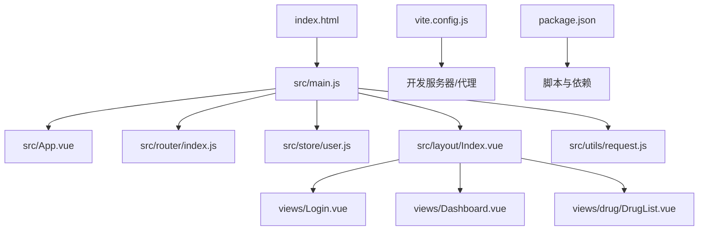
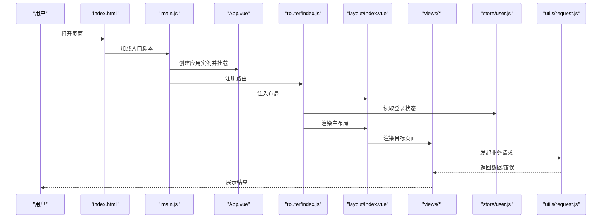
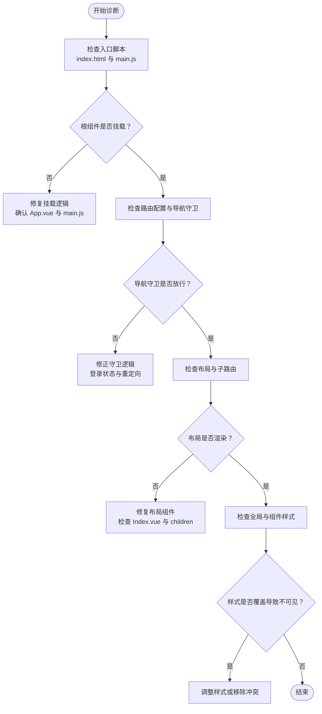
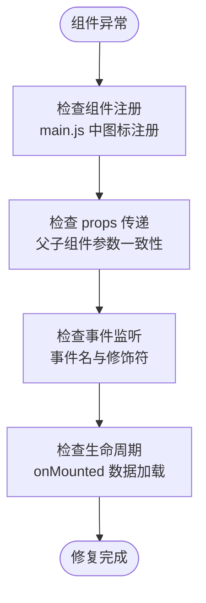
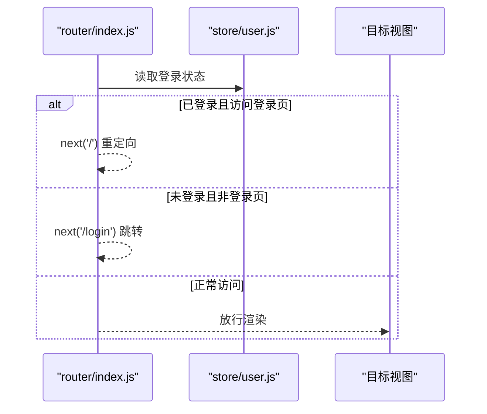
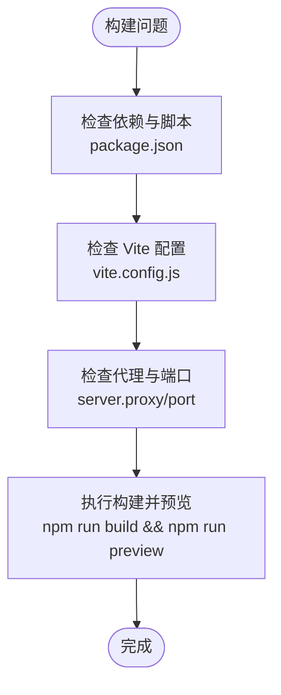
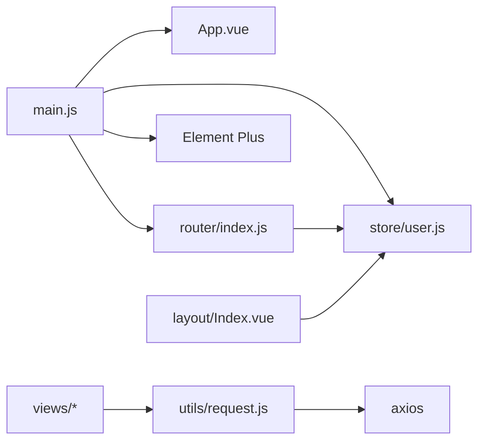

# 前端问题

<cite>
**本文引用的文件**
- [package.json](file://drug-front/package.json)
- [vite.config.js](file://drug-front/vite.config.js)
- [index.html](file://drug-front/index.html)
- [main.js](file://drug-front/src/main.js)
- [App.vue](file://drug-front/src/App.vue)
- [router/index.js](file://drug-front/src/router/index.js)
- [store/user.js](file://drug-front/src/store/user.js)
- [layout/Index.vue](file://drug-front/src/layout/Index.vue)
- [views/Login.vue](file://drug-front/src/views/Login.vue)
- [utils/request.js](file://drug-front/src/utils/request.js)
- [views/Dashboard.vue](file://drug-front/src/views/Dashboard.vue)
- [views/drug/DrugList.vue](file://drug-front/src/views/drug/DrugList.vue)
- [README.md](file://drug-front/README.md)
</cite>

## 目录
1. [简介](#简介)
2. [项目结构](#项目结构)
3. [核心组件](#核心组件)
4. [架构总览](#架构总览)
5. [详细组件分析](#详细组件分析)
6. [依赖关系分析](#依赖关系分析)
7. [性能考虑](#性能考虑)
8. [故障排除指南](#故障排除指南)
9. [结论](#结论)
10. [附录](#附录)

## 简介
本指南面向使用 Vue 3 + Element Plus + Vite 的前端应用开发者，聚焦常见问题的诊断与修复，覆盖页面空白、组件异常、路由错误、构建与打包、浏览器兼容性等场景。文档结合项目实际代码结构，提供可操作的排查步骤与解决方案。

## 项目结构
前端项目位于 drug-front 目录，采用 Vite 作为构建工具，使用 Vue 3 Composition API、Pinia 状态管理、Vue Router 路由与 Element Plus UI 组件库。核心入口为 index.html 与 main.js，路由集中配置在 router/index.js，全局状态在 store/user.js，主布局在 layout/Index.vue，登录页在 views/Login.vue，通用请求封装在 utils/request.js。

**图表来源**
- [index.html:1-14](file://drug-front/index.html#L1-L14)
- [main.js:1-26](file://drug-front/src/main.js#L1-L26)
- [router/index.js:1-115](file://drug-front/src/router/index.js#L1-L115)
- [store/user.js:1-68](file://drug-front/src/store/user.js#L1-L68)
- [layout/Index.vue:1-213](file://drug-front/src/layout/Index.vue#L1-L213)
- [views/Login.vue:1-127](file://drug-front/src/views/Login.vue#L1-L127)
- [views/Dashboard.vue:1-226](file://drug-front/src/views/Dashboard.vue#L1-L226)
- [views/drug/DrugList.vue:1-426](file://drug-front/src/views/drug/DrugList.vue#L1-L426)
- [utils/request.js:1-56](file://drug-front/src/utils/request.js#L1-L56)
- [vite.config.js:1-22](file://drug-front/vite.config.js#L1-L22)
- [package.json:1-29](file://drug-front/package.json#L1-L29)

**章节来源**
- [package.json:1-29](file://drug-front/package.json#L1-L29)
- [vite.config.js:1-22](file://drug-front/vite.config.js#L1-L22)
- [index.html:1-14](file://drug-front/index.html#L1-L14)
- [main.js:1-26](file://drug-front/src/main.js#L1-L26)
- [router/index.js:1-115](file://drug-front/src/router/index.js#L1-L115)
- [store/user.js:1-68](file://drug-front/src/store/user.js#L1-L68)
- [layout/Index.vue:1-213](file://drug-front/src/layout/Index.vue#L1-L213)
- [views/Login.vue:1-127](file://drug-front/src/views/Login.vue#L1-L127)
- [utils/request.js:1-56](file://drug-front/src/utils/request.js#L1-L56)

## 核心组件
- 应用入口与插件注册：在入口文件中完成应用实例创建、Pinia、路由、Element Plus 以及全局图标的注册与挂载。
- 路由与导航守卫：集中定义页面路由与 beforeEach 导航守卫，实现登录状态判断与页面标题设置。
- 用户状态管理：通过 Pinia Store 管理 token、用户信息、角色与菜单，并持久化到本地存储。
- 请求封装：Axios 实例统一设置基础路径、超时时间与拦截器，处理 401 未授权跳转登录。
- 主布局与菜单：动态根据用户菜单生成侧边栏菜单项，支持下拉菜单登出与页面跳转。
- 登录页：表单校验、异步登录、成功后跳转首页。
- 业务页面：如药品列表页，包含搜索、分页、对话框、表格与增删改操作。

**章节来源**
- [main.js:1-26](file://drug-front/src/main.js#L1-L26)
- [router/index.js:1-115](file://drug-front/src/router/index.js#L1-L115)
- [store/user.js:1-68](file://drug-front/src/store/user.js#L1-L68)
- [utils/request.js:1-56](file://drug-front/src/utils/request.js#L1-L56)
- [layout/Index.vue:1-213](file://drug-front/src/layout/Index.vue#L1-L213)
- [views/Login.vue:1-127](file://drug-front/src/views/Login.vue#L1-L127)
- [views/drug/DrugList.vue:1-426](file://drug-front/src/views/drug/DrugList.vue#L1-L426)

## 架构总览
前端采用“入口 -> 插件注册 -> 路由 -> 布局 -> 页面”的线性架构；数据流通过 Pinia Store 与 Axios 封装的请求拦截器串联，导航守卫贯穿登录态与页面标题。

**图表来源**
- [index.html:1-14](file://drug-front/index.html#L1-L14)
- [main.js:1-26](file://drug-front/src/main.js#L1-L26)
- [router/index.js:1-115](file://drug-front/src/router/index.js#L1-L115)
- [layout/Index.vue:1-213](file://drug-front/src/layout/Index.vue#L1-L213)
- [views/Login.vue:1-127](file://drug-front/src/views/Login.vue#L1-L127)
- [utils/request.js:1-56](file://drug-front/src/utils/request.js#L1-L56)
- [store/user.js:1-68](file://drug-front/src/store/user.js#L1-L68)

## 详细组件分析

### 页面空白问题诊断
页面空白通常由以下原因导致：
- 入口脚本未正确加载或模块解析失败（检查 index.html 中的入口脚本与别名）。
- 根组件未正确挂载（检查 App.vue 与 main.js 的挂载逻辑）。
- 路由未匹配导致无内容（检查路由配置与导航守卫）。
- CSS 样式覆盖导致不可见（检查全局样式与组件 scoped 样式）。

**图表来源**
- [index.html:1-14](file://drug-front/index.html#L1-L14)
- [main.js:1-26](file://drug-front/src/main.js#L1-L26)
- [router/index.js:1-115](file://drug-front/src/router/index.js#L1-L115)
- [layout/Index.vue:1-213](file://drug-front/src/layout/Index.vue#L1-L213)
- [App.vue:1-24](file://drug-front/src/App.vue#L1-L24)

**章节来源**
- [index.html:1-14](file://drug-front/index.html#L1-L14)
- [main.js:1-26](file://drug-front/src/main.js#L1-L26)
- [router/index.js:1-115](file://drug-front/src/router/index.js#L1-L115)
- [layout/Index.vue:1-213](file://drug-front/src/layout/Index.vue#L1-L213)
- [App.vue:1-24](file://drug-front/src/App.vue#L1-L24)

### 组件异常排查
常见问题与定位要点：
- 组件注册失败：确认是否在入口处全局注册了 Element Plus 图标组件。
- props 传递错误：检查父组件向子组件传参与子组件 props 定义是否一致。
- 事件监听问题：确认事件名大小写与修饰符是否符合 Vue 事件规范。
- 生命周期钩子：onMounted 是否在正确的时机发起数据请求。

**图表来源**
- [main.js:1-26](file://drug-front/src/main.js#L1-L26)
- [views/drug/DrugList.vue:208-415](file://drug-front/src/views/drug/DrugList.vue#L208-L415)

**章节来源**
- [main.js:1-26](file://drug-front/src/main.js#L1-L26)
- [views/drug/DrugList.vue:208-415](file://drug-front/src/views/drug/DrugList.vue#L208-L415)

### 路由错误解决方案
路由相关问题包括：
- 路由配置缺失或路径不匹配：核对 router/index.js 中 routes 与 children。
- 导航守卫逻辑错误：检查 beforeEach 中登录状态判断与 next 调用。
- 页面跳转失败：确认路由 push 参数与目标路径存在。

**图表来源**
- [router/index.js:91-112](file://drug-front/src/router/index.js#L91-L112)
- [store/user.js:1-68](file://drug-front/src/store/user.js#L1-L68)

**章节来源**
- [router/index.js:1-115](file://drug-front/src/router/index.js#L1-L115)
- [store/user.js:1-68](file://drug-front/src/store/user.js#L1-L68)

### 构建与打包问题
常见问题与处理：
- Vite 构建错误：检查依赖安装与插件配置，确认 package.json 中脚本与依赖版本。
- 静态资源加载失败：检查 public 目录与构建输出 dist 结构，确认资源路径。
- 热更新失效：检查 vite.config.js 代理与端口占用，重启开发服务器。

**图表来源**
- [package.json:1-29](file://drug-front/package.json#L1-L29)
- [vite.config.js:1-22](file://drug-front/vite.config.js#L1-L22)

**章节来源**
- [package.json:1-29](file://drug-front/package.json#L1-L29)
- [vite.config.js:1-22](file://drug-front/vite.config.js#L1-L22)
- [README.md:182-200](file://drug-front/README.md#L182-L200)

### 浏览器兼容性问题
兼容性相关问题与建议：
- ES6+ 语法支持：确认目标浏览器支持程度，必要时引入 Polyfill。
- 调试工具使用：利用浏览器开发者工具断点与网络面板定位问题。
- 构建产物兼容：可通过 Vite 插件或 Babel 配置提升兼容性。

**章节来源**
- [README.md:1-269](file://drug-front/README.md#L1-L269)

## 依赖关系分析
- 入口依赖：main.js 依赖 App.vue、router、store、Element Plus 与图标。
- 路由依赖：router/index.js 依赖 store/user.js 以读取登录状态。
- 请求依赖：utils/request.js 依赖 axios 并在响应拦截中处理 401。
- 布局依赖：layout/Index.vue 依赖用户状态与 Element Plus 组件。
- 页面依赖：views/* 依赖 API 服务与 Element Plus 表单/表格组件。

**图表来源**
- [main.js:1-26](file://drug-front/src/main.js#L1-L26)
- [router/index.js:1-115](file://drug-front/src/router/index.js#L1-L115)
- [store/user.js:1-68](file://drug-front/src/store/user.js#L1-L68)
- [layout/Index.vue:1-213](file://drug-front/src/layout/Index.vue#L1-L213)
- [utils/request.js:1-56](file://drug-front/src/utils/request.js#L1-L56)

**章节来源**
- [main.js:1-26](file://drug-front/src/main.js#L1-L26)
- [router/index.js:1-115](file://drug-front/src/router/index.js#L1-L115)
- [store/user.js:1-68](file://drug-front/src/store/user.js#L1-L68)
- [layout/Index.vue:1-213](file://drug-front/src/layout/Index.vue#L1-L213)
- [utils/request.js:1-56](file://drug-front/src/utils/request.js#L1-L56)

## 性能考虑
- 路由懒加载：使用动态导入减少首屏体积。
- 组件懒加载：对重型组件按需加载。
- 图标按需引入：避免一次性注册全部图标造成体积膨胀。
- 请求缓存：对重复请求进行缓存或去抖。
- 分页与虚拟滚动：大数据表格启用分页或虚拟滚动。

[本节为通用指导，无需具体文件来源]

## 故障排除指南

### 页面空白
- 检查入口脚本与挂载
  - 确认 index.html 中入口脚本路径与 main.js 存在。
  - 确认 main.js 中 app.mount('#app') 是否执行。
- 检查路由与布局
  - 确认 router/index.js 中路由配置与导航守卫逻辑。
  - 确认 layout/Index.vue 的 children 与菜单生成逻辑。
- 检查样式
  - 确认 App.vue 与组件样式未导致元素不可见。

**章节来源**
- [index.html:1-14](file://drug-front/index.html#L1-L14)
- [main.js:1-26](file://drug-front/src/main.js#L1-L26)
- [router/index.js:1-115](file://drug-front/src/router/index.js#L1-L115)
- [layout/Index.vue:1-213](file://drug-front/src/layout/Index.vue#L1-L213)
- [App.vue:1-24](file://drug-front/src/App.vue#L1-L24)

### 组件异常
- 组件注册失败
  - 在 main.js 中确认 Element Plus 图标是否已注册。
- props 传递错误
  - 对照父组件传参与子组件 props 定义。
- 事件监听问题
  - 检查事件名大小写与修饰符是否正确。
- 生命周期问题
  - 确认 onMounted 中的数据加载逻辑。

**章节来源**
- [main.js:1-26](file://drug-front/src/main.js#L1-L26)
- [views/drug/DrugList.vue:208-415](file://drug-front/src/views/drug/DrugList.vue#L208-L415)

### 路由错误
- 路由配置检查
  - 核对 router/index.js 中 routes 与 children。
- 导航守卫问题
  - 检查 beforeEach 中登录状态判断与 next 调用。
- 页面跳转失败
  - 确认目标路径存在且导航守卫放行。

**章节来源**
- [router/index.js:1-115](file://drug-front/src/router/index.js#L1-L115)
- [store/user.js:1-68](file://drug-front/src/store/user.js#L1-L68)

### 构建与打包
- Vite 构建错误
  - 清理缓存、删除 node_modules 与 lock 文件后重装依赖。
- 静态资源加载失败
  - 检查 public 目录与 dist 输出结构。
- 热更新失效
  - 修改 vite.config.js 中端口或关闭代理冲突。

**章节来源**
- [package.json:1-29](file://drug-front/package.json#L1-L29)
- [vite.config.js:1-22](file://drug-front/vite.config.js#L1-L22)
- [README.md:182-200](file://drug-front/README.md#L182-L200)

### 浏览器兼容性
- ES6+ 语法支持
  - 通过 Polyfill 或升级浏览器版本解决。
- 调试工具使用
  - 使用浏览器开发者工具定位问题。

**章节来源**
- [README.md:1-269](file://drug-front/README.md#L1-L269)

## 结论
本指南提供了从入口、路由、状态、请求到页面与构建的全链路问题排查路径。建议在开发过程中遵循统一的命名与代码风格，配合导航守卫与请求拦截器，确保登录态与接口访问的一致性；同时关注构建与兼容性，保障不同环境下的稳定运行。

## 附录
- 默认登录账号：用户名 admin，密码 123456。
- 开发与构建命令参考 package.json 脚本。
- 代理与跨域配置参考 vite.config.js 与 README。

**章节来源**
- [README.md:134-139](file://drug-front/README.md#L134-L139)
- [package.json:1-29](file://drug-front/package.json#L1-L29)
- [vite.config.js:1-22](file://drug-front/vite.config.js#L1-L22)