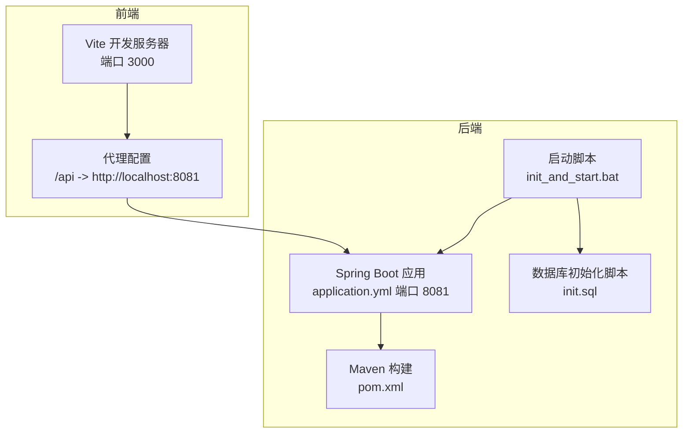
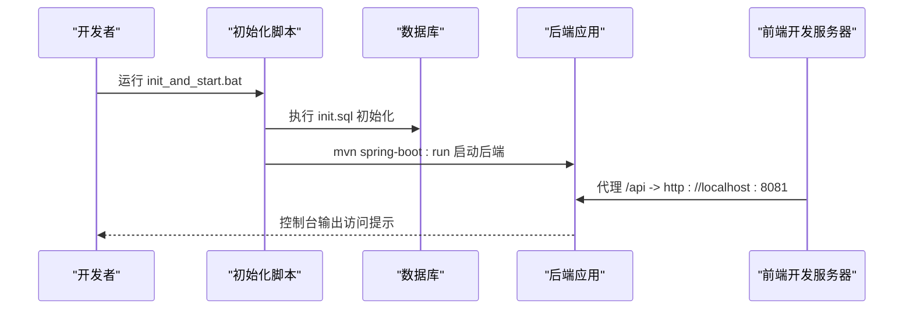
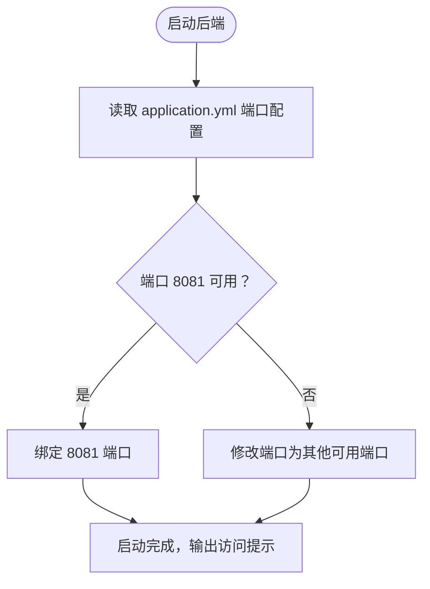
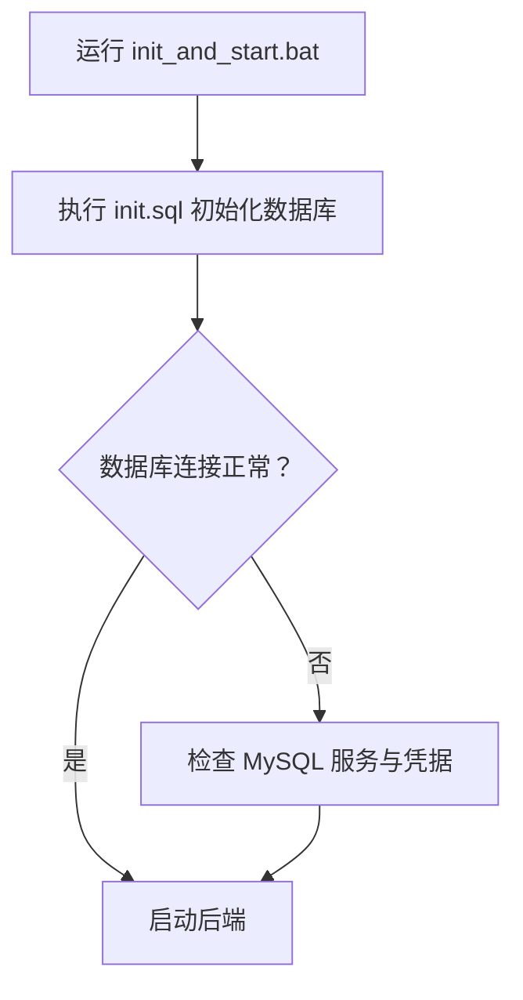
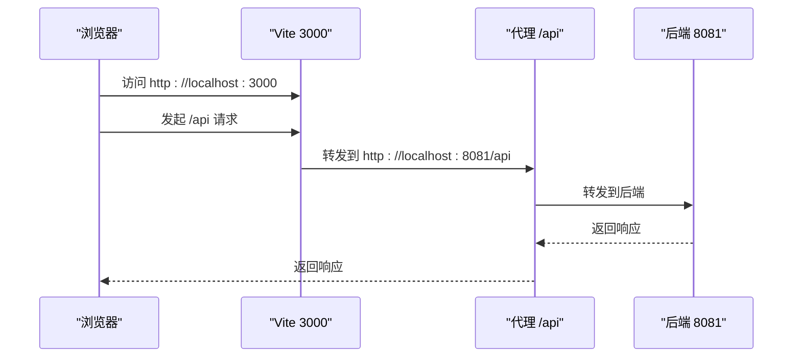
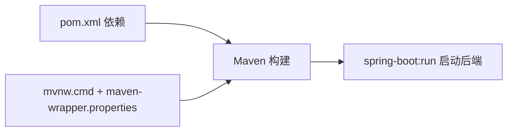
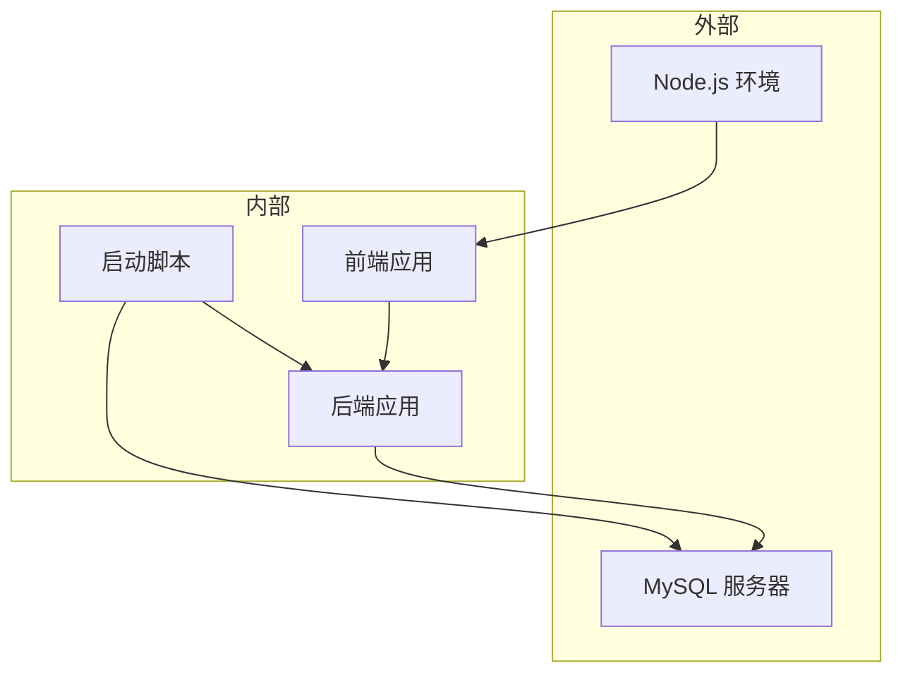

# 启动问题

<cite>
**本文引用的文件**   
- [init_and_start.bat](file://init_and_start.bat)
- [pom.xml](file://pom.xml)
- [application.yml](file://src/main/resources/application.yml)
- [DrugManagementApplication.java](file://src/main/java/com/hospital/drugmanagement/DrugManagementApplication.java)
- [vite.config.js](file://drug-front/vite.config.js)
- [package.json](file://drug-front/package.json)
- [request.js](file://drug-front/src/utils/request.js)
- [init.sql](file://src/main/resources/db/init.sql)
- [mvnw.cmd](file://mvnw.cmd)
- [.mvn/wrapper/maven-wrapper.properties](file://.mvn/wrapper/maven-wrapper.properties)
</cite>

## 目录
1. [简介](#简介)
2. [项目结构](#项目结构)
3. [核心组件](#核心组件)
4. [架构总览](#架构总览)
5. [详细组件分析](#详细组件分析)
6. [依赖分析](#依赖分析)
7. [性能考虑](#性能考虑)
8. [故障排除指南](#故障排除指南)
9. [结论](#结论)
10. [附录](#附录)

## 简介
本指南聚焦于系统启动阶段可能遇到的问题与排障流程，覆盖端口占用、依赖缺失、配置错误、启动脚本失败等常见场景。文档基于当前仓库的实际配置与启动脚本进行分析，提供可操作的诊断步骤与修复建议，并附带启动检查清单与常见错误的快速解决方案。

## 项目结构
项目采用前后端分离架构：
- 后端：Spring Boot 应用，位于 src/main/java，资源位于 src/main/resources，使用 Maven 构建。
- 前端：Vue 3 + Vite，位于 drug-front，开发服务器默认端口为 3000，代理指向后端 8081。
- 启动脚本：Windows 批处理脚本负责初始化数据库并启动后端；同时提供 Maven Wrapper 启动方式。

图表来源
- [init_and_start.bat:1-11](file://init_and_start.bat#L1-L11)
- [application.yml:14-16](file://src/main/resources/application.yml#L14-L16)
- [vite.config.js:12-20](file://drug-front/vite.config.js#L12-L20)
- [pom.xml:1-119](file://pom.xml#L1-L119)

章节来源
- [init_and_start.bat:1-11](file://init_and_start.bat#L1-L11)
- [application.yml:14-16](file://src/main/resources/application.yml#L14-L16)
- [vite.config.js:12-20](file://drug-front/vite.config.js#L12-L20)
- [pom.xml:1-119](file://pom.xml#L1-L119)

## 核心组件
- 后端应用入口与端口配置
  - 应用入口类负责启动 Spring Boot 并输出访问提示。
  - 服务端口在 application.yml 中配置为 8081。
- 数据库初始化
  - init.sql 负责创建数据库、表结构与基础数据。
  - 启动脚本先执行数据库初始化，再启动后端。
- 前端开发环境
  - Vite 默认监听 3000 端口，通过代理将 /api 请求转发至后端 8081。
- 构建与依赖
  - pom.xml 管理后端依赖（Web、MyBatis、MySQL 驱动等）。
  - Maven Wrapper 提供统一的 Maven 版本与下载机制。

章节来源
- [DrugManagementApplication.java:25-32](file://src/main/java/com/hospital/drugmanagement/DrugManagementApplication.java#L25-L32)
- [application.yml:14-16](file://src/main/resources/application.yml#L14-L16)
- [init.sql:1-312](file://src/main/resources/db/init.sql#L1-L312)
- [vite.config.js:12-20](file://drug-front/vite.config.js#L12-L20)
- [pom.xml:32-84](file://pom.xml#L32-L84)
- [mvnw.cmd:125-135](file://mvnw.cmd#L125-L135)

## 架构总览
后端与前端通过代理进行联调，数据库由初始化脚本准备。启动顺序建议为：先确保数据库可用，再启动后端，最后启动前端。

图表来源
- [init_and_start.bat:5-9](file://init_and_start.bat#L5-L9)
- [init.sql:1-312](file://src/main/resources/db/init.sql#L1-L312)
- [vite.config.js:14-18](file://drug-front/vite.config.js#L14-L18)
- [application.yml:14-16](file://src/main/resources/application.yml#L14-L16)

## 详细组件分析

### 组件一：后端启动与端口配置
- 端口来源
  - application.yml 的 server.port 指定为 8081。
- 启动入口
  - 主类启动后打印访问提示，便于确认后端已就绪。
- 可能的端口冲突
  - 若 8081 已被占用，需修改端口或释放占用进程。

图表来源
- [application.yml:14-16](file://src/main/resources/application.yml#L14-L16)
- [DrugManagementApplication.java:25-32](file://src/main/java/com/hospital/drugmanagement/DrugManagementApplication.java#L25-L32)

章节来源
- [application.yml:14-16](file://src/main/resources/application.yml#L14-L16)
- [DrugManagementApplication.java:25-32](file://src/main/java/com/hospital/drugmanagement/DrugManagementApplication.java#L25-L32)

### 组件二：数据库初始化与连接配置
- 初始化脚本
  - init.sql 创建数据库与表，并插入示例数据。
- 连接配置
  - application.yml 的 datasource.url、username、password 指向本地 MySQL。
- 启动脚本
  - init_and_start.bat 在启动后端前执行数据库初始化。

图表来源
- [init_and_start.bat:4-5](file://init_and_start.bat#L4-L5)
- [init.sql:1-312](file://src/main/resources/db/init.sql#L1-L312)
- [application.yml:3-7](file://src/main/resources/application.yml#L3-L7)

章节来源
- [init_and_start.bat:4-5](file://init_and_start.bat#L4-L5)
- [init.sql:1-312](file://src/main/resources/db/init.sql#L1-L312)
- [application.yml:3-7](file://src/main/resources/application.yml#L3-L7)

### 组件三：前端代理与端口配置
- 开发端口
  - vite.config.js 将前端开发服务器设置为 3000。
- 代理规则
  - 将 /api 前缀转发至 http://localhost:8081，确保与后端端口一致。
- 前端请求基址
  - request.js 的 baseURL 指向 http://localhost:8081/api，需与后端端口保持一致。

图表来源
- [vite.config.js:12-20](file://drug-front/vite.config.js#L12-L20)
- [request.js:6-8](file://drug-front/src/utils/request.js#L6-L8)

章节来源
- [vite.config.js:12-20](file://drug-front/vite.config.js#L12-L20)
- [request.js:6-8](file://drug-front/src/utils/request.js#L6-L8)

### 组件四：构建与依赖管理
- 后端依赖
  - pom.xml 引入 Spring Web、Thymeleaf、MyBatis、MySQL 驱动等。
- Maven Wrapper
  - mvnw.cmd 与 maven-wrapper.properties 提供统一的 Maven 下载与版本控制。
- 启动方式
  - init_and_start.bat 使用 mvn spring-boot:run 启动后端。

图表来源
- [pom.xml:32-84](file://pom.xml#L32-L84)
- [mvnw.cmd:125-135](file://mvnw.cmd#L125-L135)
- [.mvn/wrapper/maven-wrapper.properties:1-4](file://.mvn/wrapper/maven-wrapper.properties#L1-L4)
- [init_and_start.bat:9](file://init_and_start.bat#L9)

章节来源
- [pom.xml:32-84](file://pom.xml#L32-L84)
- [mvnw.cmd:125-135](file://mvnw.cmd#L125-L135)
- [.mvn/wrapper/maven-wrapper.properties:1-4](file://.mvn/wrapper/maven-wrapper.properties#L1-L4)
- [init_and_start.bat:9](file://init_and_start.bat#L9)

## 依赖分析
- 外部依赖
  - MySQL 服务器：用于承载后端数据源。
  - Node.js 生态：前端开发与构建（Vite、Vue 等）。
- 内部依赖
  - 后端通过 pom.xml 管理依赖；前端通过 package.json 管理依赖。
- 启动耦合
  - 启动脚本顺序：数据库初始化 → 后端启动 → 前端启动。

图表来源
- [application.yml:3-7](file://src/main/resources/application.yml#L3-L7)
- [pom.xml:32-84](file://pom.xml#L32-L84)
- [package.json:1-29](file://drug-front/package.json#L1-L29)
- [init_and_start.bat:4-9](file://init_and_start.bat#L4-L9)

章节来源
- [application.yml:3-7](file://src/main/resources/application.yml#L3-L7)
- [pom.xml:32-84](file://pom.xml#L32-L84)
- [package.json:1-29](file://drug-front/package.json#L1-L29)
- [init_and_start.bat:4-9](file://init_and_start.bat#L4-L9)

## 性能考虑
- 启动阶段性能影响因素
  - 数据库初始化耗时受表数量与数据量影响。
  - Maven 下载与编译耗时受网络与机器性能影响。
- 建议
  - 优先保证数据库服务稳定与网络畅通。
  - 使用 Maven Wrapper 缓存以减少重复下载。

## 故障排除指南

### 一、端口占用问题
- 现象
  - 后端无法绑定 8081 端口，启动失败或报错。
- 诊断
  - Windows：使用 netstat 或 PowerShell 查看 8081 占用进程。
  - Linux/macOS：使用 lsof 或 ss 查看占用。
- 解决
  - 方案 A：释放占用进程（结束对应 PID）。
  - 方案 B：修改 application.yml 的 server.port 为其他可用端口（如 8082）。
  - 修改后，前端代理与请求基址需同步调整为新端口，确保 /api 代理与 baseURL 一致。

章节来源
- [application.yml:14-16](file://src/main/resources/application.yml#L14-L16)
- [vite.config.js:14-18](file://drug-front/vite.config.js#L14-L18)
- [request.js:6-8](file://drug-front/src/utils/request.js#L6-L8)

### 二、依赖缺失问题
- Maven 依赖下载失败
  - 症状：mvn 命令执行缓慢或失败。
  - 排查：检查网络与 Maven Wrapper 配置，确认 .mvn/wrapper/maven-wrapper.properties 的 distributionUrl 可达。
  - 修复：使用 mvnw.cmd 替代 mvn，确保使用仓库内统一版本；必要时配置代理。
- Node.js 依赖安装问题
  - 症状：npm install/yarn/pnpm 失败或构建报错。
  - 排查：检查 package.json 的依赖声明与网络可达性。
  - 修复：清理 node_modules 与锁文件后重装；或切换镜像源。
- 数据库驱动缺失
  - 症状：启动时报找不到 MySQL 驱动类。
  - 排查：确认 pom.xml 中 mysql-connector-j 依赖存在且版本兼容。
  - 修复：删除本地仓库对应缓存后重新拉取依赖。

章节来源
- [mvnw.cmd:125-135](file://mvnw.cmd#L125-L135)
- [.mvn/wrapper/maven-wrapper.properties:1-4](file://.mvn/wrapper/maven-wrapper.properties#L1-L4)
- [package.json:13-27](file://drug-front/package.json#L13-L27)
- [pom.xml:45-50](file://pom.xml#L45-L50)

### 三、配置文件错误
- application.yml 配置项检查
  - 数据源：driver-class-name、url、username、password 是否正确。
  - 端口：server.port 是否与其他服务冲突。
  - MyBatis-Plus：mapper-locations、type-aliases-package、map-underscore-to-camel-case 是否合理。
- 数据库连接验证
  - 使用命令行或图形化工具验证 MySQL 服务连通性与凭据。
- 端口配置冲突
  - 若修改了后端端口，需同步修改前端代理与请求基址。

章节来源
- [application.yml:1-24](file://src/main/resources/application.yml#L1-L24)
- [vite.config.js:14-18](file://drug-front/vite.config.js#L14-L18)
- [request.js:6-8](file://drug-front/src/utils/request.js#L6-L8)

### 四、启动脚本执行失败
- init_and_start.bat 失败
  - 症状：数据库初始化失败或后端未启动。
  - 排查：检查 MySQL 用户名/密码、init.sql 路径、mvn 命令可用性。
  - 修复：单独执行 mysql 命令与 mvn spring-boot:run，定位具体失败环节。
- Maven Wrapper 问题
  - 症状：mvnw.cmd 执行异常或下载失败。
  - 排查：确认网络与代理设置，检查 maven-wrapper.properties 的 distributionUrl。
  - 修复：手动下载并放置 Maven 到本地缓存，或更换镜像源。

章节来源
- [init_and_start.bat:4-9](file://init_and_start.bat#L4-L9)
- [mvnw.cmd:125-135](file://mvnw.cmd#L125-L135)
- [.mvn/wrapper/maven-wrapper.properties:1-4](file://.mvn/wrapper/maven-wrapper.properties#L1-L4)

### 五、常见启动错误与快速解决方案
- 错误：端口被占用（8081）
  - 快速方案：释放占用进程或修改 application.yml 端口为 8082，并同步前端代理与请求基址。
- 错误：数据库连接失败
  - 快速方案：校验 application.yml 的 datasource 配置与 MySQL 服务状态；使用命令行验证连通性。
- 错误：Maven 下载失败
  - 快速方案：使用 mvnw.cmd；检查网络与代理；清理本地缓存后重试。
- 错误：Node 依赖安装失败
  - 快速方案：清理 node_modules 与锁文件；切换镜像源；重新安装。
- 错误：启动脚本中断
  - 快速方案：分步执行 init_and_start.bat 的各步骤，定位失败点后再继续。

## 结论
通过明确的启动顺序、严格的配置校验与分层排障策略，大多数启动问题可在短时间内定位并修复。建议在团队内统一端口与代理配置，规范依赖管理与网络策略，以降低启动阶段的不确定性。

## 附录

### 启动检查清单
- 环境准备
  - Java 17+、MySQL 服务、Node.js 16+。
- 数据库
  - MySQL 可连通；application.yml 的 datasource 配置正确；init.sql 成功执行。
- 后端
  - pom.xml 依赖完整；Maven Wrapper 可用；application.yml 端口未被占用。
- 前端
  - package.json 依赖完整；Vite 代理与请求基址指向同一后端端口。
- 启动脚本
  - init_and_start.bat 能顺序执行数据库初始化与后端启动。

### 快速参考
- 修改后端端口：application.yml 的 server.port。
- 修改前端代理与请求基址：vite.config.js 的 server.proxy 与 request.js 的 baseURL。
- 重新初始化数据库：init_and_start.bat 中的 mysql 命令。
- 使用 Maven Wrapper：mvnw.cmd 替代 mvn。