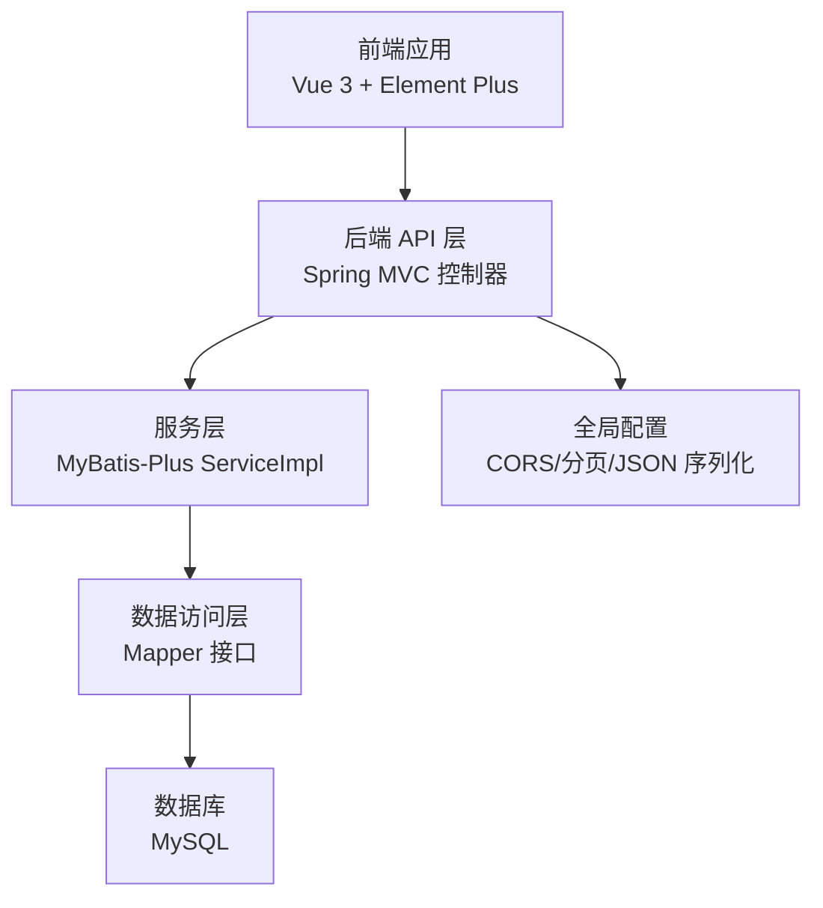
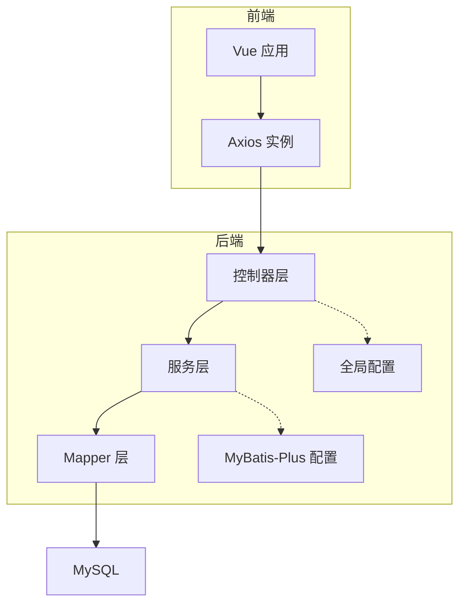
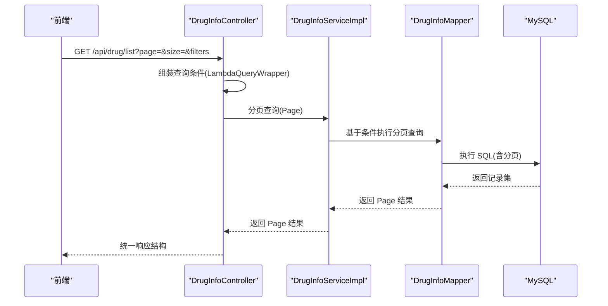
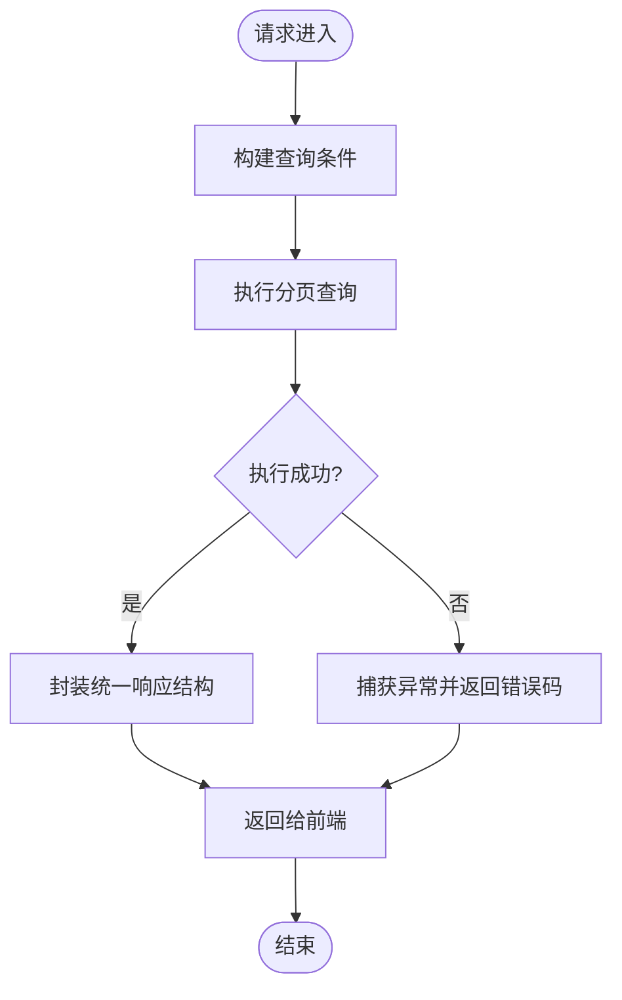
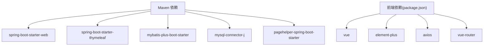

# 性能问题

<cite>
**本文引用的文件**
- [application.yml](file://src/main/resources/application.yml)
- [pom.xml](file://pom.xml)
- [DrugManagementApplication.java](file://src/main/java/com/hospital/drugmanagement/DrugManagementApplication.java)
- [MybatisPlusConfig.java](file://src/main/java/com/hospital/drugmanagement/config/MybatisPlusConfig.java)
- [CorsConfig.java](file://src/main/java/com/hospital/drugmanagement/config/CorsConfig.java)
- [JacksonConfig.java](file://src/main/java/com/hospital/drugmanagement/config/JacksonConfig.java)
- [MyMetaObjectHandler.java](file://src/main/java/com/hospital/drugmanagement/common/handler/MyMetaObjectHandler.java)
- [DrugInfoController.java](file://src/main/java/com/hospital/drugmanagement/controller/DrugInfoController.java)
- [DrugInfoServiceImpl.java](file://src/main/java/com/hospital/drugmanagement/service/impl/DrugInfoServiceImpl.java)
- [DrugInfoMapper.java](file://src/main/java/com/hospital/drugmanagement/mapper/DrugInfoMapper.java)
- [Result.java](file://src/main/java/com/hospital/drugmanagement/dto/Result.java)
- [LoginRequest.java](file://src/main/java/com/hospital/drugmanagement/dto/LoginRequest.java)
- [request.js](file://drug-front/src/utils/request.js)
- [package.json](file://drug-front/package.json)
</cite>

## 目录
1. [简介](#简介)
2. [项目结构](#项目结构)
3. [核心组件](#核心组件)
4. [架构总览](#架构总览)
5. [详细组件分析](#详细组件分析)
6. [依赖分析](#依赖分析)
7. [性能考虑](#性能考虑)
8. [故障排除指南](#故障排除指南)
9. [结论](#结论)
10. [附录](#附录)

## 简介
本指南聚焦于系统性能问题的诊断与优化，覆盖响应缓慢的定位方法（数据库查询优化、API 响应时间分析、前端渲染性能检查）、内存泄漏排查步骤（内存使用监控、垃圾回收分析、资源释放检查）、并发问题的解决方案（线程池配置、数据库连接池优化、锁竞争分析）、缓存问题的诊断与优化（Redis 缓存配置、本地缓存策略、缓存失效机制）、性能监控工具的使用方法（JVM 监控、数据库性能分析、前端性能指标收集）以及性能测试与基准测试的实施建议。文档结合本项目的实际代码与配置进行说明，帮助快速定位瓶颈并制定优化策略。

## 项目结构
后端采用 Spring Boot + MyBatis-Plus 架构，前端基于 Vue 3 + Element Plus。整体分层清晰：控制器层负责请求入口与参数校验；服务层封装业务逻辑；数据访问层通过 MyBatis-Plus Mapper 访问数据库；全局配置涵盖跨域、分页、JSON 序列化等；前端通过 Axios 统一发起请求并处理响应。

**图表来源**
- [DrugManagementApplication.java:14-33](file://src/main/java/com/hospital/drugmanagement/DrugManagementApplication.java#L14-L33)
- [MybatisPlusConfig.java:8-16](file://src/main/java/com/hospital/drugmanagement/config/MybatisPlusConfig.java#L8-L16)
- [CorsConfig.java:7-19](file://src/main/java/com/hospital/drugmanagement/config/CorsConfig.java#L7-L19)
- [JacksonConfig.java:14-33](file://src/main/java/com/hospital/drugmanagement/config/JacksonConfig.java#L14-L33)
- [DrugInfoController.java:14-169](file://src/main/java/com/hospital/drugmanagement/controller/DrugInfoController.java#L14-L169)
- [DrugInfoServiceImpl.java:9-18](file://src/main/java/com/hospital/drugmanagement/service/impl/DrugInfoServiceImpl.java#L9-L18)
- [DrugInfoMapper.java:3-9](file://src/main/java/com/hospital/drugmanagement/mapper/DrugInfoMapper.java#L3-L9)
- [application.yml:1-24](file://src/main/resources/application.yml#L1-L24)

**章节来源**
- [DrugManagementApplication.java:14-33](file://src/main/java/com/hospital/drugmanagement/DrugManagementApplication.java#L14-L33)
- [application.yml:1-24](file://src/main/resources/application.yml#L1-L24)
- [pom.xml:32-84](file://pom.xml#L32-L84)

## 核心组件
- 全局配置
  - CORS 配置：允许任意来源、方法与头部，禁用凭据，设置最大预检缓存时间。
  - MyBatis-Plus 分页插件：启用分页拦截器，避免一次性加载大量数据。
  - Jackson 序列化：Long 类型序列化为字符串，避免前端精度丢失。
  - Thymeleaf：开发阶段关闭缓存，便于模板调试。
- 控制器层
  - 药品信息控制器：提供分页列表、详情、新增、修改、删除接口，统一返回结构。
- 服务层
  - 药品信息服务：继承 MyBatis-Plus ServiceImpl，复用基础 CRUD。
- 数据访问层
  - 药品信息 Mapper：继承 BaseMapper，提供基础映射能力。
- 前端
  - Axios 实例：统一基地址、超时时间、请求/响应拦截器，错误提示与路由跳转。

**章节来源**
- [CorsConfig.java:7-19](file://src/main/java/com/hospital/drugmanagement/config/CorsConfig.java#L7-L19)
- [MybatisPlusConfig.java:8-16](file://src/main/java/com/hospital/drugmanagement/config/MybatisPlusConfig.java#L8-L16)
- [JacksonConfig.java:14-33](file://src/main/java/com/hospital/drugmanagement/config/JacksonConfig.java#L14-L33)
- [application.yml:8-24](file://src/main/resources/application.yml#L8-L24)
- [DrugInfoController.java:14-169](file://src/main/java/com/hospital/drugmanagement/controller/DrugInfoController.java#L14-L169)
- [DrugInfoServiceImpl.java:9-18](file://src/main/java/com/hospital/drugmanagement/service/impl/DrugInfoServiceImpl.java#L9-L18)
- [DrugInfoMapper.java:3-9](file://src/main/java/com/hospital/drugmanagement/mapper/DrugInfoMapper.java#L3-L9)
- [request.js:5-56](file://drug-front/src/utils/request.js#L5-L56)

## 架构总览
后端以 Spring MVC 作为入口，MyBatis-Plus 提供 ORM 与分页支持，数据库为 MySQL。前端通过 Axios 发起请求，统一处理错误与认证状态。

**图表来源**
- [DrugInfoController.java:14-169](file://src/main/java/com/hospital/drugmanagement/controller/DrugInfoController.java#L14-L169)
- [DrugInfoServiceImpl.java:9-18](file://src/main/java/com/hospital/drugmanagement/service/impl/DrugInfoServiceImpl.java#L9-L18)
- [DrugInfoMapper.java:3-9](file://src/main/java/com/hospital/drugmanagement/mapper/DrugInfoMapper.java#L3-L9)
- [MybatisPlusConfig.java:8-16](file://src/main/java/com/hospital/drugmanagement/config/MybatisPlusConfig.java#L8-L16)
- [CorsConfig.java:7-19](file://src/main/java/com/hospital/drugmanagement/config/CorsConfig.java#L7-L19)
- [application.yml:1-24](file://src/main/resources/application.yml#L1-L24)

## 详细组件分析

### 数据库查询与分页优化
- 分页拦截器：通过 MyBatis-Plus 分页插件限制单次查询记录数，避免全表扫描与内存压力。
- 查询条件：控制器中使用条件构造器拼装查询，建议对高频过滤字段建立索引。
- 自动填充：插入/更新时自动填充时间字段，减少业务层重复逻辑，降低出错概率。
- SQL 输出：开发环境开启 SQL 日志打印，便于定位慢查询与 N+1 问题。

**图表来源**
- [DrugInfoController.java:22-58](file://src/main/java/com/hospital/drugmanagement/controller/DrugInfoController.java#L22-L58)
- [DrugInfoServiceImpl.java:9-18](file://src/main/java/com/hospital/drugmanagement/service/impl/DrugInfoServiceImpl.java#L9-L18)
- [DrugInfoMapper.java:3-9](file://src/main/java/com/hospital/drugmanagement/mapper/DrugInfoMapper.java#L3-L9)
- [MyMetaObjectHandler.java:21-32](file://src/main/java/com/hospital/drugmanagement/common/handler/MyMetaObjectHandler.java#L21-L32)
- [application.yml:22-24](file://src/main/resources/application.yml#L22-L24)

**章节来源**
- [MybatisPlusConfig.java:8-16](file://src/main/java/com/hospital/drugmanagement/config/MybatisPlusConfig.java#L8-L16)
- [DrugInfoController.java:22-58](file://src/main/java/com/hospital/drugmanagement/controller/DrugInfoController.java#L22-L58)
- [MyMetaObjectHandler.java:16-60](file://src/main/java/com/hospital/drugmanagement/common/handler/MyMetaObjectHandler.java#L16-L60)
- [application.yml:22-24](file://src/main/resources/application.yml#L22-L24)

### API 响应时间分析
- 统一响应结构：后端返回统一结构，前端可据此统计请求耗时与错误率。
- 错误处理：控制器内捕获异常并返回标准错误码，便于前端识别与上报。
- 超时控制：前端 Axios 设置超时时间，避免长时间阻塞影响用户体验。

**图表来源**
- [DrugInfoController.java:22-58](file://src/main/java/com/hospital/drugmanagement/controller/DrugInfoController.java#L22-L58)
- [Result.java:8-99](file://src/main/java/com/hospital/drugmanagement/dto/Result.java#L8-L99)

**章节来源**
- [Result.java:8-99](file://src/main/java/com/hospital/drugmanagement/dto/Result.java#L8-L99)
- [DrugInfoController.java:22-58](file://src/main/java/com/hospital/drugmanagement/controller/DrugInfoController.java#L22-L58)
- [request.js:27-53](file://drug-front/src/utils/request.js#L27-L53)

### 前端渲染性能检查
- Axios 统一拦截：请求头注入 Token，响应错误统一提示，便于前端侧定位网络与鉴权问题。
- 组件按需加载与懒加载：结合路由与组件拆分，减少首屏渲染负担。
- 图表与列表优化：对大数据量列表采用虚拟滚动或分页加载，避免一次性渲染过多节点。
- 依赖体积控制：关注包大小与第三方库版本，避免引入不必要的依赖。

**章节来源**
- [request.js:5-56](file://drug-front/src/utils/request.js#L5-L56)
- [package.json:13-28](file://drug-front/package.json#L13-L28)

### 并发问题与线程池配置
- 默认线程模型：Spring Boot Web 使用 Tomcat/NIO 线程模型，可通过 JVM 参数与服务器配置调优。
- 数据库连接池：建议使用 HikariCP（默认推荐），合理设置连接数、空闲超时与最大生命周期，避免连接泄漏。
- 锁竞争分析：避免在高并发场景下持有长事务与大锁范围，优先使用短事务与细粒度锁。
- 异步任务：对非关键路径任务（如日志、通知）使用异步执行，降低主线程阻塞风险。

[本节为通用指导，不直接分析具体文件]

### 缓存问题诊断与优化
- 本地缓存策略：对热点数据采用本地缓存（如 Caffeine），减少数据库访问频率。
- Redis 缓存：若引入 Redis，需配置合适的过期策略、淘汰机制与序列化方式，避免缓存穿透、击穿与雪崩。
- 缓存失效机制：采用写后失效或读取时更新策略，确保一致性与性能平衡。
- 前端缓存：利用浏览器缓存与 HTTP 缓存头，减少重复请求。

[本节为通用指导，不直接分析具体文件]

## 依赖分析
后端依赖 Spring Web、Thymeleaf、MyBatis-Plus、MySQL 驱动与分页插件；前端依赖 Vue、Element Plus、Axios 与路由生态。整体依赖简洁，利于性能优化与维护。

**图表来源**
- [pom.xml:32-84](file://pom.xml#L32-L84)
- [package.json:13-28](file://drug-front/package.json#L13-L28)

**章节来源**
- [pom.xml:32-84](file://pom.xml#L32-L84)
- [package.json:13-28](file://drug-front/package.json#L13-L28)

## 性能考虑
- 数据库层面
  - 对高频查询字段建立索引，避免全表扫描。
  - 使用分页与 LIMIT 控制单次返回量，结合延迟加载减少关联查询开销。
  - 开启慢查询日志与执行计划分析，定位热点 SQL。
- 后端层面
  - 合理设置线程池大小与队列长度，避免任务堆积。
  - 使用连接池并监控连接使用情况，防止连接泄漏。
  - 减少不必要的对象创建与序列化开销，优化 JSON 序列化配置。
- 前端层面
  - 控制请求并发数量，合并请求与去重。
  - 列表渲染优化，采用虚拟滚动与懒加载。
  - 使用 CDN 与静态资源压缩，减少首屏加载时间。

[本节为通用指导，不直接分析具体文件]

## 故障排除指南

### 响应缓慢诊断流程
- 步骤一：确认网络与前端
  - 检查前端 Axios 超时与拦截器行为，确认是否存在频繁重试或错误重定向。
  - 使用浏览器开发者工具查看网络面板，识别慢请求与错误码。
- 步骤二：后端接口分析
  - 查看控制器入参与查询条件，确认是否缺少索引或存在全表扫描。
  - 检查分页参数是否合理，避免过大页码与过大每页条数。
- 步骤三：数据库优化
  - 开启慢查询日志，定位耗时 SQL；使用 EXPLAIN 分析执行计划。
  - 对高频过滤字段建立索引；避免 SELECT * 与不必要的 JOIN。
- 步骤四：服务端监控
  - 使用 JVM 监控工具观察 GC 次数与停顿时间，排查内存压力。
  - 监控数据库连接池使用率，避免连接不足或泄漏。

**章节来源**
- [request.js:5-56](file://drug-front/src/utils/request.js#L5-L56)
- [DrugInfoController.java:22-58](file://src/main/java/com/hospital/drugmanagement/controller/DrugInfoController.java#L22-L58)
- [application.yml:22-24](file://src/main/resources/application.yml#L22-L24)

### 内存泄漏排查步骤
- 内存使用监控
  - 使用 JVM 监控工具（如 JConsole、VisualVM、JProfiler）观察堆内存与元空间变化。
  - 关注老年代晋升速率与 Full GC 次数，判断是否存在长期存活对象。
- 垃圾回收分析
  - 采集 GC 日志，分析回收类型与停顿时间；定位不可达对象无法回收的原因。
- 资源释放检查
  - 检查数据库连接、线程池、文件句柄与缓存资源是否正确关闭或归还。
  - 对第三方库的回调与监听器进行显式注销，避免隐式持有。

[本节为通用指导，不直接分析具体文件]

### 并发问题解决方案
- 线程池配置
  - 根据 CPU 核心数与任务类型设置核心线程、最大线程与队列长度。
  - 对 I/O 密集型任务适当增大线程池，CPU 密集型任务保持较小线程池。
- 数据库连接池优化
  - 合理设置最大连接数、最小空闲连接与连接超时；监控活跃连接与等待时间。
  - 避免在连接上执行长时间事务，及时提交或回滚。
- 锁竞争分析
  - 减少锁持有时间与锁范围；使用无锁数据结构或读写分离。
  - 对热点资源进行分片，降低单点竞争。

[本节为通用指导，不直接分析具体文件]

### 缓存问题诊断与优化
- Redis 缓存配置
  - 设置合理的过期时间与淘汰策略；对热点键设置更短 TTL。
  - 使用连接池与序列化优化，避免序列化开销过大。
- 本地缓存策略
  - 采用 Caffeine 等本地缓存，结合容量与 TTL 控制内存占用。
- 缓存失效机制
  - 写后失效或读取时更新，保证一致性；对批量更新采用批量失效策略。

[本节为通用指导，不直接分析具体文件]

### 性能监控工具使用方法
- JVM 监控
  - 使用 JMX 与 GC 日志配合外部监控平台（如 Prometheus + Grafana）。
  - 关注堆外内存、线程数与阻塞队列长度。
- 数据库性能分析
  - 使用慢查询日志与执行计划分析热点 SQL；结合数据库性能视图定位瓶颈。
- 前端性能指标收集
  - 使用浏览器性能 API（如 Navigation Timing、Resource Timing）收集首屏与交互延迟。
  - 在关键路径埋点上报，结合日志平台进行趋势分析。

[本节为通用指导，不直接分析具体文件]

### 性能测试与基准测试实施指南
- 单接口压测
  - 使用工具（如 JMeter、k6、wrk）对关键接口施加负载，观察响应时间与错误率。
- 全链路压测
  - 模拟真实用户行为，覆盖前后端与数据库，评估系统在峰值下的稳定性。
- 基准测试
  - 固定硬件与环境，对比不同版本或配置的性能差异，形成回归基线。
- 指标定义
  - 关注 P50/P95/P99 延迟、吞吐量、错误率与资源使用率，建立告警阈值。

[本节为通用指导，不直接分析具体文件]

## 结论
本项目具备清晰的分层架构与完善的配置基础，性能优化应围绕“数据库索引与分页、后端线程池与连接池、前端渲染与请求优化”三大方向展开。通过统一的监控与测试体系，可有效定位瓶颈并持续改进系统性能。建议在生产环境中逐步引入缓存与异步化策略，并完善压测与回归基线，确保系统在高负载下稳定运行。

## 附录
- 关键配置参考
  - 数据源与 MyBatis-Plus：[application.yml:1-24](file://src/main/resources/application.yml#L1-L24)
  - CORS 配置：[CorsConfig.java:7-19](file://src/main/java/com/hospital/drugmanagement/config/CorsConfig.java#L7-L19)
  - 分页插件：[MybatisPlusConfig.java:8-16](file://src/main/java/com/hospital/drugmanagement/config/MybatisPlusConfig.java#L8-L16)
  - JSON 序列化：[JacksonConfig.java:14-33](file://src/main/java/com/hospital/drugmanagement/config/JacksonConfig.java#L14-L33)
- 接口与数据结构
  - 控制器示例：[DrugInfoController.java:14-169](file://src/main/java/com/hospital/drugmanagement/controller/DrugInfoController.java#L14-L169)
  - 统一响应：[Result.java:8-99](file://src/main/java/com/hospital/drugmanagement/dto/Result.java#L8-L99)
  - 登录请求 DTO：[LoginRequest.java:8-37](file://src/main/java/com/hospital/drugmanagement/dto/LoginRequest.java#L8-L37)
- 前端请求封装
  - Axios 实例与拦截器：[request.js:5-56](file://drug-front/src/utils/request.js#L5-L56)
  - 依赖清单：[package.json:13-28](file://drug-front/package.json#L13-L28)