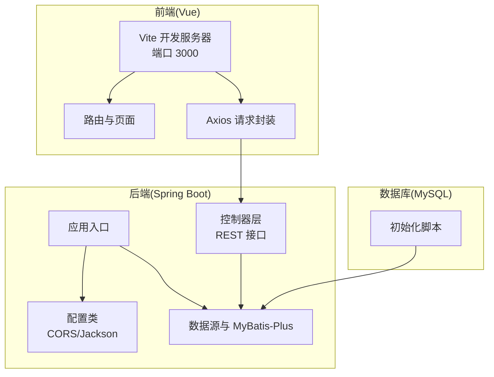
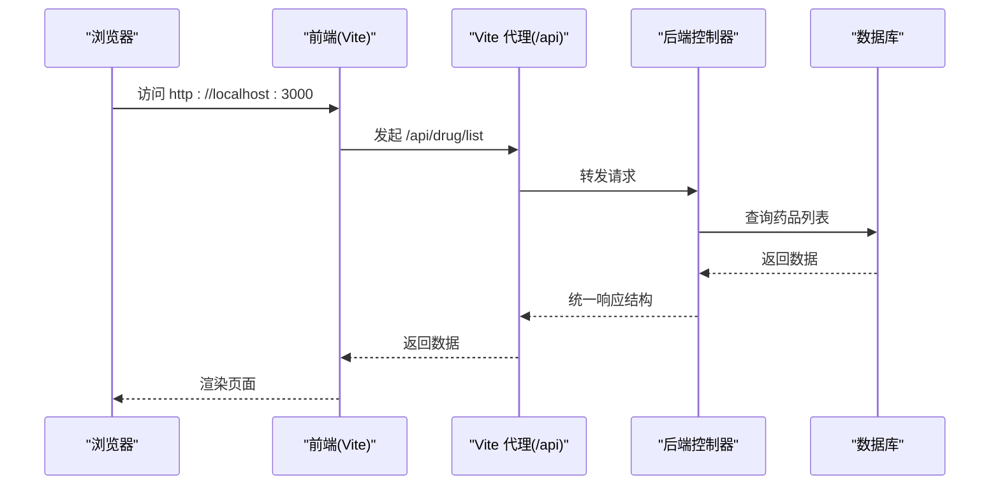
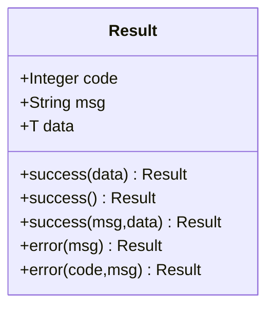
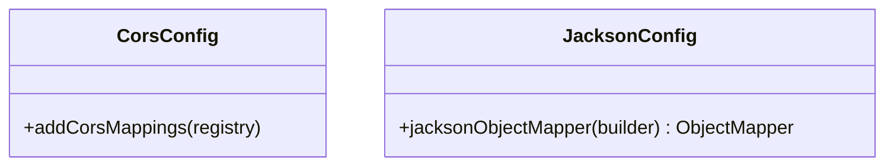
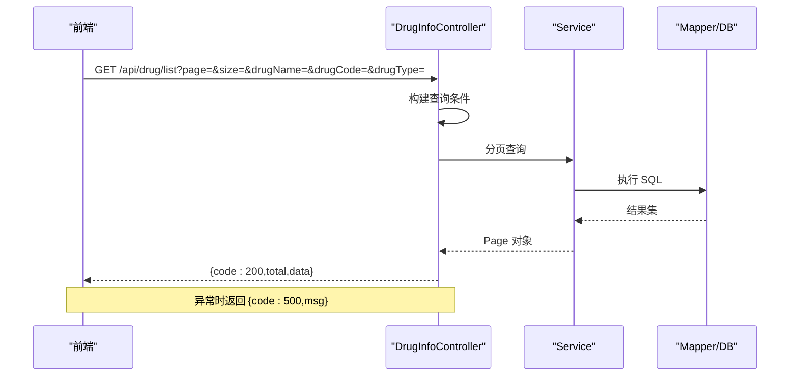
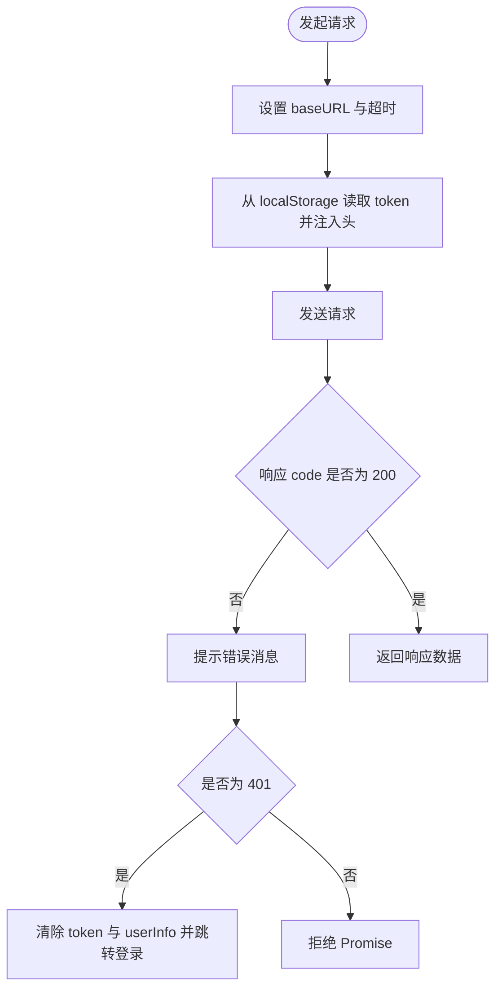
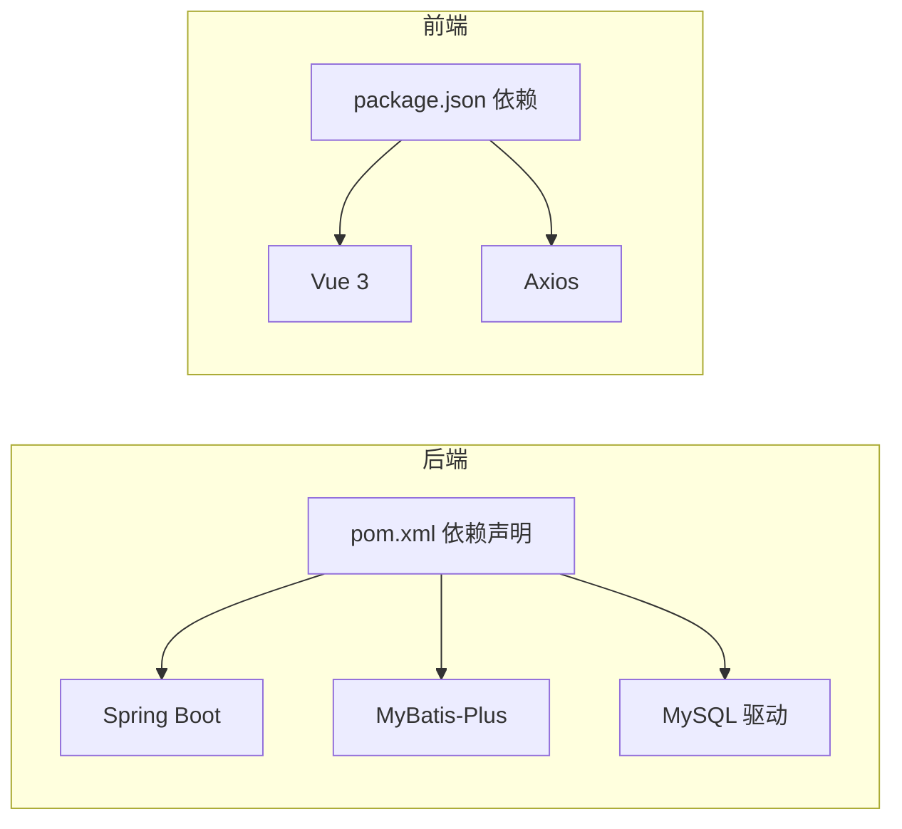

# 故障排除

<cite>
**本文引用的文件**
- [application.yml](file://src/main/resources/application.yml)
- [pom.xml](file://pom.xml)
- [DrugManagementApplication.java](file://src/main/java/com/hospital/drugmanagement/DrugManagementApplication.java)
- [Result.java](file://src/main/java/com/hospital/drugmanagement/dto/Result.java)
- [CorsConfig.java](file://src/main/java/com/hospital/drugmanagement/config/CorsConfig.java)
- [JacksonConfig.java](file://src/main/java/com/hospital/drugmanagement/config/JacksonConfig.java)
- [DrugInfoController.java](file://src/main/java/com/hospital/drugmanagement/controller/DrugInfoController.java)
- [init.sql](file://src/main/resources/db/init.sql)
- [init_and_start.bat](file://init_and_start.bat)
- [request.js](file://drug-front/src/utils/request.js)
- [index.js](file://drug-front/src/router/index.js)
- [Login.vue](file://drug-front/src/views/Login.vue)
- [vite.config.js](file://drug-front/vite.config.js)
- [package.json](file://drug-front/package.json)
</cite>

## 目录
1. [简介](#简介)
2. [项目结构](#项目结构)
3. [核心组件](#核心组件)
4. [架构总览](#架构总览)
5. [详细组件分析](#详细组件分析)
6. [依赖分析](#依赖分析)
7. [性能考虑](#性能考虑)
8. [故障排除指南](#故障排除指南)
9. [结论](#结论)
10. [附录](#附录)

## 简介
本指南面向使用者与开发者，提供系统化的故障排除方法与步骤，覆盖启动问题、数据库问题、API 问题、前端问题、性能问题等类别。文档同时给出诊断流程、常见错误的解决方案、性能诊断要点、预防性维护与监控建议，以及紧急情况处理与数据恢复方案。

## 项目结构
系统采用前后端分离架构：
- 后端：Spring Boot + MyBatis-Plus，提供 REST 接口与数据库访问。
- 前端：Vue 3 + Element Plus，通过代理访问后端接口。
- 数据库：MySQL，初始化脚本包含完整的业务表结构与示例数据。

图表来源
- [vite.config.js:12-21](file://drug-front/vite.config.js#L12-L21)
- [request.js:6-9](file://drug-front/src/utils/request.js#L6-L9)
- [DrugManagementApplication.java:14-24](file://src/main/java/com/hospital/drugmanagement/DrugManagementApplication.java#L14-L24)
- [application.yml:1-24](file://src/main/resources/application.yml#L1-L24)
- [init.sql:1-312](file://src/main/resources/db/init.sql#L1-L312)

章节来源
- [vite.config.js:1-22](file://drug-front/vite.config.js#L1-L22)
- [application.yml:1-24](file://src/main/resources/application.yml#L1-L24)
- [pom.xml:32-84](file://pom.xml#L32-L84)

## 核心组件
- 应用入口与扫描：应用入口负责扫描控制器、服务与配置，并显式导入部分控制器以确保被纳入容器。
- 统一响应：统一返回结构，便于前端与后端对错误进行一致处理。
- CORS 配置：允许跨域访问，便于前端开发调试。
- Jackson 配置：Long 类型序列化为字符串，避免前端精度丢失。
- 控制器层：提供药品信息等核心接口，包含分页、查询、增删改等典型场景。
- 前端 Axios：统一请求与响应拦截，处理鉴权与错误提示。
- 路由与登录：前端路由守卫与登录页面，保障访问控制。

章节来源
- [DrugManagementApplication.java:14-33](file://src/main/java/com/hospital/drugmanagement/DrugManagementApplication.java#L14-L33)
- [Result.java:50-97](file://src/main/java/com/hospital/drugmanagement/dto/Result.java#L50-L97)
- [CorsConfig.java:7-18](file://src/main/java/com/hospital/drugmanagement/config/CorsConfig.java#L7-L18)
- [JacksonConfig.java:14-33](file://src/main/java/com/hospital/drugmanagement/config/JacksonConfig.java#L14-L33)
- [DrugInfoController.java:14-169](file://src/main/java/com/hospital/drugmanagement/controller/DrugInfoController.java#L14-L169)
- [request.js:1-56](file://drug-front/src/utils/request.js#L1-L56)
- [index.js:91-112](file://drug-front/src/router/index.js#L91-L112)

## 架构总览
后端通过 Spring Boot 提供 REST 接口，前端通过 Vite 代理转发到后端。数据库通过 JDBC 连接，MyBatis-Plus 提供 ORM 能力。

图表来源
- [vite.config.js:14-19](file://drug-front/vite.config.js#L14-L19)
- [request.js:7-9](file://drug-front/src/utils/request.js#L7-L9)
- [DrugInfoController.java:22-58](file://src/main/java/com/hospital/drugmanagement/controller/DrugInfoController.java#L22-L58)
- [application.yml:3-7](file://src/main/resources/application.yml#L3-L7)

## 详细组件分析

### 统一响应与错误码约定
- 成功状态码：200
- 失败状态码：500；部分业务场景使用 400
- 响应字段：code、msg、data、total（分页场景）

图表来源
- [Result.java:8-98](file://src/main/java/com/hospital/drugmanagement/dto/Result.java#L8-L98)

章节来源
- [Result.java:50-97](file://src/main/java/com/hospital/drugmanagement/dto/Result.java#L50-L97)

### CORS 与 Jackson 配置
- CORS：允许任意来源、常用方法与头部，关闭凭据。
- Jackson：Long 类型序列化为字符串，避免前端精度问题。

图表来源
- [CorsConfig.java:7-18](file://src/main/java/com/hospital/drugmanagement/config/CorsConfig.java#L7-L18)
- [JacksonConfig.java:14-33](file://src/main/java/com/hospital/drugmanagement/config/JacksonConfig.java#L14-L33)

章节来源
- [CorsConfig.java:7-18](file://src/main/java/com/hospital/drugmanagement/config/CorsConfig.java#L7-L18)
- [JacksonConfig.java:14-33](file://src/main/java/com/hospital/drugmanagement/config/JacksonConfig.java#L14-L33)

### 控制器层与接口行为
- 药品列表：支持分页与多条件过滤。
- 单条查询、新增、更新、删除：包含基础校验与重复性检查。
- 异常捕获：统一返回错误码与错误信息。

图表来源
- [DrugInfoController.java:22-58](file://src/main/java/com/hospital/drugmanagement/controller/DrugInfoController.java#L22-L58)

章节来源
- [DrugInfoController.java:14-169](file://src/main/java/com/hospital/drugmanagement/controller/DrugInfoController.java#L14-L169)

### 前端请求与路由
- Axios：设置 baseURL 为 http://localhost:8081/api，统一注入 Authorization 头，响应非 200 统一弹窗与登出。
- 路由：登录页与业务页，路由守卫根据登录状态放行或重定向至登录。
- Vite 代理：将 /api 前缀转发到后端 8081 端口。

图表来源
- [request.js:6-53](file://drug-front/src/utils/request.js#L6-L53)

章节来源
- [request.js:1-56](file://drug-front/src/utils/request.js#L1-L56)
- [index.js:91-112](file://drug-front/src/router/index.js#L91-L112)
- [vite.config.js:12-21](file://drug-front/vite.config.js#L12-L21)

## 依赖分析
- 后端依赖：Spring Web、Thymeleaf、MySQL 驱动、MyBatis-Plus、分页插件、Lombok。
- 前端依赖：Vue 3、Vue Router、Element Plus、Axios、Pinia、ECharts 等。

图表来源
- [pom.xml:32-84](file://pom.xml#L32-L84)
- [package.json:13-28](file://drug-front/package.json#L13-L28)

章节来源
- [pom.xml:32-84](file://pom.xml#L32-L84)
- [package.json:1-29](file://drug-front/package.json#L1-L29)

## 性能考虑
- SQL 输出：开发环境开启 SQL 日志输出，便于定位慢查询与异常 SQL。
- 分页：控制器层使用分页插件，避免一次性加载大量数据。
- 序列化：Long 精度问题通过 Jackson 序列化为字符串规避。
- 超时与连接池：可通过配置调整连接超时与最大连接数（见“性能问题诊断”）。

章节来源
- [application.yml:18-24](file://src/main/resources/application.yml#L18-L24)
- [JacksonConfig.java:14-33](file://src/main/java/com/hospital/drugmanagement/config/JacksonConfig.java#L14-L33)
- [DrugInfoController.java:22-58](file://src/main/java/com/hospital/drugmanagement/controller/DrugInfoController.java#L22-L58)

## 故障排除指南

### 一、启动问题

#### 1. 端口占用
- 现象：启动失败，提示端口被占用。
- 诊断步骤：
  - 检查后端端口：确认 application.yml 中 server.port 是否被占用。
  - 检查前端端口：确认 vite.config.js 中 server.port 是否被占用。
- 解决方案：
  - 修改 application.yml 的 server.port 或 vite.config.js 的 server.port。
  - 使用系统命令释放占用端口。

章节来源
- [application.yml:14-16](file://src/main/resources/application.yml#L14-L16)
- [vite.config.js:12-14](file://drug-front/vite.config.js#L12-L14)

#### 2. 依赖缺失
- 现象：编译或运行时报缺少类/包。
- 诊断步骤：
  - 检查 pom.xml 依赖是否完整。
  - 检查 package.json 依赖是否安装。
- 解决方案：
  - 后端：执行 Maven 清理并重新构建。
  - 前端：执行 npm install 安装依赖。

章节来源
- [pom.xml:32-84](file://pom.xml#L32-L84)
- [package.json:13-28](file://drug-front/package.json#L13-L28)

#### 3. 配置错误
- 现象：数据库连接失败、CORS 不生效、JSON 序列化异常。
- 诊断步骤：
  - application.yml：检查数据库驱动、URL、用户名、密码、端口、MyBatis-Plus 配置。
  - CORS：确认 CorsConfig 是否生效。
  - Jackson：确认 Long 序列化配置。
- 解决方案：
  - 修正 application.yml 中的数据库连接信息。
  - 确认 CORS 与 Jackson 配置类被扫描到。
  - 如需生产环境开启缓存，调整 Thymeleaf 缓存配置。

章节来源
- [application.yml:1-24](file://src/main/resources/application.yml#L1-L24)
- [CorsConfig.java:7-18](file://src/main/java/com/hospital/drugmanagement/config/CorsConfig.java#L7-L18)
- [JacksonConfig.java:14-33](file://src/main/java/com/hospital/drugmanagement/config/JacksonConfig.java#L14-L33)

### 二、数据库问题

#### 1. 连接失败
- 现象：应用启动时报数据库连接异常。
- 诊断步骤：
  - 检查 MySQL 服务是否启动。
  - 检查 application.yml 中的数据库 URL、用户名、密码。
  - 使用 init_and_start.bat 重新初始化数据库。
- 解决方案：
  - 修正 application.yml 中的数据库连接参数。
  - 使用 init_and_start.bat 重新执行初始化脚本。

章节来源
- [application.yml:3-7](file://src/main/resources/application.yml#L3-L7)
- [init_and_start.bat:1-11](file://init_and_start.bat#L1-L11)
- [init.sql:1-312](file://src/main/resources/db/init.sql#L1-L312)

#### 2. 查询超时
- 现象：接口响应缓慢或超时。
- 诊断步骤：
  - application.yml 中开启 SQL 日志，观察慢查询。
  - 检查控制器分页参数是否合理。
- 解决方案：
  - 优化查询条件与索引。
  - 调整数据库连接超时与线程池参数。

章节来源
- [application.yml:18-24](file://src/main/resources/application.yml#L18-L24)
- [DrugInfoController.java:22-58](file://src/main/java/com/hospital/drugmanagement/controller/DrugInfoController.java#L22-L58)

#### 3. 数据不一致
- 现象：库存、出入库、采购单状态不一致。
- 诊断步骤：
  - 核对初始化脚本中的示例数据与表结构。
  - 检查业务流程是否遵循事务与约束。
- 解决方案：
  - 在业务层增加幂等与一致性校验。
  - 使用数据库事务包裹关键流程。

章节来源
- [init.sql:60-238](file://src/main/resources/db/init.sql#L60-L238)

### 三、API 问题

#### 1. 接口报错
- 现象：返回 code 非 200，msg 显示错误信息。
- 诊断步骤：
  - 查看控制器异常捕获分支，确认错误码与消息。
  - 检查请求参数与业务校验。
- 解决方案：
  - 修复参数或业务逻辑。
  - 统一使用 Result 封装返回。

章节来源
- [DrugInfoController.java:51-56](file://src/main/java/com/hospital/drugmanagement/controller/DrugInfoController.java#L51-L56)
- [Result.java:82-97](file://src/main/java/com/hospital/drugmanagement/dto/Result.java#L82-L97)

#### 2. 权限拒绝
- 现象：返回 401，前端自动跳转登录。
- 诊断步骤：
  - 检查请求头 Authorization 是否正确注入。
  - 检查后端鉴权逻辑（如无鉴权需求可临时关闭）。
- 解决方案：
  - 确保前端正确携带 token。
  - 后端完善鉴权策略。

章节来源
- [request.js:12-44](file://drug-front/src/utils/request.js#L12-L44)

#### 3. 参数验证失败
- 现象：新增/更新接口返回 400，提示重复或必填。
- 诊断步骤：
  - 检查控制器中的重复性校验逻辑。
  - 检查前端表单校验规则。
- 解决方案：
  - 修正重复项或补齐必填字段。

章节来源
- [DrugInfoController.java:83-101](file://src/main/java/com/hospital/drugmanagement/controller/DrugInfoController.java#L83-L101)

### 四、前端问题

#### 1. 页面空白
- 现象：页面无法渲染。
- 诊断步骤：
  - 检查 Vite 代理是否正确转发到后端。
  - 检查路由配置与页面组件是否正确引入。
- 解决方案：
  - 修正 vite.config.js 的代理 target。
  - 确认路由与组件路径。

章节来源
- [vite.config.js:12-21](file://drug-front/vite.config.js#L12-L21)
- [index.js:4-84](file://drug-front/src/router/index.js#L4-L84)

#### 2. 组件异常
- 现象：组件渲染异常或报错。
- 诊断步骤：
  - 检查组件导入与动态 import。
  - 检查 Element Plus 版本与图标是否匹配。
- 解决方案：
  - 更新依赖或修正组件路径。

章节来源
- [index.js:5-83](file://drug-front/src/router/index.js#L5-L83)
- [package.json:13-28](file://drug-front/package.json#L13-L28)

#### 3. 路由错误
- 现象：访问受保护页面被重定向到登录。
- 诊断步骤：
  - 检查路由守卫逻辑与用户登录状态。
- 解决方案：
  - 确保登录成功后写入 token 与用户信息。

章节来源
- [index.js:91-112](file://drug-front/src/router/index.js#L91-L112)
- [Login.vue:74-92](file://drug-front/src/views/Login.vue#L74-L92)

### 五、性能问题

#### 1. 响应缓慢
- 诊断步骤：
  - application.yml 开启 SQL 日志，定位慢查询。
  - 检查分页大小与查询条件。
- 解决方案：
  - 优化索引与查询条件。
  - 限制分页大小与默认每页数量。

章节来源
- [application.yml:18-24](file://src/main/resources/application.yml#L18-L24)
- [DrugInfoController.java:22-58](file://src/main/java/com/hospital/drugmanagement/controller/DrugInfoController.java#L22-L58)

#### 2. 内存泄漏
- 诊断步骤：
  - 关注前端 Store 与组件生命周期，避免循环引用。
- 解决方案：
  - 使用合适的清理逻辑与依赖注入方式。

章节来源
- [package.json:13-28](file://drug-front/package.json#L13-L28)

#### 3. 并发问题
- 诊断步骤：
  - 检查数据库事务边界与锁策略。
- 解决方案：
  - 使用乐观锁或悲观锁，保证数据一致性。

章节来源
- [init.sql:111-238](file://src/main/resources/db/init.sql#L111-L238)

### 六、日志分析与错误码解读

- 日志位置与级别：
  - 后端：StdOutImpl 输出 SQL 日志，便于开发调试。
- 错误码约定：
  - 200：成功
  - 400：业务参数/重复性错误
  - 401：未授权
  - 500：系统异常

章节来源
- [application.yml:22-24](file://src/main/resources/application.yml#L22-L24)
- [Result.java:50-97](file://src/main/java/com/hospital/drugmanagement/dto/Result.java#L50-L97)
- [request.js:32-44](file://drug-front/src/utils/request.js#L32-L44)

### 七、网络连接检查与数据库连接测试

- 网络连接：
  - 前端代理：确认 /api 转发到 http://localhost:8081。
  - 后端端口：确认 8081 可访问。
- 数据库连接：
  - 使用 init_and_start.bat 重新初始化数据库。
  - 校验 application.yml 中的数据库连接参数。

章节来源
- [vite.config.js:14-19](file://drug-front/vite.config.js#L14-L19)
- [application.yml:3-7](file://src/main/resources/application.yml#L3-L7)
- [init_and_start.bat:1-11](file://init_and_start.bat#L1-L11)

### 八、常见错误的解决方案

- 权限配置：
  - 前端：确保 Authorization 头正确注入。
  - 后端：完善鉴权逻辑或临时关闭以验证问题。
- 依赖版本冲突：
  - 后端：统一 Spring Boot 与 MyBatis-Plus 版本。
  - 前端：锁定 Element Plus 与 Vue 版本。
- 配置文件错误：
  - application.yml：核对数据库、端口、MyBatis-Plus 配置。
  - vite.config.js：核对代理 target。
- 缓存问题：
  - Thymeleaf：开发阶段关闭缓存，生产环境按需开启。

章节来源
- [application.yml:8-12](file://src/main/resources/application.yml#L8-L12)
- [pom.xml:52-64](file://pom.xml#L52-L64)
- [package.json:13-28](file://drug-front/package.json#L13-L28)
- [vite.config.js:12-21](file://drug-front/vite.config.js#L12-L21)

### 九、性能问题诊断

- 慢查询分析：
  - 开启 SQL 日志，定位慢查询语句。
  - 优化 WHERE 条件与 JOIN。
- 内存使用分析：
  - 前端：关注 Store 与组件实例数量。
  - 后端：监控线程池与连接池。
- 并发问题排查：
  - 使用数据库事务与锁。
  - 评估分页与批量操作策略。

章节来源
- [application.yml:18-24](file://src/main/resources/application.yml#L18-L24)
- [package.json:13-28](file://drug-front/package.json#L13-L28)

### 十、预防性维护与监控告警

- 预防性维护：
  - 定期备份数据库。
  - 保持依赖版本稳定与安全补丁更新。
- 监控告警：
  - 后端：启用健康检查与日志聚合。
  - 前端：监控网络错误与页面加载时间。

[本节为通用建议，无需特定文件引用]

### 十一、紧急情况处理流程与数据恢复

- 紧急处理流程：
  - 快速隔离问题模块，降级或回滚。
  - 恢复数据库到最近可用快照。
- 数据恢复：
  - 使用 init.sql 初始化基础结构与示例数据。
  - 通过备份恢复业务数据。

章节来源
- [init.sql:1-312](file://src/main/resources/db/init.sql#L1-L312)
- [init_and_start.bat:1-11](file://init_and_start.bat#L1-L11)

## 结论
本指南提供了从启动、数据库、API、前端到性能的全链路故障排除方法。建议在开发与生产环境中分别启用不同级别的日志与缓存策略，并建立完善的监控与备份体系，以提升系统的稳定性与可维护性。

## 附录

### A. 关键配置一览
- 后端端口与数据源：application.yml
- 依赖版本：pom.xml
- 前端代理与端口：vite.config.js
- 统一响应与错误码：Result.java
- CORS 与 JSON 序列化：CorsConfig.java、JacksonConfig.java
- 示例数据与表结构：init.sql

章节来源
- [application.yml:1-24](file://src/main/resources/application.yml#L1-L24)
- [pom.xml:29-84](file://pom.xml#L29-L84)
- [vite.config.js:1-22](file://drug-front/vite.config.js#L1-L22)
- [Result.java:50-97](file://src/main/java/com/hospital/drugmanagement/dto/Result.java#L50-L97)
- [CorsConfig.java:7-18](file://src/main/java/com/hospital/drugmanagement/config/CorsConfig.java#L7-L18)
- [JacksonConfig.java:14-33](file://src/main/java/com/hospital/drugmanagement/config/JacksonConfig.java#L14-L33)
- [init.sql:1-312](file://src/main/resources/db/init.sql#L1-L312)