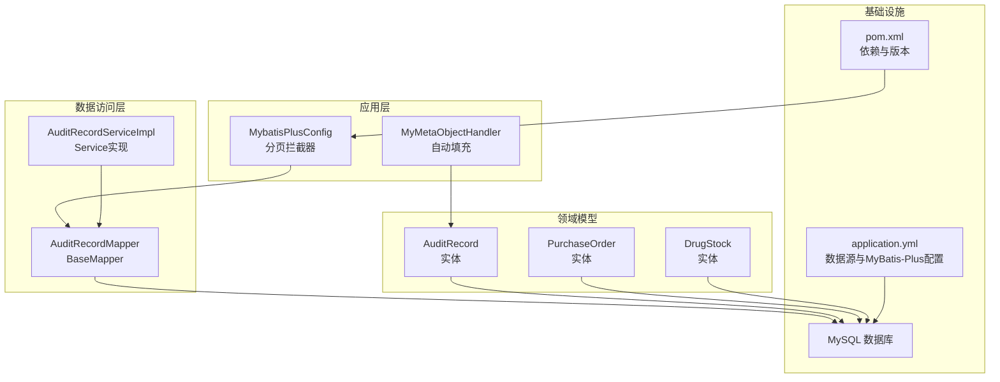
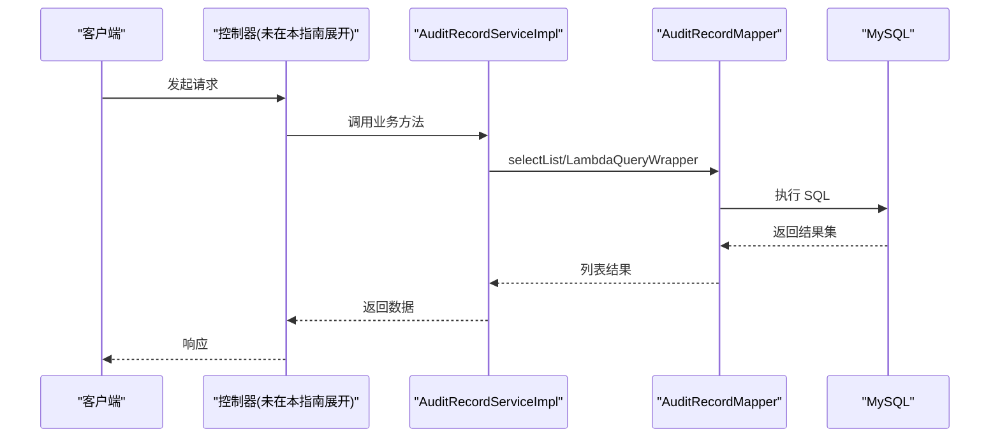
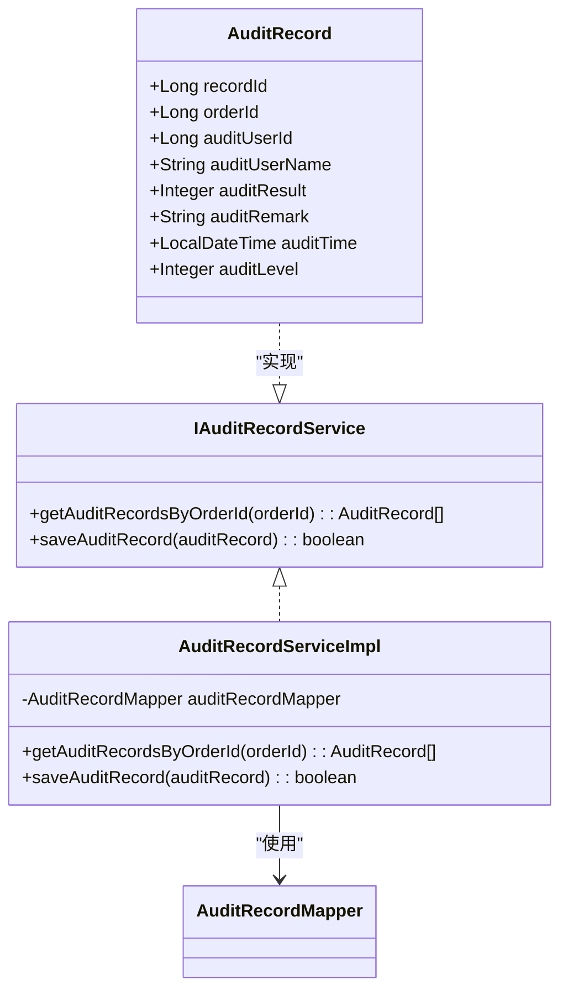
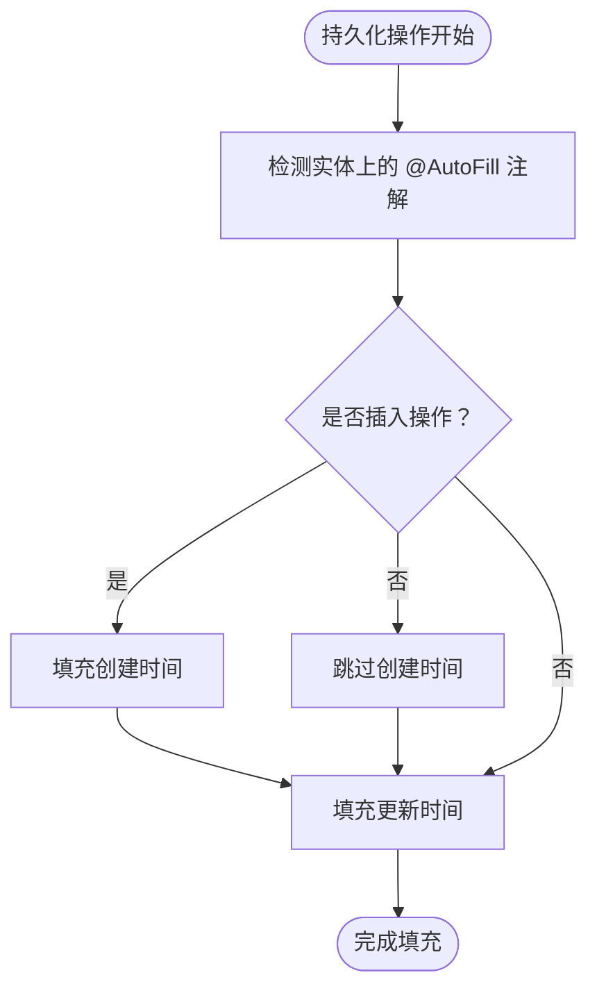
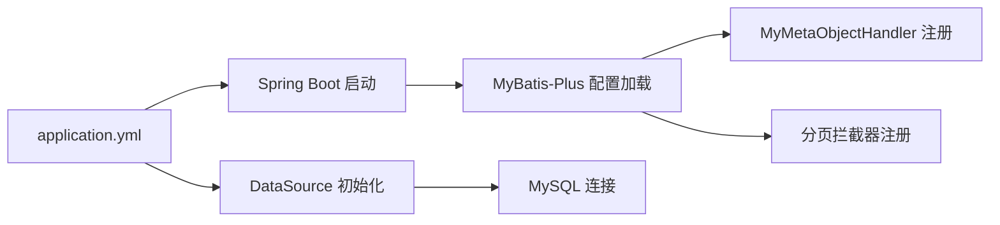

# 数据库问题

<cite>
**本文引用的文件**
- [application.yml](file://src/main/resources/application.yml)
- [MybatisPlusConfig.java](file://src/main/java/com/hospital/drugmanagement/config/MybatisPlusConfig.java)
- [MyMetaObjectHandler.java](file://src/main/java/com/hospital/drugmanagement/common/handler/MyMetaObjectHandler.java)
- [AuditRecordMapper.java](file://src/main/java/com/hospital/drugmanagement/mapper/AuditRecordMapper.java)
- [AuditRecordServiceImpl.java](file://src/main/java/com/hospital/drugmanagement/service/impl/AuditRecordServiceImpl.java)
- [IAuditRecordService.java](file://src/main/java/com/hospital/drugmanagement/service/IAuditRecordService.java)
- [AuditRecord.java](file://src/main/java/com/hospital/drugmanagement/entity/AuditRecord.java)
- [PurchaseOrder.java](file://src/main/java/com/hospital/drugmanagement/entity/PurchaseOrder.java)
- [DrugStock.java](file://src/main/java/com/hospital/drugmanagement/entity/DrugStock.java)
- [init.sql](file://src/main/resources/db/init.sql)
- [hospital_drug.sql](file://hospital_drug.sql)
- [pom.xml](file://pom.xml)
</cite>

## 目录
1. [简介](#简介)
2. [项目结构](#项目结构)
3. [核心组件](#核心组件)
4. [架构总览](#架构总览)
5. [详细组件分析](#详细组件分析)
6. [依赖关系分析](#依赖关系分析)
7. [性能考虑](#性能考虑)
8. [故障排除指南](#故障排除指南)
9. [结论](#结论)
10. [附录](#附录)

## 简介
本指南聚焦于数据库连接与操作相关的问题排查，结合项目中的数据库配置、MyBatis-Plus 使用方式、实体映射与自动填充机制，提供系统化的诊断思路与解决步骤。内容涵盖：
- 连接失败诊断：连接字符串、凭据、防火墙、MySQL 服务状态
- 查询超时排查：慢查询定位、索引优化、连接池配置
- 数据不一致：事务与自动填充、数据同步与备份恢复
- 性能问题：锁等待、死锁检测、内存使用分析
- SQL 调试与 MyBatis-Plus 配置问题

## 项目结构
后端基于 Spring Boot 3 + MyBatis-Plus，数据库配置集中在 application.yml，MyBatis-Plus 分页插件在配置类中启用，实体类通过注解映射到表结构，审计记录等关键实体使用自动填充注解。

图表来源
- [MybatisPlusConfig.java:1-16](file://src/main/java/com/hospital/drugmanagement/config/MybatisPlusConfig.java#L1-L16)
- [MyMetaObjectHandler.java:1-60](file://src/main/java/com/hospital/drugmanagement/common/handler/MyMetaObjectHandler.java#L1-L60)
- [AuditRecordMapper.java:1-8](file://src/main/java/com/hospital/drugmanagement/mapper/AuditRecordMapper.java#L1-L8)
- [AuditRecordServiceImpl.java:1-33](file://src/main/java/com/hospital/drugmanagement/service/impl/AuditRecordServiceImpl.java#L1-L33)
- [AuditRecord.java:1-35](file://src/main/java/com/hospital/drugmanagement/entity/AuditRecord.java#L1-L35)
- [PurchaseOrder.java:1-40](file://src/main/java/com/hospital/drugmanagement/entity/PurchaseOrder.java#L1-L40)
- [DrugStock.java:1-39](file://src/main/java/com/hospital/drugmanagement/entity/DrugStock.java#L1-L39)
- [application.yml:1-24](file://src/main/resources/application.yml#L1-L24)
- [pom.xml:1-119](file://pom.xml#L1-L119)

章节来源
- [application.yml:1-24](file://src/main/resources/application.yml#L1-L24)
- [MybatisPlusConfig.java:1-16](file://src/main/java/com/hospital/drugmanagement/config/MybatisPlusConfig.java#L1-L16)
- [MyMetaObjectHandler.java:1-60](file://src/main/java/com/hospital/drugmanagement/common/handler/MyMetaObjectHandler.java#L1-L60)
- [AuditRecordMapper.java:1-8](file://src/main/java/com/hospital/drugmanagement/mapper/AuditRecordMapper.java#L1-L8)
- [AuditRecordServiceImpl.java:1-33](file://src/main/java/com/hospital/drugmanagement/service/impl/AuditRecordServiceImpl.java#L1-L33)
- [AuditRecord.java:1-35](file://src/main/java/com/hospital/drugmanagement/entity/AuditRecord.java#L1-L35)
- [PurchaseOrder.java:1-40](file://src/main/java/com/hospital/drugmanagement/entity/PurchaseOrder.java#L1-L40)
- [DrugStock.java:1-39](file://src/main/java/com/hospital/drugmanagement/entity/DrugStock.java#L1-L39)
- [pom.xml:1-119](file://pom.xml#L1-L119)

## 核心组件
- 数据源与 MyBatis-Plus 配置：application.yml 中定义了 JDBC 驱动、URL、用户名、密码以及 MyBatis-Plus 的 mapper 位置、类型别名包、SQL 日志输出与下划线转驼峰。
- 分页插件：MybatisPlusConfig 注册 PaginationInnerInterceptor，用于分页查询。
- 自动填充：MyMetaObjectHandler 实现 MetaObjectHandler，在插入与更新时按注解填充时间字段。
- 审计记录：AuditRecord 实体映射到 audit_record 表，服务层提供按订单查询与保存方法；Mapper 继承 BaseMapper。

章节来源
- [application.yml:1-24](file://src/main/resources/application.yml#L1-L24)
- [MybatisPlusConfig.java:1-16](file://src/main/java/com/hospital/drugmanagement/config/MybatisPlusConfig.java#L1-L16)
- [MyMetaObjectHandler.java:1-60](file://src/main/java/com/hospital/drugmanagement/common/handler/MyMetaObjectHandler.java#L1-L60)
- [AuditRecordMapper.java:1-8](file://src/main/java/com/hospital/drugmanagement/mapper/AuditRecordMapper.java#L1-L8)
- [AuditRecordServiceImpl.java:1-33](file://src/main/java/com/hospital/drugmanagement/service/impl/AuditRecordServiceImpl.java#L1-L33)
- [AuditRecord.java:1-35](file://src/main/java/com/hospital/drugmanagement/entity/AuditRecord.java#L1-L35)

## 架构总览

图表来源
- [AuditRecordServiceImpl.java:19-26](file://src/main/java/com/hospital/drugmanagement/service/impl/AuditRecordServiceImpl.java#L19-L26)
- [AuditRecordMapper.java:1-8](file://src/main/java/com/hospital/drugmanagement/mapper/AuditRecordMapper.java#L1-L8)

## 详细组件分析

### 审计记录模块（实体、服务、映射）
- 实体 AuditRecord 映射 audit_record 表，包含主键、外键、审核结果、时间与级别等字段。
- 服务层提供按订单查询与保存方法，使用 LambdaQueryWrapper 构建条件并排序。
- Mapper 继承 BaseMapper，可直接执行通用 CRUD。

图表来源
- [AuditRecord.java:1-35](file://src/main/java/com/hospital/drugmanagement/entity/AuditRecord.java#L1-L35)
- [IAuditRecordService.java:1-24](file://src/main/java/com/hospital/drugmanagement/service/IAuditRecordService.java#L1-L24)
- [AuditRecordServiceImpl.java:14-32](file://src/main/java/com/hospital/drugmanagement/service/impl/AuditRecordServiceImpl.java#L14-L32)
- [AuditRecordMapper.java:1-8](file://src/main/java/com/hospital/drugmanagement/mapper/AuditRecordMapper.java#L1-L8)

章节来源
- [AuditRecord.java:1-35](file://src/main/java/com/hospital/drugmanagement/entity/AuditRecord.java#L1-L35)
- [IAuditRecordService.java:1-24](file://src/main/java/com/hospital/drugmanagement/service/IAuditRecordService.java#L1-L24)
- [AuditRecordServiceImpl.java:14-32](file://src/main/java/com/hospital/drugmanagement/service/impl/AuditRecordServiceImpl.java#L14-L32)
- [AuditRecordMapper.java:1-8](file://src/main/java/com/hospital/drugmanagement/mapper/AuditRecordMapper.java#L1-L8)

### 自动填充与实体映射
- 自动填充：MyMetaObjectHandler 在插入与更新时根据 @AutoFill 注解填充创建/更新时间。
- 实体映射：PurchaseOrder、DrugStock 等实体通过 @TableName 与 @TableField 映射到表与列，确保字段命名与数据库一致。

图表来源
- [MyMetaObjectHandler.java:21-32](file://src/main/java/com/hospital/drugmanagement/common/handler/MyMetaObjectHandler.java#L21-L32)
- [PurchaseOrder.java:35-39](file://src/main/java/com/hospital/drugmanagement/entity/PurchaseOrder.java#L35-L39)
- [DrugStock.java:34-38](file://src/main/java/com/hospital/drugmanagement/entity/DrugStock.java#L34-L38)

章节来源
- [MyMetaObjectHandler.java:1-60](file://src/main/java/com/hospital/drugmanagement/common/handler/MyMetaObjectHandler.java#L1-L60)
- [PurchaseOrder.java:1-40](file://src/main/java/com/hospital/drugmanagement/entity/PurchaseOrder.java#L1-L40)
- [DrugStock.java:1-39](file://src/main/java/com/hospital/drugmanagement/entity/DrugStock.java#L1-L39)

### 数据库初始化与表结构
- init.sql 提供完整的建表与初始化数据脚本，包含 audit_record、drug_info、drug_stock、purchase_order 等核心表及索引。
- hospital_drug.sql 为导出现有结构与数据的 SQL 文件，可用于对比与恢复。

章节来源
- [init.sql:1-312](file://src/main/resources/db/init.sql#L1-L312)
- [hospital_drug.sql:1-307](file://hospital_drug.sql#L1-L307)

## 依赖关系分析
- 数据源与驱动：application.yml 指定 MySQL 驱动与连接参数；pom.xml 引入 mysql-connector-j。
- ORM 与分页：application.yml 指定 MyBatis-Plus 配置；MybatisPlusConfig 注册分页拦截器。
- 自动填充：MyMetaObjectHandler 作为组件被 MyBatis-Plus 自动识别并执行填充逻辑。

图表来源
- [application.yml:1-24](file://src/main/resources/application.yml#L1-L24)
- [MybatisPlusConfig.java:10-15](file://src/main/java/com/hospital/drugmanagement/config/MybatisPlusConfig.java#L10-L15)
- [MyMetaObjectHandler.java:17](file://src/main/java/com/hospital/drugmanagement/common/handler/MyMetaObjectHandler.java#L17)
- [pom.xml:45-50](file://pom.xml#L45-L50)

章节来源
- [application.yml:1-24](file://src/main/resources/application.yml#L1-L24)
- [MybatisPlusConfig.java:1-16](file://src/main/java/com/hospital/drugmanagement/config/MybatisPlusConfig.java#L1-L16)
- [MyMetaObjectHandler.java:1-60](file://src/main/java/com/hospital/drugmanagement/common/handler/MyMetaObjectHandler.java#L1-L60)
- [pom.xml:1-119](file://pom.xml#L1-L119)

## 性能考虑
- 索引设计：init.sql 为多表建立了常用查询字段的索引（如 idx_order_id、idx_drug_id、idx_warehouse_id），有助于提升查询性能。
- 分页与日志：MyBatis-Plus 分页拦截器可避免全表扫描；application.yml 开启 SQL 输出便于调试，但生产环境建议关闭或降级。
- 字段命名：application.yml 启用下划线转驼峰，减少命名不一致导致的查询错误与性能损耗。

章节来源
- [init.sql:123-124](file://src/main/resources/db/init.sql#L123-L124)
- [application.yml:18-24](file://src/main/resources/application.yml#L18-L24)
- [MybatisPlusConfig.java:10-15](file://src/main/java/com/hospital/drugmanagement/config/MybatisPlusConfig.java#L10-L15)

## 故障排除指南

### 一、数据库连接失败诊断
- 连接字符串验证
  - 确认 application.yml 中的 JDBC URL、驱动类名、字符集与时区设置正确。
  - 参考：[application.yml:4-6](file://src/main/resources/application.yml#L4-L6)
- 用户名与密码
  - 核对 application.yml 中的 username 与 password，确保与 MySQL 用户一致。
  - 参考：[application.yml:6-7](file://src/main/resources/application.yml#L6-L7)
- 防火墙与网络
  - 确认本地 MySQL 端口（默认 3306）未被防火墙阻断；若远程访问，确认 bind-address 与用户权限。
- MySQL 服务状态
  - 检查 MySQL 服务是否启动；确认数据库是否存在且字符集匹配。
  - 参考：[init.sql:4](file://src/main/resources/db/init.sql#L4)
- 依赖与版本
  - 确认 pom.xml 中 mysql-connector-j 版本与 MySQL Server 兼容。
  - 参考：[pom.xml:45-50](file://pom.xml#L45-L50)

### 二、查询超时与慢查询排查
- 慢查询分析
  - application.yml 开启 SQL 日志输出，观察慢查询与重复 SQL。
  - 参考：[application.yml:22-23](file://src/main/resources/application.yml#L22-L23)
- 索引优化建议
  - 对高频过滤与排序字段建立合适索引（参考 init.sql 中现有索引模式）。
  - 参考：[init.sql:123-124](file://src/main/resources/db/init.sql#L123-L124)
- 连接池配置调优
  - 建议在 application.yml 中增加连接池参数（如最大连接数、空闲连接、超时时间），以减少连接争用与超时。
  - 参考：[application.yml:3-7](file://src/main/resources/application.yml#L3-L7)

### 三、数据不一致问题
- 事务处理
  - 对涉及多表写入的关键流程（如库存变更、订单状态推进）使用 @Transactional 确保原子性。
- 自动填充一致性
  - 确保实体上使用 @AutoFill 的字段在插入/更新时由 MyMetaObjectHandler 正确填充。
  - 参考：[MyMetaObjectHandler.java:21-32](file://src/main/java/com/hospital/drugmanagement/common/handler/MyMetaObjectHandler.java#L21-L32)
- 数据同步与备份恢复
  - 使用 hospital_drug.sql 进行结构与数据导出，定期备份；必要时通过 init.sql 初始化测试环境。
  - 参考：[hospital_drug.sql:1-307](file://hospital_drug.sql#L1-L307)，[init.sql:1-312](file://src/main/resources/db/init.sql#L1-L312)

### 四、数据库性能问题
- 锁等待与死锁检测
  - 通过 MySQL 慢查询日志与锁等待监控定位热点表与长事务；优化事务粒度与加锁顺序。
- 内存使用分析
  - 结合 JVM 与 MySQL 参数（如 innodb_buffer_pool_size）进行容量规划与调优。
- SQL 调试技巧
  - 利用 application.yml 的 SQL 输出功能，配合实体字段命名与下划线转驼峰配置，快速定位字段映射问题。
  - 参考：[application.yml:22-24](file://src/main/resources/application.yml#L22-L24)

### 五、MyBatis-Plus 配置问题
- 分页插件未生效
  - 确认 MybatisPlusConfig 中已注册 PaginationInnerInterceptor。
  - 参考：[MybatisPlusConfig.java:10-15](file://src/main/java/com/hospital/drugmanagement/config/MybatisPlusConfig.java#L10-L15)
- SQL 日志未输出
  - 检查 application.yml 中 log-impl 配置是否正确。
  - 参考：[application.yml:22-23](file://src/main/resources/application.yml#L22-L23)
- 下划线转驼峰不生效
  - 确认 map-underscore-to-camel-case 已开启。
  - 参考：[application.yml:24](file://src/main/resources/application.yml#L24)

## 结论
本指南从配置、实体映射、自动填充与分页插件等角度出发，提供了数据库连接、查询超时、数据不一致与性能问题的系统化排查路径。结合 init.sql 与 hospital_drug.sql，可在开发与生产环境中快速定位并解决问题。

## 附录
- 常用排查清单
  - 连接：URL/驱动/凭据/网络/服务状态
  - 查询：索引/日志/分页/连接池
  - 一致性：事务/自动填充/备份
  - 性能：锁/死锁/内存/SQL 调优
  - 配置：MyBatis-Plus 分页与日志