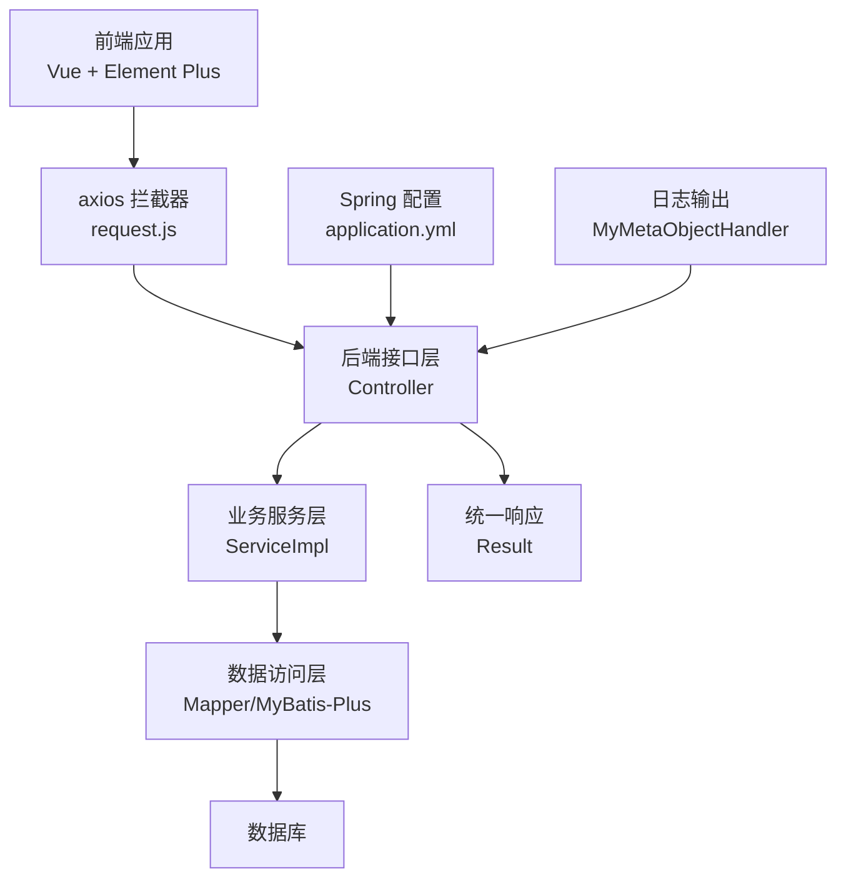
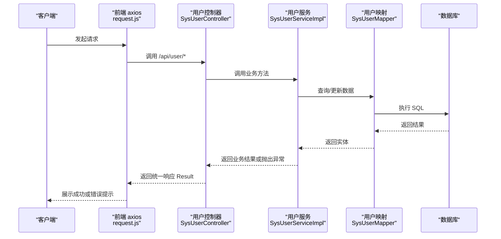
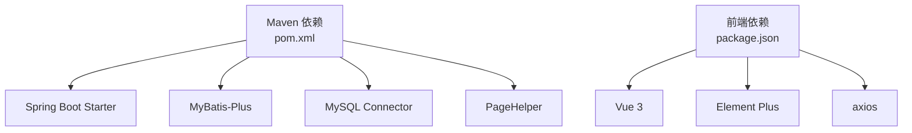

# 错误处理

<cite>
**本文引用的文件**
- [application.yml](file://src/main/resources/application.yml)
- [Result.java](file://src/main/java/com/hospital/drugmanagement/dto/Result.java)
- [MyMetaObjectHandler.java](file://src/main/java/com/hospital/drugmanagement/common/handler/MyMetaObjectHandler.java)
- [SysUserController.java](file://src/main/java/com/hospital/drugmanagement/controller/SysUserController.java)
- [SysUserServiceImpl.java](file://src/main/java/com/hospital/drugmanagement/service/impl/SysUserServiceImpl.java)
- [DrugInfoController.java](file://src/main/java/com/hospital/drugmanagement/controller/DrugInfoController.java)
- [SysUserMapper.java](file://src/main/java/com/hospital/drugmanagement/mapper/SysUserMapper.java)
- [request.js](file://drug-front/src/utils/request.js)
- [user.js](file://drug-front/src/api/user.js)
- [JacksonConfig.java](file://src/main/java/com/hospital/drugmanagement/config/JacksonConfig.java)
- [AutoFill.java](file://src/main/java/com/hospital/drugmanagement/common/anno/AutoFill.java)
- [FillTypeEnum.java](file://src/main/java/com/hospital/drugmanagement/common/constant/FillTypeEnum.java)
- [pom.xml](file://pom.xml)
- [DrugManagementApplicationTests.java](file://src/test/java/com/hospital/drugmanagement/DrugManagementApplicationTests.java)
- [drug-out-impl.java](file://src/main/java/com/hospital/drugmanagement/service/impl/DrugOutServiceImpl.java)
- [drug-in-impl.java](file://src/main/java/com/hospital/drugmanagement/service/impl/DrugInServiceImpl.java)
</cite>

## 目录
1. [简介](#简介)
2. [项目结构](#项目结构)
3. [核心组件](#核心组件)
4. [架构总览](#架构总览)
5. [详细组件分析](#详细组件分析)
6. [依赖分析](#依赖分析)
7. [性能考虑](#性能考虑)
8. [故障排查指南](#故障排查指南)
9. [结论](#结论)
10. [附录](#附录)

## 简介
本指南聚焦于系统中的错误处理与日志分析实践，帮助开发者与运维人员理解并高效处置各类异常。内容覆盖：
- 错误码分类与含义：系统内置错误码、业务逻辑错误码、第三方服务错误码
- 日志分析方法：Spring Boot 日志配置、数据库 SQL 日志、前端控制台错误信息解读
- 常见异常处理：NullPointerException、SQLException、JsonProcessingException 等
- 错误监控与告警：日志级别、错误统计、异常通知机制
- 调试技巧与开发环境问题定位

## 项目结构
后端采用 Spring Boot + MyBatis-Plus 架构，统一响应通过 Result 封装；前端基于 Vue 3 + Element Plus，通过 axios 拦截器集中处理错误与鉴权。

图表来源
- [application.yml:1-24](file://src/main/resources/application.yml#L1-L24)
- [Result.java:1-99](file://src/main/java/com/hospital/drugmanagement/dto/Result.java#L1-L99)
- [SysUserController.java:1-421](file://src/main/java/com/hospital/drugmanagement/controller/SysUserController.java#L1-L421)
- [SysUserServiceImpl.java:1-127](file://src/main/java/com/hospital/drugmanagement/service/impl/SysUserServiceImpl.java#L1-L127)
- [MyMetaObjectHandler.java:1-60](file://src/main/java/com/hospital/drugmanagement/common/handler/MyMetaObjectHandler.java#L1-L60)

章节来源
- [application.yml:1-24](file://src/main/resources/application.yml#L1-L24)
- [pom.xml:1-119](file://pom.xml#L1-L119)

## 核心组件
- 统一响应封装 Result：所有接口返回统一结构，包含状态码、消息与数据，便于前端统一处理与错误提示。
- 控制器层错误捕获：控制器内对典型异常进行分类捕获，返回对应状态码与消息。
- 业务层异常抛出：业务校验失败时抛出运行时异常或非法参数异常，由上层统一处理。
- 日志记录：MyMetaObjectHandler 在字段自动填充过程中记录关键日志，便于定位问题。
- 前端 axios 拦截器：集中处理非 200 状态码与网络错误，并在 401 时执行登出与路由跳转。

章节来源
- [Result.java:1-99](file://src/main/java/com/hospital/drugmanagement/dto/Result.java#L1-L99)
- [SysUserController.java:43-68](file://src/main/java/com/hospital/drugmanagement/controller/SysUserController.java#L43-L68)
- [SysUserServiceImpl.java:42-66](file://src/main/java/com/hospital/drugmanagement/service/impl/SysUserServiceImpl.java#L42-L66)
- [MyMetaObjectHandler.java:18-59](file://src/main/java/com/hospital/drugmanagement/common/handler/MyMetaObjectHandler.java#L18-L59)
- [request.js:11-53](file://drug-front/src/utils/request.js#L11-L53)

## 架构总览
后端接口调用链路与错误处理流程如下：

图表来源
- [SysUserController.java:43-68](file://src/main/java/com/hospital/drugmanagement/controller/SysUserController.java#L43-L68)
- [SysUserServiceImpl.java:42-102](file://src/main/java/com/hospital/drugmanagement/service/impl/SysUserServiceImpl.java#L42-L102)
- [SysUserMapper.java:1-7](file://src/main/java/com/hospital/drugmanagement/mapper/SysUserMapper.java#L1-L7)
- [application.yml:18-24](file://src/main/resources/application.yml#L18-L24)

## 详细组件分析

### 统一响应与错误码规范
- 统一响应结构：code、msg、data，便于前后端约定与前端统一处理。
- 内置错误码：
  - 200：成功
  - 400：参数/业务校验失败（如用户名/手机号/邮箱重复）
  - 401：未授权/令牌无效
  - 404：资源不存在
  - 500：服务器内部错误
- 使用建议：优先使用 Result.success()/error() 构造响应；控制器层对异常进行分类捕获，映射到上述状态码。

章节来源
- [Result.java:50-97](file://src/main/java/com/hospital/drugmanagement/dto/Result.java#L50-L97)
- [SysUserController.java:54-66](file://src/main/java/com/hospital/drugmanagement/controller/SysUserController.java#L54-L66)
- [DrugInfoController.java:83-101](file://src/main/java/com/hospital/drugmanagement/controller/DrugInfoController.java#L83-L101)

### 控制器层错误处理
- 登录场景：对非法参数与运行时异常分别返回 400/401；通用异常返回 500。
- 列表/详情/新增/修改/删除：对空指针、数据库异常等进行捕获，返回 500 并携带错误信息。
- 令牌解析：当 Authorization 不合法或解析失败时返回 401 并清空本地存储与跳转登录。

章节来源
- [SysUserController.java:43-68](file://src/main/java/com/hospital/drugmanagement/controller/SysUserController.java#L43-L68)
- [SysUserController.java:73-146](file://src/main/java/com/hospital/drugmanagement/controller/SysUserController.java#L73-L146)
- [SysUserController.java:152-224](file://src/main/java/com/hospital/drugmanagement/controller/SysUserController.java#L152-L224)
- [SysUserController.java:229-248](file://src/main/java/com/hospital/drugmanagement/controller/SysUserController.java#L229-L248)
- [SysUserController.java:254-308](file://src/main/java/com/hospital/drugmanagement/controller/SysUserController.java#L254-L308)
- [SysUserController.java:313-369](file://src/main/java/com/hospital/drugmanagement/controller/SysUserController.java#L313-L369)
- [SysUserController.java:375-389](file://src/main/java/com/hospital/drugmanagement/controller/SysUserController.java#L375-L389)
- [SysUserController.java:394-419](file://src/main/java/com/hospital/drugmanagement/controller/SysUserController.java#L394-L419)

### 业务层异常抛出
- 登录校验：用户名/密码为空、用户不存在、密码错误、账号禁用等，抛出 IllegalArgumentException 或 RuntimeException，由控制器捕获并返回相应状态码。
- 当前用户信息：userId 为空或用户不存在时返回空，控制器侧按 404/200 处理。

章节来源
- [SysUserServiceImpl.java:42-102](file://src/main/java/com/hospital/drugmanagement/service/impl/SysUserServiceImpl.java#L42-L102)
- [SysUserServiceImpl.java:104-118](file://src/main/java/com/hospital/drugmanagement/service/impl/SysUserServiceImpl.java#L104-L118)

### 日志记录与分析
- MyMetaObjectHandler：在插入/更新时记录自动填充日志，出现异常时输出错误日志，便于定位字段填充失败原因。
- MyBatis SQL 输出：application.yml 中启用 StdOutImpl 输出 SQL，便于开发阶段排查 SQL 问题。
- Jackson 配置：Long 类型序列化为字符串，避免前端精度丢失，减少因数值类型导致的解析错误。

章节来源
- [MyMetaObjectHandler.java:18-59](file://src/main/java/com/hospital/drugmanagement/common/handler/MyMetaObjectHandler.java#L18-L59)
- [application.yml:22-24](file://src/main/resources/application.yml#L22-L24)
- [JacksonConfig.java:17-32](file://src/main/java/com/hospital/drugmanagement/config/JacksonConfig.java#L17-L32)

### 前端错误处理与控制台解读
- axios 请求拦截：统一注入 Authorization 头，便于后端鉴权。
- 响应拦截：当 code 非 200 时弹出错误消息；当 code 为 401 时清除本地 token 与用户信息并跳转登录页；网络错误时弹出“网络错误”。
- 前端 API 封装：各模块 API 调用均通过 request.js 发起，便于统一错误处理。

章节来源
- [request.js:11-53](file://drug-front/src/utils/request.js#L11-L53)
- [user.js:1-71](file://drug-front/src/api/user.js#L1-L71)

### 字段自动填充与日志
- 注解与枚举：通过 @AutoFill 与 FillTypeEnum 标注字段填充类型，MyMetaObjectHandler 在 insert/update 时自动填充时间字段。
- 异常处理：反射填充过程中若发生非法访问异常，记录错误日志并继续流程，避免影响主业务。

章节来源
- [AutoFill.java:1-15](file://src/main/java/com/hospital/drugmanagement/common/anno/AutoFill.java#L1-L15)
- [FillTypeEnum.java:1-9](file://src/main/java/com/hospital/drugmanagement/common/constant/FillTypeEnum.java#L1-L9)
- [MyMetaObjectHandler.java:34-59](file://src/main/java/com/hospital/drugmanagement/common/handler/MyMetaObjectHandler.java#L34-L59)

### 入/出库服务中的异常处理
- 入库/出库保存：在 try-catch 中捕获异常并打印栈信息，返回 false，便于上层统一处理。
- 建议：将异常日志化并返回统一错误码，避免吞掉异常导致问题难以追踪。

章节来源
- [drug-in-impl.java:95-116](file://src/main/java/com/hospital/drugmanagement/service/impl/DrugInServiceImpl.java#L95-L116)
- [drug-out-impl.java:95-116](file://src/main/java/com/hospital/drugmanagement/service/impl/DrugOutServiceImpl.java#L95-L116)

## 依赖分析
- 后端依赖：Spring Boot Web、MyBatis-Plus、MySQL 驱动、PageHelper 等。
- 前端依赖：Vue 3、Element Plus、axios、路由与状态管理等。
- 日志与序列化：MyBatis SQL 输出、Jackson Long 序列化配置。

图表来源
- [pom.xml:32-84](file://pom.xml#L32-L84)
- [drug-front/package.json:13-28](file://drug-front/package.json#L13-L28)

章节来源
- [pom.xml:1-119](file://pom.xml#L1-L119)
- [drug-front/package.json:1-29](file://drug-front/package.json#L1-L29)

## 性能考虑
- SQL 性能：利用 MyBatis-Plus 分页与条件构造器，避免 N+1 查询；结合 SQL 输出定位慢查询。
- 序列化性能：Long 转字符串可避免前端解析开销与精度问题，减少二次转换成本。
- 日志级别：开发阶段开启 SQL 输出与详细日志；生产环境建议降低日志级别，避免 IO 压力。

## 故障排查指南

### 常见错误与处理步骤
- NullPointerException
  - 现象：空指针异常导致接口返回 500。
  - 定位：检查控制器/服务层对空值判断与初始化；查看日志中异常堆栈。
  - 处理：在调用前进行判空；对可能为空的对象提供默认值或提前返回。
- SQLException
  - 现象：数据库操作失败，返回 500。
  - 定位：开启 SQL 输出，核对 SQL 语句与参数；检查连接池与事务配置。
  - 处理：优化 SQL、索引与事务边界；增加重试与降级策略。
- JsonProcessingException（前端 JSON 解析错误）
  - 现象：前端报错 JSON 解析失败。
  - 定位：确认后端响应结构与字段类型；检查 Jackson 配置。
  - 处理：确保 Long 正确序列化为字符串；前后端字段命名一致。

### 日志分析方法与技巧
- Spring Boot 日志配置
  - 开启 SQL 输出：application.yml 中配置 StdOutImpl，便于开发调试。
  - 日志级别：开发环境 INFO/WARN/ERROR；生产环境以 ERROR 为主。
- 数据库 SQL 日志
  - 通过 StdOutImpl 输出 SQL 与参数，结合业务上下文定位问题。
- 前端控制台错误信息
  - axios 响应拦截器会将非 200 的 code 映射为错误消息；401 时自动登出。
  - 网络错误会在控制台输出“网络错误”，需检查跨域、代理与后端可达性。

### 错误监控与告警配置建议
- 日志级别设置：开发环境 DEBUG/INFO，生产环境 ERROR/WARN。
- 错误统计：在网关或统一异常处理器中统计 4xx/5xx 比例与 Top 错误码。
- 异常通知：对 500 错误与高频 4xx 场景接入告警（如钉钉/企业微信）。
- 上报策略：记录 traceId/请求参数摘要，便于链路追踪与复盘。

### 调试技巧与开发环境定位
- 开启 SQL 输出：application.yml 中启用 StdOutImpl，观察 SQL 与参数。
- 断点调试：在控制器与服务层关键节点断点，检查入参、中间结果与异常抛出点。
- 前端调试：利用浏览器 Network 面板查看请求/响应；结合 axios 拦截器日志定位问题。
- 单元测试：补充关键业务的单元测试，覆盖边界条件与异常路径。

章节来源
- [application.yml:22-24](file://src/main/resources/application.yml#L22-L24)
- [request.js:28-53](file://drug-front/src/utils/request.js#L28-L53)
- [JacksonConfig.java:17-32](file://src/main/java/com/hospital/drugmanagement/config/JacksonConfig.java#L17-L32)
- [DrugManagementApplicationTests.java:1-14](file://src/test/java/com/hospital/drugmanagement/DrugManagementApplicationTests.java#L1-L14)

## 结论
本项目通过统一响应、控制器异常捕获、业务层异常抛出与前端拦截器处理，构建了清晰的错误处理闭环。配合 MyBatis SQL 输出与 Jackson 序列化配置，能够有效提升开发与运维效率。建议在生产环境中进一步完善日志级别、错误统计与告警机制，持续优化异常处理策略与用户体验。

## 附录

### 错误码对照表（建议）
- 200：成功
- 400：参数校验失败/业务规则冲突
- 401：未授权/令牌无效
- 404：资源不存在
- 500：服务器内部错误

### 前端 API 使用要点
- 所有 API 均通过 request.js 发起，统一处理错误与鉴权。
- 当收到 code 非 200 时，前端会弹出错误消息并根据 code 执行登出或路由跳转。

章节来源
- [user.js:1-71](file://drug-front/src/api/user.js#L1-L71)
- [request.js:28-53](file://drug-front/src/utils/request.js#L28-L53)