# 业务流程实体

<cite>
**本文引用的文件**
- [DrugIn.java](file://src/main/java/com/hospital/drugmanagement/entity/DrugIn.java)
- [DrugOut.java](file://src/main/java/com/hospital/drugmanagement/entity/DrugOut.java)
- [AuditRecord.java](file://src/main/java/com/hospital/drugmanagement/entity/AuditRecord.java)
- [StockCheck.java](file://src/main/java/com/hospital/drugmanagement/entity/StockCheck.java)
- [DrugInServiceImpl.java](file://src/main/java/com/hospital/drugmanagement/service/impl/DrugInServiceImpl.java)
- [DrugOutServiceImpl.java](file://src/main/java/com/hospital/drugmanagement/service/impl/DrugOutServiceImpl.java)
- [AuditRecordServiceImpl.java](file://src/main/java/com/hospital/drugmanagement/service/impl/AuditRecordServiceImpl.java)
- [StockCheckServiceImpl.java](file://src/main/java/com/hospital/drugmanagement/service/impl/StockCheckServiceImpl.java)
- [DrugInController.java](file://src/main/java/com/hospital/drugmanagement/controller/DrugInController.java)
- [DrugOutController.java](file://src/main/java/com/hospital/drugmanagement/controller/DrugOutController.java)
- [PurchaseOrderController.java](file://src/main/java/com/hospital/drugmanagement/controller/PurchaseOrderController.java)
- [drug-in 服务端接口定义](file://src/main/java/com/hospital/drugmanagement/controller/DrugInController.java)
- [drug-out 服务端接口定义](file://src/main/java/com/hospital/drugmanagement/controller/DrugOutController.java)
- [采购单接口与审核集成](file://src/main/java/com/hospital/drugmanagement/controller/PurchaseOrderController.java)
- [drug-in 前端 API](file://drug-front/src/api/drugIn.js)
- [drug-out 前端 API](file://drug-front/src/api/drugOut.js)
- [采购单前端 API](file://drug-front/src/api/purchase.js)
- [数据库初始化脚本（含表结构）](file://hospital_drug.sql)
</cite>

## 目录
1. [简介](#简介)
2. [项目结构](#项目结构)
3. [核心组件](#核心组件)
4. [架构总览](#架构总览)
5. [详细组件分析](#详细组件分析)
6. [依赖分析](#依赖分析)
7. [性能考虑](#性能考虑)
8. [故障排查指南](#故障排查指南)
9. [结论](#结论)
10. [附录](#附录)

## 简介
本设计文档聚焦药品管理业务流程中的关键实体：药品入库（DrugIn）、药品出库（DrugOut）、审核记录（AuditRecord）、库存盘点（StockCheck）。通过对实体结构、服务层处理逻辑、控制器接口以及数据库表结构的综合分析，阐明这些实体如何支撑完整的业务流程，包括状态机设计、流程控制与数据一致性保障，并提供流程图、状态转换图与业务规则说明。

## 项目结构
后端采用 Spring Boot + MyBatis-Plus 架构，实体位于 entity 包，服务层在 service.impl 包，控制器在 controller 包；前端通过 drug-front 提供 REST 接口调用。数据库初始化脚本定义了各业务表及索引。

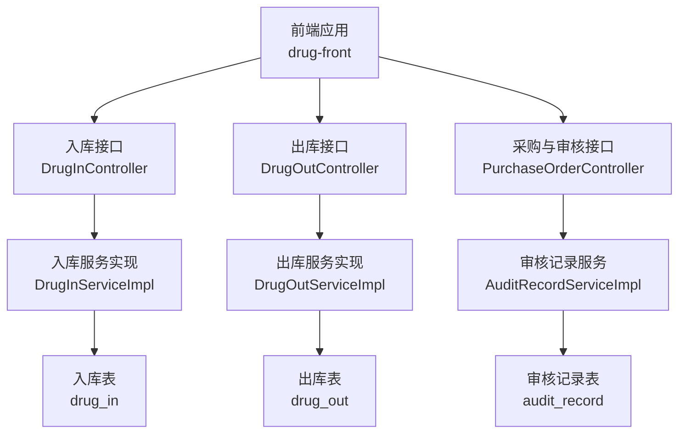

图表来源
- [DrugInController.java:12-104](file://src/main/java/com/hospital/drugmanagement/controller/DrugInController.java#L12-L104)
- [DrugOutController.java:11-103](file://src/main/java/com/hospital/drugmanagement/controller/DrugOutController.java#L11-L103)
- [PurchaseOrderController.java:26-396](file://src/main/java/com/hospital/drugmanagement/controller/PurchaseOrderController.java#L26-L396)
- [DrugInServiceImpl.java:26-116](file://src/main/java/com/hospital/drugmanagement/service/impl/DrugInServiceImpl.java#L26-L116)
- [DrugOutServiceImpl.java:26-116](file://src/main/java/com/hospital/drugmanagement/service/impl/DrugOutServiceImpl.java#L26-L116)
- [AuditRecordServiceImpl.java:13-33](file://src/main/java/com/hospital/drugmanagement/service/impl/AuditRecordServiceImpl.java#L13-L33)
- [hospital_drug.sql:38-108](file://hospital_drug.sql#L38-L108)

章节来源
- [DrugInController.java:12-104](file://src/main/java/com/hospital/drugmanagement/controller/DrugInController.java#L12-L104)
- [DrugOutController.java:11-103](file://src/main/java/com/hospital/drugmanagement/controller/DrugOutController.java#L11-L103)
- [PurchaseOrderController.java:26-396](file://src/main/java/com/hospital/drugmanagement/controller/PurchaseOrderController.java#L26-L396)
- [hospital_drug.sql:38-108](file://hospital_drug.sql#L38-L108)

## 核心组件
- 药品入库（DrugIn）：承载入库单据、批次号、单价、生产/有效期等关键字段，支持按入库单号、仓库过滤查询与分页。
- 药品出库（DrugOut）：承载出库单据、出库类型（领用/销售/报损）、单价、批次号、数量等，支持按出库类型过滤。
- 审核记录（AuditRecord）：记录采购单的各级审核结果、审核人、审核时间与审核级别，支持按订单查询并按级别与时间排序。
- 库存盘点（StockCheck）：记录盘点单据、盘点时间、状态（盘点中/已完成/已取消），支持按仓库过滤。

章节来源
- [DrugIn.java:15-62](file://src/main/java/com/hospital/drugmanagement/entity/DrugIn.java#L15-L62)
- [DrugOut.java:14-58](file://src/main/java/com/hospital/drugmanagement/entity/DrugOut.java#L14-L58)
- [AuditRecord.java:12-35](file://src/main/java/com/hospital/drugmanagement/entity/AuditRecord.java#L12-L35)
- [StockCheck.java:13-40](file://src/main/java/com/hospital/drugmanagement/entity/StockCheck.java#L13-L40)

## 架构总览
后端通过控制器暴露 REST 接口，服务层负责业务逻辑与事务控制，实体映射数据库表，前端通过统一请求工具调用接口。

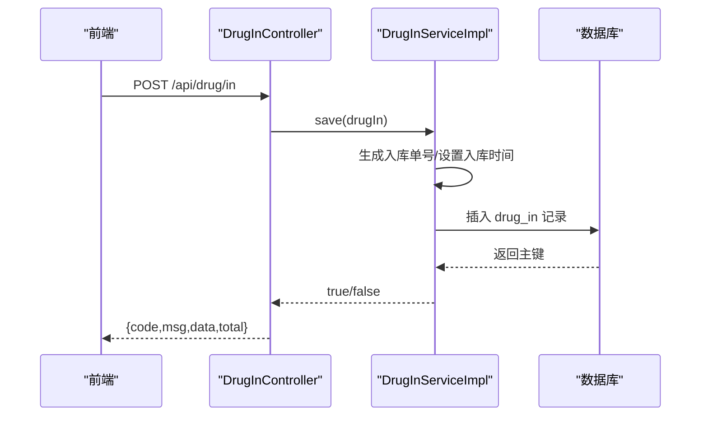

图表来源
- [DrugInController.java:66-83](file://src/main/java/com/hospital/drugmanagement/controller/DrugInController.java#L66-L83)
- [DrugInServiceImpl.java:92-116](file://src/main/java/com/hospital/drugmanagement/service/impl/DrugInServiceImpl.java#L92-L116)
- [hospital_drug.sql:38-59](file://hospital_drug.sql#L38-L59)

章节来源
- [DrugInController.java:12-104](file://src/main/java/com/hospital/drugmanagement/controller/DrugInController.java#L12-L104)
- [DrugInServiceImpl.java:26-116](file://src/main/java/com/hospital/drugmanagement/service/impl/DrugInServiceImpl.java#L26-L116)
- [hospital_drug.sql:38-59](file://hospital_drug.sql#L38-L59)

## 详细组件分析

### 药品入库（DrugIn）实体与流程
- 实体字段覆盖入库单据、批次管理、价格记录、时间戳与操作人信息，非数据库字段用于前端展示。
- 服务层在保存时自动生成入库单号并设置入库时间，预留库存更新扩展点。
- 控制器提供列表、详情、新增、删除接口，异常统一包装响应。

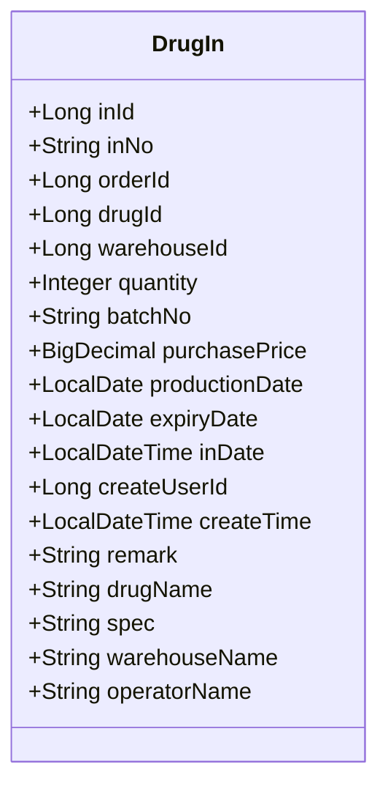

图表来源
- [DrugIn.java:15-62](file://src/main/java/com/hospital/drugmanagement/entity/DrugIn.java#L15-L62)

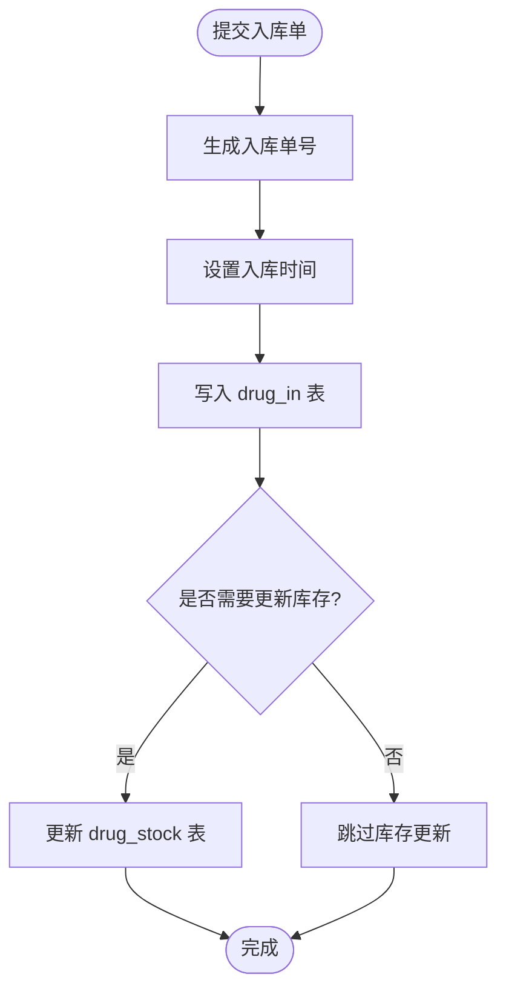

图表来源
- [DrugInServiceImpl.java:92-116](file://src/main/java/com/hospital/drugmanagement/service/impl/DrugInServiceImpl.java#L92-L116)
- [hospital_drug.sql:38-59](file://hospital_drug.sql#L38-L59)

章节来源
- [DrugIn.java:15-62](file://src/main/java/com/hospital/drugmanagement/entity/DrugIn.java#L15-L62)
- [DrugInServiceImpl.java:26-116](file://src/main/java/com/hospital/drugmanagement/service/impl/DrugInServiceImpl.java#L26-L116)
- [DrugInController.java:12-104](file://src/main/java/com/hospital/drugmanagement/controller/DrugInController.java#L12-L104)
- [drug-in 服务端接口定义:20-83](file://src/main/java/com/hospital/drugmanagement/controller/DrugInController.java#L20-L83)
- [drug-in 前端 API:1-36](file://drug-front/src/api/drugIn.js#L1-L36)
- [数据库初始化脚本（含表结构）:38-59](file://hospital_drug.sql#L38-L59)

### 药品出库（DrugOut）实体与流程
- 实体字段覆盖出库单据、出库类型、单价、批次号、数量与时间戳，支持前端展示扩展字段。
- 服务层在保存时自动生成出库单号并设置出库时间，预留库存扣减扩展点。
- 控制器提供列表、详情、新增、删除接口，异常统一包装响应。

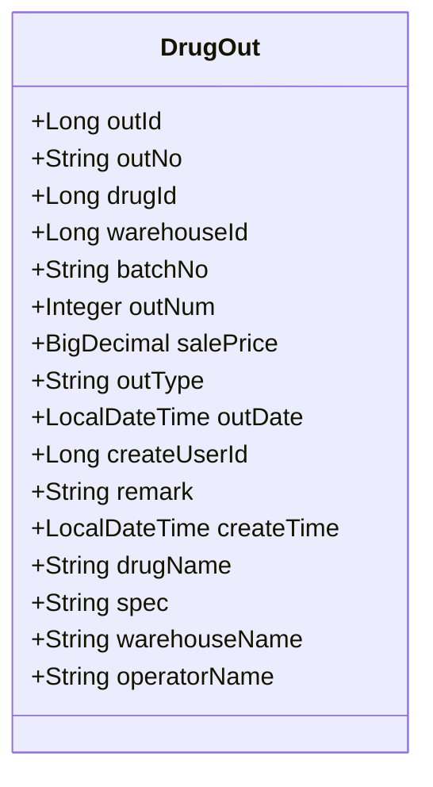

图表来源
- [DrugOut.java:14-58](file://src/main/java/com/hospital/drugmanagement/entity/DrugOut.java#L14-L58)

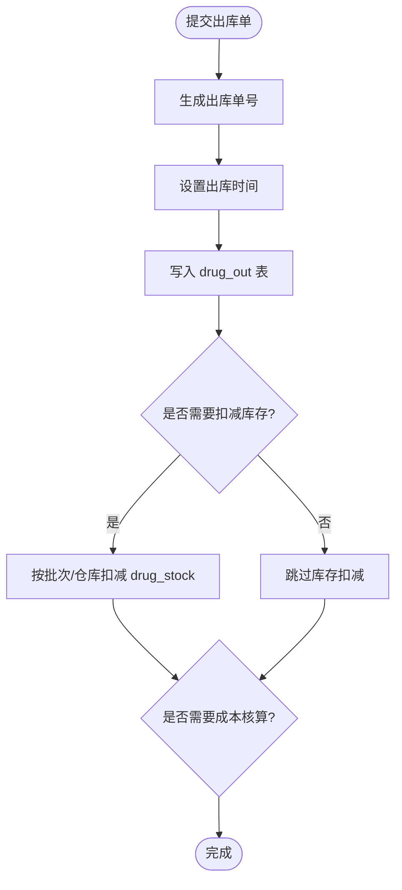

图表来源
- [DrugOutServiceImpl.java:92-116](file://src/main/java/com/hospital/drugmanagement/service/impl/DrugOutServiceImpl.java#L92-L116)
- [hospital_drug.sql:88-108](file://hospital_drug.sql#L88-L108)

章节来源
- [DrugOut.java:14-58](file://src/main/java/com/hospital/drugmanagement/entity/DrugOut.java#L14-L58)
- [DrugOutServiceImpl.java:26-116](file://src/main/java/com/hospital/drugmanagement/service/impl/DrugOutServiceImpl.java#L26-L116)
- [DrugOutController.java:11-103](file://src/main/java/com/hospital/drugmanagement/controller/DrugOutController.java#L11-L103)
- [drug-out 服务端接口定义:19-81](file://src/main/java/com/hospital/drugmanagement/controller/DrugOutController.java#L19-L81)
- [drug-out 前端 API:1-36](file://drug-front/src/api/drugOut.js#L1-L36)
- [数据库初始化脚本（含表结构）:88-108](file://hospital_drug.sql#L88-L108)

### 审核记录（AuditRecord）实体与多级审核机制
- 实体记录审核结果（通过/驳回）、审核级别（1/2/3）、审核人与时间，支持按订单查询并按级别与时间排序。
- 采购单控制器在审核时创建审核记录并更新订单状态，体现审核流程闭环。

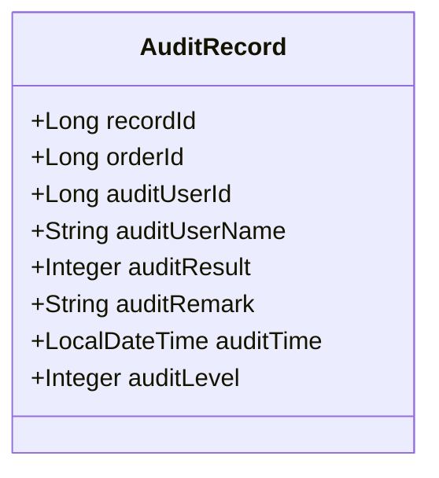

图表来源
- [AuditRecord.java:12-35](file://src/main/java/com/hospital/drugmanagement/entity/AuditRecord.java#L12-L35)

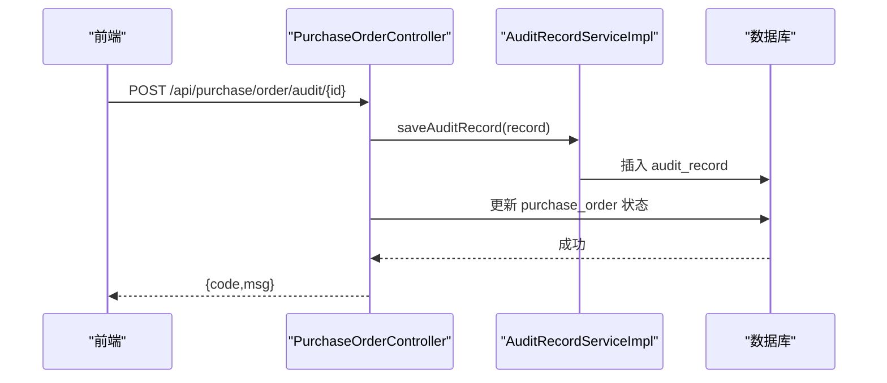

图表来源
- [PurchaseOrderController.java:278-364](file://src/main/java/com/hospital/drugmanagement/controller/PurchaseOrderController.java#L278-L364)
- [AuditRecordServiceImpl.java:13-33](file://src/main/java/com/hospital/drugmanagement/service/impl/AuditRecordServiceImpl.java#L13-L33)
- [hospital_drug.sql:21-35](file://hospital_drug.sql#L21-L35)

章节来源
- [AuditRecord.java:12-35](file://src/main/java/com/hospital/drugmanagement/entity/AuditRecord.java#L12-L35)
- [AuditRecordServiceImpl.java:13-33](file://src/main/java/com/hospital/drugmanagement/service/impl/AuditRecordServiceImpl.java#L13-L33)
- [PurchaseOrderController.java:278-364](file://src/main/java/com/hospital/drugmanagement/controller/PurchaseOrderController.java#L278-L364)
- [数据库初始化脚本（含表结构）:21-35](file://hospital_drug.sql#L21-L35)

### 库存盘点（StockCheck）实体与盘点流程
- 实体记录盘点单据、盘点时间、状态与创建人，支持按仓库过滤与状态流转。
- 服务层提供基础 CRUD 能力，可扩展盘点明细与差异处理逻辑。

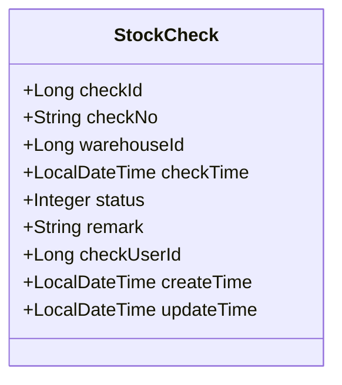

图表来源
- [StockCheck.java:13-40](file://src/main/java/com/hospital/drugmanagement/entity/StockCheck.java#L13-L40)

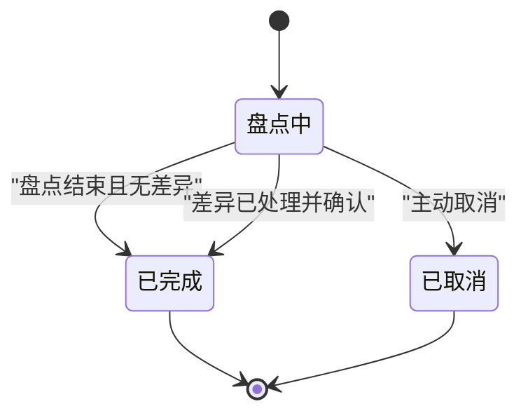

图表来源
- [StockCheck.java:25-28](file://src/main/java/com/hospital/drugmanagement/entity/StockCheck.java#L25-L28)
- [StockCheckServiceImpl.java:9-11](file://src/main/java/com/hospital/drugmanagement/service/impl/StockCheckServiceImpl.java#L9-L11)

章节来源
- [StockCheck.java:13-40](file://src/main/java/com/hospital/drugmanagement/entity/StockCheck.java#L13-L40)
- [StockCheckServiceImpl.java:9-11](file://src/main/java/com/hospital/drugmanagement/service/impl/StockCheckServiceImpl.java#L9-L11)
- [数据库初始化脚本（含表结构）:167-183](file://hospital_drug.sql#L167-L183)

## 依赖分析
- 控制器依赖对应的服务实现，服务实现依赖 Mapper 与相关实体。
- 审核记录与采购单紧密耦合，体现审核流程的完整性。
- 入库/出库与库存表存在潜在的业务耦合点（库存更新/扣减），当前服务层预留扩展点。

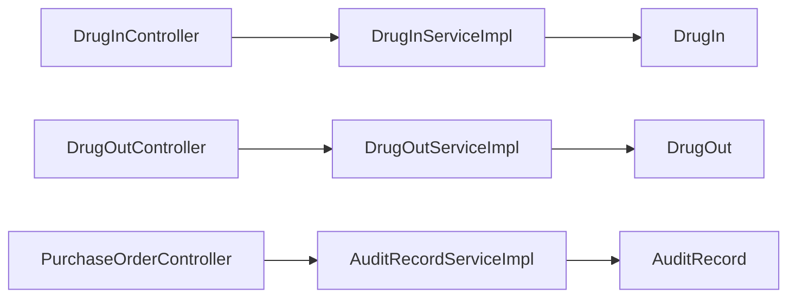

图表来源
- [DrugInController.java:12-104](file://src/main/java/com/hospital/drugmanagement/controller/DrugInController.java#L12-L104)
- [DrugOutController.java:11-103](file://src/main/java/com/hospital/drugmanagement/controller/DrugOutController.java#L11-L103)
- [PurchaseOrderController.java:26-396](file://src/main/java/com/hospital/drugmanagement/controller/PurchaseOrderController.java#L26-L396)
- [DrugInServiceImpl.java:26-116](file://src/main/java/com/hospital/drugmanagement/service/impl/DrugInServiceImpl.java#L26-L116)
- [DrugOutServiceImpl.java:26-116](file://src/main/java/com/hospital/drugmanagement/service/impl/DrugOutServiceImpl.java#L26-L116)
- [AuditRecordServiceImpl.java:13-33](file://src/main/java/com/hospital/drugmanagement/service/impl/AuditRecordServiceImpl.java#L13-L33)

章节来源
- [DrugInController.java:12-104](file://src/main/java/com/hospital/drugmanagement/controller/DrugInController.java#L12-L104)
- [DrugOutController.java:11-103](file://src/main/java/com/hospital/drugmanagement/controller/DrugOutController.java#L11-L103)
- [PurchaseOrderController.java:26-396](file://src/main/java/com/hospital/drugmanagement/controller/PurchaseOrderController.java#L26-L396)

## 性能考虑
- 查询优化：实体与服务层均提供按关键字段（如单号、类型、仓库）的过滤与排序，建议结合数据库索引提升分页查询性能。
- 事务边界：入库/出库保存方法标注事务，确保单据落库的一致性；库存更新建议在同一事务内完成，避免脏读或不一致。
- 扩展点：服务层预留库存更新与成本核算扩展点，应优先使用批量更新与原子操作减少锁竞争。

## 故障排查指南
- 入库/出库保存失败：检查服务层异常捕获与控制器响应封装，确认单据号生成与时间设置逻辑。
- 审核失败：检查用户权限校验与订单状态判断，确认审核记录插入与订单状态更新顺序。
- 前端调用异常：核对前端 API 方法与后端接口路径一致，确认跨域配置与参数传递。

章节来源
- [DrugInController.java:20-102](file://src/main/java/com/hospital/drugmanagement/controller/DrugInController.java#L20-L102)
- [DrugOutController.java:19-101](file://src/main/java/com/hospital/drugmanagement/controller/DrugOutController.java#L19-L101)
- [PurchaseOrderController.java:278-364](file://src/main/java/com/hospital/drugmanagement/controller/PurchaseOrderController.java#L278-L364)
- [drug-in 前端 API:1-36](file://drug-front/src/api/drugIn.js#L1-L36)
- [drug-out 前端 API:1-36](file://drug-front/src/api/drugOut.js#L1-L36)
- [采购单前端 API:1-63](file://drug-front/src/api/purchase.js#L1-L63)

## 结论
本文档基于实体定义、服务层逻辑与数据库表结构，系统化阐述了药品入库、出库、审核与盘点四个核心业务实体的设计要点与流程控制。通过状态机与流程图明确了关键状态与转换条件，结合接口与前端调用路径，提供了可落地的实现参考与扩展方向。

## 附录
- 数据库表结构概览（节选）
  - 入库表（drug_in）：包含入库单号唯一索引、药品与仓库索引，支撑高效查询与去重。
  - 出库表（drug_out）：包含出库单号唯一索引、药品与仓库索引，支撑按单据与仓库检索。
  - 审核记录表（audit_record）：按订单建立索引，支持按级别与时间排序查询。
  - 盘点表（stock_check）：包含盘点单号唯一索引与仓库索引，支撑按仓库与状态筛选。

章节来源
- [数据库初始化脚本（含表结构）:38-183](file://hospital_drug.sql#L38-L183)