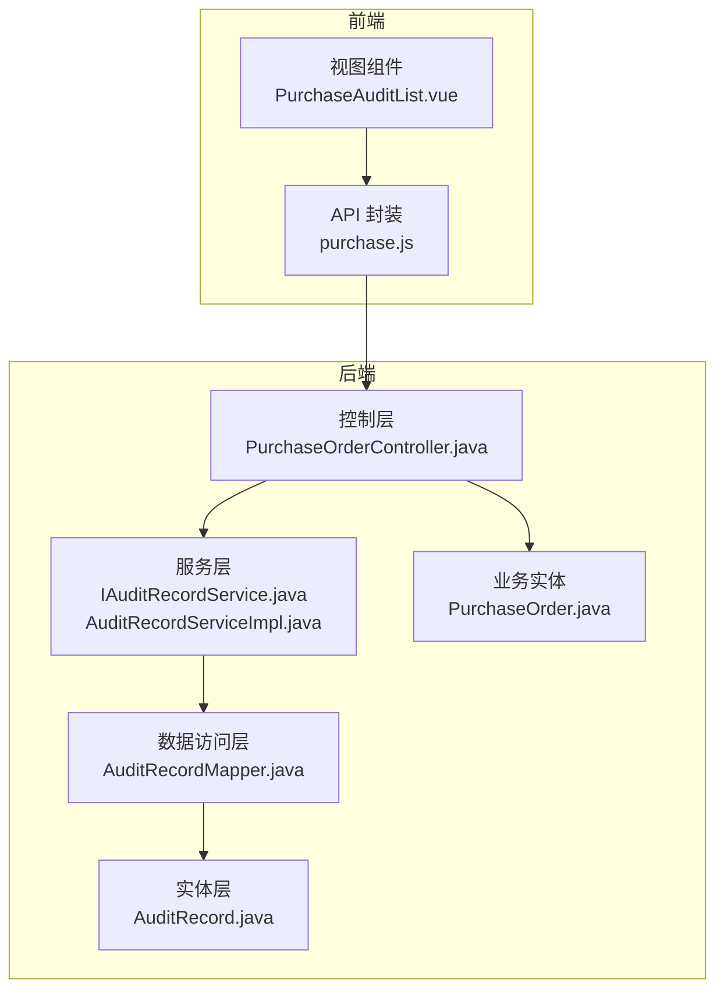
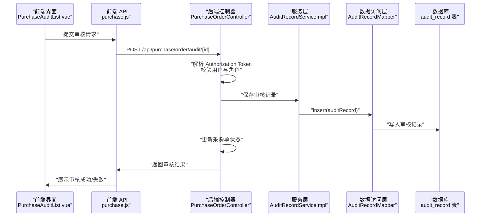
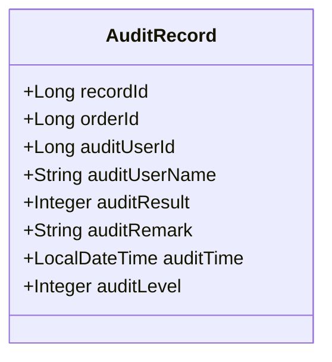
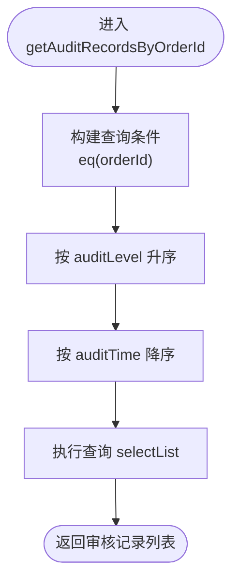
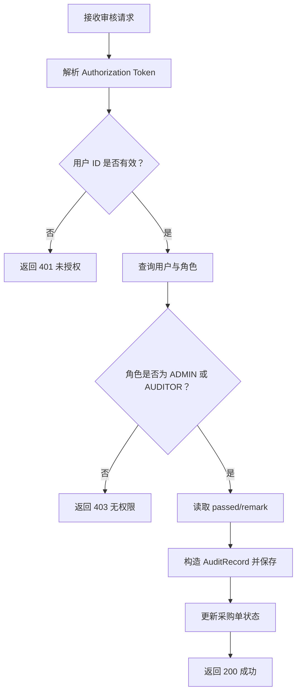
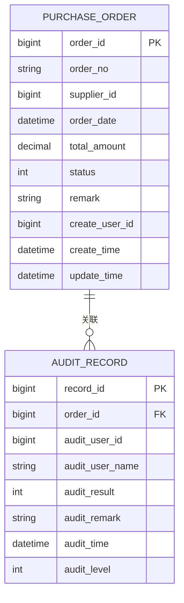
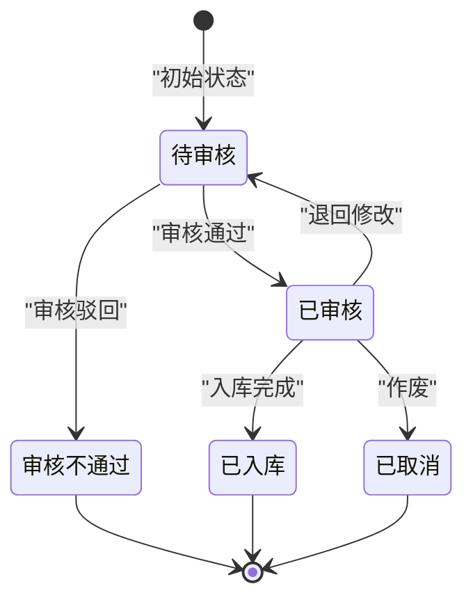
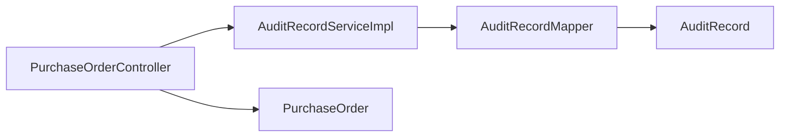

# 审核记录实体

<cite>
**本文引用的文件**
- [AuditRecord.java](file://src/main/java/com/hospital/drugmanagement/entity/AuditRecord.java)
- [AuditRecordMapper.java](file://src/main/java/com/hospital/drugmanagement/mapper/AuditRecordMapper.java)
- [IAuditRecordService.java](file://src/main/java/com/hospital/drugmanagement/service/IAuditRecordService.java)
- [AuditRecordServiceImpl.java](file://src/main/java/com/hospital/drugmanagement/service/impl/AuditRecordServiceImpl.java)
- [PurchaseOrderController.java](file://src/main/java/com/hospital/drugmanagement/controller/PurchaseOrderController.java)
- [PurchaseOrder.java](file://src/main/java/com/hospital/drugmanagement/entity/PurchaseOrder.java)
- [PurchaseAuditList.vue](file://drug-front/src/views/purchase/PurchaseAuditList.vue)
- [purchase.js](file://drug-front/src/api/purchase.js)
- [hospital_drug.sql](file://hospital_drug.sql)
- [init.sql](file://src/main/resources/db/init.sql)
- [FillTypeEnum.java](file://src/main/java/com/hospital/drugmanagement/common/constant/FillTypeEnum.java)
</cite>

## 目录
1. [简介](#简介)
2. [项目结构](#项目结构)
3. [核心组件](#核心组件)
4. [架构概览](#架构概览)
5. [详细组件分析](#详细组件分析)
6. [依赖分析](#依赖分析)
7. [性能考虑](#性能考虑)
8. [故障排查指南](#故障排查指南)
9. [结论](#结论)
10. [附录](#附录)

## 简介
本文档围绕审核记录实体（AuditRecord）进行深入分析，涵盖多级审核机制的设计架构、审核状态流转、审批权限控制、审核意见管理、与业务流程的关联方式、状态机设计、时间轴追踪、审核责任划分、审批时效控制以及异常处理机制。同时提供审核流程图、状态转换矩阵、权限控制模型和实际审核场景示例，帮助读者全面理解系统的审核能力与实现细节。

## 项目结构
后端采用 Spring Boot + MyBatis-Plus 架构，前端使用 Vue 3 + Element Plus。审核记录实体位于后端实体层，服务层负责查询与持久化，控制器负责对外接口与权限校验，前端负责展示与交互。

图表来源
- [AuditRecord.java:12-34](file://src/main/java/com/hospital/drugmanagement/entity/AuditRecord.java#L12-L34)
- [AuditRecordMapper.java:1-8](file://src/main/java/com/hospital/drugmanagement/mapper/AuditRecordMapper.java#L1-L8)
- [IAuditRecordService.java:1-24](file://src/main/java/com/hospital/drugmanagement/service/IAuditRecordService.java#L1-L24)
- [AuditRecordServiceImpl.java:1-33](file://src/main/java/com/hospital/drugmanagement/service/impl/AuditRecordServiceImpl.java#L1-L33)
- [PurchaseOrderController.java:278-364](file://src/main/java/com/hospital/drugmanagement/controller/PurchaseOrderController.java#L278-L364)
- [PurchaseOrder.java:14-40](file://src/main/java/com/hospital/drugmanagement/entity/PurchaseOrder.java#L14-L40)
- [PurchaseAuditList.vue:1-341](file://drug-front/src/views/purchase/PurchaseAuditList.vue#L1-L341)
- [purchase.js:1-63](file://drug-front/src/api/purchase.js#L1-L63)

章节来源
- [AuditRecord.java:12-34](file://src/main/java/com/hospital/drugmanagement/entity/AuditRecord.java#L12-L34)
- [AuditRecordMapper.java:1-8](file://src/main/java/com/hospital/drugmanagement/mapper/AuditRecordMapper.java#L1-L8)
- [IAuditRecordService.java:1-24](file://src/main/java/com/hospital/drugmanagement/service/IAuditRecordService.java#L1-L24)
- [AuditRecordServiceImpl.java:1-33](file://src/main/java/com/hospital/drugmanagement/service/impl/AuditRecordServiceImpl.java#L1-L33)
- [PurchaseOrderController.java:278-364](file://src/main/java/com/hospital/drugmanagement/controller/PurchaseOrderController.java#L278-L364)
- [PurchaseOrder.java:14-40](file://src/main/java/com/hospital/drugmanagement/entity/PurchaseOrder.java#L14-L40)
- [PurchaseAuditList.vue:1-341](file://drug-front/src/views/purchase/PurchaseAuditList.vue#L1-L341)
- [purchase.js:1-63](file://drug-front/src/api/purchase.js#L1-L63)

## 核心组件
- 审核记录实体（AuditRecord）：承载一次审核的关键信息，包括关联采购单、审核人、审核结果、审核意见、审核时间与审核级别。
- 审核记录 Mapper：基于 MyBatis-Plus 的基础映射接口，提供对审计记录表的 CRUD 能力。
- 审核记录服务接口与实现：提供按采购单查询审核记录列表、保存审核记录等能力，并按审核级别与时间排序。
- 采购订单控制器：对外提供审核接口，执行权限校验、保存审核记录、更新采购单状态。
- 采购订单实体：定义采购单状态字段，用于与审核流程联动。
- 前端视图与 API：展示待审核列表、详情与审核记录，调用后端审核接口。

章节来源
- [AuditRecord.java:12-34](file://src/main/java/com/hospital/drugmanagement/entity/AuditRecord.java#L12-L34)
- [AuditRecordMapper.java:1-8](file://src/main/java/com/hospital/drugmanagement/mapper/AuditRecordMapper.java#L1-L8)
- [IAuditRecordService.java:1-24](file://src/main/java/com/hospital/drugmanagement/service/IAuditRecordService.java#L1-L24)
- [AuditRecordServiceImpl.java:19-31](file://src/main/java/com/hospital/drugmanagement/service/impl/AuditRecordServiceImpl.java#L19-L31)
- [PurchaseOrderController.java:278-364](file://src/main/java/com/hospital/drugmanagement/controller/PurchaseOrderController.java#L278-L364)
- [PurchaseOrder.java:29](file://src/main/java/com/hospital/drugmanagement/entity/PurchaseOrder.java#L29)

## 架构概览
审核流程贯穿前后端：前端发起审核请求，后端控制器进行权限校验与业务处理，保存审核记录并更新采购单状态，最终返回结果给前端展示。

图表来源
- [PurchaseAuditList.vue:298-315](file://drug-front/src/views/purchase/PurchaseAuditList.vue#L298-L315)
- [purchase.js:46-53](file://drug-front/src/api/purchase.js#L46-L53)
- [PurchaseOrderController.java:278-364](file://src/main/java/com/hospital/drugmanagement/controller/PurchaseOrderController.java#L278-L364)
- [AuditRecordServiceImpl.java:28-31](file://src/main/java/com/hospital/drugmanagement/service/impl/AuditRecordServiceImpl.java#L28-L31)
- [AuditRecordMapper.java:1-8](file://src/main/java/com/hospital/drugmanagement/mapper/AuditRecordMapper.java#L1-L8)
- [hospital_drug.sql:226-238](file://hospital_drug.sql#L226-L238)

## 详细组件分析

### 审核记录实体（AuditRecord）
- 字段设计
  - recordId：审核记录主键
  - orderId：关联采购单 ID
  - auditUserId / auditUserName：审核人标识与姓名
  - auditResult：审核结果（1 通过 / 2 驳回）
  - auditRemark：审核意见
  - auditTime：审核时间（自动填充创建时间）
  - auditLevel：审核级别（1 一级 / 2 二级 / 3 三级）
- 自动填充
  - auditTime 使用统一的创建时间自动填充策略，确保记录生成时的时间一致性。

图表来源
- [AuditRecord.java:12-34](file://src/main/java/com/hospital/drugmanagement/entity/AuditRecord.java#L12-L34)
- [FillTypeEnum.java:6-8](file://src/main/java/com/hospital/drugmanagement/common/constant/FillTypeEnum.java#L6-L8)

章节来源
- [AuditRecord.java:12-34](file://src/main/java/com/hospital/drugmanagement/entity/AuditRecord.java#L12-L34)
- [FillTypeEnum.java:6-8](file://src/main/java/com/hospital/drugmanagement/common/constant/FillTypeEnum.java#L6-L8)

### 审核记录服务层
- 查询接口：按采购单 ID 查询审核记录，按审核级别升序、审核时间降序排列，保证多级审核顺序与最新记录优先。
- 保存接口：调用 Mapper 插入审核记录，返回保存结果。

图表来源
- [AuditRecordServiceImpl.java:19-26](file://src/main/java/com/hospital/drugmanagement/service/impl/AuditRecordServiceImpl.java#L19-L26)

章节来源
- [IAuditRecordService.java:10-22](file://src/main/java/com/hospital/drugmanagement/service/IAuditRecordService.java#L10-L22)
- [AuditRecordServiceImpl.java:19-31](file://src/main/java/com/hospital/drugmanagement/service/impl/AuditRecordServiceImpl.java#L19-L31)

### 审核记录数据访问层
- 继承 MyBatis-Plus 基础 Mapper 接口，提供对 audit_record 表的通用 CRUD 能力。
- 数据库层面建立 orderId 索引，优化按采购单查询审核记录的性能。

章节来源
- [AuditRecordMapper.java:1-8](file://src/main/java/com/hospital/drugmanagement/mapper/AuditRecordMapper.java#L1-L8)
- [hospital_drug.sql:34](file://hospital_drug.sql#L34)
- [init.sql:237](file://src/main/resources/db/init.sql#L237)

### 审核流程与权限控制
- 权限模型
  - 控制器从 Authorization 请求头中解析用户 ID；若为空或格式错误，直接拒绝。
  - 通过用户 ID 获取用户与角色，仅允许 ADMIN 或 AUDITOR 角色执行审核。
- 审核动作
  - 读取 passed 与 remark 参数，构造 AuditRecord 并保存。
  - 更新采购单状态：通过则置为“已审核”，驳回则置为“审核不通过”。

图表来源
- [PurchaseOrderController.java:278-364](file://src/main/java/com/hospital/drugmanagement/controller/PurchaseOrderController.java#L278-L364)
- [PurchaseAuditList.vue:298-315](file://drug-front/src/views/purchase/PurchaseAuditList.vue#L298-L315)
- [purchase.js:46-53](file://drug-front/src/api/purchase.js#L46-L53)

章节来源
- [PurchaseOrderController.java:278-364](file://src/main/java/com/hospital/drugmanagement/controller/PurchaseOrderController.java#L278-L364)

### 与业务流程的关联
- 审核记录与采购单的关联：AuditRecord.orderId 指向 PurchaseOrder.orderId，形成一对一到多对一的关系。
- 状态机设计：采购单状态在审核流程中发生转移，支持多级审核扩展。
- 时间轴追踪：按 auditLevel 升序、auditTime 降序排列，清晰呈现审核历史。

图表来源
- [PurchaseOrder.java:18-40](file://src/main/java/com/hospital/drugmanagement/entity/PurchaseOrder.java#L18-L40)
- [AuditRecord.java:17-34](file://src/main/java/com/hospital/drugmanagement/entity/AuditRecord.java#L17-L34)
- [hospital_drug.sql:133-147](file://hospital_drug.sql#L133-L147)
- [hospital_drug.sql:228-238](file://hospital_drug.sql#L228-L238)

章节来源
- [PurchaseOrder.java:18-40](file://src/main/java/com/hospital/drugmanagement/entity/PurchaseOrder.java#L18-L40)
- [AuditRecord.java:17-34](file://src/main/java/com/hospital/drugmanagement/entity/AuditRecord.java#L17-L34)

### 审核状态转换矩阵
- 采购单状态定义
  - 0 待审核
  - 1 已审核
  - 2 已入库
  - 3 已取消
  - 4 审核不通过
- 审核触发后的状态变化
  - 通过：0 -> 1
  - 驳回：0 -> 4

图表来源
- [PurchaseOrder.java:29](file://src/main/java/com/hospital/drugmanagement/entity/PurchaseOrder.java#L29)
- [PurchaseOrderController.java:343-348](file://src/main/java/com/hospital/drugmanagement/controller/PurchaseOrderController.java#L343-L348)

章节来源
- [PurchaseOrder.java:29](file://src/main/java/com/hospital/drugmanagement/entity/PurchaseOrder.java#L29)
- [PurchaseOrderController.java:343-348](file://src/main/java/com/hospital/drugmanagement/controller/PurchaseOrderController.java#L343-L348)

### 审核意见管理
- 前端提供审核意见输入框，支持文本域输入。
- 后端将审核意见写入 auditRemark 字段，便于后续追溯与审计。

章节来源
- [PurchaseAuditList.vue:152-159](file://drug-front/src/views/purchase/PurchaseAuditList.vue#L152-L159)
- [AuditRecord.java:28](file://src/main/java/com/hospital/drugmanagement/entity/AuditRecord.java#L28)

### 多级审核机制设计
- 审核级别字段：auditLevel 支持 1、2、3 级别，便于扩展多级审核。
- 查询排序：按 auditLevel 升序、auditTime 降序，确保多级审核顺序与最新记录优先。
- 实际实现：当前示例默认设置为 1 级审核，后续可扩展为 2、3 级审核链路。

章节来源
- [AuditRecord.java:33](file://src/main/java/com/hospital/drugmanagement/entity/AuditRecord.java#L33)
- [AuditRecordServiceImpl.java:22-25](file://src/main/java/com/hospital/drugmanagement/service/impl/AuditRecordServiceImpl.java#L22-L25)
- [PurchaseOrderController.java:339](file://src/main/java/com/hospital/drugmanagement/controller/PurchaseOrderController.java#L339)

### 审核责任划分与审批时效控制
- 责任划分：通过 auditUserId 与 auditUserName 明确审核责任人，结合 auditTime 形成完整时间轴。
- 时效控制：当前实现未内置超时检查，可在控制器或服务层增加定时任务或前置校验以限制审核时效。

章节来源
- [AuditRecord.java:22-31](file://src/main/java/com/hospital/drugmanagement/entity/AuditRecord.java#L22-L31)
- [PurchaseOrderController.java:278-364](file://src/main/java/com/hospital/drugmanagement/controller/PurchaseOrderController.java#L278-L364)

### 异常处理机制
- 前端：捕获审核失败的错误消息并提示用户。
- 后端：统一捕获异常，返回标准响应码与错误信息，避免泄露内部细节。

章节来源
- [PurchaseAuditList.vue:298-315](file://drug-front/src/views/purchase/PurchaseAuditList.vue#L298-L315)
- [PurchaseOrderController.java:358-362](file://src/main/java/com/hospital/drugmanagement/controller/PurchaseOrderController.java#L358-L362)

## 依赖分析
- 组件耦合
  - 控制器依赖服务层与用户/角色查询能力，服务层依赖 Mapper，Mapper 依赖实体。
- 外部依赖
  - MyBatis-Plus 提供 ORM 能力与自动填充注解。
  - Element Plus 与 Vue 3 提供前端展示与交互。

图表来源
- [PurchaseOrderController.java:13-47](file://src/main/java/com/hospital/drugmanagement/controller/PurchaseOrderController.java#L13-L47)
- [AuditRecordServiceImpl.java:13-17](file://src/main/java/com/hospital/drugmanagement/service/impl/AuditRecordServiceImpl.java#L13-L17)
- [AuditRecordMapper.java:1-8](file://src/main/java/com/hospital/drugmanagement/mapper/AuditRecordMapper.java#L1-L8)
- [AuditRecord.java:12-34](file://src/main/java/com/hospital/drugmanagement/entity/AuditRecord.java#L12-L34)
- [PurchaseOrder.java:14-40](file://src/main/java/com/hospital/drugmanagement/entity/PurchaseOrder.java#L14-L40)

章节来源
- [PurchaseOrderController.java:13-47](file://src/main/java/com/hospital/drugmanagement/controller/PurchaseOrderController.java#L13-L47)
- [AuditRecordServiceImpl.java:13-17](file://src/main/java/com/hospital/drugmanagement/service/impl/AuditRecordServiceImpl.java#L13-L17)
- [AuditRecordMapper.java:1-8](file://src/main/java/com/hospital/drugmanagement/mapper/AuditRecordMapper.java#L1-L8)
- [AuditRecord.java:12-34](file://src/main/java/com/hospital/drugmanagement/entity/AuditRecord.java#L12-L34)
- [PurchaseOrder.java:14-40](file://src/main/java/com/hospital/drugmanagement/entity/PurchaseOrder.java#L14-L40)

## 性能考虑
- 查询优化：数据库为 orderId 建立索引，服务层按 auditLevel 升序、auditTime 降序排序，减少不必要的全表扫描。
- 批量查询：建议在前端分页加载与后端分页查询配合，避免一次性加载过多审核记录。
- 自动填充：auditTime 使用数据库默认值与注解自动填充，减少 Java 层时间计算开销。

章节来源
- [hospital_drug.sql:34](file://hospital_drug.sql#L34)
- [AuditRecordServiceImpl.java:22-25](file://src/main/java/com/hospital/drugmanagement/service/impl/AuditRecordServiceImpl.java#L22-L25)
- [FillTypeEnum.java:6-8](file://src/main/java/com/hospital/drugmanagement/common/constant/FillTypeEnum.java#L6-L8)

## 故障排查指南
- 审核失败
  - 检查 Authorization 头是否正确传递，Token 格式是否符合预期。
  - 确认用户是否存在且角色为 ADMIN 或 AUDITOR。
  - 查看后端日志中的异常堆栈，定位具体问题。
- 审核记录缺失
  - 确认 orderId 是否正确传入，数据库中是否存在对应记录。
  - 检查排序逻辑是否影响了前端展示顺序。
- 前端显示异常
  - 检查 API 返回的数据结构与前端绑定字段是否一致。
  - 确认网络请求是否成功，跨域配置是否正确。

章节来源
- [PurchaseOrderController.java:282-323](file://src/main/java/com/hospital/drugmanagement/controller/PurchaseOrderController.java#L282-L323)
- [PurchaseAuditList.vue:298-315](file://drug-front/src/views/purchase/PurchaseAuditList.vue#L298-L315)

## 结论
AuditRecord 实体提供了完整的审核记录能力，结合服务层的查询与保存、控制器的权限校验与状态更新，形成了清晰的审核流程闭环。当前实现支持多级审核级别的扩展与时间轴追踪，权限控制模型明确，异常处理机制完善。建议后续增强审批时效控制与多级审核链路的自动化推进逻辑，进一步提升系统的合规性与可用性。

## 附录
- 数据库初始化脚本与表结构定义
  - 审核记录表：包含 record_id、order_id、audit_user_id、audit_user_name、audit_result、audit_remark、audit_time、audit_level 等字段。
  - 采购订单表：包含 order_id、order_no、supplier_id、order_date、total_amount、status、remark、create_user_id、create_time、update_time 等字段。

章节来源
- [hospital_drug.sql:226-238](file://hospital_drug.sql#L226-L238)
- [hospital_drug.sql:133-147](file://hospital_drug.sql#L133-L147)
- [init.sql:226-238](file://src/main/resources/db/init.sql#L226-L238)
- [init.sql:128-141](file://src/main/resources/db/init.sql#L128-L141)