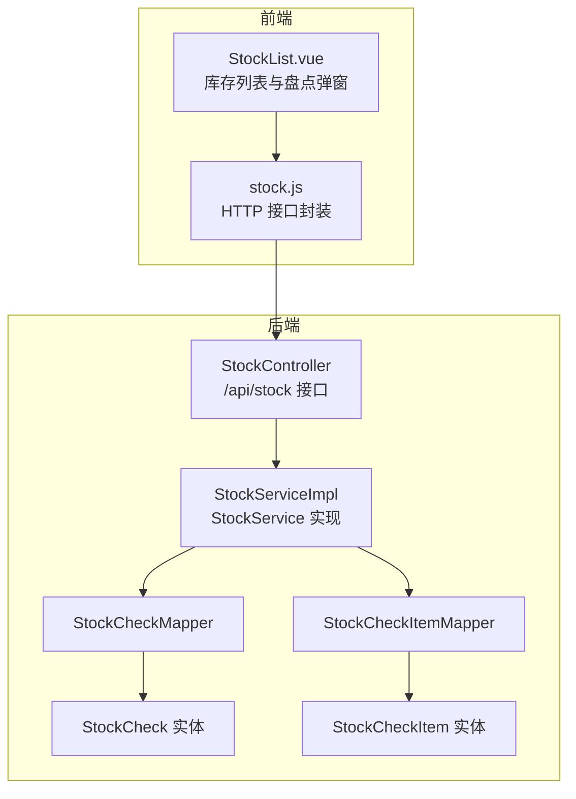
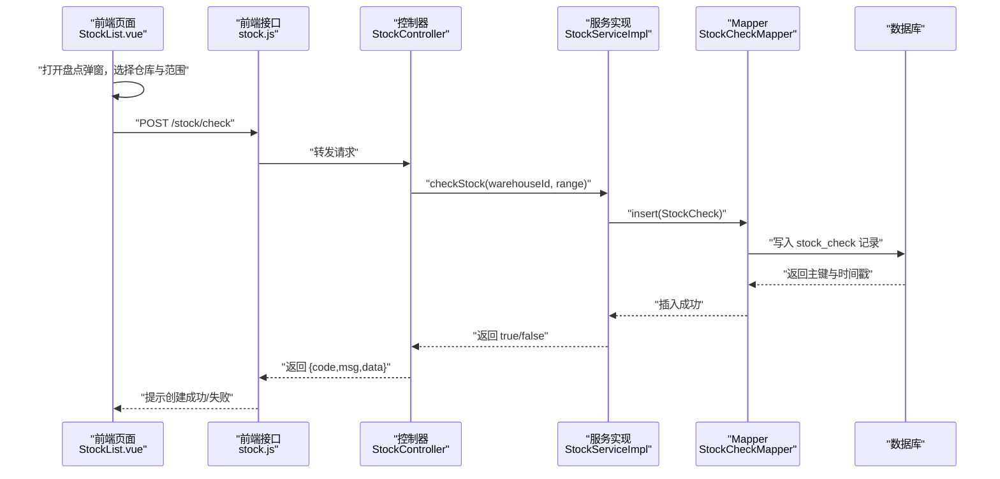
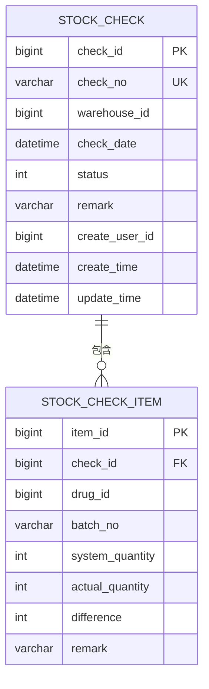
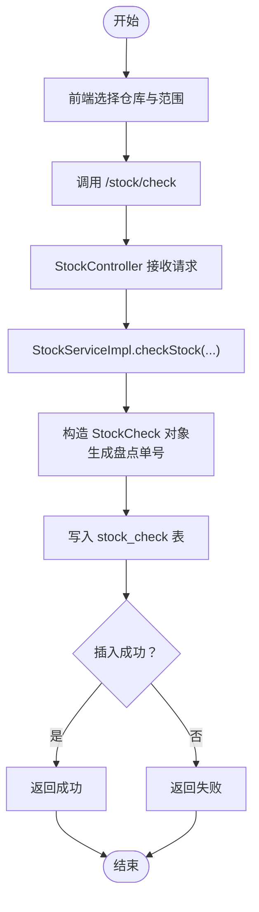
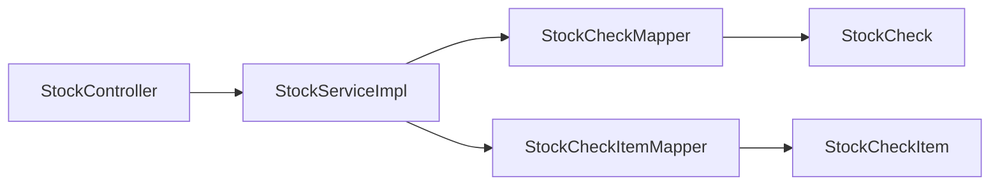

# 库存盘点实体

<cite>
**本文引用的文件**
- [StockCheck.java](file://src/main/java/com/hospital/drugmanagement/entity/StockCheck.java)
- [StockCheckItem.java](file://src/main/java/com/hospital/drugmanagement/entity/StockCheckItem.java)
- [StockCheckMapper.java](file://src/main/java/com/hospital/drugmanagement/mapper/StockCheckMapper.java)
- [StockCheckItemMapper.java](file://src/main/java/com/hospital/drugmanagement/mapper/StockCheckItemMapper.java)
- [IStockCheckService.java](file://src/main/java/com/hospital/drugmanagement/service/IStockCheckService.java)
- [StockCheckServiceImpl.java](file://src/main/java/com/hospital/drugmanagement/service/impl/StockCheckServiceImpl.java)
- [IStockCheckItemService.java](file://src/main/java/com/hospital/drugmanagement/service/IStockCheckItemService.java)
- [StockCheckItemServiceImpl.java](file://src/main/java/com/hospital/drugmanagement/service/impl/StockCheckItemServiceImpl.java)
- [StockService.java](file://src/main/java/com/hospital/drugmanagement/service/StockService.java)
- [StockServiceImpl.java](file://src/main/java/com/hospital/drugmanagement/service/impl/StockServiceImpl.java)
- [StockController.java](file://src/main/java/com/hospital/drugmanagement/controller/StockController.java)
- [init.sql](file://src/main/resources/db/init.sql)
- [StockList.vue](file://drug-front/src/views/stock/StockList.vue)
- [stock.js](file://drug-front/src/api/stock.js)
</cite>

## 目录
1. [简介](#简介)
2. [项目结构](#项目结构)
3. [核心组件](#核心组件)
4. [架构概览](#架构概览)
5. [详细组件分析](#详细组件分析)
6. [依赖分析](#依赖分析)
7. [性能考虑](#性能考虑)
8. [故障排查指南](#故障排查指南)
9. [结论](#结论)
10. [附录](#附录)

## 简介
本文围绕库存盘点实体(StockCheck)及其相关实体与服务，系统梳理从“盘点计划制定、执行监控、差异分析处理、结果确认”的全流程设计。重点阐述：
- 盘点数据的准确性保证机制与异常处理策略
- 盘点状态管理与多仓库协调
- 批量处理能力与扩展性
- 盘点流程图、差异处理方案、质量控制措施
- 实际盘点操作示例与前后端交互

## 项目结构
后端采用分层架构：Controller -> Service -> Mapper -> Entity；前端基于 Vue + Element Plus 的库存管理界面，提供“库存盘点”入口与交互。

图表来源
- [StockController.java:1-114](file://src/main/java/com/hospital/drugmanagement/controller/StockController.java#L1-L114)
- [StockServiceImpl.java:1-241](file://src/main/java/com/hospital/drugmanagement/service/impl/StockServiceImpl.java#L1-L241)
- [StockCheck.java:1-40](file://src/main/java/com/hospital/drugmanagement/entity/StockCheck.java#L1-L40)
- [StockCheckItem.java:1-31](file://src/main/java/com/hospital/drugmanagement/entity/StockCheckItem.java#L1-L31)
- [StockCheckMapper.java:1-7](file://src/main/java/com/hospital/drugmanagement/mapper/StockCheckMapper.java#L1-L7)
- [StockCheckItemMapper.java:1-7](file://src/main/java/com/hospital/drugmanagement/mapper/StockCheckItemMapper.java#L1-L7)
- [StockList.vue:1-262](file://drug-front/src/views/stock/StockList.vue#L1-L262)
- [stock.js:1-37](file://drug-front/src/api/stock.js#L1-L37)

章节来源
- [StockController.java:1-114](file://src/main/java/com/hospital/drugmanagement/controller/StockController.java#L1-L114)
- [StockServiceImpl.java:1-241](file://src/main/java/com/hospital/drugmanagement/service/impl/StockServiceImpl.java#L1-L241)
- [StockCheck.java:1-40](file://src/main/java/com/hospital/drugmanagement/entity/StockCheck.java#L1-L40)
- [StockCheckItem.java:1-31](file://src/main/java/com/hospital/drugmanagement/entity/StockCheckItem.java#L1-L31)
- [StockCheckMapper.java:1-7](file://src/main/java/com/hospital/drugmanagement/mapper/StockCheckMapper.java#L1-L7)
- [StockCheckItemMapper.java:1-7](file://src/main/java/com/hospital/drugmanagement/mapper/StockCheckItemMapper.java#L1-L7)
- [StockList.vue:1-262](file://drug-front/src/views/stock/StockList.vue#L1-L262)
- [stock.js:1-37](file://drug-front/src/api/stock.js#L1-L37)

## 核心组件
- 实体层
  - StockCheck：盘点单主表，包含盘点单号、仓库、盘点时间、状态、创建人等字段
  - StockCheckItem：盘点单明细，包含药品、系统数量、实际数量、差异数量、处理方式与备注
- 数据访问层
  - StockCheckMapper、StockCheckItemMapper：MyBatis-Plus 基础映射接口
- 服务层
  - IStockCheckService、StockCheckServiceImpl：盘点单服务接口与实现
  - IStockCheckItemService、StockCheckItemServiceImpl：盘点明细服务接口与实现
  - StockService、StockServiceImpl：库存服务，包含 checkStock(创建盘点单) 等方法
- 控制器层
  - StockController：对外暴露 /api/stock/check 接口，触发盘点流程
- 前端
  - StockList.vue：展示库存、触发盘点弹窗、提交盘点请求
  - stock.js：封装 /stock/check 请求

章节来源
- [StockCheck.java:1-40](file://src/main/java/com/hospital/drugmanagement/entity/StockCheck.java#L1-L40)
- [StockCheckItem.java:1-31](file://src/main/java/com/hospital/drugmanagement/entity/StockCheckItem.java#L1-L31)
- [StockCheckMapper.java:1-7](file://src/main/java/com/hospital/drugmanagement/mapper/StockCheckMapper.java#L1-L7)
- [StockCheckItemMapper.java:1-7](file://src/main/java/com/hospital/drugmanagement/mapper/StockCheckItemMapper.java#L1-L7)
- [IStockCheckService.java:1-7](file://src/main/java/com/hospital/drugmanagement/service/IStockCheckService.java#L1-L7)
- [StockCheckServiceImpl.java:1-11](file://src/main/java/com/hospital/drugmanagement/service/impl/StockCheckServiceImpl.java#L1-L11)
- [IStockCheckItemService.java:1-7](file://src/main/java/com/hospital/drugmanagement/service/IStockCheckItemService.java#L1-L7)
- [StockCheckItemServiceImpl.java:1-11](file://src/main/java/com/hospital/drugmanagement/service/impl/StockCheckItemServiceImpl.java#L1-L11)
- [StockService.java:1-59](file://src/main/java/com/hospital/drugmanagement/service/StockService.java#L1-L59)
- [StockServiceImpl.java:89-113](file://src/main/java/com/hospital/drugmanagement/service/impl/StockServiceImpl.java#L89-L113)
- [StockController.java:95-112](file://src/main/java/com/hospital/drugmanagement/controller/StockController.java#L95-L112)
- [StockList.vue:91-134](file://drug-front/src/views/stock/StockList.vue#L91-L134)
- [stock.js:30-36](file://drug-front/src/api/stock.js#L30-L36)

## 架构概览
下图展示了从前端发起“库存盘点”到后端创建盘点单的完整调用链路。

图表来源
- [StockList.vue:218-232](file://drug-front/src/views/stock/StockList.vue#L218-L232)
- [stock.js:30-36](file://drug-front/src/api/stock.js#L30-L36)
- [StockController.java:95-112](file://src/main/java/com/hospital/drugmanagement/controller/StockController.java#L95-L112)
- [StockServiceImpl.java:89-113](file://src/main/java/com/hospital/drugmanagement/service/impl/StockServiceImpl.java#L89-L113)
- [StockCheckMapper.java:1-7](file://src/main/java/com/hospital/drugmanagement/mapper/StockCheckMapper.java#L1-L7)

## 详细组件分析

### 盘点实体模型
StockCheck 与 StockCheckItem 的字段设计直接支撑“计划-执行-差异-确认”的闭环。

图表来源
- [init.sql:196-224](file://src/main/resources/db/init.sql#L196-L224)
- [StockCheck.java:18-39](file://src/main/java/com/hospital/drugmanagement/entity/StockCheck.java#L18-L39)
- [StockCheckItem.java:14-29](file://src/main/java/com/hospital/drugmanagement/entity/StockCheckItem.java#L14-L29)

章节来源
- [StockCheck.java:1-40](file://src/main/java/com/hospital/drugmanagement/entity/StockCheck.java#L1-L40)
- [StockCheckItem.java:1-31](file://src/main/java/com/hospital/drugmanagement/entity/StockCheckItem.java#L1-L31)
- [init.sql:196-224](file://src/main/resources/db/init.sql#L196-L224)

### 盘点流程设计
- 盘点计划制定
  - 前端选择仓库与盘点范围（全部/预警/自定义），提交至 /api/stock/check
  - 后端生成唯一盘点单号，写入 stock_check，状态置为“盘点中”
- 盘点执行监控
  - 当前实现仅创建盘点单；后续可扩展：按范围生成 stock_check_item 明细，并在执行过程中更新 actual_quantity、difference
- 差异分析处理
  - difference = system_quantity - actual_quantity
  - handle_way 与 handleRemark 字段预留差异处理方式与说明
- 结果确认流程
  - 当前实现未体现；建议在前端增加“提交差异处理结果”步骤，后端将 status 更新为“已完成”，并根据差异进行库存调整

章节来源
- [StockController.java:95-112](file://src/main/java/com/hospital/drugmanagement/controller/StockController.java#L95-L112)
- [StockServiceImpl.java:89-113](file://src/main/java/com/hospital/drugmanagement/service/impl/StockServiceImpl.java#L89-L113)
- [StockCheckItem.java:21-29](file://src/main/java/com/hospital/drugmanagement/entity/StockCheckItem.java#L21-L29)

### 状态管理与一致性
- 状态枚举
  - 0：盘点中
  - 1：已完成
  - 2：已取消
- 事务与并发
  - 建议在生成盘点单与生成明细时使用数据库事务，避免部分写入导致的数据不一致
  - 对 stock_check_item.difference 的计算应在事务内完成，确保系统数量与实际数量的原子性校验

章节来源
- [StockCheck.java:28](file://src/main/java/com/hospital/drugmanagement/entity/StockCheck.java#L28)
- [StockCheckItem.java:25](file://src/main/java/com/hospital/drugmanagement/entity/StockCheckItem.java#L25)

### 多仓库协调与批量处理
- 多仓库
  - 通过 warehouse_id 关联不同仓库；前端提供仓库选择，后端按仓库维度创建盘点单
- 批量处理
  - 前端支持“自定义选择”模式，结合后端按范围生成明细的能力，可实现按药品集合的批量盘点
  - 建议在生成明细时采用批量插入，减少数据库往返

章节来源
- [StockList.vue:98-114](file://drug-front/src/views/stock/StockList.vue#L98-L114)
- [StockServiceImpl.java:89-113](file://src/main/java/com/hospital/drugmanagement/service/impl/StockServiceImpl.java#L89-L113)

### 数据准确性保证机制
- 单据唯一性
  - 盘点单号 check_no 唯一；由后端生成带时间戳的编号，降低冲突概率
- 时间戳与审计
  - 使用 AutoFill 注解自动填充创建/更新时间，便于审计与问题追溯
- 前端校验
  - 前端对必填项进行校验，避免空参数进入后端
- 异常捕获
  - 控制器与服务层均包含 try-catch，统一返回错误码与消息

章节来源
- [StockServiceImpl.java:89-113](file://src/main/java/com/hospital/drugmanagement/service/impl/StockServiceImpl.java#L89-L113)
- [StockController.java:95-112](file://src/main/java/com/hospital/drugmanagement/controller/StockController.java#L95-L112)
- [StockCheck.java:35-39](file://src/main/java/com/hospital/drugmanagement/entity/StockCheck.java#L35-L39)

### 异常处理策略
- 控制器层
  - 捕获异常并返回统一格式的错误响应，包含 code、msg、data、total
- 服务层
  - 捕获异常并返回布尔结果，便于上层判断
- 建议
  - 在服务层抛出自定义异常，配合全局异常处理器输出更清晰的错误信息

章节来源
- [StockController.java:37-42](file://src/main/java/com/hospital/drugmanagement/controller/StockController.java#L37-L42)
- [StockController.java:106-111](file://src/main/java/com/hospital/drugmanagement/controller/StockController.java#L106-L111)
- [StockServiceImpl.java:109-112](file://src/main/java/com/hospital/drugmanagement/service/impl/StockServiceImpl.java#L109-L112)

### 盘点流程图
以下为“创建盘点单”的流程图，对应现有实现。

图表来源
- [StockList.vue:218-232](file://drug-front/src/views/stock/StockList.vue#L218-L232)
- [stock.js:30-36](file://drug-front/src/api/stock.js#L30-L36)
- [StockController.java:95-112](file://src/main/java/com/hospital/drugmanagement/controller/StockController.java#L95-L112)
- [StockServiceImpl.java:89-113](file://src/main/java/com/hospital/drugmanagement/service/impl/StockServiceImpl.java#L89-L113)

### 差异处理方案
- 差异计算
  - difference = system_quantity - actual_quantity
- 处理方式
  - handle_way 用于标识差异类型（如盘盈、盘亏、正常等）
  - handleRemark 用于记录处理说明或审批意见
- 建议流程
  - 执行盘点后，生成明细并填写 actual_quantity
  - 自动计算 difference 并标记状态
  - 管理员审核后，将状态置为“已完成”，并根据差异调整库存

章节来源
- [StockCheckItem.java:21-29](file://src/main/java/com/hospital/drugmanagement/entity/StockCheckItem.java#L21-L29)

### 质量控制措施
- 前端
  - 必填项校验、仓库与范围选择、只看预警开关
- 后端
  - 唯一单号生成、状态机约束、异常捕获与统一返回
- 数据库
  - 主键、唯一索引、时间戳索引，保障查询与去重效率

章节来源
- [StockList.vue:98-114](file://drug-front/src/views/stock/StockList.vue#L98-L114)
- [StockServiceImpl.java:89-113](file://src/main/java/com/hospital/drugmanagement/service/impl/StockServiceImpl.java#L89-L113)
- [init.sql:196-224](file://src/main/resources/db/init.sql#L196-L224)

### 实际盘点操作示例
- 步骤
  - 登录前端系统，进入“库存管理/库存列表”
  - 点击“库存盘点”，在弹窗中选择仓库与盘点范围
  - 点击“创建盘点单”，系统提示创建成功
- 返回结果
  - 控制器返回 {code, msg, data}，其中 code=200 表示成功

章节来源
- [StockList.vue:218-232](file://drug-front/src/views/stock/StockList.vue#L218-L232)
- [stock.js:30-36](file://drug-front/src/api/stock.js#L30-L36)
- [StockController.java:95-112](file://src/main/java/com/hospital/drugmanagement/controller/StockController.java#L95-L112)

## 依赖分析
- 组件耦合
  - StockController 依赖 StockService；StockServiceImpl 依赖多个 Mapper
  - 实体与数据库表一一对应，字段命名规范，便于 MyBatis-Plus 映射
- 外部依赖
  - MyBatis-Plus 提供基础 CRUD 与分页能力
  - Spring Boot 提供依赖注入与 Web 层支持

图表来源
- [StockController.java:15-16](file://src/main/java/com/hospital/drugmanagement/controller/StockController.java#L15-L16)
- [StockServiceImpl.java:27-37](file://src/main/java/com/hospital/drugmanagement/service/impl/StockServiceImpl.java#L27-L37)
- [StockCheckMapper.java:1-7](file://src/main/java/com/hospital/drugmanagement/mapper/StockCheckMapper.java#L1-L7)
- [StockCheckItemMapper.java:1-7](file://src/main/java/com/hospital/drugmanagement/mapper/StockCheckItemMapper.java#L1-L7)

章节来源
- [StockController.java:1-114](file://src/main/java/com/hospital/drugmanagement/controller/StockController.java#L1-L114)
- [StockServiceImpl.java:1-241](file://src/main/java/com/hospital/drugmanagement/service/impl/StockServiceImpl.java#L1-L241)

## 性能考虑
- 查询优化
  - stock_check 与 stock_check_item 均建立索引，提升按仓库与盘点单查询的性能
- 写入优化
  - 批量插入明细时减少往返次数；在事务中完成插入与状态更新
- 分页与缓存
  - 列表查询已采用分页；可结合 Redis 缓存热点仓库与药品信息以降低数据库压力

章节来源
- [init.sql:208-224](file://src/main/resources/db/init.sql#L208-L224)
- [StockServiceImpl.java:40-87](file://src/main/java/com/hospital/drugmanagement/service/impl/StockServiceImpl.java#L40-L87)

## 故障排查指南
- 常见问题
  - 创建盘点单失败：检查仓库 ID 是否有效、数据库连接是否正常、唯一单号生成是否冲突
  - 前端无数据：确认分页参数与筛选条件，检查后端日志
- 排查步骤
  - 查看控制器与服务层异常栈
  - 核对数据库表结构与索引
  - 验证前端请求参数与接口返回码

章节来源
- [StockController.java:37-42](file://src/main/java/com/hospital/drugmanagement/controller/StockController.java#L37-L42)
- [StockController.java:106-111](file://src/main/java/com/hospital/drugmanagement/controller/StockController.java#L106-L111)
- [StockServiceImpl.java:109-112](file://src/main/java/com/hospital/drugmanagement/service/impl/StockServiceImpl.java#L109-L112)

## 结论
当前实现完成了“创建盘点单”的核心功能，具备良好的扩展性。后续可在以下方面完善：
- 生成盘点明细并支持实际盘点录入
- 完善差异处理与结果确认流程
- 引入事务与幂等控制，确保数据一致性
- 增强前端差异展示与审批流集成

## 附录
- 数据库初始化脚本中包含 stock_check 与 stock_check_item 的建表语句与索引，可直接用于环境部署
- 前端提供了完整的“库存盘点”交互界面，便于用户操作

章节来源
- [init.sql:196-224](file://src/main/resources/db/init.sql#L196-L224)
- [StockList.vue:91-134](file://drug-front/src/views/stock/StockList.vue#L91-L134)