# 药品入库实体

<cite>
**本文档引用的文件**
- [DrugIn.java](file://src/main/java/com/hospital/drugmanagement/entity/DrugIn.java)
- [DrugInServiceImpl.java](file://src/main/java/com/hospital/drugmanagement/service/impl/DrugInServiceImpl.java)
- [DrugInController.java](file://src/main/java/com/hospital/drugmanagement/controller/DrugInController.java)
- [DrugInMapper.java](file://src/main/java/com/hospital/drugmanagement/mapper/DrugInMapper.java)
- [IDrugInService.java](file://src/main/java/com/hospital/drugmanagement/service/IDrugInService.java)
- [DrugStock.java](file://src/main/java/com/hospital/drugmanagement/entity/DrugStock.java)
- [AutoFill.java](file://src/main/java/com/hospital/drugmanagement/common/anno/AutoFill.java)
- [FillTypeEnum.java](file://src/main/java/com/hospital/drugmanagement/common/constant/FillTypeEnum.java)
- [init.sql](file://src/main/resources/db/init.sql)
- [hospital_drug.sql](file://hospital_drug.sql)
- [drugIn.js](file://drug-front/src/api/drugIn.js)
- [DrugInList.vue](file://drug-front/src/views/inout/DrugInList.vue)
</cite>

## 目录
1. [简介](#简介)
2. [项目结构](#项目结构)
3. [核心组件](#核心组件)
4. [架构概览](#架构概览)
5. [详细组件分析](#详细组件分析)
6. [依赖关系分析](#依赖关系分析)
7. [性能考虑](#性能考虑)
8. [故障排除指南](#故障排除指南)
9. [结论](#结论)
10. [附录](#附录)

## 简介

药品入库实体(DrugIn)是医院药品管理系统中的核心业务实体，负责管理药品从供应商到医院仓库的入库流程。该实体实现了完整的药品入库生命周期管理，包括入库单号生成、批次管理、成本核算、质量控制等功能。本文档将深入分析DrugIn实体的设计理念、数据结构、业务流程以及与其他组件的交互关系。

## 项目结构

该项目采用典型的三层架构设计，包含后端Spring Boot服务和前端Vue.js界面：

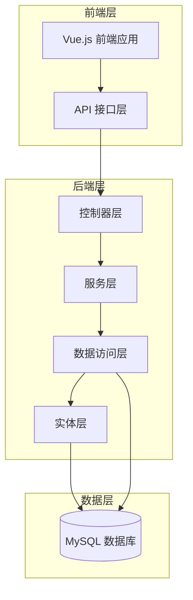

**图表来源**
- [DrugInController.java:1-104](file://src/main/java/com/hospital/drugmanagement/controller/DrugInController.java#L1-L104)
- [DrugInServiceImpl.java:1-116](file://src/main/java/com/hospital/drugmanagement/service/impl/DrugInServiceImpl.java#L1-L116)
- [DrugInMapper.java:1-7](file://src/main/java/com/hospital/drugmanagement/mapper/DrugInMapper.java#L1-L7)

**章节来源**
- [DrugInController.java:1-104](file://src/main/java/com/hospital/drugmanagement/controller/DrugInController.java#L1-L104)
- [DrugInServiceImpl.java:1-116](file://src/main/java/com/hospital/drugmanagement/service/impl/DrugInServiceImpl.java#L1-L116)
- [DrugInMapper.java:1-7](file://src/main/java/com/hospital/drugmanagement/mapper/DrugInMapper.java#L1-L7)

## 核心组件

### 数据模型设计

DrugIn实体采用了精心设计的数据模型，确保了业务完整性的同时保持了良好的扩展性：

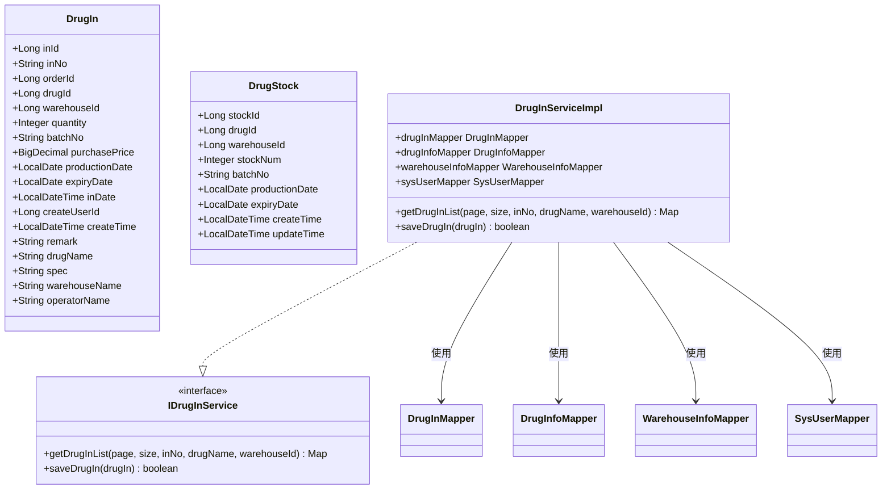

**图表来源**
- [DrugIn.java:15-62](file://src/main/java/com/hospital/drugmanagement/entity/DrugIn.java#L15-L62)
- [DrugStock.java:13-39](file://src/main/java/com/hospital/drugmanagement/entity/DrugStock.java#L13-L39)
- [IDrugInService.java:8-11](file://src/main/java/com/hospital/drugmanagement/service/IDrugInService.java#L8-L11)
- [DrugInServiceImpl.java:27-116](file://src/main/java/com/hospital/drugmanagement/service/impl/DrugInServiceImpl.java#L27-L116)

### 关键字段分析

| 字段名 | 类型 | 描述 | 业务意义 |
|--------|------|------|----------|
| inId | Long | 入库ID | 主键标识，自增生成 |
| inNo | String | 入库单号 | 唯一标识符，格式：RK+时间戳 |
| orderId | Long | 关联采购单ID | 业务关联，支持溯源 |
| drugId | Long | 关联药品ID | 药品标识，建立业务关系 |
| warehouseId | Long | 入库仓库ID | 仓储管理，支持多仓库 |
| quantity | Integer | 入库数量 | 核心业务量，影响库存 |
| batchNo | String | 批次号 | 批次管理，质量追溯 |
| purchasePrice | BigDecimal | 入库单价 | 成本核算，财务记录 |
| productionDate | LocalDate | 生产日期 | 质量控制，有效期计算 |
| expiryDate | LocalDate | 有效期 | 质量控制，临期预警 |
| inDate | LocalDateTime | 入库时间 | 时间戳，业务记录 |
| createUserId | Long | 操作人ID | 责任追踪，审计功能 |
| createTime | LocalDateTime | 创建时间 | 审计功能，系统时间戳 |

**章节来源**
- [DrugIn.java:20-48](file://src/main/java/com/hospital/drugmanagement/entity/DrugIn.java#L20-L48)
- [init.sql:157-175](file://src/main/resources/db/init.sql#L157-L175)

## 架构概览

### 系统架构图

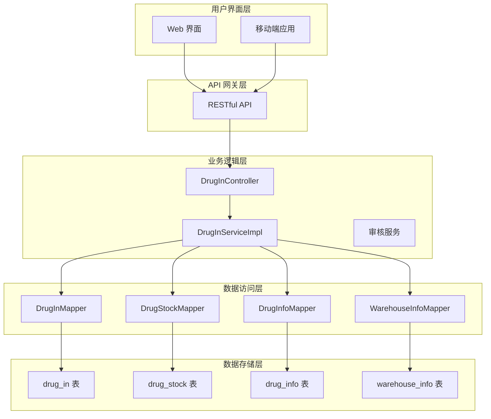

**图表来源**
- [DrugInController.java:12-104](file://src/main/java/com/hospital/drugmanagement/controller/DrugInController.java#L12-L104)
- [DrugInServiceImpl.java:27-116](file://src/main/java/com/hospital/drugmanagement/service/impl/DrugInServiceImpl.java#L27-L116)
- [init.sql:157-175](file://src/main/resources/db/init.sql#L157-L175)

### 数据流图

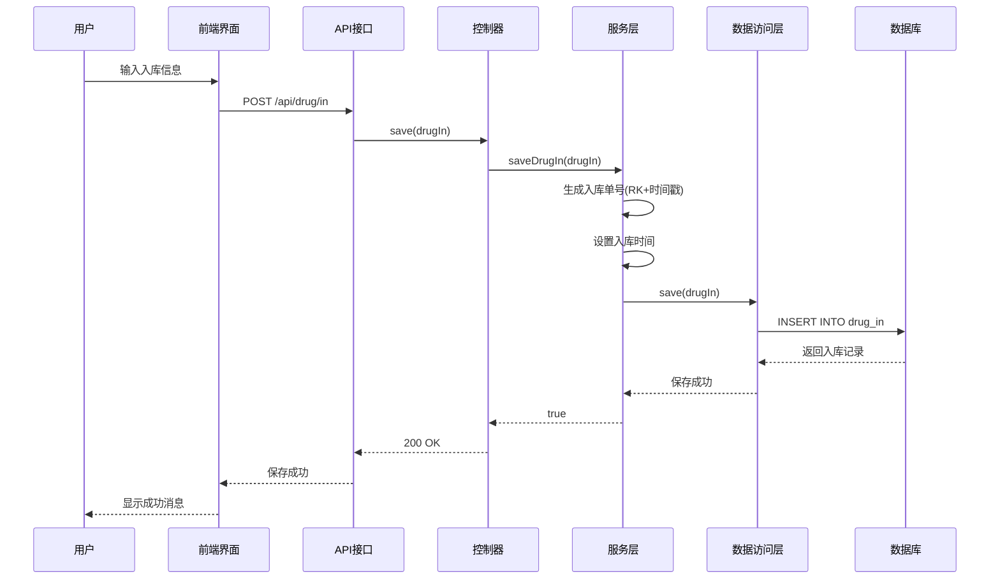

**图表来源**
- [DrugInController.java:69-83](file://src/main/java/com/hospital/drugmanagement/controller/DrugInController.java#L69-L83)
- [DrugInServiceImpl.java:92-116](file://src/main/java/com/hospital/drugmanagement/service/impl/DrugInServiceImpl.java#L92-L116)

## 详细组件分析

### 入库单号唯一性标识

入库单号(inNo)是DrugIn实体的核心标识符，采用"RK"前缀加精确到秒的时间戳格式，确保全局唯一性：

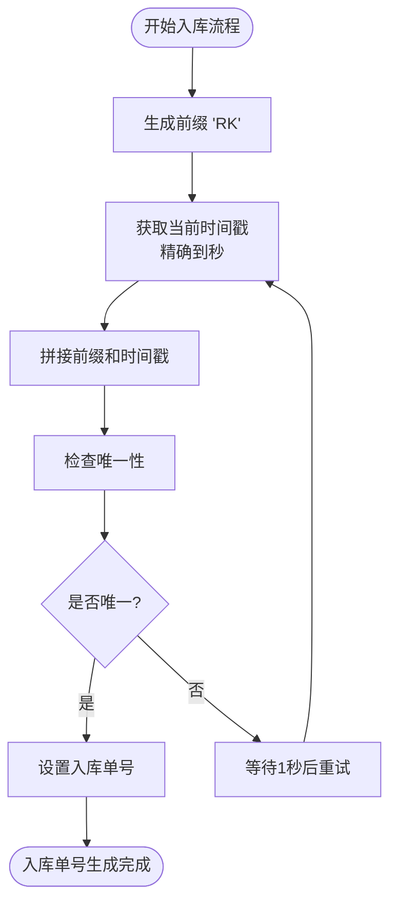

**图表来源**
- [DrugInServiceImpl.java:96-99](file://src/main/java/com/hospital/drugmanagement/service/impl/DrugInServiceImpl.java#L96-L99)
- [init.sql:161](file://src/main/resources/db/init.sql#L161)

### 批次管理追踪机制

批次号(batchNo)与生产日期、有效期形成完整的质量追溯体系：

| 组件 | 字段 | 作用 | 业务价值 |
|------|------|------|----------|
| 批次号 | batchNo | 唯一批次标识 | 质量追溯、召回管理 |
| 生产日期 | productionDate | 生产时间记录 | 有效期计算、批次管理 |
| 有效期 | expiryDate | 保质期截止日期 | 质量控制、临期预警 |
| 库存批次 | batchNo | 库存批次标识 | 现货管理、先进先出 |

**章节来源**
- [DrugIn.java:33-39](file://src/main/java/com/hospital/drugmanagement/entity/DrugIn.java#L33-L39)
- [DrugStock.java:28-32](file://src/main/java/com/hospital/drugmanagement/entity/DrugStock.java#L28-L32)

### 价格记录成本核算

入库单价(purchasePrice)与入库数量(quantity)构成完整的成本核算体系：

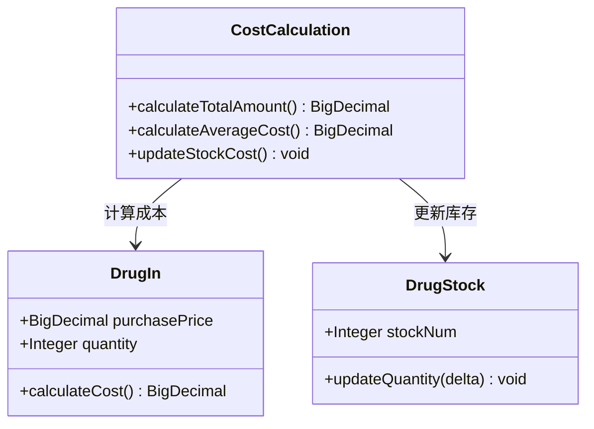

**图表来源**
- [DrugIn.java:35](file://src/main/java/com/hospital/drugmanagement/entity/DrugIn.java#L35)
- [DrugInServiceImpl.java:104-110](file://src/main/java/com/hospital/drugmanagement/service/impl/DrugInServiceImpl.java#L104-L110)

### 有效期质量控制

有效期(expiryDate)与生产日期(productionDate)共同确保药品质量：

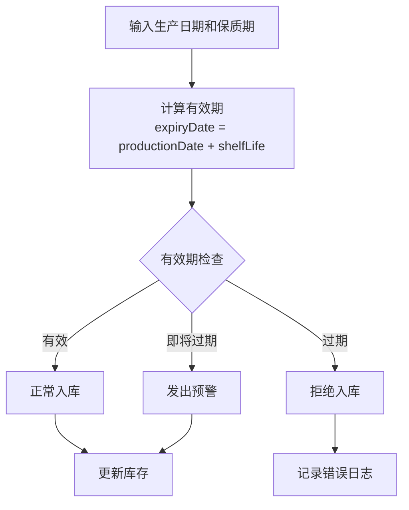

**图表来源**
- [init.sql:119-120](file://src/main/resources/db/init.sql#L119-L120)
- [init.sql:168-169](file://src/main/resources/db/init.sql#L168-L169)

### 入库数量与库存更新关系

入库数量(quantity)直接影响库存更新策略：

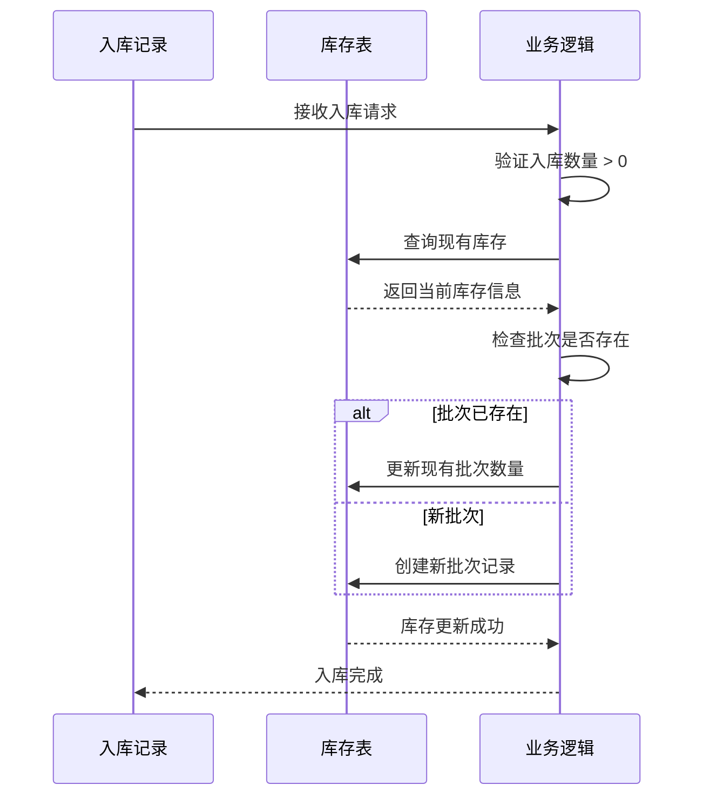

**图表来源**
- [DrugInServiceImpl.java:104-110](file://src/main/java/com/hospital/drugmanagement/service/impl/DrugInServiceImpl.java#L104-L110)

### 仓库ID仓储管理

仓库ID(warehouseId)支持多仓库管理模式：

| 功能特性 | 实现方式 | 业务价值 |
|----------|----------|----------|
| 多仓库支持 | warehouseId 外键 | 支持分仓管理 |
| 仓库关联 | WarehouseInfoMapper | 仓库信息维护 |
| 库存隔离 | 按仓库维度统计 | 精确库存管理 |
| 仓库切换 | 动态选择仓库 | 灵活的仓储配置 |

**章节来源**
- [DrugIn.java:29](file://src/main/java/com/hospital/drugmanagement/entity/DrugIn.java#L29)
- [DrugInServiceImpl.java:69-72](file://src/main/java/com/hospital/drugmanagement/service/impl/DrugInServiceImpl.java#L69-L72)

### 生产日期追溯功能

生产日期(productionDate)为完整的追溯体系提供基础：

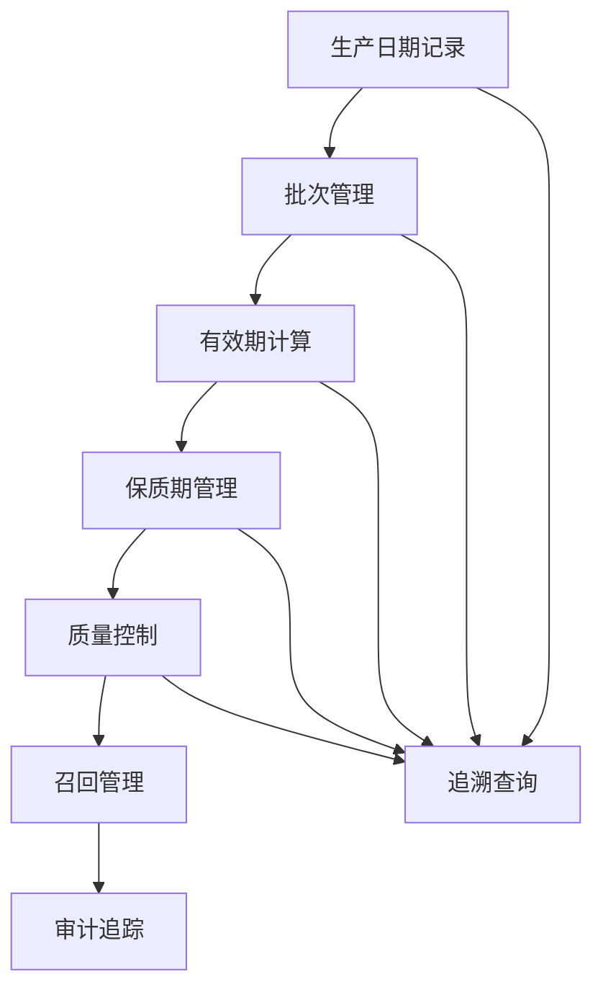

**图表来源**
- [DrugIn.java:37](file://src/main/java/com/hospital/drugmanagement/entity/DrugIn.java#L37)
- [init.sql:119](file://src/main/resources/db/init.sql#L119)

### 入库状态流转

虽然当前实现中DrugIn实体没有显式的状态字段，但通过业务流程实现了状态管理：

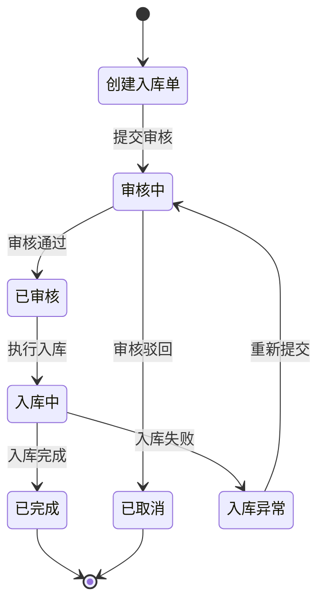

### 操作人责任追踪

操作人(createUserId)与时间戳(createTime)实现完整的审计功能：

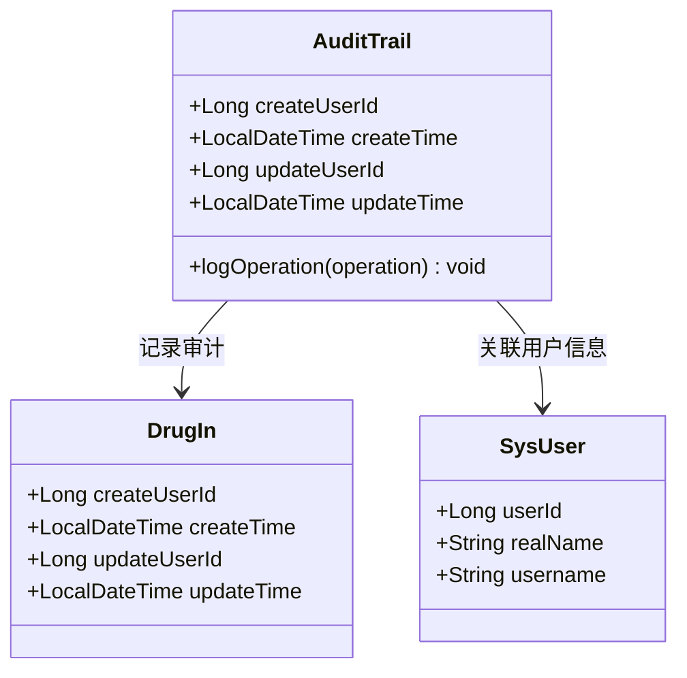

**图表来源**
- [DrugIn.java:43-46](file://src/main/java/com/hospital/drugmanagement/entity/DrugIn.java#L43-L46)
- [AutoFill.java:12-15](file://src/main/java/com/hospital/drugmanagement/common/anno/AutoFill.java#L12-L15)

## 依赖关系分析

### 组件耦合度分析

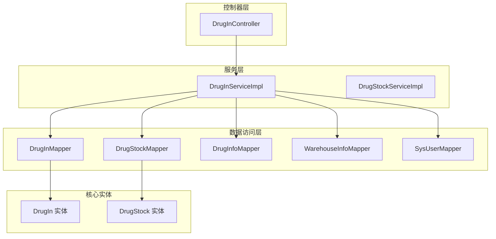

**图表来源**
- [DrugInController.java:17-18](file://src/main/java/com/hospital/drugmanagement/controller/DrugInController.java#L17-L18)
- [DrugInServiceImpl.java:29-39](file://src/main/java/com/hospital/drugmanagement/service/impl/DrugInServiceImpl.java#L29-L39)

### 外部依赖分析

| 依赖项 | 用途 | 版本 | 重要性 |
|--------|------|------|--------|
| MyBatis-Plus | ORM框架 | 最新版本 | 核心依赖 |
| Spring Boot | 应用框架 | 最新版本 | 核心依赖 |
| Lombok | 代码简化 | 最新版本 | 开发工具 |
| Element Plus | 前端UI | 最新版本 | 用户界面 |
| Vue.js | 前端框架 | 最新版本 | 用户界面 |

**章节来源**
- [pom.xml](file://pom.xml)

## 性能考虑

### 数据库优化策略

1. **索引优化**
   - 药品ID索引：加速药品查询
   - 仓库ID索引：支持按仓库筛选
   - 入库单号唯一索引：确保唯一性约束

2. **查询优化**
   - 分页查询：避免大数据集全量查询
   - 条件查询：支持多字段组合查询
   - 关联查询：批量获取关联信息

3. **缓存策略**
   - 常用配置缓存
   - 用户信息缓存
   - 药品信息缓存

### 事务管理

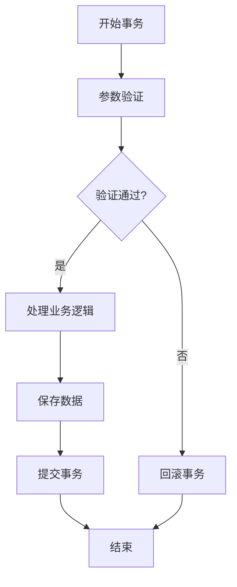

**图表来源**
- [DrugInServiceImpl.java:92-116](file://src/main/java/com/hospital/drugmanagement/service/impl/DrugInServiceImpl.java#L92-L116)

## 故障排除指南

### 常见问题及解决方案

| 问题类型 | 症状 | 可能原因 | 解决方案 |
|----------|------|----------|----------|
| 入库单号重复 | 保存失败，唯一约束冲突 | 时间戳重复或并发冲突 | 等待1秒后重试，或使用数据库序列 |
| 有效期验证失败 | 入库被拒绝 | 生产日期晚于有效期 | 检查输入日期，确保逻辑正确 |
| 库存更新异常 | 库存数量不正确 | 并发写入冲突 | 使用乐观锁或事务控制 |
| 用户信息缺失 | 操作人显示为空 | 用户ID不存在 | 检查用户表数据完整性 |

### 错误处理机制

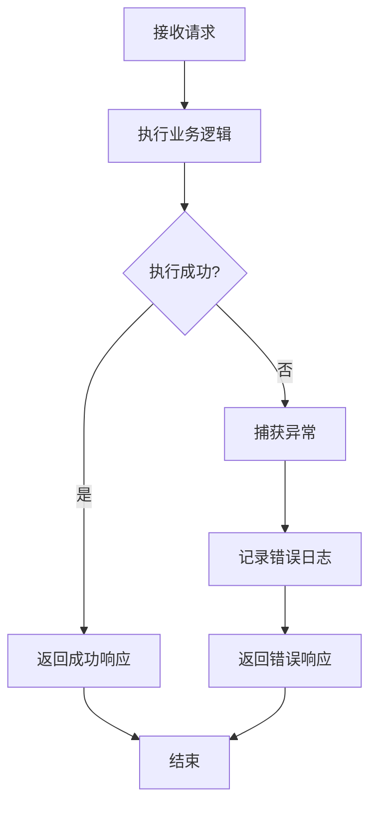

**图表来源**
- [DrugInServiceImpl.java:84-88](file://src/main/java/com/hospital/drugmanagement/service/impl/DrugInServiceImpl.java#L84-L88)
- [DrugInController.java:38-44](file://src/main/java/com/hospital/drugmanagement/controller/DrugInController.java#L38-L44)

**章节来源**
- [DrugInServiceImpl.java:84-115](file://src/main/java/com/hospital/drugmanagement/service/impl/DrugInServiceImpl.java#L84-L115)
- [DrugInController.java:38-102](file://src/main/java/com/hospital/drugmanagement/controller/DrugInController.java#L38-L102)

## 结论

DrugIn实体作为药品管理系统的核心组件，展现了优秀的架构设计和业务完整性。通过精心设计的数据模型、完善的业务流程和强大的扩展能力，该实体能够满足医院药品管理的各种需求。

主要优势包括：
- **唯一性保证**：通过RK前缀+时间戳确保入库单号全局唯一
- **质量追溯**：完整的批次、生产日期、有效期管理体系
- **成本控制**：精确的成本核算和库存管理
- **审计功能**：完整的时间戳和操作人追踪
- **扩展性强**：支持多仓库、多批次、多状态管理

建议在后续开发中重点关注库存更新的完整实现和状态流转的规范化管理。

## 附录

### API使用示例

#### 获取入库单列表
```javascript
// GET /api/drug/in/list?page=1&size=10&inNo=IN001
{
  "code": 200,
  "msg": "success",
  "data": [
    {
      "inId": 1,
      "inNo": "RK20260313141522",
      "drugName": "阿莫西林胶囊",
      "warehouseName": "主仓库",
      "quantity": 100,
      "batchNo": "20260101",
      "purchasePrice": 8.50,
      "productionDate": "2026-01-01",
      "expiryDate": "2028-01-01",
      "inDate": "2026-03-13T14:15:22",
      "operatorName": "张三"
    }
  ],
  "total": 1
}
```

#### 新增入库单
```javascript
// POST /api/drug/in
{
  "drugId": 1,
  "warehouseId": 1,
  "quantity": 100,
  "batchNo": "20260101",
  "purchasePrice": 8.50,
  "productionDate": "2026-01-01",
  "expiryDate": "2028-01-01",
  "orderId": 1,
  "remark": "批量采购入库"
}
```

### 数据库表结构

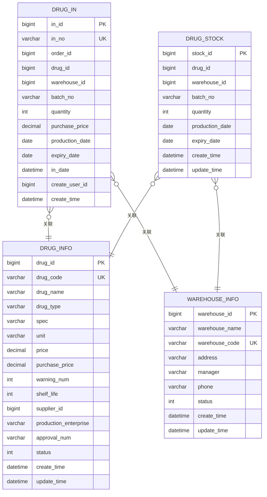

**图表来源**
- [init.sql:157-175](file://src/main/resources/db/init.sql#L157-L175)
- [init.sql:111-125](file://src/main/resources/db/init.sql#L111-L125)
- [init.sql:60-80](file://src/main/resources/db/init.sql#L60-L80)
- [init.sql:97-109](file://src/main/resources/db/init.sql#L97-L109)