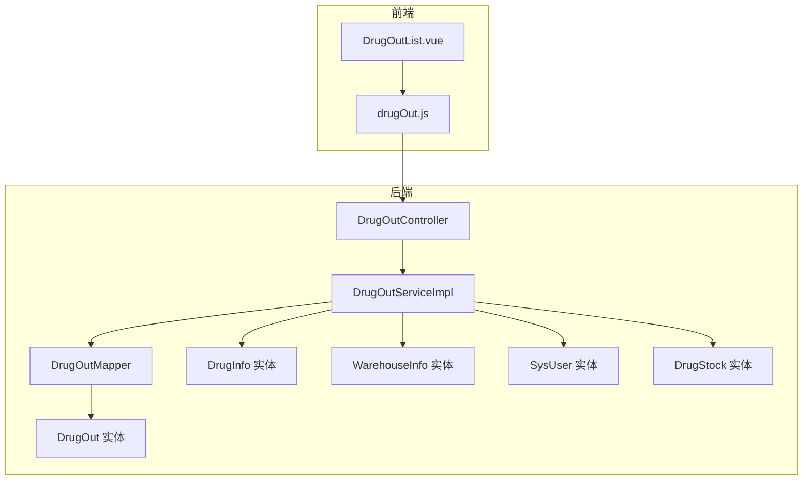
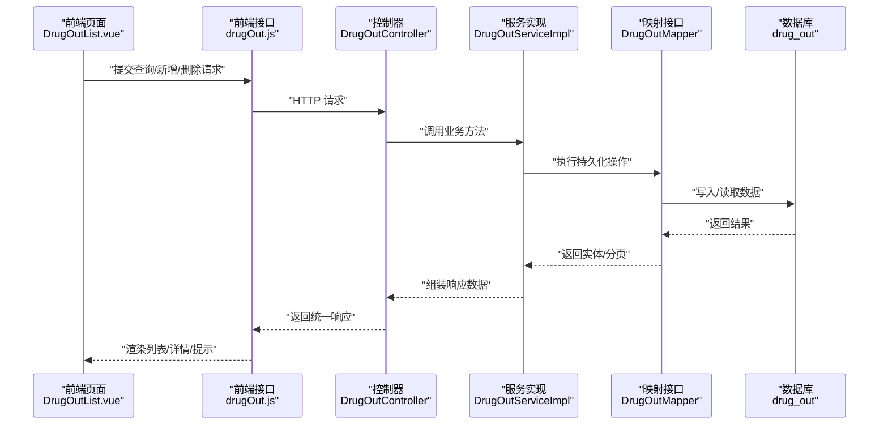
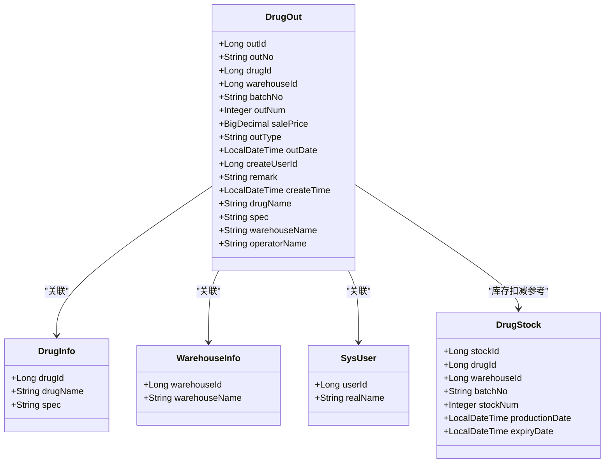
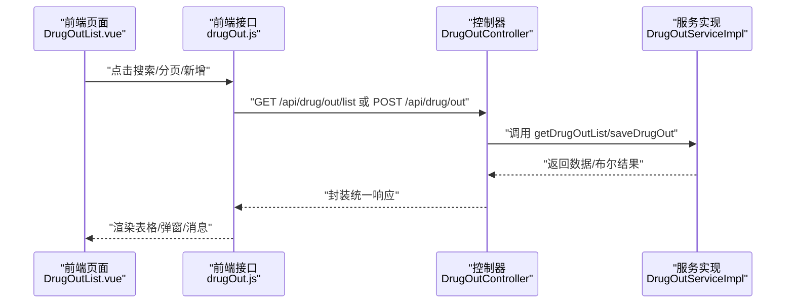
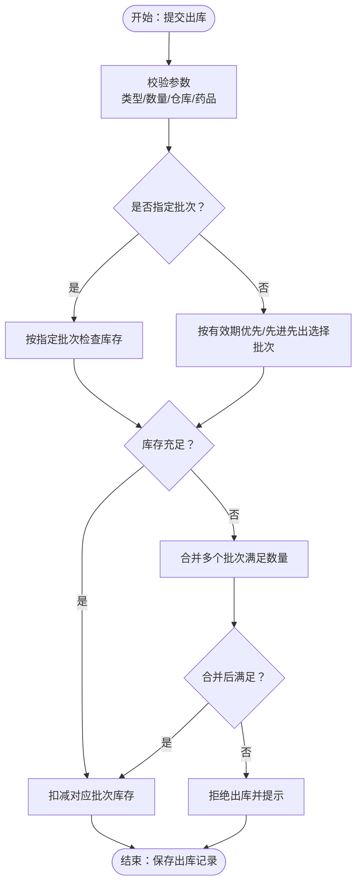
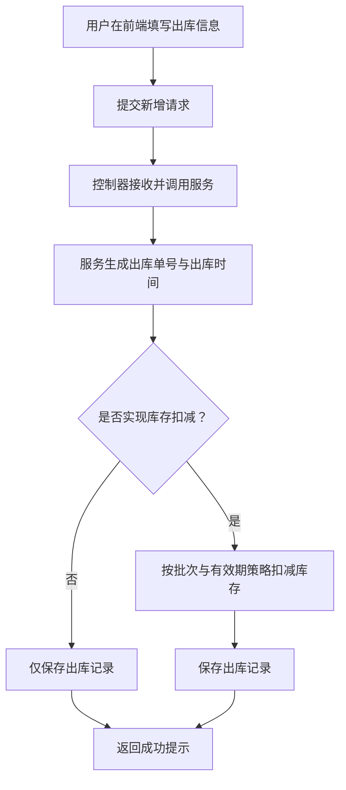
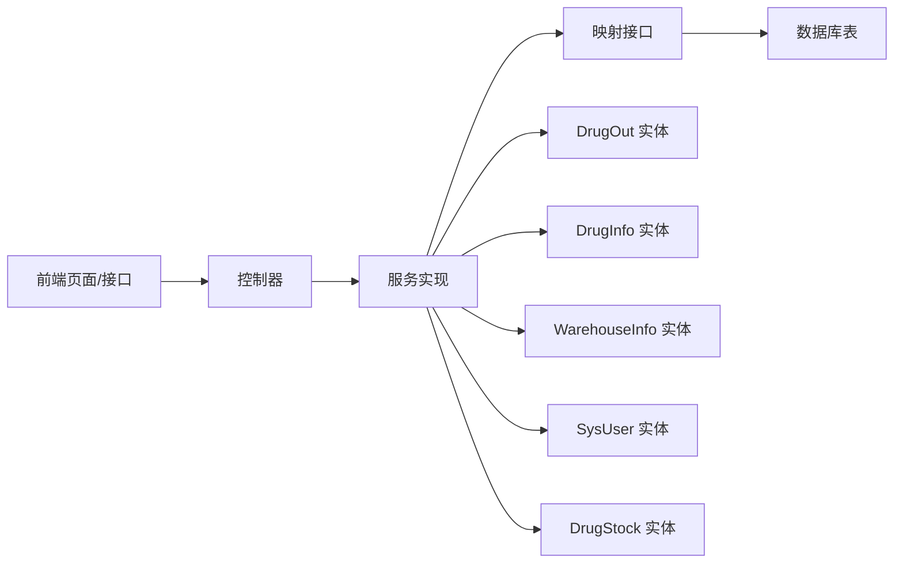

# 药品出库实体

<cite>
**本文引用的文件**   
- [DrugOut.java](file://src/main/java/com/hospital/drugmanagement/entity/DrugOut.java)
- [DrugOutController.java](file://src/main/java/com/hospital/drugmanagement/controller/DrugOutController.java)
- [DrugOutServiceImpl.java](file://src/main/java/com/hospital/drugmanagement/service/impl/DrugOutServiceImpl.java)
- [DrugOutMapper.java](file://src/main/java/com/hospital/drugmanagement/mapper/DrugOutMapper.java)
- [IDrugOutService.java](file://src/main/java/com/hospital/drugmanagement/service/IDrugOutService.java)
- [DrugInfo.java](file://src/main/java/com/hospital/drugmanagement/entity/DrugInfo.java)
- [WarehouseInfo.java](file://src/main/java/com/hospital/drugmanagement/entity/WarehouseInfo.java)
- [SysUser.java](file://src/main/java/com/hospital/drugmanagement/entity/SysUser.java)
- [DrugStock.java](file://src/main/java/com/hospital/drugmanagement/entity/DrugStock.java)
- [init.sql](file://src/main/resources/db/init.sql)
- [DrugOutList.vue](file://drug-front/src/views/inout/DrugOutList.vue)
- [drugOut.js](file://drug-front/src/api/drugOut.js)
</cite>

## 目录
1. [简介](#简介)
2. [项目结构](#项目结构)
3. [核心组件](#核心组件)
4. [架构总览](#架构总览)
5. [详细组件分析](#详细组件分析)
6. [依赖分析](#依赖分析)
7. [性能考虑](#性能考虑)
8. [故障排查指南](#故障排查指南)
9. [结论](#结论)
10. [附录](#附录)

## 简介
本文围绕药品出库实体(DrugOut)进行系统化技术文档梳理，覆盖出库流程的关键设计要素与实现细节，包括：
- 出库类型分类与业务含义
- 与药品、仓库、用户的关联关系
- 出库数量与库存扣减的关系
- 批次与有效期在出库中的作用与策略
- 出库状态管理与审批流程对接现状
- 医生工作站对接的扩展建议
- 出库流程图、类型说明、业务规则与应用场景示例

## 项目结构
后端采用Spring Boot + MyBatis-Plus分层架构，前端基于Vue3 + Element Plus构建。出库模块涉及实体、控制器、服务、映射与前端视图/接口。

图表来源
- [DrugOutList.vue](file://drug-front/src/views/inout/DrugOutList.vue)
- [drugOut.js](file://drug-front/src/api/drugOut.js)
- [DrugOutController.java](file://src/main/java/com/hospital/drugmanagement/controller/DrugOutController.java)
- [DrugOutServiceImpl.java](file://src/main/java/com/hospital/drugmanagement/service/impl/DrugOutServiceImpl.java)
- [DrugOutMapper.java](file://src/main/java/com/hospital/drugmanagement/mapper/DrugOutMapper.java)
- [DrugOut.java](file://src/main/java/com/hospital/drugmanagement/entity/DrugOut.java)
- [DrugInfo.java](file://src/main/java/com/hospital/drugmanagement/entity/DrugInfo.java)
- [WarehouseInfo.java](file://src/main/java/com/hospital/drugmanagement/entity/WarehouseInfo.java)
- [SysUser.java](file://src/main/java/com/hospital/drugmanagement/entity/SysUser.java)
- [DrugStock.java](file://src/main/java/com/hospital/drugmanagement/entity/DrugStock.java)

章节来源
- [DrugOutController.java:1-103](file://src/main/java/com/hospital/drugmanagement/controller/DrugOutController.java#L1-L103)
- [DrugOutServiceImpl.java:1-116](file://src/main/java/com/hospital/drugmanagement/service/impl/DrugOutServiceImpl.java#L1-L116)
- [DrugOut.java:1-58](file://src/main/java/com/hospital/drugmanagement/entity/DrugOut.java#L1-L58)
- [DrugOutList.vue:1-384](file://drug-front/src/views/inout/DrugOutList.vue#L1-L384)

## 核心组件
- 实体层
  - 出库实体：包含出库单号、药品关联、仓库、批次、数量、单价、类型、时间、操作人、备注等字段，并提供非持久化字段用于前端展示（药品名、规格、仓库名、操作人名）。
  - 药品实体：提供药品基础信息，用于出库时的名称与规格回显。
  - 仓库实体：提供仓库名称，用于出库时的仓库名回显。
  - 用户实体：提供操作人姓名，用于出库时的操作人名回显。
  - 库存实体：提供批次、生产日期、有效期、当前库存数量等，是出库扣减库存的重要依据。
- 控制器层
  - 提供出库列表查询、详情查询、新增、删除接口，统一返回标准响应结构。
- 服务层
  - 列表查询：支持按出库单号、药品名称、出库类型过滤，分页返回；同时回填药品名、规格、仓库名、操作人名。
  - 新增保存：自动生成出库单号与出库时间，保存出库记录；预留库存扣减逻辑位置。
- 映射层
  - 基于MyBatis-Plus的通用Mapper接口，提供对DrugOut表的CRUD能力。

章节来源
- [DrugOut.java:14-58](file://src/main/java/com/hospital/drugmanagement/entity/DrugOut.java#L14-L58)
- [DrugInfo.java:9-167](file://src/main/java/com/hospital/drugmanagement/entity/DrugInfo.java#L9-L167)
- [WarehouseInfo.java:12-37](file://src/main/java/com/hospital/drugmanagement/entity/WarehouseInfo.java#L12-L37)
- [SysUser.java:12-130](file://src/main/java/com/hospital/drugmanagement/entity/SysUser.java#L12-L130)
- [DrugStock.java:13-39](file://src/main/java/com/hospital/drugmanagement/entity/DrugStock.java#L13-L39)
- [DrugOutController.java:11-103](file://src/main/java/com/hospital/drugmanagement/controller/DrugOutController.java#L11-L103)
- [DrugOutServiceImpl.java:26-116](file://src/main/java/com/hospital/drugmanagement/service/impl/DrugOutServiceImpl.java#L26-L116)
- [DrugOutMapper.java:1-7](file://src/main/java/com/hospital/drugmanagement/mapper/DrugOutMapper.java#L1-L7)

## 架构总览
出库流程从前端发起，经由控制器到服务层，最终持久化至数据库。服务层负责组装数据与调用底层持久化能力；实体层承载数据模型与非持久化展示字段。

图表来源
- [DrugOutList.vue](file://drug-front/src/views/inout/DrugOutList.vue)
- [drugOut.js](file://drug-front/src/api/drugOut.js)
- [DrugOutController.java](file://src/main/java/com/hospital/drugmanagement/controller/DrugOutController.java)
- [DrugOutServiceImpl.java](file://src/main/java/com/hospital/drugmanagement/service/impl/DrugOutServiceImpl.java)
- [DrugOutMapper.java](file://src/main/java/com/hospital/drugmanagement/mapper/DrugOutMapper.java)

## 详细组件分析

### 出库实体类分析
- 字段职责
  - 单据标识：出库ID、出库单号
  - 关联信息：药品ID、仓库ID、批次号
  - 数量与价格：出库数量、销售单价
  - 类型与时间：出库类型、出库时间、创建时间
  - 操作人与备注：操作人ID、备注
  - 展示字段：药品名、规格、仓库名、操作人名（非持久化）
- 设计要点
  - 使用自动填充注解记录创建时间
  - 非持久化字段用于前端展示，避免冗余持久化
  - 出库单号与出库时间在服务层生成，保证一致性

图表来源
- [DrugOut.java:14-58](file://src/main/java/com/hospital/drugmanagement/entity/DrugOut.java#L14-L58)
- [DrugInfo.java:9-167](file://src/main/java/com/hospital/drugmanagement/entity/DrugInfo.java#L9-L167)
- [WarehouseInfo.java:12-37](file://src/main/java/com/hospital/drugmanagement/entity/WarehouseInfo.java#L12-L37)
- [SysUser.java:12-130](file://src/main/java/com/hospital/drugmanagement/entity/SysUser.java#L12-L130)
- [DrugStock.java:13-39](file://src/main/java/com/hospital/drugmanagement/entity/DrugStock.java#L13-L39)

章节来源
- [DrugOut.java:14-58](file://src/main/java/com/hospital/drugmanagement/entity/DrugOut.java#L14-L58)

### 控制器与前端交互
- 接口能力
  - 列表查询：支持分页、按出库单号、药品名称、出库类型过滤
  - 详情查询：按ID获取出库单详情
  - 新增/删除：提交出库单并返回统一响应
- 前端页面
  - 支持搜索、分页、新增、删除、详情查看
  - 出库类型枚举：门诊领药、住院领药、调拨、报废
  - 关联单号字段用于对接医生工作站或住院系统

图表来源
- [DrugOutList.vue](file://drug-front/src/views/inout/DrugOutList.vue)
- [drugOut.js](file://drug-front/src/api/drugOut.js)
- [DrugOutController.java](file://src/main/java/com/hospital/drugmanagement/controller/DrugOutController.java)
- [DrugOutServiceImpl.java](file://src/main/java/com/hospital/drugmanagement/service/impl/DrugOutServiceImpl.java)

章节来源
- [DrugOutController.java:19-101](file://src/main/java/com/hospital/drugmanagement/controller/DrugOutController.java#L19-L101)
- [DrugOutList.vue:1-384](file://drug-front/src/views/inout/DrugOutList.vue#L1-L384)
- [drugOut.js:1-36](file://drug-front/src/api/drugOut.js#L1-L36)

### 出库类型分类与业务规则
- 出库类型
  - 门诊领药：面向门诊患者取药场景
  - 住院领药：面向住院患者用药场景
  - 调拨：同一机构内不同仓库间的药品转移
  - 报废：过期、损坏或不可用药品的处置
- 业务规则
  - 出库数量必须为正整数
  - 出库类型必填
  - 出库单号由服务层生成，确保唯一性
  - 出库时间在保存时设置
  - 关联单号用于对接医生工作站或住院系统，便于费用结算与追溯

章节来源
- [DrugOutList.vue:14-18](file://drug-front/src/views/inout/DrugOutList.vue#L14-L18)
- [DrugOutList.vue:150-155](file://drug-front/src/views/inout/DrugOutList.vue#L150-L155)
- [DrugOutServiceImpl.java:94-115](file://src/main/java/com/hospital/drugmanagement/service/impl/DrugOutServiceImpl.java#L94-L115)

### 出库数量与库存扣减机制
- 当前实现
  - 保存出库记录时预留库存扣减位置，尚未实现具体扣减逻辑
- 建议实现策略
  - 在事务内先校验批次与有效期，再按“先进先出/有效期优先”原则锁定可用库存
  - 扣减对应批次库存数量，若批次库存不足则合并多个批次满足出库需求
  - 记录扣减明细，便于审计与追溯
- 数据模型支撑
  - 库存实体包含批次、生产日期、有效期、当前库存数量，为扣减策略提供依据

图表来源
- [DrugOutServiceImpl.java:94-115](file://src/main/java/com/hospital/drugmanagement/service/impl/DrugOutServiceImpl.java#L94-L115)
- [DrugStock.java:13-39](file://src/main/java/com/hospital/drugmanagement/entity/DrugStock.java#L13-L39)

章节来源
- [DrugOutServiceImpl.java:94-115](file://src/main/java/com/hospital/drugmanagement/service/impl/DrugOutServiceImpl.java#L94-L115)
- [DrugStock.java:13-39](file://src/main/java/com/hospital/drugmanagement/entity/DrugStock.java#L13-L39)

### 批次选择策略与有效期优先原则
- 批次选择
  - 若未指定批次，应按“有效期优先”与“先进先出”策略自动选择
  - 对于临近有效期的批次，应给予优先使用提示或限制
- 有效期控制
  - 出库时应校验批次有效期，避免过期药品出库
  - 可结合药品实体的保质期字段进行预警与控制
- 实现建议
  - 在服务层增加批次选择与有效期校验逻辑
  - 对于超期或库存不足的情况，返回明确错误信息

章节来源
- [init.sql:60-80](file://src/main/resources/db/init.sql#L60-L80)
- [init.sql:111-125](file://src/main/resources/db/init.sql#L111-L125)
- [DrugOutServiceImpl.java:94-115](file://src/main/java/com/hospital/drugmanagement/service/impl/DrugOutServiceImpl.java#L94-L115)

### 出库状态管理与审批流程集成
- 当前状态
  - 出库实体未包含状态字段，服务层也未实现审批流程
- 建议扩展
  - 新增状态字段（如待审核/已出库/已作废），并在服务层实现审批流程
  - 与现有审核记录表结构保持一致，便于统一管理
  - 前端增加状态筛选与审批操作入口

章节来源
- [init.sql:226-238](file://src/main/resources/db/init.sql#L226-L238)
- [DrugOut.java:14-58](file://src/main/java/com/hospital/drugmanagement/entity/DrugOut.java#L14-L58)

### 医生工作站对接
- 关联单号
  - 出库实体提供关联单号字段，可用于绑定处方号、住院号等
- 前端支持
  - 前端页面提供关联单号输入框，便于录入与展示
- 结算集成
  - 出库单据可作为费用结算的基础凭证，需确保单据完整性与可追溯性

章节来源
- [DrugOutList.vue:160-162](file://drug-front/src/views/inout/DrugOutList.vue#L160-L162)
- [DrugOut.java:14-58](file://src/main/java/com/hospital/drugmanagement/entity/DrugOut.java#L14-L58)

### 出库流程图

图表来源
- [DrugOutController.java:68-82](file://src/main/java/com/hospital/drugmanagement/controller/DrugOutController.java#L68-L82)
- [DrugOutServiceImpl.java:94-115](file://src/main/java/com/hospital/drugmanagement/service/impl/DrugOutServiceImpl.java#L94-L115)

## 依赖分析
- 组件耦合
  - 控制器依赖服务接口，服务实现依赖映射接口与多个实体
  - 前端通过统一接口与后端交互，降低耦合度
- 外部依赖
  - MyBatis-Plus提供ORM与分页能力
  - Spring MVC提供REST接口能力
  - Element Plus提供前端UI组件

图表来源
- [DrugOutController.java](file://src/main/java/com/hospital/drugmanagement/controller/DrugOutController.java)
- [DrugOutServiceImpl.java](file://src/main/java/com/hospital/drugmanagement/service/impl/DrugOutServiceImpl.java)
- [DrugOutMapper.java](file://src/main/java/com/hospital/drugmanagement/mapper/DrugOutMapper.java)
- [DrugOut.java](file://src/main/java/com/hospital/drugmanagement/entity/DrugOut.java)
- [DrugInfo.java](file://src/main/java/com/hospital/drugmanagement/entity/DrugInfo.java)
- [WarehouseInfo.java](file://src/main/java/com/hospital/drugmanagement/entity/WarehouseInfo.java)
- [SysUser.java](file://src/main/java/com/hospital/drugmanagement/entity/SysUser.java)
- [DrugStock.java](file://src/main/java/com/hospital/drugmanagement/entity/DrugStock.java)

章节来源
- [DrugOutController.java:11-103](file://src/main/java/com/hospital/drugmanagement/controller/DrugOutController.java#L11-L103)
- [DrugOutServiceImpl.java:26-116](file://src/main/java/com/hospital/drugmanagement/service/impl/DrugOutServiceImpl.java#L26-L116)

## 性能考虑
- 查询优化
  - 列表查询已按药品ID与仓库ID建立索引，建议在高频查询字段上继续评估索引策略
- 事务与并发
  - 库存扣减应在事务内执行，避免并发场景下的超卖
- 分页与缓存
  - 列表分页默认每页10条，可根据业务调整；对不常变动的数据可考虑缓存策略

章节来源
- [init.sql:192-194](file://src/main/resources/db/init.sql#L192-L194)
- [init.sql:123-125](file://src/main/resources/db/init.sql#L123-L125)

## 故障排查指南
- 常见问题
  - 出库失败：检查出库数量是否为正、类型是否填写、是否实现库存扣减逻辑
  - 列表为空：确认查询条件与分页参数是否正确
  - 关联信息缺失：确认DrugInfo、WarehouseInfo、SysUser是否存在且ID有效
- 排查步骤
  - 查看控制器返回的统一响应结构，定位异常原因
  - 在服务层打印关键日志，确认单号生成与保存流程
  - 核对数据库索引与表结构，确保查询与插入正常

章节来源
- [DrugOutController.java:19-101](file://src/main/java/com/hospital/drugmanagement/controller/DrugOutController.java#L19-L101)
- [DrugOutServiceImpl.java:41-90](file://src/main/java/com/hospital/drugmanagement/service/impl/DrugOutServiceImpl.java#L41-L90)

## 结论
- 出库实体与前后端交互已具备完整骨架，支持基本的新增、查询、删除功能
- 出库类型与前端枚举已就绪，可直接用于业务场景
- 库存扣减、状态管理与审批流程尚未实现，建议按本文建议逐步扩展
- 批次与有效期策略为未来扩展重点，应结合业务规则制定严格的校验与提示机制

## 附录
- 数据库初始化脚本中包含出库表、库存表、药品表、仓库表、用户表等DDL定义，可作为部署与迁移依据
- 前端页面提供完整的出库管理界面，包括搜索、分页、新增、删除、详情等操作

章节来源
- [init.sql:177-194](file://src/main/resources/db/init.sql#L177-L194)
- [init.sql:111-125](file://src/main/resources/db/init.sql#L111-L125)
- [init.sql:60-80](file://src/main/resources/db/init.sql#L60-L80)
- [init.sql:97-109](file://src/main/resources/db/init.sql#L97-L109)
- [init.sql:8-22](file://src/main/resources/db/init.sql#L8-L22)