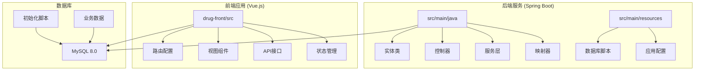
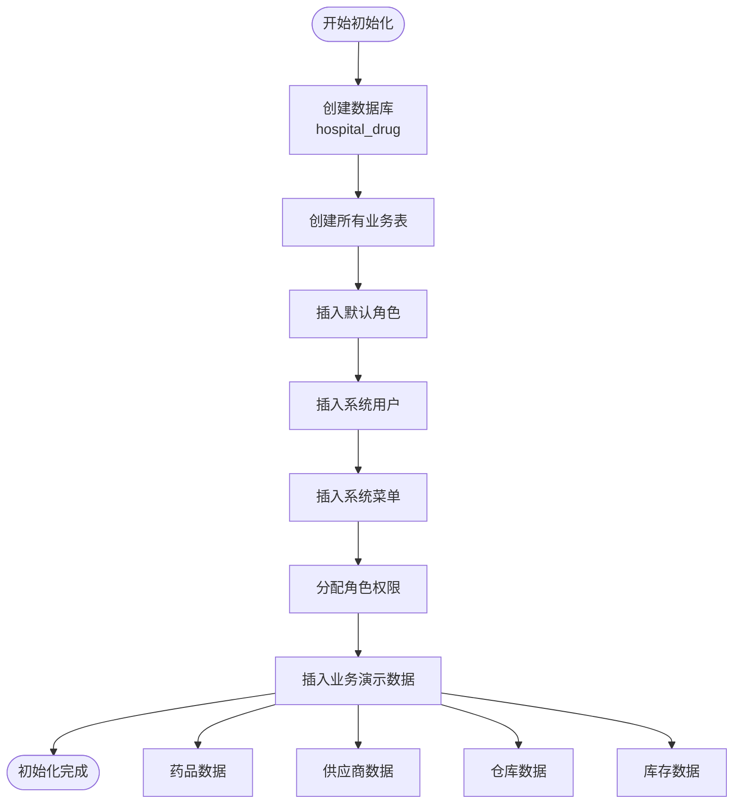
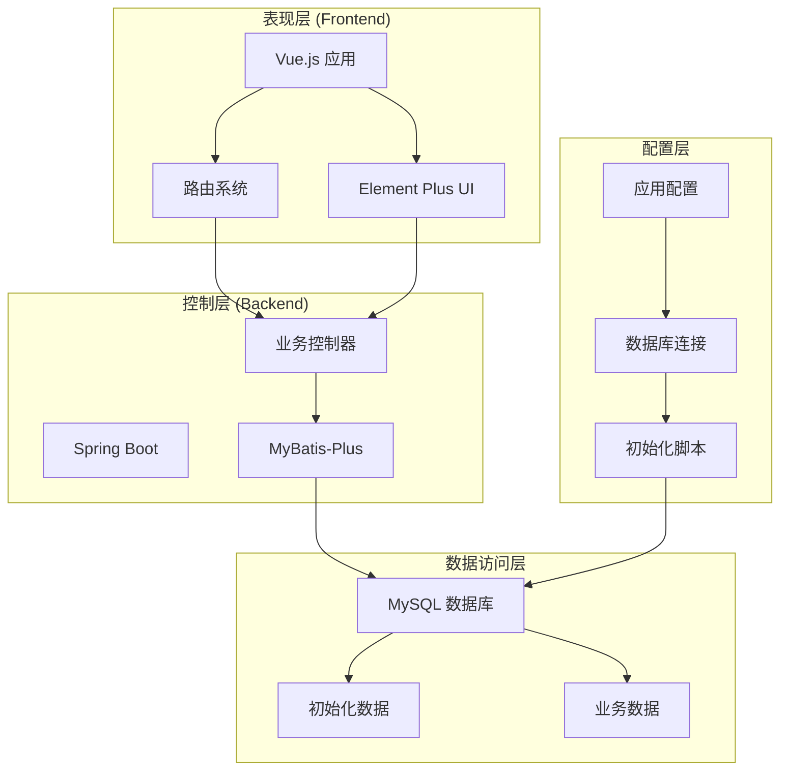
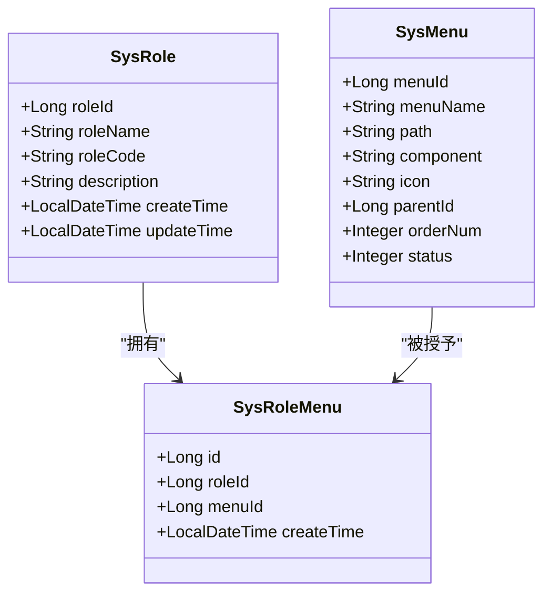
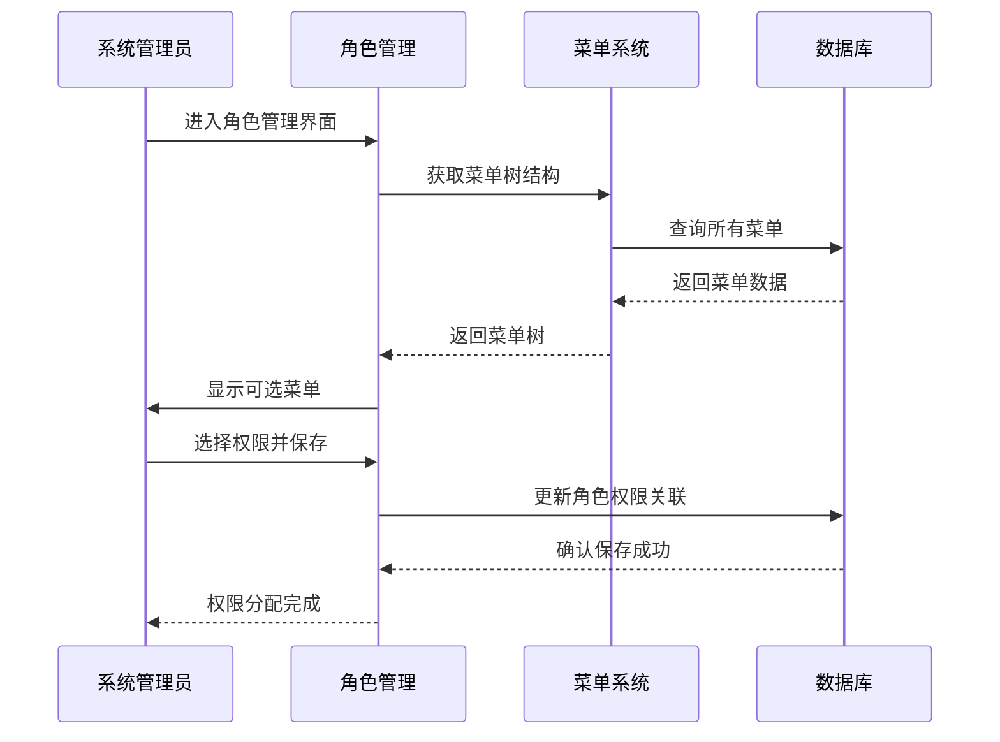
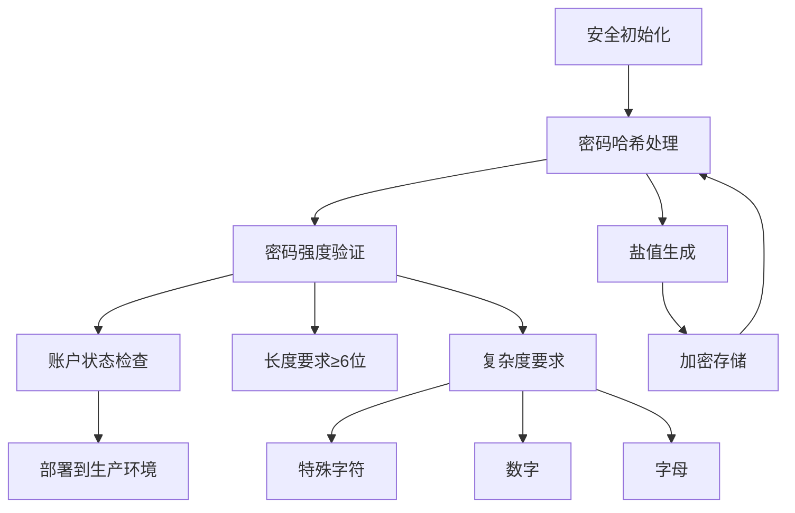
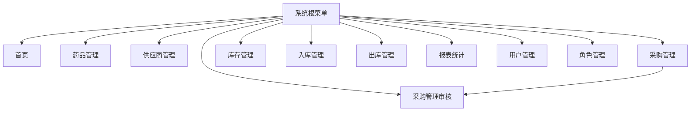
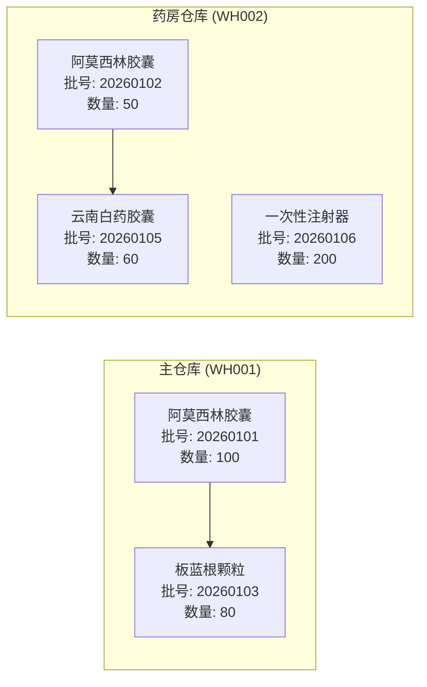
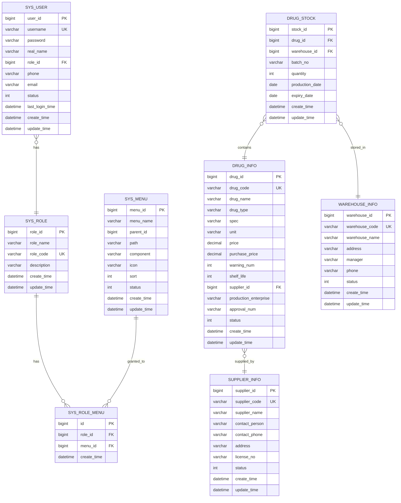
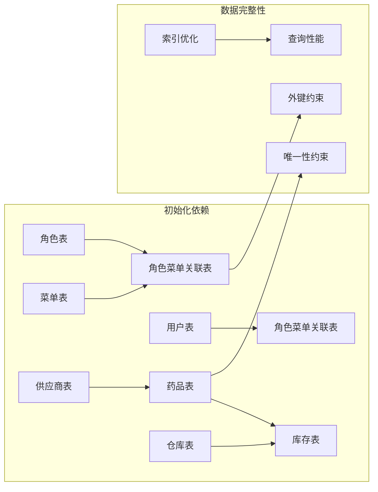

# 初始化数据配置

<cite>
**本文档引用的文件**
- [init.sql](file://src/main/resources/db/init.sql)
- [hospital_drug.sql](file://hospital_drug.sql)
- [init_and_start.bat](file://init_and_start.bat)
- [application.yml](file://src/main/resources/application.yml)
- [SysRole.java](file://src/main/java/com/hospital/drugmanagement/entity/SysRole.java)
- [SysMenu.java](file://src/main/java/com/hospital/drugmanagement/entity/SysMenu.java)
- [SysUser.java](file://src/main/java/com/hospital/drugmanagement/entity/SysUser.java)
- [DrugInfo.java](file://src/main/java/com/hospital/drugmanagement/entity/DrugInfo.java)
- [SupplierInfo.java](file://src/main/java/com/hospital/drugmanagement/entity/SupplierInfo.java)
- [WarehouseInfo.java](file://src/main/java/com/hospital/drugmanagement/entity/WarehouseInfo.java)
- [DrugStock.java](file://src/main/java/com/hospital/drugmanagement/entity/DrugStock.java)
- [index.js](file://drug-front/src/router/index.js)
- [RoleList.vue](file://drug-front/src/views/system/RoleList.vue)
- [UserList.vue](file://drug-front/src/views/system/UserList.vue)
</cite>

## 目录
1. [简介](#简介)
2. [项目结构](#项目结构)
3. [核心组件](#核心组件)
4. [架构概览](#架构概览)
5. [详细组件分析](#详细组件分析)
6. [依赖关系分析](#依赖关系分析)
7. [性能考虑](#性能考虑)
8. [故障排除指南](#故障排除指南)
9. [结论](#结论)
10. [附录](#附录)

## 简介

本文档详细说明了医院药品管理系统的初始化数据配置，包括数据库初始化脚本中的预设数据和配置策略。该系统采用前后端分离架构，后端基于Spring Boot + MyBatis-Plus，前端基于Vue.js + Element Plus，实现了完整的药品管理系统功能。

系统初始化数据涵盖了角色权限体系、用户账户、系统菜单、业务数据等完整配置，为开发测试和生产部署提供了标准化的数据基础。

## 项目结构

该项目采用标准的Maven多模块结构，主要包含以下关键目录：

**图表来源**
- [init.sql:1-312](file://src/main/resources/db/init.sql#L1-L312)
- [application.yml:1-24](file://src/main/resources/application.yml#L1-L24)

**章节来源**
- [init.sql:1-312](file://src/main/resources/db/init.sql#L1-L312)
- [application.yml:1-24](file://src/main/resources/application.yml#L1-L24)

## 核心组件

### 数据库初始化策略

系统采用分阶段的数据初始化策略：

1. **基础表结构创建**：按业务逻辑顺序创建各业务表
2. **系统基础数据**：角色、菜单、用户等系统级数据
3. **业务演示数据**：药品、供应商、仓库、库存等业务数据

### 初始化流程

**图表来源**
- [init.sql:240-312](file://src/main/resources/db/init.sql#L240-L312)

**章节来源**
- [init.sql:240-312](file://src/main/resources/db/init.sql#L240-L312)

## 架构概览

系统采用三层架构设计，初始化数据在整个架构中发挥着关键作用：

**图表来源**
- [application.yml:1-24](file://src/main/resources/application.yml#L1-L24)
- [init.sql:1-312](file://src/main/resources/db/init.sql#L1-L312)

## 详细组件分析

### 角色权限体系

#### 默认角色配置

系统定义了三个核心角色，每个角色都有明确的权限边界：

| 角色 | 编码 | 描述 | 权限范围 |
|------|------|------|----------|
| 系统管理员 | ADMIN | 拥有系统所有权限 | 全部菜单权限 |
| 采购审核员 | AUDITOR | 拥有采购审核权限 | 采购审核专用 |
| 普通用户 | USER | 普通用户权限 | 基础业务操作 |

#### 角色权限分配策略

**图表来源**
- [SysRole.java:14-80](file://src/main/java/com/hospital/drugmanagement/entity/SysRole.java#L14-L80)
- [SysMenu.java:11-95](file://src/main/java/com/hospital/drugmanagement/entity/SysMenu.java#L11-L95)

#### 权限分配流程

**图表来源**
- [RoleList.vue:98-118](file://drug-front/src/views/system/RoleList.vue#L98-L118)
- [init.sql:268-286](file://src/main/resources/db/init.sql#L268-L286)

**章节来源**
- [SysRole.java:14-80](file://src/main/java/com/hospital/drugmanagement/entity/SysRole.java#L14-L80)
- [SysMenu.java:11-95](file://src/main/java/com/hospital/drugmanagement/entity/SysMenu.java#L11-L95)
- [init.sql:242-286](file://src/main/resources/db/init.sql#L242-L286)

### 系统管理员账户初始化

#### 账户配置策略

系统提供两个预置管理员账户，用于不同场景的演示和测试：

| 用户名 | 密码 | 角色 | 姓名 | 状态 |
|--------|------|------|------|------|
| admin | 123456 | 系统管理员 | 系统管理员 | 启用 |
| user1 | 123456 | 采购审核员 | 张三 | 启用 |

#### 安全考虑

**图表来源**
- [init.sql:248-252](file://src/main/resources/db/init.sql#L248-L252)
- [SysUser.java:14-130](file://src/main/java/com/hospital/drugmanagement/entity/SysUser.java#L14-L130)

**章节来源**
- [init.sql:248-252](file://src/main/resources/db/init.sql#L248-L252)
- [SysUser.java:14-130](file://src/main/java/com/hospital/drugmanagement/entity/SysUser.java#L14-L130)

### 系统菜单配置

#### 菜单层次结构

系统菜单采用扁平化设计，所有菜单都直接挂载在根节点下，形成清晰的功能导航：

**图表来源**
- [init.sql:254-266](file://src/main/resources/db/init.sql#L254-L266)
- [index.js:4-84](file://drug-front/src/router/index.js#L4-L84)

#### 前端路由映射

前端路由与后端菜单实现完美对应：

| 菜单名称 | 路由路径 | 组件路径 | 图标 |
|----------|----------|----------|------|
| 首页 | /dashboard | views/Dashboard.vue | HomeFilled |
| 药品管理 | /drug | views/drug/DrugList.vue | Aim |
| 供应商管理 | /supplier | views/supplier/SupplierList.vue | OfficeBuilding |
| 采购管理 | /purchase | views/purchase/PurchaseOrderList.vue | ShoppingCart |
| 采购管理审核 | /purchase-audit | views/purchase/PurchaseAuditList.vue | Check |
| 库存管理 | /stock | views/stock/StockList.vue | Box |
| 入库管理 | /drug-in | views/inout/DrugInList.vue | Bottom |
| 出库管理 | /drug-out | views/inout/DrugOutList.vue | Top |
| 报表统计 | /report | views/report/ReportView.vue | DataLine |
| 用户管理 | /user | views/system/UserList.vue | User |
| 角色管理 | /role | views/system/RoleList.vue | Setting |

**章节来源**
- [init.sql:254-266](file://src/main/resources/db/init.sql#L254-L266)
- [index.js:4-84](file://drug-front/src/router/index.js#L4-L84)

### 示例业务数据

#### 药品信息示例

系统预置了四种典型药品，涵盖不同类型的药物：

| 药品编码 | 药品名称 | 类型 | 规格 | 单位 | 销售价 | 采购价 | 预警值 | 保质期(月) |
|----------|----------|------|------|------|--------|--------|--------|------------|
| YP001 | 阿莫西林胶囊 | 西药 | 0.25g*24 粒/盒 | 盒 | 15.80 | 8.50 | 50 | 24 |
| YP002 | 板蓝根颗粒 | 中成药 | 10g*20 袋/盒 | 盒 | 22.00 | 12.00 | 30 | 36 |
| YP003 | 云南白药胶囊 | 中成药 | 0.25g*16 粒/盒 | 盒 | 38.00 | 20.00 | 20 | 48 |
| YP004 | 一次性注射器 | 耗材 | 5ml | 支 | 2.50 | 1.20 | 100 | 60 |

#### 供应商数据示例

| 供应商编码 | 供应商名称 | 联系人 | 电话 | 地址 | 营业执照号 |
|------------|------------|--------|------|------|------------|
| GY001 | 华北制药股份有限公司 | 李经理 | 0311-88888888 | 河北省石家庄市 | 91130000123456789X |
| GY002 | 白云山制药总厂 | 王经理 | 020-88888888 | 广东省广州市 | 91440000987654321A |

#### 仓库信息示例

| 仓库编码 | 仓库名称 | 地址 | 管理员 | 电话 |
|----------|----------|------|--------|------|
| WH001 | 主仓库 | 医院后勤楼 1 层 | 赵管理员 | 13900139000 |
| WH002 | 药房仓库 | 门诊楼药房 | 钱管理员 | 13900139001 |

#### 库存数据示例

系统为每种药品在不同仓库中设置初始库存：

**图表来源**
- [init.sql:287-311](file://src/main/resources/db/init.sql#L287-L311)

**章节来源**
- [init.sql:287-311](file://src/main/resources/db/init.sql#L287-L311)

## 依赖关系分析

### 数据模型关系

**图表来源**
- [init.sql:8-125](file://src/main/resources/db/init.sql#L8-L125)
- [SysRole.java:14-80](file://src/main/java/com/hospital/drugmanagement/entity/SysRole.java#L14-L80)
- [SysUser.java:14-130](file://src/main/java/com/hospital/drugmanagement/entity/SysUser.java#L14-L130)
- [DrugInfo.java:10-167](file://src/main/java/com/hospital/drugmanagement/entity/DrugInfo.java#L10-L167)

### 初始化数据依赖关系

**图表来源**
- [init.sql:50-58](file://src/main/resources/db/init.sql#L50-L58)
- [init.sql:111-125](file://src/main/resources/db/init.sql#L111-L125)

**章节来源**
- [init.sql:50-58](file://src/main/resources/db/init.sql#L50-L58)
- [init.sql:111-125](file://src/main/resources/db/init.sql#L111-L125)

## 性能考虑

### 初始化性能优化

1. **批量插入优化**：使用批量INSERT语句减少数据库往返
2. **索引策略**：为常用查询字段建立适当索引
3. **数据类型选择**：合理选择数据类型以平衡精度和存储空间
4. **字符集配置**：统一使用utf8mb4支持完整的Unicode字符

### 运行时性能建议

- **连接池配置**：根据并发需求调整数据库连接池大小
- **查询优化**：为高频查询建立合适的索引
- **缓存策略**：对静态配置数据实施适当的缓存机制

## 故障排除指南

### 常见初始化问题

#### 数据库连接问题

**症状**：初始化脚本执行失败，提示无法连接数据库

**解决方案**：
1. 检查MySQL服务是否正常运行
2. 验证数据库连接参数配置
3. 确认数据库用户权限设置

#### 数据重复错误

**症状**：执行初始化脚本时报唯一约束冲突

**解决方案**：
1. 使用DROP TABLE IF EXISTS确保表重建
2. 清理现有数据后再执行初始化
3. 检查数据编码的唯一性

#### 权限分配异常

**症状**：角色权限分配后无法正常访问功能

**解决方案**：
1. 验证菜单ID与角色ID的对应关系
2. 检查sys_role_menu表的唯一性约束
3. 确认前端路由与后端菜单的一致性

**章节来源**
- [init_and_start.bat:1-11](file://init_and_start.bat#L1-L11)
- [application.yml:1-24](file://src/main/resources/application.yml#L1-L24)

## 结论

该初始化数据配置方案为医院药品管理系统提供了完整的数据基础，具有以下特点：

1. **完整性**：覆盖了系统运行所需的所有基础数据
2. **一致性**：前后端数据配置保持高度一致
3. **可扩展性**：为后续业务扩展预留了充足的空间
4. **安全性**：包含了基本的安全配置和权限控制
5. **实用性**：提供了丰富的演示数据支持业务验证

通过这套初始化配置，开发者可以快速搭建完整的开发测试环境，同时为生产环境的数据准备提供了标准化的参考模板。

## 附录

### 数据字典

#### 系统角色表 (sys_role)
- role_id: 角色标识符
- role_name: 角色名称
- role_code: 角色编码
- description: 角色描述

#### 系统用户表 (sys_user)
- user_id: 用户标识符
- username: 用户名
- password: 密码
- real_name: 真实姓名
- role_id: 角色ID
- phone: 手机号
- email: 邮箱
- status: 状态

#### 系统菜单表 (sys_menu)
- menu_id: 菜单标识符
- menu_name: 菜单名称
- parent_id: 父菜单ID
- path: 路由路径
- component: 组件路径
- icon: 图标
- sort: 排序
- status: 状态

#### 药品信息表 (drug_info)
- drug_id: 药品标识符
- drug_code: 药品编码
- drug_name: 药品名称
- drug_type: 药品类型
- spec: 规格
- unit: 单位
- price: 销售价
- purchase_price: 采购价
- warning_num: 预警值
- shelf_life: 保质期
- supplier_id: 供应商ID
- production_enterprise: 生产企业
- approval_num: 批准文号
- status: 状态

#### 供应商信息表 (supplier_info)
- supplier_id: 供应商标识符
- supplier_code: 供应商编码
- supplier_name: 供应商名称
- contact_person: 联系人
- contact_phone: 联系电话
- address: 地址
- license_no: 营业执照号
- status: 状态

#### 仓库信息表 (warehouse_info)
- warehouse_id: 仓库标识符
- warehouse_code: 仓库编码
- warehouse_name: 仓库名称
- address: 地址
- manager: 管理员
- phone: 电话
- status: 状态

#### 药品库存表 (drug_stock)
- stock_id: 库存标识符
- drug_id: 药品ID
- warehouse_id: 仓库ID
- batch_no: 批号
- quantity: 数量
- production_date: 生产日期
- expiry_date: 有效期

### 初始化流程最佳实践

1. **环境隔离**：开发、测试、生产环境使用不同的初始化数据
2. **版本控制**：将初始化脚本纳入版本控制系统
3. **增量更新**：对于生产环境采用增量更新而非完全重建
4. **备份策略**：执行初始化前做好数据备份
5. **验证机制**：初始化完成后进行数据完整性验证