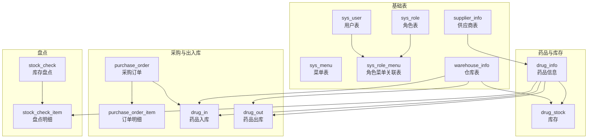
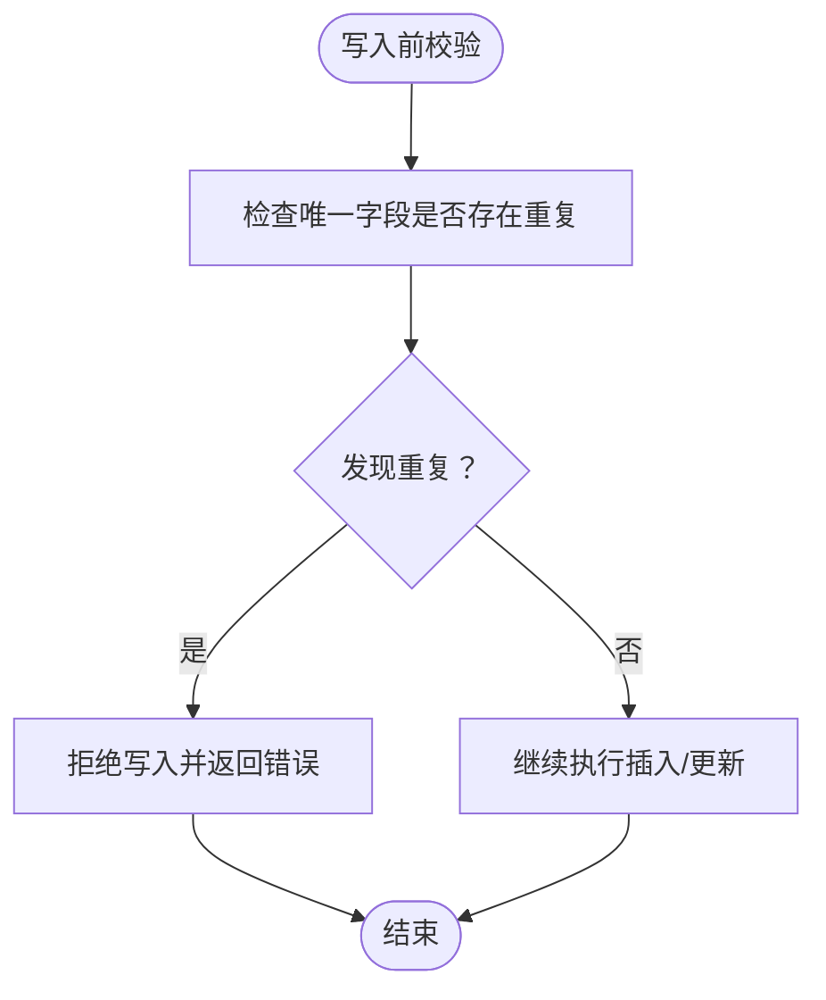
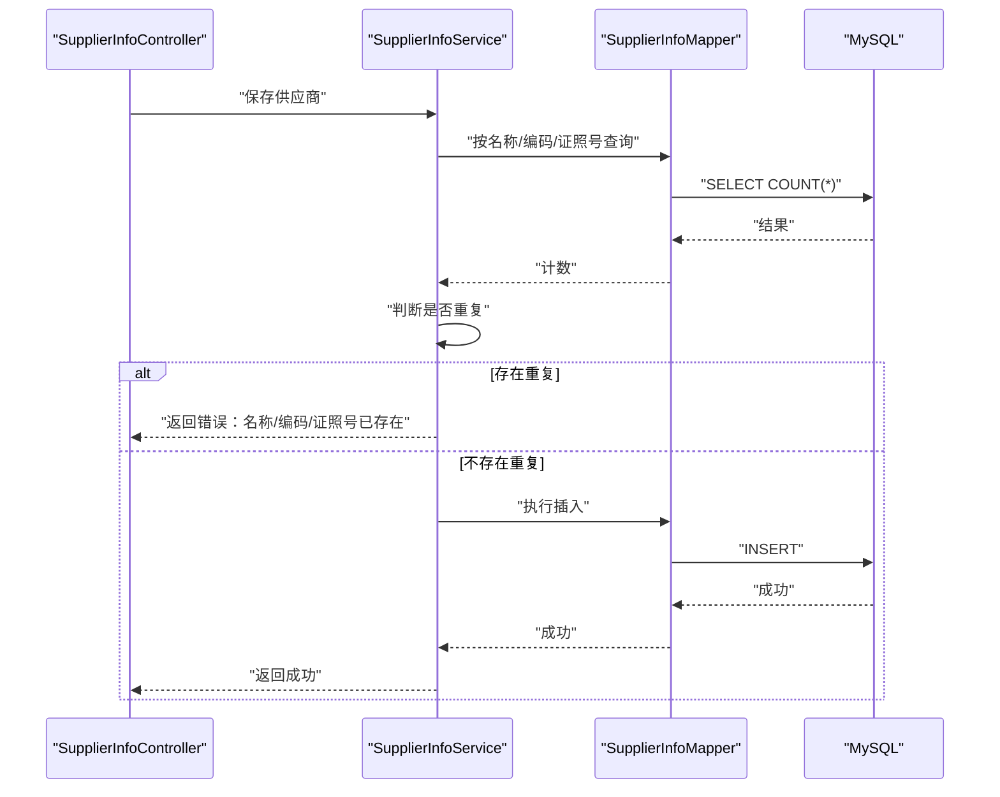
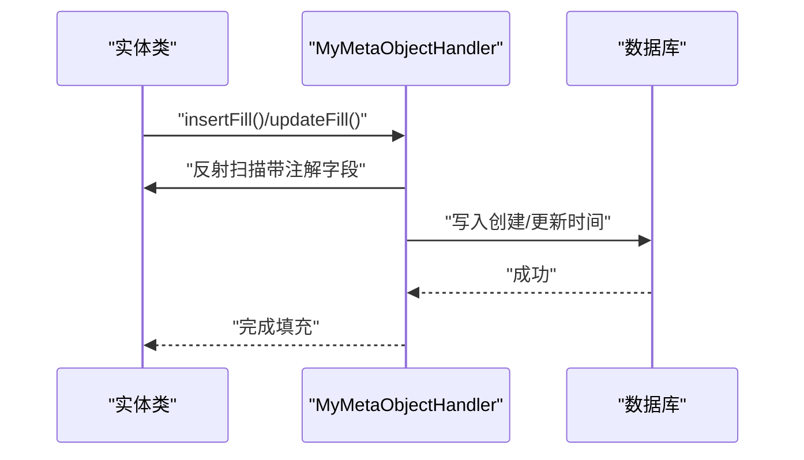

# 数据完整性约束

<cite>
**本文引用的文件**
- [init.sql](file://src/main/resources/db/init.sql)
- [hospital_drug.sql](file://hospital_drug.sql)
- [application.yml](file://src/main/resources/application.yml)
- [MyMetaObjectHandler.java](file://src/main/java/com/hospital/drugmanagement/common/handler/MyMetaObjectHandler.java)
- [AutoFill.java](file://src/main/java/com/hospital/drugmanagement/common/anno/AutoFill.java)
- [SysUser.java](file://src/main/java/com/hospital/drugmanagement/entity/SysUser.java)
- [SysRole.java](file://src/main/java/com/hospital/drugmanagement/entity/SysRole.java)
- [SupplierInfo.java](file://src/main/java/com/hospital/drugmanagement/entity/SupplierInfo.java)
- [WarehouseInfo.java](file://src/main/java/com/hospital/drugmanagement/entity/WarehouseInfo.java)
- [DrugInfo.java](file://src/main/java/com/hospital/drugmanagement/entity/DrugInfo.java)
- [PurchaseOrder.java](file://src/main/java/com/hospital/drugmanagement/entity/PurchaseOrder.java)
- [DrugIn.java](file://src/main/java/com/hospital/drugmanagement/entity/DrugIn.java)
- [DrugOut.java](file://src/main/java/com/hospital/drugmanagement/entity/DrugOut.java)
- [StockCheck.java](file://src/main/java/com/hospital/drugmanagement/entity/StockCheck.java)
- [StockCheckItem.java](file://src/main/java/com/hospital/drugmanagement/entity/StockCheckItem.java)
- [SupplierInfoController.java](file://src/main/java/com/hospital/drugmanagement/controller/SupplierInfoController.java)
</cite>

## 目录
1. [简介](#简介)
2. [项目结构与数据模型概览](#项目结构与数据模型概览)
3. [核心约束设计原则](#核心约束设计原则)
4. [主键约束设计](#主键约束设计)
5. [唯一约束与索引设计](#唯一约束与索引设计)
6. [外键约束与参照完整性](#外键约束与参照完整性)
7. [检查约束与业务规则](#检查约束与业务规则)
8. [索引设计策略与性能优化](#索引设计策略与性能优化)
9. [数据质量保障机制](#数据质量保障机制)
10. [架构与流程图](#架构与流程图)
11. [故障排查指南](#故障排查指南)
12. [结论](#结论)

## 简介
本文件面向“数据完整性约束”主题，系统梳理该药物管理系统在数据库层面的约束设计与实现策略。内容覆盖主键/唯一/外键/检查约束的设计原则、索引策略、性能优化、数据质量保障机制，并结合实体类与初始化脚本给出可落地的实施建议。

## 项目结构与数据模型概览
系统采用前后端分离架构，后端基于 Spring Boot + MyBatis-Plus，数据库初始化脚本定义了完整的业务表结构与约束。核心模块包括：用户与角色、供应商、仓库、药品、采购、出入库、盘点等。



图表来源
- [init.sql:8-312](file://src/main/resources/db/init.sql#L8-L312)
- [hospital_drug.sql:20-306](file://hospital_drug.sql#L20-L306)

章节来源
- [init.sql:1-312](file://src/main/resources/db/init.sql#L1-L312)
- [hospital_drug.sql:1-307](file://hospital_drug.sql#L1-L307)

## 核心约束设计原则
- 唯一性优先：对业务标识（如编码、单号、用户名）建立唯一约束，确保全局唯一。
- 引擎与字符集：统一使用 InnoDB 与 utf8mb4，支持事务与更广字符集。
- 时间戳一致性：通过自动填充与触发器/框架能力保持创建/更新时间一致。
- 参照完整性：通过外键与业务校验共同保证引用数据有效。
- 查询性能：围绕高频过滤字段建立索引，避免全表扫描。

章节来源
- [init.sql:1-30](file://src/main/resources/db/init.sql#L1-L30)
- [application.yml:1-24](file://src/main/resources/application.yml#L1-L24)

## 主键约束设计
- 设计原则
  - 使用自增主键（BIGINT），保证全局唯一且有序，便于范围查询与分页。
  - 避免跨表共享同一序列，确保各表主键独立性。
- 实施要点
  - 所有业务表均采用自增主键，如用户、角色、供应商、仓库、药品、订单、出入库、盘点等。
  - MyBatis-Plus 在实体类中以注解声明主键类型，确保 ORM 映射正确。

```mermaid
classDiagram
class SysUser {
+Long userId
+String username
+String password
+Integer status
}
class SysRole {
+Long roleId
+String roleName
+String roleCode
}
class SupplierInfo {
+Long supplierId
+String supplierCode
+String supplierName
}
class WarehouseInfo {
+Long warehouseId
+String warehouseCode
+String warehouseName
}
class DrugInfo {
+Long drugId
+String drugCode
+String drugName
}
class PurchaseOrder {
+Long orderId
+String orderNo
}
class DrugIn {
+Long inId
+String inNo
}
class DrugOut {
+Long outId
+String outNo
}
class StockCheck {
+Long checkId
+String checkNo
}
class StockCheckItem {
+Long itemId
}
SysUser <|-- SysRole
SupplierInfo --> DrugInfo : "外键 : supplier_id"
WarehouseInfo --> DrugStock : "外键 : warehouse_id"
DrugInfo --> DrugStock : "外键 : drug_id"
PurchaseOrder --> PurchaseOrderItem : "外键 : order_id"
PurchaseOrder --> DrugIn : "外键 : order_id"
DrugInfo --> DrugIn : "外键 : drug_id"
WarehouseInfo --> DrugIn : "外键 : warehouse_id"
DrugInfo --> DrugOut : "外键 : drug_id"
WarehouseInfo --> DrugOut : "外键 : warehouse_id"
StockCheck --> StockCheckItem : "外键 : check_id"
DrugInfo --> StockCheckItem : "外键 : drug_id"
```

图表来源
- [SysUser.java:12-40](file://src/main/java/com/hospital/drugmanagement/entity/SysUser.java#L12-L40)
- [SysRole.java:12-30](file://src/main/java/com/hospital/drugmanagement/entity/SysRole.java#L12-L30)
- [SupplierInfo.java:12-38](file://src/main/java/com/hospital/drugmanagement/entity/SupplierInfo.java#L12-L38)
- [WarehouseInfo.java:12-36](file://src/main/java/com/hospital/drugmanagement/entity/WarehouseInfo.java#L12-L36)
- [DrugInfo.java:9-51](file://src/main/java/com/hospital/drugmanagement/entity/DrugInfo.java#L9-L51)
- [PurchaseOrder.java:13-39](file://src/main/java/com/hospital/drugmanagement/entity/PurchaseOrder.java#L13-L39)
- [DrugIn.java:14-44](file://src/main/java/com/hospital/drugmanagement/entity/DrugIn.java#L14-L44)
- [DrugOut.java:14-43](file://src/main/java/com/hospital/drugmanagement/entity/DrugOut.java#L14-L43)
- [StockCheck.java:13-39](file://src/main/java/com/hospital/drugmanagement/entity/StockCheck.java#L13-L39)
- [StockCheckItem.java:9-29](file://src/main/java/com/hospital/drugmanagement/entity/StockCheckItem.java#L9-L29)

章节来源
- [init.sql:8-110](file://src/main/resources/db/init.sql#L8-L110)
- [hospital_drug.sql:20-306](file://hospital_drug.sql#L20-L306)
- [SysUser.java:12-40](file://src/main/java/com/hospital/drugmanagement/entity/SysUser.java#L12-L40)
- [SysRole.java:12-30](file://src/main/java/com/hospital/drugmanagement/entity/SysRole.java#L12-L30)
- [SupplierInfo.java:12-38](file://src/main/java/com/hospital/drugmanagement/entity/SupplierInfo.java#L12-L38)
- [WarehouseInfo.java:12-36](file://src/main/java/com/hospital/drugmanagement/entity/WarehouseInfo.java#L12-L36)
- [DrugInfo.java:9-51](file://src/main/java/com/hospital/drugmanagement/entity/DrugInfo.java#L9-L51)
- [PurchaseOrder.java:13-39](file://src/main/java/com/hospital/drugmanagement/entity/PurchaseOrder.java#L13-L39)
- [DrugIn.java:14-44](file://src/main/java/com/hospital/drugmanagement/entity/DrugIn.java#L14-L44)
- [DrugOut.java:14-43](file://src/main/java/com/hospital/drugmanagement/entity/DrugOut.java#L14-L43)
- [StockCheck.java:13-39](file://src/main/java/com/hospital/drugmanagement/entity/StockCheck.java#L13-L39)
- [StockCheckItem.java:9-29](file://src/main/java/com/hospital/drugmanagement/entity/StockCheckItem.java#L9-L29)

## 唯一约束与索引设计
- 唯一约束
  - 用户名、角色编码、供应商编码、仓库编码、药品编码、订单号、入库单号、出库单号、盘点单号等均设置唯一约束，防止重复标识。
- 索引设计
  - 高频过滤字段建立单列索引：如药品表的 supplier_id，出入库表的 drug_id、warehouse_id，订单表的 supplier_id，盘点表的 warehouse_id 等。
  - 复合唯一索引：角色菜单关联表使用 (role_id, menu_id) 组合作为唯一索引，避免重复授权。
- 实施依据
  - 初始化脚本与导出 SQL 中明确声明唯一约束与索引。



图表来源
- [init.sql:10-22](file://src/main/resources/db/init.sql#L10-L22)
- [hospital_drug.sql:24-266](file://hospital_drug.sql#L24-L266)

章节来源
- [init.sql:10-22](file://src/main/resources/db/init.sql#L10-L22)
- [hospital_drug.sql:24-266](file://hospital_drug.sql#L24-L266)

## 外键约束与参照完整性
- 外键关系
  - 药品信息关联供应商（supplier_id）
  - 库存记录关联药品与仓库（drug_id、warehouse_id）
  - 采购订单明细、入库单、出库单均关联药品与仓库
  - 盘点明细关联盘点单与药品
- 参照完整性保障
  - 数据库层：通过唯一约束与索引保证引用字段存在性（虽然未显式声明外键，但通过唯一索引与业务校验形成约束闭环）。
  - 应用层：控制器在新增供应商时进行名称/编码/证照号重复校验，减少脏数据进入。
- 级联操作
  - 当前脚本未启用外键级联删除/更新，避免误删引发的级联影响；业务上通过状态字段与流程控制替代级联。



图表来源
- [SupplierInfoController.java:66-90](file://src/main/java/com/hospital/drugmanagement/controller/SupplierInfoController.java#L66-L90)
- [init.sql:82-95](file://src/main/resources/db/init.sql#L82-L95)
- [hospital_drug.sql:204-220](file://hospital_drug.sql#L204-L220)

章节来源
- [SupplierInfoController.java:66-90](file://src/main/java/com/hospital/drugmanagement/controller/SupplierInfoController.java#L66-L90)
- [init.sql:82-95](file://src/main/resources/db/init.sql#L82-L95)
- [hospital_drug.sql:204-220](file://hospital_drug.sql#L204-L220)

## 检查约束与业务规则
- 业务规则实现
  - 状态字段：用户/角色/供应商/仓库/药品/订单/盘点等均包含状态字段，用于表示启用/禁用或流程状态，配合应用层状态机控制。
  - 金额与单价：使用 DECIMAL 类型存储价格与金额，避免浮点误差。
  - 数量与预警：库存数量与预警值字段用于库存管理与提醒。
- 数据有效性验证
  - 控制器层对关键字段进行非空与重复性校验（如供应商名称/编码/证照号）。
  - 实体类字段类型与精度由数据库定义，确保输入范围合理。
- 检查约束建议
  - 对于状态枚举值、正数阈值（数量/金额）、日期先后（生产日期/有效期）等，可在数据库层补充 CHECK 约束以进一步加固。

章节来源
- [init.sql:60-125](file://src/main/resources/db/init.sql#L60-L125)
- [hospital_drug.sql:62-127](file://hospital_drug.sql#L62-L127)
- [SupplierInfoController.java:66-90](file://src/main/java/com/hospital/drugmanagement/controller/SupplierInfoController.java#L66-L90)

## 索引设计策略与性能优化
- 单列索引
  - 针对高频过滤字段建立索引：drug_info(supplier_id)、drug_stock(drug_id/warehouse_id)、purchase_order(supplier_id)、drug_in/drug_out(drug_id/warehouse_id)、stock_check(warehouse_id)、stock_check_item(check_id/drug_id) 等。
- 复合索引
  - 角色菜单关联表使用 (role_id, menu_id) 复合唯一索引，避免重复授权同时支持快速查找。
- 性能优化建议
  - 避免过度索引导致写入性能下降；定期评估索引使用率。
  - 对于频繁范围查询的日期字段（如订单日期、出入库日期），结合复合索引优化。
  - 使用 EXPLAIN 分析慢查询，针对性调整索引与 SQL。

章节来源
- [init.sql:79-224](file://src/main/resources/db/init.sql#L79-L224)
- [hospital_drug.sql:34-200](file://hospital_drug.sql#L34-L200)

## 数据质量保障机制
- 自动时间戳填充
  - 通过 MyBatis-Plus 元对象处理器在插入/更新时自动填充创建/更新时间，保证时间字段一致性。
- 注解驱动的自动填充
  - 使用自定义注解标记需要自动填充的字段，处理器遍历反射填充，避免遗漏。
- 控制器层重复性校验
  - 在新增供应商时，对名称、编码、证照号进行重复性检查，从源头拦截重复数据。
- 数据库层约束
  - 唯一约束与索引确保标识唯一与高效检索；状态字段与业务流程共同维护数据有效性。



图表来源
- [MyMetaObjectHandler.java:21-32](file://src/main/java/com/hospital/drugmanagement/common/handler/MyMetaObjectHandler.java#L21-L32)
- [AutoFill.java:9-15](file://src/main/java/com/hospital/drugmanagement/common/anno/AutoFill.java#L9-L15)

章节来源
- [MyMetaObjectHandler.java:1-60](file://src/main/java/com/hospital/drugmanagement/common/handler/MyMetaObjectHandler.java#L1-L60)
- [AutoFill.java:1-15](file://src/main/java/com/hospital/drugmanagement/common/anno/AutoFill.java#L1-L15)
- [application.yml:18-24](file://src/main/resources/application.yml#L18-L24)

## 架构与流程图
- 数据约束关系图（基于实际表结构）
```mermaid
erDiagram
SYS_USER {
bigint user_id PK
varchar username UK
varchar password
bigint role_id
int status
}
SYS_ROLE {
bigint role_id PK
varchar role_name
varchar role_code UK
}
SYS_MENU {
bigint menu_id PK
varchar menu_name
bigint parent_id
}
SYS_ROLE_MENU {
bigint id PK
bigint role_id
bigint menu_id
unique uk_role_menu (role_id, menu_id)
}
SUPPLIER_INFO {
bigint supplier_id PK
varchar supplier_code UK
varchar supplier_name
}
WAREHOUSE_INFO {
bigint warehouse_id PK
varchar warehouse_code UK
varchar warehouse_name
}
DRUG_INFO {
bigint drug_id PK
varchar drug_code UK
varchar drug_name
bigint supplier_id
}
DRUG_STOCK {
bigint stock_id PK
bigint drug_id
bigint warehouse_id
int quantity
}
PURCHASE_ORDER {
bigint order_id PK
varchar order_no UK
}
PURCHASE_ORDER_ITEM {
bigint item_id PK
bigint order_id
bigint drug_id
int purchase_num
decimal purchase_price
decimal amount
}
DRUG_IN {
bigint in_id PK
varchar in_no UK
bigint order_id
bigint drug_id
bigint warehouse_id
int quantity
}
DRUG_OUT {
bigint out_id PK
varchar out_no UK
bigint drug_id
bigint warehouse_id
int quantity
}
STOCK_CHECK {
bigint check_id PK
varchar check_no UK
bigint warehouse_id
}
STOCK_CHECK_ITEM {
bigint item_id PK
bigint check_id
bigint drug_id
int system_quantity
int actual_quantity
int difference
}
SYS_USER }o--|| SYS_ROLE : "role_id"
SYS_ROLE ||--o{ SYS_ROLE_MENU : "role_id"
SYS_MENU ||--o{ SYS_ROLE_MENU : "menu_id"
SUPPLIER_INFO ||--o{ DRUG_INFO : "supplier_id"
WAREHOUSE_INFO ||--o{ DRUG_STOCK : "warehouse_id"
DRUG_INFO ||--o{ DRUG_STOCK : "drug_id"
PURCHASE_ORDER ||--o{ PURCHASE_ORDER_ITEM : "order_id"
PURCHASE_ORDER ||--o{ DRUG_IN : "order_id"
DRUG_INFO ||--o{ DRUG_IN : "drug_id"
WAREHOUSE_INFO ||--o{ DRUG_IN : "warehouse_id"
DRUG_INFO ||--o{ DRUG_OUT : "drug_id"
WAREHOUSE_INFO ||--o{ DRUG_OUT : "warehouse_id"
STOCK_CHECK ||--o{ STOCK_CHECK_ITEM : "check_id"
DRUG_INFO ||--o{ STOCK_CHECK_ITEM : "drug_id"
```

图表来源
- [init.sql:8-224](file://src/main/resources/db/init.sql#L8-L224)
- [hospital_drug.sql:20-200](file://hospital_drug.sql#L20-L200)

## 故障排查指南
- 唯一约束冲突
  - 现象：插入/更新时报唯一键冲突。
  - 排查：确认唯一字段（用户名、角色编码、供应商编码、仓库编码、药品编码、订单号、入库/出库/盘点单号）是否重复；检查控制器重复性校验逻辑。
- 外键引用异常
  - 现象：引用字段无法匹配到目标记录。
  - 排查：确认被引用表记录是否存在；检查索引是否缺失；必要时补充外键约束或在应用层增加引用校验。
- 写入性能问题
  - 现象：批量写入缓慢。
  - 排查：检查索引数量与类型；使用事务批量提交；分析慢查询并优化索引。
- 时间字段异常
  - 现象：创建/更新时间为空或不一致。
  - 排查：确认自动填充注解与处理器是否生效；检查实体类字段映射与注解使用。

章节来源
- [init.sql:10-22](file://src/main/resources/db/init.sql#L10-L22)
- [hospital_drug.sql:24-266](file://hospital_drug.sql#L24-L266)
- [MyMetaObjectHandler.java:21-32](file://src/main/java/com/hospital/drugmanagement/common/handler/MyMetaObjectHandler.java#L21-L32)
- [SupplierInfoController.java:66-90](file://src/main/java/com/hospital/drugmanagement/controller/SupplierInfoController.java#L66-L90)

## 结论
本项目在数据库层面通过唯一约束、索引与应用层校验实现了较强的数据完整性保障；主键采用自增策略，确保全局唯一与有序性；外键关系通过索引与业务校验维持参照完整性；状态字段与 DECIMAL 类型强化了业务规则与数值精度。建议在满足性能的前提下逐步引入 CHECK 约束与显式外键约束，进一步提升数据一致性与可维护性。