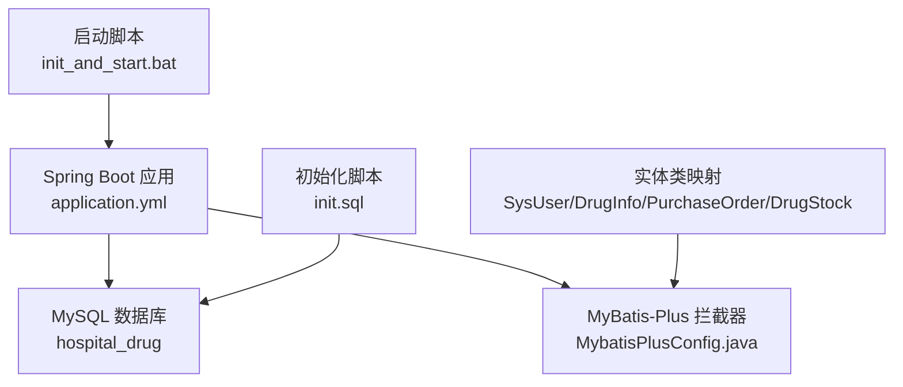
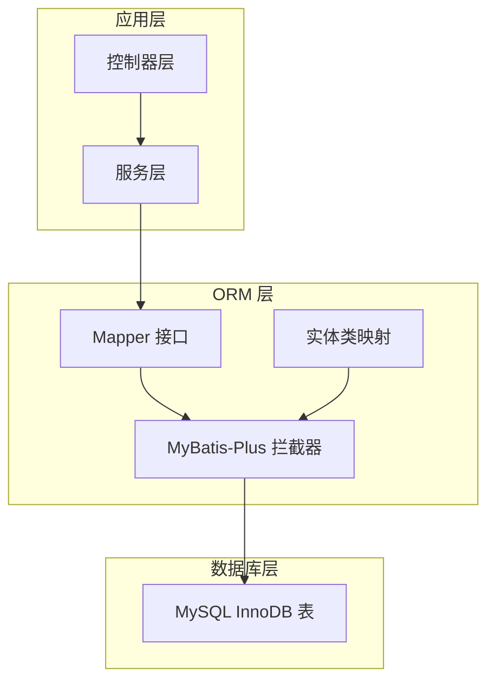
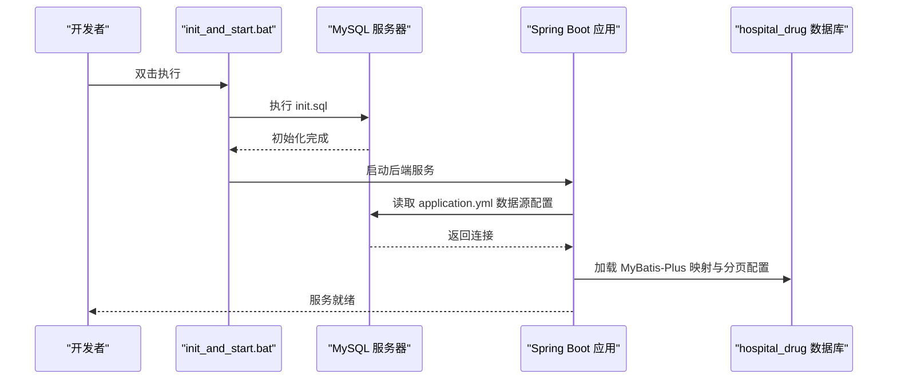
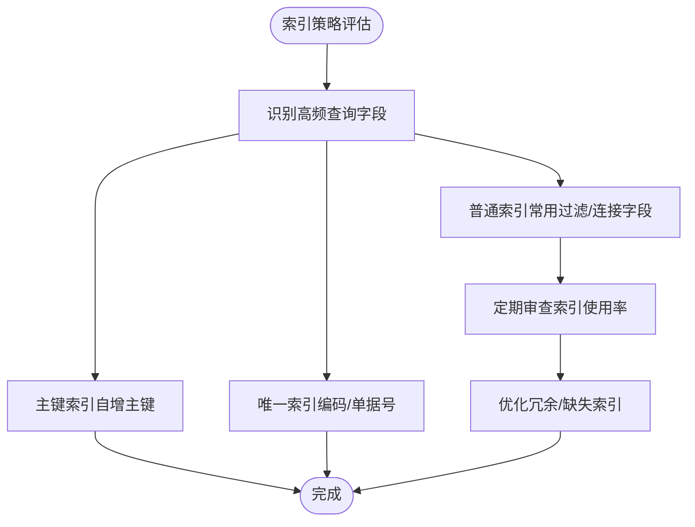
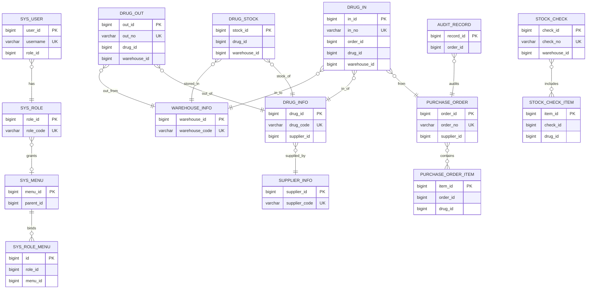
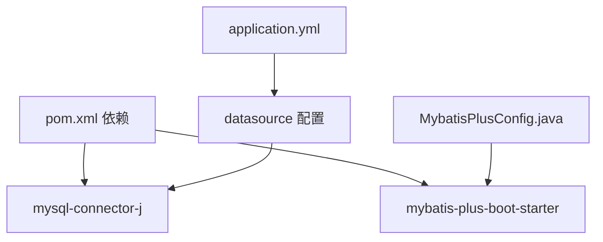

# 数据库概览

<cite>
**本文引用的文件**
- [application.yml](file://src/main/resources/application.yml)
- [init.sql](file://src/main/resources/db/init.sql)
- [hospital_drug.sql](file://hospital_drug.sql)
- [init_and_start.bat](file://init_and_start.bat)
- [MybatisPlusConfig.java](file://src/main/java/com/hospital/drugmanagement/config/MybatisPlusConfig.java)
- [pom.xml](file://pom.xml)
- [SysUser.java](file://src/main/java/com/hospital/drugmanagement/entity/SysUser.java)
- [DrugInfo.java](file://src/main/java/com/hospital/drugmanagement/entity/DrugInfo.java)
- [PurchaseOrder.java](file://src/main/java/com/hospital/drugmanagement/entity/PurchaseOrder.java)
- [DrugStock.java](file://src/main/java/com/hospital/drugmanagement/entity/DrugStock.java)
</cite>

## 目录
1. [简介](#简介)
2. [项目结构](#项目结构)
3. [核心组件](#核心组件)
4. [架构总览](#架构总览)
5. [详细组件分析](#详细组件分析)
6. [依赖分析](#依赖分析)
7. [性能考虑](#性能考虑)
8. [故障排查指南](#故障排查指南)
9. [结论](#结论)
10. [附录](#附录)

## 简介
本文件面向医院药品管理系统，系统采用 Spring Boot + MyBatis-Plus + MySQL 技术栈，数据库层以 MySQL 为核心，使用 utf8mb4 字符集与 InnoDB 引擎，提供完整的数据库初始化脚本、命名规范、索引策略、初始化流程与基础监控建议。本文档旨在帮助开发者与运维人员快速理解数据库整体设计与运行方式。

## 项目结构
数据库相关的关键文件分布如下：
- 配置与启动：application.yml（数据源与 MyBatis-Plus 配置）、init_and_start.bat（初始化并启动后端）
- 初始化脚本：init.sql（完整建表与初始化数据）、hospital_drug.sql（Navicat 导出的结构定义）
- ORM 配置：MybatisPlusConfig.java（分页拦截器）
- 实体映射：SysUser、DrugInfo、PurchaseOrder、DrugStock 等实体类（表名与字段映射）

图表来源
- [application.yml:1-24](file://src/main/resources/application.yml#L1-L24)
- [init.sql:1-312](file://src/main/resources/db/init.sql#L1-L312)
- [init_and_start.bat:1-11](file://init_and_start.bat#L1-L11)
- [MybatisPlusConfig.java:1-16](file://src/main/java/com/hospital/drugmanagement/config/MybatisPlusConfig.java#L1-L16)
- [SysUser.java:1-130](file://src/main/java/com/hospital/drugmanagement/entity/SysUser.java#L1-L130)
- [DrugInfo.java:1-167](file://src/main/java/com/hospital/drugmanagement/entity/DrugInfo.java#L1-L167)
- [PurchaseOrder.java:1-40](file://src/main/java/com/hospital/drugmanagement/entity/PurchaseOrder.java#L1-L40)
- [DrugStock.java:1-39](file://src/main/java/com/hospital/drugmanagement/entity/DrugStock.java#L1-L39)

章节来源
- [application.yml:1-24](file://src/main/resources/application.yml#L1-L24)
- [init.sql:1-312](file://src/main/resources/db/init.sql#L1-L312)
- [init_and_start.bat:1-11](file://init_and_start.bat#L1-L11)

## 核心组件
- 数据库选择与字符集
  - 使用 MySQL 8.0，字符集为 utf8mb4，排序规则为 utf8mb4_unicode_ci 或 utf8mb4_0900_ai_ci，确保支持完整的 Unicode 与表情符号。
  - 初始化脚本显式指定 DEFAULT CHARACTER SET utf8mb4，保证新建库与表统一字符集。
- 表引擎与事务
  - 全部使用 InnoDB 引擎，支持事务、外键与行级锁，满足业务一致性需求。
- 初始化脚本
  - 提供完整建表与初始化数据（角色、用户、菜单、药品、供应商、仓库、库存等），便于快速部署。
- ORM 与分页
  - MyBatis-Plus 配置启用分页拦截器，简化分页查询；application.yml 开启下划线到驼峰映射，提升开发体验。
- 启动流程
  - init_and_start.bat 自动执行 init.sql 并启动 Spring Boot 应用，实现“一键初始化”。

章节来源
- [init.sql:3-4](file://src/main/resources/db/init.sql#L3-L4)
- [init.sql:10-22](file://src/main/resources/db/init.sql#L10-L22)
- [init.sql:60-80](file://src/main/resources/db/init.sql#L60-L80)
- [application.yml:18-24](file://src/main/resources/application.yml#L18-L24)
- [MybatisPlusConfig.java:8-16](file://src/main/java/com/hospital/drugmanagement/config/MybatisPlusConfig.java#L8-L16)
- [init_and_start.bat:3-9](file://init_and_start.bat#L3-L9)

## 架构总览
系统数据库层采用“应用层 + ORM 层 + MySQL 层”的三层架构，数据流从控制器经服务层进入 Mapper，最终落到 InnoDB 表。

图表来源
- [MybatisPlusConfig.java:8-16](file://src/main/java/com/hospital/drugmanagement/config/MybatisPlusConfig.java#L8-L16)
- [SysUser.java:13-40](file://src/main/java/com/hospital/drugmanagement/entity/SysUser.java#L13-L40)
- [DrugInfo.java:9-51](file://src/main/java/com/hospital/drugmanagement/entity/DrugInfo.java#L9-L51)
- [PurchaseOrder.java:14-39](file://src/main/java/com/hospital/drugmanagement/entity/PurchaseOrder.java#L14-L39)
- [DrugStock.java:14-38](file://src/main/java/com/hospital/drugmanagement/entity/DrugStock.java#L14-L38)

## 详细组件分析

### 数据库初始化流程
- 执行顺序
  1) 连接 MySQL，执行 init.sql（创建库、建表、插入初始化数据）
  2) 启动 Spring Boot 应用，加载 application.yml 中的数据源与 MyBatis-Plus 配置
- 关键要点
  - 字符集与排序规则在库与表层面均明确设置
  - 唯一约束覆盖主键、编码字段与单据号字段，保证业务唯一性
  - 常用查询字段建立索引，如 supplier_id、drug_id、warehouse_id、order_id 等

图表来源
- [init_and_start.bat:3-9](file://init_and_start.bat#L3-L9)
- [application.yml:3-7](file://src/main/resources/application.yml#L3-L7)
- [application.yml:18-24](file://src/main/resources/application.yml#L18-L24)
- [init.sql:1-312](file://src/main/resources/db/init.sql#L1-L312)

章节来源
- [init_and_start.bat:1-11](file://init_and_start.bat#L1-L11)
- [application.yml:1-24](file://src/main/resources/application.yml#L1-L24)
- [init.sql:1-312](file://src/main/resources/db/init.sql#L1-L312)

### 数据库命名规范与表前缀设计
- 命名规范
  - 表名与字段采用下划线命名法，与 MyBatis-Plus 下划线转驼峰映射一致
  - 主键统一使用自增 id（如 user_id、role_id、drug_id 等）
  - 单据号字段统一使用带业务含义的前缀（如 order_no、in_no、out_no、check_no）
- 表前缀
  - 系统管理类：sys_（sys_user、sys_role、sys_menu、sys_role_menu）
  - 业务类：drug_、supplier_、warehouse_、purchase_、stock_、audit_ 等
- 唯一性
  - 编码类字段（drug_code、supplier_code、warehouse_code）与单据号（order_no、in_no、out_no、check_no）均设置唯一索引

章节来源
- [init.sql:8-22](file://src/main/resources/db/init.sql#L8-L22)
- [init.sql:24-33](file://src/main/resources/db/init.sql#L24-L33)
- [init.sql:35-48](file://src/main/resources/db/init.sql#L35-L48)
- [init.sql:60-80](file://src/main/resources/db/init.sql#L60-L80)
- [init.sql:82-95](file://src/main/resources/db/init.sql#L82-L95)
- [init.sql:97-109](file://src/main/resources/db/init.sql#L97-L109)
- [init.sql:111-125](file://src/main/resources/db/init.sql#L111-L125)
- [init.sql:127-141](file://src/main/resources/db/init.sql#L127-L141)
- [init.sql:143-155](file://src/main/resources/db/init.sql#L143-L155)
- [init.sql:157-175](file://src/main/resources/db/init.sql#L157-L175)
- [init.sql:177-194](file://src/main/resources/db/init.sql#L177-L194)
- [init.sql:196-224](file://src/main/resources/db/init.sql#L196-L224)
- [init.sql:226-238](file://src/main/resources/db/init.sql#L226-L238)

### 索引策略
- 主键索引：所有表主键均为自增主键，天然具备主键索引
- 唯一索引：编码字段与单据号字段设置唯一索引，保障业务唯一性
- 普通索引：围绕高频查询字段建立索引
  - 药品信息：idx_supplier_id（供应商筛选）
  - 库存：idx_drug_id、idx_warehouse_id（按药品/仓库查询）
  - 采购订单：idx_supplier_id（供应商维度统计）
  - 采购订单明细：idx_order_id、idx_drug_id（按订单/药品聚合）
  - 入库/出库：idx_drug_id、idx_warehouse_id（按药品/仓库检索）
  - 库存盘点：idx_warehouse_id（按仓库盘点）
  - 审核记录：idx_order_id（按订单审核追踪）

图表来源
- [init.sql:79](file://src/main/resources/db/init.sql#L79)
- [init.sql:123](file://src/main/resources/db/init.sql#L123)
- [init.sql:140](file://src/main/resources/db/init.sql#L140)
- [init.sql:153](file://src/main/resources/db/init.sql#L153)
- [init.sql:173](file://src/main/resources/db/init.sql#L173)
- [init.sql:192](file://src/main/resources/db/init.sql#L192)
- [init.sql:208](file://src/main/resources/db/init.sql#L208)
- [init.sql:237](file://src/main/resources/db/init.sql#L237)

章节来源
- [init.sql:79](file://src/main/resources/db/init.sql#L79)
- [init.sql:123](file://src/main/resources/db/init.sql#L123)
- [init.sql:140](file://src/main/resources/db/init.sql#L140)
- [init.sql:153](file://src/main/resources/db/init.sql#L153)
- [init.sql:173](file://src/main/resources/db/init.sql#L173)
- [init.sql:192](file://src/main/resources/db/init.sql#L192)
- [init.sql:208](file://src/main/resources/db/init.sql#L208)
- [init.sql:237](file://src/main/resources/db/init.sql#L237)

### 数据字典概览
以下为系统核心表的简要说明（字段与索引以 init.sql 为准）：

- 系统用户表 sys_user
  - 主键：user_id
  - 唯一：username
  - 索引：无（常用按角色/状态查询可按需扩展）
- 系统角色表 sys_role
  - 主键：role_id
  - 唯一：role_code
- 系统菜单表 sys_menu
  - 主键：menu_id
  - 无唯一/索引（按树形结构与权限控制）
- 角色菜单关联表 sys_role_menu
  - 主键：id
  - 唯一：uk_role_menu(role_id, menu_id)
- 药品信息表 drug_info
  - 主键：drug_id
  - 唯一：drug_code
  - 索引：idx_supplier_id
- 供应商信息表 supplier_info
  - 主键：supplier_id
  - 唯一：supplier_code
- 仓库信息表 warehouse_info
  - 主键：warehouse_id
  - 唯一：warehouse_code
- 药品库存表 drug_stock
  - 主键：stock_id
  - 索引：idx_drug_id、idx_warehouse_id
- 采购订单表 purchase_order
  - 主键：order_id
  - 唯一：order_no
  - 索引：idx_supplier_id
- 采购订单明细表 purchase_order_item
  - 主键：item_id
  - 索引：idx_order_id、idx_drug_id
- 药品入库表 drug_in
  - 主键：in_id
  - 唯一：in_no
  - 索引：idx_drug_id、idx_warehouse_id
- 药品出库表 drug_out
  - 主键：out_id
  - 唯一：out_no
  - 索引：idx_drug_id、idx_warehouse_id
- 库存盘点表 stock_check
  - 主键：check_id
  - 唯一：check_no
  - 索引：idx_warehouse_id
- 库存盘点明细表 stock_check_item
  - 主键：item_id
  - 索引：idx_check_id、idx_drug_id
- 审核记录表 audit_record
  - 主键：record_id
  - 索引：idx_order_id

章节来源
- [init.sql:8-22](file://src/main/resources/db/init.sql#L8-L22)
- [init.sql:24-33](file://src/main/resources/db/init.sql#L24-L33)
- [init.sql:35-48](file://src/main/resources/db/init.sql#L35-L48)
- [init.sql:50-58](file://src/main/resources/db/init.sql#L50-L58)
- [init.sql:60-80](file://src/main/resources/db/init.sql#L60-L80)
- [init.sql:82-95](file://src/main/resources/db/init.sql#L82-L95)
- [init.sql:97-109](file://src/main/resources/db/init.sql#L97-L109)
- [init.sql:111-125](file://src/main/resources/db/init.sql#L111-L125)
- [init.sql:127-141](file://src/main/resources/db/init.sql#L127-L141)
- [init.sql:143-155](file://src/main/resources/db/init.sql#L143-L155)
- [init.sql:157-175](file://src/main/resources/db/init.sql#L157-L175)
- [init.sql:177-194](file://src/main/resources/db/init.sql#L177-L194)
- [init.sql:196-224](file://src/main/resources/db/init.sql#L196-L224)
- [init.sql:226-238](file://src/main/resources/db/init.sql#L226-L238)

### 表关系总览图

图表来源
- [init.sql:8-22](file://src/main/resources/db/init.sql#L8-L22)
- [init.sql:24-33](file://src/main/resources/db/init.sql#L24-L33)
- [init.sql:35-48](file://src/main/resources/db/init.sql#L35-L48)
- [init.sql:50-58](file://src/main/resources/db/init.sql#L50-L58)
- [init.sql:60-80](file://src/main/resources/db/init.sql#L60-L80)
- [init.sql:82-95](file://src/main/resources/db/init.sql#L82-L95)
- [init.sql:97-109](file://src/main/resources/db/init.sql#L97-L109)
- [init.sql:111-125](file://src/main/resources/db/init.sql#L111-L125)
- [init.sql:127-141](file://src/main/resources/db/init.sql#L127-L141)
- [init.sql:143-155](file://src/main/resources/db/init.sql#L143-L155)
- [init.sql:157-175](file://src/main/resources/db/init.sql#L157-L175)
- [init.sql:177-194](file://src/main/resources/db/init.sql#L177-L194)
- [init.sql:196-224](file://src/main/resources/db/init.sql#L196-L224)
- [init.sql:226-238](file://src/main/resources/db/init.sql#L226-L238)

## 依赖分析
- 数据源与驱动
  - application.yml 指定 MySQL 驱动与 JDBC URL（含时区与时序参数）
  - pom.xml 引入 mysql-connector-j 与 MyBatis-Plus 启动器
- ORM 与分页
  - MybatisPlusConfig 注册分页拦截器，配合 application.yml 的下划线转驼峰映射
- 启动与初始化
  - init_and_start.bat 串联数据库初始化与应用启动

图表来源
- [pom.xml:45-64](file://pom.xml#L45-L64)
- [application.yml:3-7](file://src/main/resources/application.yml#L3-L7)
- [MybatisPlusConfig.java:8-16](file://src/main/java/com/hospital/drugmanagement/config/MybatisPlusConfig.java#L8-L16)

章节来源
- [pom.xml:45-64](file://pom.xml#L45-L64)
- [application.yml:3-7](file://src/main/resources/application.yml#L3-L7)
- [MybatisPlusConfig.java:8-16](file://src/main/java/com/hospital/drugmanagement/config/MybatisPlusConfig.java#L8-L16)

## 性能考虑
- 字符集与排序规则
  - 统一使用 utf8mb4，避免表情与多字节字符问题；排序规则采用 utf8mb4_unicode_ci 或 utf8mb4_0900_ai_ci，兼顾排序与比较效率
- 索引策略
  - 已针对高频查询字段建立索引；建议结合慢查询日志与 EXPLAIN 分析，持续优化
- 查询与分页
  - MyBatis-Plus 分页拦截器减少重复分页逻辑；对大表建议限定查询条件与分页大小
- 连接与事务
  - 建议在生产环境配置连接池（如 HikariCP）与合理的超时、空闲连接策略；事务隔离级别默认 READ-COMMITTED 即可满足多数场景
- 监控与调优
  - 建议开启慢查询日志、SHOW ENGINE INNODB STATUS、SHOW PROCESSLIST 等，定期检查锁等待与死锁
  - 对高频表（如 drug_stock、purchase_order_item）进行分区或归档策略（视业务量而定）

[本节为通用指导，无需特定文件引用]

## 故障排查指南
- 初始化失败
  - 检查 init_and_start.bat 是否正确指向 init.sql 路径
  - 确认 MySQL 服务已启动且 root 密码与 application.yml 中一致
- 连接异常
  - application.yml 中 JDBC URL、用户名、密码是否正确
  - 确认 MySQL 时区与 serverTimezone 参数匹配
- 实体映射问题
  - 确认实体类注解 @TableName 与表名一致，字段注解 @TableField 与列名一致
  - application.yml 的 map-underscore-to-camel-case 必须开启以匹配下划线命名
- 分页无效
  - 确认 MybatisPlusConfig.java 中分页拦截器已注册

章节来源
- [init_and_start.bat:3-9](file://init_and_start.bat#L3-L9)
- [application.yml:3-7](file://src/main/resources/application.yml#L3-L7)
- [application.yml:18-24](file://src/main/resources/application.yml#L18-L24)
- [MybatisPlusConfig.java:8-16](file://src/main/java/com/hospital/drugmanagement/config/MybatisPlusConfig.java#L8-L16)
- [SysUser.java:13-40](file://src/main/java/com/hospital/drugmanagement/entity/SysUser.java#L13-L40)
- [DrugInfo.java:9-51](file://src/main/java/com/hospital/drugmanagement/entity/DrugInfo.java#L9-L51)
- [PurchaseOrder.java:14-39](file://src/main/java/com/hospital/drugmanagement/entity/PurchaseOrder.java#L14-L39)
- [DrugStock.java:14-38](file://src/main/java/com/hospital/drugmanagement/entity/DrugStock.java#L14-L38)

## 结论
本系统数据库层以 MySQL 为核心，采用 utf8mb4 字符集与 InnoDB 引擎，提供完善的初始化脚本与清晰的命名规范、索引策略。通过 MyBatis-Plus 的分页与驼峰映射配置，提升了开发效率与查询性能。建议在生产环境中进一步完善连接池、慢查询监控与索引优化策略，确保系统稳定高效运行。

[本节为总结性内容，无需特定文件引用]

## 附录
- 数据库备份与恢复策略（建议）
  - 备份：使用逻辑备份（mysqldump）或物理备份（Percona XtraBackup），按天/周策略归档
  - 恢复：先恢复结构（init.sql），再恢复数据（hospital_drug.sql），最后启动应用
  - 校验：恢复后执行一致性校验（如关键表记录数、唯一索引完整性）
- 监控指标（建议）
  - 连接数、QPS/TPS、慢查询数、锁等待、缓冲池命中率、磁盘 IO
- 性能调优建议
  - 基于 EXPLAIN 分析慢查询，补充必要索引
  - 控制单次查询返回量，配合分页与条件过滤
  - 对大表考虑分区、归档与只读副本

[本节为通用指导，无需特定文件引用]